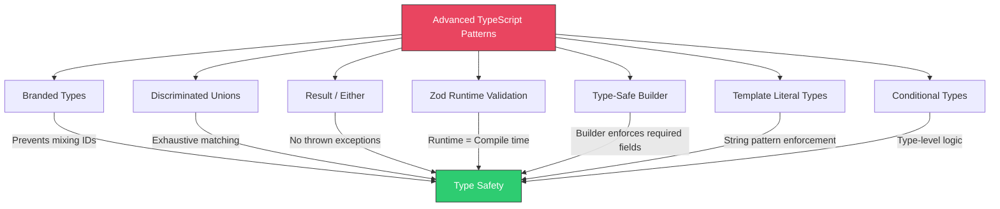
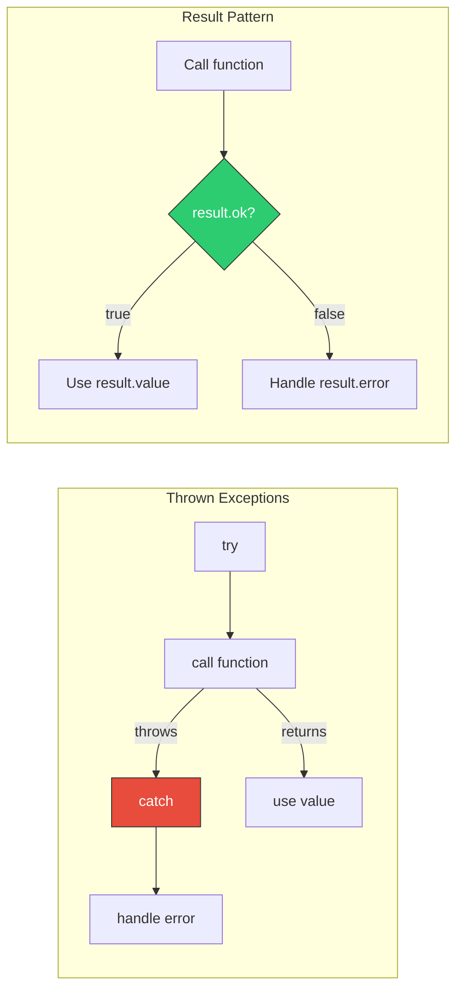
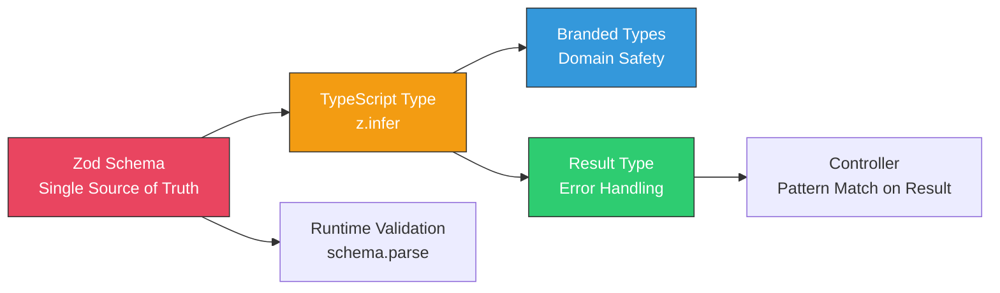

# TypeScript Patterns

## Overview

TypeScript's type system is one of the most powerful in mainstream programming. Beyond basic types, it offers advanced features that enable compile-time safety guarantees impossible in JavaScript. This guide covers branded/nominal types, discriminated unions, the Result/Either pattern, Zod for runtime validation, type-safe builders, template literal types, and conditional types — all patterns that come up in senior-level TypeScript interviews.



---

## 1. Branded Types (Nominal Typing)

TypeScript uses structural typing — two types with the same shape are interchangeable. Branded types add a phantom property to make types nominally distinct, preventing accidental mixing.

### The Problem

```typescript
// Without branded types — all strings are interchangeable
type UserId = string;
type OrderId = string;
type ProductId = string;

function getOrder(orderId: OrderId): Promise<Order> { /* ... */ }

const userId: UserId = "user-123";
const orderId: OrderId = "order-456";

// BUG: TypeScript allows this because both are just `string`
getOrder(userId); // No error! But this is a bug.
```

### The Fix: Branded Types

```typescript
// Brand symbol — unique per type
declare const brand: unique symbol;

// Generic brand type
type Brand<T, B extends string> = T & { readonly [brand]: B };

// Now these are distinct types at compile time
type UserId = Brand<string, "UserId">;
type OrderId = Brand<string, "OrderId">;
type ProductId = Brand<string, "ProductId">;

// Smart constructors validate and brand the value
function UserId(value: string): UserId {
  if (!value.startsWith("user-")) {
    throw new Error(`Invalid UserId: ${value}`);
  }
  return value as UserId;
}

function OrderId(value: string): OrderId {
  if (!value.startsWith("order-")) {
    throw new Error(`Invalid OrderId: ${value}`);
  }
  return value as OrderId;
}

// Type-safe functions
function getOrder(orderId: OrderId): Promise<Order> { /* ... */ }
function getUser(userId: UserId): Promise<User> { /* ... */ }

const userId = UserId("user-123");
const orderId = OrderId("order-456");

getOrder(orderId);  // OK
getOrder(userId);   // Compile ERROR: UserId is not assignable to OrderId

// More branded types for domain values
type Email = Brand<string, "Email">;
type PositiveNumber = Brand<number, "PositiveNumber">;
type NonEmptyString = Brand<string, "NonEmptyString">;
type Percentage = Brand<number, "Percentage">;

function Email(value: string): Email {
  const trimmed = value.trim().toLowerCase();
  if (!/^[^\s@]+@[^\s@]+\.[^\s@]+$/.test(trimmed)) {
    throw new Error(`Invalid email: ${value}`);
  }
  return trimmed as Email;
}

function PositiveNumber(value: number): PositiveNumber {
  if (value <= 0 || !Number.isFinite(value)) {
    throw new Error(`Expected positive number, got ${value}`);
  }
  return value as PositiveNumber;
}

function Percentage(value: number): Percentage {
  if (value < 0 || value > 100) {
    throw new Error(`Expected 0-100, got ${value}`);
  }
  return value as Percentage;
}
```

---

## 2. Discriminated Unions

Discriminated unions use a common literal property (the "discriminant") to enable exhaustive pattern matching. TypeScript narrows the type in each branch automatically.

```typescript
// Define a union with a discriminant property `type`
type Shape =
  | { type: "circle"; radius: number }
  | { type: "rectangle"; width: number; height: number }
  | { type: "triangle"; base: number; height: number };

// Exhaustive switch — TypeScript ensures all cases are handled
function area(shape: Shape): number {
  switch (shape.type) {
    case "circle":
      return Math.PI * shape.radius ** 2;
    case "rectangle":
      return shape.width * shape.height;
    case "triangle":
      return (shape.base * shape.height) / 2;
    // No default needed — TypeScript knows all cases are covered
  }
}

// Exhaustiveness helper — compile error if a case is missed
function assertNever(value: never): never {
  throw new Error(`Unexpected value: ${JSON.stringify(value)}`);
}

function describe(shape: Shape): string {
  switch (shape.type) {
    case "circle":
      return `Circle with radius ${shape.radius}`;
    case "rectangle":
      return `Rectangle ${shape.width}x${shape.height}`;
    case "triangle":
      return `Triangle with base ${shape.base}`;
    default:
      return assertNever(shape); // Compile error if a case is missing
  }
}
```

### Real-World: API Response Handling

```typescript
type ApiResponse<T> =
  | { status: "success"; data: T; timestamp: string }
  | { status: "error"; error: { code: string; message: string }; timestamp: string }
  | { status: "loading" }
  | { status: "idle" };

function renderUserProfile(response: ApiResponse<User>): string {
  switch (response.status) {
    case "idle":
      return "Click to load profile";
    case "loading":
      return "Loading...";
    case "success":
      return `Welcome, ${response.data.name}!`;
    case "error":
      return `Error: ${response.error.message} (${response.error.code})`;
  }
}

// Real-world: Redux-style actions
type UserAction =
  | { type: "USER_FETCH_START" }
  | { type: "USER_FETCH_SUCCESS"; payload: User }
  | { type: "USER_FETCH_ERROR"; error: string }
  | { type: "USER_UPDATE"; payload: Partial<User> }
  | { type: "USER_DELETE"; userId: string };

function userReducer(state: UserState, action: UserAction): UserState {
  switch (action.type) {
    case "USER_FETCH_START":
      return { ...state, loading: true, error: null };
    case "USER_FETCH_SUCCESS":
      return { ...state, loading: false, user: action.payload };
    case "USER_FETCH_ERROR":
      return { ...state, loading: false, error: action.error };
    case "USER_UPDATE":
      return { ...state, user: { ...state.user!, ...action.payload } };
    case "USER_DELETE":
      return { ...state, user: null };
  }
}
```

---

## 3. Result / Either Pattern

The Result pattern replaces thrown exceptions with a return type that explicitly represents success or failure. This makes error handling visible in the type system.

```typescript
// Result type — success or failure, never both
type Result<T, E = Error> =
  | { ok: true; value: T }
  | { ok: false; error: E };

// Helper constructors
function Ok<T>(value: T): Result<T, never> {
  return { ok: true, value };
}

function Err<E>(error: E): Result<never, E> {
  return { ok: false, error };
}

// Domain error types
type ValidationError = {
  type: "validation";
  field: string;
  message: string;
};

type NotFoundError = {
  type: "not_found";
  resource: string;
  id: string;
};

type ConflictError = {
  type: "conflict";
  message: string;
};

type UserError = ValidationError | NotFoundError | ConflictError;

// Use case returns Result instead of throwing
class RegisterUserUseCase {
  constructor(
    private userRepo: UserRepository,
    private hasher: PasswordHasher
  ) {}

  async execute(
    email: string,
    password: string,
    name: string
  ): Promise<Result<User, UserError>> {
    // Validation
    if (!email.includes("@")) {
      return Err({ type: "validation", field: "email", message: "Invalid email format" });
    }
    if (password.length < 8) {
      return Err({ type: "validation", field: "password", message: "Password too short" });
    }

    // Business rule: no duplicate emails
    const existing = await this.userRepo.findByEmail(email);
    if (existing) {
      return Err({ type: "conflict", message: "Email already registered" });
    }

    // Success path
    const hash = await this.hasher.hash(password);
    const user = await this.userRepo.save({ email, passwordHash: hash, name });
    return Ok(user);
  }
}

// Consumer MUST handle both cases — TypeScript enforces it
async function handleRegistration(req: Request, res: Response): Promise<void> {
  const result = await registerUser.execute(req.body.email, req.body.password, req.body.name);

  if (!result.ok) {
    // TypeScript narrows to the error type
    switch (result.error.type) {
      case "validation":
        res.status(422).json({ field: result.error.field, message: result.error.message });
        return;
      case "conflict":
        res.status(409).json({ message: result.error.message });
        return;
      case "not_found":
        res.status(404).json({ message: `${result.error.resource} not found` });
        return;
    }
  }

  // TypeScript knows result.value is User here
  res.status(201).json({ id: result.value.id, email: result.value.email });
}
```

### Chaining Results

```typescript
// Utility functions for working with Results
function mapResult<T, U, E>(result: Result<T, E>, fn: (value: T) => U): Result<U, E> {
  if (result.ok) return Ok(fn(result.value));
  return result;
}

async function flatMapResult<T, U, E>(
  result: Result<T, E>,
  fn: (value: T) => Promise<Result<U, E>>
): Promise<Result<U, E>> {
  if (result.ok) return fn(result.value);
  return result;
}

// Chaining example
async function processOrder(
  cartId: string,
  userId: string
): Promise<Result<OrderConfirmation, OrderError>> {
  const cartResult = await getCart(cartId);
  if (!cartResult.ok) return cartResult;

  const validationResult = validateCart(cartResult.value);
  if (!validationResult.ok) return validationResult;

  const paymentResult = await processPayment(validationResult.value, userId);
  if (!paymentResult.ok) return paymentResult;

  return createOrder(validationResult.value, paymentResult.value);
}
```

### Result Pattern Comparison



| Aspect | Thrown Exceptions | Result Pattern |
|--------|------------------|----------------|
| Error visibility in types | Hidden (not in function signature) | Explicit (in return type) |
| Forgetting to handle | Silent — no compile warning | Compile error if not checked |
| Performance | Expensive stack unwinding | Cheap object allocation |
| Control flow | Non-local jumps (catch can be far away) | Local, linear flow |
| Use when | Truly exceptional situations (out of memory, programmer errors) | Expected failures (validation, not found, conflict) |

---

## 4. Zod — Runtime Validation with Type Inference

Zod validates data at runtime and infers TypeScript types from schemas, ensuring runtime and compile-time types are always in sync.

```typescript
import { z } from "zod";

// Define schema — this IS the single source of truth
const UserSchema = z.object({
  id: z.string().uuid(),
  email: z.string().email(),
  name: z.string().min(1).max(100),
  age: z.number().int().min(0).max(150).optional(),
  role: z.enum(["admin", "user", "moderator"]),
  preferences: z.object({
    theme: z.enum(["light", "dark"]).default("light"),
    notifications: z.boolean().default(true),
    language: z.string().length(2).default("en"),
  }).optional(),
  tags: z.array(z.string()).max(10).default([]),
  createdAt: z.string().datetime(),
});

// Infer TypeScript type FROM the schema — no manual interface needed
type User = z.infer<typeof UserSchema>;
// Equivalent to:
// type User = {
//   id: string;
//   email: string;
//   name: string;
//   age?: number | undefined;
//   role: "admin" | "user" | "moderator";
//   preferences?: { theme: "light" | "dark"; notifications: boolean; language: string };
//   tags: string[];
//   createdAt: string;
// }

// Input schema (for creation — different from full schema)
const CreateUserSchema = UserSchema.omit({ id: true, createdAt: true }).extend({
  password: z.string().min(8).max(128),
  confirmPassword: z.string(),
}).refine(
  (data) => data.password === data.confirmPassword,
  { message: "Passwords do not match", path: ["confirmPassword"] }
);

type CreateUserInput = z.infer<typeof CreateUserSchema>;

// Update schema (all fields optional)
const UpdateUserSchema = UserSchema.omit({ id: true, createdAt: true }).partial();
type UpdateUserInput = z.infer<typeof UpdateUserSchema>;

// Using Zod with Express
function validateBody<T extends z.ZodType>(schema: T) {
  return (req: Request, res: Response, next: NextFunction) => {
    const result = schema.safeParse(req.body);
    if (!result.success) {
      res.status(422).json({
        type: "https://api.example.com/errors/validation",
        title: "Validation Failed",
        status: 422,
        errors: result.error.issues.map((issue) => ({
          field: issue.path.join("."),
          message: issue.message,
          code: issue.code,
        })),
      });
      return;
    }
    req.validatedBody = result.data;
    next();
  };
}

// Route handler — req.validatedBody is fully typed
app.post("/api/users", validateBody(CreateUserSchema), async (req, res) => {
  const input: CreateUserInput = req.validatedBody;
  // input.email is string, input.role is "admin" | "user" | "moderator"
  // TypeScript knows the exact shape
});
```

### Zod Advanced Patterns

```typescript
// Discriminated unions with Zod
const NotificationSchema = z.discriminatedUnion("channel", [
  z.object({
    channel: z.literal("email"),
    to: z.string().email(),
    subject: z.string(),
    body: z.string(),
  }),
  z.object({
    channel: z.literal("sms"),
    phoneNumber: z.string().regex(/^\+\d{10,15}$/),
    message: z.string().max(160),
  }),
  z.object({
    channel: z.literal("push"),
    deviceToken: z.string(),
    title: z.string(),
    body: z.string(),
  }),
]);

type Notification = z.infer<typeof NotificationSchema>;

// Transform + validate
const MoneySchema = z.object({
  amount: z.string().transform((val) => {
    const num = parseFloat(val);
    if (isNaN(num)) throw new Error("Invalid number");
    return Math.round(num * 100); // Convert to cents
  }),
  currency: z.string().length(3).toUpperCase(),
});

// Composing schemas
const PaginationSchema = z.object({
  page: z.coerce.number().int().min(1).default(1),
  limit: z.coerce.number().int().min(1).max(100).default(20),
  sortBy: z.string().optional(),
  sortOrder: z.enum(["asc", "desc"]).default("desc"),
});

const UserListQuerySchema = PaginationSchema.extend({
  role: z.enum(["admin", "user", "moderator"]).optional(),
  search: z.string().optional(),
});

app.get("/api/users", validateQuery(UserListQuerySchema), async (req, res) => {
  // req.validatedQuery has full type safety with defaults applied
});
```

---

## 5. Type-Safe Builder Pattern

A builder that uses TypeScript's type system to enforce required fields at compile time.

```typescript
// The target type
interface EmailConfig {
  from: string;
  to: string[];
  subject: string;
  body: string;
  cc?: string[];
  bcc?: string[];
  replyTo?: string;
  attachments?: Array<{ filename: string; content: Buffer }>;
}

// Track which required fields have been set using generics
type RequiredFields = "from" | "to" | "subject" | "body";

class EmailBuilder<Set extends string = never> {
  private config: Partial<EmailConfig> = {};

  from(address: string): EmailBuilder<Set | "from"> {
    this.config.from = address;
    return this as unknown as EmailBuilder<Set | "from">;
  }

  to(addresses: string[]): EmailBuilder<Set | "to"> {
    this.config.to = addresses;
    return this as unknown as EmailBuilder<Set | "to">;
  }

  subject(text: string): EmailBuilder<Set | "subject"> {
    this.config.subject = text;
    return this as unknown as EmailBuilder<Set | "subject">;
  }

  body(html: string): EmailBuilder<Set | "body"> {
    this.config.body = html;
    return this as unknown as EmailBuilder<Set | "body">;
  }

  cc(addresses: string[]): this {
    this.config.cc = addresses;
    return this;
  }

  bcc(addresses: string[]): this {
    this.config.bcc = addresses;
    return this;
  }

  replyTo(address: string): this {
    this.config.replyTo = address;
    return this;
  }

  // `build` is only available when ALL required fields are set
  build(this: EmailBuilder<RequiredFields>): EmailConfig {
    return this.config as EmailConfig;
  }
}

// Usage — type-safe at compile time
const email = new EmailBuilder()
  .from("noreply@example.com")
  .to(["alice@example.com"])
  .subject("Hello")
  .body("<h1>Hi!</h1>")
  .cc(["bob@example.com"])
  .build(); // OK — all required fields are set

// Compile ERROR — missing required fields
const incomplete = new EmailBuilder()
  .from("noreply@example.com")
  .subject("Hello")
  // .build(); // ERROR: Property 'build' does not exist on type EmailBuilder<"from" | "subject">
  // Missing: "to" and "body"
```

### Simpler Alternative: Required + Partial Options

```typescript
// Sometimes a builder is overkill — use this pattern instead

interface EmailRequired {
  from: string;
  to: string[];
  subject: string;
  body: string;
}

interface EmailOptions {
  cc?: string[];
  bcc?: string[];
  replyTo?: string;
  attachments?: Array<{ filename: string; content: Buffer }>;
}

function sendEmail(required: EmailRequired, options?: EmailOptions): Promise<void> {
  const config = { ...required, ...options };
  // Send email...
}

// TypeScript enforces required fields, allows optional ones
await sendEmail(
  { from: "a@b.com", to: ["c@d.com"], subject: "Hi", body: "Hello" },
  { cc: ["e@f.com"] }
);
```

---

## 6. Template Literal Types

Template literal types allow string pattern enforcement at the type level.

```typescript
// Basic template literal types
type EventName = `${"user" | "order" | "payment"}:${"created" | "updated" | "deleted"}`;
// = "user:created" | "user:updated" | "user:deleted"
//   | "order:created" | "order:updated" | "order:deleted"
//   | "payment:created" | "payment:updated" | "payment:deleted"

// Type-safe event emitter
type EventMap = {
  "user:created": { userId: string; email: string };
  "user:updated": { userId: string; changes: string[] };
  "user:deleted": { userId: string };
  "order:created": { orderId: string; total: number };
};

class TypedEventEmitter {
  private handlers = new Map<string, Set<Function>>();

  on<K extends keyof EventMap>(event: K, handler: (payload: EventMap[K]) => void): void {
    if (!this.handlers.has(event)) this.handlers.set(event, new Set());
    this.handlers.get(event)!.add(handler);
  }

  emit<K extends keyof EventMap>(event: K, payload: EventMap[K]): void {
    this.handlers.get(event)?.forEach((handler) => handler(payload));
  }
}

const emitter = new TypedEventEmitter();

emitter.on("user:created", (payload) => {
  // TypeScript knows payload is { userId: string; email: string }
  console.log(payload.email);
});

emitter.emit("user:created", { userId: "1", email: "a@b.com" }); // OK
// emitter.emit("user:created", { userId: "1" }); // ERROR: missing email

// CSS unit types
type CSSUnit = "px" | "rem" | "em" | "vh" | "vw" | "%";
type CSSValue = `${number}${CSSUnit}`;

function setWidth(value: CSSValue): void { /* ... */ }

setWidth("100px");  // OK
setWidth("2.5rem"); // OK
// setWidth("100");  // ERROR: not assignable to CSSValue
// setWidth("abc");  // ERROR

// API route patterns
type ApiRoute = `/api/v${number}/${string}`;

function registerRoute(route: ApiRoute): void { /* ... */ }

registerRoute("/api/v1/users");    // OK
registerRoute("/api/v2/orders");   // OK
// registerRoute("/users");         // ERROR

// String manipulation at the type level
type Uppercase<S extends string> = S extends `${infer First}${infer Rest}`
  ? `${Capitalize<First>}${Rest}`
  : S;

type PascalCase<S extends string> = S extends `${infer Head}_${infer Tail}`
  ? `${Capitalize<Head>}${PascalCase<Tail>}`
  : Capitalize<S>;

type Test1 = PascalCase<"hello_world">; // "HelloWorld"
type Test2 = PascalCase<"user_name">;   // "UserName"
```

---

## 7. Conditional Types for API Safety

Conditional types enable type-level logic — choosing types based on conditions.

```typescript
// Basic conditional type
type IsString<T> = T extends string ? true : false;

type A = IsString<"hello">;  // true
type B = IsString<42>;       // false

// Extract return type of async functions
type UnwrapPromise<T> = T extends Promise<infer U> ? U : T;

type C = UnwrapPromise<Promise<string>>; // string
type D = UnwrapPromise<number>;          // number

// Make specific fields required
type RequireFields<T, K extends keyof T> = T & Required<Pick<T, K>>;

interface UserProfile {
  name?: string;
  email?: string;
  avatar?: string;
  bio?: string;
}

type UserWithEmail = RequireFields<UserProfile, "email">;
// { name?: string; email: string; avatar?: string; bio?: string }

// Deep readonly
type DeepReadonly<T> = {
  readonly [P in keyof T]: T[P] extends object
    ? T[P] extends Function
      ? T[P]
      : DeepReadonly<T[P]>
    : T[P];
};

interface Config {
  database: {
    host: string;
    port: number;
    credentials: {
      username: string;
      password: string;
    };
  };
  features: string[];
}

type ReadonlyConfig = DeepReadonly<Config>;
// All nested properties are readonly

// Type-safe API client
type HttpMethod = "GET" | "POST" | "PUT" | "DELETE";

type ApiEndpoints = {
  "GET /users": { response: User[]; query: { role?: string } };
  "GET /users/:id": { response: User; params: { id: string } };
  "POST /users": { response: User; body: CreateUserInput };
  "PUT /users/:id": { response: User; params: { id: string }; body: UpdateUserInput };
  "DELETE /users/:id": { response: void; params: { id: string } };
};

type EndpointConfig<K extends keyof ApiEndpoints> = ApiEndpoints[K];

// Extract parts of the endpoint key
type ExtractMethod<K extends string> = K extends `${infer M} ${string}` ? M : never;
type ExtractPath<K extends string> = K extends `${string} ${infer P}` ? P : never;

async function apiCall<K extends keyof ApiEndpoints>(
  endpoint: K,
  config: Omit<EndpointConfig<K>, "response">
): Promise<EndpointConfig<K>["response"]> {
  const [method, path] = (endpoint as string).split(" ");
  // Build URL, substitute params, add query/body...
  const response = await fetch(path, { method });
  return response.json();
}

// Usage — fully type-safe
const users = await apiCall("GET /users", { query: { role: "admin" } });
// users is User[]

const user = await apiCall("POST /users", {
  body: { email: "a@b.com", password: "12345678", name: "Alice" },
});
// user is User

// Compile ERROR:
// await apiCall("GET /users", { body: {} });
// ERROR: 'body' does not exist on type for GET /users
```

### Mapped Types for CRUD Operations

```typescript
// Auto-generate CRUD types from a base entity
type CrudTypes<Entity, IdField extends keyof Entity = "id"> = {
  Create: Omit<Entity, IdField | "createdAt" | "updatedAt">;
  Update: Partial<Omit<Entity, IdField | "createdAt" | "updatedAt">>;
  Response: Entity;
  ListResponse: {
    data: Entity[];
    total: number;
    page: number;
    limit: number;
  };
};

interface Product {
  id: string;
  name: string;
  price: number;
  category: string;
  inStock: boolean;
  createdAt: Date;
  updatedAt: Date;
}

type ProductCrud = CrudTypes<Product>;
// ProductCrud.Create = { name: string; price: number; category: string; inStock: boolean }
// ProductCrud.Update = { name?: string; price?: number; category?: string; inStock?: boolean }
// ProductCrud.Response = Product
// ProductCrud.ListResponse = { data: Product[]; total: number; page: number; limit: number }
```

---

## Pattern Comparison Table

| Pattern | Problem It Solves | Complexity | When to Use |
|---------|-------------------|------------|-------------|
| Branded Types | Prevents mixing structurally identical types | Low | ID types, domain values, units |
| Discriminated Unions | Exhaustive type-safe handling of variants | Low | State machines, API responses, events |
| Result/Either | Makes error handling explicit in types | Medium | Use case return types, replacing thrown exceptions |
| Zod | Runtime validation matches compile-time types | Low | API input validation, config parsing |
| Type-Safe Builder | Enforces required fields at compile time | High | Complex object construction |
| Template Literal Types | String pattern enforcement at type level | Medium | Event names, CSS values, route patterns |
| Conditional Types | Type-level programming and inference | High | Generic utilities, API clients, CRUD type generation |

---

## Combined Pattern: Full-Stack Type Safety



```typescript
// Zod schema defines the shape + validation
const CreateOrderSchema = z.object({
  items: z.array(z.object({
    productId: z.string().uuid(),
    quantity: z.number().int().positive(),
  })).min(1),
  shippingAddressId: z.string().uuid(),
});

// Type is inferred
type CreateOrderInput = z.infer<typeof CreateOrderSchema>;

// Branded type for the order ID
type OrderId = Brand<string, "OrderId">;

// Result type for the use case
type OrderError =
  | { type: "validation"; errors: z.ZodIssue[] }
  | { type: "not_found"; resource: string; id: string }
  | { type: "insufficient_stock"; productId: string };

// Use case combines everything
class CreateOrderUseCase {
  async execute(raw: unknown): Promise<Result<{ orderId: OrderId }, OrderError>> {
    // 1. Zod validates at runtime
    const parsed = CreateOrderSchema.safeParse(raw);
    if (!parsed.success) {
      return Err({ type: "validation", errors: parsed.error.issues });
    }

    // 2. Business logic with branded types
    const input = parsed.data;
    for (const item of input.items) {
      const stock = await this.inventory.check(item.productId);
      if (stock < item.quantity) {
        return Err({ type: "insufficient_stock", productId: item.productId });
      }
    }

    // 3. Create order with branded ID
    const orderId = OrderId(crypto.randomUUID());
    await this.orderRepo.create(orderId, input);

    return Ok({ orderId });
  }
}

// Controller pattern-matches on the Result
app.post("/api/orders", async (req, res) => {
  const result = await createOrder.execute(req.body);

  if (!result.ok) {
    switch (result.error.type) {
      case "validation":
        return res.status(422).json({ errors: result.error.errors });
      case "not_found":
        return res.status(404).json({ message: `${result.error.resource} not found` });
      case "insufficient_stock":
        return res.status(409).json({ message: "Insufficient stock", productId: result.error.productId });
    }
  }

  res.status(201).json({ orderId: result.value.orderId });
});
```

---

## Interview Q&A

> **Q: What are branded types and when would you use them?**
>
> A: Branded types add a phantom property to a type to make it nominally distinct even if its underlying structure is the same. In TypeScript, `string` is `string` — a `UserId` and `OrderId` are both strings and are interchangeable. With branding, `UserId` and `OrderId` become incompatible types even though both are strings. I use them for entity IDs (preventing passing a user ID where an order ID is expected), domain values (Email, Money, Percentage), and any situation where two structurally identical types should not be mixed. The runtime cost is zero — brands exist only at compile time.

> **Q: Why use the Result pattern instead of try/catch?**
>
> A: The Result pattern makes failure an explicit part of the function's return type, so the caller is forced by the compiler to handle it. With try/catch, the function signature does not indicate what errors it can throw — you have to read the implementation or documentation to know. The Result pattern also keeps control flow linear (no non-local jumps), makes error handling composable with mapping and chaining, and is cheaper than throwing exceptions (no stack unwinding). I still use try/catch for truly unexpected errors (out of memory, programmer bugs) but use Result for expected business failures like validation errors or not-found cases.

> **Q: How does Zod solve the "two sources of truth" problem?**
>
> A: Without Zod, you write a TypeScript interface for compile-time checks AND separate validation logic for runtime checks. These can drift apart — someone updates the interface but forgets the validator, or vice versa. Zod eliminates this by making the schema the single source of truth. You define the schema once, and TypeScript types are inferred from it using `z.infer<typeof schema>`. The schema handles both compile-time type checking and runtime validation. This guarantees that if a value passes `schema.parse()`, it matches the inferred type exactly.

> **Q: Explain discriminated unions and why they are useful for error handling.**
>
> A: Discriminated unions are TypeScript union types where each member has a common literal property (the "discriminant"). When you switch on the discriminant, TypeScript automatically narrows the type in each branch. For error handling, I define error types as a discriminated union: `{ type: "validation"; field: string } | { type: "not_found"; id: string } | { type: "conflict"; message: string }`. In the error handler, switching on `error.type` gives me full type narrowing in each case. The `assertNever` helper function ensures exhaustiveness — if I add a new error type, the compiler immediately tells me every place that needs updating.

> **Q: What are conditional types and how do you use them in practice?**
>
> A: Conditional types are type-level ternary expressions: `T extends U ? X : Y`. They enable type-level programming — making type decisions based on other types. In practice, I use them for: (1) utility types like `UnwrapPromise<T>` that extracts the inner type from `Promise<T>`, (2) auto-generating CRUD types from entity definitions (`CrudTypes<Product>` generates Create, Update, and Response types automatically), (3) building type-safe API clients where the endpoint string determines the request and response types, and (4) creating `DeepReadonly` or `DeepPartial` recursive types. They are powerful but should be used sparingly — overly complex conditional types hurt readability.

> **Q: How would you implement type-safe routing in an Express application?**
>
> A: I combine template literal types with mapped types. First, I define an endpoint map: `{ "GET /users": { response: User[] }; "POST /users": { body: CreateUserInput; response: User } }`. Then I create a typed wrapper function that extracts the method and path from the key, infers the expected body/query/response types, and validates them. At the route handler level, `req.body` is automatically typed based on the route. For runtime safety, I pair this with Zod schemas that validate the actual request data matches the compile-time type. This gives both compile-time type safety for development and runtime validation for production.
