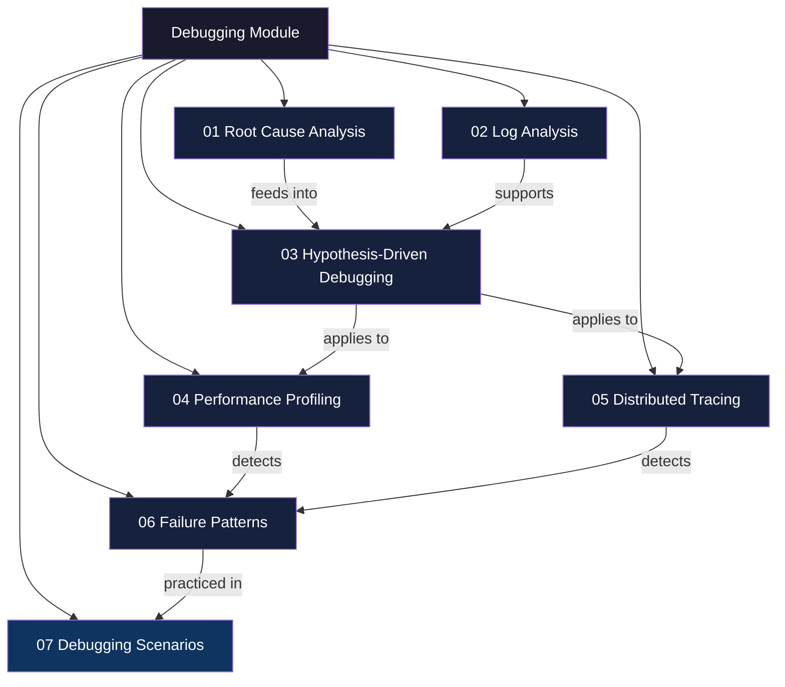
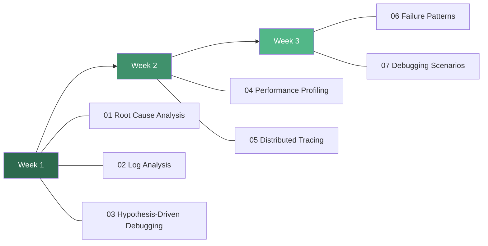

# Debugging — Study Guide

## Overview

This module covers the full spectrum of debugging skills expected in senior/staff engineering interviews: from structured root cause analysis to distributed tracing and real-world failure pattern recognition. Every topic includes TypeScript/Node.js examples and interview-ready Q&A.

---

## Module Map

## Recommended Study Order

**Rationale:** Start with foundational thinking frameworks (RCA, logs, hypothesis-driven), then layer on tooling (profiling, tracing), and finally integrate everything into pattern recognition and scenario walkthroughs.

---

## Topic Table

| # | Topic | Key Concepts | Difficulty | Est. Time |
|---|-------|-------------|------------|-----------|
| 01 | Root Cause Analysis | 5 Whys, Fishbone, Fault Trees | Medium | 2 hrs |
| 02 | Log Analysis | Structured logging, ELK, correlation | Medium | 2.5 hrs |
| 03 | Hypothesis-Driven Debugging | Scientific method, bisect, isolation | Medium | 2 hrs |
| 04 | Performance Profiling | Flame graphs, CPU/memory, clinic.js | Hard | 3 hrs |
| 05 | Distributed Tracing | OpenTelemetry, spans, sampling | Hard | 3 hrs |
| 06 | Failure Patterns | Memory leaks, cascading failures, circuit breakers | Hard | 3 hrs |
| 07 | Debugging Scenarios | 8-10 guided walkthroughs | Hard | 4 hrs |

**Total estimated study time: ~19.5 hours**

---

## Progress Tracker

| # | Topic | Read | Notes | Practice | Confident |
|---|-------|:----:|:-----:|:--------:|:---------:|
| 01 | Root Cause Analysis | [ ] | [ ] | [ ] | [ ] |
| 02 | Log Analysis | [ ] | [ ] | [ ] | [ ] |
| 03 | Hypothesis-Driven Debugging | [ ] | [ ] | [ ] | [ ] |
| 04 | Performance Profiling | [ ] | [ ] | [ ] | [ ] |
| 05 | Distributed Tracing | [ ] | [ ] | [ ] | [ ] |
| 06 | Failure Patterns | [ ] | [ ] | [ ] | [ ] |
| 07 | Debugging Scenarios | [ ] | [ ] | [ ] | [ ] |

---

## How to Use This Module

1. **Read each `concepts.md`** in study order above.
2. **Work through the interview Q&A** sections — practice answering aloud before reading the answer.
3. **Trace through the mermaid diagrams** — redraw them on a whiteboard from memory.
4. **Complete the debugging scenarios** (topic 07) last — they integrate everything.
5. **Mark your progress** in the tracker above after each topic.
