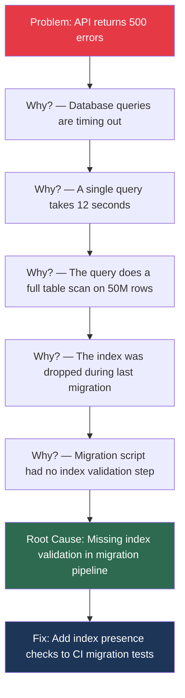
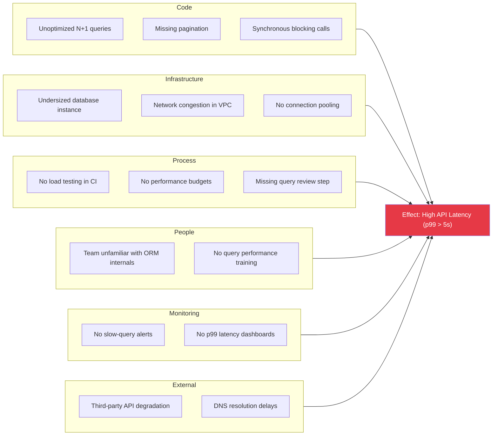
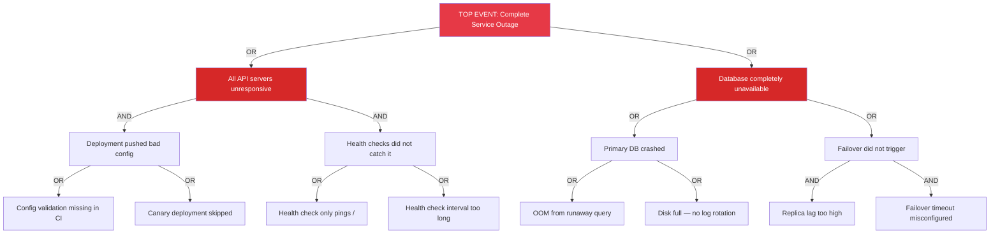

# Root Cause Analysis (RCA)

## What Is Root Cause Analysis?

Root Cause Analysis is a systematic process for identifying the fundamental reason a problem occurred, rather than merely treating its symptoms. In software engineering, RCA is applied after incidents, production outages, and recurring bugs to prevent recurrence.

The core principle: **fix the system, not just the symptom.**

---

## RCA Frameworks

### 1. The 5 Whys

The simplest and most commonly used RCA technique. You ask "why?" iteratively until you reach the root cause. Originated from the Toyota Production System.



**When to use:** Quick incidents, straightforward cause chains, post-mortem meetings, when you need a fast framework to structure your thinking.

**Limitations:**
- Can oversimplify complex problems with multiple contributing causes
- Tends toward a single linear chain when reality is more like a web
- Quality depends entirely on the team's domain knowledge
- Can stop too early or go too deep

**Best practices:**
- Do not accept "human error" as a root cause — ask why the system allowed the error
- Involve the people closest to the incident
- Write each "why" as a factual, verifiable statement
- Aim for 3-7 levels; fewer than 3 is usually too shallow

#### TypeScript Example: Automated 5 Whys Documentation

```typescript
interface WhyEntry {
  level: number;
  question: string;
  answer: string;
  evidence: string; // logs, metrics, code references
}

interface FiveWhysAnalysis {
  incident: string;
  date: string;
  participants: string[];
  chain: WhyEntry[];
  rootCause: string;
  correctives: CorrectiveAction[];
}

interface CorrectiveAction {
  action: string;
  owner: string;
  deadline: string;
  type: "immediate" | "preventive" | "systemic";
}

function validate5Whys(analysis: FiveWhysAnalysis): string[] {
  const warnings: string[] = [];

  if (analysis.chain.length < 3) {
    warnings.push("Analysis may be too shallow — fewer than 3 levels.");
  }

  if (analysis.chain.length > 7) {
    warnings.push("Analysis may be too deep — consider if the root cause was passed.");
  }

  const hasHumanError = analysis.chain.some(
    (entry) =>
      entry.answer.toLowerCase().includes("human error") ||
      entry.answer.toLowerCase().includes("someone forgot")
  );

  if (hasHumanError) {
    warnings.push(
      '"Human error" is not a root cause. Ask why the system allowed it.'
    );
  }

  if (analysis.correctives.length === 0) {
    warnings.push("No corrective actions defined.");
  }

  const hasPreventive = analysis.correctives.some(
    (c) => c.type === "preventive" || c.type === "systemic"
  );
  if (!hasPreventive) {
    warnings.push("No preventive/systemic actions — only immediate fixes.");
  }

  return warnings;
}
```

---

### 2. Fishbone Diagram (Ishikawa Diagram)

A cause-and-effect diagram that categorizes potential causes into major categories. Originally designed for manufacturing, adapted for software with the categories below.



**Software-adapted categories (the "6 Ms" equivalent):**

| Category | Manufacturing Origin | Software Equivalent | Example |
|----------|---------------------|---------------------|---------|
| Method | Process | Code / Architecture | N+1 queries, missing caching |
| Machine | Equipment | Infrastructure | Undersized instances, network |
| Material | Raw materials | Data / Dependencies | Corrupt data, bad third-party input |
| Measurement | Inspection | Monitoring / Observability | Missing alerts, wrong metrics |
| Man | Workforce | People / Knowledge | Knowledge gaps, understaffing |
| Mother Nature | Environment | External Factors | Cloud provider outages, DNS |

**When to use:** Complex problems with multiple contributing factors, brainstorming sessions, when you suspect the cause is not purely technical.

**Best practices:**
- Populate all categories even if some seem unlikely — it forces breadth
- Use during group sessions; individual fishbones tend to have blind spots
- Rank causes by likelihood and impact after brainstorming
- Combine with 5 Whys on the most likely cause branch

---

### 3. Fault Tree Analysis (FTA)

A top-down, deductive analysis using Boolean logic (AND/OR gates) to model how combinations of failures lead to a top-level event. More rigorous than fishbone; used for critical systems.



**Key concepts:**
- **OR gate:** The parent event occurs if ANY child event occurs (single point of failure)
- **AND gate:** The parent event occurs only if ALL child events occur simultaneously (defense in depth)
- **Basic event:** A leaf node — an atomic failure with a known probability
- **Minimal cut set:** The smallest combination of basic events that causes the top event

**When to use:** Safety-critical systems, high-severity incident post-mortems, when you need to reason about combinations of failures, SLA/reliability engineering.

**Best practices:**
- Start from the top-level failure and decompose downward
- Label every gate as AND or OR explicitly
- Identify minimal cut sets — those are your highest-priority fixes
- Use probabilities if available to quantify risk

---

## Framework Comparison

| Dimension | 5 Whys | Fishbone | Fault Tree |
|-----------|--------|----------|------------|
| Complexity | Low | Medium | High |
| Time to complete | 15-30 min | 30-60 min | 1-4 hrs |
| Best for | Single-cause chains | Multi-factor brainstorming | Critical system failures |
| Output | Linear cause chain | Categorized cause map | Boolean logic tree |
| Team size | 1-3 people | 3-8 people | 2-5 people (specialists) |
| Rigor | Low-medium | Medium | High |
| Risk of bias | High (anchoring) | Medium | Low |
| Quantitative? | No | No | Yes (with probabilities) |
| Common in interviews? | Very common | Common | Occasionally asked |

---

## Documenting RCA Findings

A good RCA document (often part of a post-mortem) should include:

```typescript
interface RCADocument {
  // Header
  title: string;
  severity: "SEV0" | "SEV1" | "SEV2" | "SEV3";
  date: string;
  duration: string; // time to resolve
  authors: string[];

  // Timeline
  timeline: {
    timestamp: string;
    event: string;
    actor: "system" | "human" | "external";
  }[];

  // Impact
  impact: {
    usersAffected: number;
    revenueImpact: string;
    slaViolation: boolean;
    dataLoss: boolean;
  };

  // Analysis
  rootCause: string;
  contributingFactors: string[];
  methodUsed: "5-whys" | "fishbone" | "fault-tree" | "combination";

  // Actions
  actions: {
    description: string;
    type: "immediate-fix" | "short-term" | "long-term";
    owner: string;
    jiraTicket: string;
    deadline: string;
    status: "open" | "in-progress" | "done";
  }[];

  // Lessons
  lessonsLearned: string[];
  whatWentWell: string[];
}
```

**Key principles for documentation:**
- Blameless — focus on systems, not individuals
- Include a detailed timeline with timestamps
- Separate the immediate fix from the systemic fix
- Track action items to completion — incomplete follow-ups are the #1 reason incidents recur
- Share broadly — the value of a post-mortem is organizational learning

---

## Real-World RCA Example: Cascading Timeout

**Incident:** Payment service returning 504 Gateway Timeout for 40% of requests during peak traffic.

### 5 Whys Analysis

1. **Why are payments failing?** The payment service returns 504 before the upstream payment processor responds.
2. **Why does the upstream take so long?** Our retry logic sends 3 retries with no backoff, tripling load on the processor.
3. **Why is there no backoff?** The retry configuration was hardcoded 2 years ago and never revisited.
4. **Why was it not caught?** Load tests only run with 10x less traffic than peak.
5. **Why are load tests underscaled?** No one updated the load test profile after the 8x user growth last year.

**Root cause:** Load test profiles not tied to actual traffic patterns.

**Corrective actions:**
- Immediate: Add exponential backoff with jitter to retry config
- Short-term: Update load test to use production traffic replay
- Long-term: Auto-generate load test profiles from production traffic metrics

---

## Interview Q&A

> **Q: You're in a post-mortem meeting and someone says "the developer made a mistake." How do you redirect this?**
>
> A: I would acknowledge the observation but reframe it systemically. "Human error" is never a root cause — it's a starting point. I'd ask: "What about our system allowed this mistake to happen? Could a different developer have made the same mistake?" This leads to actionable fixes: better code review checklists, automated validation, guardrails in CI/CD, or improved documentation. The goal is to make the right thing easy and the wrong thing hard.

> **Q: When would you choose a fault tree over the 5 Whys?**
>
> A: I'd use a fault tree when the failure required multiple things to go wrong simultaneously (AND conditions), when I need to reason about the probability of recurrence, or when the system is safety-critical (payments, healthcare). The 5 Whys works great for linear cause chains, but fault trees capture the combinatorial nature of complex system failures. For example, "the deploy was bad AND the canary didn't catch it AND the rollback was broken" is a natural fault tree.

> **Q: How do you ensure RCA action items actually get completed?**
>
> A: Three practices: (1) Every action item gets a JIRA ticket with an owner and deadline before the post-mortem meeting ends. (2) We review open post-mortem action items in weekly engineering sync — they're treated with the same priority as feature work. (3) We tag action items by type (immediate/short-term/long-term) and track completion rate as a team metric. If we're consistently failing to close long-term items, that's a signal we need to allocate dedicated time.

> **Q: Walk me through how you'd structure an RCA for a production database outage.**
>
> A: First, I'd establish a precise timeline from monitoring data — when did metrics first deviate, when were alerts fired, when did humans engage, when was service restored? Then I'd gather evidence: slow query logs, resource utilization graphs, deployment history, config changes. I'd start with the 5 Whys to trace the immediate cause chain, then switch to a fishbone to check for contributing factors we might have missed (monitoring gaps, process gaps, knowledge gaps). Finally, I'd categorize corrective actions into immediate (restore service), short-term (prevent this specific failure), and long-term (prevent this class of failure). The document gets shared with the whole engineering org.

> **Q: What's the difference between a root cause and a contributing factor?**
>
> A: The root cause is the single most actionable point in the cause chain — if you fix it, this specific incident would not have occurred. Contributing factors are conditions that made the incident more likely or more severe, but alone would not have caused it. For example, root cause: "a migration dropped a critical index." Contributing factor: "we had no slow query alerting, so it went undetected for 3 hours." Both need fixes, but the distinction helps prioritize.

> **Q: How do you handle RCA when the root cause spans multiple teams?**
>
> A: I facilitate a joint post-mortem with representatives from each team. I use a fishbone diagram because it naturally separates concerns by category (infrastructure vs. code vs. process). Each team owns the branches in their domain. The key is establishing a shared timeline first — disagreements about "what happened" usually dissolve once everyone sees the same timestamped evidence. Action items are assigned to specific teams with cross-team dependencies explicitly called out.
