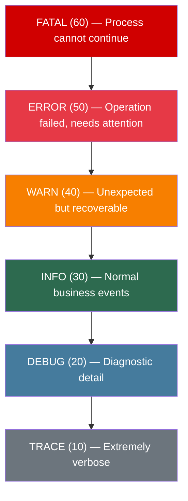
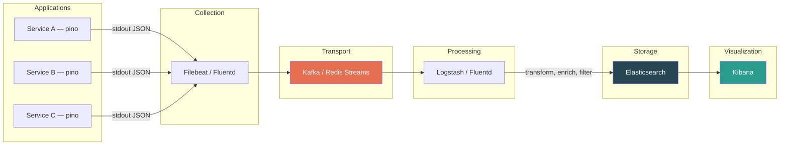
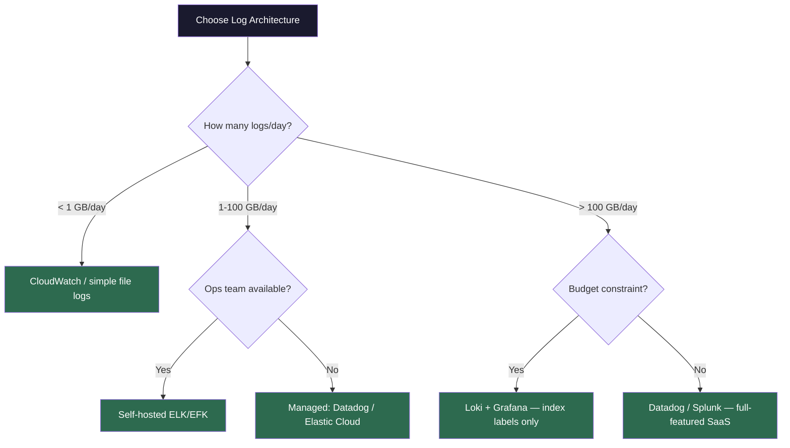

# Log Analysis

## Why Logs Matter

Logs are the most fundamental observability signal. Unlike metrics (which tell you *what* is happening) and traces (which tell you *where* it's happening), logs tell you *why* it's happening. Every production debugging session begins or ends with log analysis.

---

## Structured vs. Unstructured Logging

### Unstructured Logging (Legacy)

```typescript
// Bad: unstructured, unparseable, inconsistent
console.log("User 12345 failed to login");
console.log("Error: connection timeout after 30s for db-primary");
console.log(`[${new Date().toISOString()}] Payment processed: $49.99`);
```

Problems:
- No consistent format; every developer writes logs differently
- Impossible to query programmatically (regex-only parsing)
- No machine-readable fields for filtering or aggregation
- Context is lost (which request? which server? which deployment?)

### Structured Logging (Modern)

```typescript
import pino from "pino";

const logger = pino({
  level: process.env.LOG_LEVEL || "info",
  formatters: {
    level: (label) => ({ level: label }),
  },
  base: {
    service: "payment-service",
    version: process.env.APP_VERSION,
    environment: process.env.NODE_ENV,
  },
});

// Good: structured, queryable, consistent
logger.info(
  {
    userId: "12345",
    action: "login_failed",
    reason: "invalid_credentials",
    attempts: 3,
    ip: "192.168.1.100",
    requestId: "req-abc-123",
  },
  "User login failed after max attempts"
);

// Output (JSON):
// {
//   "level": "info",
//   "time": 1709312400000,
//   "service": "payment-service",
//   "version": "2.4.1",
//   "environment": "production",
//   "userId": "12345",
//   "action": "login_failed",
//   "reason": "invalid_credentials",
//   "attempts": 3,
//   "ip": "192.168.1.100",
//   "requestId": "req-abc-123",
//   "msg": "User login failed after max attempts"
// }
```

### Comparison Table

| Dimension | Unstructured | Structured (JSON) |
|-----------|-------------|-------------------|
| Format | Free text | Consistent key-value JSON |
| Parseability | Regex / manual | Native JSON query |
| Query speed | Slow (full-text scan) | Fast (indexed fields) |
| Storage efficiency | Lower (no compression patterns) | Higher (field-level compression) |
| Correlation | Manual (grep for IDs) | Automatic (requestId, traceId) |
| Dashboarding | Difficult | Native (Kibana, Grafana) |
| Adoption effort | None | Requires logging library setup |
| Node.js libraries | console.log | pino, winston, bunyan |

---

## Log Levels



| Level | When to Use | Example | Production? |
|-------|------------|---------|-------------|
| FATAL | Process is crashing, cannot recover | Uncaught exception, out of memory | Yes (alert immediately) |
| ERROR | Operation failed, user/system impacted | Payment charge failed, DB write error | Yes (alert on threshold) |
| WARN | Something unexpected but handled | Retry succeeded on 2nd attempt, deprecated API called | Yes (review periodically) |
| INFO | Normal significant business events | User registered, order placed, deployment started | Yes (primary operational log) |
| DEBUG | Developer diagnostic information | SQL query text, request/response bodies, cache hit/miss | Staging only (or sampled) |
| TRACE | Extremely fine-grained flow detail | Function entry/exit, variable values | Development only |

### Best Practice: Log Level Configuration in Node.js

```typescript
import pino from "pino";

// Per-environment log level with runtime override capability
const logger = pino({
  level: process.env.LOG_LEVEL || (
    process.env.NODE_ENV === "production" ? "info" :
    process.env.NODE_ENV === "staging" ? "debug" :
    "trace"
  ),
});

// Dynamic log level change (useful for debugging production without restart)
// Via admin API endpoint:
// POST /admin/log-level { "level": "debug", "duration": "5m" }
function setTemporaryLogLevel(
  logger: pino.Logger,
  level: string,
  durationMs: number
): void {
  const originalLevel = logger.level;
  logger.level = level;
  logger.warn(
    { originalLevel, newLevel: level, durationMs },
    "Log level temporarily changed"
  );

  setTimeout(() => {
    logger.level = originalLevel;
    logger.warn(
      { restoredLevel: originalLevel },
      "Log level restored to original"
    );
  }, durationMs);
}
```

---

## Log Aggregation Pipeline



### ELK Stack Components

| Component | Role | What It Does |
|-----------|------|--------------|
| **Elasticsearch** | Storage + Search | Distributed search engine; indexes JSON logs; supports full-text and structured queries |
| **Logstash** | Processing | Ingests from multiple sources, transforms (grok, mutate, geoip), outputs to Elasticsearch |
| **Kibana** | Visualization | Dashboards, log explorer, alerting, saved queries |
| **Filebeat** | Collection | Lightweight shipper; tails log files or reads stdout; handles backpressure |
| **Kafka** (optional) | Buffer | Decouples producers from consumers; handles traffic spikes; enables replay |

### Alternative Stacks

| Stack | Components | Strengths |
|-------|-----------|-----------|
| ELK | Elasticsearch + Logstash + Kibana | Mature, powerful querying, large ecosystem |
| EFK | Elasticsearch + Fluentd + Kibana | Fluentd is lighter than Logstash, CNCF native |
| Loki + Grafana | Loki + Grafana | Cost-effective (indexes labels only, not content), integrates with Prometheus |
| Datadog | SaaS | Zero ops, correlated with metrics/traces, expensive at scale |
| CloudWatch | AWS native | No setup in AWS, limited querying vs. Elasticsearch |

---

## Log Correlation

Correlation is the ability to connect logs across services for a single user request.

### Correlation ID Pattern

```typescript
import { randomUUID } from "crypto";
import { Request, Response, NextFunction } from "express";
import pino from "pino";

const logger = pino({ level: "info" });

// Middleware: extract or generate correlation IDs
function correlationMiddleware(
  req: Request,
  res: Response,
  next: NextFunction
): void {
  // Propagate from upstream or generate new
  const requestId = req.headers["x-request-id"] as string || randomUUID();
  const correlationId = req.headers["x-correlation-id"] as string || requestId;

  // Attach to request for downstream use
  req.requestId = requestId;
  req.correlationId = correlationId;

  // Create child logger with correlation context
  req.log = logger.child({
    requestId,
    correlationId,
    method: req.method,
    path: req.path,
    userAgent: req.headers["user-agent"],
  });

  // Set response headers for traceability
  res.setHeader("X-Request-Id", requestId);
  res.setHeader("X-Correlation-Id", correlationId);

  // Log request start
  req.log.info("Request started");

  // Log request completion
  const startTime = Date.now();
  res.on("finish", () => {
    req.log.info(
      {
        statusCode: res.statusCode,
        durationMs: Date.now() - startTime,
      },
      "Request completed"
    );
  });

  next();
}

// Usage in downstream service call
async function callInventoryService(
  productId: string,
  requestId: string,
  correlationId: string
): Promise<InventoryResponse> {
  const response = await fetch(`https://inventory.internal/api/stock/${productId}`, {
    headers: {
      "X-Request-Id": randomUUID(), // new request ID for this hop
      "X-Correlation-Id": correlationId, // same correlation ID across all hops
    },
  });
  return response.json();
}
```

### Correlation ID vs. Request ID vs. Trace ID

| ID Type | Scope | Generated By | Purpose |
|---------|-------|-------------|---------|
| Request ID | Single service hop | Each service | Identify a specific request within one service |
| Correlation ID | Entire request chain | Origin service (API gateway) | Correlate logs across all services for one user action |
| Trace ID | Entire distributed trace | Tracing library (OpenTelemetry) | Link spans in distributed tracing systems |

---

## Node.js Logging Best Practices

### 1. Use pino (fastest Node.js logger)

```typescript
// pino is 5-10x faster than winston due to:
// - Low-overhead serialization
// - Asynchronous destination writes
// - No string interpolation at log time

import pino from "pino";

const logger = pino({
  level: "info",
  // Redact sensitive fields automatically
  redact: {
    paths: [
      "req.headers.authorization",
      "req.headers.cookie",
      "password",
      "ssn",
      "creditCard",
    ],
    censor: "[REDACTED]",
  },
  // Serialize errors properly (stack traces, cause chains)
  serializers: {
    err: pino.stdSerializers.err,
    req: pino.stdSerializers.req,
    res: pino.stdSerializers.res,
  },
});
```

### 2. Log Context, Not Messages

```typescript
// Bad: information locked in unstructured string
logger.info(`User ${userId} purchased ${productName} for $${price}`);

// Good: all fields are queryable
logger.info(
  { userId, productName, price, currency: "USD", orderId },
  "Purchase completed"
);
```

### 3. Log at Service Boundaries

```typescript
// Log incoming requests
// Log outgoing calls (HTTP, DB, queue)
// Log business events (user signup, payment, etc.)
// Log errors with full context

async function processOrder(order: Order, log: pino.Logger): Promise<void> {
  const orderLog = log.child({ orderId: order.id, userId: order.userId });

  orderLog.info({ items: order.items.length }, "Processing order");

  try {
    const payment = await chargePayment(order, orderLog);
    orderLog.info({ paymentId: payment.id }, "Payment charged");

    await updateInventory(order, orderLog);
    orderLog.info("Inventory updated");

    await sendConfirmation(order, orderLog);
    orderLog.info("Confirmation sent");
  } catch (err) {
    orderLog.error({ err, stage: "order_processing" }, "Order processing failed");
    throw err;
  }
}
```

### 4. Never Log Sensitive Data

```typescript
// NEVER log: passwords, tokens, credit cards, SSNs, PII
// Use pino's redact option (shown above) as a safety net
// But the primary defense is discipline: review logs in code review

// Bad
logger.info({ user: { email, password, ssn } }, "User created");

// Good
logger.info(
  { userId: user.id, email: user.email, plan: user.plan },
  "User created"
);
```

---

## Querying Logs Effectively

### Elasticsearch / Kibana Query Examples

```
# Find all errors for a specific request chain
correlationId: "abc-123" AND level: "error"

# Find slow requests (>2 seconds)
durationMs: >2000 AND service: "payment-service"

# Find failed login attempts from a specific IP range
action: "login_failed" AND ip: 192.168.1.*

# Find errors in the last hour excluding known flaky test
level: "error" AND NOT msg: "flaky_health_check" AND @timestamp > now-1h

# Aggregate: top 10 error messages in the last 24 hours
# (Use Kibana visualization, not raw query)
```

### Using jq for Local Log Analysis

```bash
# Parse pino JSON logs from a file
cat app.log | jq 'select(.level == "error")'

# Count errors by message
cat app.log | jq -r 'select(.level == 50) | .msg' | sort | uniq -c | sort -rn

# Find all logs for a specific correlation ID
cat app.log | jq 'select(.correlationId == "abc-123")'

# Calculate p99 response time
cat app.log | jq 'select(.durationMs != null) | .durationMs' | sort -n | tail -1
```

---

## Log Aggregation Architecture Decision



---

## Interview Q&A

> **Q: Why would you choose pino over winston for a high-throughput Node.js service?**
>
> A: pino is 5-10x faster than winston in benchmarks because it uses low-overhead JSON serialization, avoids string formatting at log time, and supports asynchronous writes to destinations. In a high-throughput service handling thousands of requests per second, logger overhead directly impacts latency. Winston is more flexible (custom transports, multiple formats) but that flexibility has a performance cost. For production services where every millisecond matters, pino is the standard choice. Winston is fine for lower-throughput services or CLI tools where developer ergonomics matter more than speed.

> **Q: How would you debug an issue that spans 5 microservices using logs alone (no tracing)?**
>
> A: I'd rely on correlation IDs. The API gateway or first service generates a correlation ID and propagates it via HTTP headers (X-Correlation-Id) to every downstream service. Each service includes this ID in every log line. To debug, I'd search for that correlation ID across all services in Kibana, sort by timestamp, and reconstruct the request flow. The key prerequisite is that every service logs the correlation ID consistently — this is why structured logging standards and shared middleware matter. Without correlation IDs, you're stuck matching timestamps and hoping for the best.

> **Q: Your Elasticsearch cluster is running out of disk. What do you do?**
>
> A: Short-term: implement index lifecycle management (ILM) policies — hot/warm/cold/delete tiers. Move old indices to cheaper storage and delete logs older than your retention policy (e.g., 30 days for info, 90 days for errors). Medium-term: reduce log volume at the source — are we logging at too verbose a level in production? Are there noisy log lines that provide no value? Add sampling for high-volume debug logs. Long-term: consider switching to Loki if most queries are label-based, since Loki doesn't index log content and uses 10-50x less storage than Elasticsearch for the same log volume.

> **Q: What's the difference between log aggregation and distributed tracing? When would you use each?**
>
> A: Logs capture discrete events with context — they're great for understanding *why* something happened and for searching across many dimensions. Distributed tracing captures the causal flow of a request across services with timing — it's great for understanding *where* time is spent and how services interact. Use logs for: "show me all errors for user X in the last hour." Use tracing for: "show me the breakdown of latency for this slow request across all 8 services it touched." In practice, you need both, and modern systems correlate them via trace IDs embedded in log lines.

> **Q: How do you handle logging in serverless (Lambda) environments differently?**
>
> A: Three key differences: (1) Logs go to CloudWatch by default — you need a forwarder (Datadog agent, Firehose) to get them into your aggregation stack. (2) Cold starts mean the first invocation has no warm logger — initialization overhead matters more, reinforcing pino over winston. (3) You can't rely on log file rotation or local buffering — every log line must be self-contained because the execution environment is ephemeral. I still use structured JSON logging with pino, but I configure it to write to stdout (which Lambda captures to CloudWatch) and set up a CloudWatch subscription filter or Kinesis Firehose to forward to Elasticsearch/Datadog.

> **Q: How would you implement dynamic log levels in production without restarting services?**
>
> A: Several approaches: (1) An admin API endpoint that changes the pino logger's level at runtime with an automatic revert after N minutes — prevents someone forgetting to turn debug off. (2) Feature flag system (LaunchDarkly, ConfigCat) that controls log level per service or even per user — this lets you enable debug logging for a specific user's requests while keeping info level for everyone else. (3) Environment variable update + graceful restart via orchestrator (Kubernetes rolling restart). I prefer option 1 with an automatic revert because it's self-healing and doesn't require external dependencies.
