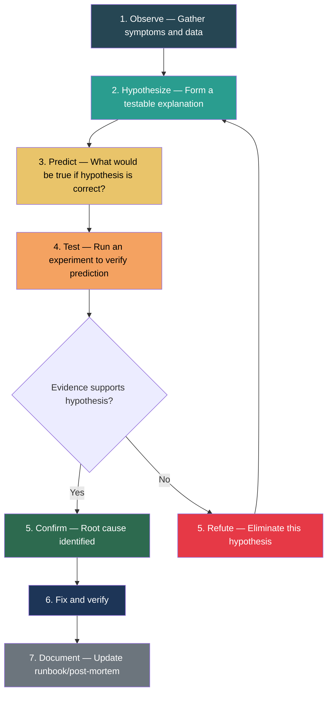
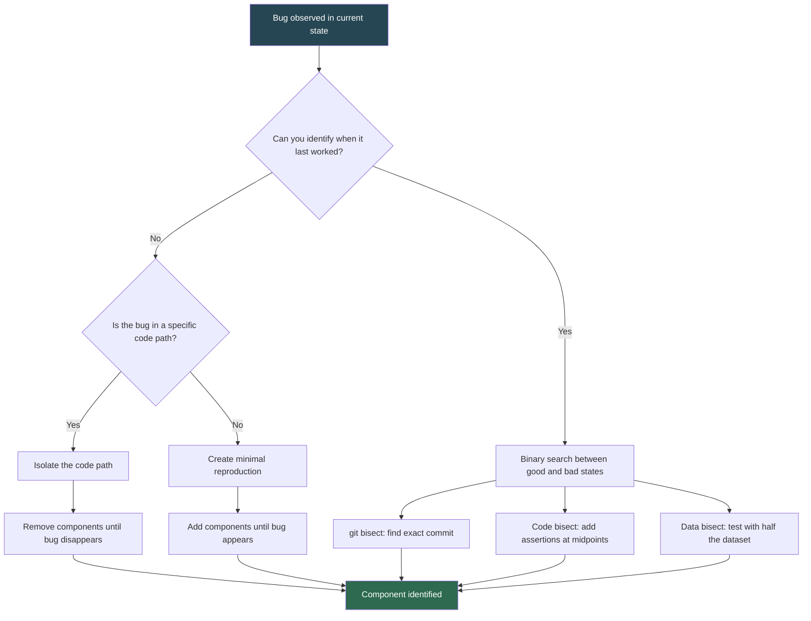
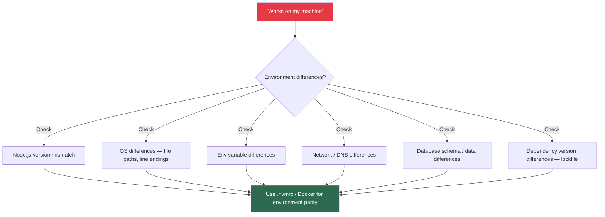

# Hypothesis-Driven Debugging

## The Scientific Method for Bugs

Most developers debug by intuition: "I think the problem is here" followed by random code changes until something works. This approach fails for complex systems because:

- It doesn't scale to distributed systems
- It misses non-obvious causes
- It wastes time exploring dead ends
- It doesn't build a knowledge base of what was eliminated

Hypothesis-driven debugging applies the scientific method to bugs: observe, hypothesize, predict, test, conclude.

---

## The Debugging Scientific Method



### Step-by-Step Framework

#### 1. Observe: Gather All Symptoms

Before forming any hypothesis, collect all available data:

```typescript
interface DebugObservation {
  // What is happening?
  symptom: string;
  // When did it start?
  firstOccurrence: Date;
  // How often does it happen?
  frequency: "constant" | "intermittent" | "periodic" | "random";
  // Who/what is affected?
  scope: string;
  // What changed recently?
  recentChanges: string[];
  // What data do we have?
  evidence: {
    logs: string[];
    metrics: string[];
    alerts: string[];
    userReports: string[];
  };
  // What is NOT broken?
  workingNormally: string[];
}

// Example
const observation: DebugObservation = {
  symptom: "API response times spiked from 200ms to 5s for /api/search",
  firstOccurrence: new Date("2025-03-01T14:30:00Z"),
  frequency: "constant",
  scope: "All search requests, other endpoints unaffected",
  recentChanges: [
    "Deployed v2.4.1 at 14:00 (new search ranking feature)",
    "Database maintenance window ended at 13:00",
    "Marketing campaign started at 14:15 (2x traffic)",
  ],
  evidence: {
    logs: ["Slow query warnings in search-service logs"],
    metrics: ["CPU at 85%, normally 30%", "DB connection pool at 100%"],
    alerts: ["p99 latency > 3s triggered at 14:35"],
    userReports: ["3 tickets about slow search from enterprise customers"],
  },
  workingNormally: [
    "Auth endpoints",
    "CRUD endpoints",
    "Background workers",
    "Database writes",
  ],
};
```

#### 2. Hypothesize: Form Testable Explanations

Generate multiple hypotheses ranked by likelihood:

```typescript
interface Hypothesis {
  id: string;
  statement: string;
  likelihood: "high" | "medium" | "low";
  basedOn: string; // which observation supports this
  testableBy: string; // how to verify or refute
  prediction: string; // what we expect to see if hypothesis is correct
}

const hypotheses: Hypothesis[] = [
  {
    id: "H1",
    statement: "The v2.4.1 deployment introduced a slow query in the new ranking feature",
    likelihood: "high",
    basedOn: "Timing correlates with deployment; only search is affected",
    testableBy: "Compare query plans between v2.4.0 and v2.4.1",
    prediction: "v2.4.1 has a new query without proper indexing",
  },
  {
    id: "H2",
    statement: "The 2x traffic from the marketing campaign is overwhelming the search service",
    likelihood: "medium",
    basedOn: "Traffic spike started 15 min before symptoms appeared",
    testableBy: "Check if latency correlates with request rate, not time",
    prediction: "Latency scales linearly with traffic; reducing traffic reduces latency",
  },
  {
    id: "H3",
    statement: "Database maintenance changed query plan statistics",
    likelihood: "low",
    basedOn: "Maintenance ended 1.5 hours before symptoms",
    testableBy: "Check if ANALYZE was run after maintenance; compare query plans to before maintenance",
    prediction: "Query plan uses sequential scan instead of index scan",
  },
];
```

#### 3-4. Predict and Test

For each hypothesis, define what you'd expect to see and how to test it:

```typescript
interface Experiment {
  hypothesisId: string;
  steps: string[];
  expectedResult: string;
  actualResult?: string;
  conclusion?: "confirmed" | "refuted" | "inconclusive";
}

const experiments: Experiment[] = [
  {
    hypothesisId: "H1",
    steps: [
      "Pull up the diff for v2.4.1 — look for new SQL queries",
      "Run EXPLAIN ANALYZE on any new queries against production data",
      "Roll back to v2.4.0 in staging and compare latency",
    ],
    expectedResult: "New query in ranking module does a full table scan",
    actualResult: "Confirmed: new query joins 3 tables without index on search_rankings.score",
    conclusion: "confirmed",
  },
  {
    hypothesisId: "H2",
    steps: [
      "Plot latency vs. request rate on same time axis",
      "Check if latency was already elevated before traffic spike",
    ],
    expectedResult: "Latency spike correlates with traffic spike",
    actualResult: "Latency spiked before traffic increase — traffic is a contributing factor, not root cause",
    conclusion: "refuted",
  },
];
```

#### 5-7. Conclude, Fix, Document

```typescript
// After experiments:
// H1: CONFIRMED — root cause
// H2: REFUTED (but contributing factor)
// H3: Not tested (H1 confirmed first)

// Fix: Add missing index
// ALTER TABLE search_rankings ADD INDEX idx_score (score);

// Verify: p99 latency returned to 200ms within 2 minutes of index creation

// Document: Update search-service runbook with "slow search debugging" section
```

---

## Binary Search Debugging (Bisect Strategy)

When you can't form a strong hypothesis, use binary search to narrow down the problem space systematically.

### Git Bisect

```bash
# Scenario: something broke between last-known-good and current
git bisect start
git bisect bad HEAD
git bisect good v2.3.0

# Git checks out the midpoint — test it
# If the bug exists at midpoint:
git bisect bad
# If the bug does not exist at midpoint:
git bisect good

# Repeat until Git identifies the exact commit
# O(log n) — 1000 commits takes ~10 steps

# Automated bisect with a test script:
git bisect run npm test -- --grep "search ranking"
```

### Binary Search Applied to Code

```typescript
// Problem: a function produces wrong output, but it's 200 lines long
// Strategy: add assertion checks at the midpoint

async function processSearchResults(query: string): Promise<SearchResult[]> {
  const parsed = parseQuery(query);
  const tokens = tokenize(parsed);
  const expanded = expandSynonyms(tokens);

  // ---- BISECT POINT: are results correct so far? ----
  console.assert(
    expanded.every((t) => typeof t === "string" && t.length > 0),
    "Expanded tokens should be non-empty strings",
    expanded
  );

  const candidates = await fetchCandidates(expanded);
  const scored = rankCandidates(candidates, parsed);
  const filtered = applyFilters(scored, parsed.filters);

  // ---- BISECT POINT: are results correct so far? ----
  console.assert(
    filtered.every((r) => r.score >= 0),
    "Filtered results should have non-negative scores",
    filtered
  );

  const paginated = paginate(filtered, parsed.page, parsed.pageSize);
  const enriched = await enrichWithMetadata(paginated);
  return enriched;
}
```

### Binary Search Decision Tree



---

## Reproducing Issues

The most critical debugging skill. If you can't reproduce it, you can't fix it with confidence.

### Reproduction Hierarchy (from best to worst)

| Level | Method | Confidence | Effort |
|-------|--------|------------|--------|
| 1 | Automated test that fails | Highest | Medium-High |
| 2 | Local reproduction with exact data | High | Medium |
| 3 | Staging reproduction with synthetic data | Medium-High | Medium |
| 4 | Production reproduction (controlled) | Medium | Low |
| 5 | "I saw it in logs" — no reproduction | Low | Zero |

### Reproduction Checklist

```typescript
interface ReproductionAttempt {
  // Environment match
  nodeVersion: string;      // Same as production?
  osVersion: string;        // Same as production?
  envVariables: string[];   // Same as production?

  // Data match
  databaseState: string;    // Same schema and approximate data volume?
  inputData: string;        // Exact request that triggered the bug?
  preconditions: string[];  // What state must exist before the bug triggers?

  // Timing
  concurrency: number;      // Does it require concurrent requests?
  timing: string;           // Does it require specific timing/ordering?

  // Result
  reproduced: boolean;
  steps: string[];
  notes: string;
}
```

### Dealing with "Works on My Machine" Bugs



---

## Isolating Variables

### The "Change One Thing" Rule

Never change multiple variables at once when debugging. Each experiment should test exactly one hypothesis.

```typescript
// Debugging checklist: isolate each variable

// 1. Isolate CODE changes
//    Roll back to last known good version
//    Apply suspected changes one at a time

// 2. Isolate DATA
//    Test with known-good input data
//    Test with the exact failing input
//    Test with minimal failing input (reduce dataset)

// 3. Isolate ENVIRONMENT
//    Test on same machine as production
//    Test with same configuration
//    Test with same dependencies (exact lockfile)

// 4. Isolate TIMING
//    Test with a single request (no concurrency)
//    Test under load (is it a concurrency bug?)
//    Test at different times (cron jobs, batch processes?)

// 5. Isolate EXTERNAL DEPENDENCIES
//    Mock third-party services
//    Test with database on localhost vs. remote
//    Test with/without caching layer
```

### Minimal Reproduction Pattern

```typescript
// Full failing scenario: 500 lines, 8 dependencies, database, Redis, 3 APIs
// Goal: strip it down to the smallest thing that still fails

// Step 1: Replace external calls with hardcoded data
// Does it still fail? Yes -> external deps are not the issue

// Step 2: Remove middleware
// Does it still fail? Yes -> middleware is not the issue

// Step 3: Simplify input data
// Does it still fail with minimal input? No -> data-dependent bug
// Binary search the input to find the triggering element

// Step 4: Create standalone test
async function minimalReproduction(): Promise<void> {
  // This is the smallest code that reproduces the bug
  const input = { query: "SELECT * FROM users WHERE name = 'O\\'Brien'" };
  const result = await searchService.search(input);
  // Bug: unescaped apostrophe in SQL causes syntax error
  assert.equal(result.status, 200);
}
```

---

## Debugging Notebook Template

Use this template to structure your debugging sessions:

```typescript
interface DebuggingNotebook {
  incident: string;
  startedAt: Date;

  observations: string[];

  hypotheses: {
    id: string;
    statement: string;
    status: "untested" | "testing" | "confirmed" | "refuted";
    evidence: string;
  }[];

  experiments: {
    hypothesisId: string;
    description: string;
    result: string;
    timeSpent: string;
  }[];

  deadEnds: string[]; // important: track what DIDN'T work

  rootCause: string;
  fix: string;
  preventionMeasures: string[];
  totalTimeSpent: string;
}

// Usage: keep this as a markdown file during debugging
// Paste into post-mortem document afterward
```

---

## Common Debugging Anti-Patterns

| Anti-Pattern | Description | Better Approach |
|-------------|-------------|-----------------|
| Shotgun debugging | Change random things until it works | Form a hypothesis first |
| Printf-and-pray | Add console.log everywhere without a plan | Targeted logging at bisect points |
| Blame the framework | "Must be a Node.js bug" as first hypothesis | Always suspect your code first (99% of the time) |
| Tunnel vision | Fixating on first hypothesis | Generate 3+ hypotheses before testing any |
| Forgetting what you tried | No notes, repeat dead ends | Keep a debugging notebook |
| Changing multiple things | Changing 3 things and "it works now" | Change one variable at a time |
| Ignoring the obvious | Overcomplicating when the answer is simple | Check the simple things first (is the service running?) |
| Solo heroics | Debugging alone for hours | Rubber duck / pair debug after 30 min of no progress |

---

## Rubber Duck Debugging

When stuck, explain the problem aloud (to a colleague, to a rubber duck, or in a Slack message). The act of articulating forces you to organize your thinking and often reveals gaps in your reasoning.

**The 30-minute rule:** If you haven't made progress in 30 minutes, explain the problem to someone else. This is not a sign of weakness — it's a debugging strategy.

---

## Interview Q&A

> **Q: Walk me through how you would debug a production issue you've never seen before.**
>
> A: I follow a structured approach. First, I **observe**: check alerts, dashboards, logs, and recent deployments to gather symptoms. I note what's broken and what's working normally — the boundary tells you a lot. Then I **hypothesize**: based on the symptoms, I generate 2-3 testable explanations ranked by likelihood. I consider recent changes first because most bugs correlate with recent changes. Next, I **test** the most likely hypothesis with the least disruptive experiment (read-only queries, log analysis, comparing configs). If confirmed, I fix and verify. If refuted, I move to the next hypothesis. Throughout, I keep a debugging notebook so I don't revisit dead ends. After resolution, I document everything in a post-mortem.

> **Q: How would you use git bisect to find a regression?**
>
> A: I'd identify the last known good version (say, the release from two weeks ago) and mark it as `git bisect good`, then mark HEAD as `git bisect bad`. Git checks out the midpoint commit. I test whether the bug exists at that commit — if yes, I mark it bad; if no, I mark it good. Git then bisects the remaining range. For 1000 commits, this takes about 10 steps (log2(1000)). I can automate it with `git bisect run <test-script>` if I have a reliable test that detects the bug. The output is the exact commit that introduced the regression, which usually makes the fix obvious.

> **Q: What do you do when a bug is intermittent and you can't reproduce it locally?**
>
> A: Intermittent bugs are almost always caused by: race conditions, timing/ordering dependencies, environmental differences, specific data patterns, or resource exhaustion under load. My approach: (1) Gather all instances from production logs — look for common patterns in timing, load, input data, or user. (2) Add targeted instrumentation (not random logging) to capture the state at the point of failure next time it occurs. (3) Try to reproduce under load (use artillery or k6 to simulate production traffic patterns). (4) If it's a race condition, try adding delays at suspected points to widen the race window. (5) Use tools like `--inspect-brk` or request recording to capture exact conditions.

> **Q: When would you NOT use hypothesis-driven debugging?**
>
> A: When the problem is obvious. If the error message says "Cannot read property 'name' of undefined at line 42," I don't need a hypothesis — I just go look at line 42. Hypothesis-driven debugging is for when the cause is not immediately apparent: distributed system issues, intermittent bugs, performance regressions, or complex state-dependent behavior. Using the full framework for simple bugs is over-engineering. The 80/20 rule applies: 80% of bugs are simple and found by reading the error; 20% are complex and need structured debugging.

> **Q: How do you decide which hypothesis to test first?**
>
> A: I prioritize by two dimensions: (1) likelihood — based on the observations, which explanation best fits all the symptoms? and (2) cost of testing — which hypothesis can I test quickest and with least risk? I always start with the hypothesis that is most likely AND cheapest to test. For production issues, I also consider a third dimension: impact of the fix — if two hypotheses are equally likely, I test the one whose fix would be faster to implement, because time-to-recovery matters. I also apply the heuristic "what changed recently?" because the vast majority of production issues correlate with a recent change (deploy, config update, traffic pattern shift).

> **Q: What is the "minimal reproduction" technique and why is it critical?**
>
> A: A minimal reproduction is the smallest possible code, data, and environment that still triggers the bug. It's critical for three reasons: (1) it isolates the cause by stripping away irrelevant complexity — if the bug still occurs with no database, the database isn't the problem, (2) it makes the fix obvious because you can see the entire context, and (3) it serves as a regression test. To create one, I start with the full failing scenario and remove components one at a time: replace external calls with mocks, simplify input data, remove middleware. When removing something makes the bug disappear, you've found the relevant component. This is essentially binary search on the system's components.
