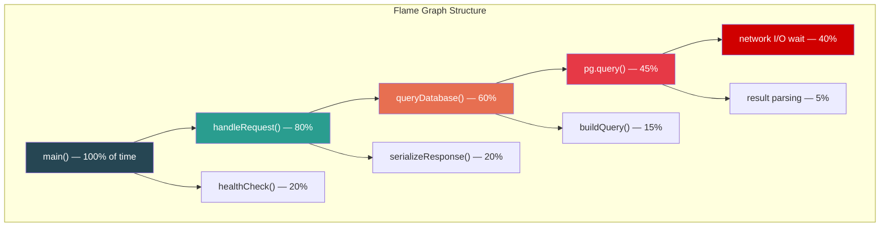
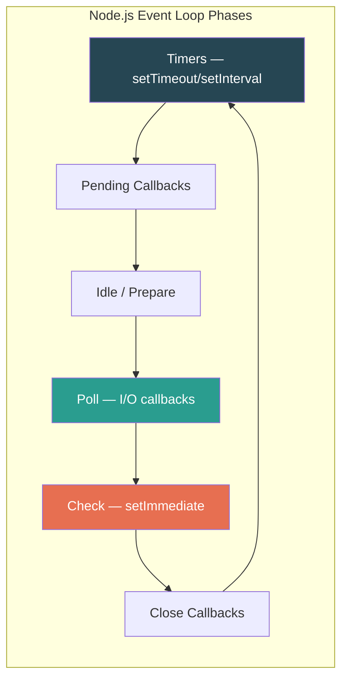
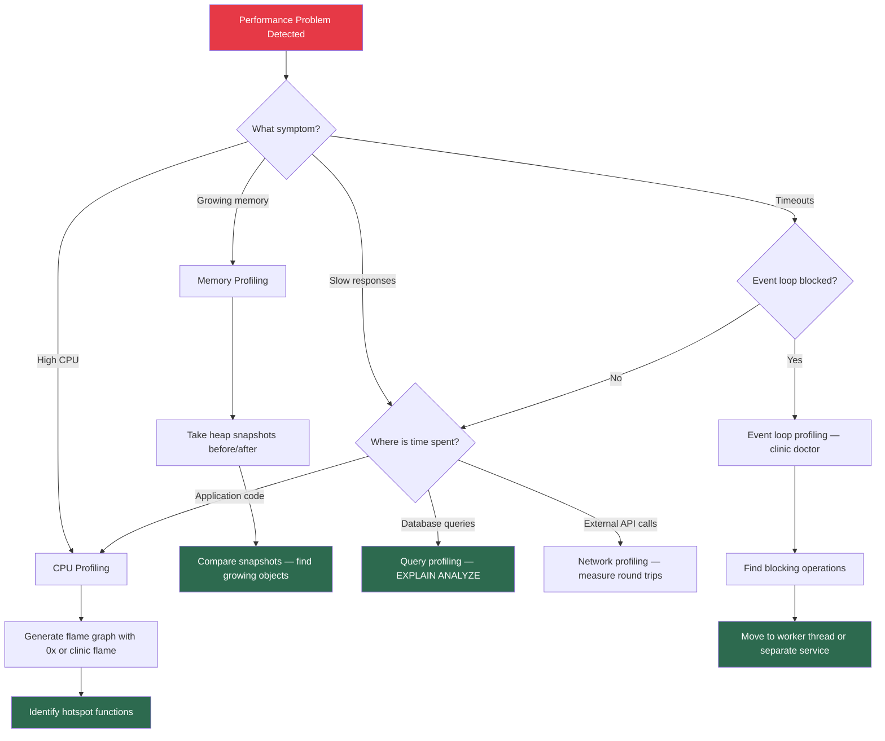

# Performance Profiling

## Why Profile?

Profiling answers the question: **where is time (or memory) actually being spent?** Without profiling, performance optimization is guesswork. The golden rule: **measure first, optimize second.**

---

## CPU Profiling vs. Memory Profiling

| Dimension | CPU Profiling | Memory Profiling |
|-----------|--------------|-----------------|
| Question answered | Where is execution time spent? | Where is memory allocated/retained? |
| Key metric | Time (ms) per function | Bytes allocated / retained per object type |
| Visualization | Flame graph | Heap snapshot / allocation timeline |
| Common problems found | Hot loops, slow algorithms, redundant computation | Memory leaks, excessive object creation, unbounded caches |
| Node.js tools | `--prof`, `--cpu-prof`, clinic.js, 0x | `--heap-prof`, `--inspect` + Chrome DevTools, clinic.js heapprofile |
| When to use | High CPU usage, slow request handling | Growing memory over time, OOM crashes |

---

## Node.js Profiling Tools

### Tool Comparison

| Tool | Type | Overhead | Best For | Output |
|------|------|----------|----------|--------|
| `--cpu-prof` (built-in) | CPU | Low | Quick CPU profiles | `.cpuprofile` (Chrome DevTools) |
| `--heap-prof` (built-in) | Memory | Low | Heap allocation tracking | `.heapprofile` (Chrome DevTools) |
| `--inspect` + Chrome DevTools | Both | Medium | Interactive debugging and profiling | Live in browser |
| clinic.js doctor | CPU + event loop | Low | Diagnosing what type of problem exists | HTML report |
| clinic.js flame | CPU | Low | Flame graph generation | Interactive SVG |
| clinic.js bubbleprof | Async | Low | Async bottleneck detection | Interactive HTML |
| 0x | CPU | Low | Production-safe flame graphs | Interactive SVG |
| autocannon | Load generation | N/A | Generating load for profiling | Terminal output |
| Node.js Perf Hooks | Custom | Very Low | Custom performance measurements | Programmatic |

### Using clinic.js

```bash
# Install
npm install -g clinic

# Step 1: Diagnose what type of problem exists
clinic doctor -- node server.js
# Generates an HTML report showing: CPU, memory, event loop delay, active handles

# Step 2: If CPU is the bottleneck, generate a flame graph
clinic flame -- node server.js
# Then send traffic to the server (use autocannon)

# Step 3: If async is the bottleneck, use bubbleprof
clinic bubbleprof -- node server.js
```

### Using 0x for Flame Graphs

```bash
# Install
npm install -g 0x

# Generate flame graph (production-safe: uses perf_events on Linux)
0x -- node server.js

# Send traffic while profiling
npx autocannon -c 100 -d 30 http://localhost:3000/api/search

# 0x generates an interactive SVG flame graph
```

### Programmatic Profiling in Node.js

```typescript
import { performance, PerformanceObserver } from "perf_hooks";
import { Session } from "inspector";

// 1. Performance Hooks — measure specific operations
function measureDatabaseQuery(queryName: string): PerformanceMeasure {
  performance.mark(`${queryName}-start`);
  // ... execute query ...
  performance.mark(`${queryName}-end`);
  return performance.measure(queryName, `${queryName}-start`, `${queryName}-end`);
}

// Observe all measurements
const obs = new PerformanceObserver((items) => {
  for (const entry of items.getEntries()) {
    if (entry.duration > 1000) {
      console.warn(`Slow operation: ${entry.name} took ${entry.duration}ms`);
    }
  }
});
obs.observe({ type: "measure" });

// 2. Custom middleware for request profiling
import { Request, Response, NextFunction } from "express";

function profilingMiddleware(req: Request, res: Response, next: NextFunction): void {
  const start = performance.now();

  // Track async operations within this request
  const asyncOps: { name: string; durationMs: number }[] = [];

  // Wrap original json method to capture timing
  const originalJson = res.json.bind(res);
  res.json = function (body: unknown) {
    const totalMs = performance.now() - start;

    // Add server timing header (visible in Chrome DevTools Network tab)
    res.setHeader(
      "Server-Timing",
      [
        `total;dur=${totalMs.toFixed(2)}`,
        ...asyncOps.map(
          (op) => `${op.name};dur=${op.durationMs.toFixed(2)}`
        ),
      ].join(", ")
    );

    return originalJson(body);
  };

  next();
}

// 3. CPU Profile capture on demand
async function captureCpuProfile(durationMs: number): Promise<Buffer> {
  const session = new Session();
  session.connect();

  return new Promise((resolve, reject) => {
    session.post("Profiler.enable", () => {
      session.post("Profiler.start", () => {
        setTimeout(() => {
          session.post("Profiler.stop", (err, { profile }) => {
            if (err) return reject(err);
            session.disconnect();
            resolve(Buffer.from(JSON.stringify(profile)));
          });
        }, durationMs);
      });
    });
  });
}

// Expose as admin endpoint
// POST /admin/cpu-profile?duration=30000
// Returns a .cpuprofile file you can load in Chrome DevTools
```

---

## Flame Graphs

### How to Read a Flame Graph



**Reading rules:**
- **X-axis:** NOT time. Width represents percentage of total samples (wider = more time spent).
- **Y-axis:** Call stack depth. Bottom is the entry point, top is the deepest call.
- **Wide bars at the top (plateaus):** These are where time is actually spent. These are your optimization targets.
- **Narrow tall stacks:** Deep call chains that execute quickly — usually not a problem.
- **Color:** Typically arbitrary or used to distinguish different categories (user code vs. framework vs. native).

### Flame Graph Patterns and What They Mean

| Pattern | Visual | Meaning | Action |
|---------|--------|---------|--------|
| Wide plateau at top | Single wide bar | One function consumes most time | Profile that function deeper |
| Wide bar labeled `GC` | GC bar visible | Garbage collection pressure | Check for excessive object allocation |
| Wide `idle` or `epoll_wait` | Bottom-level wide bar | CPU is waiting on I/O | Not a CPU problem — check I/O latency |
| Repeating identical stacks | Many identical columns | Same function called many times (N+1) | Batch or cache the repeated calls |
| Deep narrow stacks | Tall thin towers | Deep recursion but fast | Usually fine unless hitting stack limit |
| Many small diverse bars | Noisy top level | No single hotspot | Micro-optimization or architectural change needed |

### Generating a Flame Graph with Chrome DevTools

```bash
# 1. Start Node.js with inspector
node --inspect server.js

# 2. Open Chrome and navigate to chrome://inspect
# 3. Click "inspect" next to your Node.js process
# 4. Go to "Performance" tab
# 5. Click "Record" (circle button)
# 6. Send traffic to your server
# 7. Click "Stop"
# 8. Analyze the flame chart (Chrome calls it "flame chart", same concept)

# Alternative: capture profile to file
node --cpu-prof --cpu-prof-interval=100 server.js
# Generates a .cpuprofile file — drag into Chrome DevTools Performance tab
```

---

## Memory Profiling

### Heap Snapshots

```typescript
import v8 from "v8";
import fs from "fs";

// Capture heap snapshot programmatically
function captureHeapSnapshot(): string {
  const filename = `/tmp/heap-${Date.now()}.heapsnapshot`;
  const snapshotStream = v8.writeHeapSnapshot(filename);
  console.log(`Heap snapshot written to ${snapshotStream}`);
  return snapshotStream;
}

// Expose as admin endpoint for production debugging
// POST /admin/heap-snapshot
// Returns the path to the snapshot file

// Compare two snapshots to find leaks:
// 1. Take snapshot at time T
// 2. Run the suspected leaking operation N times
// 3. Force GC: node --expose-gc -> global.gc()
// 4. Take snapshot at time T+N
// 5. In Chrome DevTools: load both, select "Comparison" view
// 6. Sort by "Delta" to see what objects grew
```

### Memory Leak Detection Pattern

```typescript
// Common leak patterns in Node.js

// 1. Unbounded cache
const cache = new Map(); // LEAK: grows forever
// Fix: use LRU cache with max size
import { LRUCache } from "lru-cache";
const safeCache = new LRUCache<string, unknown>({ max: 10000 });

// 2. Event listener accumulation
class Leaky {
  constructor() {
    // LEAK: new listener added every time, never removed
    process.on("uncaughtException", this.handleError.bind(this));
  }
  handleError(err: Error): void { /* ... */ }
}
// Fix: remove listener in destructor, or add listener once at module level

// 3. Closure holding references
function createHandler(largeData: Buffer): () => void {
  // LEAK: the closure holds a reference to largeData even if unused
  return () => {
    console.log("handler called");
    // largeData is retained in closure scope even though it's never used
  };
}
// Fix: don't capture unnecessary variables in closures

// 4. Unfinished promises / streams
async function fetchWithoutCleanup(url: string): Promise<void> {
  const response = await fetch(url);
  // LEAK: body is never consumed and stream is not closed
  // Fix: always consume or abort the response body
  await response.text(); // or response.body?.cancel()
}

// 5. Monitoring memory usage
function logMemoryUsage(): void {
  const usage = process.memoryUsage();
  console.log({
    rss: `${(usage.rss / 1024 / 1024).toFixed(1)} MB`,         // Total allocated
    heapTotal: `${(usage.heapTotal / 1024 / 1024).toFixed(1)} MB`, // V8 heap
    heapUsed: `${(usage.heapUsed / 1024 / 1024).toFixed(1)} MB`,  // Used heap
    external: `${(usage.external / 1024 / 1024).toFixed(1)} MB`,  // C++ objects (Buffers)
    arrayBuffers: `${(usage.arrayBuffers / 1024 / 1024).toFixed(1)} MB`,
  });
}

// Log every 30 seconds — watch for steady growth after GC
setInterval(logMemoryUsage, 30_000);
```

---

## Event Loop Profiling

The Node.js event loop is single-threaded. If anything blocks it, all requests queue up.



### Detecting Event Loop Blocking

```typescript
// Measure event loop lag
let lastCheck = Date.now();

setInterval(() => {
  const now = Date.now();
  const lag = now - lastCheck - 1000; // expected: 0ms, actual: lag
  lastCheck = now;

  if (lag > 100) {
    console.warn({ eventLoopLagMs: lag }, "Event loop blocked");
  }
}, 1000);

// Better: use built-in monitorEventLoopDelay (Node.js 12+)
import { monitorEventLoopDelay } from "perf_hooks";

const histogram = monitorEventLoopDelay({ resolution: 20 });
histogram.enable();

setInterval(() => {
  console.log({
    eventLoopDelay: {
      min: histogram.min / 1e6, // nanoseconds to ms
      max: histogram.max / 1e6,
      mean: histogram.mean / 1e6,
      p99: histogram.percentile(99) / 1e6,
    },
  });
  histogram.reset();
}, 10_000);
```

---

## Slow Query Profiling

### Database Query Profiling

```typescript
import { Pool, QueryConfig, QueryResult } from "pg";

// Wrapper that logs slow queries
class ProfiledPool {
  private pool: Pool;
  private slowQueryThresholdMs: number;

  constructor(pool: Pool, slowQueryThresholdMs = 500) {
    this.pool = pool;
    this.slowQueryThresholdMs = slowQueryThresholdMs;
  }

  async query<T>(config: QueryConfig): Promise<QueryResult<T>> {
    const start = performance.now();
    try {
      const result = await this.pool.query<T>(config);
      const durationMs = performance.now() - start;

      if (durationMs > this.slowQueryThresholdMs) {
        console.warn({
          type: "slow_query",
          query: config.text,
          params: config.values,
          durationMs: Math.round(durationMs),
          rowCount: result.rowCount,
        }, "Slow database query detected");
      }

      return result;
    } catch (err) {
      const durationMs = performance.now() - start;
      console.error({
        type: "failed_query",
        query: config.text,
        durationMs: Math.round(durationMs),
        error: (err as Error).message,
      }, "Database query failed");
      throw err;
    }
  }
}

// PostgreSQL: analyze query plans
// EXPLAIN ANALYZE SELECT * FROM orders WHERE user_id = 12345;
// Look for:
//   - Seq Scan on large tables (should be Index Scan)
//   - Nested Loop with large row counts (N+1 pattern)
//   - Sort with high memory usage (missing index for ORDER BY)
//   - Hash Join on very large datasets (consider partitioning)
```

---

## Profiling Decision Flowchart



---

## Real-World Profiling Workflow

### Scenario: p99 Latency Spike After Deployment

```typescript
// Step 1: Confirm with metrics
// p99 latency went from 200ms to 2.5s after deploying v3.1.0

// Step 2: Start clinic doctor to identify the bottleneck type
// $ clinic doctor -- node server.js
// Result: CPU usage is high (85%), event loop delay is normal
// Diagnosis: CPU-bound problem

// Step 3: Generate flame graph
// $ clinic flame -- node server.js
// $ npx autocannon -c 50 -d 30 http://localhost:3000/api/search

// Step 4: Analyze flame graph
// Finding: 60% of CPU time in JSON.parse() called from
//   processSearchResults() -> deserializeRankingModel()
// The new ranking model (v3.1.0 feature) is deserializing a 5MB JSON
// file on every request instead of loading it once at startup.

// Step 5: Fix
class RankingService {
  private model: RankingModel;

  // Before (v3.1.0): load on every request
  async rankResults_SLOW(results: SearchResult[]): Promise<SearchResult[]> {
    const model = JSON.parse(await fs.readFile("ranking-model.json", "utf-8"));
    return results.sort((a, b) => model.score(b) - model.score(a));
  }

  // After: load once at startup
  async initialize(): Promise<void> {
    this.model = JSON.parse(await fs.readFile("ranking-model.json", "utf-8"));
  }

  async rankResults(results: SearchResult[]): Promise<SearchResult[]> {
    return results.sort((a, b) => this.model.score(b) - this.model.score(a));
  }
}

// Step 6: Verify with flame graph — JSON.parse() no longer visible
```

---

## Interview Q&A

> **Q: Your Node.js service has high CPU usage in production. Walk me through how you'd diagnose it.**
>
> A: First, I'd verify with metrics that CPU is genuinely the bottleneck (not I/O wait misreported as CPU). Then I'd generate a flame graph using 0x or clinic flame — these are production-safe because they use sampling, not instrumentation, so overhead is under 5%. I'd generate traffic (or wait for organic traffic) for 30-60 seconds while profiling. In the flame graph, I'd look for wide plateaus at the top of the stack — these are functions consuming the most CPU. Common findings: JSON serialization of large objects, regex with catastrophic backtracking, synchronous crypto operations, or hot loops iterating large arrays. Once identified, I'd optimize the specific function and verify with another flame graph.

> **Q: How do you detect a memory leak in a Node.js service?**
>
> A: I watch for steadily increasing `heapUsed` in `process.memoryUsage()` over time (hours/days), even after garbage collection. To find the leak, I take two heap snapshots (via `v8.writeHeapSnapshot()` or Chrome DevTools) separated by the suspected leaking operation. In Chrome DevTools, I load both snapshots and use the "Comparison" view, sorting by the "Delta" column to see which object types grew. Common leak sources in Node.js: unbounded Maps/arrays used as caches, event listeners that are added but never removed, closures capturing large objects unnecessarily, and unfinished HTTP response streams.

> **Q: What is the difference between a flame graph and a flame chart?**
>
> A: A flame graph (Brendan Gregg's invention) shows aggregated stack traces — the x-axis is alphabetically sorted (not time), and width represents the percentage of total samples. It answers "where is time spent?" A flame chart (as seen in Chrome DevTools) is a timeline — the x-axis IS time, and it shows the call stack at each point in time. It answers "when was time spent?" Use flame graphs for finding hotspots in steady-state workloads. Use flame charts for understanding the sequence of operations in a specific request. Both are useful but answer different questions.

> **Q: How would you profile a Node.js service without restarting it?**
>
> A: Node.js supports sending a SIGUSR1 signal to enable the inspector at runtime: `kill -SIGUSR1 <pid>`. Then I can connect Chrome DevTools to `chrome://inspect` and take CPU profiles or heap snapshots without any restart. For containerized services, I'd exec into the container and use `node -e "process._debugProcess(<pid>)"` if signals aren't available. I can also programmatically expose profiling via an admin API endpoint that uses the `inspector` module's `Session` class to capture profiles on demand. This is my preferred approach for production because it's controlled and can include authentication.

> **Q: What are the performance implications of logging in a hot path?**
>
> A: Every log statement has cost: JSON serialization (for structured logging), string formatting, I/O write, and potential backpressure from the logging destination. In a function called thousands of times per second, logging overhead can become significant. This is why pino is preferred over winston — it minimizes serialization cost. Best practices: use sampling for high-frequency debug logs, avoid logging in tight loops, use `logger.isLevelEnabled('debug')` to skip serialization when the level won't be output, and configure pino with async mode (`pino.destination({ sync: false })`) for non-critical logs. In hot paths, I'd log at the request boundary (start/end) rather than inside every function call.

> **Q: When would you use a worker thread vs. a child process for CPU-intensive work in Node.js?**
>
> A: Worker threads share memory with the main thread (via SharedArrayBuffer) and have lower startup overhead — use them for CPU-intensive operations that need to run frequently (image processing, data transformation, crypto). Child processes have separate memory spaces and higher startup cost — use them for isolation (untrusted code execution) or when you need a completely separate V8 heap (large memory workloads that would pressure the main process's GC). For profiling purposes, it's important to know which model you're using because worker threads share the event loop's CPU allocation while child processes have their own. If a flame graph shows CPU time in worker threads, you need to profile the worker separately.
