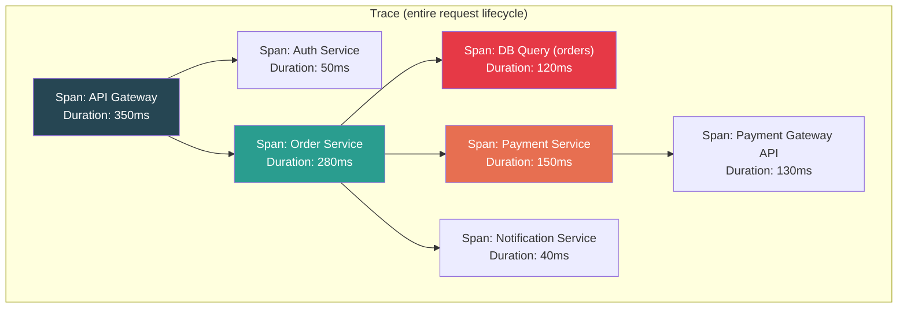
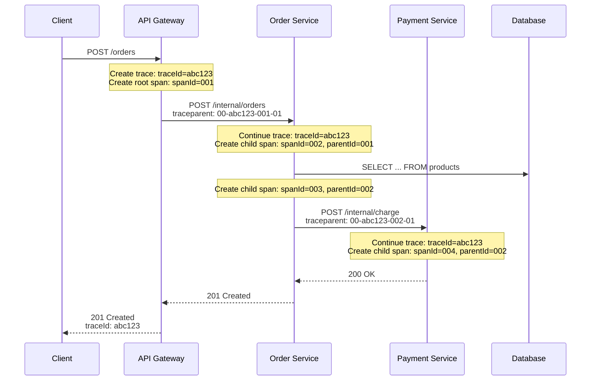
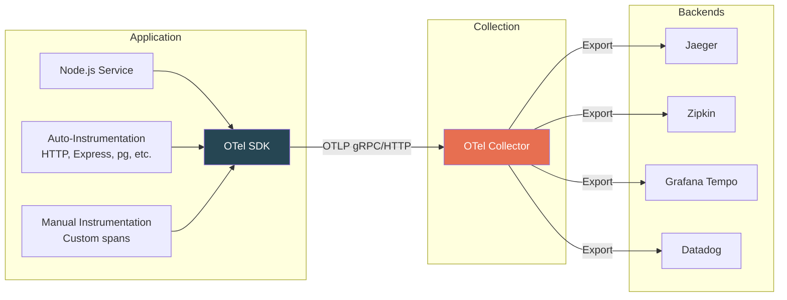

# Distributed Tracing

## Why Distributed Tracing?

In a monolith, a stack trace tells you everything. In microservices, a single user request may touch 5-20 services. Logs show you individual events; metrics show you aggregates. **Distributed tracing shows you the causal flow of a single request across all services with timing.**

---

## Core Concepts

### Traces, Spans, and Context



| Concept | Definition | Analogy |
|---------|-----------|---------|
| **Trace** | The complete journey of a request across all services. Identified by a unique `traceId`. | A package tracking number |
| **Span** | A single unit of work within a trace (e.g., one HTTP call, one DB query). Has a start time, duration, and status. | One stop on the package route |
| **Root Span** | The first span in a trace — typically the API gateway or frontend. | The origin facility |
| **Child Span** | A span initiated by another span (parent-child relationship). | A downstream stop |
| **Span Context** | The metadata propagated between services: `traceId`, `spanId`, `traceFlags`. | The shipping label |
| **Baggage** | User-defined key-value pairs propagated across all spans (e.g., userId, tenantId). | Notes written on the shipping label |

### Trace Context Propagation



### W3C Trace Context Header

The standard header format (used by OpenTelemetry):

```
traceparent: 00-0af7651916cd43dd8448eb211c80319c-b7ad6b7169203331-01
              |  |                                |                  |
              |  |                                |                  +-- trace flags (01 = sampled)
              |  |                                +-- parent span ID (16 hex chars)
              |  +-- trace ID (32 hex chars)
              +-- version (00)
```

---

## OpenTelemetry

OpenTelemetry (OTel) is the industry standard for instrumentation. It provides vendor-neutral APIs, SDKs, and tools for traces, metrics, and logs.

### Architecture



### Setting Up OpenTelemetry in Node.js

```typescript
// tracing.ts — load this BEFORE your application code
// node -r ./tracing.ts server.ts

import { NodeSDK } from "@opentelemetry/sdk-node";
import { getNodeAutoInstrumentations } from "@opentelemetry/auto-instrumentations-node";
import { OTLPTraceExporter } from "@opentelemetry/exporter-trace-otlp-grpc";
import { Resource } from "@opentelemetry/resources";
import {
  SEMRESATTRS_SERVICE_NAME,
  SEMRESATTRS_SERVICE_VERSION,
  SEMRESATTRS_DEPLOYMENT_ENVIRONMENT,
} from "@opentelemetry/semantic-conventions";
import {
  ParentBasedSampler,
  TraceIdRatioBasedSampler,
} from "@opentelemetry/sdk-trace-base";

const sdk = new NodeSDK({
  resource: new Resource({
    [SEMRESATTRS_SERVICE_NAME]: "order-service",
    [SEMRESATTRS_SERVICE_VERSION]: "2.4.1",
    [SEMRESATTRS_DEPLOYMENT_ENVIRONMENT]: "production",
  }),
  traceExporter: new OTLPTraceExporter({
    url: "http://otel-collector:4317", // gRPC endpoint
  }),
  instrumentations: [
    getNodeAutoInstrumentations({
      // Auto-instruments: HTTP, Express, pg, mysql, redis, grpc, etc.
      "@opentelemetry/instrumentation-http": {
        ignoreIncomingPaths: ["/health", "/ready"], // don't trace health checks
      },
      "@opentelemetry/instrumentation-express": {
        enabled: true,
      },
      "@opentelemetry/instrumentation-pg": {
        enhancedDatabaseReporting: true, // include query text in spans
      },
    }),
  ],
  sampler: new ParentBasedSampler({
    root: new TraceIdRatioBasedSampler(0.1), // sample 10% of traces
  }),
});

sdk.start();
console.log("OpenTelemetry tracing initialized");

// Graceful shutdown
process.on("SIGTERM", () => {
  sdk.shutdown().then(() => process.exit(0));
});
```

### Manual Instrumentation

```typescript
import { trace, SpanStatusCode, SpanKind, context } from "@opentelemetry/api";

const tracer = trace.getTracer("order-service", "2.4.1");

// Creating custom spans for business logic
async function processOrder(order: Order): Promise<OrderResult> {
  return tracer.startActiveSpan(
    "processOrder",
    {
      kind: SpanKind.INTERNAL,
      attributes: {
        "order.id": order.id,
        "order.item_count": order.items.length,
        "order.total_cents": order.totalCents,
        "customer.id": order.customerId,
      },
    },
    async (span) => {
      try {
        // Child span for validation
        const validated = await tracer.startActiveSpan(
          "validateOrder",
          async (validationSpan) => {
            const result = validateOrderData(order);
            validationSpan.setAttribute("validation.passed", result.valid);
            if (!result.valid) {
              validationSpan.setStatus({
                code: SpanStatusCode.ERROR,
                message: result.errors.join(", "),
              });
            }
            validationSpan.end();
            return result;
          }
        );

        // Child span for inventory check
        await tracer.startActiveSpan(
          "checkInventory",
          { kind: SpanKind.CLIENT },
          async (inventorySpan) => {
            inventorySpan.setAttribute("inventory.service.url", "http://inventory:3001");
            const available = await inventoryService.check(order.items);
            inventorySpan.setAttribute("inventory.all_available", available);
            inventorySpan.end();
          }
        );

        // Child span for payment
        await tracer.startActiveSpan(
          "chargePayment",
          { kind: SpanKind.CLIENT },
          async (paymentSpan) => {
            paymentSpan.setAttribute("payment.amount_cents", order.totalCents);
            paymentSpan.setAttribute("payment.currency", "USD");
            const result = await paymentService.charge(order);
            paymentSpan.setAttribute("payment.id", result.paymentId);
            paymentSpan.end();
          }
        );

        span.setStatus({ code: SpanStatusCode.OK });
        return { success: true, orderId: order.id };
      } catch (err) {
        span.setStatus({
          code: SpanStatusCode.ERROR,
          message: (err as Error).message,
        });
        span.recordException(err as Error);
        throw err;
      } finally {
        span.end();
      }
    }
  );
}
```

### Adding Span Events and Links

```typescript
// Span events: timestamped annotations within a span
span.addEvent("cache_miss", {
  "cache.key": cacheKey,
  "cache.backend": "redis",
});

span.addEvent("retry_attempt", {
  "retry.count": 2,
  "retry.reason": "timeout",
  "retry.delay_ms": 1000,
});

// Span links: connect spans from different traces
// Useful for: batch processing, queue consumers
import { SpanKind, Link } from "@opentelemetry/api";

// Consumer that processes messages from a queue
async function processMessage(message: QueueMessage): Promise<void> {
  const parentContext = propagation.extract(context.active(), message.headers);
  const link: Link = {
    context: trace.getSpanContext(parentContext)!,
    attributes: { "messaging.operation": "process" },
  };

  tracer.startActiveSpan(
    "processQueueMessage",
    {
      kind: SpanKind.CONSUMER,
      links: [link], // links this span to the producer's trace
      attributes: {
        "messaging.system": "rabbitmq",
        "messaging.destination": message.queue,
        "messaging.message_id": message.id,
      },
    },
    async (span) => {
      // Process message...
      span.end();
    }
  );
}
```

---

## Tracing Backends Comparison

| Feature | Jaeger | Zipkin | Grafana Tempo | Datadog APM |
|---------|--------|--------|---------------|-------------|
| Open source | Yes (CNCF) | Yes (Apache) | Yes (Grafana Labs) | No (SaaS) |
| Storage | Elasticsearch, Cassandra, Kafka | Elasticsearch, MySQL, Cassandra | Object storage (S3, GCS) | Managed |
| Query language | Jaeger UI search | Zipkin UI search | TraceQL | Datadog query |
| Cost at scale | Medium (storage) | Medium (storage) | Low (object storage) | High (per-span pricing) |
| Integration | OTLP, Jaeger native | OTLP, Zipkin native | OTLP, Tempo native | OTLP, DD agent |
| Metrics correlation | Via Prometheus | Limited | Native (Grafana stack) | Native |
| Log correlation | Via trace ID injection | Limited | Native (Grafana Loki) | Native |
| Ease of setup | Medium | Easy | Easy (with Grafana) | Very easy |

---

## Sampling Strategies

Tracing every request in production generates enormous data volumes. Sampling decides which traces to keep.

| Strategy | How It Works | Use Case | Trade-off |
|----------|-------------|----------|-----------|
| **Always on** | Sample 100% of traces | Development, staging | Too expensive for production |
| **Probabilistic** | Sample X% randomly (e.g., 10%) | General production use | May miss rare errors |
| **Rate limiting** | Sample N traces per second | High-throughput services | Misses bursts |
| **Parent-based** | If parent is sampled, child is too | Microservice chains | Consistent traces but inherits parent's strategy |
| **Tail-based** | Decide AFTER trace completes (at collector) | Keep all error/slow traces | Requires buffering; more complex |
| **Adaptive** | Adjust rate based on traffic volume | Variable traffic patterns | Complex to configure |

### Implementing Sampling in OpenTelemetry

```typescript
import {
  AlwaysOnSampler,
  AlwaysOffSampler,
  ParentBasedSampler,
  TraceIdRatioBasedSampler,
} from "@opentelemetry/sdk-trace-base";
import { Sampler, SamplingResult, SamplingDecision } from "@opentelemetry/api";

// 1. Simple ratio-based sampling (10%)
const simpleSampler = new TraceIdRatioBasedSampler(0.1);

// 2. Parent-based (respects upstream decision, 10% for new traces)
const parentBasedSampler = new ParentBasedSampler({
  root: new TraceIdRatioBasedSampler(0.1),
  // If parent was sampled, sample this too
  // If parent was not sampled, don't sample this
});

// 3. Custom sampler: always sample errors and slow requests
class SmartSampler implements Sampler {
  private ratioSampler = new TraceIdRatioBasedSampler(0.05); // 5% baseline

  shouldSample(
    parentContext: unknown,
    traceId: string,
    spanName: string,
    spanKind: unknown,
    attributes: Record<string, unknown>
  ): SamplingResult {
    // Always sample health-critical paths
    if (
      spanName.includes("payment") ||
      spanName.includes("auth")
    ) {
      return { decision: SamplingDecision.RECORD_AND_SAMPLED };
    }

    // Never sample health checks
    if (spanName.includes("healthcheck") || spanName.includes("/health")) {
      return { decision: SamplingDecision.NOT_RECORD };
    }

    // Default: probabilistic sampling
    return this.ratioSampler.shouldSample(
      parentContext,
      traceId,
      spanName,
      spanKind,
      attributes
    );
  }

  toString(): string {
    return "SmartSampler";
  }
}
```

### Tail-Based Sampling with OTel Collector

```yaml
# otel-collector-config.yaml
processors:
  tail_sampling:
    decision_wait: 10s       # wait 10s for all spans to arrive
    num_traces: 100000       # buffer size
    policies:
      # Keep all traces with errors
      - name: errors
        type: status_code
        status_code:
          status_codes: [ERROR]
      # Keep all traces slower than 2 seconds
      - name: slow-traces
        type: latency
        latency:
          threshold_ms: 2000
      # Keep 5% of everything else
      - name: probabilistic
        type: probabilistic
        probabilistic:
          sampling_percentage: 5
```

---

## Correlating Traces with Logs

```typescript
import pino from "pino";
import { trace, context } from "@opentelemetry/api";

// Create a pino logger that automatically includes trace context
const logger = pino({
  level: "info",
  mixin() {
    const span = trace.getSpan(context.active());
    if (span) {
      const spanContext = span.spanContext();
      return {
        traceId: spanContext.traceId,
        spanId: spanContext.spanId,
        traceFlags: spanContext.traceFlags,
      };
    }
    return {};
  },
});

// Now every log line automatically includes traceId and spanId
// This lets you click from a trace in Jaeger to the corresponding logs in Kibana
// Search: traceId: "abc123" in Kibana -> shows all logs for that trace

logger.info({ orderId: "order-123" }, "Processing order");
// Output:
// {
//   "level": "info",
//   "traceId": "0af7651916cd43dd8448eb211c80319c",
//   "spanId": "b7ad6b7169203331",
//   "traceFlags": 1,
//   "orderId": "order-123",
//   "msg": "Processing order"
// }
```

---

## Interview Q&A

> **Q: Explain the difference between a trace, a span, and a span context.**
>
> A: A trace represents the entire journey of a single request across all services — it's identified by a unique traceId. A span is a single unit of work within that trace: one HTTP call, one database query, one function execution. Each span has a start time, duration, status, attributes, and a parent span ID (except the root span). Span context is the metadata that gets propagated between services — it contains the traceId, spanId, and trace flags (like whether this trace is being sampled). This context is typically propagated via HTTP headers using the W3C `traceparent` format.

> **Q: How does trace context propagation work across service boundaries?**
>
> A: When Service A calls Service B, the tracing SDK in Service A serializes the current span context into an HTTP header (`traceparent: 00-<traceId>-<spanId>-<flags>`). Service B's SDK extracts this header, creates a new span with the received traceId and sets its parentSpanId to Service A's spanId. This creates the parent-child relationship across process boundaries. OpenTelemetry handles this automatically for HTTP calls if auto-instrumentation is enabled. For message queues, the context is embedded in message headers/attributes. The W3C Trace Context standard ensures interoperability between different tracing implementations.

> **Q: When would you use tail-based sampling instead of head-based sampling?**
>
> A: Head-based sampling (deciding at the first span) is simpler but can miss important traces. If I sample 10% and an error occurs in the unsampled 90%, that error trace is lost forever. Tail-based sampling defers the decision until the trace is complete, so I can keep all traces that contain errors, all traces slower than a threshold, and randomly sample the rest. The trade-off is complexity: the OTel Collector must buffer all spans for a configurable window (typically 10-30 seconds) waiting for all spans to arrive, which requires more memory. I'd use tail-based sampling when error traces or slow traces are critical for debugging (payment systems, user-facing APIs) and head-based when volume is very high and I can tolerate missing some error traces.

> **Q: How would you instrument an existing Node.js application with OpenTelemetry without changing application code?**
>
> A: OpenTelemetry provides auto-instrumentation for Node.js. I'd create a separate `tracing.ts` file that initializes the SDK with `getNodeAutoInstrumentations()`, which automatically patches popular libraries (Express, pg, mysql2, redis, http, grpc, etc.). Then I'd start the application with `node -r ./tracing.ts server.ts`. This gives me traces for all HTTP requests, database queries, and Redis operations without modifying any application code. For deeper business-level instrumentation (e.g., tracking order processing stages), I'd add manual spans using the `@opentelemetry/api` tracer — but the auto-instrumentation gives 80% of the value with zero code changes.

> **Q: How do you correlate traces with logs and metrics?**
>
> A: The key is embedding the traceId in all three signals. For logs: I configure pino with a mixin that extracts the current span's traceId and spanId from the OpenTelemetry context and includes them in every log line. For metrics: I use exemplars — a Prometheus feature where each metric sample can include a traceId, so when I see a latency spike in a dashboard, I can jump to the exact trace that caused it. In Grafana, this enables a seamless workflow: see a metric spike -> click an exemplar -> view the trace in Tempo -> click a span -> see the corresponding logs in Loki. This correlation across all three signals is the core value of the observability stack.

> **Q: What's the difference between Jaeger and Zipkin? When would you choose one over the other?**
>
> A: Both are open-source distributed tracing backends, and both support OpenTelemetry. Jaeger (CNCF project, originally from Uber) has a richer query UI, supports adaptive sampling natively, and scales better with Kafka and Cassandra backends. Zipkin (originally from Twitter) is simpler to set up, has a smaller resource footprint, and is better if you need a lightweight solution. In practice, I'd choose Jaeger for large-scale production deployments where I need advanced features. I'd choose Zipkin for smaller teams or when simplicity is paramount. That said, the trend is moving toward Grafana Tempo, which stores traces in cheap object storage (S3/GCS) and uses TraceQL for querying — it's significantly cheaper at scale than either Jaeger or Zipkin because it doesn't require Elasticsearch or Cassandra.
