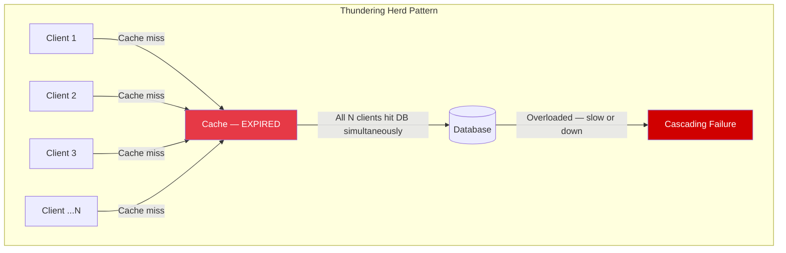
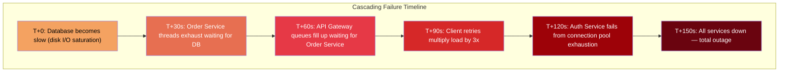
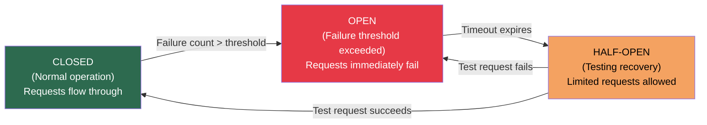
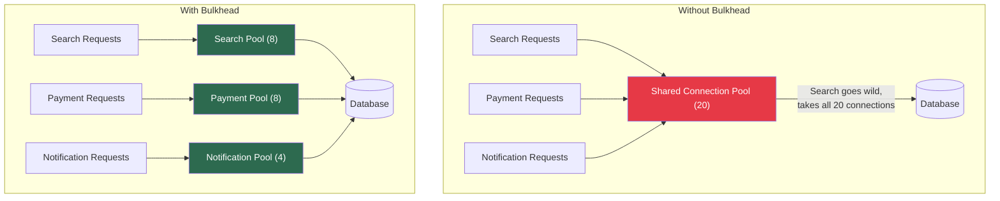

# Failure Patterns in Distributed Systems

## Overview

Production systems fail in predictable patterns. Recognizing these patterns during debugging saves hours. Designing for these patterns prevents outages. This guide covers the most common failure patterns, how to detect them, and how to defend against them.

---

## Common Failure Patterns

### 1. Memory Leaks

Memory gradually increases over time until the process is OOM-killed or becomes unresponsive due to GC pressure.

```typescript
// Pattern 1: Unbounded cache
class LeakyService {
  private cache = new Map<string, unknown>(); // grows forever

  async getData(key: string): Promise<unknown> {
    if (this.cache.has(key)) return this.cache.get(key);
    const data = await this.fetchFromDb(key);
    this.cache.set(key, data); // never evicted
    return data;
  }
}

// Fix: bounded cache with eviction
import { LRUCache } from "lru-cache";

class FixedService {
  private cache = new LRUCache<string, unknown>({
    max: 10_000,                // max entries
    ttl: 5 * 60 * 1000,        // 5 min TTL
    maxSize: 50 * 1024 * 1024,  // 50 MB max
    sizeCalculation: (value) => JSON.stringify(value).length,
  });

  async getData(key: string): Promise<unknown> {
    const cached = this.cache.get(key);
    if (cached) return cached;
    const data = await this.fetchFromDb(key);
    this.cache.set(key, data);
    return data;
  }
}

// Pattern 2: Event listener accumulation
class LeakyEventHandler {
  handleRequest(req: Request): void {
    // BUG: adds a new listener on every request, never removed
    req.socket.on("close", () => {
      this.cleanup(req.id);
    });
  }
}

// Fix: use once() or manual cleanup
class FixedEventHandler {
  handleRequest(req: Request): void {
    req.socket.once("close", () => {
      this.cleanup(req.id);
    });
  }
}

// Pattern 3: Closures retaining large objects
function createHandlers(largeDataset: Buffer[]): (() => void)[] {
  return largeDataset.map((data) => {
    const id = data.toString("utf-8", 0, 36); // only need the ID
    // BUG: closure retains reference to entire `data` buffer
    return () => console.log(`Processing ${id}`);
  });
}

// Fix: extract only what you need before creating the closure
function createHandlersFixed(largeDataset: Buffer[]): (() => void)[] {
  return largeDataset.map((data) => {
    const id = data.toString("utf-8", 0, 36);
    // `data` is no longer in scope — only `id` is retained
    return () => console.log(`Processing ${id}`);
  });
}
```

**Detection:**
- Steadily increasing `process.memoryUsage().heapUsed` over hours/days
- Increasing GC frequency and duration (visible in `--trace-gc` output)
- Process RSS approaching container memory limit
- OOM kill events in container orchestrator logs

---

### 2. Thundering Herd

Multiple clients simultaneously retry or make requests when a resource becomes available, overwhelming it.



```typescript
// Problem: cache key expires, 1000 concurrent requests all miss cache,
// all 1000 hit the database simultaneously

// Fix 1: Cache stampede lock (single-flight pattern)
class StampedeProtectedCache {
  private cache = new LRUCache<string, unknown>({ max: 10_000 });
  private inFlight = new Map<string, Promise<unknown>>();

  async get(key: string, fetchFn: () => Promise<unknown>): Promise<unknown> {
    // Check cache first
    const cached = this.cache.get(key);
    if (cached !== undefined) return cached;

    // If someone else is already fetching this key, wait for their result
    if (this.inFlight.has(key)) {
      return this.inFlight.get(key)!;
    }

    // I'm the first one — fetch and share the result
    const promise = fetchFn().then((result) => {
      this.cache.set(key, result);
      this.inFlight.delete(key);
      return result;
    }).catch((err) => {
      this.inFlight.delete(key);
      throw err;
    });

    this.inFlight.set(key, promise);
    return promise;
  }
}

// Fix 2: Staggered TTLs (jitter)
function setWithJitter(
  cache: LRUCache<string, unknown>,
  key: string,
  value: unknown,
  baseTtlMs: number
): void {
  // Add random jitter: 80-120% of base TTL
  const jitter = baseTtlMs * (0.8 + Math.random() * 0.4);
  cache.set(key, value, { ttl: jitter });
}

// Fix 3: Probabilistic early expiration
function shouldRefresh(ttlRemaining: number, totalTtl: number): boolean {
  // Probability of refresh increases as expiration approaches
  // At 10% remaining TTL, ~63% chance of refresh
  const expirationRatio = 1 - (ttlRemaining / totalTtl);
  return Math.random() < (1 - Math.exp(-10 * expirationRatio));
}
```

---

### 3. Cascading Failures

One service failure causes dependent services to fail, which causes their dependents to fail, until the entire system is down.



**Common cascade triggers:**
- Slow database queries (threads/connections exhausted upstream)
- External API timeout (callers wait and accumulate)
- Resource exhaustion (CPU, memory, file descriptors)
- Retry storms (exponential multiplication of load)

---

### 4. Connection Pool Exhaustion

All database (or HTTP) connections are checked out and waiting, causing new requests to queue or fail.

```typescript
import { Pool } from "pg";

// Problem configuration: pool too small, no timeout
const badPool = new Pool({
  max: 10,                  // only 10 connections
  // no idle timeout
  // no connection timeout
  // no statement timeout
});

// Good configuration: properly bounded and timed out
const goodPool = new Pool({
  max: 20,                         // sized for expected concurrency
  min: 5,                          // keep some connections warm
  idleTimeoutMillis: 30_000,       // close idle connections after 30s
  connectionTimeoutMillis: 5_000,  // fail fast if can't get connection in 5s
  statement_timeout: 10_000,       // kill queries running > 10s
  query_timeout: 15_000,           // overall query timeout including queue
});

// Monitor pool health
setInterval(() => {
  console.log({
    pool: {
      total: goodPool.totalCount,
      idle: goodPool.idleCount,
      waiting: goodPool.waitingCount, // requests waiting for a connection
    },
  });

  if (goodPool.waitingCount > 10) {
    console.warn("Connection pool pressure — requests queuing");
  }
}, 5_000);
```

---

### 5. Retry Storms

Exponential multiplication of failed requests when many clients retry simultaneously without coordination.

```typescript
// Bad: retry without backoff or jitter
async function fetchDataBad(url: string): Promise<Response> {
  for (let i = 0; i < 3; i++) {
    try {
      return await fetch(url);
    } catch {
      // Immediately retry — all clients retry at the same time
      continue;
    }
  }
  throw new Error("All retries failed");
}

// Good: exponential backoff with jitter
async function fetchDataGood(
  url: string,
  maxRetries = 3,
  baseDelayMs = 1000
): Promise<Response> {
  for (let attempt = 0; attempt <= maxRetries; attempt++) {
    try {
      const response = await fetch(url, {
        signal: AbortSignal.timeout(5000), // timeout per attempt
      });

      if (response.status === 429 || response.status >= 500) {
        throw new Error(`Server error: ${response.status}`);
      }

      return response;
    } catch (err) {
      if (attempt === maxRetries) throw err;

      // Exponential backoff: 1s, 2s, 4s
      const exponentialDelay = baseDelayMs * Math.pow(2, attempt);
      // Add jitter: 0-100% of the delay (decorrelated jitter)
      const jitter = Math.random() * exponentialDelay;
      const delay = exponentialDelay + jitter;

      console.warn({
        attempt: attempt + 1,
        maxRetries,
        nextRetryMs: Math.round(delay),
        error: (err as Error).message,
      }, "Retrying request");

      await new Promise((resolve) => setTimeout(resolve, delay));
    }
  }
  throw new Error("Unreachable");
}
```

---

### 6. Race Conditions

```typescript
// Classic race condition: check-then-act
async function transferFunds(
  fromAccount: string,
  toAccount: string,
  amount: number
): Promise<void> {
  // BUG: another request could modify balance between read and write
  const balance = await db.query(
    "SELECT balance FROM accounts WHERE id = $1",
    [fromAccount]
  );

  if (balance.rows[0].balance >= amount) {
    // Time gap: balance could have changed
    await db.query(
      "UPDATE accounts SET balance = balance - $1 WHERE id = $2",
      [amount, fromAccount]
    );
    await db.query(
      "UPDATE accounts SET balance = balance + $1 WHERE id = $2",
      [amount, toAccount]
    );
  }
}

// Fix: use database transaction with row-level locking
async function transferFundsSafe(
  fromAccount: string,
  toAccount: string,
  amount: number
): Promise<void> {
  const client = await pool.connect();
  try {
    await client.query("BEGIN");

    // SELECT ... FOR UPDATE locks the row until transaction completes
    const balance = await client.query(
      "SELECT balance FROM accounts WHERE id = $1 FOR UPDATE",
      [fromAccount]
    );

    if (balance.rows[0].balance < amount) {
      await client.query("ROLLBACK");
      throw new Error("Insufficient funds");
    }

    await client.query(
      "UPDATE accounts SET balance = balance - $1 WHERE id = $2",
      [amount, fromAccount]
    );
    await client.query(
      "UPDATE accounts SET balance = balance + $1 WHERE id = $2",
      [amount, toAccount]
    );

    await client.query("COMMIT");
  } catch (err) {
    await client.query("ROLLBACK");
    throw err;
  } finally {
    client.release();
  }
}
```

---

## Defensive Patterns

### Circuit Breaker

Prevents cascading failures by stopping calls to a failing service.



```typescript
enum CircuitState {
  CLOSED = "CLOSED",
  OPEN = "OPEN",
  HALF_OPEN = "HALF_OPEN",
}

class CircuitBreaker {
  private state = CircuitState.CLOSED;
  private failureCount = 0;
  private lastFailureTime = 0;
  private successCount = 0;

  constructor(
    private readonly options: {
      failureThreshold: number;       // failures before opening
      resetTimeoutMs: number;         // time before trying half-open
      halfOpenMaxAttempts: number;     // successes needed to close
      monitorWindowMs: number;         // window for counting failures
    }
  ) {}

  async execute<T>(fn: () => Promise<T>): Promise<T> {
    if (this.state === CircuitState.OPEN) {
      if (Date.now() - this.lastFailureTime > this.options.resetTimeoutMs) {
        this.state = CircuitState.HALF_OPEN;
        this.successCount = 0;
        console.warn("Circuit breaker: OPEN -> HALF_OPEN");
      } else {
        throw new Error("Circuit breaker is OPEN — request rejected");
      }
    }

    try {
      const result = await fn();

      if (this.state === CircuitState.HALF_OPEN) {
        this.successCount++;
        if (this.successCount >= this.options.halfOpenMaxAttempts) {
          this.state = CircuitState.CLOSED;
          this.failureCount = 0;
          console.info("Circuit breaker: HALF_OPEN -> CLOSED");
        }
      } else {
        this.failureCount = 0; // reset on success in CLOSED state
      }

      return result;
    } catch (err) {
      this.failureCount++;
      this.lastFailureTime = Date.now();

      if (
        this.state === CircuitState.HALF_OPEN ||
        this.failureCount >= this.options.failureThreshold
      ) {
        this.state = CircuitState.OPEN;
        console.error(
          { failureCount: this.failureCount },
          "Circuit breaker: -> OPEN"
        );
      }

      throw err;
    }
  }

  getState(): CircuitState {
    return this.state;
  }
}

// Usage
const paymentCircuit = new CircuitBreaker({
  failureThreshold: 5,
  resetTimeoutMs: 30_000,
  halfOpenMaxAttempts: 3,
  monitorWindowMs: 60_000,
});

async function chargePayment(order: Order): Promise<PaymentResult> {
  return paymentCircuit.execute(() =>
    fetch("https://payment-processor.com/charge", {
      method: "POST",
      body: JSON.stringify(order),
      signal: AbortSignal.timeout(5000),
    }).then((r) => r.json())
  );
}
```

---

### Bulkhead Pattern

Isolates different parts of the system so a failure in one doesn't consume all shared resources.



```typescript
// Bulkhead implementation using semaphores
class Bulkhead {
  private active = 0;
  private queue: (() => void)[] = [];

  constructor(
    private readonly name: string,
    private readonly maxConcurrent: number,
    private readonly maxQueueSize: number = 100
  ) {}

  async execute<T>(fn: () => Promise<T>): Promise<T> {
    if (this.active >= this.maxConcurrent) {
      if (this.queue.length >= this.maxQueueSize) {
        throw new Error(
          `Bulkhead ${this.name} rejected: ${this.active} active, ${this.queue.length} queued`
        );
      }

      // Wait for a slot
      await new Promise<void>((resolve) => this.queue.push(resolve));
    }

    this.active++;
    try {
      return await fn();
    } finally {
      this.active--;
      if (this.queue.length > 0) {
        const next = this.queue.shift()!;
        next();
      }
    }
  }
}

// Separate bulkheads for different workloads
const searchBulkhead = new Bulkhead("search", 50, 200);
const paymentBulkhead = new Bulkhead("payment", 20, 50);
const notificationBulkhead = new Bulkhead("notification", 10, 100);
```

---

## Failure Pattern Summary Table

| Pattern | Symptom | Detection | Prevention | Recovery |
|---------|---------|-----------|------------|----------|
| Memory Leak | Gradual memory growth, OOM kills | Heap snapshot comparison, RSS monitoring | Bounded caches (LRU), listener cleanup | Restart process (short-term), fix leak (long-term) |
| Thundering Herd | Spike in DB/API load after cache expiry | Correlate cache TTL with load spikes | Stampede lock, jittered TTL, early refresh | Rate limit at cache layer |
| Cascading Failure | Domino-like service failures | Dependency health monitoring, latency propagation | Circuit breakers, bulkheads, timeouts | Break the chain: shed load, circuit break |
| Connection Pool Exhaustion | Requests queuing, timeouts | Pool waiting count metric | Proper pool sizing, connection timeout, statement timeout | Restart service, kill long queries |
| Retry Storm | N-fold load multiplication | Sudden load increase after partial failure | Exponential backoff with jitter, circuit breakers | Back off retries, circuit break |
| Race Condition | Intermittent data corruption | Hard to detect; found via load testing or audits | DB transactions with locks, atomic operations, idempotency | Fix the race; audit affected data |
| Event Loop Blocking | All requests hang simultaneously | Event loop lag metric > 100ms | Offload CPU work to worker threads | Identify and remove the blocking call |
| Disk Full | Write failures, service crash | Disk usage alerts at 80%, 90% | Log rotation, retention policies, storage alerts | Clear space, add capacity |

---

## Designing for Failure

Key principles:

1. **Timeouts on everything** — every external call needs a timeout. No exceptions.
2. **Circuit breakers on external dependencies** — stop hammering a failing service.
3. **Bulkheads for resource isolation** — don't let one workload starve another.
4. **Exponential backoff with jitter on retries** — prevent retry storms.
5. **Graceful degradation** — serve stale cache data instead of failing entirely.
6. **Health checks that test real dependencies** — not just "process is running."
7. **Load shedding** — reject requests early when overloaded (return 503).
8. **Idempotency** — make it safe to retry any operation.

---

## Interview Q&A

> **Q: Walk me through how a cascading failure happens and how you'd prevent it.**
>
> A: A cascading failure starts when one component slows down or fails, causing its callers to wait longer, which exhausts their resources (threads, connections, memory), which then makes *their* callers wait, and so on. Classic example: a slow database query causes the service to hold all its DB connections waiting, which causes the API gateway to queue requests, which causes clients to timeout and retry, doubling the load. Prevention layers: (1) Timeouts on every external call — fail fast instead of waiting indefinitely. (2) Circuit breakers — after N failures, stop calling the failing service and return a fallback. (3) Bulkheads — isolate connection pools per dependency so one slow service can't starve others. (4) Load shedding — when the service is overloaded, reject new requests with 503 rather than queuing them. (5) Client-side backoff — ensure retries don't multiply load.

> **Q: How does a circuit breaker work? What are the three states?**
>
> A: A circuit breaker has three states: CLOSED (normal operation, requests flow through), OPEN (failure threshold exceeded, requests immediately fail with a fallback), and HALF-OPEN (after a timeout, a limited number of test requests are allowed through). In CLOSED state, it counts failures; when failures exceed the threshold within a time window, it transitions to OPEN. In OPEN state, all requests are rejected immediately without calling the downstream service — this prevents wasting resources on a known-failing dependency. After a configurable timeout, it transitions to HALF-OPEN and allows a few test requests. If they succeed, it transitions back to CLOSED. If they fail, it returns to OPEN. This gives the failing service time to recover without being overwhelmed.

> **Q: What's the difference between a circuit breaker and a bulkhead?**
>
> A: They solve different aspects of failure isolation. A circuit breaker detects a failing dependency and stops calling it, protecting the upstream service from wasting resources on doomed requests. A bulkhead partitions resources (connections, threads, memory) so that one workload can't consume all shared resources and starve others. Think of it this way: the circuit breaker protects you from a failing downstream service, while the bulkhead protects you from one type of request monopolizing all your resources. In practice, you use both together: bulkheads to isolate resources per dependency, and circuit breakers on each bulkhead to detect and stop calling failing dependencies.

> **Q: How would you detect a memory leak in a production Node.js service?**
>
> A: First, I'd monitor `process.memoryUsage().heapUsed` and container RSS over time. A memory leak shows a sawtooth pattern where each GC cycle recovers less memory — the baseline keeps rising. To find the leak, I'd take two heap snapshots separated by the period of growth: snapshot A, wait for the suspected leak to occur many times, force GC (`--expose-gc` + `global.gc()`), snapshot B. In Chrome DevTools, I'd compare the snapshots and sort by "Objects allocated between snapshot A and B" — this shows exactly what objects are accumulating. The most common leaks I've seen in Node.js: unbounded Maps/Sets used as caches, event listeners added in request handlers but never removed, closures retaining large buffers, and unconsumed HTTP response bodies.

> **Q: Explain exponential backoff with jitter. Why is the jitter important?**
>
> A: Exponential backoff increases the delay between retries exponentially (e.g., 1s, 2s, 4s, 8s), giving the failing service time to recover. But if 1000 clients all start retrying at the same time with the same backoff schedule, they'll all retry at exactly the same moments (1s, 2s, 4s later), creating synchronized load spikes — essentially a retry-driven thundering herd. Jitter adds randomness to the delay, spreading retries across time. Full jitter picks a random value between 0 and the exponential delay. Decorrelated jitter (preferred) uses the previous delay to compute the next range. The jitter ensures that retrying clients don't all hit the recovering service simultaneously, giving it a smooth, gradually increasing load instead of periodic spikes.

> **Q: A service you own is experiencing intermittent 5xx errors that correlate with another team's service deployments. How would you handle this cross-team issue?**
>
> A: First, I'd gather evidence: correlate my error timestamps with their deployment timestamps, capture the exact error responses and latency patterns during their deploys, and check if their deploys cause a brief period of 5xx or increased latency. Then I'd approach it collaboratively with data. For immediate mitigation in my service: add a circuit breaker on calls to their service, implement a fallback or graceful degradation path (serve stale data, queue for retry, show a friendly error), and add retry with backoff for transient failures. For long-term resolution: work with their team to implement zero-downtime deployments (rolling updates, canary), ensure their health checks gate traffic correctly, and establish an SLA with agreed-upon error budgets. The key is not to blame but to make my service resilient to their (and any) dependency's instability.
