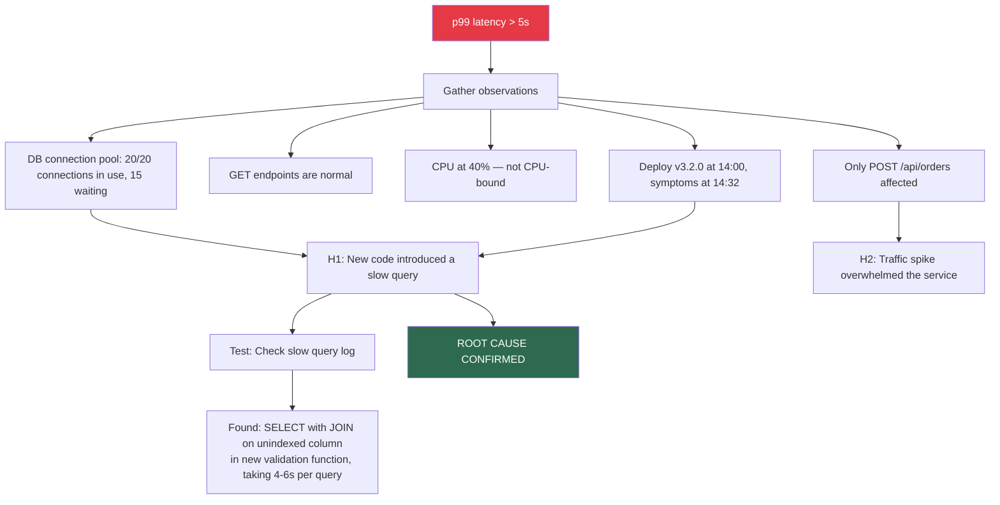
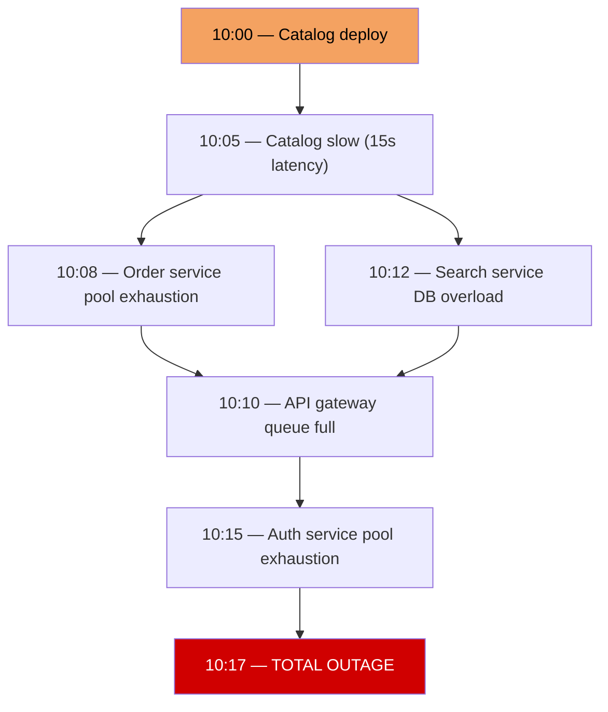
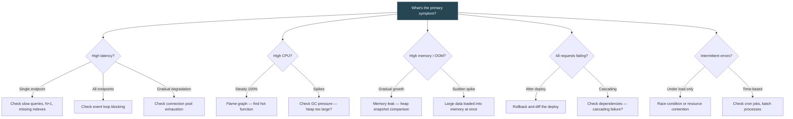

# Debugging Scenarios — Guided Walkthroughs

## How to Use These Scenarios

Each scenario follows a realistic production incident. Work through them step by step:
1. Read the **Situation** — understand the symptoms.
2. Try to form your own hypotheses before reading the **Investigation** section.
3. Follow the **Investigation** steps and see if your hypothesis was correct.
4. Study the **Root Cause** and **Fix** for interview-ready answers.
5. Review the **Prevention** section — interviewers love hearing about systemic fixes.

---

## Scenario 1: API Latency Spike

### Situation

**Service:** `order-service` (Node.js + Express + PostgreSQL)
**Alert:** p99 latency for `POST /api/orders` jumped from 200ms to 8s at 14:32 UTC.
**Impact:** 40% of orders timing out. Revenue impact estimated at $50K/hour.
**Recent changes:** Deployed v3.2.0 at 14:00 (new order validation feature). Marketing campaign launched at 14:15 (2x traffic).

### Investigation



**Step-by-step investigation:**

```typescript
// Step 1: Check metrics dashboard
// - p99 latency spike starts at 14:32, not 14:00 (deploy time)
// - Why 32-minute delay? Traffic ramp-up from campaign filled connection pool

// Step 2: Check DB connection pool metrics
// pool.totalCount: 20, pool.idleCount: 0, pool.waitingCount: 15
// All connections are in use and requests are queuing

// Step 3: Check slow query log
// Found in PostgreSQL logs:
// LOG: duration: 4523.123 ms  statement: SELECT o.*, v.* FROM orders o
//   JOIN order_validations v ON o.id = v.order_id
//   WHERE o.user_id = 12345 AND v.status = 'pending'
// The `order_validations` table has no index on `order_id`

// Step 4: Verify with EXPLAIN ANALYZE
// EXPLAIN ANALYZE SELECT o.*, v.* FROM orders o
//   JOIN order_validations v ON o.id = v.order_id
//   WHERE o.user_id = 12345 AND v.status = 'pending';
//
// -> Seq Scan on order_validations (cost=0.00..45123.00 rows=2000000)
//    Actual time: 3891.234..4521.123
// MISSING INDEX on order_validations.order_id
```

### Root Cause

The v3.2.0 deployment added a new validation query that joins with `order_validations` table (2M rows) without an index on the join column. At low traffic, the pool could absorb the 4-6s queries. When the marketing campaign doubled traffic, all 20 connections were consumed by slow queries, causing all new requests to queue.

### Fix

```sql
-- Immediate: add the missing index
CREATE INDEX CONCURRENTLY idx_order_validations_order_id
  ON order_validations(order_id);

-- Immediate: increase connection pool size temporarily
-- pool.max: 20 -> 40

-- Verify: p99 drops from 8s to 180ms within 2 minutes
```

### Prevention

- Add slow query detection to CI pipeline (EXPLAIN ANALYZE on all new queries against production-sized data)
- Add connection pool waiting count alert (> 5 waiting = warning)
- Load test new features with production-scale data before deploy

---

## Scenario 2: Memory Leak in Production

### Situation

**Service:** `notification-service` (Node.js)
**Alert:** Container OOM-killed for the 3rd time this week. Restarts automatically but loses in-flight notifications.
**Pattern:** Memory grows linearly from 256MB at startup to 1.5GB over ~6 hours, then OOM kill.
**Recent changes:** None in the last 2 weeks.

### Investigation

```typescript
// Step 1: Confirm the pattern
// Memory usage graph shows steady linear growth — textbook leak

// Step 2: Take heap snapshots
// Snapshot A: immediately after restart (baseline)
// Wait 1 hour, force GC
// Snapshot B: 1 hour later

// Step 3: Compare snapshots in Chrome DevTools
// Sort by "Objects allocated between snapshots"
// Finding: 45,000 new `Timeout` objects
//          12,000 new `EventEmitter` objects
//          8,000 new `Socket` objects

// Step 4: Trace the Timeout objects
// They're coming from a WebSocket heartbeat implementation:

class NotificationGateway {
  private connections = new Map<string, WebSocket>();

  onConnect(ws: WebSocket, userId: string): void {
    this.connections.set(userId, ws);

    // BUG: heartbeat interval is never cleared when connection closes
    const heartbeatInterval = setInterval(() => {
      if (ws.readyState === WebSocket.OPEN) {
        ws.ping();
      }
    }, 30_000);

    // The connection close handler doesn't clear the interval
    ws.on("close", () => {
      this.connections.delete(userId);
      // MISSING: clearInterval(heartbeatInterval);
    });
  }
}

// Each interval holds a reference to `ws`, which holds references to
// buffers, event listeners, and the socket — preventing GC
```

### Root Cause

WebSocket heartbeat intervals are never cleared when connections close. Each leaked interval retains a reference chain: `Timeout -> closure -> WebSocket -> Socket -> Buffers`. With ~2000 connections/hour and ~30% disconnect rate, ~600 intervals leak per hour. Over 6 hours: ~3600 leaked intervals with associated objects.

### Fix

```typescript
class NotificationGatewayFixed {
  private connections = new Map<string, WebSocket>();

  onConnect(ws: WebSocket, userId: string): void {
    this.connections.set(userId, ws);

    const heartbeatInterval = setInterval(() => {
      if (ws.readyState === WebSocket.OPEN) {
        ws.ping();
      }
    }, 30_000);

    // Fix: clear interval on close AND on error
    const cleanup = () => {
      clearInterval(heartbeatInterval);
      this.connections.delete(userId);
    };

    ws.on("close", cleanup);
    ws.on("error", cleanup);
  }
}
```

### Prevention

- Add `process.memoryUsage()` metrics to monitoring dashboard
- Alert when heap growth rate exceeds 50MB/hour sustained
- Add a periodic check for excessive event listeners: `process.getMaxListeners()`
- Code review checklist: "Does every setInterval have a corresponding clearInterval?"

---

## Scenario 3: Database Connection Exhaustion

### Situation

**Service:** `user-service` (Node.js + PostgreSQL)
**Alert:** All database connections exhausted. Service returning 503 for all requests.
**Error:** `TimeoutError: Timed out waiting for a connection from the pool after 5000ms`
**Dashboard:** Pool total: 20, idle: 0, waiting: 150+

### Investigation

```typescript
// Step 1: Check if queries are slow
// PostgreSQL: SELECT pid, query, state, now() - query_start AS duration
//   FROM pg_stat_activity WHERE state = 'active' ORDER BY duration DESC;
//
// Finding: 18 of 20 connections running the same query:
// SELECT * FROM users WHERE email = $1 FOR UPDATE
// Duration: 45s, 42s, 39s, ... (all waiting on row lock)

// Step 2: Find the lock holder
// SELECT blocked.pid AS blocked_pid, blocking.pid AS blocking_pid,
//   blocking.query AS blocking_query
// FROM pg_locks blocked
// JOIN pg_locks blocking ON blocking.locktype = blocked.locktype
//   AND blocking.relation = blocked.relation
// WHERE NOT blocked.granted;
//
// Finding: PID 12345 is holding a lock on users.id=67890
// Query: UPDATE users SET last_login = NOW() WHERE id = 67890
// Started: 2 minutes ago, state: "idle in transaction"

// Step 3: What opened that transaction?
// Check application logs for the request that opened the transaction
// Found: the "update last login" endpoint starts a transaction but
// doesn't commit/rollback if the downstream analytics call times out

async function recordLogin(userId: string): Promise<void> {
  const client = await pool.connect();
  await client.query("BEGIN");
  await client.query(
    "UPDATE users SET last_login = NOW() WHERE id = $1",
    [userId]
  );

  // BUG: if this call times out, the transaction stays open
  // The connection is returned to the pool in "idle in transaction" state
  // The row lock is held indefinitely
  await analyticsService.trackLogin(userId);

  await client.query("COMMIT");
  client.release();
}
```

### Root Cause

The `recordLogin` function opens a transaction, acquires a row lock, then makes an HTTP call to an external analytics service. When that call times out, the function throws an error but the transaction is never rolled back and the connection is never properly released. The connection returns to the pool in "idle in transaction" state, holding the row lock. Other requests for the same user row wait on the lock, consuming more connections. Eventually all connections are consumed.

### Fix

```typescript
async function recordLoginFixed(userId: string): Promise<void> {
  const client = await pool.connect();
  try {
    await client.query("BEGIN");
    await client.query(
      "UPDATE users SET last_login = NOW() WHERE id = $1",
      [userId]
    );
    await client.query("COMMIT");
  } catch (err) {
    await client.query("ROLLBACK");
    throw err;
  } finally {
    client.release(); // ALWAYS release, even on error
  }

  // Move the analytics call OUTSIDE the transaction
  // It doesn't need the DB transaction at all
  try {
    await analyticsService.trackLogin(userId);
  } catch {
    // Analytics failure should not affect login
    console.warn({ userId }, "Failed to track login analytics");
  }
}
```

### Prevention

- PostgreSQL: set `idle_in_transaction_session_timeout = '30s'` to auto-kill abandoned transactions
- Lint rule: never make HTTP calls inside a database transaction
- Connection pool: monitor `waitingCount` and alert at threshold
- Add `statement_timeout` to prevent any single query from running too long

---

## Scenario 4: Cascading Failure Across Services

### Situation

**System:** 6 microservices behind an API gateway
**Alert:** All services returning 5xx. Total outage.
**Timeline:**
- 10:00 — Catalog service deployment (new version)
- 10:05 — Catalog service p99 latency increases from 50ms to 15s
- 10:08 — Order service connection pool exhausted (waiting on catalog)
- 10:10 — API gateway queues full (waiting on order service)
- 10:12 — Search service fails (shared database with catalog, now overloaded)
- 10:15 — Auth service fails (connection pool exhausted from retries)
- 10:17 — Total outage



### Investigation

```typescript
// Step 1: The catalog deploy introduced an N+1 query
// For each product in a catalog page (50 products), it now makes
// a separate query to fetch reviews. 50 queries * 200ms = 10s per request.

// Step 2: Order service calls catalog with a 30s timeout
// Instead of failing fast at, say, 2s, it holds connections for up to 30s
// 20 connections * 30s timeout = pool exhausted in under 2 minutes under load

// Step 3: No circuit breaker on catalog -> order dependency
// Order service keeps calling catalog even though every call is timing out

// Step 4: Client-side retries multiply the load
// Default retry config: 3 retries with 1s delay (no exponential backoff)
// 1000 req/s * 3 retries = 3000 req/s hitting catalog
```

### Root Cause

The catalog service deployment introduced an N+1 query that increased latency by 300x. Without circuit breakers or proper timeouts in upstream services, the latency propagated through the entire call chain. Retry storms multiplied the load, and shared resources (database, connection pools) became bottlenecks that took down services that were otherwise healthy.

### Fix (Immediate)

```bash
# 1. Roll back catalog service to previous version
kubectl rollout undo deployment/catalog-service

# 2. Restart order service to clear connection pool
kubectl rollout restart deployment/order-service

# 3. Services recover in dependency order (bottom-up)
```

### Fix (Systemic)

```typescript
// 1. Add circuit breakers on all inter-service calls
const catalogCircuit = new CircuitBreaker({
  failureThreshold: 5,
  resetTimeoutMs: 30_000,
  halfOpenMaxAttempts: 3,
});

// 2. Reduce timeouts to fail fast
// Bad: 30s timeout on internal service call
// Good: 2s timeout — if catalog can't respond in 2s, it's broken
const response = await fetch(catalogUrl, {
  signal: AbortSignal.timeout(2000),
});

// 3. Add fallback for catalog data
async function getCatalogItem(id: string): Promise<CatalogItem> {
  try {
    return await catalogCircuit.execute(() => catalogService.get(id));
  } catch {
    // Fallback: serve from local cache (stale but available)
    return catalogCache.get(id) ?? { id, name: "Temporarily unavailable" };
  }
}

// 4. Fix the N+1 query
// Before: 50 individual queries
// After: single batched query with JOIN
```

---

## Scenario 5: Race Condition in Order Processing

### Situation

**Service:** `order-service`
**Report:** Customer support tickets: "I was charged twice for the same order."
**Frequency:** ~5 occurrences per day out of 50,000 orders.
**Pattern:** Always during high-traffic periods. Always from users who double-click the submit button.

### Investigation

```typescript
// Step 1: Check order database
// Found: duplicate orders for same user, same items, created within 500ms
// Both have successful payment records

// Step 2: Trace the code
async function createOrder(req: Request): Promise<Response> {
  const { userId, items } = req.body;

  // Check for duplicate (RACE CONDITION HERE)
  const existing = await db.query(
    "SELECT id FROM orders WHERE user_id = $1 AND status = 'pending' AND created_at > NOW() - INTERVAL '1 minute'",
    [userId]
  );

  if (existing.rows.length > 0) {
    return { status: 409, body: { error: "Duplicate order" } };
  }

  // BUG: Both requests pass the duplicate check because neither has
  // written to the DB yet. Then both proceed to create an order.
  const order = await db.query(
    "INSERT INTO orders (user_id, items, status) VALUES ($1, $2, 'pending') RETURNING id",
    [userId, JSON.stringify(items)]
  );

  // Both requests charge the payment
  await paymentService.charge(userId, calculateTotal(items));

  return { status: 201, body: { orderId: order.rows[0].id } };
}

// Timeline of the race:
// T+0ms:  Request A checks for duplicates -> none found
// T+5ms:  Request B checks for duplicates -> none found (A hasn't inserted yet)
// T+10ms: Request A inserts order
// T+15ms: Request B inserts order (duplicate!)
// T+50ms: Request A charges payment
// T+55ms: Request B charges payment (double charge!)
```

### Root Cause

Classic check-then-act race condition. Two concurrent requests both pass the duplicate check before either writes to the database.

### Fix

```typescript
// Fix 1: Idempotency key (preferred)
async function createOrderFixed(req: Request): Promise<Response> {
  const { userId, items } = req.body;
  // Client sends a unique idempotency key (UUID generated on button click)
  const idempotencyKey = req.headers["idempotency-key"] as string;

  if (!idempotencyKey) {
    return { status: 400, body: { error: "Idempotency-Key header required" } };
  }

  const client = await pool.connect();
  try {
    await client.query("BEGIN");

    // Use advisory lock on idempotency key hash to serialize requests
    const lockKey = hashToInt(idempotencyKey);
    await client.query("SELECT pg_advisory_xact_lock($1)", [lockKey]);

    // Check if this idempotency key was already processed
    const existing = await client.query(
      "SELECT id, response FROM idempotency_keys WHERE key = $1",
      [idempotencyKey]
    );

    if (existing.rows.length > 0) {
      await client.query("COMMIT");
      return JSON.parse(existing.rows[0].response);
    }

    // Process the order
    const order = await client.query(
      "INSERT INTO orders (user_id, items, status) VALUES ($1, $2, 'pending') RETURNING id",
      [userId, JSON.stringify(items)]
    );

    // Store idempotency record
    const response = { status: 201, body: { orderId: order.rows[0].id } };
    await client.query(
      "INSERT INTO idempotency_keys (key, response) VALUES ($1, $2)",
      [idempotencyKey, JSON.stringify(response)]
    );

    await client.query("COMMIT");
    return response;
  } catch (err) {
    await client.query("ROLLBACK");
    throw err;
  } finally {
    client.release();
  }
}

// Fix 2: Database unique constraint (simpler but less flexible)
// CREATE UNIQUE INDEX idx_orders_idempotency
//   ON orders (idempotency_key);
// Second insert will fail with unique violation -> catch and return existing order
```

---

## Scenario 6: OOM Kill in Container

### Situation

**Service:** `report-service` (Node.js)
**Alert:** Container killed by OOM (exceeded 512MB limit). Happens when generating large customer reports.
**Pattern:** Only happens for enterprise customers with 100K+ records.

### Investigation

```typescript
// Step 1: Check what the report generation does
async function generateReport(customerId: string): Promise<Buffer> {
  // BUG: loads ALL records into memory at once
  const records = await db.query(
    "SELECT * FROM transactions WHERE customer_id = $1",
    [customerId]
  );
  // For enterprise customers: 100,000+ rows, each ~2KB = 200MB+ in memory

  // Then converts to CSV — creates another full copy in memory
  const csv = records.rows.map((row) =>
    Object.values(row).join(",")
  ).join("\n");

  // Then converts to Buffer — yet another copy
  return Buffer.from(csv);
  // Total memory: ~600MB for 100K records (3 copies)
}
```

### Root Cause

The report generator loads the entire dataset into memory, creates a CSV string (second copy), and then converts to a Buffer (third copy). For large enterprise customers, this exceeds the 512MB container limit.

### Fix

```typescript
import { pipeline, Transform } from "stream";
import { promisify } from "util";
import QueryStream from "pg-query-stream";

const pipelineAsync = promisify(pipeline);

// Fix: use streaming — constant memory usage regardless of dataset size
async function generateReportStreaming(
  customerId: string,
  outputStream: NodeJS.WritableStream
): Promise<void> {
  const client = await pool.connect();
  try {
    const query = new QueryStream(
      "SELECT * FROM transactions WHERE customer_id = $1",
      [customerId],
      { batchSize: 1000 } // fetch 1000 rows at a time
    );

    const dbStream = client.query(query);

    const csvTransform = new Transform({
      objectMode: true,
      transform(row, _encoding, callback) {
        const csvLine = Object.values(row).join(",") + "\n";
        callback(null, csvLine);
      },
    });

    // Stream directly from DB -> CSV transform -> HTTP response
    // Memory usage: ~constant (~10MB) regardless of dataset size
    await pipelineAsync(dbStream, csvTransform, outputStream);
  } finally {
    client.release();
  }
}

// Express route
app.get("/api/reports/:customerId", async (req, res) => {
  res.setHeader("Content-Type", "text/csv");
  res.setHeader("Content-Disposition", `attachment; filename="report-${req.params.customerId}.csv"`);
  await generateReportStreaming(req.params.customerId, res);
});
```

---

## Scenario 7: Event Loop Blocking

### Situation

**Service:** `api-gateway` (Node.js)
**Alert:** All endpoints returning 504 Gateway Timeout simultaneously. Server is not crashed — process is running, CPU at 100% on one core.
**Duration:** Lasts 10-30 seconds, then resolves. Happens 2-3 times per day.

### Investigation

```typescript
// Step 1: The event loop lag metric shows 15-30 second spikes
// When event loop is blocked, ALL requests queue — explains simultaneous 504s

// Step 2: CPU profile during the spike shows 100% time in:
//   JSON.parse() called from refreshConfig()

// Step 3: Find the code
class ConfigManager {
  private config: AppConfig;

  constructor() {
    // Refresh config from file every 60 seconds
    setInterval(() => this.refreshConfig(), 60_000);
  }

  refreshConfig(): void {
    // BUG: synchronous file read + JSON parse of a 50MB config file
    const raw = fs.readFileSync("/data/feature-flags.json", "utf-8");
    this.config = JSON.parse(raw); // Blocks event loop for 10-30 seconds
  }
}

// The 50MB config file comes from a feature flag system that dumps
// ALL tenant configurations into a single file. It grew from 1MB to 50MB
// over the past year as tenants were added.
```

### Root Cause

Synchronous file read + JSON parse of a 50MB file blocks the event loop for 10-30 seconds. This runs on a 60-second interval timer, blocking all request handling during parse time.

### Fix

```typescript
class ConfigManagerFixed {
  private config: AppConfig;

  constructor() {
    setInterval(() => this.refreshConfig(), 60_000);
  }

  async refreshConfig(): Promise<void> {
    // Fix 1: Async file read (doesn't block event loop during I/O)
    const raw = await fs.promises.readFile("/data/feature-flags.json", "utf-8");

    // Fix 2: Parse in a worker thread (doesn't block main event loop)
    const parsed = await this.parseInWorker(raw);
    this.config = parsed;
  }

  private parseInWorker(json: string): Promise<AppConfig> {
    return new Promise((resolve, reject) => {
      const worker = new Worker(
        `
        const { parentPort, workerData } = require("worker_threads");
        const parsed = JSON.parse(workerData);
        parentPort.postMessage(parsed);
        `,
        { eval: true, workerData: json }
      );
      worker.on("message", resolve);
      worker.on("error", reject);
    });
  }
}

// Fix 3 (architectural): Don't load 50MB file
// Fetch only the relevant tenant's config, or use a config service
// that supports querying by tenant ID
```

---

## Scenario 8: High CPU Usage

### Situation

**Service:** `search-service` (Node.js)
**Alert:** CPU consistently at 95% across all pods. p99 latency degraded from 100ms to 1.5s.
**Traffic:** Normal levels — no traffic spike.
**Recent changes:** Deployed v4.1.0 two days ago with new "fuzzy search" feature.

### Investigation

```typescript
// Step 1: Generate flame graph with 0x
// $ 0x -- node server.js
// $ npx autocannon -c 50 -d 60 http://localhost:3000/api/search?q=test

// Step 2: Flame graph analysis
// 78% of CPU time in: fuzzyMatch() -> levenshteinDistance()
// The new fuzzy search calculates Levenshtein distance between the
// search query and EVERY product name in the result set

function fuzzyMatch(query: string, candidates: string[]): ScoredResult[] {
  return candidates.map((candidate) => ({
    text: candidate,
    // O(n*m) per comparison, called for every candidate
    score: levenshteinDistance(query, candidate),
  })).sort((a, b) => a.score - b.score);
}

function levenshteinDistance(a: string, b: string): number {
  // Classic O(n*m) dynamic programming implementation
  const matrix: number[][] = [];
  for (let i = 0; i <= a.length; i++) {
    matrix[i] = [i];
    for (let j = 1; j <= b.length; j++) {
      if (i === 0) {
        matrix[i][j] = j;
      } else {
        matrix[i][j] = Math.min(
          matrix[i - 1][j] + 1,
          matrix[i][j - 1] + 1,
          matrix[i - 1][j - 1] + (a[i - 1] !== b[j - 1] ? 1 : 0)
        );
      }
    }
  }
  return matrix[a.length][b.length];
}

// Problem: 1000 search results * Levenshtein on each = massive CPU
// Levenshtein on 50-char strings = 2500 operations per call
// 1000 * 2500 = 2.5M operations per search request
```

### Root Cause

The new fuzzy search feature calculates Levenshtein distance against every candidate result. This is O(n * m * k) where n = number of candidates, m = query length, k = candidate length. For 1000 candidates with ~50 character strings, this is 2.5M operations per request.

### Fix

```typescript
// Fix 1: Pre-filter candidates before fuzzy matching
function fuzzyMatchOptimized(query: string, candidates: string[]): ScoredResult[] {
  // Step 1: Fast pre-filter using trigram similarity (eliminates 90% of candidates)
  const queryTrigrams = new Set(getTrigrams(query.toLowerCase()));
  const preFiltered = candidates.filter((c) => {
    const candidateTrigrams = getTrigrams(c.toLowerCase());
    const overlap = [...queryTrigrams].filter((t) => candidateTrigrams.has(t)).length;
    return overlap / queryTrigrams.size > 0.3; // at least 30% trigram overlap
  });

  // Step 2: Levenshtein only on pre-filtered set (~100 instead of 1000)
  return preFiltered.map((candidate) => ({
    text: candidate,
    score: levenshteinDistance(query, candidate),
  })).sort((a, b) => a.score - b.score).slice(0, 20); // only return top 20
}

function getTrigrams(str: string): Set<string> {
  const trigrams = new Set<string>();
  for (let i = 0; i <= str.length - 3; i++) {
    trigrams.add(str.substring(i, i + 3));
  }
  return trigrams;
}

// Fix 2: Use PostgreSQL's built-in trigram similarity (pg_trgm extension)
// SELECT *, similarity(name, $1) AS sim
// FROM products
// WHERE name % $1  -- uses GiST index on trigrams
// ORDER BY sim DESC
// LIMIT 20;

// Fix 3: Offload to a worker thread pool for CPU-intensive fuzzy matching
import { Worker } from "worker_threads";
import { cpus } from "os";

const POOL_SIZE = Math.max(cpus().length - 1, 1);
```

---

## Scenario Decision Matrix



---

## Interview Q&A

> **Q: You get paged at 3 AM for a production outage. Walk me through your first 5 minutes.**
>
> A: First 60 seconds: check the alert details (which service, what metric, when it started). Open the monitoring dashboard to get the big picture — are other services affected? Is this isolated or cascading? Next 2 minutes: check what changed recently — deployments, config changes, cron jobs, traffic patterns. Look at the error logs for the affected service. Check if this is a known pattern (has this happened before?). Next 2 minutes: based on the symptoms, form an initial hypothesis and take the fastest mitigating action. If it correlates with a recent deploy, initiate a rollback. If it's resource exhaustion, scale up or restart. The priority at 3 AM is MTTR (mean time to recovery), not root cause analysis. I mitigate first, investigate thoroughly in the post-mortem.

> **Q: How would you debug an intermittent race condition that only happens under load?**
>
> A: I'd start by analyzing the reported incidents for patterns — same user, same endpoint, same time window, same data. Then I'd review the code for check-then-act patterns, shared mutable state, or operations that should be atomic but aren't. To reproduce, I'd use a load testing tool to generate concurrent requests to the suspected endpoint with the same parameters. I'd add detailed logging at each step of the critical path (with timestamps and request IDs) to reconstruct the interleaving that causes the bug. For database-related races, I'd check if transactions use appropriate isolation levels and locking. The fix usually involves one of: idempotency keys, database-level locks (SELECT FOR UPDATE), advisory locks, or redesigning to use atomic operations.

> **Q: A service is getting OOM-killed. How do you determine if it's a leak or if it just needs more memory?**
>
> A: I look at the memory usage pattern over time. A leak shows steady growth that never recedes — heapUsed climbs even after full GC cycles. A legitimate memory need shows memory that grows with load but stabilizes at a plateau during steady traffic. To confirm: take heap snapshots at two points in time (after forcing GC), and compare them in Chrome DevTools. If the same object types keep accumulating between snapshots (e.g., 10,000 new EventEmitter objects), that's a leak. If the heap composition is stable and just large, the service needs more memory or architectural changes (like streaming instead of buffering).

> **Q: Explain how you'd use Node.js streams to solve an OOM problem.**
>
> A: The classic OOM pattern is loading an entire dataset into memory for processing — for example, reading all rows from a database, building a full CSV string, and buffering it before sending. With streams, I'd use `pg-query-stream` to read rows in batches (say, 1000 at a time), pipe them through a Transform stream that converts each row to a CSV line, and pipe the output directly to the HTTP response. Memory usage stays constant regardless of dataset size because we're processing data in chunks. The key insight is that Node.js streams implement backpressure — if the consumer (HTTP response) can't keep up, the producer (database cursor) pauses automatically. This is why streams are the standard pattern for large-data operations in Node.js.
