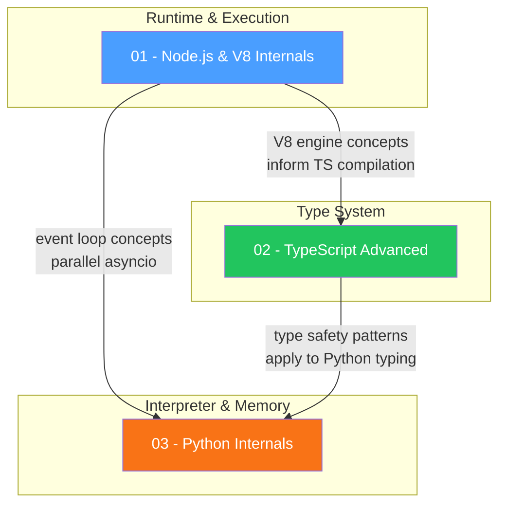
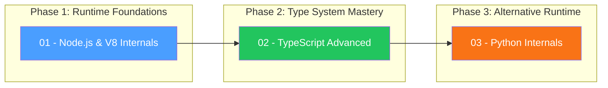

# Language Internals — Study Guide

## Overview

This module covers the internal mechanics of the languages and runtimes most commonly encountered in senior engineering interviews -- Node.js/V8, TypeScript's advanced type system, and CPython. Understanding these internals demonstrates depth beyond surface-level API knowledge and is a key differentiator in staff-level interviews.

## Topic Table

| # | Topic | Key Concepts | Difficulty | Est. Time |
|---|-------|-------------|------------|-----------|
| 01 | [Node.js & V8 Internals](./01-nodejs-v8-internals/concepts.md) | V8 pipeline (Ignition + TurboFan), hidden classes, inline caches, libuv thread pool, event loop phases, streams & backpressure, Buffer/ArrayBuffer | Hard | 4-5 hrs |
| 02 | [TypeScript Advanced](./02-typescript-advanced/concepts.md) | Conditional types, `infer` keyword, covariance/contravariance, mapped types, template literal types, type narrowing, declaration merging, `satisfies`, `as const` | Medium-Hard | 3-4 hrs |
| 03 | [Python Internals (CPython)](./03-python-internals/concepts.md) | GIL, reference counting, generational GC, asyncio event loop, PyMalloc, decorators, generators/coroutines, multiprocessing vs threading | Hard | 4-5 hrs |

## Recommended Study Order

**Rationale:**

1. **Node.js & V8 first** — Understanding V8's compilation pipeline, hidden classes, and the event loop gives you a concrete mental model for how JavaScript actually executes. This foundation makes TypeScript's type-level concerns more meaningful.
2. **TypeScript Advanced second** — With V8 internals fresh in mind, you can appreciate how TypeScript's type system helps write V8-friendly code (monomorphic functions, consistent object shapes). The type-level programming skills here are directly tested in senior frontend/fullstack interviews.
3. **Python Internals last** — Many of the same concepts (event loop, GC, concurrency) reappear but with different trade-offs (GIL vs single-threaded JS, reference counting vs V8's generational GC). Comparing across runtimes deepens understanding of both.

## Progress Tracker

| # | Topic | Read | Notes | Practice Qs | Confident |
|---|-------|:----:|:-----:|:-----------:|:---------:|
| 01 | Node.js & V8 Internals | [ ] | [ ] | [ ] | [ ] |
| 02 | TypeScript Advanced | [ ] | [ ] | [ ] | [ ] |
| 03 | Python Internals (CPython) | [ ] | [ ] | [ ] | [ ] |

## How to Use This Guide

1. **Follow the study order** — each topic builds context for the next.
2. **Read the concepts.md** in each folder thoroughly, paying attention to the mermaid diagrams.
3. **Work through the code examples** — type them out, modify them, break them intentionally to see what happens.
4. **Answer the Interview Q&A** sections — cover the answer and try to articulate it yourself first. Record yourself if possible.
5. **Use the comparison tables** for quick revision before interviews.
6. **Mark your progress** in the tracker above after each session.
