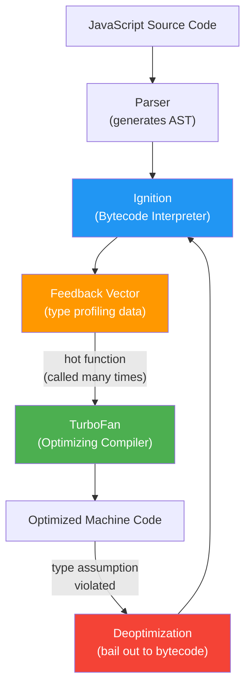
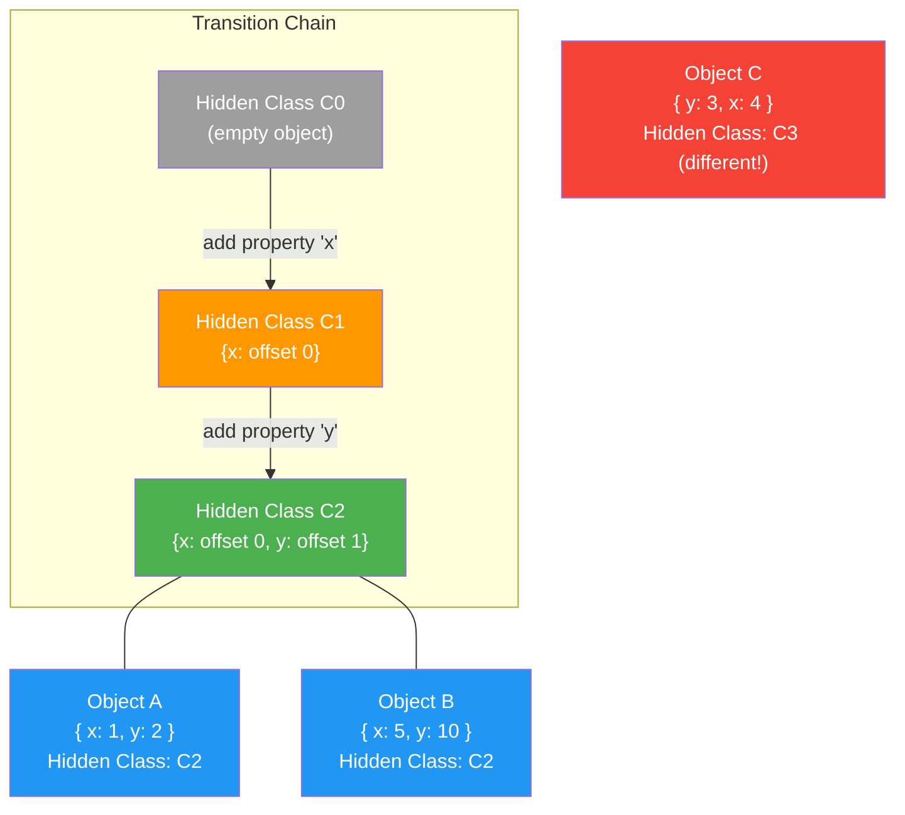
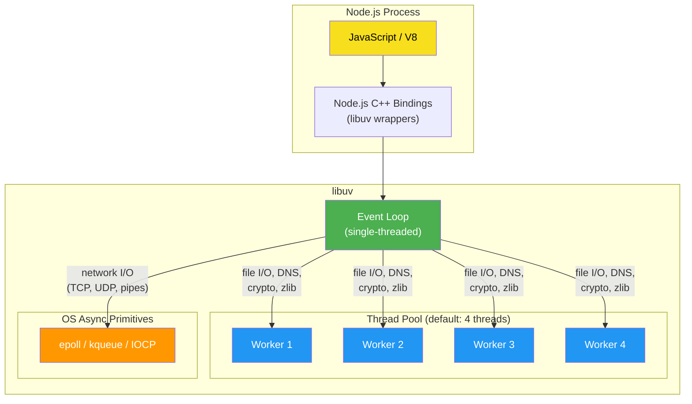
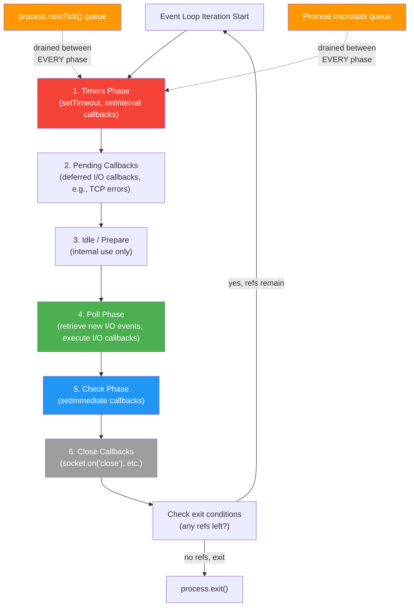
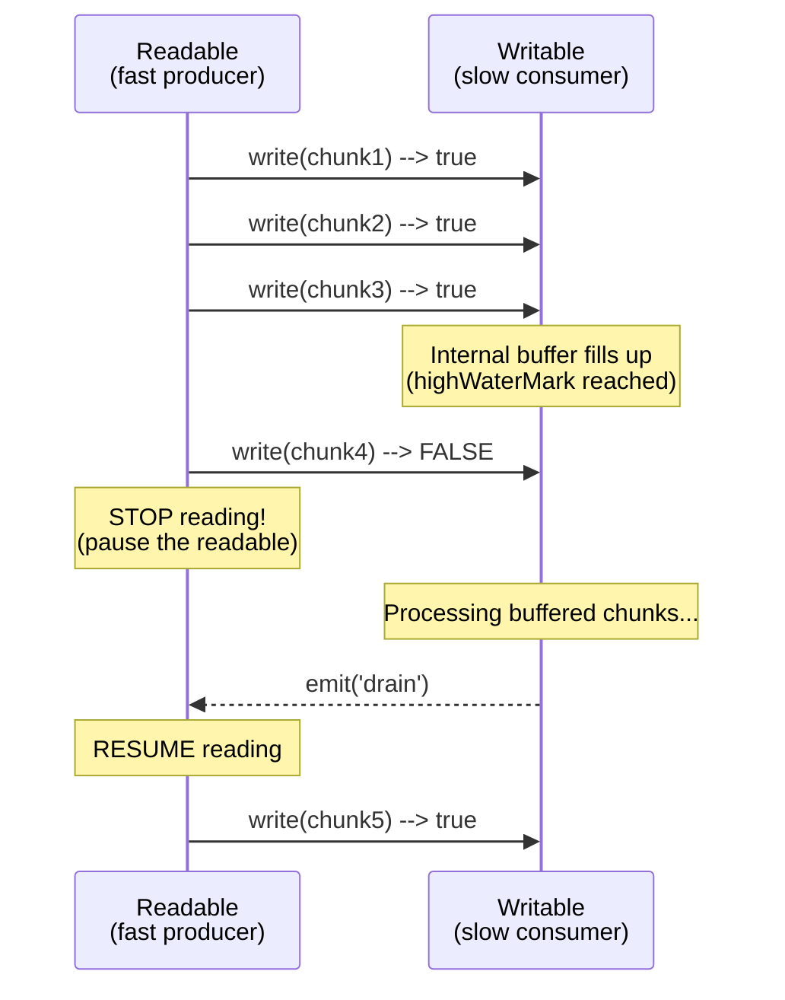

# Node.js & V8 Internals — Interview Deep Dive

---

## Table of Contents

1. [V8 Compilation Pipeline](#1-v8-compilation-pipeline)
2. [Hidden Classes & Inline Caches](#2-hidden-classes--inline-caches)
3. [libuv Architecture](#3-libuv-architecture)
4. [The Node.js Event Loop in Detail](#4-the-nodejs-event-loop-in-detail)
5. [Node.js Streams](#5-nodejs-streams)
6. [Buffer & ArrayBuffer](#6-buffer--arraybuffer)
7. [Interview Q&A](#7-interview-qa)
8. [Quick Reference Summary](#8-quick-reference-summary)

---

## 1. V8 Compilation Pipeline

V8 is Google's high-performance JavaScript and WebAssembly engine, written in C++. It powers Chrome, Node.js, Deno, and more. Understanding its compilation pipeline is critical for writing performant JavaScript.

### The Two-Tier Pipeline: Ignition + TurboFan

V8 uses a two-tier compilation strategy to balance startup speed with peak execution performance.



### Pipeline Stages Breakdown

| Stage | What Happens | Output | Speed |
|---|---|---|---|
| **Parsing** | Source code is tokenized and parsed into an Abstract Syntax Tree (AST). V8 uses lazy parsing -- it only fully parses functions when they are first called. | AST | Fast |
| **Ignition (Interpreter)** | Walks the AST and generates compact bytecode. Executes bytecode immediately. Collects type feedback into a Feedback Vector. | Bytecode + Type Profiles | Medium execution |
| **TurboFan (Optimizing Compiler)** | Takes "hot" functions (frequently executed) and the feedback vector. Applies speculative optimizations based on observed types. Generates highly optimized machine code. | Native Machine Code | Very fast execution |
| **Deoptimization** | If a type assumption made by TurboFan is violated at runtime (e.g., a function received a string where it always saw numbers), V8 discards the optimized code and falls back to Ignition bytecode. | Revert to Bytecode | Costly |

### Ignition Bytecodes

Ignition compiles JavaScript into a register-based bytecode format. Each bytecode operation is compact (1-4 bytes) to minimize memory usage.

```typescript
// Example: Simple addition
function add(a: number, b: number): number {
  return a + b;
}

// Ignition generates bytecodes roughly like:
// Ldar a1          -- Load argument 'a' into the accumulator
// Add a2, [0]      -- Add argument 'b' to accumulator, slot [0] for feedback
// Return           -- Return accumulator value
```

### TurboFan Optimization Strategies

TurboFan applies several speculative optimizations based on type feedback:

| Optimization | Description | Example |
|---|---|---|
| **Inlining** | Replace a function call with the function body itself. Removes call overhead and enables further optimizations. | A small helper called in a loop is inlined into the loop body. |
| **Type Specialization** | Generate machine code that assumes specific types, avoiding generic type checks at runtime. | If `add(a, b)` always receives numbers, generate a single machine `ADD` instruction. |
| **Escape Analysis** | Determine if an allocated object escapes the current scope. If not, allocate it on the stack instead of the heap (or eliminate it entirely). | A temporary `{ x, y }` object used only locally is stack-allocated. |
| **Dead Code Elimination** | Remove code paths that are never reached based on profiling. | An `if (false)` branch is stripped out. |
| **Loop Invariant Code Motion** | Hoist computations that do not change across loop iterations out of the loop. | `arr.length` check moved before the loop. |
| **Constant Folding** | Evaluate constant expressions at compile time. | `3 * 4` is replaced with `12`. |

### Deoptimization in Practice

```typescript
function processItem(item: any): number {
  // For the first 10,000 calls, item is always a number
  // TurboFan optimizes assuming item is always a number
  return item * 2 + 1;
}

// Hot loop -- TurboFan kicks in
for (let i = 0; i < 10000; i++) {
  processItem(i); // always number --> TurboFan optimizes
}

// Suddenly pass a string -- DEOPT!
processItem("hello"); // type assumption violated, bail out to Ignition
```

**Key Takeaway**: Monomorphic functions (always receiving the same types) get optimized aggressively. Polymorphic functions (receiving different types) are harder to optimize and may never reach peak performance.

---

## 2. Hidden Classes & Inline Caches

### The Problem with Dynamic Objects

JavaScript objects are dynamic -- properties can be added, removed, or reordered at any time. Naively, every property access would require a dictionary lookup (hash table), which is slow compared to a fixed-offset access in statically typed languages like C++.

V8 solves this with **Hidden Classes** (internally called "Maps") and **Inline Caches (ICs)**.

### Hidden Classes (Maps)

A hidden class is a runtime-generated internal structure that describes the shape (layout) of an object. Objects with the same sequence of property additions share the same hidden class, enabling fast property access via fixed offsets.



```typescript
// GOOD: Same property order --> same hidden class --> fast
function createPointGood(x: number, y: number) {
  const p = {} as any;
  p.x = x; // transition C0 -> C1
  p.y = y; // transition C1 -> C2
  return p;
}
const p1 = createPointGood(1, 2); // Hidden Class C2
const p2 = createPointGood(3, 4); // Hidden Class C2 (same -- shared!)

// BAD: Different property order --> different hidden classes --> slow
function createPointBad(x: number, y: number, flip: boolean) {
  const p = {} as any;
  if (flip) {
    p.y = y; // transition C0 -> C1' (y first)
    p.x = x; // transition C1' -> C2' (different from C2!)
  } else {
    p.x = x; // transition C0 -> C1
    p.y = y; // transition C1 -> C2
  }
  return p;
}
```

### Inline Caches (ICs)

An Inline Cache records the hidden class seen at a specific property access site, along with the corresponding offset. On subsequent accesses, if the hidden class matches, V8 can skip the lookup entirely and use the cached offset directly.

| IC State | Description | Performance |
|---|---|---|
| **Uninitialized** | Property access has never been executed. | Slowest (full lookup) |
| **Monomorphic** | Only one hidden class has been seen at this site. One cached offset. | Fastest (direct offset) |
| **Polymorphic** | 2-4 different hidden classes seen. Small linear search of cached offsets. | Fast (small lookup) |
| **Megamorphic** | 5+ hidden classes seen. IC is abandoned; falls back to generic hash lookup. | Slow (generic path) |

```typescript
// Monomorphic IC -- best performance
interface Point { x: number; y: number; }

function getX(p: Point): number {
  return p.x; // IC caches one hidden class and offset
}

const points: Point[] = Array.from({ length: 10000 }, (_, i) => ({ x: i, y: i }));
points.forEach(getX); // always same hidden class --> monomorphic --> fast!

// Megamorphic IC -- worst performance
function getXMega(obj: any): number {
  return obj.x; // many different shapes pass through here
}

getXMega({ x: 1 });
getXMega({ x: 1, y: 2 });
getXMega({ a: 0, x: 1 });
getXMega({ x: 1, y: 2, z: 3 });
getXMega({ name: "foo", x: 1 });
// IC goes megamorphic --> slow generic lookup every time
```

### Performance Rules for Hidden Classes

| Rule | Why |
|---|---|
| Always initialize properties in the **same order** | Objects share hidden classes, enabling IC reuse |
| Initialize all properties in the **constructor** | Avoids hidden class transitions after construction |
| Do not **delete** properties | Switches the object to a slow "dictionary mode" |
| Do not **add** properties after construction | Each addition creates a new hidden class transition |
| Use **classes or factory functions** over ad-hoc object literals with varying shapes | Consistent shape = monomorphic ICs |

---

## 3. libuv Architecture

### What is libuv?

libuv is the cross-platform asynchronous I/O library that powers Node.js. It provides the event loop, thread pool, async networking, file system operations, child processes, signals, and more. Written in C, it abstracts OS-specific APIs (epoll on Linux, kqueue on macOS, IOCP on Windows) behind a unified interface.

### Architecture Overview



### What Uses the Thread Pool vs OS Async

| Mechanism | Operations | Why |
|---|---|---|
| **OS Async (epoll/kqueue/IOCP)** | TCP/UDP sockets, pipes, TTY, signals | OS provides non-blocking I/O natively for network operations. No threads needed. |
| **Thread Pool** | File system ops (`fs.*`), DNS lookups (`dns.lookup`), crypto (`crypto.pbkdf2`, `crypto.randomBytes`), zlib compression | These operations do not have true async OS APIs (especially file I/O on Linux). libuv delegates to worker threads and signals completion back to the event loop. |

### Thread Pool Configuration

| Setting | Default | Environment Variable | Notes |
|---|---|---|---|
| Thread pool size | 4 | `UV_THREADPOOL_SIZE` | Max 1024. Increase for file I/O heavy workloads. |
| Thread priority | Normal | N/A | All worker threads run at OS default priority. |

```typescript
// Set before any require/import:
// process.env.UV_THREADPOOL_SIZE = '8'; // Must be set before Node starts

import * as fs from 'fs';
import * as crypto from 'crypto';

// These operations compete for thread pool threads
// With default pool size of 4, the 5th concurrent fs operation must wait
const readPromises = Array.from({ length: 8 }, (_, i) =>
  fs.promises.readFile(`/tmp/file${i}.txt`)
);

// Crypto operations also use the thread pool
const hashPromises = Array.from({ length: 4 }, () =>
  new Promise<Buffer>((resolve, reject) => {
    crypto.pbkdf2('password', 'salt', 100000, 64, 'sha512', (err, key) => {
      if (err) reject(err);
      else resolve(key);
    });
  })
);

// All 12 operations compete for 4 threads by default
await Promise.all([...readPromises, ...hashPromises]);
```

---

## 4. The Node.js Event Loop in Detail

### Event Loop Phases

The Node.js event loop is **not** a simple `while(true)` polling loop. It consists of distinct phases, each with its own FIFO queue of callbacks to execute.



### Phase Details

| Phase | What Runs | Key Behavior |
|---|---|---|
| **Timers** | Callbacks from `setTimeout()` and `setInterval()` whose threshold has elapsed. | Timers are **not** exact. A timer scheduled for 100ms fires **at or after** 100ms, depending on how long other callbacks take. |
| **Pending Callbacks** | System-level callbacks deferred from the previous iteration (e.g., TCP `ECONNREFUSED` errors). | Rarely discussed but important for understanding delays. |
| **Idle / Prepare** | Internal libuv housekeeping. | Not user-facing. |
| **Poll** | Retrieves new I/O events from the OS (epoll/kqueue). Executes callbacks for completed I/O (incoming connections, data received, file read done). | If the poll queue is empty and no timers are pending, the loop **blocks here** waiting for I/O. This is what makes Node.js efficient -- it sleeps when idle. |
| **Check** | Callbacks from `setImmediate()`. | Guaranteed to run after the poll phase completes, even if poll is empty. |
| **Close Callbacks** | Callbacks from `socket.destroy()`, `server.close()`, etc. | Cleanup phase. |

### Microtask Queues: process.nextTick vs Promises

Between **every phase transition** (and after each callback within a phase), Node.js drains two microtask queues:

1. **`process.nextTick()` queue** -- drained first, always before promise microtasks.
2. **Promise microtask queue** (`.then()`, `await` continuations) -- drained second.

```typescript
// Execution order demonstration
console.log('1: script start');

setTimeout(() => console.log('2: setTimeout'), 0);
setImmediate(() => console.log('3: setImmediate'));

Promise.resolve().then(() => console.log('4: promise microtask'));
process.nextTick(() => console.log('5: nextTick'));

console.log('6: script end');

// Output:
// 1: script start
// 6: script end
// 5: nextTick           <-- nextTick queue drained first
// 4: promise microtask  <-- then promise microtasks
// 2: setTimeout         <-- timers phase (or 3 first, order non-deterministic here)
// 3: setImmediate       <-- check phase (or 2 first)
```

### setTimeout vs setImmediate

| Scenario | Order |
|---|---|
| Top-level (main module) | **Non-deterministic** -- depends on system timer granularity and how fast the main script completes. |
| Inside an I/O callback | **`setImmediate` always fires first** -- because the poll phase has just completed and the check phase (setImmediate) comes next, before looping back to timers. |

```typescript
import * as fs from 'fs';

// Inside I/O callback -- deterministic order
fs.readFile(__filename, () => {
  setTimeout(() => console.log('setTimeout'), 0);
  setImmediate(() => console.log('setImmediate'));
});

// Output (always):
// setImmediate
// setTimeout
```

### Event Loop Starvation

If a callback runs for too long (CPU-bound), it starves the event loop -- all other I/O, timers, and callbacks must wait.

```typescript
// BAD: Blocks the event loop for ~5 seconds
app.get('/fibonacci', (req, res) => {
  const result = fibonacci(45); // CPU-intensive, blocks event loop
  res.json({ result });
});

// GOOD: Offload to a Worker Thread
import { Worker } from 'worker_threads';

app.get('/fibonacci', (req, res) => {
  const worker = new Worker('./fibonacci-worker.js', {
    workerData: { n: 45 },
  });
  worker.on('message', (result) => res.json({ result }));
  worker.on('error', (err) => res.status(500).json({ error: err.message }));
});
```

---

## 5. Node.js Streams

### What Are Streams?

Streams are an abstraction for working with data that arrives (or is sent) **piece by piece**, rather than loading it all into memory at once. They are instances of `EventEmitter` and are fundamental to Node.js I/O.

### Stream Types

| Stream Type | Description | Example | Key Events |
|---|---|---|---|
| **Readable** | Data source. Emits data chunks. | `fs.createReadStream()`, `http.IncomingMessage`, `process.stdin` | `data`, `end`, `error`, `readable` |
| **Writable** | Data destination. Receives data chunks. | `fs.createWriteStream()`, `http.ServerResponse`, `process.stdout` | `drain`, `finish`, `error`, `pipe` |
| **Duplex** | Both readable and writable. Two independent channels. | `net.Socket`, `crypto.createCipheriv()` | Both readable + writable events |
| **Transform** | Duplex stream where the output is computed from the input. | `zlib.createGzip()`, `crypto.createHash()` | Both + `transform` internal method |

### Backpressure

Backpressure is the mechanism that prevents a fast producer from overwhelming a slow consumer. Without backpressure, data accumulates in memory, leading to memory exhaustion.



```typescript
import { createReadStream, createWriteStream } from 'fs';

// WRONG: Ignoring backpressure -- can cause OOM
const readable = createReadStream('huge-file.dat');
const writable = createWriteStream('output.dat');

readable.on('data', (chunk) => {
  writable.write(chunk); // ignores return value!
  // If writable is slow, data accumulates in writable's internal buffer
  // --> Memory grows unboundedly
});

// RIGHT: Using pipe() -- handles backpressure automatically
createReadStream('huge-file.dat')
  .pipe(createWriteStream('output.dat'));

// RIGHT: Manual backpressure handling
readable.on('data', (chunk) => {
  const canContinue = writable.write(chunk);
  if (!canContinue) {
    readable.pause(); // stop reading until writable catches up
  }
});

writable.on('drain', () => {
  readable.resume(); // writable buffer drained, resume reading
});
```

### Transform Streams

Transform streams modify data as it passes through. They are the building blocks for pipelines.

```typescript
import { Transform, TransformCallback, pipeline } from 'stream';
import { createReadStream, createWriteStream } from 'fs';
import { createGzip } from 'zlib';
import { promisify } from 'util';

const pipelineAsync = promisify(pipeline);

// Custom Transform: convert each line to uppercase
class UpperCaseTransform extends Transform {
  private buffer: string = '';

  _transform(chunk: Buffer, encoding: string, callback: TransformCallback): void {
    this.buffer += chunk.toString();
    const lines = this.buffer.split('\n');
    // Keep the last partial line in the buffer
    this.buffer = lines.pop() || '';
    for (const line of lines) {
      this.push(line.toUpperCase() + '\n');
    }
    callback();
  }

  _flush(callback: TransformCallback): void {
    // Push any remaining data
    if (this.buffer) {
      this.push(this.buffer.toUpperCase() + '\n');
    }
    callback();
  }
}

// Pipeline: Read -> Transform -> Compress -> Write
await pipelineAsync(
  createReadStream('input.txt'),
  new UpperCaseTransform(),
  createGzip(),
  createWriteStream('output.txt.gz')
);
// pipeline() handles backpressure and error propagation across all streams
```

### Object Mode Streams

By default, streams operate on `Buffer` or `string` chunks. In object mode, streams can pass arbitrary JavaScript objects.

```typescript
import { Transform } from 'stream';

const jsonParser = new Transform({
  objectMode: true,
  transform(chunk: Buffer, encoding: string, callback) {
    try {
      const obj = JSON.parse(chunk.toString());
      this.push(obj); // push a JS object, not a Buffer
      callback();
    } catch (err) {
      callback(err as Error);
    }
  },
});
```

### Stream Comparison: Flowing vs Paused Mode

| Aspect | Flowing Mode | Paused Mode |
|---|---|---|
| **Triggered by** | Adding a `data` listener, calling `.resume()`, or `.pipe()` | Default state |
| **Data delivery** | Automatic -- chunks emitted as fast as possible | Manual -- must call `.read()` to pull chunks |
| **Backpressure** | Handled by `pipe()` or manually via `pause()`/`resume()` | Inherent -- data only flows when `.read()` is called |
| **Use when** | You want to process data as it arrives | You need fine-grained control over read timing |

---

## 6. Buffer & ArrayBuffer

### Buffer

`Buffer` is Node.js's built-in class for working with binary data. It is a subclass of `Uint8Array` and is backed by a fixed-size allocation of raw memory **outside the V8 heap**.

```typescript
// Creating Buffers
const buf1 = Buffer.alloc(16);          // 16 zero-filled bytes (safe)
const buf2 = Buffer.allocUnsafe(16);    // 16 bytes, NOT zeroed (faster, may contain old data)
const buf3 = Buffer.from('hello', 'utf8'); // from a string
const buf4 = Buffer.from([0x48, 0x65, 0x6c, 0x6c, 0x6f]); // from byte array

// Reading and writing
buf1.writeUInt32BE(0xDEADBEEF, 0); // write 4 bytes at offset 0 (big-endian)
const value = buf1.readUInt32BE(0);  // read them back

// Slicing creates a VIEW (shared memory!) -- not a copy
const slice = buf3.slice(0, 3);
slice[0] = 0x48; // modifies buf3 as well!

// To create an independent copy:
const copy = Buffer.from(buf3); // copies the underlying memory
```

### Buffer vs ArrayBuffer vs TypedArray

| Feature | Buffer | ArrayBuffer | TypedArray (e.g., Uint8Array) |
|---|---|---|---|
| **Environment** | Node.js only | Browser + Node.js | Browser + Node.js |
| **Memory Location** | Outside V8 heap (C++ managed) | V8 heap | View over an ArrayBuffer |
| **Zero-Filled** | `alloc()` yes, `allocUnsafe()` no | Always zero-filled | Depends on underlying ArrayBuffer |
| **Pooling** | Small Buffers (<4KB) share a pre-allocated pool | No pooling | No pooling |
| **Encoding Support** | Built-in (`utf8`, `base64`, `hex`, etc.) | No encoding API | No encoding API |
| **Performance** | Optimized for I/O operations | General purpose | General purpose |
| **Relationship** | `Buffer` extends `Uint8Array` | Base container | Views over ArrayBuffer |

```typescript
// Interop between Buffer and ArrayBuffer
const buf = Buffer.from('hello');
const arrayBuffer: ArrayBuffer = buf.buffer; // underlying ArrayBuffer
const uint8View = new Uint8Array(arrayBuffer, buf.byteOffset, buf.byteLength);

// WARNING: buf.buffer may be a shared pool!
// Always use byteOffset and byteLength to get the correct slice.
```

### Buffer Pooling

For small allocations (<4KB by default), `Buffer.allocUnsafe()` and `Buffer.from()` draw from a shared pre-allocated pool (8KB slab) to avoid the overhead of individual memory allocations.

| Method | Uses Pool? | Zero-Filled? | Speed |
|---|---|---|---|
| `Buffer.alloc(size)` | No | Yes | Slower (must zero-fill) |
| `Buffer.allocUnsafe(size)` | Yes (if <4KB) | No | Fastest |
| `Buffer.allocUnsafeSlow(size)` | No | No | Fast (no pool, individual alloc) |
| `Buffer.from(data)` | Yes (if <4KB) | N/A (copies data) | Fast |

---

## 7. Interview Q&A

> **Q1: What is the difference between Ignition and TurboFan in V8?**
>
> Ignition is V8's bytecode interpreter. It generates compact bytecode from the AST and executes it immediately, providing fast startup. As functions run, Ignition collects type feedback (which types appear at each call site) into a Feedback Vector. TurboFan is V8's optimizing compiler. When a function is identified as "hot" (called frequently), TurboFan uses the type feedback to generate highly optimized machine code with speculative type assumptions. If those assumptions are later violated (e.g., a function that always received numbers suddenly receives a string), TurboFan triggers a deoptimization, discarding the optimized code and reverting to Ignition bytecode. The key insight is that this two-tier system balances startup speed (Ignition) with peak runtime performance (TurboFan).

> **Q2: What are hidden classes, and why do they matter for performance?**
>
> Hidden classes (internally called "Maps" in V8) are runtime-generated descriptors that record the shape (property names, order, and offsets) of JavaScript objects. When you create objects with the same properties added in the same order, they share a hidden class. This enables inline caches (ICs) to cache property offsets at specific access sites, converting property lookups from hash table searches (O(1) amortized but with high constant) into direct memory offset reads. If objects have inconsistent shapes (different property orders, dynamic additions/deletions), ICs go megamorphic and fall back to slow generic lookups. The practical advice: use classes or factory functions, always initialize properties in the same order, and never delete properties.

> **Q3: How does the Node.js event loop differ from a simple polling loop?**
>
> The Node.js event loop consists of six distinct phases (timers, pending callbacks, idle/prepare, poll, check, close callbacks), each with its own queue. Between every phase transition, microtask queues (process.nextTick and Promise callbacks) are fully drained. The poll phase is special: if no timers are pending and the poll queue is empty, the loop blocks here, waiting for I/O events from the OS kernel (via epoll/kqueue/IOCP). This blocking behavior is what makes Node.js CPU-efficient when idle -- it does not busy-wait. The phase structure also explains ordering guarantees: setImmediate always fires before setTimeout(0) inside an I/O callback (because check phase comes right after poll), but their order is non-deterministic at the top level.

> **Q4: What is backpressure in Node.js streams, and how is it handled?**
>
> Backpressure occurs when a writable stream cannot process data as fast as a readable stream produces it. If unchecked, the writable's internal buffer grows without bound, eventually exhausting memory. Node.js handles this through the `write()` return value: when `write()` returns `false`, the writable's internal buffer has exceeded its `highWaterMark`. The producer should then call `readable.pause()` to stop reading. When the writable's buffer drains, it emits a `drain` event, signaling the producer to `resume()`. The `pipe()` method and `pipeline()` function handle this automatically. Always use `pipeline()` in production because it also handles error propagation and cleanup across the entire stream chain.

> **Q5: Why does Node.js use a thread pool if it is "single-threaded"?**
>
> Node.js is single-threaded only for JavaScript execution. The event loop runs on one thread, and all your JS callbacks execute sequentially on that thread. However, many I/O operations (file system access, DNS resolution, cryptographic operations, compression) cannot be performed asynchronously at the OS level -- especially file I/O on Linux, which has no truly async file system API. libuv provides a thread pool (default 4 threads, configurable via UV_THREADPOOL_SIZE up to 1024) to perform these blocking operations off the main thread. Network I/O (TCP, UDP) does not use the thread pool because operating systems provide true async networking via epoll/kqueue/IOCP. This is why a Node.js server can handle thousands of concurrent network connections with few threads but can bottleneck on file I/O if the thread pool is too small.

> **Q6: What is the difference between `Buffer.alloc()` and `Buffer.allocUnsafe()`?**
>
> `Buffer.alloc(size)` allocates `size` bytes and zero-fills them. It is safe but slower because of the zero-fill operation. `Buffer.allocUnsafe(size)` allocates `size` bytes without zero-filling, meaning the buffer may contain old data from previous memory allocations. It is faster because it skips the zero-fill step, and for small buffers (<4KB), it draws from a shared pre-allocated pool. Use `allocUnsafe()` only when you will immediately overwrite the entire buffer (e.g., before a `read()` call) and never when the buffer might be partially exposed to users (security risk: leaking old heap data).

---

## 8. Quick Reference Summary

### V8 Optimization Checklist

| Do | Do Not |
|---|---|
| Keep functions monomorphic (same argument types) | Pass different types to the same function |
| Initialize all object properties in constructors | Add properties dynamically after creation |
| Use the same property initialization order | Vary property order across instances |
| Write small, focused functions (easier to inline) | Write megafunctions with many branches |
| Use TypeScript for type discipline | Use `delete` on object properties |

### Event Loop Phase Order

```
Microtasks (nextTick + Promises)  <-- drained between EVERY phase
    |
    v
[Timers] --> [Pending] --> [Idle] --> [Poll] --> [Check] --> [Close]
    ^                                                          |
    |_________________________ loop ___________________________|
```

### Key Numbers

| Metric | Value |
|---|---|
| Default libuv thread pool size | 4 |
| Maximum thread pool size | 1024 |
| Buffer pool slab size | 8 KB |
| Buffer pool threshold | 4 KB (allocations below this use the pool) |
| V8 max heap (default, 64-bit) | ~1.5 GB (configurable with `--max-old-space-size`) |
| Event loop phases | 6 (timers, pending, idle/prepare, poll, check, close) |
| Microtask queues | 2 (nextTick + Promise) |

### Stream Decision Guide

```
Need to process large data?
    YES --> Use Streams
        Multiple transforms needed?
            YES --> pipeline(readable, ...transforms, writable)
            NO  --> readable.pipe(writable)
    NO  --> fs.readFile / fs.writeFile (buffer entire content)
```
