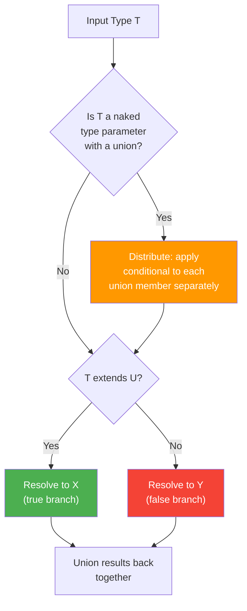
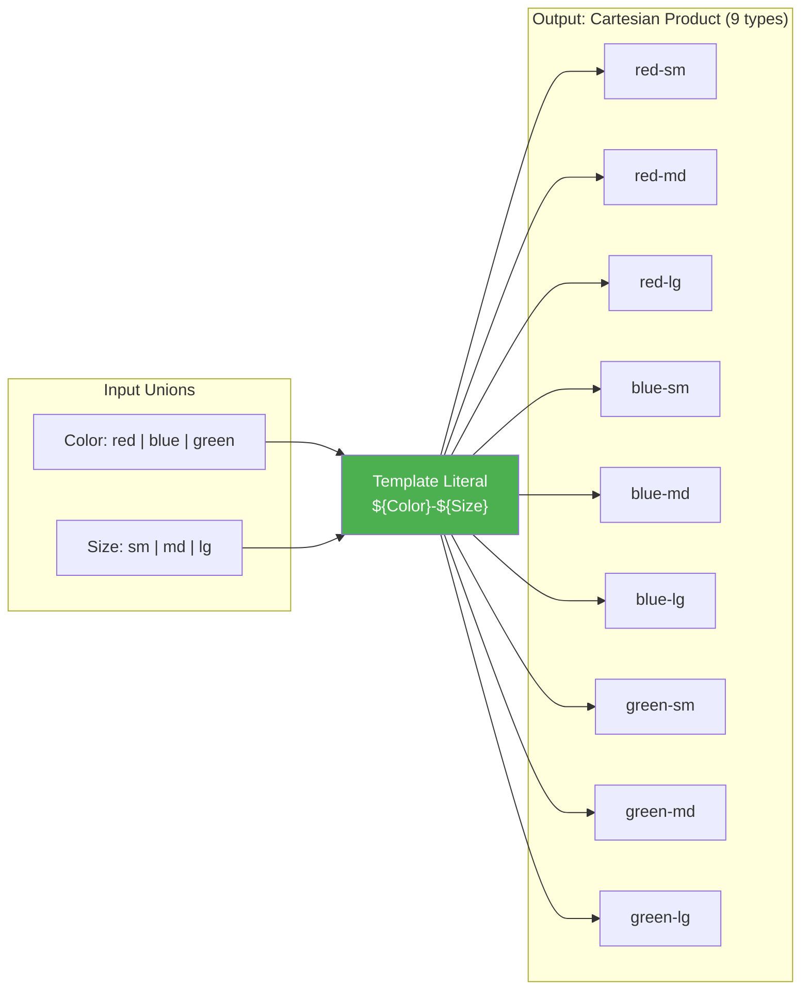
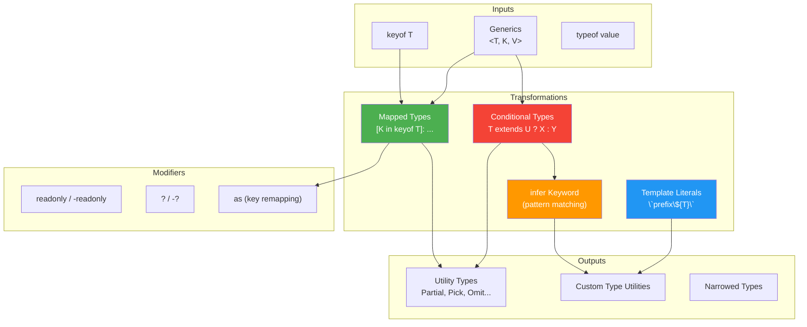

# Advanced TypeScript — Interview Deep Dive

---

## Table of Contents

1. [Conditional Types & the infer Keyword](#1-conditional-types--the-infer-keyword)
2. [Covariance & Contravariance](#2-covariance--contravariance)
3. [Mapped Types](#3-mapped-types)
4. [Template Literal Types](#4-template-literal-types)
5. [Type Narrowing](#5-type-narrowing)
6. [Declaration Merging & Module Augmentation](#6-declaration-merging--module-augmentation)
7. [satisfies Operator & const Assertions](#7-satisfies-operator--const-assertions)
8. [Interview Q&A](#8-interview-qa)
9. [Quick Reference Summary](#9-quick-reference-summary)

---

## 1. Conditional Types & the infer Keyword

### What Are Conditional Types?

Conditional types let you express type-level `if/else` logic. They select one of two possible types based on whether a type extends (is assignable to) another type.

```
T extends U ? X : Y
```

If `T` is assignable to `U`, the type resolves to `X`; otherwise it resolves to `Y`.

### Basic Conditional Types

```typescript
// Type-level "is this a string?"
type IsString<T> = T extends string ? true : false;

type A = IsString<"hello">;  // true
type B = IsString<42>;       // false
type C = IsString<string>;   // true

// Extracting array element types
type ElementOf<T> = T extends (infer E)[] ? E : never;

type D = ElementOf<string[]>;    // string
type E = ElementOf<number[]>;    // number
type F = ElementOf<boolean>;     // never (not an array)
```

### The `infer` Keyword

`infer` declares a type variable within a conditional type's `extends` clause, letting you "capture" part of a type for use in the true branch.

```typescript
// Extract the return type of a function
type MyReturnType<T> = T extends (...args: any[]) => infer R ? R : never;

type G = MyReturnType<() => string>;         // string
type H = MyReturnType<(x: number) => boolean>; // boolean
type I = MyReturnType<string>;               // never

// Extract function parameter types
type MyParameters<T> = T extends (...args: infer P) => any ? P : never;

type J = MyParameters<(a: string, b: number) => void>; // [string, number]

// Extract the resolved type of a Promise
type Awaited<T> = T extends Promise<infer U> ? Awaited<U> : T;

type K = Awaited<Promise<string>>;              // string
type L = Awaited<Promise<Promise<number>>>;     // number (recursive!)
type M = Awaited<string>;                       // string (not a Promise)
```

### Distributive Conditional Types

When a conditional type is applied to a **naked type parameter** (not wrapped in a tuple, array, etc.), it distributes over unions. Each member of the union is checked independently, and the results are unioned back together.

```typescript
type ToArray<T> = T extends any ? T[] : never;

// Distributes over each member of the union
type N = ToArray<string | number>;
// = (string extends any ? string[] : never) | (number extends any ? number[] : never)
// = string[] | number[]

// To PREVENT distribution, wrap T in a tuple:
type ToArrayNonDistributive<T> = [T] extends [any] ? T[] : never;

type O = ToArrayNonDistributive<string | number>;
// = (string | number)[]  -- not distributed!
```

### Advanced Conditional Type Patterns

```typescript
// Exclude null and undefined
type NonNullable<T> = T extends null | undefined ? never : T;
type P = NonNullable<string | null | undefined>; // string

// Extract types from a discriminated union
type ExtractByKind<T, K> = T extends { kind: K } ? T : never;

type Shape =
  | { kind: "circle"; radius: number }
  | { kind: "square"; side: number }
  | { kind: "triangle"; base: number; height: number };

type Circle = ExtractByKind<Shape, "circle">;
// { kind: "circle"; radius: number }

// String manipulation with infer
type TrimLeft<S extends string> = S extends ` ${infer Rest}` ? TrimLeft<Rest> : S;
type Q = TrimLeft<"   hello">; // "hello"

// Deep infer: extract nested types
type UnpackPromise<T> =
  T extends Promise<infer U>
    ? U extends Promise<any>
      ? UnpackPromise<U>
      : U
    : T;
```

### Conditional Type Flow



---

## 2. Covariance & Contravariance

### What is Variance?

Variance describes how subtyping between complex types relates to subtyping between their component types. If `Dog extends Animal`, how does `Array<Dog>` relate to `Array<Animal>`?

### The Four Kinds of Variance

| Variance | Rule | Mnemonic |
|---|---|---|
| **Covariant** | If `A extends B`, then `F<A> extends F<B>` (same direction) | "Co" = same direction. Producers/outputs are covariant. |
| **Contravariant** | If `A extends B`, then `F<B> extends F<A>` (reversed!) | "Contra" = opposite direction. Consumers/inputs are contravariant. |
| **Invariant** | `F<A>` and `F<B>` are unrelated regardless of A/B relationship | Both read and write = invariant. |
| **Bivariant** | `F<A> extends F<B>` in both directions | TypeScript's legacy function parameter behavior (unsound). |

### Variance in Practice

```mermaid
graph TD
    subgraph "Type Hierarchy"
        Animal["Animal"]
        Dog["Dog extends Animal"]
        Poodle["Poodle extends Dog"]
    end

    subgraph "Covariant (output position)"
        PA["Producer&lt;Animal&gt;"]
        PD["Producer&lt;Dog&gt;"]
        PP["Producer&lt;Poodle&gt;"]
        PP -->|"extends"| PD
        PD -->|"extends"| PA
    end

    subgraph "Contravariant (input position)"
        CA["Consumer&lt;Animal&gt;"]
        CD["Consumer&lt;Dog&gt;"]
        CP["Consumer&lt;Poodle&gt;"]
        CA -->|"extends"| CD
        CD -->|"extends"| CP
    end

    Dog -->|"extends"| Animal
    Poodle -->|"extends"| Dog

    style Animal fill:#FF9800,color:#fff
    style Dog fill:#4CAF50,color:#fff
    style Poodle fill:#2196F3,color:#fff
```



```typescript
class Animal { name: string = ""; }
class Dog extends Animal { breed: string = ""; }
class Poodle extends Dog { size: "toy" | "mini" | "standard" = "standard"; }

// --- COVARIANT: Return types (output position) ---
// A function returning Dog can be used where a function returning Animal is expected
type Producer<T> = () => T;

const produceDog: Producer<Dog> = () => new Dog();
const produceAnimal: Producer<Animal> = produceDog; // OK: Dog extends Animal

// --- CONTRAVARIANT: Parameter types (input position) ---
// A function accepting Animal can be used where a function accepting Dog is expected
type Consumer<T> = (item: T) => void;

const consumeAnimal: Consumer<Animal> = (a: Animal) => console.log(a.name);
const consumeDog: Consumer<Dog> = consumeAnimal; // OK: Animal is wider, handles any Dog

// WRONG direction would be unsound:
// const consumePoodle: Consumer<Poodle> = (p: Poodle) => console.log(p.size);
// const consumeDog2: Consumer<Dog> = consumePoodle;
// consumeDog2(new Dog()); // Runtime error! Dog has no 'size' property

// --- INVARIANT: Both read and write ---
// Mutable containers should be invariant (TypeScript arrays are covariant -- unsound!)
interface MutableBox<T> {
  get(): T;     // covariant (output)
  set(v: T): void; // contravariant (input)
  // Combined: invariant
}
```

### TypeScript's Variance Annotations (4.7+)

TypeScript 4.7 introduced explicit variance annotations with `in` and `out` keywords:

```typescript
// out = covariant (T appears in output position)
interface Producer<out T> {
  produce(): T;
}

// in = contravariant (T appears in input position)
interface Consumer<in T> {
  consume(item: T): void;
}

// in out = invariant (T appears in both positions)
interface MutableContainer<in out T> {
  get(): T;
  set(value: T): void;
}
```

### Why This Matters in Interviews

| Concept | Real-World Impact |
|---|---|
| **Function parameter bivariance** | TypeScript allows `(a: Animal) => void` where `(d: Dog) => void` is expected AND vice versa by default (bivariant). Enable `strictFunctionTypes` to get correct contravariance. |
| **Array covariance** | TypeScript arrays are covariant, which is technically unsound. `Dog[]` is assignable to `Animal[]`, but you could then push a `Cat` into the "Animal" array. |
| **Readonly collections** | `ReadonlyArray<Dog>` being covariant with `ReadonlyArray<Animal>` is sound because you cannot write to it. |
| **Callback parameters** | Event handler types must be contravariant in their parameter to be type-safe. |

---

## 3. Mapped Types

### What Are Mapped Types?

Mapped types create new types by transforming each property of an existing type. They iterate over keys using `in keyof` and can modify the value type, add/remove modifiers (`readonly`, `?`), and remap keys.

```typescript
// The general form:
type MappedType<T> = {
  [K in keyof T]: SomeTransformation<T[K]>;
};
```

### Built-in Utility Types (Implemented as Mapped Types)

```typescript
// Partial<T> -- make all properties optional
type MyPartial<T> = {
  [K in keyof T]?: T[K];
};

// Required<T> -- make all properties required
type MyRequired<T> = {
  [K in keyof T]-?: T[K];  // -? removes the optional modifier
};

// Readonly<T> -- make all properties readonly
type MyReadonly<T> = {
  readonly [K in keyof T]: T[K];
};

// Mutable<T> -- remove readonly (custom)
type Mutable<T> = {
  -readonly [K in keyof T]: T[K]; // -readonly removes the readonly modifier
};

// Pick<T, K> -- select a subset of properties
type MyPick<T, K extends keyof T> = {
  [P in K]: T[P];
};

// Record<K, V> -- construct a type with keys K and values V
type MyRecord<K extends keyof any, V> = {
  [P in K]: V;
};
```

### Key Remapping with `as` (TypeScript 4.1+)

You can remap keys during mapping using the `as` clause:

```typescript
interface User {
  id: number;
  name: string;
  email: string;
  age: number;
}

// Prefix all keys with "get" and capitalize
type Getters<T> = {
  [K in keyof T as `get${Capitalize<string & K>}`]: () => T[K];
};

type UserGetters = Getters<User>;
// {
//   getId: () => number;
//   getName: () => string;
//   getEmail: () => string;
//   getAge: () => number;
// }

// Filter properties by type: only keep string properties
type StringKeysOnly<T> = {
  [K in keyof T as T[K] extends string ? K : never]: T[K];
};

type UserStrings = StringKeysOnly<User>;
// { name: string; email: string }

// Remove specific keys
type OmitByKey<T, K extends keyof T> = {
  [P in keyof T as P extends K ? never : P]: T[P];
};

type UserWithoutEmail = OmitByKey<User, "email">;
// { id: number; name: string; age: number }
```

### Deep Mapped Types

```typescript
// DeepReadonly -- recursively make all properties readonly
type DeepReadonly<T> = {
  readonly [K in keyof T]: T[K] extends object
    ? T[K] extends Function
      ? T[K]                    // don't recurse into functions
      : DeepReadonly<T[K]>      // recurse into nested objects
    : T[K];                     // primitives stay as-is
};

interface Config {
  db: {
    host: string;
    port: number;
    credentials: {
      user: string;
      password: string;
    };
  };
  cache: {
    ttl: number;
  };
}

type FrozenConfig = DeepReadonly<Config>;
// All nested properties are readonly -- any mutation attempt is a compile error

// DeepPartial -- recursively make all properties optional
type DeepPartial<T> = {
  [K in keyof T]?: T[K] extends object
    ? T[K] extends Function
      ? T[K]
      : DeepPartial<T[K]>
    : T[K];
};

// Useful for merge/patch operations
function updateConfig(patch: DeepPartial<Config>): Config {
  // merge patch into existing config...
  return {} as Config;
}

updateConfig({ db: { port: 5433 } }); // only override what you need
```

### Mapped Type Modifier Comparison

| Modifier | Syntax | Effect |
|---|---|---|
| Add optional | `[K in keyof T]?:` | All properties become optional |
| Remove optional | `[K in keyof T]-?:` | All properties become required |
| Add readonly | `readonly [K in keyof T]:` | All properties become readonly |
| Remove readonly | `-readonly [K in keyof T]:` | All properties become mutable |
| Remap key | `[K in keyof T as NewKey]:` | Transform or filter property keys |
| Filter out | `as ... ? K : never` | Remove properties that don't match |

---

## 4. Template Literal Types

### What Are Template Literal Types?

Template literal types (TypeScript 4.1+) bring string interpolation to the type level. They let you construct string literal types from other string literal types using the same backtick syntax as runtime template literals.

```typescript
type Greeting = `Hello, ${string}`;  // matches any string starting with "Hello, "

type EventName = `on${Capitalize<"click" | "focus" | "blur">}`;
// "onClick" | "onFocus" | "onBlur"
```

### Intrinsic String Manipulation Types

TypeScript provides four built-in string manipulation types:

| Type | Effect | Example |
|---|---|---|
| `Uppercase<S>` | Convert to uppercase | `Uppercase<"hello">` = `"HELLO"` |
| `Lowercase<S>` | Convert to lowercase | `Lowercase<"HELLO">` = `"hello"` |
| `Capitalize<S>` | Capitalize first letter | `Capitalize<"hello">` = `"Hello"` |
| `Uncapitalize<S>` | Lowercase first letter | `Uncapitalize<"Hello">` = `"hello"` |

### Practical Patterns

```typescript
// CSS property to JS style property (kebab-case to camelCase)
type CamelCase<S extends string> =
  S extends `${infer Head}-${infer Tail}`
    ? `${Head}${CamelCase<Capitalize<Tail>>}`
    : S;

type A = CamelCase<"background-color">;        // "backgroundColor"
type B = CamelCase<"border-top-left-radius">;   // "borderTopLeftRadius"
type C = CamelCase<"margin">;                   // "margin"

// Route parameter extraction
type ExtractParams<S extends string> =
  S extends `${string}:${infer Param}/${infer Rest}`
    ? Param | ExtractParams<Rest>
    : S extends `${string}:${infer Param}`
      ? Param
      : never;

type RouteParams = ExtractParams<"/users/:userId/posts/:postId">;
// "userId" | "postId"

// Type-safe event emitter
type EventMap = {
  click: { x: number; y: number };
  focus: { target: HTMLElement };
  keydown: { key: string; code: string };
};

type EventHandler<T extends keyof EventMap> = (event: EventMap[T]) => void;

// Generate "on" + Capitalized event method names
type OnMethods = {
  [K in keyof EventMap as `on${Capitalize<string & K>}`]: EventHandler<K>;
};
// {
//   onClick: (event: { x: number; y: number }) => void;
//   onFocus: (event: { target: HTMLElement }) => void;
//   onKeydown: (event: { key: string; code: string }) => void;
// }
```

### Template Literal Types with Unions

Template literal types distribute over unions, producing the Cartesian product:

```typescript
type Color = "red" | "blue" | "green";
type Size = "sm" | "md" | "lg";

type ClassName = `${Color}-${Size}`;
// "red-sm" | "red-md" | "red-lg" |
// "blue-sm" | "blue-md" | "blue-lg" |
// "green-sm" | "green-md" | "green-lg"

// 3 colors x 3 sizes = 9 possible string literal types
```



---

## 5. Type Narrowing

### What is Type Narrowing?

Type narrowing is the process by which TypeScript refines a type from a wider type to a more specific one within a control flow block, based on runtime checks.

### Narrowing Techniques

| Technique | Example | Narrows To |
|---|---|---|
| `typeof` guard | `typeof x === "string"` | `string` |
| `instanceof` guard | `x instanceof Date` | `Date` |
| `in` operator | `"name" in x` | Type with `name` property |
| Equality check | `x === null` | `null` |
| Truthiness check | `if (x)` | Excludes `null`, `undefined`, `0`, `""`, `false` |
| Discriminated union | `if (x.kind === "circle")` | Specific union member |
| `Array.isArray()` | `Array.isArray(x)` | `T[]` |
| Custom type guard | `function isString(x): x is string` | Declared type |
| Assertion function | `function assert(x): asserts x is string` | Declared type |

### Discriminated Unions (Tagged Unions)

The most important narrowing pattern for interview scenarios. Each member of the union has a shared literal property (the "discriminant") that TypeScript uses to narrow:

```typescript
type Shape =
  | { kind: "circle"; radius: number }
  | { kind: "rectangle"; width: number; height: number }
  | { kind: "triangle"; base: number; height: number };

function area(shape: Shape): number {
  switch (shape.kind) {
    case "circle":
      // TypeScript knows: shape is { kind: "circle"; radius: number }
      return Math.PI * shape.radius ** 2;
    case "rectangle":
      // TypeScript knows: shape is { kind: "rectangle"; width: number; height: number }
      return shape.width * shape.height;
    case "triangle":
      return 0.5 * shape.base * shape.height;
    default:
      // Exhaustiveness check: if a new shape is added and not handled,
      // this line will produce a compile error
      const _exhaustive: never = shape;
      return _exhaustive;
  }
}
```

### Custom Type Guards (`is`)

```typescript
interface Fish { swim(): void; }
interface Bird { fly(): void; }

// Type predicate: return type is `pet is Fish`
function isFish(pet: Fish | Bird): pet is Fish {
  return (pet as Fish).swim !== undefined;
}

function move(pet: Fish | Bird) {
  if (isFish(pet)) {
    pet.swim(); // TypeScript knows: pet is Fish
  } else {
    pet.fly();  // TypeScript knows: pet is Bird
  }
}

// Assertion function: asserts the type or throws
function assertIsString(value: unknown): asserts value is string {
  if (typeof value !== "string") {
    throw new Error(`Expected string, got ${typeof value}`);
  }
}

function processInput(input: unknown) {
  assertIsString(input);
  // After this line, TypeScript knows input is string
  console.log(input.toUpperCase()); // no error
}
```

---

## 6. Declaration Merging & Module Augmentation

### Declaration Merging

TypeScript merges declarations with the same name in the same scope. This is how interfaces can be extended across multiple declarations.

```typescript
// Interface merging: both declarations are combined
interface User {
  id: number;
  name: string;
}

interface User {
  email: string;
  role: "admin" | "user";
}

// The merged User has all four properties:
const user: User = {
  id: 1,
  name: "Alice",
  email: "alice@example.com",
  role: "admin",
};
```

### What Can Merge?

| Declaration Type | Can Merge With | Notes |
|---|---|---|
| **Interface** | Interface | Properties are combined. Conflicting property types must be identical. |
| **Namespace** | Namespace, Class, Function, Enum | Adds static members to classes/functions. |
| **Enum** | Enum | Members are combined. |
| **Class** | Namespace | Namespace adds static properties to the class. |
| **Function** | Namespace | Namespace adds properties to the function object. |

```typescript
// Class + Namespace merging (adding static members)
class Validator {
  validate(input: string): boolean {
    return Validator.patterns.email.test(input);
  }
}

namespace Validator {
  export const patterns = {
    email: /^[^\s@]+@[^\s@]+\.[^\s@]+$/,
    phone: /^\+?[\d\s-]{10,}$/,
  };
}

// Validator.patterns.email is accessible as a static property
const v = new Validator();
v.validate("test@example.com");
```

### Module Augmentation

Module augmentation lets you add declarations to existing modules (third-party or your own) without modifying their source code.

```typescript
// Augment Express Request to add a custom `user` property
import "express";

declare module "express" {
  interface Request {
    user?: {
      id: string;
      role: string;
    };
  }
}

// Now in your middleware:
import { Request, Response, NextFunction } from "express";

function authMiddleware(req: Request, res: Response, next: NextFunction) {
  req.user = { id: "123", role: "admin" }; // no TypeScript error!
  next();
}

// Augment a global type (e.g., Window)
declare global {
  interface Window {
    analytics: {
      track(event: string, data?: Record<string, unknown>): void;
    };
  }
}

window.analytics.track("page_view", { page: "/home" }); // typed!
```

---

## 7. satisfies Operator & const Assertions

### The `satisfies` Operator (TypeScript 4.9+)

`satisfies` validates that an expression matches a type **without widening** the inferred type. It gives you the best of both worlds: type checking and precise inference.

```typescript
type ColorMap = Record<string, string | [number, number, number]>;

// With type annotation: loses specific key and value info
const colorsAnnotated: ColorMap = {
  red: [255, 0, 0],
  green: "#00ff00",
  blue: [0, 0, 255],
};
// colorsAnnotated.red is string | [number, number, number] -- lost precision!
// colorsAnnotated.purple -- no error (Record<string, ...> accepts any key)

// With satisfies: keeps precise types while validating against ColorMap
const colorsSatisfies = {
  red: [255, 0, 0],
  green: "#00ff00",
  blue: [0, 0, 255],
} satisfies ColorMap;

colorsSatisfies.red;     // type is [number, number, number] -- precise!
colorsSatisfies.green;   // type is string -- precise!
// colorsSatisfies.purple; // Error: Property 'purple' does not exist -- caught!
```

### `satisfies` vs Type Annotation vs `as`

| Approach | Type Checking | Inferred Type | Safety |
|---|---|---|---|
| `const x: Type = value` | Yes (checked) | Widened to `Type` | Safe but loses precision |
| `const x = value as Type` | No (trusts you) | Narrowed to `Type` | Unsafe (can lie) |
| `const x = value satisfies Type` | Yes (checked) | Preserves inferred type | Safe AND precise |

```typescript
interface Config {
  port: number;
  host: string;
  debug: boolean;
}

// Type annotation -- widened
const config1: Config = { port: 3000, host: "localhost", debug: true };
// config1.port is `number` (not `3000`)

// as assertion -- unchecked
const config2 = { port: "oops" } as Config; // no error! (unsound)

// satisfies -- checked + precise
const config3 = { port: 3000, host: "localhost", debug: true } satisfies Config;
// config3.port is `3000` (literal type preserved)
// const config4 = { port: "oops", host: "localhost", debug: true } satisfies Config;
// Error! Type 'string' is not assignable to type 'number'
```

### `const` Assertions (`as const`)

`as const` makes an expression deeply readonly and narrows all literal types to their most specific form.

```typescript
// Without as const
const routes = {
  home: "/",
  about: "/about",
  users: "/users",
};
// routes.home is `string` (widened)

// With as const
const routesConst = {
  home: "/",
  about: "/about",
  users: "/users",
} as const;
// routesConst.home is `"/"` (literal type)
// routesConst is readonly -- cannot reassign properties

// as const with arrays
const tuple = [1, "hello", true] as const;
// type: readonly [1, "hello", true] -- not (number | string | boolean)[]

// Common pattern: derive a union type from const values
const STATUS = {
  PENDING: "pending",
  ACTIVE: "active",
  INACTIVE: "inactive",
} as const;

type StatusValue = typeof STATUS[keyof typeof STATUS];
// "pending" | "active" | "inactive"
```

### `satisfies` + `as const` Together

The ultimate combination for maximum type safety and precision:

```typescript
const palette = {
  red: [255, 0, 0],
  green: "#00ff00",
  blue: [0, 0, 255],
} as const satisfies Record<string, readonly [number, number, number] | string>;

// palette.red is readonly [255, 0, 0] -- deeply immutable and precise
// palette.green is "#00ff00" -- literal type preserved
// Type checking still validates against the Record type
```

---

## 8. Interview Q&A

> **Q1: What is the `infer` keyword in TypeScript, and when would you use it?**
>
> `infer` is used inside the `extends` clause of a conditional type to declare a type variable that TypeScript infers from the matched type structure. It essentially lets you "pattern match" on a type and extract a component of it. For example, `T extends Promise<infer U> ? U : T` extracts the resolved type `U` from a Promise. You would use it to build utility types like `ReturnType<T>` (which infers the return type of a function), `Parameters<T>` (which infers parameter types), or custom extractors like pulling route parameters from a string literal type. The inferred variable is only available in the true branch of the conditional.

> **Q2: Explain covariance and contravariance with a practical example.**
>
> Covariance means that the subtyping direction is preserved: if `Dog extends Animal`, then `Producer<Dog> extends Producer<Animal>`. This is safe for output/return positions -- a function that returns a Dog can always be used where a function returning an Animal is expected. Contravariance means the direction is reversed: `Consumer<Animal> extends Consumer<Dog>`. This is safe for input/parameter positions -- a function that accepts any Animal can safely be used where a function accepting a Dog is expected (since Dog is an Animal). In TypeScript, enable `strictFunctionTypes` to get correct contravariance for function parameters; without it, TypeScript uses bivariance (allows both directions), which is convenient but unsound. Practical impact: when designing callback types for event systems, getting variance wrong can lead to runtime errors that the type checker fails to catch.

> **Q3: What is the difference between `satisfies` and a type annotation?**
>
> A type annotation (`const x: Type = value`) widens the inferred type to `Type`, losing information about the specific values. The `satisfies` operator (`const x = value satisfies Type`) validates that the value conforms to `Type` but preserves the original inferred type of the expression. This means you get compile-time validation that the value matches the constraint, while downstream code still sees the precise literal types, specific keys, and narrow union members. `satisfies` is ideal for configuration objects, lookup tables, and any situation where you want both validation and precise autocomplete.

> **Q4: How do discriminated unions enable exhaustiveness checking?**
>
> A discriminated union is a union of types that all share a common literal property (the discriminant, e.g., `kind: "circle" | "rectangle"`). When you switch on the discriminant, TypeScript narrows the type to the specific union member in each case branch. For exhaustiveness checking, you add a `default` case that assigns the narrowed type to `never`. If you later add a new member to the union without handling it in the switch, the assignment to `never` will fail to compile because the new member's type is not assignable to `never`. This turns a runtime bug (unhandled case) into a compile-time error. You can also use a helper function `function assertNever(x: never): never { throw new Error("Unexpected: " + x); }` for this purpose.

> **Q5: What are mapped types and how do key remapping work?**
>
> Mapped types create new types by iterating over the keys of an existing type using `[K in keyof T]` and transforming each property. You can modify value types (`T[K] -> NewType`), add modifiers (`readonly`, `?`), or remove them (`-readonly`, `-?`). Key remapping (TypeScript 4.1+) uses the `as` clause within the mapping (`[K in keyof T as NewKey]`) to transform or filter keys. For example, `as \`get\${Capitalize<K>}\`` renames all keys to getter-style names, while `as T[K] extends string ? K : never` filters out non-string properties. Returning `never` from the `as` clause removes that key entirely, which is how `Omit<T, K>` can be implemented with mapped types.

> **Q6: What is the difference between `as const` and `Object.freeze()`?**
>
> `as const` is a compile-time assertion that exists only in TypeScript's type system. It makes all properties `readonly` and narrows all values to their literal types (e.g., `"hello"` instead of `string`, `42` instead of `number`). It produces zero runtime code and has no effect at runtime. `Object.freeze()` is a runtime operation that actually prevents property modification at runtime by making the object's own properties non-writable and non-configurable. However, `Object.freeze()` is shallow (nested objects are still mutable) and its TypeScript type is `Readonly<T>`, which does not narrow literal types. In practice, use `as const` for type-level immutability and literal type narrowing, and `Object.freeze()` when you need runtime enforcement. They can be combined: `Object.freeze({ ... } as const)` gives both compile-time and runtime guarantees.

---

## 9. Quick Reference Summary

### Type-Level Programming Building Blocks



### Built-in Utility Types Cheat Sheet

| Utility Type | What It Does | Implementation Category |
|---|---|---|
| `Partial<T>` | All properties optional | Mapped type |
| `Required<T>` | All properties required | Mapped type |
| `Readonly<T>` | All properties readonly | Mapped type |
| `Pick<T, K>` | Subset of properties | Mapped type |
| `Omit<T, K>` | Remove specific properties | Mapped type + conditional |
| `Record<K, V>` | Object type with keys K and values V | Mapped type |
| `Exclude<T, U>` | Remove union members assignable to U | Conditional type |
| `Extract<T, U>` | Keep union members assignable to U | Conditional type |
| `NonNullable<T>` | Remove null and undefined | Conditional type |
| `ReturnType<T>` | Function return type | Conditional type + infer |
| `Parameters<T>` | Function parameter tuple | Conditional type + infer |
| `ConstructorParameters<T>` | Constructor parameter tuple | Conditional type + infer |
| `Awaited<T>` | Recursively unwrap Promise | Conditional type + infer |
| `Uppercase<S>` | Uppercase string literal | Intrinsic |
| `Lowercase<S>` | Lowercase string literal | Intrinsic |
| `Capitalize<S>` | Capitalize first letter | Intrinsic |
| `Uncapitalize<S>` | Lowercase first letter | Intrinsic |

### Common Interview Patterns

| Pattern | Technique | Example |
|---|---|---|
| Extract nested type | `infer` + conditional | `Awaited<Promise<string>>` -> `string` |
| Transform all keys | Mapped type + `as` | `Getters<User>` -> `{ getName(): string; ... }` |
| Filter properties by type | Mapped type + conditional + `never` | Keep only `string` properties |
| Exhaustiveness check | Discriminated union + `never` | Catch unhandled switch cases at compile time |
| Type-safe event system | Template literals + mapped types | `on${Capitalize<EventName>}` |
| Immutable config | `as const` + `satisfies` | Precise literals with validation |
| Extend third-party types | Module augmentation | Add `user` to Express `Request` |
| String parsing at type level | Template literal + `infer` | Extract route params from `"/users/:id"` |
