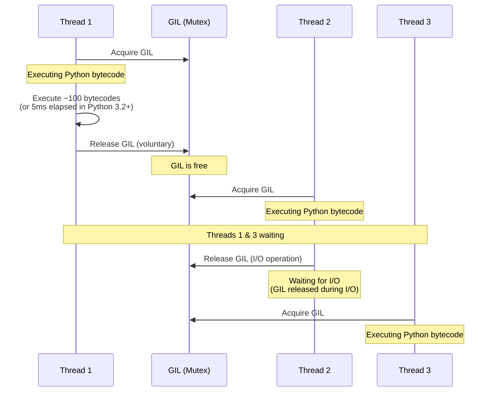
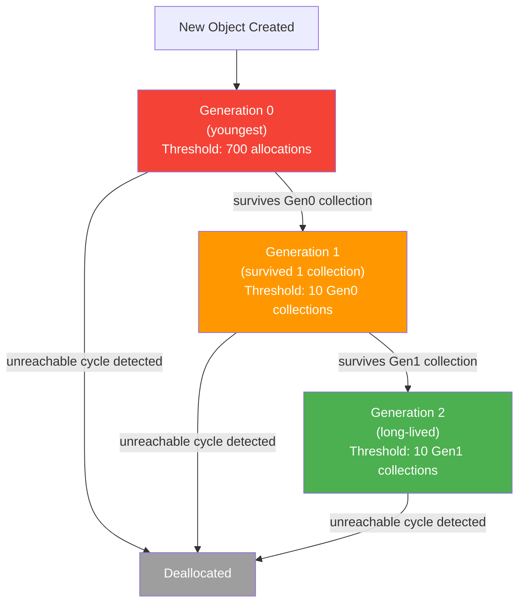
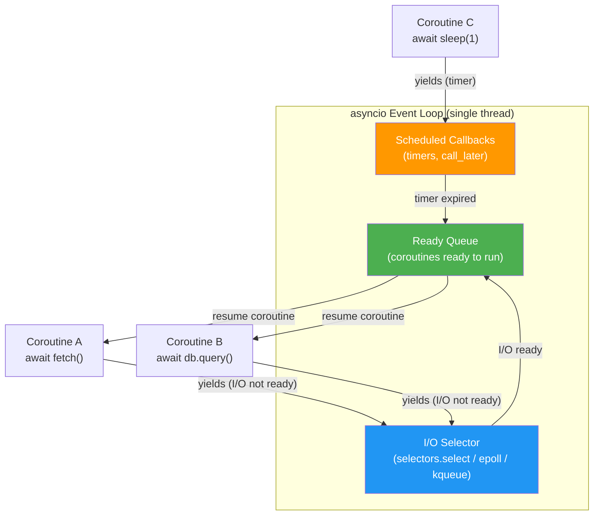
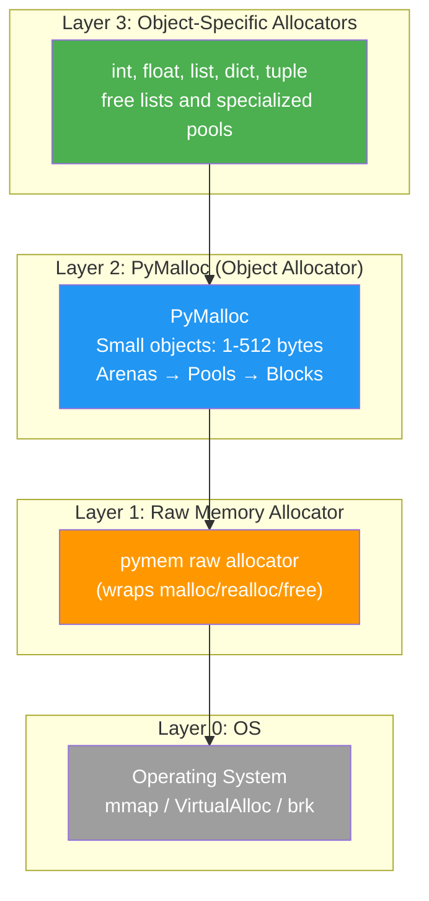
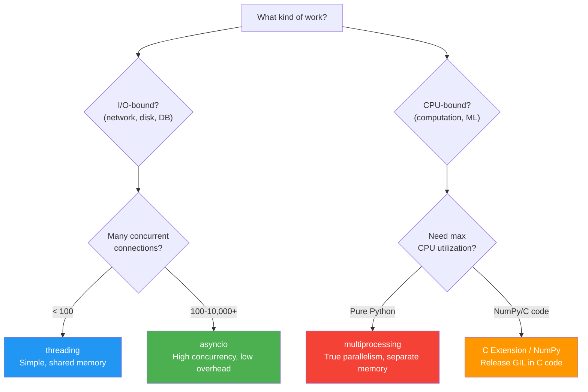

# Python Internals (CPython) — Interview Deep Dive

---

## Table of Contents

1. [The Global Interpreter Lock (GIL)](#1-the-global-interpreter-lock-gil)
2. [Memory Management: Reference Counting & Generational GC](#2-memory-management-reference-counting--generational-gc)
3. [asyncio Event Loop](#3-asyncio-event-loop)
4. [CPython Memory Allocator (PyMalloc)](#4-cpython-memory-allocator-pymalloc)
5. [Decorators Under the Hood](#5-decorators-under-the-hood)
6. [Generators & Coroutines](#6-generators--coroutines)
7. [Multiprocessing vs Threading](#7-multiprocessing-vs-threading)
8. [Interview Q&A](#8-interview-qa)
9. [Quick Reference Summary](#9-quick-reference-summary)

---

## 1. The Global Interpreter Lock (GIL)

### What is the GIL?

The Global Interpreter Lock (GIL) is a mutex in CPython that protects access to Python objects. It ensures that **only one thread executes Python bytecode at any given time**, even on multi-core machines. The GIL exists because CPython's memory management (reference counting) is not thread-safe.

### Why Does the GIL Exist?

| Reason | Explanation |
|---|---|
| **Reference counting is not atomic** | Every Python object has a reference count (`ob_refcnt`). Incrementing/decrementing it from multiple threads without synchronization causes race conditions (double-free, memory leaks). The GIL avoids the need for per-object locks. |
| **C extension safety** | Many C extensions assume they have exclusive access to Python objects. The GIL makes it safe to call into C code without fine-grained locking. |
| **Simplicity** | A single coarse lock is simpler to implement and reason about than thousands of fine-grained locks on individual objects. |
| **Historical** | CPython was designed as single-threaded. The GIL was the lowest-cost retrofit for adding thread support. |

### How the GIL Works



### GIL Release Points

The GIL is released in several key situations, allowing other threads to run:

| Release Point | Example | Why |
|---|---|---|
| **I/O operations** | `socket.recv()`, `file.read()`, `time.sleep()` | Thread is blocked waiting for OS, no Python bytecode runs |
| **C extensions that explicitly release** | NumPy matrix operations, `hashlib` hashing | C code that does not touch Python objects can run concurrently |
| **Periodic check interval** | Every 5ms (Python 3.2+, configurable via `sys.setswitchinterval()`) | Prevents CPU-bound threads from starving others |

```python
import sys

# View and set the GIL switch interval (in seconds)
print(sys.getswitchinterval())  # Default: 0.005 (5ms)
sys.setswitchinterval(0.001)    # Set to 1ms for more responsive switching
```

### Impact on CPU-Bound vs I/O-Bound Work

| Workload Type | Effect of GIL | Solution |
|---|---|---|
| **I/O-bound** (network, disk, DB) | Minimal impact. GIL is released during I/O waits. Threads work fine. | `threading` module or `asyncio` |
| **CPU-bound** (math, compression, ML) | Severe bottleneck. Only one thread runs at a time. Multi-threading gives zero speedup (or worse, due to GIL contention overhead). | `multiprocessing`, C extensions (NumPy), or `concurrent.futures.ProcessPoolExecutor` |

```python
import time
import threading

def cpu_bound_task(n: int) -> int:
    """Count up to n -- pure CPU work."""
    total = 0
    for i in range(n):
        total += i
    return total

N = 50_000_000

# Single-threaded
start = time.perf_counter()
cpu_bound_task(N)
cpu_bound_task(N)
single_time = time.perf_counter() - start
print(f"Single-threaded: {single_time:.2f}s")

# Multi-threaded (does NOT help due to GIL!)
start = time.perf_counter()
t1 = threading.Thread(target=cpu_bound_task, args=(N,))
t2 = threading.Thread(target=cpu_bound_task, args=(N,))
t1.start()
t2.start()
t1.join()
t2.join()
multi_time = time.perf_counter() - start
print(f"Multi-threaded: {multi_time:.2f}s")  # Same or SLOWER than single-threaded!
```

---

## 2. Memory Management: Reference Counting & Generational GC

### Reference Counting

Every CPython object contains a reference count field (`ob_refcnt`). When an object's reference count drops to zero, its memory is immediately freed.

```python
import sys

a = []                    # Create a list object, refcount = 1
print(sys.getrefcount(a)) # Prints 2 (a + the temporary reference from getrefcount)

b = a                     # refcount = 2 (a and b both point to the same list)
print(sys.getrefcount(a)) # Prints 3

del b                     # refcount drops back to 1
print(sys.getrefcount(a)) # Prints 2

# When 'a' goes out of scope or is deleted, refcount drops to 0
# --> the list is immediately deallocated (no GC needed)
```

### Reference Count Changes

| Operation | Effect on refcount |
|---|---|
| Assignment (`b = a`) | +1 |
| Passing to a function | +1 (parameter binding) |
| Storing in a container (`list.append(a)`) | +1 |
| `del` statement | -1 |
| Variable goes out of scope | -1 |
| Removing from a container | -1 |
| Reassigning a variable | -1 for old object, +1 for new |

### The Cyclic Reference Problem

Reference counting alone cannot handle **cyclic references** -- objects that reference each other form a cycle, and their reference counts never reach zero even when they are unreachable.

```python
# Create a reference cycle
class Node:
    def __init__(self, value):
        self.value = value
        self.next = None

a = Node(1)
b = Node(2)
a.next = b  # a references b
b.next = a  # b references a --> CYCLE!

del a  # a's refcount drops from 2 to 1 (b.next still references it)
del b  # b's refcount drops from 2 to 1 (a.next still references it)
# Both objects have refcount = 1, but neither is reachable from the program!
# Reference counting alone CANNOT free them.
```

### Generational Garbage Collector

CPython's cyclic GC uses a **generational** strategy with three generations. The key insight is the **generational hypothesis**: most objects die young.



### How Cyclic GC Works

1. **Track container objects**: Only objects that can hold references to other objects (lists, dicts, classes, instances) are tracked by the GC. Immutable atomics (int, float, string) are not tracked.
2. **Copy reference counts**: For each tracked object, the GC creates a temporary copy of its reference count.
3. **Subtract internal references**: For each reference from one tracked object to another, decrement the target's temporary count.
4. **Identify unreachable**: Objects with a temporary count of zero are unreachable (all references to them come from within the cycle) and can be freed.
5. **Promote survivors**: Objects that survive are moved to the next generation.

```python
import gc

# View GC thresholds (allocation count triggers for each generation)
print(gc.get_threshold())  # Default: (700, 10, 10)

# Generation 0 is collected after 700 new allocations (net: allocations - deallocations)
# Generation 1 is collected after 10 Generation 0 collections
# Generation 2 is collected after 10 Generation 1 collections

# Manually trigger collection
gc.collect()  # Collect all generations

# Disable GC (useful for performance-critical sections with no cycles)
gc.disable()
# ... critical section ...
gc.enable()

# Get GC statistics
print(gc.get_stats())
# [{'collections': 95, 'collected': 580, 'uncollectable': 0}, ...]
```

### `__del__` Finalizer Gotchas

```python
class Resource:
    def __del__(self):
        print(f"Finalizing {self}")
        # WARNING: __del__ has several problems:
        # 1. Order of finalization is undefined for cyclic references
        # 2. In Python 3.4+, objects with __del__ in cycles CAN be collected
        #    (previously they were put in gc.garbage and leaked)
        # 3. __del__ may run in an arbitrary thread
        # 4. Exceptions in __del__ are silently ignored
        # 5. __del__ may be called with partially initialized objects

# Prefer context managers (with statement) for deterministic cleanup:
class Resource:
    def __enter__(self):
        return self
    def __exit__(self, *args):
        self.cleanup()  # Always called, deterministic
    def cleanup(self):
        pass
```

### Weak References

Weak references do not increment the reference count, allowing objects to be garbage collected even when weak references to them exist.

```python
import weakref

class ExpensiveObject:
    def __init__(self, name: str):
        self.name = name

obj = ExpensiveObject("heavy")
weak = weakref.ref(obj)

print(weak())       # <ExpensiveObject object at 0x...>
print(weak().name)   # "heavy"

del obj              # refcount drops to 0, object is freed
print(weak())        # None (object was collected)

# WeakValueDictionary -- cache that does not prevent GC
cache: weakref.WeakValueDictionary[str, ExpensiveObject] = weakref.WeakValueDictionary()
obj2 = ExpensiveObject("data")
cache["key"] = obj2
# When all strong references to obj2 disappear, it is removed from cache automatically
```

---

## 3. asyncio Event Loop

### What is asyncio?

`asyncio` is Python's standard library for writing concurrent code using the `async`/`await` syntax. It provides a single-threaded event loop that schedules and runs coroutines, handles I/O multiplexing, and manages timers.

### Event Loop Architecture



### Core Concepts

| Concept | Description |
|---|---|
| **Coroutine** | A function defined with `async def`. When called, it returns a coroutine object. It does not execute until it is `await`ed or scheduled on the event loop. |
| **Task** | A wrapper around a coroutine that schedules it for concurrent execution. Created with `asyncio.create_task()`. |
| **Future** | A low-level awaitable object representing a result that is not yet available. Tasks are a subclass of Future. |
| **Event Loop** | The central scheduler that runs coroutines, handles I/O, and manages timers. Uses `selectors` (epoll/kqueue/IOCP) under the hood. |
| **await** | Suspends the current coroutine and yields control back to the event loop until the awaited object is ready. |

### Concurrency Patterns

```python
import asyncio
import aiohttp

# --- Sequential (slow) ---
async def fetch_sequential(urls: list[str]) -> list[str]:
    results = []
    async with aiohttp.ClientSession() as session:
        for url in urls:
            async with session.get(url) as response:
                results.append(await response.text())
    return results

# --- Concurrent with gather (fast) ---
async def fetch_concurrent(urls: list[str]) -> list[str]:
    async with aiohttp.ClientSession() as session:
        tasks = [fetch_one(session, url) for url in urls]
        return await asyncio.gather(*tasks)

async def fetch_one(session: aiohttp.ClientSession, url: str) -> str:
    async with session.get(url) as response:
        return await response.text()

# --- Concurrent with TaskGroup (Python 3.11+, structured concurrency) ---
async def fetch_with_taskgroup(urls: list[str]) -> list[str]:
    results: list[str] = []
    async with aiohttp.ClientSession() as session:
        async with asyncio.TaskGroup() as tg:
            for url in urls:
                tg.create_task(fetch_and_append(session, url, results))
    return results

async def fetch_and_append(
    session: aiohttp.ClientSession, url: str, results: list[str]
) -> None:
    async with session.get(url) as response:
        results.append(await response.text())

# --- Semaphore for concurrency limiting ---
async def fetch_limited(urls: list[str], max_concurrent: int = 10) -> list[str]:
    semaphore = asyncio.Semaphore(max_concurrent)

    async def fetch_with_limit(session: aiohttp.ClientSession, url: str) -> str:
        async with semaphore:  # at most max_concurrent coroutines run here
            async with session.get(url) as response:
                return await response.text()

    async with aiohttp.ClientSession() as session:
        tasks = [fetch_with_limit(session, url) for url in urls]
        return await asyncio.gather(*tasks)
```

### asyncio.gather vs asyncio.TaskGroup

| Feature | `asyncio.gather()` | `asyncio.TaskGroup()` (3.11+) |
|---|---|---|
| **Error handling** | By default, if one task raises, others continue. Use `return_exceptions=True` to collect errors. | If one task raises, all other tasks in the group are cancelled. The group re-raises as `ExceptionGroup`. |
| **Cancellation** | Must cancel tasks manually. | Automatic cancellation of sibling tasks on failure. |
| **Structured concurrency** | No -- tasks can outlive the gather. | Yes -- all tasks are guaranteed to finish before exiting the `async with` block. |
| **Return values** | Returns a list of results in order. | Must collect results manually (e.g., append to a list). |

### Common Pitfalls

```python
import asyncio

# PITFALL 1: Forgetting to await
async def bad():
    asyncio.sleep(1)  # Returns a coroutine object, never runs!
    # Should be: await asyncio.sleep(1)

# PITFALL 2: Blocking the event loop
import time

async def blocks_event_loop():
    time.sleep(5)  # BLOCKS the entire event loop for 5 seconds!
    # Should be: await asyncio.sleep(5)

    # For CPU-bound work, offload to a thread/process:
    result = await asyncio.to_thread(cpu_intensive_function, arg)
    # or:
    loop = asyncio.get_event_loop()
    result = await loop.run_in_executor(None, cpu_intensive_function, arg)

# PITFALL 3: Creating tasks without keeping references
async def fire_and_forget():
    asyncio.create_task(some_coroutine())
    # Task might be garbage collected before finishing!
    # Always keep a reference:
    task = asyncio.create_task(some_coroutine())
    # ... later: await task

# PITFALL 4: Sharing mutable state without locks
counter = 0

async def increment():
    global counter
    temp = counter
    await asyncio.sleep(0)  # yields control, another coroutine might run here
    counter = temp + 1       # race condition!
    # Fix: use asyncio.Lock()
```

---

## 4. CPython Memory Allocator (PyMalloc)

### Memory Allocation Hierarchy

CPython uses a layered memory allocation system, with each layer optimizing for different allocation sizes:



### PyMalloc Architecture: Arenas, Pools, and Blocks

| Component | Size | Description |
|---|---|---|
| **Arena** | 256 KB | Largest unit. Allocated from the OS via `mmap`. Contains 64 pools. Arenas are sorted by how full they are; the most-full arenas are preferred (to allow emptier arenas to be freed back to the OS). |
| **Pool** | 4 KB (one OS page) | Contains blocks of a single size class. A pool handles blocks of exactly one size (e.g., all 32-byte blocks). |
| **Block** | 8 to 512 bytes (16 size classes, in 8-byte increments up to 64, then wider steps) | The unit of allocation. When you allocate a small object, PyMalloc finds a pool of the right size class and returns a free block. |

```python
# Objects larger than 512 bytes bypass PyMalloc and go directly to malloc
import sys

small_list = [1, 2, 3]
print(sys.getsizeof(small_list))  # 88 bytes -- handled by PyMalloc

large_bytes = b"x" * 1000
print(sys.getsizeof(large_bytes))  # ~1033 bytes -- handled by raw malloc
```

### Object-Specific Optimizations

CPython maintains **free lists** for commonly used types to avoid repeated allocation/deallocation:

| Type | Free List Details | Why |
|---|---|---|
| **int** | Small integers (-5 to 256) are pre-allocated singletons. Never freed. | These values are used constantly. Pre-allocation avoids millions of allocations. |
| **float** | Free list of up to 100 float objects. Reused when new floats are created. | Floats are frequently created and destroyed (e.g., in loops). |
| **tuple** | Separate free lists for tuples of length 0-19. Empty tuple `()` is a singleton. | Short tuples are extremely common (function returns, unpacking). |
| **list** | Free list of up to 80 list objects. The list object (header) is reused, but the underlying array is reallocated. | Lists are created and destroyed frequently. |
| **dict** | Free list of up to 80 dict objects. | Same reasoning as lists. |

```python
# Proof that small integers are singletons
a = 256
b = 256
print(a is b)  # True -- same object in memory

a = 257
b = 257
print(a is b)  # False in the REPL (different objects), True in a .py file
                # (compiler may intern constants within the same code object)

# Proof that empty tuple is a singleton
t1 = ()
t2 = ()
print(t1 is t2)  # True -- always the same object
```

---

## 5. Decorators Under the Hood

### What Are Decorators?

A decorator is syntactic sugar for wrapping a function (or class) with another callable. The `@decorator` syntax is equivalent to `func = decorator(func)`.

```python
# These two are exactly equivalent:

# Using @ syntax
@my_decorator
def greet(name: str) -> str:
    return f"Hello, {name}"

# Without @ syntax
def greet(name: str) -> str:
    return f"Hello, {name}"
greet = my_decorator(greet)
```

### How Decorators Work Internally

```python
import functools
import time
from typing import Callable, TypeVar, ParamSpec

P = ParamSpec("P")
R = TypeVar("R")

# --- Simple decorator (no arguments) ---
def timer(func: Callable[P, R]) -> Callable[P, R]:
    @functools.wraps(func)  # preserves __name__, __doc__, __module__
    def wrapper(*args: P.args, **kwargs: P.kwargs) -> R:
        start = time.perf_counter()
        result = func(*args, **kwargs)
        elapsed = time.perf_counter() - start
        print(f"{func.__name__} took {elapsed:.4f}s")
        return result
    return wrapper

@timer
def slow_function(n: int) -> int:
    time.sleep(n)
    return n

# --- Decorator with arguments (decorator factory) ---
def retry(max_attempts: int = 3, delay: float = 1.0):
    def decorator(func: Callable[P, R]) -> Callable[P, R]:
        @functools.wraps(func)
        def wrapper(*args: P.args, **kwargs: P.kwargs) -> R:
            last_exception: Exception | None = None
            for attempt in range(1, max_attempts + 1):
                try:
                    return func(*args, **kwargs)
                except Exception as e:
                    last_exception = e
                    print(f"Attempt {attempt}/{max_attempts} failed: {e}")
                    if attempt < max_attempts:
                        time.sleep(delay)
            raise last_exception  # type: ignore
        return wrapper
    return decorator

@retry(max_attempts=5, delay=0.5)
def flaky_api_call() -> dict:
    # ... might fail
    return {}

# Stacking decorators: applied bottom-up
@decorator_a
@decorator_b
@decorator_c
def my_func():
    pass

# Equivalent to: my_func = decorator_a(decorator_b(decorator_c(my_func)))
# Execution order: decorator_c wraps first, then decorator_b, then decorator_a
```

### Class-Based Decorators

```python
class CacheDecorator:
    """A decorator implemented as a class with __call__."""

    def __init__(self, func: Callable):
        functools.update_wrapper(self, func)
        self.func = func
        self.cache: dict = {}

    def __call__(self, *args, **kwargs):
        key = (args, tuple(sorted(kwargs.items())))
        if key not in self.cache:
            self.cache[key] = self.func(*args, **kwargs)
        return self.cache[key]

    def clear_cache(self):
        self.cache.clear()

@CacheDecorator
def expensive_computation(n: int) -> int:
    print(f"Computing for {n}...")
    return n ** 2

expensive_computation(5)  # Prints "Computing for 5...", returns 25
expensive_computation(5)  # Returns 25 from cache, no print
expensive_computation.clear_cache()  # Extra method available
```

### Descriptor Protocol and Decorators

`@property`, `@staticmethod`, and `@classmethod` are decorators that return descriptor objects:

```python
class Temperature:
    def __init__(self, celsius: float):
        self._celsius = celsius

    @property
    def fahrenheit(self) -> float:
        """@property returns a descriptor object with __get__, __set__, __delete__."""
        return self._celsius * 9 / 5 + 32

    @fahrenheit.setter
    def fahrenheit(self, value: float) -> None:
        self._celsius = (value - 32) * 5 / 9

# Under the hood, @property creates a descriptor:
# fahrenheit = property(fget=..., fset=..., fdel=..., doc=...)
# When you access t.fahrenheit, Python calls fahrenheit.__get__(t, Temperature)
```

---

## 6. Generators & Coroutines

### Generators

A generator function uses `yield` to produce a sequence of values lazily. When called, it returns a generator object without executing the body. Each `next()` call executes until the next `yield` and suspends.

```python
from typing import Generator

def fibonacci() -> Generator[int, None, None]:
    a, b = 0, 1
    while True:
        yield a        # suspend here, return 'a' to caller
        a, b = b, a + b  # resume here on next next() call

# The generator is lazy -- it computes values on demand
gen = fibonacci()
print(next(gen))  # 0
print(next(gen))  # 1
print(next(gen))  # 1
print(next(gen))  # 2

# Memory-efficient: only one value is in memory at a time
# Compare with: [fib(i) for i in range(1_000_000)]  -- stores ALL in memory
```

### Generator Internal State Machine

```python
import inspect

def simple_gen():
    print("Phase 1")
    yield 1
    print("Phase 2")
    yield 2
    print("Phase 3")
    # Function returns --> StopIteration raised

gen = simple_gen()
print(inspect.getgeneratorstate(gen))  # GEN_CREATED (not started)

next(gen)  # Prints "Phase 1", yields 1
print(inspect.getgeneratorstate(gen))  # GEN_SUSPENDED

next(gen)  # Prints "Phase 2", yields 2
print(inspect.getgeneratorstate(gen))  # GEN_SUSPENDED

try:
    next(gen)  # Prints "Phase 3", raises StopIteration
except StopIteration:
    pass
print(inspect.getgeneratorstate(gen))  # GEN_CLOSED
```

| State | Description |
|---|---|
| `GEN_CREATED` | Generator has been created but `next()` has not been called yet. |
| `GEN_RUNNING` | Generator is currently executing (you are inside it). |
| `GEN_SUSPENDED` | Generator is paused at a `yield` expression. |
| `GEN_CLOSED` | Generator has finished (returned or threw an unhandled exception). |

### Generator `send()` and `throw()`

```python
def accumulator() -> Generator[int, int, str]:
    total = 0
    while True:
        value = yield total     # yield total, receive value from send()
        if value is None:
            break
        total += value
    return f"Final total: {total}"  # Returned via StopIteration.value

gen = accumulator()
print(next(gen))        # 0 (must call next() first to advance to the first yield)
print(gen.send(10))     # 10 (total = 0 + 10)
print(gen.send(20))     # 30 (total = 10 + 20)
print(gen.send(5))      # 35 (total = 30 + 5)

try:
    gen.send(None)       # value is None --> break --> StopIteration
except StopIteration as e:
    print(e.value)       # "Final total: 35"
```

### `yield from` (Delegation)

```python
def inner():
    yield 1
    yield 2
    return "inner done"

def outer():
    result = yield from inner()  # delegates to inner(), receives its return value
    print(f"Inner returned: {result}")
    yield 3

list(outer())  # [1, 2, 3], prints "Inner returned: inner done"

# yield from:
# 1. Forwards next()/send()/throw()/close() from outer to inner
# 2. Captures the return value of inner (via StopIteration.value)
# 3. Handles all the edge cases of delegation automatically
```

### From Generators to Coroutines

```python
# Native coroutine (async def) -- the modern approach
async def fetch_data(url: str) -> dict:
    async with aiohttp.ClientSession() as session:
        async with session.get(url) as response:
            return await response.json()

# Generator-based coroutine (legacy, pre-3.5)
# @asyncio.coroutine  # deprecated
# def fetch_data_old(url):
#     response = yield from aiohttp.request('GET', url)
#     data = yield from response.json()
#     return data

# Key difference: async def + await is just syntax sugar
# Under the hood, coroutines use the same suspend/resume mechanism as generators
# but they are NOT generators -- they are a distinct type (types.CoroutineType)
```

---

## 7. Multiprocessing vs Threading

### When to Use What



### Detailed Comparison

| Feature | `threading` | `multiprocessing` | `asyncio` |
|---|---|---|---|
| **Parallelism** | No (GIL prevents parallel CPU execution) | Yes (separate processes, separate GILs) | No (single thread, cooperative scheduling) |
| **Concurrency** | Yes (OS-level preemptive switching) | Yes (OS-level) | Yes (cooperative, `await` = switch point) |
| **Memory** | Shared (same process address space) | Separate (each process has its own memory; must use IPC for sharing) | Shared (same process) |
| **Communication** | Direct variable access (needs locks) | `Queue`, `Pipe`, `Value`, `Array`, `Manager` | Direct variable access (no locks needed for single-threaded async) |
| **Overhead per unit** | ~8 MB stack per thread, fast creation | ~30-50 MB per process, slow creation (fork/spawn) | ~1-2 KB per coroutine, near-instant creation |
| **Max practical count** | ~100-1,000 threads | ~CPU core count (4-64 typically) | ~100,000+ coroutines |
| **Best for** | I/O-bound tasks with moderate concurrency | CPU-bound tasks needing true parallelism | High-concurrency I/O (web servers, scrapers) |
| **Debugging** | Hard (race conditions, deadlocks) | Moderate (isolated processes, but harder to inspect) | Easier (deterministic, cooperative scheduling) |

### Threading Example

```python
import threading
from concurrent.futures import ThreadPoolExecutor, as_completed

# Basic threading with lock
counter = 0
lock = threading.Lock()

def increment(n: int) -> None:
    global counter
    for _ in range(n):
        with lock:  # acquire lock, release on exit
            counter += 1

threads = [threading.Thread(target=increment, args=(100_000,)) for _ in range(4)]
for t in threads:
    t.start()
for t in threads:
    t.join()
print(f"Counter: {counter}")  # 400,000 (correct with lock)

# ThreadPoolExecutor -- higher-level API
def download(url: str) -> str:
    import urllib.request
    return urllib.request.urlopen(url).read().decode()

urls = ["https://example.com"] * 10

with ThreadPoolExecutor(max_workers=5) as executor:
    futures = {executor.submit(download, url): url for url in urls}
    for future in as_completed(futures):
        url = futures[future]
        try:
            data = future.result()
            print(f"{url}: {len(data)} bytes")
        except Exception as e:
            print(f"{url}: error {e}")
```

### Multiprocessing Example

```python
from multiprocessing import Process, Queue, Pool
from concurrent.futures import ProcessPoolExecutor
import os

# Basic multiprocessing
def cpu_work(n: int) -> int:
    """CPU-bound: compute sum of squares."""
    return sum(i * i for i in range(n))

# Using Pool (map-style)
with Pool(processes=4) as pool:
    chunks = [10_000_000] * 4  # 4 chunks, one per process
    results = pool.map(cpu_work, chunks)
    print(f"Results: {results}")

# Using ProcessPoolExecutor (modern API, matches ThreadPoolExecutor)
with ProcessPoolExecutor(max_workers=4) as executor:
    futures = [executor.submit(cpu_work, 10_000_000) for _ in range(4)]
    for future in as_completed(futures):
        print(f"Result: {future.result()}")

# Sharing data between processes via Queue
def producer(q: Queue, items: list) -> None:
    for item in items:
        q.put(item)
    q.put(None)  # sentinel to signal completion

def consumer(q: Queue) -> None:
    while True:
        item = q.get()
        if item is None:
            break
        print(f"Process {os.getpid()} got: {item}")

queue: Queue = Queue()
p = Process(target=producer, args=(queue, [1, 2, 3, 4, 5]))
c = Process(target=consumer, args=(queue,))
p.start()
c.start()
p.join()
c.join()
```

### Process Start Methods

| Method | How | OS | Notes |
|---|---|---|---|
| `fork` | Copies the entire parent process (COW). Child inherits all file descriptors, locks, etc. | Linux/macOS (default on Linux) | Fast but can cause issues with threads and locks in the forked child. |
| `spawn` | Starts a fresh Python interpreter. Pickles the target function and arguments. | All platforms (default on Windows/macOS 3.8+) | Slower but safer. No inherited state issues. |
| `forkserver` | A server process is forked once at the start. New processes are forked from this server (which is single-threaded). | Linux | Compromise between fork speed and spawn safety. |

```python
import multiprocessing

# Set the start method (must be called at most once, in __main__)
multiprocessing.set_start_method("spawn")

# Or use a context for a specific method
ctx = multiprocessing.get_context("fork")
p = ctx.Process(target=cpu_work, args=(1000,))
```

---

## 8. Interview Q&A

> **Q1: What is the GIL and why can't Python threads do true parallel CPU work?**
>
> The GIL (Global Interpreter Lock) is a mutex in CPython that allows only one thread to execute Python bytecode at a time. It exists because CPython's reference counting memory management is not thread-safe -- without the GIL, concurrent increments/decrements to reference counts would cause race conditions, leading to memory corruption, double-frees, or leaks. For CPU-bound work, the GIL means that multi-threading provides zero speedup because threads take turns executing bytecode rather than running in parallel. For I/O-bound work, the impact is minimal because threads release the GIL while waiting for I/O. To achieve true CPU parallelism in Python, use `multiprocessing` (separate processes with separate GILs), C extensions that release the GIL (like NumPy), or the `concurrent.futures.ProcessPoolExecutor`.

> **Q2: How does CPython's garbage collector handle circular references?**
>
> CPython uses two mechanisms: reference counting (primary) and a cyclic garbage collector (supplemental). Reference counting immediately frees objects when their count reaches zero, but it cannot detect reference cycles (A references B, B references A). The cyclic GC uses a generational approach with three generations (0, 1, 2). Generation 0 is collected most frequently (every ~700 new allocations). The algorithm works by: (1) tracking all container objects (lists, dicts, class instances -- not immutable atomics), (2) temporarily copying their reference counts, (3) subtracting internal references (references from one tracked object to another), and (4) collecting objects whose adjusted count is zero (all their references come from within the cycle, meaning they are unreachable from outside). Surviving objects are promoted to the next generation. The generational hypothesis (most objects die young) makes this efficient because Generation 0 is small and collected often.

> **Q3: What is the difference between `asyncio.gather()` and `asyncio.TaskGroup()`?**
>
> `asyncio.gather()` takes multiple awaitables and runs them concurrently, returning results in order. If one task fails, others continue running by default (or use `return_exceptions=True` to collect exceptions as values). `asyncio.TaskGroup()` (Python 3.11+) implements structured concurrency: if any task in the group raises an exception, all other tasks in the group are automatically cancelled, and the group raises an `ExceptionGroup` containing all exceptions. This prevents "fire-and-forget" patterns where failed tasks are silently ignored. TaskGroup guarantees that all tasks are finished (completed, cancelled, or failed) when the `async with` block exits. Choose `gather()` for independent tasks where partial success is acceptable, and `TaskGroup()` when all tasks must succeed or the entire operation should abort.

> **Q4: How does PyMalloc optimize memory allocation for small objects?**
>
> PyMalloc is CPython's object allocator for small objects (1-512 bytes). It uses a three-tier structure: Arenas (256 KB, allocated from the OS via mmap), Pools (4 KB, one OS page, handles blocks of a single size class), and Blocks (the actual allocation units, sized in increments from 8 to 512 bytes). When you allocate a small object, PyMalloc finds a pool of the right size class and returns a free block from it. This avoids the overhead of calling the OS allocator (malloc) for every small allocation. Additionally, CPython maintains free lists for commonly used types (int, float, tuple, list, dict) that recycle recently freed objects without even going through PyMalloc. Objects larger than 512 bytes bypass PyMalloc entirely and go directly to the system malloc. Arenas are sorted by fullness so that the most-full arenas are used first, allowing emptier arenas to be freed back to the OS.

> **Q5: What is the difference between a generator and a coroutine in Python?**
>
> Both generators and coroutines use suspend/resume mechanics, but they serve different purposes. A generator (defined with `def` + `yield`) produces a sequence of values lazily -- it yields values to the caller and suspends until the next `next()` call. Generators implement the iterator protocol (`__iter__` and `__next__`). A native coroutine (defined with `async def` + `await`) is designed for asynchronous I/O -- it yields control back to the event loop when it `await`s an I/O operation, allowing other coroutines to run. Coroutines are scheduled by an event loop (e.g., `asyncio`), not by manual `next()` calls. Under the hood, both use similar frame suspension mechanisms in CPython, but they are distinct types: `types.GeneratorType` vs `types.CoroutineType`. You cannot `await` a regular generator or call `next()` on a coroutine. The `yield from` syntax (for generators) was the precursor to `await` (for coroutines); `await` is essentially `yield from` with type restrictions.

> **Q6: When would you choose multiprocessing over threading in Python?**
>
> Choose multiprocessing for CPU-bound work (heavy computation, data processing, image manipulation, ML training) where you need true parallelism across multiple CPU cores. The GIL prevents threads from executing Python bytecode in parallel, so threading provides no speedup for CPU-bound work -- in fact, it can be slower due to GIL contention and context switching. Multiprocessing spawns separate OS processes, each with its own GIL, enabling true parallel execution. The trade-offs are: (1) higher memory overhead (~30-50 MB per process vs ~8 MB per thread), (2) slower startup (process creation is heavier than thread creation), (3) no shared memory (must use IPC mechanisms like Queue, Pipe, or shared memory objects), and (4) data must be serializable (pickle). For I/O-bound work with moderate concurrency (<100 connections), threading is simpler. For I/O-bound work with high concurrency (100-10,000+ connections), asyncio is most efficient.

---

## 9. Quick Reference Summary

### GIL Decision Matrix

| Scenario | threading | multiprocessing | asyncio |
|---|---|---|---|
| Web scraping (100 URLs) | Works (GIL released during I/O) | Overkill | Best choice |
| Web server (10k connections) | Too many threads | N/A | Best choice |
| Image processing pipeline | No speedup (GIL) | Best choice | N/A (CPU-bound) |
| ML model training | No speedup (GIL) | Good (or use NumPy/C) | N/A (CPU-bound) |
| Database queries (50 concurrent) | Works well | Overkill | Good choice |
| File I/O (batch processing) | Works well | Good for CPU part | `asyncio` + `to_thread` |

### Memory Management Summary

| Mechanism | Handles | Speed | Limitation |
|---|---|---|---|
| Reference counting | Most objects (non-cyclic) | Immediate (zero-latency deallocation) | Cannot detect cycles |
| Generational GC (Gen 0) | Short-lived cyclic garbage | Fast (small working set) | Only container objects |
| Generational GC (Gen 1/2) | Long-lived cyclic garbage | Slower (larger scan) | Can cause pauses |
| Free lists | Recycling common types | Fastest (no allocation needed) | Fixed capacity per type |
| Weak references | Cache entries, observers | No overhead on target lifetime | Target must support weakref |

### Key Numbers

| Metric | Value |
|---|---|
| GIL switch interval (default) | 5ms (`sys.getswitchinterval()`) |
| Small integer cache range | -5 to 256 |
| PyMalloc small object threshold | 512 bytes |
| PyMalloc arena size | 256 KB |
| PyMalloc pool size | 4 KB |
| GC Gen 0 threshold (default) | 700 allocations |
| GC Gen 1/2 threshold (default) | 10 lower-gen collections |
| Thread stack size (default) | ~8 MB |
| Process overhead | ~30-50 MB |
| Coroutine overhead | ~1-2 KB |

### Python Concurrency Cheat Sheet

```
CPU-bound?
    YES --> multiprocessing / ProcessPoolExecutor
            OR C extension that releases GIL (NumPy, Cython)
    NO  --> How many concurrent operations?
        < 100   --> threading / ThreadPoolExecutor
        100+    --> asyncio (or threading with careful tuning)
        10,000+ --> asyncio (only viable option)
```
