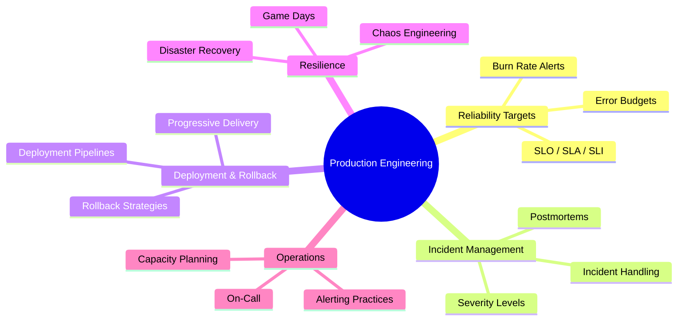
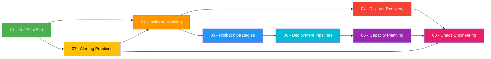
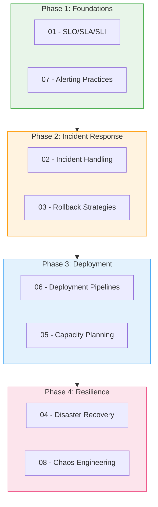

# Production Engineering - Study Guide

## Overview

Production engineering focuses on building, deploying, and operating reliable software systems at scale. This module covers the core disciplines that keep production systems running: from defining reliability targets (SLOs) to recovering from disasters, from deploying safely to responding to incidents.

## Topic Map

## Topics at a Glance

| # | Topic | Key Concepts | Difficulty | Est. Time |
|---|-------|-------------|------------|-----------|
| 01 | [SLO / SLA / SLI](./01-slo-sla-sli.md) | Error budgets, burn rates, reliability targets | Medium | 2-3 hrs |
| 02 | [Incident Handling](./02-incident-handling.md) | Severity levels, MTTR, postmortems, on-call | Medium | 2-3 hrs |
| 03 | [Rollback Strategies](./03-rollback-strategies.md) | Blue-green, canary, feature flags, DB rollbacks | Medium-Hard | 3-4 hrs |
| 04 | [Disaster Recovery](./04-disaster-recovery.md) | RPO/RTO, multi-region failover, DR tiers | Hard | 3-4 hrs |
| 05 | [Capacity Planning](./05-capacity-planning.md) | Traffic modeling, load testing, auto-scaling | Medium | 2-3 hrs |
| 06 | [Deployment Pipelines](./06-deployment-pipelines.md) | CI/CD, progressive delivery, IaC, GitOps | Medium | 2-3 hrs |
| 07 | [Alerting Practices](./07-alerting-practices.md) | Alert fatigue, symptom-based alerts, runbooks | Medium | 2 hrs |
| 08 | [Chaos Engineering](./08-chaos-engineering.md) | Failure injection, game days, blast radius | Medium-Hard | 2-3 hrs |

## Recommended Study Order

**Phase 1 - Foundations (Days 1-2):** Start with SLOs to understand what "reliable" means, then learn how alerting surfaces reliability issues.

**Phase 2 - Incident Response (Days 3-5):** Learn how to respond when things break and how to roll back safely.

**Phase 3 - Deployment (Days 6-8):** Understand how code gets to production and how to plan for growth.

**Phase 4 - Resilience (Days 9-12):** Learn how to survive large-scale failures and how to proactively test resilience.

## Progress Tracker

| # | Topic | Read | Notes | Practice Qs | Confident |
|---|-------|:----:|:-----:|:-----------:|:---------:|
| 01 | SLO / SLA / SLI | [ ] | [ ] | [ ] | [ ] |
| 02 | Incident Handling | [ ] | [ ] | [ ] | [ ] |
| 03 | Rollback Strategies | [ ] | [ ] | [ ] | [ ] |
| 04 | Disaster Recovery | [ ] | [ ] | [ ] | [ ] |
| 05 | Capacity Planning | [ ] | [ ] | [ ] | [ ] |
| 06 | Deployment Pipelines | [ ] | [ ] | [ ] | [ ] |
| 07 | Alerting Practices | [ ] | [ ] | [ ] | [ ] |
| 08 | Chaos Engineering | [ ] | [ ] | [ ] | [ ] |

## How to Use This Guide

1. **Follow the study order** -- each topic builds on the previous ones.
2. **Read the concepts.md** in each directory for theory, diagrams, and code examples.
3. **Work through the Interview Q&A** sections in blockquote format at the end of each file.
4. **Check off progress** in the tracker above as you complete each topic.
5. **Revisit weak areas** before interviews -- use the comparison tables for quick refreshers.
