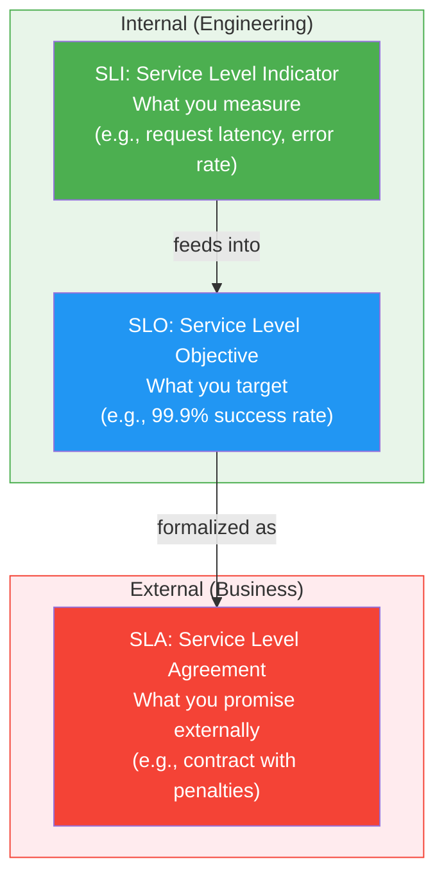
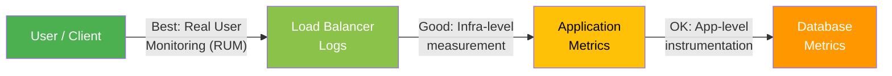
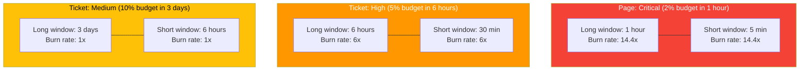

# SLO, SLA, and SLI

## Core Definitions

**SLI (Service Level Indicator):** A quantitative measure of some aspect of the level of service being provided. It is a carefully defined metric -- for example, request latency, error rate, or throughput.

**SLO (Service Level Objective):** A target value or range for a service level measured by an SLI. For example: "99.9% of requests will complete in under 200ms over a 30-day rolling window."

**SLA (Service Level Agreement):** A formal contract between a service provider and a customer that specifies what happens when an SLO is (or is not) met. SLAs include consequences -- typically financial penalties, service credits, or contract termination clauses.



## Comparison Table

| Aspect | SLI | SLO | SLA |
|--------|-----|-----|-----|
| **What** | Metric / measurement | Target for that metric | Contractual commitment |
| **Who defines** | Engineers | Engineers + Product | Business + Legal |
| **Audience** | Internal | Internal | External (customers) |
| **Example** | 99.95% of requests < 200ms | 99.9% availability per month | 99.5% uptime or service credits |
| **Consequence of miss** | Investigation | Freeze features, pay down debt | Financial penalty |
| **Granularity** | Very precise | Precise | Conservative buffer below SLO |

## Choosing Good SLIs

Not all metrics make good SLIs. The best SLIs directly reflect user experience.

### The Four Golden SLI Categories

| Category | What It Measures | Good For | Example |
|----------|-----------------|----------|---------|
| **Availability** | Can users reach the service? | All user-facing services | Successful requests / total requests |
| **Latency** | How fast is the response? | APIs, web pages | % of requests < 200ms |
| **Throughput** | How much work gets done? | Data pipelines, batch jobs | Records processed / second |
| **Correctness** | Are responses accurate? | Financial, data services | Correct results / total results |

### SLI Specification vs. Implementation

```typescript
// SLI Specification (what to measure):
// "The proportion of valid requests served successfully"

// SLI Implementation (how to measure):
interface SLIConfig {
  name: string;
  description: string;
  numerator: string;   // good events
  denominator: string; // total valid events
  threshold?: number;  // optional latency threshold
}

const availabilitySLI: SLIConfig = {
  name: 'api_availability',
  description: 'Proportion of successful HTTP requests',
  numerator: 'count of HTTP requests with status < 500',
  denominator: 'count of all HTTP requests (excluding 4xx)',
  // Note: 4xx are client errors, not service failures
};

const latencySLI: SLIConfig = {
  name: 'api_latency',
  description: 'Proportion of requests faster than threshold',
  numerator: 'count of HTTP requests completing in < 200ms',
  denominator: 'count of all HTTP requests',
  threshold: 200, // milliseconds
};
```

### Where to Measure SLIs



**Prefer measuring closer to the user.** Load balancer logs capture the full picture (including app crashes). Application-level metrics miss infrastructure failures. Database metrics miss everything above the DB layer.

## Error Budgets

An error budget is the inverse of your SLO -- it quantifies how much unreliability your service is allowed.

### Calculating Error Budgets

```
Error Budget = 1 - SLO

If SLO = 99.9% availability:
  Error Budget = 0.1% of total requests can fail
  In a 30-day month: 43.2 minutes of downtime allowed
```

| SLO | Error Budget | Monthly Downtime | Daily Downtime |
|-----|-------------|-----------------|----------------|
| 99% | 1% | 7 hours 18 min | 14 min 24 sec |
| 99.5% | 0.5% | 3 hours 39 min | 7 min 12 sec |
| 99.9% | 0.1% | 43 min 50 sec | 1 min 26 sec |
| 99.95% | 0.05% | 21 min 55 sec | 43 sec |
| 99.99% | 0.01% | 4 min 23 sec | 8.6 sec |
| 99.999% | 0.001% | 26 sec | 0.86 sec |

### Error Budget Policy

An error budget policy defines what happens when the budget is running low or exhausted.

```typescript
interface ErrorBudgetPolicy {
  thresholds: BudgetThreshold[];
  evaluationWindow: string; // e.g., "30 days rolling"
}

interface BudgetThreshold {
  budgetRemainingPercent: number;
  actions: string[];
}

const policy: ErrorBudgetPolicy = {
  evaluationWindow: '30 days rolling',
  thresholds: [
    {
      budgetRemainingPercent: 50,
      actions: [
        'Team reviews current SLO burn rate in weekly meeting',
        'Prioritize reliability-related bugs',
      ],
    },
    {
      budgetRemainingPercent: 25,
      actions: [
        'Halt non-critical feature launches',
        'Dedicate 1 engineer to reliability work',
        'Increase monitoring and alerting coverage',
      ],
    },
    {
      budgetRemainingPercent: 0,
      actions: [
        'Full feature freeze until budget recovers',
        'All engineering effort on reliability',
        'Incident review for every budget-consuming event',
        'Escalate to VP Engineering',
      ],
    },
  ],
};
```

## Burn Rate Alerts

Traditional threshold alerts ("error rate > 1%") are noisy. Burn rate alerts detect SLO violations **before** the budget is fully consumed.

### What Is Burn Rate?

Burn rate = how fast you are consuming your error budget relative to the SLO window.

- **Burn rate 1x**: Budget will be exactly exhausted at the end of the window. No alert needed.
- **Burn rate 2x**: Budget will be exhausted halfway through the window.
- **Burn rate 10x**: Budget will be exhausted in 1/10th of the window.

```
If SLO window = 30 days, SLO = 99.9%:
  Total error budget = 0.1% of requests over 30 days

  Burn rate 1x  -> budget gone in 30 days   (normal)
  Burn rate 10x -> budget gone in 3 days     (serious)
  Burn rate 36x -> budget gone in 20 hours   (critical)
```

### Multi-Window, Multi-Burn-Rate Alerts

Google's recommended approach uses two windows per alert -- a long window for significance and a short window to confirm the issue is ongoing:



### Implementing Burn Rate Alerts (Prometheus Example)

```typescript
// Conceptual burn rate calculation in TypeScript
interface BurnRateAlert {
  name: string;
  sloTarget: number;
  longWindowMinutes: number;
  shortWindowMinutes: number;
  burnRateThreshold: number;
  severity: 'critical' | 'high' | 'medium';
}

const alerts: BurnRateAlert[] = [
  {
    name: 'HighBurnRate_Critical',
    sloTarget: 0.999,
    longWindowMinutes: 60,        // 1 hour
    shortWindowMinutes: 5,         // 5 minutes
    burnRateThreshold: 14.4,
    severity: 'critical',          // pages on-call
  },
  {
    name: 'HighBurnRate_Warning',
    sloTarget: 0.999,
    longWindowMinutes: 360,        // 6 hours
    shortWindowMinutes: 30,        // 30 minutes
    burnRateThreshold: 6,
    severity: 'high',              // creates ticket
  },
];

// Prometheus rule (conceptual):
// burn_rate_1h = 1 - (rate(http_requests_total{code!~"5.."}[1h])
//                     / rate(http_requests_total[1h]))
// alert: burn_rate_1h > (14.4 * (1 - 0.999))

function calculateBurnRate(
  errorRate: number,
  sloTarget: number,
): number {
  const errorBudget = 1 - sloTarget;
  return errorRate / errorBudget;
}

// Example: error rate of 1.44% with 99.9% SLO
// burn rate = 0.0144 / 0.001 = 14.4x  --> CRITICAL
console.log(calculateBurnRate(0.0144, 0.999)); // 14.4
```

## Real-World Example: Defining SLOs for an API

```typescript
// Step 1: Identify user journeys
const userJourneys = [
  'User loads dashboard (GET /api/dashboard)',
  'User creates an order (POST /api/orders)',
  'User searches products (GET /api/search)',
];

// Step 2: Define SLIs for each journey
interface ServiceSLO {
  journey: string;
  slis: {
    availability: { target: number; window: string };
    latency: { target: number; percentile: number; thresholdMs: number; window: string };
  };
}

const slos: ServiceSLO[] = [
  {
    journey: 'Dashboard Load',
    slis: {
      availability: { target: 0.999, window: '30d rolling' },
      latency: { target: 0.99, percentile: 99, thresholdMs: 500, window: '30d rolling' },
    },
  },
  {
    journey: 'Order Creation',
    slis: {
      availability: { target: 0.9999, window: '30d rolling' },
      // Higher bar: this is revenue-critical
      latency: { target: 0.999, percentile: 99, thresholdMs: 1000, window: '30d rolling' },
    },
  },
  {
    journey: 'Product Search',
    slis: {
      availability: { target: 0.999, window: '30d rolling' },
      latency: { target: 0.95, percentile: 95, thresholdMs: 300, window: '30d rolling' },
    },
  },
];

// Step 3: Set up error budget tracking
function trackErrorBudget(
  sloTarget: number,
  totalRequests: number,
  failedRequests: number,
): { budgetTotal: number; budgetConsumed: number; budgetRemaining: number } {
  const budgetTotal = Math.floor(totalRequests * (1 - sloTarget));
  const budgetConsumed = failedRequests;
  const budgetRemaining = budgetTotal - budgetConsumed;

  return { budgetTotal, budgetConsumed, budgetRemaining };
}

// Example: 1 million requests, 99.9% SLO, 800 failures
const budget = trackErrorBudget(0.999, 1_000_000, 800);
// { budgetTotal: 1000, budgetConsumed: 800, budgetRemaining: 200 }
// 80% of budget consumed -> triggers "25% remaining" policy action
```

## 99.9% vs 99.99% -- The Cost of Each Nine

| Factor | 99.9% (three nines) | 99.99% (four nines) |
|--------|---------------------|----------------------|
| Monthly downtime allowed | ~43 minutes | ~4.4 minutes |
| Architecture | Single-region, basic redundancy | Multi-region, active-active |
| Deployment | Canary with quick rollback | Blue-green with instant failover |
| On-call | Business hours with escalation | 24/7 with redundant responders |
| Cost multiplier | 1x baseline | 3-10x baseline |
| Testing | Standard integration tests | Chaos engineering, game days |
| Dependencies | Can tolerate some SPOF | Zero single points of failure |
| Data | Single-region backups | Cross-region replication |

**Key insight:** Each additional nine roughly increases cost and complexity by an order of magnitude. Choose the right SLO for the business need -- not every service needs four nines.

## Common Pitfalls

| Pitfall | Problem | Fix |
|---------|---------|-----|
| SLO = 100% | Impossible target; blocks all change | Set realistic target (99.9% is fine for most) |
| Too many SLIs | Alert fatigue, hard to reason about | 3-5 SLIs per service maximum |
| Measuring at the server only | Misses network, DNS, CDN failures | Measure at the load balancer or client |
| SLO without error budget policy | SLO has no teeth; gets ignored | Document actions for 50%, 25%, 0% thresholds |
| SLO tighter than dependency SLO | Mathematically impossible | Your SLO <= weakest dependency SLO |
| Averaging latency | Hides tail latency (p99 problems) | Use percentiles: p50, p95, p99 |

---

## Interview Q&A

> **Q: What is the difference between an SLO and an SLA?**
>
> A: An SLO is an internal reliability target set by engineering (e.g., 99.9% availability). An SLA is a formal contract with customers that includes consequences for missing the target (e.g., service credits if uptime drops below 99.5%). SLOs should always be stricter than SLAs -- if your SLA promises 99.5%, your internal SLO should be 99.9% so you have a buffer before contractual penalties kick in.

> **Q: How do you choose which metrics to use as SLIs?**
>
> A: Start with user journeys. For each critical user journey, identify what "working" means from the user's perspective. Typically this maps to availability (did the request succeed?), latency (was it fast enough?), and sometimes correctness (was the result right?). Measure as close to the user as possible -- load balancer logs or Real User Monitoring are better than server-side metrics. Keep it to 3-5 SLIs per service.

> **Q: What is an error budget and how do you use it?**
>
> A: An error budget is the acceptable amount of unreliability allowed by your SLO. For a 99.9% SLO, the error budget is 0.1% of requests (or about 43 minutes of downtime per month). The error budget enables a balance between reliability and velocity: as long as there is remaining budget, teams can ship features and take risks. When the budget is depleted, the team freezes features and focuses purely on reliability. This creates an objective, data-driven framework for the velocity-vs-reliability tradeoff.

> **Q: Explain burn rate alerts. Why are they better than threshold alerts?**
>
> A: A burn rate measures how fast you are consuming your error budget relative to your SLO window. A burn rate of 10x means you will exhaust your 30-day budget in 3 days. Burn rate alerts are better because (1) they are SLO-aware -- a brief spike that consumes only 0.1% of budget does not fire, (2) they use multi-window checking (e.g., 1-hour long window + 5-minute short window) to avoid alerting on resolved issues, and (3) they directly connect to business impact: "we are about to violate our SLO" is more actionable than "error rate exceeded 1%."

> **Q: Your service depends on a third-party API with 99.5% availability. What SLO can you set?**
>
> A: You cannot promise better availability than your weakest dependency in the critical path. If the third-party API is in the critical path with 99.5% uptime, your theoretical maximum is 99.5%. In practice you should set your SLO lower (e.g., 99.0%) to account for your own failures on top of the dependency. Alternatively, you can architect around the dependency -- use caching, fallbacks, or async processing -- to decouple your availability from the dependency's availability. If you do that, your SLO can be higher than the dependency's because you have mitigated the dependency risk.

> **Q: How would you handle a situation where a team consistently exhausts their error budget?**
>
> A: First, review the error budget policy -- if it is not documented, create one. Then: (1) analyze which incidents consumed the budget, (2) identify patterns -- is it deployments, dependency failures, or infrastructure issues? (3) enforce the policy: feature freeze if budget is at 0%, redirect engineering effort to the top reliability issues. (4) Consider whether the SLO is realistic -- if the team cannot meet it even with focused effort, the SLO may be too aggressive for the current architecture. Adjust the SLO if needed, but make it a deliberate product decision, not an engineering cop-out.
