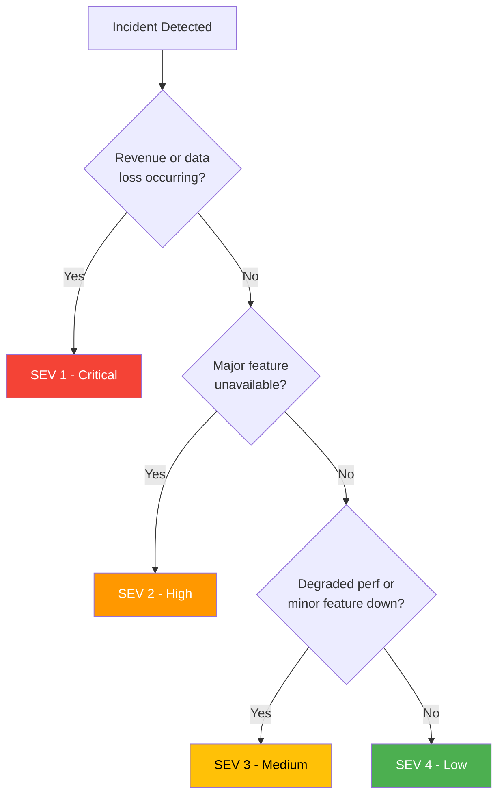
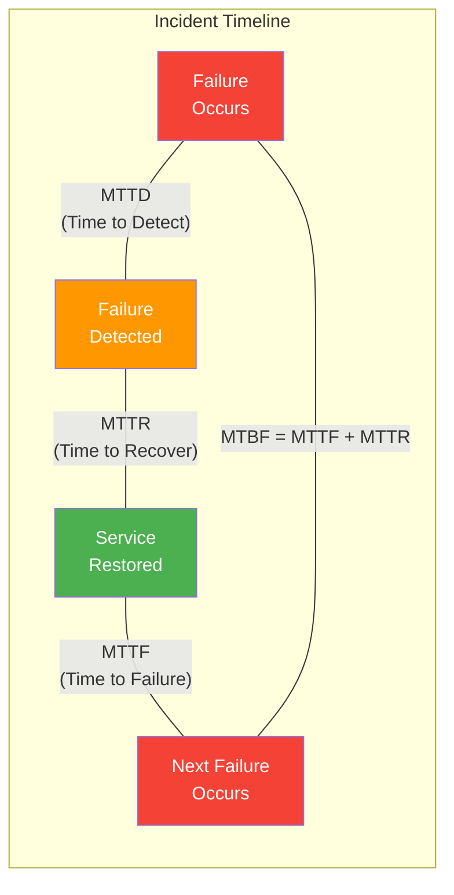

# Incident Handling

## Incident Lifecycle

An incident is any unplanned event that disrupts or degrades a service. Effective incident handling follows a structured lifecycle.

```mermaid
flowchart LR
    D["Detection"]
    T["Triage"]
    R["Response"]
    M["Mitigation"]
    RES["Resolution"]
    PM["Postmortem"]

    D -->|"Alert fires or<br/>user reports"| T
    T -->|"Assign severity<br/>& IC"| R
    R -->|"Diagnose &<br/>contain"| M
    M -->|"Service restored"| RES
    RES -->|"Root cause fixed<br/>permanently"| PM

    style D fill:#f44336,color:#fff
    style T fill:#FF9800,color:#fff
    style R fill:#FFC107,color:#000
    style M fill:#8BC34A,color:#fff
    style RES fill:#4CAF50,color:#fff
    style PM fill:#2196F3,color:#fff
```



### Phase Details

| Phase | Goal | Key Activities | Duration Target |
|-------|------|---------------|-----------------|
| **Detection** | Know something is wrong | Monitoring alerts, user reports, anomaly detection | < 5 minutes |
| **Triage** | Understand scope and severity | Assess impact, assign severity, page IC | < 10 minutes |
| **Response** | Organize the response | Spin up war room, assign roles, communicate | < 15 minutes |
| **Mitigation** | Stop the bleeding | Rollback, failover, scale up, block traffic | < 1 hour (SEV1) |
| **Resolution** | Fully fix the issue | Deploy permanent fix, verify, close incident | Hours to days |
| **Postmortem** | Learn and prevent recurrence | Blameless review, action items, share learnings | Within 5 business days |

## Severity Levels



| Severity | Impact | Response Time | Communication | Example |
|----------|--------|--------------|---------------|---------|
| **SEV 1** | Full outage, data loss, security breach | Page immediately, 24/7 | Exec updates every 30 min, status page | Payment processing down |
| **SEV 2** | Major feature unavailable, significant degradation | Page within 15 min | Stakeholder updates hourly | Search returns no results |
| **SEV 3** | Minor feature degraded, workaround exists | Next business hour | Team notification | Image uploads slow |
| **SEV 4** | Cosmetic issue, minimal impact | Next sprint | Internal tracking | Dashboard chart misaligned |

## Incident Response Roles

| Role | Responsibility | Who |
|------|---------------|-----|
| **Incident Commander (IC)** | Owns the incident end-to-end. Coordinates responders, makes decisions, manages communication | On-call lead or escalated senior engineer |
| **Communications Lead** | Updates status page, stakeholder emails, customer support | Product/engineering manager |
| **Operations Lead** | Hands-on debugging, running commands, deploying fixes | On-call engineer(s) |
| **Scribe** | Documents timeline, decisions, and actions in real-time | Any available team member |
| **Subject Matter Expert** | Deep knowledge of specific system components | Pulled in as needed |

### Incident Commander Responsibilities

```typescript
// Incident Commander checklist (conceptual)
interface IncidentCommanderChecklist {
  triage: string[];
  response: string[];
  mitigation: string[];
  closure: string[];
}

const icChecklist: IncidentCommanderChecklist = {
  triage: [
    'Confirm the incident is real (not a false alarm)',
    'Assess severity level (SEV 1-4)',
    'Declare the incident in Slack (#incidents channel)',
    'Page additional responders if needed',
  ],
  response: [
    'Open a war room (Zoom/Slack huddle)',
    'Assign roles: Ops Lead, Comms Lead, Scribe',
    'Establish communication cadence (every 15-30 min updates)',
    'Create incident ticket with timeline',
  ],
  mitigation: [
    'Coordinate debugging efforts -- avoid duplicate work',
    'Make go/no-go decisions on rollbacks, failovers',
    'Escalate if mitigation is not progressing',
    'Authorize emergency changes (skip normal review process)',
  ],
  closure: [
    'Confirm service is restored and metrics are nominal',
    'Communicate all-clear to stakeholders',
    'Schedule postmortem within 48 hours',
    'Ensure incident doc is complete',
  ],
};
```

## Key Metrics: MTTR, MTTD, MTTF, MTBF



| Metric | Full Name | Formula | What It Tells You | How to Improve |
|--------|-----------|---------|-------------------|----------------|
| **MTTD** | Mean Time to Detect | Avg(detection_time - failure_time) | How fast you spot problems | Better monitoring, anomaly detection |
| **MTTR** | Mean Time to Recovery | Avg(recovery_time - detection_time) | How fast you fix problems | Runbooks, automation, rollback tooling |
| **MTTF** | Mean Time to Failure | Avg(next_failure - last_recovery) | How reliable your system is | Better architecture, testing, chaos eng |
| **MTBF** | Mean Time Between Failures | MTTF + MTTR | Overall reliability cycle | All of the above |

### Tracking Incident Metrics

```typescript
interface IncidentRecord {
  id: string;
  severity: 1 | 2 | 3 | 4;
  failureTimestamp: Date;
  detectedTimestamp: Date;
  mitigatedTimestamp: Date;
  resolvedTimestamp: Date;
  impactedUsers: number;
  rootCause: string;
  actionItems: ActionItem[];
}

interface ActionItem {
  description: string;
  owner: string;
  dueDate: Date;
  priority: 'P0' | 'P1' | 'P2';
  status: 'open' | 'in_progress' | 'done';
}

function calculateMetrics(incident: IncidentRecord) {
  const mttd = incident.detectedTimestamp.getTime()
    - incident.failureTimestamp.getTime();
  const mttr = incident.mitigatedTimestamp.getTime()
    - incident.detectedTimestamp.getTime();
  const totalDuration = incident.mitigatedTimestamp.getTime()
    - incident.failureTimestamp.getTime();

  return {
    mttdMinutes: mttd / 60_000,
    mttrMinutes: mttr / 60_000,
    totalDurationMinutes: totalDuration / 60_000,
    severity: incident.severity,
  };
}

// Example:
// Failure at 14:00, detected at 14:03, mitigated at 14:25
// MTTD = 3 min, MTTR = 22 min, Total = 25 min
```

## On-Call Best Practices

### On-Call Structure

| Aspect | Recommendation |
|--------|---------------|
| **Rotation length** | 1 week; handoff on weekday mornings (not Friday) |
| **Team size** | Minimum 6-8 people per rotation to avoid burnout |
| **Escalation** | Primary -> Secondary -> Team Lead -> Engineering Manager |
| **Response time** | SEV1: 5 min acknowledge, 15 min engage. SEV2: 15 min ack, 30 min engage |
| **Compensation** | On-call stipend + extra comp for off-hours pages |
| **Handoff** | Written handoff doc: active issues, recent deploys, known risks |
| **Load target** | < 2 pages per on-call shift; if more, fix the root causes |

### Escalation Paths

```typescript
interface EscalationPolicy {
  levels: EscalationLevel[];
  autoEscalateAfterMinutes: number;
}

interface EscalationLevel {
  level: number;
  name: string;
  contactMethod: 'slack' | 'phone' | 'sms' | 'page';
  responders: string[];
}

const escalationPolicy: EscalationPolicy = {
  autoEscalateAfterMinutes: 15,
  levels: [
    {
      level: 1,
      name: 'Primary On-Call',
      contactMethod: 'page',
      responders: ['current-primary-oncall'],
    },
    {
      level: 2,
      name: 'Secondary On-Call',
      contactMethod: 'page',
      responders: ['current-secondary-oncall'],
    },
    {
      level: 3,
      name: 'Team Lead',
      contactMethod: 'phone',
      responders: ['team-lead'],
    },
    {
      level: 4,
      name: 'Engineering Manager',
      contactMethod: 'phone',
      responders: ['eng-manager', 'vp-engineering'],
    },
  ],
};
```

## Blameless Postmortems

A blameless postmortem focuses on systemic causes, not individual fault. The goal is to learn and improve, not to assign blame.

### Blameless Culture Principles

1. **Assume good intentions.** People made the best decisions they could with the information they had.
2. **Focus on the system, not the person.** "The deployment pipeline lacked a canary step" not "John deployed without testing."
3. **Ask "how" not "who."** "How did the bad config reach production?" not "Who pushed the bad config?"
4. **Share openly.** Postmortems are shared company-wide to maximize learning.
5. **Follow through on action items.** A postmortem without completed action items is just a document.

### Postmortem Template

```typescript
interface PostmortemDocument {
  title: string;
  date: string;
  severity: number;
  authors: string[];
  status: 'draft' | 'reviewed' | 'complete';

  // Summary
  summary: string;                  // 2-3 sentence overview
  impact: {
    duration: string;               // e.g., "47 minutes"
    usersAffected: number;
    revenueImpact?: string;
    dataLoss?: string;
  };

  // Timeline
  timeline: TimelineEntry[];

  // Analysis
  rootCause: string;
  contributingFactors: string[];
  whatWentWell: string[];
  whatWentPoorly: string[];
  luckyBreaks: string[];            // things that could have been worse

  // Follow-up
  actionItems: ActionItem[];
  lessonsLearned: string[];

  // Appendix
  relatedIncidents?: string[];
  supportingData?: string[];        // links to dashboards, logs
}

interface TimelineEntry {
  timestamp: string;
  event: string;
  actor?: string;                   // system or role, not person name
}

// Example timeline:
const exampleTimeline: TimelineEntry[] = [
  { timestamp: '14:00 UTC', event: 'Deploy v2.3.1 begins rolling out' },
  { timestamp: '14:03 UTC', event: 'Error rate SLI starts climbing (5xx at 2%)' },
  { timestamp: '14:05 UTC', event: 'PagerDuty fires burn rate alert for API availability' },
  { timestamp: '14:07 UTC', event: 'Primary on-call acknowledges and begins investigation' },
  { timestamp: '14:12 UTC', event: 'IC identifies correlation with deployment, initiates rollback' },
  { timestamp: '14:18 UTC', event: 'Rollback complete, error rate returning to baseline' },
  { timestamp: '14:25 UTC', event: 'All metrics nominal, incident declared mitigated' },
];
```

## Incident Communication

### Status Page Updates

| Timing | Update Content |
|--------|---------------|
| **Initial (within 10 min)** | "We are investigating elevated error rates for [service]. Some users may experience [symptoms]." |
| **Every 30 min during SEV1** | "We have identified the cause as [brief description]. Our team is [current action]. ETA for resolution: [estimate or unknown]." |
| **Mitigation** | "The issue has been mitigated. [Service] is operating normally. We are monitoring closely." |
| **Resolution** | "The issue is fully resolved. Root cause was [brief]. We will publish a postmortem within [timeframe]." |

### Internal Communication Template

```typescript
const incidentSlackTemplate = (incident: IncidentRecord) => `
:rotating_light: **INCIDENT DECLARED** :rotating_light:

**Severity:** SEV ${incident.severity}
**Summary:** ${incident.rootCause}
**Impact:** ~${incident.impactedUsers} users affected
**IC:** @incident-commander
**War Room:** #inc-${incident.id}

**Status Updates:**
- Updates every ${incident.severity <= 2 ? '15' : '30'} minutes in this thread
- Status page: status.example.com
`;
```

## Common Incident Anti-Patterns

| Anti-Pattern | Problem | Fix |
|-------------|---------|-----|
| **Hero culture** | One person handles everything; burnout, SPOF | Defined roles, proper rotation |
| **Blame game** | People hide mistakes, less transparency | Blameless postmortems, focus on systems |
| **No postmortem** | Same incidents repeat | Mandatory postmortem for SEV1/2, track action items |
| **Incomplete action items** | Postmortem findings rot | Assign owners, due dates, review in weekly meetings |
| **Over-escalation** | Everything is SEV1 | Clear severity definitions, triage training |
| **Under-escalation** | Major incidents get slow response | Automated severity detection, err on the side of higher severity |
| **War room chaos** | Too many people, no coordination | IC controls the room, roles are assigned |

---

## Interview Q&A

> **Q: Walk me through how you would handle a SEV1 incident as the Incident Commander.**
>
> A: First, I acknowledge the page and confirm the incident is real by checking dashboards and alerts. I declare the incident in our #incidents channel with severity, impact summary, and a war room link. I assign roles: an Ops Lead for hands-on debugging, a Comms Lead for status page and stakeholder updates, and a Scribe for the timeline. I coordinate the investigation by asking the Ops Lead to check recent deployments, dependency health, and error logs. If a recent deploy correlates, I authorize an immediate rollback. I maintain a 15-minute communication cadence. Once mitigated, I confirm metrics are stable, send an all-clear, and schedule a postmortem within 48 hours.

> **Q: What is the difference between mitigation and resolution?**
>
> A: Mitigation means the user-facing impact has stopped -- the bleeding is controlled. For example, rolling back a bad deployment mitigates the incident. Resolution means the underlying root cause is permanently fixed -- for example, fixing the bug that caused the bad deployment, adding a test to catch it, and redeploying. Mitigation can happen in minutes; resolution can take days. You always prioritize mitigation first.

> **Q: How do you run a blameless postmortem?**
>
> A: A blameless postmortem focuses on systemic causes rather than individual blame. I use "how" questions instead of "who" questions: "How did the bad config reach production?" rather than "Who pushed it?" I structure it with: summary, impact, detailed timeline, root cause analysis (often using the Five Whys), contributing factors, what went well, what went poorly, and concrete action items with owners and due dates. The postmortem is shared broadly so other teams learn. The critical part is follow-through on action items -- I track them in our sprint and review completion rates monthly.

> **Q: How do you measure and improve MTTR?**
>
> A: MTTR (Mean Time to Recovery) = average time from detection to mitigation across incidents. To improve it: (1) Reduce detection time with better monitoring and alerting (burn rate alerts, anomaly detection). (2) Reduce diagnosis time with good runbooks, centralized logging, and distributed tracing. (3) Reduce mitigation time with automated rollbacks, feature flags (instant kill switches), and pre-tested failover procedures. (4) Practice incident response through game days. I have seen teams cut MTTR from 45 minutes to under 15 minutes primarily through automated rollback and better runbooks.

> **Q: How do you handle on-call burnout?**
>
> A: On-call burnout comes from too many pages, unclear escalation, or insufficient team size. I address it by: (1) Targeting fewer than 2 pages per on-call shift -- if we exceed this, we treat noisy alerts as bugs to fix. (2) Ensuring the rotation has at least 6-8 people so nobody is on-call more than once every 6-8 weeks. (3) Providing clear escalation paths so the on-call person is not stuck alone. (4) Offering fair compensation: on-call stipend plus additional pay for off-hours incidents. (5) Running postmortems on pages, not just incidents -- every page should be either actionable or eliminated.

> **Q: What makes a good incident timeline?**
>
> A: A good timeline records every significant event with UTC timestamps. It should include: when the failure started (even if detected later), when it was detected, who was paged, what diagnostic steps were taken, when key decisions were made (e.g., "decided to roll back"), when mitigation happened, and when the all-clear was given. Use role names rather than personal names to keep it blameless. Include both human actions and system events. The timeline is the foundation of the postmortem -- without an accurate timeline, root cause analysis is guesswork.
