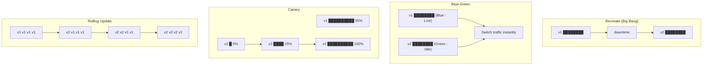
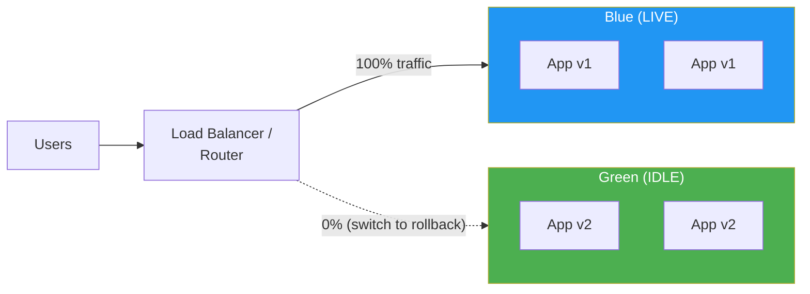
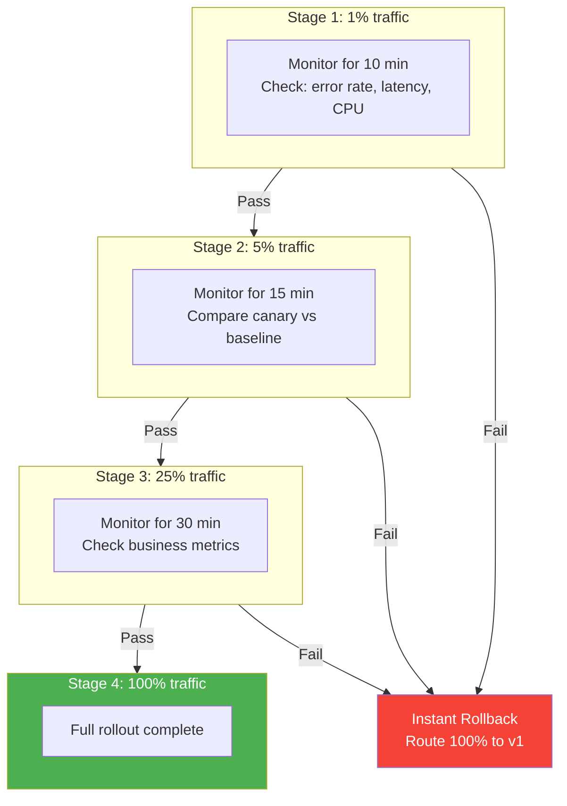
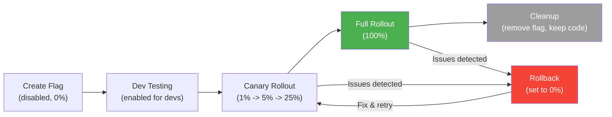
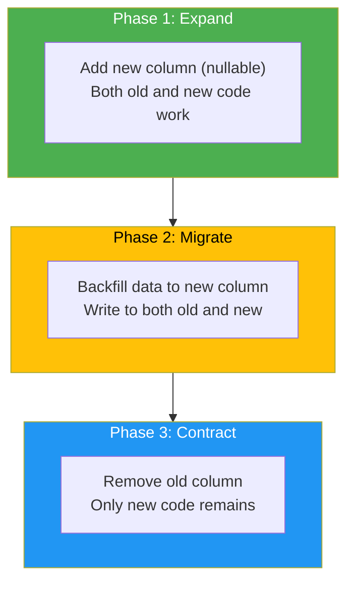

# Rollback Strategies

## Deployment Strategies Overview



## Deployment Strategy Comparison

| Strategy | Downtime | Rollback Speed | Resource Cost | Risk Level | Best For |
|----------|----------|---------------|---------------|------------|----------|
| **Recreate** | Yes (minutes) | Slow (redeploy v1) | 1x | High | Dev/staging only |
| **Rolling Update** | Zero | Medium (roll back pods) | 1x-1.5x | Medium | Stateless services |
| **Blue-Green** | Zero | Instant (switch LB) | 2x | Low | Critical services |
| **Canary** | Zero | Fast (route away) | 1x + small canary | Low | High-traffic services |
| **Shadow / Dark Launch** | Zero | N/A (no user traffic) | 2x | Very Low | New systems, migrations |
| **Feature Flags** | Zero | Instant (toggle off) | 1x | Very Low | Any feature, A/B tests |

## Blue-Green Deployments

In blue-green, two identical production environments exist. Only one (say "blue") serves live traffic. You deploy to the idle environment ("green"), test it, then switch the router.



### Blue-Green Implementation

```typescript
interface BlueGreenConfig {
  blueTargetGroup: string;
  greenTargetGroup: string;
  activeEnvironment: 'blue' | 'green';
  loadBalancerArn: string;
  healthCheckPath: string;
  healthCheckIntervalSeconds: number;
}

async function blueGreenDeploy(config: BlueGreenConfig): Promise<void> {
  const idle = config.activeEnvironment === 'blue' ? 'green' : 'blue';
  const idleTargetGroup = idle === 'blue'
    ? config.blueTargetGroup
    : config.greenTargetGroup;

  // Step 1: Deploy new version to idle environment
  console.log(`Deploying to ${idle} environment...`);
  await deployToTargetGroup(idleTargetGroup);

  // Step 2: Run health checks against idle environment
  console.log(`Running health checks on ${idle}...`);
  const healthy = await waitForHealthy(idleTargetGroup, {
    path: config.healthCheckPath,
    intervalSeconds: config.healthCheckIntervalSeconds,
    maxRetries: 10,
  });

  if (!healthy) {
    throw new Error(`${idle} environment failed health checks. Aborting.`);
  }

  // Step 3: Run smoke tests against idle environment
  console.log(`Running smoke tests on ${idle}...`);
  await runSmokeTests(idleTargetGroup);

  // Step 4: Switch traffic
  console.log(`Switching traffic from ${config.activeEnvironment} to ${idle}...`);
  await switchTraffic(config.loadBalancerArn, idleTargetGroup);

  // Step 5: Monitor for a few minutes
  console.log('Monitoring error rates for 5 minutes...');
  const stable = await monitorErrorRate({ durationMinutes: 5, threshold: 0.01 });

  if (!stable) {
    // Step 6: Rollback -- switch traffic back
    console.log('Error rate elevated! Rolling back...');
    const activeTargetGroup = config.activeEnvironment === 'blue'
      ? config.blueTargetGroup
      : config.greenTargetGroup;
    await switchTraffic(config.loadBalancerArn, activeTargetGroup);
    throw new Error('Deployment rolled back due to elevated error rate');
  }

  console.log('Blue-green deployment successful!');
}

// Rollback is just switching the load balancer back -- instant
async function blueGreenRollback(config: BlueGreenConfig): Promise<void> {
  const previousTargetGroup = config.activeEnvironment === 'blue'
    ? config.blueTargetGroup
    : config.greenTargetGroup;

  await switchTraffic(config.loadBalancerArn, previousTargetGroup);
  console.log(`Rolled back to ${config.activeEnvironment} environment`);
}
```

## Canary Deployments

Deploy the new version to a small subset of instances, gradually increasing traffic as confidence grows.



### Canary Analysis

```typescript
interface CanaryConfig {
  stages: CanaryStage[];
  baselineVersion: string;
  canaryVersion: string;
  autoPromote: boolean;
  rollbackOnFailure: boolean;
}

interface CanaryStage {
  name: string;
  trafficPercent: number;
  durationMinutes: number;
  successCriteria: CanaryCriteria;
}

interface CanaryCriteria {
  maxErrorRatePercent: number;
  maxLatencyP99Ms: number;
  maxLatencyP50Ms: number;
  customMetrics?: { name: string; threshold: number; comparator: 'lt' | 'gt' }[];
}

const canaryConfig: CanaryConfig = {
  baselineVersion: 'v2.3.0',
  canaryVersion: 'v2.4.0',
  autoPromote: true,
  rollbackOnFailure: true,
  stages: [
    {
      name: 'Canary 1%',
      trafficPercent: 1,
      durationMinutes: 10,
      successCriteria: {
        maxErrorRatePercent: 1.0,
        maxLatencyP99Ms: 500,
        maxLatencyP50Ms: 100,
      },
    },
    {
      name: 'Canary 5%',
      trafficPercent: 5,
      durationMinutes: 15,
      successCriteria: {
        maxErrorRatePercent: 0.5,
        maxLatencyP99Ms: 400,
        maxLatencyP50Ms: 80,
      },
    },
    {
      name: 'Canary 25%',
      trafficPercent: 25,
      durationMinutes: 30,
      successCriteria: {
        maxErrorRatePercent: 0.5,
        maxLatencyP99Ms: 400,
        maxLatencyP50Ms: 80,
        customMetrics: [
          { name: 'conversion_rate', threshold: 0.95, comparator: 'gt' },
        ],
      },
    },
    {
      name: 'Full Rollout',
      trafficPercent: 100,
      durationMinutes: 0,
      successCriteria: {
        maxErrorRatePercent: 0.5,
        maxLatencyP99Ms: 400,
        maxLatencyP50Ms: 80,
      },
    },
  ],
};

async function runCanaryAnalysis(
  stage: CanaryStage,
  canaryMetrics: MetricsSnapshot,
  baselineMetrics: MetricsSnapshot,
): Promise<'pass' | 'fail'> {
  const criteria = stage.successCriteria;

  // Compare canary error rate against threshold
  if (canaryMetrics.errorRatePercent > criteria.maxErrorRatePercent) {
    console.log(`FAIL: Error rate ${canaryMetrics.errorRatePercent}% > ${criteria.maxErrorRatePercent}%`);
    return 'fail';
  }

  // Compare canary latency against threshold
  if (canaryMetrics.latencyP99Ms > criteria.maxLatencyP99Ms) {
    console.log(`FAIL: P99 latency ${canaryMetrics.latencyP99Ms}ms > ${criteria.maxLatencyP99Ms}ms`);
    return 'fail';
  }

  // Compare canary against baseline (relative comparison)
  const latencyDegradation = canaryMetrics.latencyP50Ms / baselineMetrics.latencyP50Ms;
  if (latencyDegradation > 1.1) { // more than 10% degradation
    console.log(`FAIL: P50 latency degraded by ${((latencyDegradation - 1) * 100).toFixed(1)}%`);
    return 'fail';
  }

  return 'pass';
}

interface MetricsSnapshot {
  errorRatePercent: number;
  latencyP50Ms: number;
  latencyP99Ms: number;
  requestsPerSecond: number;
}
```

## Feature Flags

Feature flags decouple deployment from release. Code is deployed but functionality is toggled on/off independently.

### Feature Flag Types

| Type | Purpose | Lifetime | Example |
|------|---------|----------|---------|
| **Release flag** | Gate incomplete features | Short (days-weeks) | `new_checkout_flow` |
| **Experiment flag** | A/B testing | Medium (weeks) | `pricing_page_variant_b` |
| **Ops flag** | Operational control / kill switch | Long (permanent) | `enable_expensive_query` |
| **Permission flag** | User-level access control | Long | `beta_features_enabled` |

### Feature Flag Implementation

```typescript
interface FeatureFlag {
  key: string;
  type: 'release' | 'experiment' | 'ops' | 'permission';
  enabled: boolean;
  rolloutPercentage: number;  // 0-100
  targeting?: TargetingRule[];
  createdAt: Date;
  owner: string;
  expiresAt?: Date;           // enforce cleanup
}

interface TargetingRule {
  attribute: string;       // e.g., 'userId', 'region', 'plan'
  operator: 'in' | 'not_in' | 'equals' | 'percentage';
  values: string[];
}

class FeatureFlagService {
  private flags: Map<string, FeatureFlag>;
  private cache: Map<string, boolean>;

  constructor(private flagProvider: FlagProvider) {
    this.flags = new Map();
    this.cache = new Map();
  }

  async isEnabled(
    flagKey: string,
    context: { userId: string; attributes?: Record<string, string> },
  ): Promise<boolean> {
    const flag = await this.flagProvider.getFlag(flagKey);
    if (!flag) return false;

    // Global kill switch
    if (!flag.enabled) return false;

    // Check targeting rules
    if (flag.targeting && flag.targeting.length > 0) {
      for (const rule of flag.targeting) {
        if (!this.evaluateRule(rule, context)) {
          return false;
        }
      }
    }

    // Percentage rollout (consistent hashing by userId)
    if (flag.rolloutPercentage < 100) {
      const hash = this.hashUserForFlag(context.userId, flagKey);
      return hash < flag.rolloutPercentage;
    }

    return true;
  }

  // Consistent hashing ensures same user always gets same result
  private hashUserForFlag(userId: string, flagKey: string): number {
    const combined = `${userId}:${flagKey}`;
    let hash = 0;
    for (let i = 0; i < combined.length; i++) {
      const char = combined.charCodeAt(i);
      hash = ((hash << 5) - hash) + char;
      hash = hash & hash; // Convert to 32-bit integer
    }
    return Math.abs(hash) % 100;
  }

  private evaluateRule(
    rule: TargetingRule,
    context: { userId: string; attributes?: Record<string, string> },
  ): boolean {
    const value = context.attributes?.[rule.attribute] ?? context.userId;
    switch (rule.operator) {
      case 'in': return rule.values.includes(value);
      case 'not_in': return !rule.values.includes(value);
      case 'equals': return value === rule.values[0];
      default: return true;
    }
  }
}

// Usage as a kill switch for instant rollback:
async function handleRequest(req: Request): Promise<Response> {
  const flags = new FeatureFlagService(provider);

  if (await flags.isEnabled('new_recommendation_engine', { userId: req.userId })) {
    return newRecommendationEngine(req);
  }
  return legacyRecommendationEngine(req);
}

// "Rollback" = toggle flag off. Takes effect in seconds, no deployment needed.
```

### Feature Flag Lifecycle



**Critical rule: Feature flags must have expiration dates.** Stale flags accumulate as technical debt. Set a policy:
- Release flags: remove within 2 weeks of full rollout
- Experiment flags: remove within 1 week of experiment conclusion
- Ops flags: review quarterly

## Database Migration Rollbacks

Database rollbacks are the hardest kind because data changes are not easily reversible. The key pattern is **expand-contract** (also called parallel change).

### The Expand-Contract Pattern



### Expand-Contract Example: Renaming a Column

```typescript
// Goal: Rename column "name" to "full_name" in users table
// WRONG: ALTER TABLE users RENAME COLUMN name TO full_name;
// This breaks all existing code instantly.

// RIGHT: Expand-Contract pattern

// Phase 1: EXPAND - Add new column
// Migration 001_add_full_name.ts
export async function up(db: Database): Promise<void> {
  await db.query(`
    ALTER TABLE users ADD COLUMN full_name VARCHAR(255);
  `);
  // Column is nullable -- old code still works, new column is just ignored
}

export async function down(db: Database): Promise<void> {
  await db.query(`ALTER TABLE users DROP COLUMN full_name;`);
}

// Deploy: Update application to WRITE to both columns
class UserRepository {
  async createUser(data: CreateUserInput): Promise<User> {
    return this.db.query(`
      INSERT INTO users (name, full_name, email)
      VALUES ($1, $1, $2)
    `, [data.fullName, data.email]);
    // Writes to BOTH name and full_name
  }

  async getUser(id: string): Promise<User> {
    const row = await this.db.query(
      'SELECT COALESCE(full_name, name) as full_name, email FROM users WHERE id = $1',
      [id],
    );
    // Reads from full_name, falls back to name
    return row;
  }
}

// Phase 2: MIGRATE - Backfill existing data
// Migration 002_backfill_full_name.ts
export async function up(db: Database): Promise<void> {
  // Backfill in batches to avoid locking the table
  let lastId = '';
  while (true) {
    const result = await db.query(`
      UPDATE users
      SET full_name = name
      WHERE full_name IS NULL AND id > $1
      ORDER BY id
      LIMIT 1000
    `, [lastId]);

    if (result.rowCount === 0) break;
    lastId = result.rows[result.rows.length - 1].id;

    // Yield to other queries
    await new Promise(resolve => setTimeout(resolve, 100));
  }
}

// Phase 3: CONTRACT - Remove old column (only after ALL code reads from full_name)
// Migration 003_drop_name_column.ts
export async function up(db: Database): Promise<void> {
  await db.query(`ALTER TABLE users DROP COLUMN name;`);
}

export async function down(db: Database): Promise<void> {
  await db.query(`ALTER TABLE users ADD COLUMN name VARCHAR(255);`);
  await db.query(`UPDATE users SET name = full_name;`);
}
```

### Database Rollback Strategies

| Strategy | When to Use | Risk | Rollback Mechanism |
|----------|------------|------|-------------------|
| **Expand-Contract** | Schema changes (add/rename/remove columns) | Low | Each phase is independently reversible |
| **Dual-write** | Migrating between databases | Medium | Stop writing to new DB, fall back to old |
| **Feature flag on reads** | Switching data sources | Low | Toggle flag to read from old source |
| **Point-in-time recovery** | Catastrophic data corruption | High (data loss possible) | Restore DB to timestamp before corruption |
| **Logical replication** | Major schema overhauls | Medium | Stop replication, keep old DB |

### Dangerous Migration Patterns to Avoid

| Operation | Risk | Safe Alternative |
|-----------|------|-----------------|
| `DROP COLUMN` (before code is updated) | Breaks running code | Expand-contract: deploy code first, then drop |
| `RENAME COLUMN` | Breaks all queries referencing old name | Add new column, migrate data, drop old |
| `ALTER COLUMN SET NOT NULL` | Fails if any NULL exists | Backfill first, then add constraint |
| `ADD COLUMN WITH DEFAULT` (large table) | Table lock on some DBs (not Postgres 11+) | Add nullable column, then backfill |
| `CREATE INDEX` (without CONCURRENTLY) | Table lock during index build | Use `CREATE INDEX CONCURRENTLY` |

## Rollback Decision Framework

```mermaid
flowchart TD
    ISSUE["Issue Detected<br/>Post-Deploy"]
    Q1{"Is it a<br/>data corruption<br/>issue?"}
    Q2{"Was a DB<br/>migration part of<br/>the deploy?"}
    Q3{"Is the issue<br/>behind a<br/>feature flag?"}
    Q4{"Is the previous<br/>version still<br/>available?"}

    ISSUE --> Q1
    Q1 -->|Yes| PITR["Point-in-Time Recovery<br/>+ Code Rollback"]
    Q1 -->|No| Q2
    Q2 -->|Yes, destructive| FORWARD["Fix Forward<br/>(new migration to undo)"]
    Q2 -->|No / additive only| Q3
    Q3 -->|Yes| FLAG["Toggle Feature Flag Off<br/>(instant rollback)"]
    Q3 -->|No| Q4
    Q4 -->|Yes (blue-green)| SWITCH["Switch to Previous<br/>Environment"]
    Q4 -->|Rolling deploy| REDEPLOY["Redeploy Previous<br/>Version"]

    style PITR fill:#f44336,color:#fff
    style FORWARD fill:#FF9800,color:#fff
    style FLAG fill:#4CAF50,color:#fff
    style SWITCH fill:#2196F3,color:#fff
    style REDEPLOY fill:#FFC107,color:#000
```

---

## Interview Q&A

> **Q: When would you choose canary over blue-green deployment?**
>
> A: I choose canary when I want to gradually validate a change with real production traffic and have fine-grained rollout control (1% -> 5% -> 25% -> 100%). This is ideal for high-traffic services where even a brief full-traffic switch could impact millions of users. I choose blue-green when I want instant, atomic switches with zero risk of partial rollout states. Blue-green is simpler but costs 2x infrastructure. For a critical payment service, I might use both: blue-green for the infrastructure switch, with canary logic at the routing layer.

> **Q: How do you handle database rollbacks when a migration has already run?**
>
> A: It depends on whether the migration was destructive. If it was additive (added a column, created an index), I can simply roll back the application code -- the extra column does not break the old version. If it was destructive (dropped a column, changed a type), I need to "fix forward" with a new migration that reverses the change. For the safest approach, I use the expand-contract pattern: every schema change is broken into additive steps that are each independently reversible. I never drop columns or rename columns in the same deployment as the code change.

> **Q: What is the expand-contract pattern and why is it important?**
>
> A: Expand-contract (also called parallel change) breaks a breaking schema change into three safe phases: (1) Expand -- add the new structure alongside the old (e.g., add a new column). (2) Migrate -- backfill data and update code to use both old and new structures. (3) Contract -- remove the old structure once all code and consumers have switched. Each phase is independently deployable and reversible. It is important because it enables zero-downtime schema evolution, which is mandatory for services that cannot afford deployment windows.

> **Q: How do feature flags help with rollbacks?**
>
> A: Feature flags decouple deployment from release. The new code is deployed to all servers but hidden behind a flag. If something goes wrong, I toggle the flag off and traffic instantly flows through the old code path -- no redeployment needed. This gives sub-second rollback time. Feature flags also enable gradual rollouts (1% -> 5% -> 100%), A/B testing, and targeted rollouts to specific user segments. The tradeoff is technical debt: stale flags accumulate, so you need a lifecycle policy with expiration dates and regular cleanup.

> **Q: You deploy a change and 5 minutes later error rates spike. Walk me through your rollback decision.**
>
> A: First, I check if the deployment is behind a feature flag -- if yes, I toggle it off immediately for instant rollback. If not, I check if the deployment included a database migration. If the migration was additive only (added a column), I can safely roll back the application to the previous version. If the migration was destructive, I cannot simply roll back -- I need to assess whether to fix forward. If there is no migration involved, I trigger an immediate rollback: for blue-green, switch the load balancer back; for rolling deployments, redeploy the previous version. Throughout this, I am monitoring the error rate to confirm the rollback is working. The whole decision should take under 2 minutes.

> **Q: What are the risks of feature flag sprawl and how do you manage it?**
>
> A: Feature flag sprawl creates several problems: (1) combinatorial complexity -- 10 flags means 1024 possible states, most of which are never tested, (2) dead code paths that nobody removes, (3) performance overhead from flag evaluation, (4) confusion about which flags are active. I manage it by: giving every flag an owner and an expiration date, running automated alerts when flags exceed their expiration, tracking flag count as a team metric, including flag cleanup in the definition of "done" for a feature, and conducting quarterly reviews to remove stale flags.
