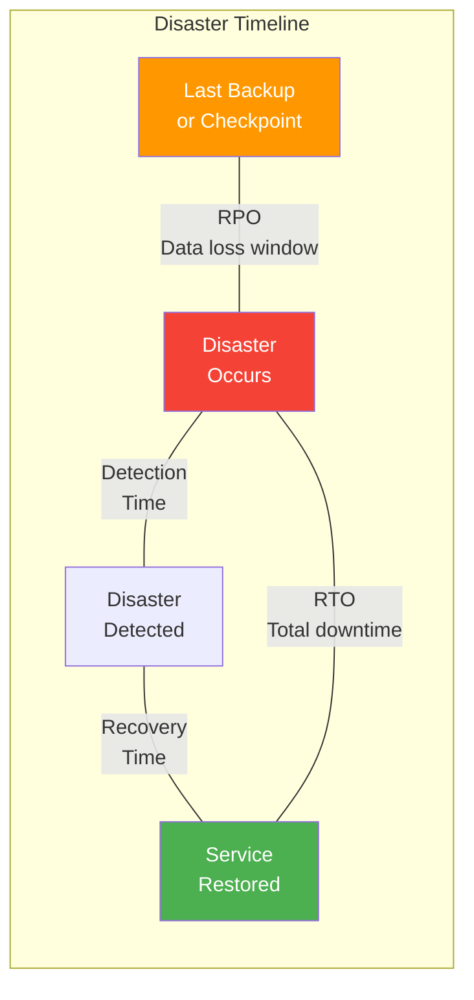
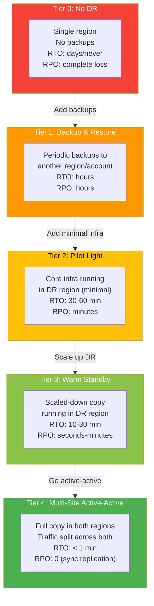
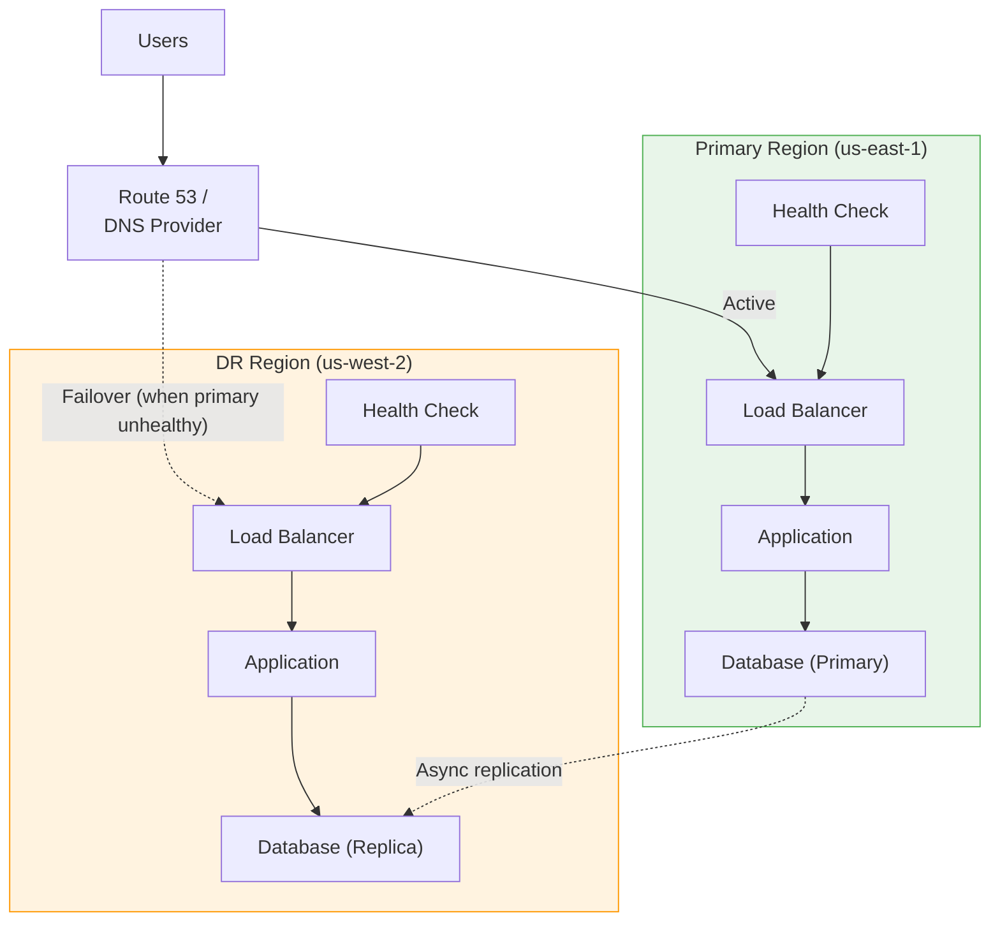

# Disaster Recovery

## Core Concepts: RPO and RTO

**RPO (Recovery Point Objective):** The maximum acceptable amount of data loss measured in time. "How much data can we afford to lose?"

**RTO (Recovery Time Objective):** The maximum acceptable time to restore service after a disaster. "How long can we be down?"



### RPO/RTO Tradeoffs

| RPO | What It Means | How to Achieve | Cost |
|-----|--------------|----------------|------|
| 0 (zero data loss) | No transactions lost | Synchronous replication | Very High |
| < 1 minute | Near-zero loss | Async replication with short lag | High |
| < 1 hour | Lose up to 1 hour of data | Frequent automated backups | Medium |
| < 24 hours | Lose up to a day of data | Daily backups | Low |
| > 24 hours | Acceptable for non-critical data | Weekly/manual backups | Very Low |

| RTO | What It Means | How to Achieve | Cost |
|-----|--------------|----------------|------|
| < 1 minute | Near-instant failover | Hot standby, active-active | Very High |
| < 15 minutes | Quick automated recovery | Warm standby with automation | High |
| < 4 hours | Managed recovery process | Cold standby with scripts | Medium |
| < 24 hours | Rebuild from backups | Backups + infrastructure-as-code | Low |
| > 24 hours | Manual recovery | Tape backups, manual rebuild | Very Low |

## DR Tiers (Disaster Recovery Tiers)



### DR Tier Comparison

| Aspect | Backup & Restore | Pilot Light | Warm Standby | Active-Active |
|--------|-----------------|-------------|--------------|---------------|
| **RTO** | Hours | 30-60 min | 10-30 min | < 1 min |
| **RPO** | Hours (backup frequency) | Minutes | Seconds | Near-zero |
| **DR Region Cost** | Storage only | ~10% of production | ~30-50% of production | ~100% of production |
| **Complexity** | Low | Medium | High | Very High |
| **Failover** | Manual restore | Scale up + switch DNS | Scale up + switch traffic | Automatic |
| **Data Sync** | Periodic backup copy | Async replication | Async replication | Sync replication |
| **Best For** | Non-critical systems | Business applications | Customer-facing services | Mission-critical systems |

## Backup Strategies

### The 3-2-1 Rule

- **3** copies of data (1 primary + 2 backups)
- **2** different storage types (e.g., EBS + S3)
- **1** copy offsite (different region or cloud provider)

### Backup Types

| Type | What It Backs Up | Speed | Storage | Restore Speed |
|------|-----------------|-------|---------|--------------|
| **Full** | Everything | Slowest | Highest | Fastest |
| **Incremental** | Changes since last backup (any type) | Fastest | Lowest | Slowest (chain) |
| **Differential** | Changes since last full backup | Medium | Medium | Medium |
| **Continuous (WAL/CDC)** | Every transaction as it happens | Real-time | Variable | Fastest (PITR) |

```typescript
interface BackupConfig {
  database: string;
  schedule: BackupSchedule;
  retention: RetentionPolicy;
  destinations: BackupDestination[];
  encryption: boolean;
  testingSchedule: string;     // e.g., "monthly"
}

interface BackupSchedule {
  full: string;        // e.g., "weekly on Sunday at 02:00 UTC"
  incremental: string; // e.g., "every 6 hours"
  wal: boolean;        // continuous WAL archiving
}

interface RetentionPolicy {
  dailyBackups: number;   // keep N daily backups
  weeklyBackups: number;  // keep N weekly backups
  monthlyBackups: number; // keep N monthly backups
  walRetentionDays: number;
}

interface BackupDestination {
  type: 's3' | 'gcs' | 'azure_blob';
  bucket: string;
  region: string;       // different from primary!
  crossAccount: boolean; // for ransomware protection
}

const productionBackup: BackupConfig = {
  database: 'orders-db',
  schedule: {
    full: 'weekly on Sunday at 02:00 UTC',
    incremental: 'every 6 hours',
    wal: true, // continuous WAL archiving for PITR
  },
  retention: {
    dailyBackups: 7,
    weeklyBackups: 4,
    monthlyBackups: 12,
    walRetentionDays: 7,
  },
  destinations: [
    {
      type: 's3',
      bucket: 'backups-primary',
      region: 'us-east-1',
      crossAccount: false,
    },
    {
      type: 's3',
      bucket: 'backups-dr',
      region: 'us-west-2',      // different region
      crossAccount: true,       // different AWS account (ransomware protection)
    },
  ],
  encryption: true,
  testingSchedule: 'monthly',
};
```

## Hot / Warm / Cold Standby

### Hot Standby

A fully running copy of the production system that receives real-time replicated data. Failover is near-instant.

```typescript
interface HotStandbyConfig {
  primaryRegion: string;
  standbyRegion: string;
  replication: 'synchronous' | 'asynchronous';
  databases: {
    name: string;
    primaryEndpoint: string;
    replicaEndpoint: string;
    replicationLagThresholdMs: number;
  }[];
  healthCheck: {
    intervalSeconds: number;
    failureThreshold: number;  // consecutive failures before failover
  };
  autoFailover: boolean;
}

const hotStandby: HotStandbyConfig = {
  primaryRegion: 'us-east-1',
  standbyRegion: 'us-west-2',
  replication: 'asynchronous', // sync is too slow cross-region
  databases: [
    {
      name: 'orders-db',
      primaryEndpoint: 'orders-primary.us-east-1.rds.amazonaws.com',
      replicaEndpoint: 'orders-replica.us-west-2.rds.amazonaws.com',
      replicationLagThresholdMs: 1000, // alert if lag > 1 second
    },
  ],
  healthCheck: {
    intervalSeconds: 10,
    failureThreshold: 3,  // 30 seconds of failures triggers failover
  },
  autoFailover: true,
};
```

### Warm Standby

A scaled-down version of the production environment running in the DR region. On failover, it scales up to full capacity.

```typescript
interface WarmStandbyConfig {
  primaryRegion: string;
  drRegion: string;
  services: {
    name: string;
    primaryInstances: number;
    drInstances: number;       // scaled down
    scaleUpTarget: number;     // scale to this on failover
    scaleUpTimeMinutes: number;
  }[];
}

const warmStandby: WarmStandbyConfig = {
  primaryRegion: 'us-east-1',
  drRegion: 'eu-west-1',
  services: [
    {
      name: 'api-service',
      primaryInstances: 20,
      drInstances: 2,          // 10% capacity -- enough to stay warm
      scaleUpTarget: 20,
      scaleUpTimeMinutes: 10,
    },
    {
      name: 'worker-service',
      primaryInstances: 10,
      drInstances: 1,
      scaleUpTarget: 10,
      scaleUpTimeMinutes: 15,
    },
  ],
};
```

### Cold Standby

Infrastructure definitions exist (IaC) but nothing is running. On failover, everything must be provisioned from scratch.

| Aspect | Hot | Warm | Cold |
|--------|-----|------|------|
| **Running in DR** | Full capacity | Reduced capacity | Nothing |
| **Data replication** | Real-time | Real-time or near-real-time | Periodic backup restore |
| **Failover time** | Seconds to minutes | 10-30 minutes | Hours |
| **Cost** | ~100% of prod | ~30-50% of prod | Storage + IaC only |
| **When to use** | Mission-critical, financial | Important customer-facing | Internal tools, dev/staging |

## Failover Automation

### DNS-Based Failover



### Failover Procedure

```typescript
interface FailoverPlan {
  name: string;
  trigger: 'automatic' | 'manual';
  preChecks: FailoverCheck[];
  steps: FailoverStep[];
  postChecks: FailoverCheck[];
  rollbackPlan: FailoverStep[];
}

interface FailoverStep {
  order: number;
  action: string;
  command?: string;
  timeoutMinutes: number;
  rollbackCommand?: string;
}

interface FailoverCheck {
  name: string;
  check: string;
  expectedResult: string;
}

const failoverPlan: FailoverPlan = {
  name: 'us-east-1 to us-west-2 failover',
  trigger: 'manual', // automatic for health-check-based, manual for region failure
  preChecks: [
    {
      name: 'DR database replication lag',
      check: 'SELECT pg_last_wal_replay_lsn() - pg_last_wal_receive_lsn()',
      expectedResult: 'lag < 1 second',
    },
    {
      name: 'DR application health',
      check: 'curl -f https://dr-internal.example.com/health',
      expectedResult: 'HTTP 200',
    },
    {
      name: 'DR capacity',
      check: 'aws autoscaling describe-auto-scaling-groups --region us-west-2',
      expectedResult: 'desired capacity >= minimum for failover traffic',
    },
  ],
  steps: [
    {
      order: 1,
      action: 'Promote DR database from replica to primary',
      command: 'aws rds promote-read-replica --db-instance-identifier orders-dr',
      timeoutMinutes: 10,
      rollbackCommand: 'Manual: re-establish replication from us-east-1',
    },
    {
      order: 2,
      action: 'Scale up DR application instances',
      command: 'aws autoscaling update-auto-scaling-group --desired-capacity 20',
      timeoutMinutes: 10,
    },
    {
      order: 3,
      action: 'Update DNS to point to DR region',
      command: 'aws route53 change-resource-record-sets --hosted-zone-id Z123 --change-batch ...',
      timeoutMinutes: 5,
    },
    {
      order: 4,
      action: 'Invalidate CDN cache',
      command: 'aws cloudfront create-invalidation --distribution-id E123 --paths "/*"',
      timeoutMinutes: 15,
    },
  ],
  postChecks: [
    {
      name: 'DNS propagation',
      check: 'dig api.example.com',
      expectedResult: 'Points to us-west-2 load balancer IP',
    },
    {
      name: 'End-to-end health check',
      check: 'curl -f https://api.example.com/health',
      expectedResult: 'HTTP 200 from us-west-2',
    },
    {
      name: 'Error rate',
      check: 'Check Datadog dashboard',
      expectedResult: 'Error rate < 1%',
    },
  ],
  rollbackPlan: [
    {
      order: 1,
      action: 'Switch DNS back to primary region',
      command: 'aws route53 change-resource-record-sets ...',
      timeoutMinutes: 5,
    },
  ],
};
```

## AWS Multi-Region Patterns

### Pattern 1: Active-Passive with Route 53 Failover

```typescript
// CloudFormation / CDK conceptual config
const activePassiveConfig = {
  primaryRegion: 'us-east-1',
  drRegion: 'us-west-2',
  dns: {
    type: 'Route53',
    routingPolicy: 'failover',
    healthCheck: {
      type: 'HTTPS',
      resourcePath: '/health',
      failureThreshold: 3,
      requestInterval: 10,
    },
  },
  database: {
    type: 'RDS',
    multiAZ: true,                    // HA within region
    crossRegionReadReplica: true,     // DR to another region
    replicationType: 'asynchronous',
  },
  storage: {
    type: 'S3',
    crossRegionReplication: true,
    versioningEnabled: true,
  },
  cache: {
    type: 'ElastiCache',
    globalDatastore: true,            // Redis Global Datastore
  },
};
```

### Pattern 2: Active-Active with DynamoDB Global Tables

```typescript
const activeActiveConfig = {
  regions: ['us-east-1', 'eu-west-1'],
  database: {
    type: 'DynamoDB',
    globalTables: true,               // multi-region, multi-active
    conflictResolution: 'last-writer-wins',
  },
  dns: {
    type: 'Route53',
    routingPolicy: 'latency-based',   // route to nearest region
    healthCheck: true,                // failover to other region if unhealthy
  },
  // Challenges:
  // - Write conflicts (last-writer-wins may lose data)
  // - Eventual consistency between regions
  // - Application must be designed for idempotency
};
```

### Multi-Region Data Considerations

| Challenge | Solution |
|-----------|----------|
| Write conflicts in active-active | Last-writer-wins, CRDTs, or conflict-free design |
| Replication lag | Measure and alert on lag; design for eventual consistency |
| Data sovereignty (GDPR) | Keep EU user data in EU region; partition by geography |
| Cross-region latency | Place data close to users; use caching aggressively |
| Failback after DR event | Re-establish replication, backfill missed writes |
| Split-brain | Use distributed consensus (Raft/Paxos) or accept inconsistency |

## Testing DR Plans

A DR plan that is not tested is a DR plan that does not work.

| Test Type | What It Tests | Frequency | Impact |
|-----------|--------------|-----------|--------|
| **Tabletop exercise** | Walkthrough of the plan with stakeholders | Quarterly | None |
| **Backup restore test** | Can we actually restore from backups? | Monthly | None |
| **Component failover** | Failover a single component (DB, cache) | Monthly | Minimal |
| **Full regional failover** | Complete DR region activation | Semi-annually | Significant |
| **Chaos engineering** | Random failures in production | Continuous | Controlled |

```typescript
interface DRTestPlan {
  name: string;
  type: 'tabletop' | 'backup_restore' | 'component_failover' | 'full_failover';
  frequency: string;
  participants: string[];
  scope: string;
  successCriteria: string[];
  rollbackPlan: string;
  scheduledDate: string;
}

const quarterlyDRTest: DRTestPlan = {
  name: 'Q1 2026 Full Failover Test',
  type: 'full_failover',
  frequency: 'semi-annual',
  participants: [
    'SRE Team',
    'Database Team',
    'Platform Team',
    'VP Engineering (observer)',
  ],
  scope: 'Failover all production services from us-east-1 to us-west-2',
  successCriteria: [
    'RTO met: full service restored in DR region within 15 minutes',
    'RPO met: data loss is less than 1 minute of transactions',
    'All health checks pass in DR region',
    'Error rate below 1% after failover stabilizes',
    'Failback to primary region successful within 30 minutes',
  ],
  rollbackPlan: 'Switch DNS back to us-east-1 if DR region fails to stabilize',
  scheduledDate: '2026-03-15T06:00:00Z', // Low-traffic window
};
```

## Common Pitfalls

| Pitfall | Consequence | Prevention |
|---------|------------|------------|
| Never testing backups | Discover backup is corrupt during real disaster | Monthly restore tests |
| Untested failover automation | Scripts fail under real conditions | Quarterly failover drills |
| Ignoring replication lag | Data loss exceeds RPO | Monitor lag, alert on threshold |
| No runbook for failover | Panic and slow recovery during disaster | Written, tested runbook |
| DR region under-provisioned | DR cannot handle production load | Capacity test during DR drills |
| Ignoring dependencies | App fails because dependent service is not in DR | Map all dependencies in DR plan |
| Same account for DR | Ransomware/compromise destroys DR too | Cross-account DR backups |

---

## Interview Q&A

> **Q: Explain the difference between RPO and RTO. Give an example.**
>
> A: RPO (Recovery Point Objective) defines how much data you can afford to lose, measured in time. RTO (Recovery Time Objective) defines how long you can afford to be down. For example, an e-commerce order database might have RPO = 0 (cannot lose any orders) and RTO = 15 minutes (can tolerate 15 minutes of downtime). A marketing analytics database might have RPO = 24 hours and RTO = 4 hours -- losing a day of analytics data is acceptable, and being down for a few hours is tolerable.

> **Q: Describe the difference between hot, warm, and cold standby.**
>
> A: Hot standby runs a full copy of production in the DR region with real-time data replication -- failover is near-instant but costs ~100% of production. Warm standby runs a scaled-down version in DR with real-time replication -- failover requires scaling up, taking 10-30 minutes, at ~30-50% cost. Cold standby has no running infrastructure -- just backups and IaC templates. Failover means provisioning everything from scratch, taking hours, but costs only storage. The choice depends on business requirements: financial systems need hot standby, most SaaS can use warm, and internal tools can use cold.

> **Q: How would you design a multi-region active-active architecture?**
>
> A: Active-active means both regions serve live traffic simultaneously. I would use Route 53 with latency-based routing to send users to the nearest region. For data, DynamoDB Global Tables or CockroachDB provide multi-region writes with built-in conflict resolution. The application must be designed for eventual consistency -- reads may see slightly stale data from the other region. Write conflicts need a strategy: last-writer-wins for simple cases, or CRDTs for conflict-free operations. The biggest challenges are cross-region latency for consistency, data sovereignty compliance, and testing failure modes. I would start with active-passive and only move to active-active when the business justifies the 2x+ cost and complexity.

> **Q: How do you test your disaster recovery plan?**
>
> A: I use a layered approach with increasing realism. Monthly: test that backups can be restored (actually restore to a test environment and verify data integrity). Monthly: test individual component failovers (promote a database replica, failover a cache). Quarterly: tabletop exercises where the team walks through the full DR plan, identifying gaps. Semi-annually: full regional failover test during a low-traffic window. The most important thing is to actually test -- a DR plan that has never been tested is a DR plan that does not work. After each test, we document what broke and fix it before the next test.

> **Q: A ransomware attack encrypts all data in your primary region. How do you recover?**
>
> A: The key defense is cross-account, cross-region backups that the attacker cannot reach. My recovery plan: (1) Isolate the compromised environment -- revoke all access, disable network connectivity. (2) Identify the blast radius -- what accounts, regions, and services are affected? (3) Restore from clean backups in a separate, uncompromised account. Use point-in-time recovery to restore to just before the attack. (4) Verify data integrity after restore. (5) Stand up the application in the clean environment using IaC. (6) Switch DNS once verified. This only works if backups are in a separate account with different credentials and immutable storage (S3 Object Lock). If backups are in the same account, the attacker likely encrypted those too.

> **Q: What is split-brain and how do you prevent it in a multi-region setup?**
>
> A: Split-brain occurs when both regions believe they are the primary, leading to divergent writes and data inconsistency. It happens when the network between regions is partitioned but both regions are still healthy internally. Prevention strategies: (1) Use a quorum-based system where a region needs majority agreement to be primary (3 AZs across 2 regions). (2) Use a "witness" or "tiebreaker" in a third location. (3) For active-passive, use a single source of truth for "who is primary" (e.g., a DynamoDB table in a third region). (4) Design for it by using CRDTs or last-writer-wins with reconciliation after the partition heals. The CAP theorem tells us we cannot have both consistency and availability during a partition -- choose based on business needs.
