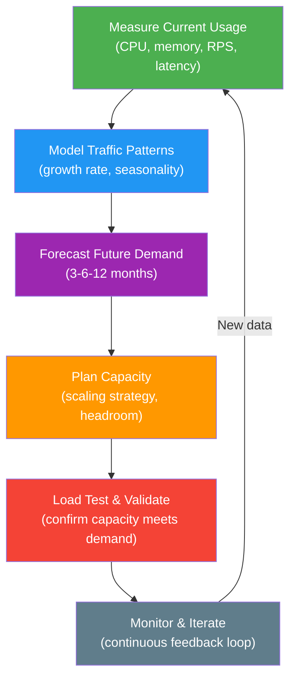
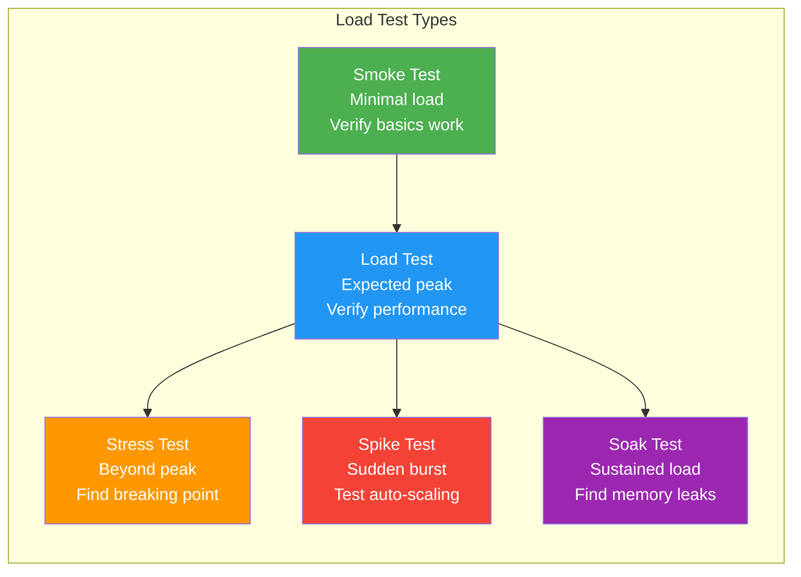
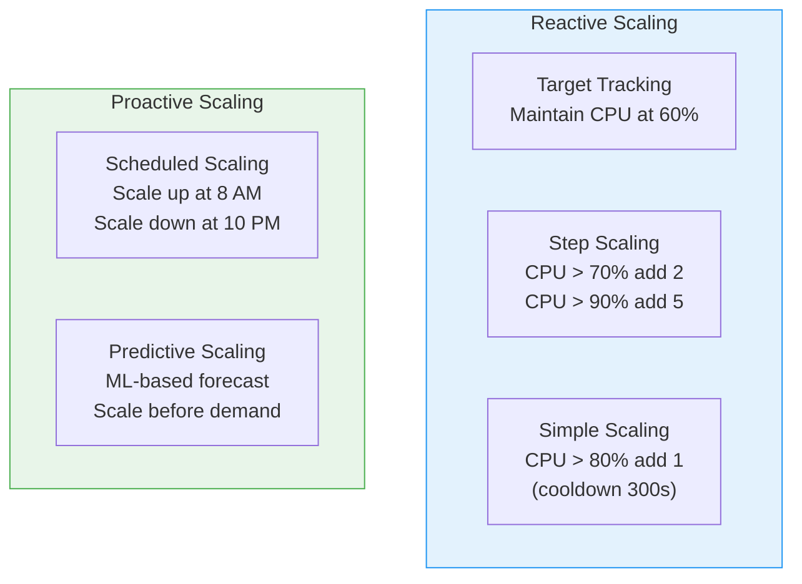

# Capacity Planning

## What Is Capacity Planning?

Capacity planning is the process of determining the production capacity needed to meet changing demand. In software engineering, this means ensuring your infrastructure can handle current and future traffic without degradation.



## Traffic Modeling

### Common Traffic Patterns

| Pattern | Description | Example | Scaling Approach |
|---------|------------|---------|-----------------|
| **Steady-state** | Consistent load with minor variation | Internal APIs, B2B services | Fixed capacity + small buffer |
| **Diurnal** | Peaks during business hours, low at night | SaaS dashboards, e-commerce | Time-based auto-scaling |
| **Weekly** | Patterns that repeat weekly | Business tools (M-F heavy, weekends light) | Scheduled scaling |
| **Seasonal** | Large spikes during specific periods | Black Friday, tax season, holidays | Pre-provisioned + auto-scaling |
| **Event-driven** | Unpredictable spikes from external events | Viral content, breaking news | Aggressive auto-scaling + CDN |
| **Growth** | Steady upward trend | Growing startup user base | Regular capacity reviews |

### Traffic Estimation

```typescript
interface TrafficModel {
  service: string;
  currentMetrics: CurrentMetrics;
  growthModel: GrowthModel;
  seasonality: SeasonalityModel;
}

interface CurrentMetrics {
  averageRPS: number;         // requests per second
  peakRPS: number;
  peakToAverageRatio: number; // how spiky is traffic?
  p50LatencyMs: number;
  p99LatencyMs: number;
  cpuUtilizationPercent: number;
  memoryUtilizationPercent: number;
}

interface GrowthModel {
  monthlyGrowthRate: number;  // e.g., 0.15 = 15% MoM
  projectedPeakRPS: {
    threeMonths: number;
    sixMonths: number;
    twelveMonths: number;
  };
}

interface SeasonalityModel {
  peakPeriods: { name: string; multiplier: number; duration: string }[];
}

// Example capacity estimation
function estimateCapacity(model: TrafficModel): CapacityPlan {
  const current = model.currentMetrics;
  const growth = model.growthModel;

  // Project peak RPS in 6 months
  const projectedPeakRPS = current.peakRPS * Math.pow(1 + growth.monthlyGrowthRate, 6);

  // Add headroom (typically 30-50% above projected peak)
  const headroomMultiplier = 1.5;
  const targetCapacityRPS = projectedPeakRPS * headroomMultiplier;

  // Calculate instances needed
  // If each instance handles ~500 RPS at 70% CPU utilization
  const rpsPerInstance = 500;
  const instancesNeeded = Math.ceil(targetCapacityRPS / rpsPerInstance);

  return {
    projectedPeakRPS: Math.round(projectedPeakRPS),
    targetCapacityRPS: Math.round(targetCapacityRPS),
    instancesNeeded,
    headroomPercent: (headroomMultiplier - 1) * 100,
    reviewDate: new Date(Date.now() + 90 * 24 * 60 * 60 * 1000), // 3 months
  };
}

interface CapacityPlan {
  projectedPeakRPS: number;
  targetCapacityRPS: number;
  instancesNeeded: number;
  headroomPercent: number;
  reviewDate: Date;
}

// Example:
// Current peak: 2000 RPS, 15% MoM growth
// 6-month projection: 2000 * 1.15^6 = 4626 RPS
// With 50% headroom: 6939 RPS capacity needed
// At 500 RPS/instance: 14 instances
```

### Back-of-the-Envelope Capacity Estimation

This is a common interview exercise. Here is the framework:

```typescript
function backOfEnvelopeEstimation(params: {
  dailyActiveUsers: number;
  actionsPerUserPerDay: number;
  peakToAverageRatio: number;
  readWriteRatio: number;  // reads per write
}) {
  const {
    dailyActiveUsers,
    actionsPerUserPerDay,
    peakToAverageRatio,
    readWriteRatio,
  } = params;

  // Total daily requests
  const totalDailyRequests = dailyActiveUsers * actionsPerUserPerDay;

  // Average RPS
  const averageRPS = totalDailyRequests / 86_400; // seconds in a day

  // Peak RPS
  const peakRPS = averageRPS * peakToAverageRatio;

  // Read/Write split
  const writeRPS = peakRPS / (1 + readWriteRatio);
  const readRPS = peakRPS - writeRPS;

  return {
    totalDailyRequests,
    averageRPS: Math.round(averageRPS),
    peakRPS: Math.round(peakRPS),
    readRPS: Math.round(readRPS),
    writeRPS: Math.round(writeRPS),
  };
}

// Example: Social media feed service
const estimate = backOfEnvelopeEstimation({
  dailyActiveUsers: 10_000_000,      // 10M DAU
  actionsPerUserPerDay: 20,           // views, likes, posts
  peakToAverageRatio: 3,              // peak is 3x average
  readWriteRatio: 10,                 // 10 reads per 1 write
});
// totalDailyRequests: 200,000,000
// averageRPS: 2315
// peakRPS: 6944
// readRPS: 6313
// writeRPS: 631
```

## Load Testing

### Load Test Types



| Test Type | Load Level | Duration | What It Finds |
|-----------|-----------|----------|--------------|
| **Smoke** | ~5% of expected | 1-2 min | Configuration errors, basic failures |
| **Load** | Expected peak | 15-60 min | Performance under normal peak conditions |
| **Stress** | 150-200% of peak | 15-30 min | Breaking point, degradation behavior |
| **Spike** | 0% to 300%+ instantly | 5-10 min | Auto-scaling behavior, queue backpressure |
| **Soak / Endurance** | Expected load | 4-12+ hours | Memory leaks, connection pool exhaustion, GC issues |

### Load Testing with k6

```typescript
// k6 is a modern load testing tool. Tests are written in JavaScript.
// File: load-test.js (k6 uses JS, but showing structure)

/*
import http from 'k6/http';
import { check, sleep } from 'k6';
import { Rate, Trend } from 'k6/metrics';

// Custom metrics
const errorRate = new Rate('errors');
const latency = new Trend('request_latency');

// Test configuration
export const options = {
  stages: [
    // Ramp up
    { duration: '2m', target: 100 },   // 0 -> 100 VUs over 2 min
    { duration: '5m', target: 100 },   // Hold at 100 VUs for 5 min
    // Peak load
    { duration: '2m', target: 500 },   // Ramp to 500 VUs
    { duration: '10m', target: 500 },  // Hold peak for 10 min
    // Ramp down
    { duration: '2m', target: 0 },     // Cool down
  ],
  thresholds: {
    http_req_duration: ['p(95)<200', 'p(99)<500'],  // latency SLOs
    errors: ['rate<0.01'],                            // error rate < 1%
    http_req_failed: ['rate<0.01'],
  },
};

export default function () {
  // Simulate user behavior
  const dashboardRes = http.get('https://api.example.com/dashboard');
  check(dashboardRes, {
    'dashboard status 200': (r) => r.status === 200,
    'dashboard latency < 200ms': (r) => r.timings.duration < 200,
  });
  errorRate.add(dashboardRes.status >= 400);
  latency.add(dashboardRes.timings.duration);

  sleep(1); // Think time between requests

  const searchRes = http.get('https://api.example.com/search?q=test');
  check(searchRes, {
    'search status 200': (r) => r.status === 200,
  });
  errorRate.add(searchRes.status >= 400);

  sleep(2);
}
*/
```

### Load Testing Tools Comparison

| Tool | Language | Cloud Support | Best For | License |
|------|----------|--------------|----------|---------|
| **k6** | JavaScript | Grafana Cloud | Modern API testing, CI integration | AGPL-3.0 |
| **Artillery** | JavaScript/YAML | Artillery Cloud | Node.js teams, quick setup | MPL-2.0 |
| **Locust** | Python | Distributed | Python teams, custom scenarios | MIT |
| **Gatling** | Scala/Java | Gatling Enterprise | JVM teams, complex scenarios | Apache 2.0 |
| **JMeter** | Java (GUI) | BlazeMeter | Legacy, protocol variety | Apache 2.0 |
| **wrk** | C (CLI) | None | Simple HTTP benchmarks | Apache 2.0 |

### Load Test Best Practices

| Practice | Why |
|----------|-----|
| Test in a production-like environment | Staging often has different hardware/config |
| Use realistic data volumes | Empty databases are fast; full ones are not |
| Include think time between requests | Without it, you overestimate real user load |
| Test the full stack | Not just the API -- include DB, cache, external services |
| Run from multiple locations | Single-source tests miss geographic load distribution |
| Establish baselines first | Compare against a known good baseline, not guesses |
| Automate in CI/CD | Run load tests on every release candidate |
| Monitor during tests | Watch CPU, memory, DB connections, not just response times |

## Auto-Scaling

### Scaling Policies



### Auto-Scaling Configuration

```typescript
interface AutoScalingConfig {
  serviceName: string;
  minInstances: number;
  maxInstances: number;
  desiredInstances: number;
  scalingPolicies: ScalingPolicy[];
  cooldownSeconds: number;
  healthCheck: {
    path: string;
    intervalSeconds: number;
    healthyThreshold: number;
    unhealthyThreshold: number;
  };
}

type ScalingPolicy =
  | TargetTrackingPolicy
  | StepScalingPolicy
  | ScheduledScalingPolicy;

interface TargetTrackingPolicy {
  type: 'target_tracking';
  metric: 'cpu' | 'memory' | 'request_count' | 'custom';
  targetValue: number;
  scaleInCooldownSeconds: number;
  scaleOutCooldownSeconds: number;
}

interface StepScalingPolicy {
  type: 'step';
  metric: string;
  steps: {
    lowerBound: number;
    upperBound?: number;
    adjustment: number; // +2 means add 2 instances
  }[];
}

interface ScheduledScalingPolicy {
  type: 'scheduled';
  schedule: string; // cron expression
  minInstances: number;
  maxInstances: number;
  desiredInstances: number;
}

const apiScalingConfig: AutoScalingConfig = {
  serviceName: 'api-service',
  minInstances: 3,          // minimum for HA (one per AZ)
  maxInstances: 50,
  desiredInstances: 6,
  scalingPolicies: [
    // Primary: target tracking on CPU
    {
      type: 'target_tracking',
      metric: 'cpu',
      targetValue: 60,          // keep CPU around 60%
      scaleInCooldownSeconds: 300,
      scaleOutCooldownSeconds: 60,
    },
    // Secondary: step scaling on request count
    {
      type: 'step',
      metric: 'RequestCountPerTarget',
      steps: [
        { lowerBound: 500, upperBound: 1000, adjustment: 2 },
        { lowerBound: 1000, upperBound: 2000, adjustment: 5 },
        { lowerBound: 2000, adjustment: 10 },
      ],
    },
    // Scheduled: pre-scale for known traffic patterns
    {
      type: 'scheduled',
      schedule: '0 7 * * MON-FRI', // 7 AM UTC weekdays
      minInstances: 10,
      maxInstances: 50,
      desiredInstances: 15,
    },
    {
      type: 'scheduled',
      schedule: '0 22 * * MON-FRI', // 10 PM UTC weekdays
      minInstances: 3,
      maxInstances: 50,
      desiredInstances: 6,
    },
  ],
  cooldownSeconds: 120,
  healthCheck: {
    path: '/health',
    intervalSeconds: 10,
    healthyThreshold: 2,
    unhealthyThreshold: 3,
  },
};
```

### Scaling Considerations

| Consideration | Details |
|---------------|---------|
| **Scale-out time** | How long from trigger to serving traffic? Include boot time, warm-up, health checks |
| **Scale-in safety** | Connection draining: allow in-flight requests to complete before terminating |
| **Scaling limits** | AWS account limits, IP address availability, DB connection pool limits |
| **Cascade failures** | Scaling out one service may overload downstream services |
| **Cost management** | Set max instances to prevent runaway scaling from a traffic attack |
| **Cooldown periods** | Prevent thrashing: scale-in cooldown should be longer than scale-out |
| **Warm-up time** | JIT compilation, cache warming, connection pool initialization |

## Headroom Planning

Headroom is the buffer between current capacity and maximum capacity.

```typescript
interface HeadroomPolicy {
  normalHeadroomPercent: number;   // above expected peak
  eventHeadroomPercent: number;    // for known events (sales, launches)
  minimumSpareInstances: number;   // always have N spare
  scaleOutLeadTimeMinutes: number; // how long to add capacity
}

const policy: HeadroomPolicy = {
  normalHeadroomPercent: 30,       // 30% above expected peak
  eventHeadroomPercent: 100,       // 2x for planned events
  minimumSpareInstances: 2,        // always 2 instances ready
  scaleOutLeadTimeMinutes: 5,      // 5 min from trigger to serving
};

// Why 30% headroom?
// - Absorb traffic spikes before auto-scaling kicks in
// - Handle instance failures (if 1 of 4 dies, you lose 25%)
// - Account for non-uniform load distribution
// - Buffer for traffic growth between capacity reviews
```

### Capacity Review Cadence

| Review Type | Frequency | What to Check |
|------------|-----------|---------------|
| **Daily** (automated) | Every day | Auto-scaling events, cost anomalies, resource utilization dashboards |
| **Weekly** | Every week | Utilization trends, upcoming events, scaling incidents |
| **Monthly** | Every month | Growth trends, cost optimization, headroom adequacy |
| **Quarterly** | Every quarter | Architecture review, capacity forecast, budget planning |
| **Pre-event** | Before known spikes | Load test, pre-scale, verify failover, brief on-call team |

---

## Interview Q&A

> **Q: How would you estimate the infrastructure needed for a service with 10 million daily active users?**
>
> A: I start with back-of-the-envelope math. 10M DAU making ~20 requests/day = 200M requests/day. Divide by 86,400 seconds = ~2,300 average RPS. Peak is typically 2-3x average, so ~7,000 peak RPS. Add 50% headroom = ~10,500 target RPS. If each application instance handles ~500 RPS at target CPU utilization (60-70%), I need ~21 instances. Add at least 3 instances per AZ for HA. For the database, I need to consider read/write split (e.g., 10:1 ratio), so ~636 write RPS and ~6,364 read RPS. A single Postgres primary can handle ~1,000 write RPS depending on query complexity, so I might need sharding or a write-optimized DB. Read replicas can handle the read load. I would then load test to validate these estimates.

> **Q: What types of load tests would you run before a major product launch?**
>
> A: I would run four types: (1) Load test at expected peak to confirm baseline performance. (2) Stress test at 2x expected peak to understand the breaking point and degradation behavior -- does the service degrade gracefully or cliff? (3) Spike test to validate auto-scaling responds fast enough to sudden traffic surges. (4) Soak test over several hours to catch memory leaks, connection pool exhaustion, and GC pressure that only appear under sustained load. All tests should use realistic data volumes and include the full stack -- API, database, cache, external dependencies. I run these tests in an environment that mirrors production configuration.

> **Q: How do you handle scaling for a service with very spiky, unpredictable traffic?**
>
> A: Multiple layers. (1) Maintain higher headroom (50-100% above average) since prediction is unreliable. (2) Use aggressive auto-scaling with short cooldown periods and step scaling that adds instances in larger increments for bigger spikes. (3) Implement a CDN and edge caching to absorb read traffic spikes without hitting origin. (4) Use queue-based architecture for write-heavy spikes -- accept the work immediately and process asynchronously, which decouples ingestion from processing. (5) Implement load shedding and circuit breakers so that under extreme load, the service degrades gracefully (e.g., serves cached data) rather than crashing. (6) Consider serverless components (Lambda) for truly unpredictable, bursty workloads.

> **Q: How do you balance cost optimization with capacity headroom?**
>
> A: The key is right-sizing and time-based optimization. (1) Use scheduled scaling to match known traffic patterns -- scale down at night, scale up before business hours. (2) Use spot/preemptible instances for fault-tolerant workloads (workers, batch jobs) for 60-90% cost savings. (3) Right-size instances: if CPU is at 20% utilization, you are over-provisioned. (4) Reserve capacity for baseline load (1-year reserved instances save 40%) and use on-demand for variable load. (5) Set auto-scaling max limits to prevent runaway costs. (6) Review capacity monthly -- over-provisioning "just in case" compounds quickly. The goal is not minimum cost but optimal cost: enough headroom for reliability without paying for idle resources.

> **Q: What metrics do you monitor during a load test?**
>
> A: Application layer: RPS, error rate, response time (p50, p95, p99), throughput. Infrastructure layer: CPU utilization, memory usage, disk I/O, network throughput. Database layer: query latency, connection pool usage, replication lag, lock contention, cache hit ratio. Auto-scaling: scaling events, time-to-healthy for new instances. I also monitor downstream dependencies for cascading effects. The most important thing is to correlate these metrics -- for example, when RPS crosses 5,000, does p99 latency suddenly jump? That tells me where the bottleneck is. I look for cliffs (sudden degradation) versus slopes (gradual degradation) in the metrics.
