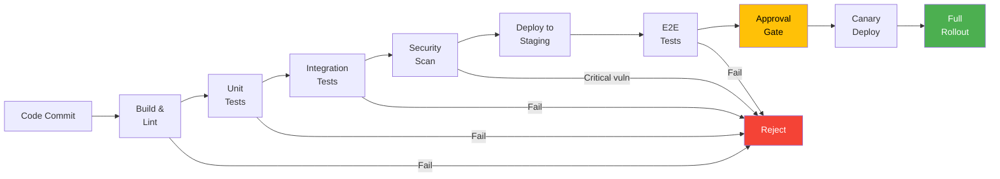
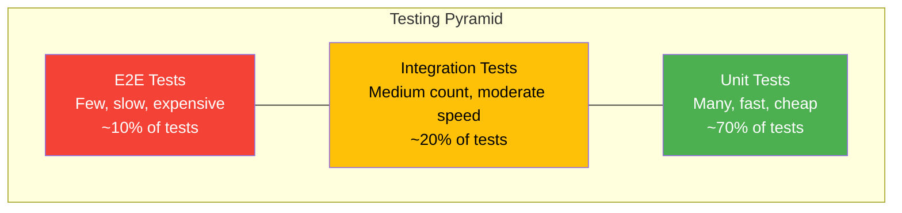
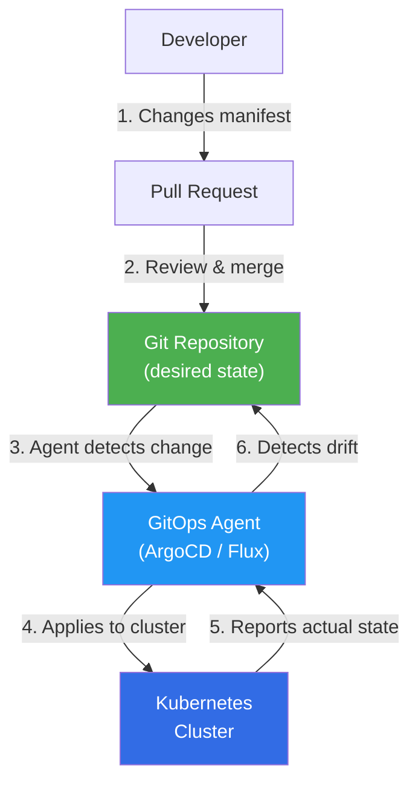
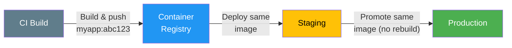

# Deployment Pipelines

## What Is a Deployment Pipeline?

A deployment pipeline is an automated process that takes code from version control to production. It enforces quality gates at each stage: build, test, deploy, and verify.



## CI/CD Pipeline Stages

### Stage Breakdown

| Stage | What Happens | Duration Target | Fails If |
|-------|-------------|----------------|----------|
| **Checkout** | Pull code, install dependencies | < 1 min | Dependency resolution fails |
| **Lint & Format** | ESLint, Prettier, type checking | < 2 min | Style violations, type errors |
| **Unit Tests** | Run unit tests with coverage | < 5 min | Tests fail, coverage drops below threshold |
| **Build** | Compile, bundle, create artifacts | < 3 min | Build errors |
| **Integration Tests** | Test with real dependencies (DB, cache) | < 10 min | Service interaction failures |
| **Security Scan** | SAST, dependency vulnerability scan | < 5 min | Critical/high vulnerabilities |
| **Docker Build** | Build container image | < 3 min | Dockerfile errors |
| **Push Artifact** | Push image to registry | < 1 min | Registry auth/capacity issues |
| **Deploy Staging** | Deploy to staging environment | < 5 min | Deployment failures, health checks fail |
| **E2E Tests** | Run end-to-end tests on staging | < 15 min | User journey failures |
| **Approval Gate** | Manual or automated approval | Variable | Reviewer rejects |
| **Canary Deploy** | Deploy to small % of production | 10-30 min | Canary metrics deviate from baseline |
| **Full Rollout** | Roll out to 100% of production | < 10 min | Rolling update failures |
| **Post-Deploy Verify** | Smoke tests + monitoring | 5-15 min | Error rate spike, latency degradation |

### Pipeline Configuration Example

```typescript
// Conceptual pipeline configuration (GitHub Actions style)
interface PipelineConfig {
  name: string;
  trigger: TriggerConfig;
  stages: PipelineStage[];
  notifications: NotificationConfig;
}

interface PipelineStage {
  name: string;
  dependsOn?: string[];
  steps: PipelineStep[];
  timeout: string;
  onFailure: 'stop' | 'continue' | 'rollback';
}

interface PipelineStep {
  name: string;
  command: string;
  env?: Record<string, string>;
}

interface TriggerConfig {
  branches: string[];
  events: ('push' | 'pull_request' | 'tag')[];
}

const pipeline: PipelineConfig = {
  name: 'Production Deploy',
  trigger: {
    branches: ['main'],
    events: ['push'],
  },
  stages: [
    {
      name: 'build-and-test',
      steps: [
        { name: 'Install', command: 'npm ci' },
        { name: 'Lint', command: 'npm run lint' },
        { name: 'Type Check', command: 'npm run typecheck' },
        { name: 'Unit Tests', command: 'npm run test:unit -- --coverage' },
        { name: 'Build', command: 'npm run build' },
      ],
      timeout: '10m',
      onFailure: 'stop',
    },
    {
      name: 'integration-tests',
      dependsOn: ['build-and-test'],
      steps: [
        { name: 'Start Services', command: 'docker-compose up -d' },
        { name: 'Wait for Ready', command: 'npm run wait-for-services' },
        { name: 'Integration Tests', command: 'npm run test:integration' },
        { name: 'Tear Down', command: 'docker-compose down' },
      ],
      timeout: '15m',
      onFailure: 'stop',
    },
    {
      name: 'security-scan',
      dependsOn: ['build-and-test'],
      steps: [
        { name: 'Dependency Audit', command: 'npm audit --audit-level=high' },
        { name: 'SAST Scan', command: 'semgrep --config=auto .' },
        { name: 'Container Scan', command: 'trivy image myapp:latest' },
      ],
      timeout: '10m',
      onFailure: 'stop',
    },
    {
      name: 'deploy-staging',
      dependsOn: ['integration-tests', 'security-scan'],
      steps: [
        { name: 'Push Image', command: 'docker push registry/myapp:$SHA' },
        { name: 'Deploy', command: 'kubectl set image deployment/myapp myapp=registry/myapp:$SHA -n staging' },
        { name: 'Wait for Rollout', command: 'kubectl rollout status deployment/myapp -n staging --timeout=300s' },
        { name: 'Smoke Tests', command: 'npm run test:smoke -- --env=staging' },
      ],
      timeout: '10m',
      onFailure: 'rollback',
    },
    {
      name: 'e2e-tests',
      dependsOn: ['deploy-staging'],
      steps: [
        { name: 'E2E Tests', command: 'npm run test:e2e -- --env=staging' },
      ],
      timeout: '20m',
      onFailure: 'stop',
    },
    {
      name: 'deploy-production',
      dependsOn: ['e2e-tests'],
      steps: [
        { name: 'Canary Deploy (5%)', command: 'kubectl-canary deploy --percent=5 --image=registry/myapp:$SHA' },
        { name: 'Canary Monitor', command: 'canary-analysis --duration=10m --threshold=0.01' },
        { name: 'Full Rollout', command: 'kubectl set image deployment/myapp myapp=registry/myapp:$SHA -n production' },
        { name: 'Wait for Rollout', command: 'kubectl rollout status deployment/myapp -n production --timeout=600s' },
        { name: 'Post-Deploy Verify', command: 'npm run test:smoke -- --env=production' },
      ],
      timeout: '30m',
      onFailure: 'rollback',
    },
  ],
  notifications: {
    onSuccess: ['slack:#deploys'],
    onFailure: ['slack:#deploys', 'pagerduty:deploy-failures'],
  },
};

interface NotificationConfig {
  onSuccess: string[];
  onFailure: string[];
}
```

## Testing Pyramid in CI



| Level | What It Tests | Speed | Confidence | Count | CI Stage |
|-------|--------------|-------|------------|-------|----------|
| **Unit** | Individual functions/classes in isolation | Fast (ms) | Low-Medium | Hundreds-thousands | Every commit |
| **Integration** | Component interactions (API + DB, service-to-service) | Medium (seconds) | Medium-High | Dozens-hundreds | Every commit |
| **E2E** | Full user journeys through the UI/API | Slow (minutes) | High | Tens | Pre-deploy to staging |
| **Contract** | API contract between services | Fast | Medium | Dozens | Every commit |
| **Load/Perf** | Performance under load | Very slow | High (perf) | Few | Weekly or pre-release |

### What to Test at Each Level

```typescript
// Unit test: test business logic in isolation
// Fast, no external dependencies
describe('PricingCalculator', () => {
  it('applies volume discount for orders over 100 units', () => {
    const calculator = new PricingCalculator();
    const result = calculator.calculate({
      unitPrice: 10,
      quantity: 150,
      discountTier: 'volume',
    });
    expect(result.total).toBe(1350); // 10% discount
    expect(result.discount).toBe(150);
  });
});

// Integration test: test with real database
// Medium speed, needs test infrastructure
describe('OrderRepository', () => {
  let db: TestDatabase;

  beforeAll(async () => {
    db = await TestDatabase.create(); // spin up test Postgres
  });

  afterAll(async () => {
    await db.destroy();
  });

  it('persists and retrieves an order', async () => {
    const repo = new OrderRepository(db.connection);
    const order = await repo.create({
      userId: 'user-123',
      items: [{ productId: 'prod-1', quantity: 2 }],
    });
    const retrieved = await repo.findById(order.id);
    expect(retrieved).toEqual(order);
  });
});

// E2E test: test full user journey
// Slow, needs full environment
describe('Checkout Flow', () => {
  it('completes a purchase end-to-end', async () => {
    const client = new APIClient(process.env.STAGING_URL!);

    // Login
    const session = await client.login('test-user@example.com', 'password');

    // Add items to cart
    await client.addToCart(session, { productId: 'prod-1', quantity: 1 });

    // Checkout
    const order = await client.checkout(session, {
      paymentMethod: 'test-card',
      shippingAddress: testAddress,
    });

    expect(order.status).toBe('confirmed');
    expect(order.items).toHaveLength(1);
  });
});
```

## GitOps

GitOps uses Git as the single source of truth for declarative infrastructure and application state. Changes to infrastructure are made via pull requests, not manual commands.

### GitOps Principles

| Principle | Description |
|-----------|------------|
| **Declarative** | The desired state of the system is described declaratively (YAML, HCL) |
| **Versioned and immutable** | All state is stored in Git with full history |
| **Pulled automatically** | Agents (ArgoCD, Flux) pull desired state and reconcile |
| **Continuously reconciled** | Drift is automatically detected and corrected |

### GitOps Workflow



### GitOps vs Traditional CI/CD

| Aspect | Traditional CI/CD | GitOps |
|--------|------------------|--------|
| **Who deploys** | CI server pushes to cluster | Agent in cluster pulls from Git |
| **Source of truth** | CI pipeline config | Git repository |
| **Drift detection** | None (manual) | Automatic reconciliation |
| **Rollback** | Re-run pipeline with old version | `git revert` the commit |
| **Access control** | CI server needs cluster credentials | Only the agent needs cluster access |
| **Audit trail** | CI logs | Git history (who, what, when, why) |
| **Multi-cluster** | Complex -- pipeline per cluster | Agent per cluster, same Git repo |

## Infrastructure as Code (IaC)

### IaC Tools Comparison

| Tool | Language | State Management | Cloud Support | Learning Curve |
|------|----------|-----------------|---------------|---------------|
| **Terraform** | HCL | Remote state (S3, Terraform Cloud) | Multi-cloud | Medium |
| **Pulumi** | TypeScript, Python, Go | Pulumi Cloud, S3 | Multi-cloud | Low (if you know the language) |
| **CloudFormation** | JSON/YAML | Managed by AWS | AWS only | Medium |
| **CDK** | TypeScript, Python, Java | CloudFormation stacks | AWS (primary) | Medium |
| **Crossplane** | YAML (K8s CRDs) | Kubernetes | Multi-cloud | High |

### Terraform Patterns

```typescript
// Pulumi example (TypeScript IaC -- same concepts as Terraform but in TS)
// This creates a VPC, ECS cluster, and an auto-scaling service

/*
import * as aws from '@pulumi/aws';
import * as pulumi from '@pulumi/pulumi';

// Environment configuration
const config = new pulumi.Config();
const environment = config.require('environment'); // 'staging' | 'production'

// VPC
const vpc = new aws.ec2.Vpc(`${environment}-vpc`, {
  cidrBlock: '10.0.0.0/16',
  enableDnsHostnames: true,
  tags: { Environment: environment },
});

// ECS Cluster
const cluster = new aws.ecs.Cluster(`${environment}-cluster`, {
  settings: [{ name: 'containerInsights', value: 'enabled' }],
});

// Task Definition
const taskDef = new aws.ecs.TaskDefinition(`${environment}-api`, {
  family: `${environment}-api`,
  cpu: '256',
  memory: '512',
  networkMode: 'awsvpc',
  requiresCompatibilities: ['FARGATE'],
  containerDefinitions: JSON.stringify([{
    name: 'api',
    image: `${accountId}.dkr.ecr.us-east-1.amazonaws.com/api:${imageTag}`,
    portMappings: [{ containerPort: 3000 }],
    environment: [
      { name: 'NODE_ENV', value: environment },
    ],
    logConfiguration: {
      logDriver: 'awslogs',
      options: {
        'awslogs-group': `/ecs/${environment}/api`,
        'awslogs-region': 'us-east-1',
        'awslogs-stream-prefix': 'api',
      },
    },
  }]),
});

// Service with auto-scaling
const service = new aws.ecs.Service(`${environment}-api-service`, {
  cluster: cluster.arn,
  taskDefinition: taskDef.arn,
  desiredCount: environment === 'production' ? 6 : 2,
  launchType: 'FARGATE',
  networkConfiguration: {
    subnets: privateSubnetIds,
    securityGroups: [apiSecurityGroup.id],
  },
  loadBalancers: [{
    targetGroupArn: targetGroup.arn,
    containerName: 'api',
    containerPort: 3000,
  }],
});
*/
```

### IaC Best Practices

| Practice | Why |
|----------|-----|
| **Use remote state** | Local state files get lost, cannot be shared |
| **Lock state** | Prevent concurrent modifications (DynamoDB lock table for Terraform) |
| **Module/component reuse** | DRY -- share common patterns (VPC module, ECS module) |
| **Environment parity** | Same IaC with different variables for staging vs production |
| **Plan before apply** | Always review `terraform plan` before `terraform apply` |
| **Immutable infrastructure** | Replace instances instead of mutating them in place |
| **Secrets management** | Never store secrets in IaC code; use Vault, SSM, or Secrets Manager |
| **Drift detection** | Regularly check that actual state matches desired state |

## Artifact Management

| Aspect | Recommendation |
|--------|---------------|
| **Naming** | Tag with Git SHA, not `latest`: `myapp:a1b2c3d` |
| **Immutability** | Never overwrite an artifact; each build produces a unique artifact |
| **Registry** | ECR, GCR, Artifactory, or GitHub Container Registry |
| **Scanning** | Scan images for vulnerabilities before deployment |
| **Retention** | Keep last N versions + all versions in production |
| **Promotion** | Same artifact moves through staging -> production (never rebuild) |



**Key principle: Build once, deploy many.** The same artifact that passes tests in staging is the exact same artifact deployed to production. Never rebuild for different environments -- use environment variables for configuration.

## Progressive Delivery

Progressive delivery extends CI/CD with gradual, controlled rollouts.

| Technique | What It Does | When to Use |
|-----------|-------------|-------------|
| **Canary releases** | Route small % of traffic to new version | Every production deploy |
| **Feature flags** | Toggle features without redeployment | New features, A/B tests |
| **Blue-green** | Maintain two environments, switch traffic | Critical services needing instant rollback |
| **Dark launches** | Deploy code but do not expose to users | Backend changes, data migrations |
| **A/B testing** | Route users to different versions based on criteria | Product experiments |

---

## Interview Q&A

> **Q: Describe an ideal CI/CD pipeline for a microservices architecture.**
>
> A: Each microservice has its own pipeline triggered on commits to its directory. The pipeline: (1) Build and lint (<2 min). (2) Unit tests with coverage gate (>80%). (3) Integration tests using Docker Compose to spin up dependencies. (4) Security scan (SAST + dependency audit). (5) Build Docker image tagged with Git SHA. (6) Deploy to staging with automatic smoke tests. (7) E2E tests on staging. (8) Canary deploy to production (5% for 10 min with automated metric comparison). (9) Full rollout if canary passes. (10) Post-deploy verification. The pipeline should take under 20 minutes total and fail fast -- lint and unit tests first since they are fastest. Artifacts are built once and promoted through environments.

> **Q: What is GitOps and how does it differ from traditional CI/CD?**
>
> A: GitOps uses Git as the single source of truth for both application code and infrastructure state. Instead of a CI server pushing changes to the cluster, a GitOps agent (like ArgoCD or Flux) running inside the cluster pulls desired state from Git and reconciles it. Key differences: rollback is `git revert` instead of re-running a pipeline; drift is automatically detected and corrected; the CI server never needs cluster credentials (only the agent does); and you get a full audit trail in Git history. GitOps is especially powerful for Kubernetes because the declarative nature of K8s manifests maps perfectly to the Git-as-source-of-truth model.

> **Q: How do you handle database migrations in a CI/CD pipeline?**
>
> A: Database migrations run as a separate step before the application deploy, using the expand-contract pattern. In the pipeline: (1) Run migration in a pre-deploy step. (2) Verify migration succeeded (check schema, run validation queries). (3) Deploy the application code. This ensures the database schema is forward-compatible -- both old and new application code work with the migrated schema. For rollbacks, additive migrations (add column) are safe to leave in place even if the app rolls back. Destructive migrations (drop column) should be a separate pipeline step that runs days after the code change, once we are confident the old code will not need to run again.

> **Q: What is the testing pyramid and how does it apply to CI/CD?**
>
> A: The testing pyramid says most tests should be fast, cheap unit tests (70%), fewer integration tests (20%), and very few slow E2E tests (10%). In CI/CD, this means unit tests run on every commit and fail in under 5 minutes. Integration tests run on every commit but take slightly longer (10 min), testing real interactions with databases and other services. E2E tests run only before deploying to staging because they are slow and flaky. This gives fast feedback: if a unit test fails, the developer knows in 2 minutes. The common anti-pattern is the "ice cream cone" -- too many E2E tests, few unit tests -- which leads to slow, flaky pipelines.

> **Q: How do you manage secrets in a deployment pipeline?**
>
> A: Never store secrets in code, environment variables in CI config, or IaC files. Instead: (1) Use a secrets manager (AWS Secrets Manager, HashiCorp Vault, or your cloud provider's equivalent). (2) The CI pipeline authenticates to the secrets manager using short-lived credentials (OIDC tokens, IAM roles -- not long-lived API keys). (3) Secrets are injected at runtime, not build time -- the container image contains no secrets. (4) In Kubernetes, use External Secrets Operator or Sealed Secrets to sync secrets from the secrets manager into K8s secrets. (5) Rotate secrets regularly and audit access. The principle is: secrets should be fetched at the last possible moment and never persisted to disk or logs.

> **Q: How would you speed up a slow CI pipeline?**
>
> A: First, measure to find the bottleneck. Common optimizations: (1) Parallelize -- run unit tests, integration tests, and security scans concurrently rather than sequentially. (2) Cache dependencies aggressively (node_modules, Docker layers, build artifacts). (3) Use incremental builds -- only rebuild and test what changed (monorepo tools like Nx or Turborepo help). (4) Move slow tests to a separate pipeline that runs asynchronously (e.g., soak tests run nightly). (5) Use test splitting to distribute tests across multiple CI agents. (6) Optimize Docker builds with multi-stage builds and layer caching. (7) Use faster CI hardware (larger instances). Target: the fast feedback loop (lint + unit tests) should complete in under 5 minutes.
