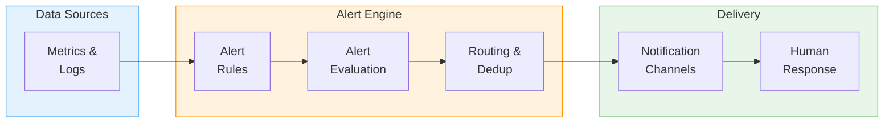
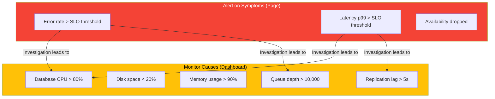
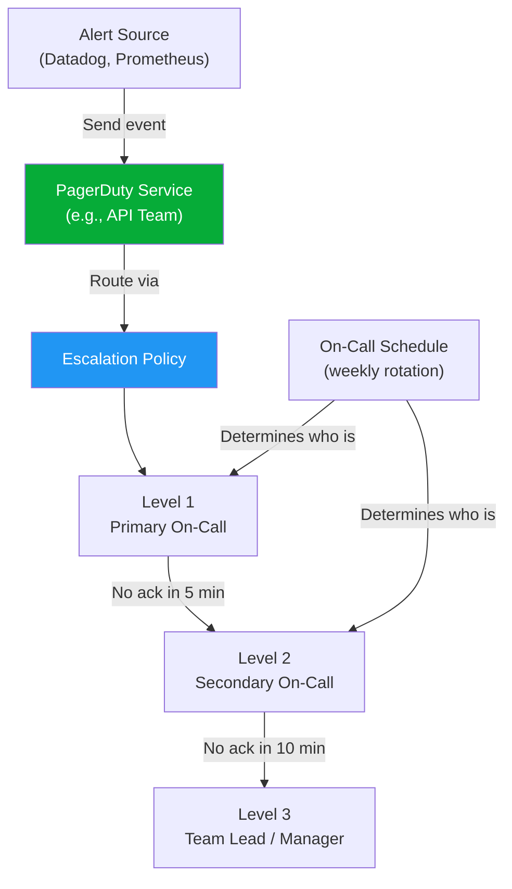
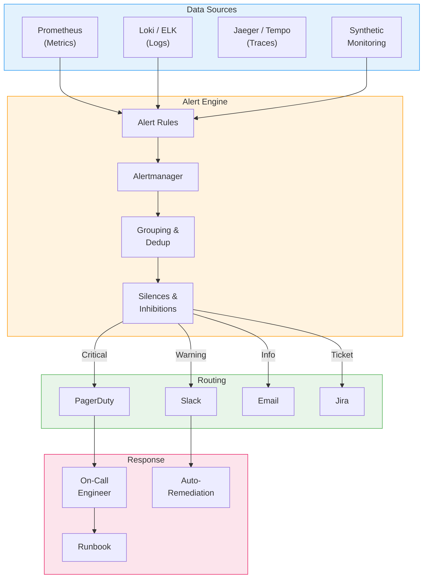

# Alerting Practices

## Alerting Fundamentals

Alerting is the bridge between monitoring and incident response. A well-designed alerting system notifies the right people about the right problems at the right time.



## Alert Design Principles

### Symptom-Based vs Cause-Based Alerts

| Approach | What It Monitors | Example | Pros | Cons |
|----------|-----------------|---------|------|------|
| **Symptom-based** | User-facing impact | "Error rate > 1%" | Catches all causes, low noise | Does not tell you the cause |
| **Cause-based** | Specific failure mode | "Database CPU > 90%" | Tells you exactly what is wrong | Misses unknown failure modes |

**Best practice: Alert on symptoms, debug with causes.**

Page on-call for symptoms (users are affected). Use cause-based metrics for dashboards and investigation.



### The Four Properties of Good Alerts

| Property | Description | Anti-Pattern |
|----------|------------|-------------|
| **Actionable** | Receiving the alert means you must do something | Alert fires but no action is needed |
| **Relevant** | Alert indicates real user impact or imminent risk | Alert for dev environment issues at 3 AM |
| **Timely** | Alert fires fast enough to respond before SLO breach | Alert fires 30 min after users notice |
| **Understandable** | Alert message explains what is wrong and what to do | "CRITICAL: check_xyz_123 FAILED" |

## Alert Fatigue

Alert fatigue is the single biggest problem in alerting. When on-call engineers receive too many alerts, they start ignoring them -- including the ones that matter.

### Causes of Alert Fatigue

| Cause | Example | Fix |
|-------|---------|-----|
| **Noisy thresholds** | CPU > 80% fires 50 times/day during peaks | Use burn rate alerts, increase threshold, or remove |
| **Non-actionable alerts** | "Disk space at 75%" -- nothing to do yet | Alert at 90% or automate cleanup |
| **Duplicate alerts** | Same incident triggers 5 different alerts | Alert grouping, deduplication |
| **Flapping alerts** | Alert fires, resolves, fires, resolves every 5 min | Add hysteresis (different thresholds for fire/resolve) |
| **Alert on causes, not symptoms** | 20 cause-based alerts for one symptom | Alert on the symptom, investigate causes |
| **No severity differentiation** | Everything pages at 3 AM | Severity levels: page vs ticket vs log |

### Alert Hygiene Practices

```typescript
interface AlertHygieneReview {
  frequency: 'monthly';
  metrics: AlertHealthMetric[];
  actions: string[];
}

interface AlertHealthMetric {
  name: string;
  target: string;
  current: number;
}

const alertReview: AlertHygieneReview = {
  frequency: 'monthly',
  metrics: [
    {
      name: 'Pages per on-call shift',
      target: '< 2 per week',
      current: 7, // too many!
    },
    {
      name: 'Percentage of actionable alerts',
      target: '> 90%',
      current: 45, // way too low
    },
    {
      name: 'Alerts auto-resolved without action',
      target: '< 10%',
      current: 60, // most alerts are noise
    },
    {
      name: 'Mean time to acknowledge',
      target: '< 5 minutes',
      current: 12, // fatigue is slowing response
    },
  ],
  actions: [
    'Review every alert that fired this month',
    'Delete or demote alerts with < 50% action rate',
    'Consolidate duplicate/overlapping alerts',
    'Add hysteresis to flapping alerts',
    'Convert cause-based pages to tickets or dashboards',
  ],
};
```

## Alert Configuration

### Alert Severity Levels

| Severity | Response | Channel | Example |
|----------|----------|---------|---------|
| **Critical (P1)** | Page on-call immediately, 24/7 | PagerDuty, phone call | Error rate burning SLO budget at 10x |
| **High (P2)** | Page during business hours | PagerDuty (no off-hours) | Elevated latency, canary failure |
| **Warning (P3)** | Create ticket, fix this sprint | Slack, Jira | Disk space at 80%, elevated queue depth |
| **Info (P4)** | Log for awareness | Slack channel, dashboard | Deploy completed, cert renewing in 30 days |

### Alert Template

```typescript
interface AlertRule {
  name: string;
  description: string;
  severity: 'critical' | 'high' | 'warning' | 'info';

  // What to evaluate
  query: string;             // Prometheus, Datadog, or CloudWatch query
  threshold: number;
  comparison: 'gt' | 'lt' | 'eq';
  evaluationWindow: string;  // e.g., '5m'
  evaluationPeriods: number; // consecutive periods before firing

  // Routing
  notificationChannels: string[];
  escalationPolicy?: string;

  // Context for responders
  runbookUrl: string;
  dashboardUrl: string;
  summary: string;           // human-readable description
  impactStatement: string;   // what users experience
  suggestedActions: string[];

  // Anti-flap
  resolveThreshold?: number;  // different from fire threshold
  resolveWindow?: string;
}

const apiErrorRateAlert: AlertRule = {
  name: 'api_error_rate_high',
  description: 'API error rate is burning SLO budget faster than sustainable',
  severity: 'critical',

  // Burn rate alert: 14.4x burn rate over 1 hour
  query: `
    (1 - (
      sum(rate(http_requests_total{status!~"5.."}[1h]))
      / sum(rate(http_requests_total[1h]))
    )) / (1 - 0.999)
  `,
  threshold: 14.4,
  comparison: 'gt',
  evaluationWindow: '5m',
  evaluationPeriods: 1,

  notificationChannels: ['pagerduty-primary-oncall'],
  escalationPolicy: 'api-team-escalation',

  runbookUrl: 'https://wiki.example.com/runbooks/api-error-rate',
  dashboardUrl: 'https://grafana.example.com/d/api-overview',
  summary: 'API error rate is consuming SLO budget at 14.4x normal rate',
  impactStatement: 'Users are experiencing elevated 5xx errors on API requests',
  suggestedActions: [
    'Check recent deployments: did a deploy happen in the last hour?',
    'Check downstream dependencies: are any returning errors?',
    'Check database health: connection pool, replication lag',
    'If correlated with deploy: initiate rollback',
  ],

  resolveThreshold: 1.0,     // resolve when burn rate drops below 1x
  resolveWindow: '10m',
};
```

## PagerDuty Integration

### PagerDuty Concepts



### PagerDuty Configuration

```typescript
interface PagerDutyConfig {
  service: {
    name: string;
    description: string;
    urgencyRules: UrgencyRule[];
    autoResolveTimeout: number;    // minutes
    acknowledgementTimeout: number; // minutes before re-alerting
  };
  escalationPolicy: {
    name: string;
    repeatEnabled: boolean;
    numRepeats: number;
    levels: EscalationLevel[];
  };
  schedule: {
    name: string;
    timezone: string;
    rotationType: 'daily' | 'weekly';
    users: string[];
    handoffTime: string;  // e.g., '09:00'
    handoffDay?: string;  // e.g., 'Monday'
  };
}

interface UrgencyRule {
  condition: 'high_severity' | 'low_severity' | 'business_hours' | 'off_hours';
  urgency: 'high' | 'low';
}

interface EscalationLevel {
  level: number;
  escalateAfterMinutes: number;
  targets: { type: 'schedule' | 'user'; id: string }[];
}

const apiTeamPagerDuty: PagerDutyConfig = {
  service: {
    name: 'API Service',
    description: 'Core API serving customer-facing requests',
    urgencyRules: [
      { condition: 'high_severity', urgency: 'high' },  // always page for SEV1
      { condition: 'off_hours', urgency: 'low' },        // reduce noise off-hours for SEV2+
    ],
    autoResolveTimeout: 240,         // auto-resolve after 4 hours if not acked
    acknowledgementTimeout: 5,       // re-alert if not acked in 5 min
  },
  escalationPolicy: {
    name: 'API Team Escalation',
    repeatEnabled: true,
    numRepeats: 3,
    levels: [
      {
        level: 1,
        escalateAfterMinutes: 5,
        targets: [{ type: 'schedule', id: 'api-primary-oncall' }],
      },
      {
        level: 2,
        escalateAfterMinutes: 15,
        targets: [{ type: 'schedule', id: 'api-secondary-oncall' }],
      },
      {
        level: 3,
        escalateAfterMinutes: 30,
        targets: [{ type: 'user', id: 'eng-manager' }],
      },
    ],
  },
  schedule: {
    name: 'API Primary On-Call',
    timezone: 'America/New_York',
    rotationType: 'weekly',
    users: ['alice', 'bob', 'carol', 'dave', 'eve', 'frank'],
    handoffTime: '10:00',
    handoffDay: 'Tuesday',     // Not Monday (too many Monday issues)
  },
};
```

## On-Call Best Practices

| Practice | Details |
|----------|---------|
| **Target < 2 pages per shift** | If more, treat noisy alerts as bugs to fix |
| **Handoff document** | Written summary of active issues, recent deploys, known risks |
| **Handoff timing** | Tuesday morning (not Friday, not Monday) |
| **Minimum rotation size** | 6-8 people to avoid burnout |
| **Escalation path** | Always a secondary and a manager as backup |
| **Compensation** | On-call stipend + extra pay for off-hours pages |
| **Follow-the-sun** | For global teams, hand off across time zones to avoid night pages |
| **Post-shift review** | Review all pages: were they actionable? Could any be eliminated? |

### On-Call Anti-Patterns

| Anti-Pattern | Problem | Fix |
|-------------|---------|-----|
| **"Hero" on-call** | One person handles everything | Enforce rotation, share knowledge |
| **No runbooks** | On-call wastes time figuring out what to do | Every alert links to a runbook |
| **Night pages for non-critical issues** | Burnout, degraded response quality | Severity-based routing: ticket, not page |
| **Shadow on-call** | Person is "off" but still checking alerts | Clear boundaries, trust the on-call |
| **No post-incident review** | Same issues repeat, alert noise grows | Monthly alert hygiene reviews |

## Runbook Templates

A runbook is a documented procedure for responding to a specific alert. Every alert that pages should have a runbook.

### Runbook Structure

```typescript
interface Runbook {
  title: string;
  alertName: string;
  lastUpdated: string;
  owner: string;

  overview: {
    description: string;
    impact: string;
    urgency: 'immediate' | 'next_business_hour' | 'next_sprint';
  };

  diagnosis: DiagnosisStep[];
  mitigation: MitigationAction[];
  resolution: string[];
  escalation: {
    when: string;
    who: string;
    how: string;
  };

  references: {
    dashboard: string;
    logs: string;
    relatedRunbooks: string[];
  };
}

interface DiagnosisStep {
  step: number;
  description: string;
  command?: string;
  expectedOutput?: string;
  ifAbnormal: string;
}

interface MitigationAction {
  scenario: string;
  steps: string[];
  verifyCommand?: string;
}

const apiErrorRateRunbook: Runbook = {
  title: 'API Error Rate Elevated',
  alertName: 'api_error_rate_high',
  lastUpdated: '2026-02-15',
  owner: 'API Team',

  overview: {
    description: 'API 5xx error rate is above SLO threshold. Users are experiencing failed requests.',
    impact: 'Customer-facing: users cannot complete actions that rely on the API.',
    urgency: 'immediate',
  },

  diagnosis: [
    {
      step: 1,
      description: 'Check if a deploy happened recently',
      command: 'kubectl rollout history deployment/api -n production | tail -5',
      expectedOutput: 'No deployment in the last 30 minutes',
      ifAbnormal: 'Recent deploy detected -- proceed to rollback mitigation',
    },
    {
      step: 2,
      description: 'Check which endpoints are failing',
      command: 'Open Grafana dashboard: API Error Breakdown by Endpoint',
      expectedOutput: 'Errors distributed across endpoints',
      ifAbnormal: 'If concentrated on one endpoint, check that endpoint\'s dependencies',
    },
    {
      step: 3,
      description: 'Check downstream dependency health',
      command: 'Open Grafana dashboard: Dependency Health',
      expectedOutput: 'All dependencies green',
      ifAbnormal: 'If database is unhealthy, see Database Runbook. If third-party API is down, see Circuit Breaker Runbook.',
    },
    {
      step: 4,
      description: 'Check resource utilization',
      command: 'kubectl top pods -n production -l app=api',
      expectedOutput: 'CPU < 80%, Memory < 80%',
      ifAbnormal: 'If resources are exhausted, scale up or investigate memory leak',
    },
  ],

  mitigation: [
    {
      scenario: 'Caused by recent deployment',
      steps: [
        'kubectl rollout undo deployment/api -n production',
        'Wait for rollout to complete: kubectl rollout status deployment/api -n production',
        'Verify error rate is decreasing on Grafana dashboard',
      ],
      verifyCommand: 'curl -s https://api.example.com/health | jq .status',
    },
    {
      scenario: 'Caused by database overload',
      steps: [
        'Check slow query log for problematic queries',
        'If a specific query is the problem, consider enabling circuit breaker for that feature',
        'Scale up read replicas if read load is the issue',
      ],
    },
    {
      scenario: 'Caused by traffic spike',
      steps: [
        'Verify auto-scaling is active and adding instances',
        'If auto-scaling is maxed, manually increase max instance count',
        'Enable rate limiting if traffic appears malicious',
      ],
    },
  ],

  resolution: [
    'Identify root cause and create a fix',
    'Deploy fix through normal pipeline (with canary)',
    'Update this runbook if new diagnosis steps were discovered',
    'Schedule postmortem if SEV1 or SEV2',
  ],

  escalation: {
    when: 'If error rate does not decrease within 15 minutes of mitigation',
    who: 'Secondary on-call, then Team Lead',
    how: 'Escalate via PagerDuty',
  },

  references: {
    dashboard: 'https://grafana.example.com/d/api-overview',
    logs: 'https://kibana.example.com/app/logs?query=service:api%20AND%20level:error',
    relatedRunbooks: [
      'database-high-cpu-runbook',
      'api-high-latency-runbook',
    ],
  },
};
```

## Alerting Architecture



## Alerting Anti-Patterns Quick Reference

| Anti-Pattern | Description | Better Approach |
|-------------|-------------|-----------------|
| Alert on every metric | Hundreds of alerts for CPU, memory, disk on every host | Alert on symptoms, monitor causes on dashboards |
| Static thresholds for everything | "CPU > 80%" fires during normal spikes | Use anomaly detection or burn rate alerts |
| Same severity for everything | All alerts are "critical" | Define clear severity levels; most alerts should be tickets, not pages |
| No runbook | On-call has no idea what to do | Every paging alert must have a linked runbook |
| No alert ownership | Nobody maintains or reviews alerts | Every alert has an owner team |
| Copy-paste alerts | Identical alert for 50 services | Templated alerts with service-specific overrides |
| Alerting on absence of data | "No metrics received" pages at 3 AM | Use synthetic monitoring instead |
| No deduplication | 100 alerts for the same incident | Alert grouping by service/cluster |

---

## Interview Q&A

> **Q: What is alert fatigue and how do you combat it?**
>
> A: Alert fatigue occurs when on-call engineers receive so many alerts that they start ignoring them, including critical ones. I combat it by: (1) Auditing every alert monthly -- if an alert fires and no action is taken more than 50% of the time, delete it or demote to a ticket. (2) Using symptom-based alerts that page, not cause-based alerts. (3) Implementing proper severity levels: most alerts should create tickets, not pages. Target fewer than 2 pages per on-call shift. (4) Adding hysteresis to prevent flapping alerts. (5) Grouping and deduplicating so one incident produces one alert, not 50. The key metric is the percentage of actionable alerts: it should be above 90%.

> **Q: Explain the difference between symptom-based and cause-based alerting. Which do you prefer?**
>
> A: Symptom-based alerts fire when users are impacted: "error rate above 1%", "latency p99 above 500ms." Cause-based alerts fire when a specific component is unhealthy: "database CPU above 90%", "disk space below 10%." I prefer symptom-based for paging because they catch all failure modes, including ones you have not anticipated. A database CPU spike that does not affect users should not page anyone at 3 AM. However, cause-based metrics are essential for dashboards and investigation -- once you know users are impacted (symptom alert), you use cause metrics to find out why.

> **Q: How would you design an alert for a new service?**
>
> A: I start with the SLOs. If the SLO is 99.9% availability and p99 latency under 200ms, I create burn rate alerts for each SLI: a critical alert when the burn rate indicates budget exhaustion within hours, and a warning for slower burns. Every alert gets four things: (1) a clear, actionable description that states impact and suggested first steps, (2) a link to the relevant dashboard, (3) a link to a runbook with diagnosis and mitigation steps, and (4) proper severity routing -- critical goes to PagerDuty, warning creates a ticket. I then watch the alert for two weeks: if it fires without requiring action, I tune the threshold or remove it.

> **Q: What should a good runbook contain?**
>
> A: A good runbook has five sections: (1) Overview -- what the alert means, what users experience, and urgency level. (2) Diagnosis -- step-by-step commands to determine the cause, with expected outputs and what to do if the output is abnormal. (3) Mitigation -- specific actions for common scenarios (e.g., "if caused by deploy, run this rollback command"). (4) Escalation -- when to escalate, to whom, and how. (5) References -- links to dashboards, log queries, and related runbooks. The runbook should be written so that a new team member who has never seen the alert can follow it and mitigate the issue. It should be updated after every incident where the runbook was insufficient.

> **Q: How do you handle alerts during planned maintenance or known deployments?**
>
> A: I use alert silences (Alertmanager) or maintenance windows (PagerDuty). Before a deployment, I create a time-bound silence for deployment-related alerts on that specific service -- not a blanket silence on everything. The silence includes a comment explaining who created it and why. For planned maintenance (database upgrades, infrastructure changes), I schedule a PagerDuty maintenance window and communicate it to the team. Critical safety alerts (data corruption, security) should never be silenced. After the maintenance window, I verify the silence auto-expired and all alerts are active again.

> **Q: How do you measure the health of your alerting system?**
>
> A: I track several metrics: (1) Pages per on-call shift -- target under 2 per week. (2) Actionable alert percentage -- target above 90%. (3) Alert-to-incident ratio -- if 50 alerts fire for 1 incident, grouping is broken. (4) Time to acknowledge -- if increasing, alert fatigue is setting in. (5) False positive rate -- alerts that fire without real impact. (6) Missed incidents -- incidents detected by users before alerts fired. I review these monthly in an alert hygiene meeting where the team reviews every alert that fired, decides to keep/tune/delete each one, and identifies gaps where incidents were missed.
