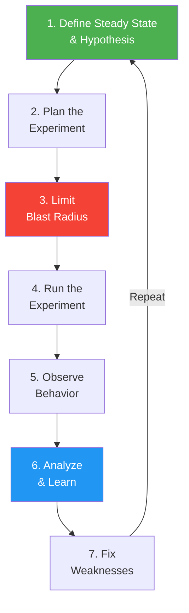
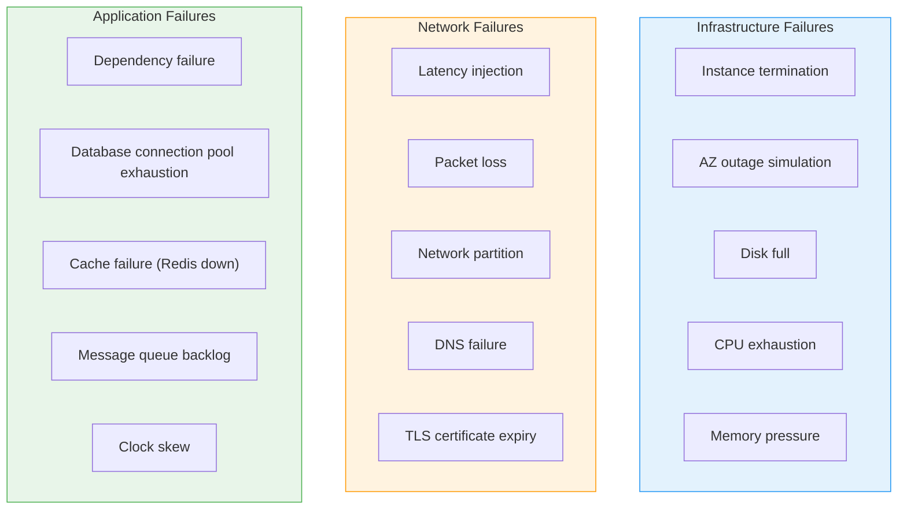
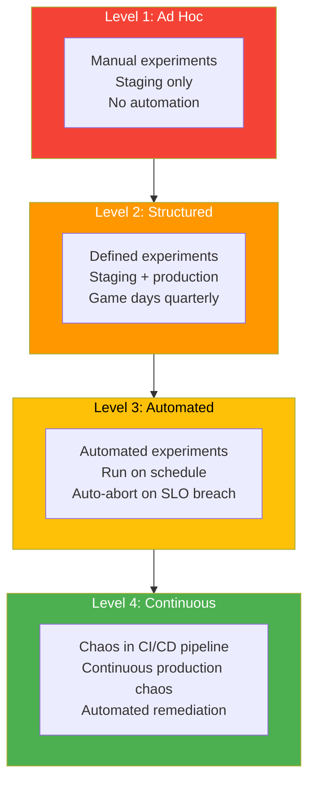

# Chaos Engineering

## What Is Chaos Engineering?

Chaos engineering is the discipline of experimenting on a system to build confidence in its ability to withstand turbulent conditions in production. Instead of waiting for things to break, you proactively inject failures to discover weaknesses before they cause real incidents.



## Principles of Chaos Engineering

These principles are defined by the chaos engineering community (principlesofchaos.org):

| Principle | Description |
|-----------|------------|
| **Build a hypothesis around steady-state behavior** | Define what "normal" looks like in measurable terms (e.g., error rate < 0.1%, p99 latency < 200ms). Your hypothesis: the system will maintain steady state when a failure is injected. |
| **Vary real-world events** | Inject failures that actually happen: server crashes, network partitions, dependency outages, disk full, clock skew, certificate expiry. |
| **Run experiments in production** | Staging environments do not reproduce real production conditions. Start in staging, but validate in production with proper safeguards. |
| **Automate experiments to run continuously** | One-time tests do not catch regressions. Chaos experiments should run regularly as part of your CI/CD and operational cadence. |
| **Minimize blast radius** | Start small. Affect one instance, one AZ, one percentage of traffic. Have a kill switch to abort immediately. |

## Steady-State Hypothesis

The steady-state hypothesis is the foundation of every chaos experiment. It defines what "working" means in measurable terms.

```typescript
interface SteadyStateHypothesis {
  service: string;
  description: string;
  metrics: SteadyStateMetric[];
  evaluationWindow: string;
}

interface SteadyStateMetric {
  name: string;
  query: string;           // Prometheus, Datadog query
  normalRange: {
    min: number;
    max: number;
  };
  unit: string;
}

const apiSteadyState: SteadyStateHypothesis = {
  service: 'api-service',
  description: 'The API service processes requests within SLO when a failure is injected',
  metrics: [
    {
      name: 'Error Rate',
      query: 'sum(rate(http_requests_total{status=~"5.."}[5m])) / sum(rate(http_requests_total[5m]))',
      normalRange: { min: 0, max: 0.001 },   // < 0.1%
      unit: 'ratio',
    },
    {
      name: 'P99 Latency',
      query: 'histogram_quantile(0.99, rate(http_request_duration_seconds_bucket[5m]))',
      normalRange: { min: 0, max: 0.200 },   // < 200ms
      unit: 'seconds',
    },
    {
      name: 'Throughput',
      query: 'sum(rate(http_requests_total[5m]))',
      normalRange: { min: 900, max: 1100 },  // ~1000 RPS +/- 10%
      unit: 'requests/second',
    },
  ],
  evaluationWindow: '5 minutes',
};
```

## Chaos Experiment Design

### Experiment Structure

```typescript
interface ChaosExperiment {
  name: string;
  description: string;
  hypothesis: string;

  // Targeting
  target: {
    service: string;
    environment: 'staging' | 'production';
    scope: 'single_instance' | 'single_az' | 'percentage';
    percentage?: number;
  };

  // Failure injection
  fault: ChaosFault;

  // Safety
  steadyState: SteadyStateHypothesis;
  abortConditions: AbortCondition[];
  duration: string;
  rollbackProcedure: string;

  // Observability
  dashboardUrl: string;
  notifyChannels: string[];
}

type ChaosFault =
  | { type: 'kill_process'; processName: string }
  | { type: 'cpu_stress'; percent: number; cores: number }
  | { type: 'memory_stress'; percent: number }
  | { type: 'network_latency'; delayMs: number; jitterMs: number }
  | { type: 'network_partition'; targetService: string }
  | { type: 'network_packet_loss'; percent: number }
  | { type: 'disk_full'; path: string; fillPercent: number }
  | { type: 'dns_failure'; targetDomain: string }
  | { type: 'dependency_failure'; service: string; errorRate: number }
  | { type: 'clock_skew'; offsetSeconds: number };

interface AbortCondition {
  metric: string;
  threshold: number;
  comparison: 'gt' | 'lt';
  description: string;
}

const killInstanceExperiment: ChaosExperiment = {
  name: 'API Instance Kill',
  description: 'Terminate one API instance to verify auto-recovery',
  hypothesis: 'Killing one API instance will not cause user-visible errors because the load balancer will route traffic to healthy instances and auto-scaling will replace the terminated instance.',

  target: {
    service: 'api-service',
    environment: 'production',
    scope: 'single_instance',
  },

  fault: { type: 'kill_process', processName: 'node' },

  steadyState: apiSteadyState,
  abortConditions: [
    {
      metric: 'error_rate',
      threshold: 0.01,       // abort if error rate > 1%
      comparison: 'gt',
      description: 'Error rate exceeded 1%',
    },
    {
      metric: 'p99_latency_seconds',
      threshold: 1.0,        // abort if p99 > 1 second
      comparison: 'gt',
      description: 'P99 latency exceeded 1 second',
    },
  ],
  duration: '10 minutes',
  rollbackProcedure: 'Auto-scaling will replace the instance. If not, manually launch replacement.',

  dashboardUrl: 'https://grafana.example.com/d/chaos-experiments',
  notifyChannels: ['slack:#chaos-engineering', 'slack:#api-team'],
};
```

## Common Failure Injection Types



### Failure Injection Comparison

| Failure Type | What It Tests | Complexity | Risk | Common Findings |
|-------------|--------------|------------|------|-----------------|
| **Kill instance** | Load balancing, auto-scaling, health checks | Low | Low | Slow health check intervals, no auto-scaling |
| **Network latency** | Timeouts, circuit breakers, retries | Medium | Medium | Missing timeouts, no circuit breakers |
| **Network partition** | Split-brain handling, consistency | High | High | No partition tolerance, data inconsistency |
| **Dependency failure** | Fallbacks, graceful degradation | Medium | Medium | Cascading failures, no fallbacks |
| **Disk full** | Logging, persistence, alerting | Low | Low | App crashes instead of handling gracefully |
| **CPU/Memory stress** | Resource limits, throttling, OOM handling | Low | Medium | No resource limits, OOM kills critical pods |
| **DNS failure** | DNS caching, failover | Medium | Medium | No DNS caching, hard dependency on DNS |
| **Clock skew** | Distributed consensus, token validation | Medium | Low | JWT validation fails, log ordering breaks |

## Chaos Engineering Tools

### Tool Comparison

| Tool | Platform | Failure Types | UI | Managed Service | License |
|------|----------|--------------|-----|-----------------|---------|
| **Chaos Monkey** | AWS (EC2) | Instance termination | No | No | Apache 2.0 |
| **Litmus** | Kubernetes | Network, pod, node, app | Yes (ChaosCenter) | ChaosNative | Apache 2.0 |
| **Chaos Mesh** | Kubernetes | Network, pod, stress, I/O | Yes | No | Apache 2.0 |
| **Gremlin** | Any (agent-based) | All types | Yes | Yes (SaaS) | Commercial |
| **AWS FIS** | AWS services | EC2, ECS, EKS, RDS | AWS Console | Yes | Pay-per-use |
| **Toxiproxy** | Any (proxy) | Network latency, partition | No | No | MIT |
| **Pumba** | Docker | Network, kill, stress | No | No | Apache 2.0 |

### Litmus Chaos Example (Kubernetes)

```typescript
// LitmusChaos experiment definition (conceptual TypeScript representation)
// In practice, Litmus uses YAML CRDs applied to Kubernetes

interface LitmusExperiment {
  apiVersion: string;
  kind: string;
  metadata: {
    name: string;
    namespace: string;
  };
  spec: {
    engineState: 'active' | 'stop';
    appinfo: {
      appns: string;        // target namespace
      applabel: string;     // label selector
      appkind: string;      // deployment, statefulset, etc.
    };
    chaosServiceAccount: string;
    experiments: {
      name: string;
      spec: {
        components: {
          env: { name: string; value: string }[];
        };
      };
    }[];
  };
}

const podDeleteExperiment: LitmusExperiment = {
  apiVersion: 'litmuschaos.io/v1alpha1',
  kind: 'ChaosEngine',
  metadata: {
    name: 'api-pod-delete',
    namespace: 'production',
  },
  spec: {
    engineState: 'active',
    appinfo: {
      appns: 'production',
      applabel: 'app=api-service',
      appkind: 'deployment',
    },
    chaosServiceAccount: 'litmus-admin',
    experiments: [
      {
        name: 'pod-delete',
        spec: {
          components: {
            env: [
              { name: 'TOTAL_CHAOS_DURATION', value: '30' },    // seconds
              { name: 'CHAOS_INTERVAL', value: '10' },           // every 10 seconds
              { name: 'PODS_AFFECTED_PERC', value: '25' },       // 25% of pods
              { name: 'FORCE', value: 'false' },                 // graceful delete
            ],
          },
        },
      },
    ],
  },
};

// Network chaos example
const networkLatencyExperiment: LitmusExperiment = {
  apiVersion: 'litmuschaos.io/v1alpha1',
  kind: 'ChaosEngine',
  metadata: {
    name: 'api-network-latency',
    namespace: 'production',
  },
  spec: {
    engineState: 'active',
    appinfo: {
      appns: 'production',
      applabel: 'app=api-service',
      appkind: 'deployment',
    },
    chaosServiceAccount: 'litmus-admin',
    experiments: [
      {
        name: 'pod-network-latency',
        spec: {
          components: {
            env: [
              { name: 'TOTAL_CHAOS_DURATION', value: '60' },
              { name: 'NETWORK_LATENCY', value: '200' },        // 200ms added latency
              { name: 'DESTINATION_IPS', value: '10.0.1.0/24' }, // target: database subnet
              { name: 'JITTER', value: '50' },                   // 50ms jitter
              { name: 'PODS_AFFECTED_PERC', value: '50' },
            ],
          },
        },
      },
    ],
  },
};
```

## Game Days

A game day is a planned, structured chaos engineering event where a team practices failure scenarios in a controlled environment.

### Game Day Planning

```mermaid
flowchart LR
    subgraph Before["Before (1-2 weeks)"]
        B1["Define scope<br/>& scenarios"]
        B2["Identify participants<br/>& observers"]
        B3["Prepare rollback<br/>procedures"]
        B4["Notify stakeholders"]
        B5["Schedule during<br/>low-traffic window"]
    end

    subgraph During["During (2-4 hours)"]
        D1["Brief participants"]
        D2["Inject failure"]
        D3["Observe response"]
        D4["Document findings"]
        D5["Abort if needed"]
    end

    subgraph After["After (1 week)"]
        A1["Debrief session"]
        A2["Document findings"]
        A3["Create action items"]
        A4["Track remediation"]
        A5["Plan next game day"]
    end

    Before --> During --> After

    style Before fill:#E3F2FD,stroke:#2196F3
    style During fill:#FFF3E0,stroke:#FF9800
    style After fill:#E8F5E9,stroke:#4CAF50
```



### Game Day Template

```typescript
interface GameDayPlan {
  name: string;
  date: string;
  duration: string;
  lowTrafficWindow: string;

  participants: {
    role: string;
    name: string;
    responsibility: string;
  }[];

  scenarios: GameDayScenario[];

  safetyMeasures: {
    killSwitch: string;      // how to abort immediately
    communicationChannel: string;
    escalationContact: string;
    customerCommunication: string;
  };
}

interface GameDayScenario {
  name: string;
  description: string;
  hypothesis: string;
  injectionMethod: string;
  expectedBehavior: string;
  abortCriteria: string;
  observeMetrics: string[];
  durationMinutes: number;
}

const gameDayPlan: GameDayPlan = {
  name: 'Q1 2026 Resilience Game Day',
  date: '2026-03-15',
  duration: '3 hours (10:00 - 13:00 UTC)',
  lowTrafficWindow: 'Saturday 10:00 UTC (lowest traffic of the week)',

  participants: [
    { role: 'Game Day Lead', name: 'Alice', responsibility: 'Orchestrate scenarios, call abort if needed' },
    { role: 'Chaos Operator', name: 'Bob', responsibility: 'Execute failure injections' },
    { role: 'Observer - API Team', name: 'Carol', responsibility: 'Monitor API metrics, respond as if on-call' },
    { role: 'Observer - Data Team', name: 'Dave', responsibility: 'Monitor database metrics' },
    { role: 'Scribe', name: 'Eve', responsibility: 'Document everything in real-time' },
    { role: 'Customer Comms', name: 'Frank', responsibility: 'Ready to update status page if needed' },
  ],

  scenarios: [
    {
      name: 'Scenario 1: Database Failover',
      description: 'Simulate primary database failure by promoting replica and killing primary',
      hypothesis: 'The API will experience < 5 seconds of errors during automated failover, then recover to steady state',
      injectionMethod: 'AWS RDS: Reboot primary with failover',
      expectedBehavior: 'RDS multi-AZ failover completes in < 30 seconds, API reconnects automatically',
      abortCriteria: 'Error rate > 10% for more than 2 minutes',
      observeMetrics: ['API error rate', 'API latency p99', 'DB connection pool usage', 'RDS replication lag'],
      durationMinutes: 15,
    },
    {
      name: 'Scenario 2: Cache Failure',
      description: 'Kill all Redis nodes to simulate complete cache failure',
      hypothesis: 'The API will experience elevated latency but zero errors. All reads will fall through to the database.',
      injectionMethod: 'Terminate ElastiCache nodes',
      expectedBehavior: 'Latency increases 2-3x but no errors. Cache rebuilds automatically when nodes recover.',
      abortCriteria: 'Error rate > 1% or database CPU > 90%',
      observeMetrics: ['API latency p99', 'Cache hit ratio', 'Database query latency', 'Database CPU'],
      durationMinutes: 20,
    },
    {
      name: 'Scenario 3: AZ Outage',
      description: 'Simulate loss of one Availability Zone by blocking network to all resources in AZ-a',
      hypothesis: 'The system will continue serving traffic from remaining AZs with no user-visible impact',
      injectionMethod: 'AWS FIS: Terminate all instances in AZ-a, block AZ-a network',
      expectedBehavior: 'Load balancer drains AZ-a, traffic shifts to AZ-b and AZ-c, auto-scaling replaces capacity',
      abortCriteria: 'Error rate > 5% for more than 3 minutes',
      observeMetrics: ['API error rate', 'Instance count per AZ', 'Auto-scaling events', 'Load balancer healthy targets'],
      durationMinutes: 30,
    },
  ],

  safetyMeasures: {
    killSwitch: 'Run: `./abort-game-day.sh` to restore all resources immediately',
    communicationChannel: '#game-day-2026-q1 (Slack)',
    escalationContact: 'VP Engineering (phone)',
    customerCommunication: 'Status page draft prepared but not published unless needed',
  },
};
```

## Blast Radius Control

Blast radius is the potential impact of a chaos experiment. Controlling it is critical to prevent experiments from becoming real incidents.

### Blast Radius Strategies

| Strategy | How | When to Use |
|----------|-----|-------------|
| **Start in staging** | Run first experiment in non-production | Always, for new experiments |
| **Percentage of traffic** | Affect only 1-5% of production traffic | Canary-style chaos |
| **Single instance** | Kill/stress only one instance | First production runs |
| **Single AZ** | Isolate failure to one availability zone | AZ resilience testing |
| **Time-bounded** | Limit experiment to 5-10 minutes max | All experiments |
| **Kill switch** | Ability to abort instantly | All experiments |
| **Auto-abort on SLO breach** | Automatically stop if metrics degrade | All production experiments |

### Progressive Chaos Maturity Model



| Level | Characteristics | Team Maturity |
|-------|----------------|---------------|
| **Level 1: Ad Hoc** | "We tried killing a server once." No process, no automation | Just starting; need observability first |
| **Level 2: Structured** | Planned game days, documented experiments, staging + production | Have basic monitoring, on-call, and runbooks |
| **Level 3: Automated** | Experiments run on schedule, auto-abort, results tracked | Mature SLOs, automated rollback, strong on-call |
| **Level 4: Continuous** | Chaos is part of CI/CD, continuous production experiments | High resilience maturity, auto-remediation |

## Common Findings from Chaos Experiments

| Finding | Frequency | Impact | Typical Fix |
|---------|-----------|--------|-------------|
| Missing or too-long timeouts | Very common | Cascading failures, thread pool exhaustion | Set explicit timeouts on all external calls |
| No circuit breakers | Common | One failed dependency takes down the whole service | Implement circuit breaker pattern |
| Unhealthy instances not removed | Common | Load balancer sends traffic to dead instances | Fix health check configuration |
| Auto-scaling too slow | Common | Service degrades before new instances are ready | Reduce health check intervals, increase headroom |
| No graceful degradation | Common | Service returns 500 instead of degraded response | Implement fallbacks (cached data, defaults) |
| Connection pool exhaustion | Moderate | New requests fail even after dependency recovers | Configure pool limits and timeouts |
| Single points of failure | Moderate | One component failure takes down the system | Add redundancy, eliminate SPOFs |
| Log/disk full causes crash | Moderate | Application crashes instead of handling gracefully | Log rotation, disk space alerts |

---

## Interview Q&A

> **Q: What is chaos engineering and why is it important?**
>
> A: Chaos engineering is the practice of deliberately injecting failures into a system to discover weaknesses before they cause real incidents. It is important because complex distributed systems fail in unpredictable ways -- you cannot reason about all failure modes just by reading the code. By proactively testing failure scenarios, you find issues like missing timeouts, absent circuit breakers, or flawed failover logic while you can fix them on your schedule, rather than discovering them during a 3 AM outage. It builds confidence that the system is actually resilient, not just theoretically resilient.

> **Q: What is a steady-state hypothesis and why is it needed?**
>
> A: A steady-state hypothesis defines the normal, measurable behavior of your system and predicts that this behavior will be maintained during a chaos experiment. For example: "The API will maintain error rate below 0.1% and p99 latency below 200ms when one instance is terminated." It is essential because without measurable success criteria, you cannot objectively determine whether the experiment passed or failed. It also serves as the abort condition: if the steady state deviates beyond acceptable bounds, the experiment is automatically stopped to prevent customer impact.

> **Q: How do you control the blast radius of a chaos experiment in production?**
>
> A: Five layers of control: (1) Start with the smallest possible scope -- one instance, one pod, 1% of traffic. (2) Time-bound every experiment -- maximum duration of 5-10 minutes for initial runs. (3) Automated abort: continuously monitor steady-state metrics and automatically halt the experiment if SLOs are breached. (4) Have a manual kill switch that anyone can trigger instantly. (5) Notify the team before starting: post in Slack, have someone watching dashboards. I also always run new experiments in staging first before moving to production. The goal is to learn from the experiment, not to cause an incident.

> **Q: Describe how you would plan and run a game day.**
>
> A: Planning (1-2 weeks before): Define 3-4 failure scenarios with hypotheses, identify participants and roles (game day lead, chaos operator, observers, scribe), prepare rollback procedures and kill switches, schedule during a low-traffic window, and notify all stakeholders. Execution: Brief participants on scenarios and safety measures. Run each scenario one at a time: inject the failure, observe the system's response, document what happens. If any abort criteria are met, stop immediately and restore. After all scenarios: debrief and collect observations. Follow-up: write a report with findings, create prioritized action items for each discovered weakness, track remediation, and schedule the next game day. Game days should happen quarterly.

> **Q: What tools would you use for chaos engineering on Kubernetes?**
>
> A: For Kubernetes, I would start with Litmus or Chaos Mesh, both of which are CNCF-incubating projects. They support pod-level chaos (kill pods, CPU/memory stress), network chaos (latency, packet loss, partition), and node chaos (drain, cordon). They integrate with Kubernetes CRDs so experiments are declared as YAML and applied via kubectl. For a simpler setup, Toxiproxy is excellent for injecting network failures between services. For AWS-specific failures (AZ outage, RDS failover), AWS Fault Injection Simulator (FIS) works well. For a managed, enterprise solution with a UI, Gremlin covers all platforms. I would start with Litmus because it is free, Kubernetes-native, and has a visual dashboard (ChaosCenter) for managing experiments.

> **Q: How mature does a team need to be before starting chaos engineering?**
>
> A: You need three prerequisites: (1) Observability -- you must be able to measure your system's behavior (metrics, logs, traces) or you cannot tell if the experiment is causing harm. (2) Incident response -- you need an on-call process and the ability to respond if an experiment goes wrong. (3) Automated recovery -- at minimum, your load balancer should remove unhealthy instances and your deployments should support rollback. Without these, chaos experiments will just create incidents you cannot handle. Once you have these, start at Level 1: kill a single non-critical instance in staging. Observe what happens. The findings from even that simple experiment will be surprisingly valuable and will motivate the team to invest further.
