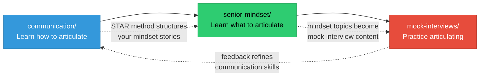
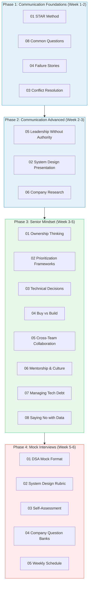

# Behavioral Interview Prep

A structured guide to mastering the behavioral and soft-skills side of senior/staff engineering interviews. This section covers 20 topics across 3 sub-sections: how to communicate effectively, how to think like a senior engineer, and how to perform in mock interview settings.

---

## Visual Overview

```mermaid
graph TB
    BH["Behavioral Interview Prep<br/>20 Topics | 3 Sub-sections"]

    BH --> CM["communication/<br/>7 Topics"]
    BH --> SM["senior-mindset/<br/>8 Topics"]
    BH --> MI["mock-interviews/<br/>5 Topics"]

    CM --> CM1["STAR Method"]
    CM --> CM2["System Design Presentation"]
    CM --> CM3["Conflict Resolution"]
    CM --> CM4["Failure Stories"]
    CM --> CM5["Leadership Without Authority"]
    CM --> CM6["Company Research"]
    CM --> CM7["Common Questions"]

    SM --> SM1["Ownership Thinking"]
    SM --> SM2["Prioritization Frameworks"]
    SM --> SM3["Technical Decisions"]
    SM --> SM4["Buy vs Build"]
    SM --> SM5["Cross-Team Collaboration"]
    SM --> SM6["Mentorship & Culture"]
    SM --> SM7["Managing Tech Debt"]
    SM --> SM8["Saying No with Data"]

    MI --> MI1["DSA Mock Format"]
    MI --> MI2["System Design Rubric"]
    MI --> MI3["Self-Assessment"]
    MI --> MI4["Company Question Banks"]
    MI --> MI5["Weekly Schedule"]

    style BH fill:#1a1a2e,stroke:#e94560,color:#eee
    style CM fill:#3498db,stroke:#2980b9,color:#fff
    style SM fill:#2ecc71,stroke:#27ae60,color:#000
    style MI fill:#e74c3c,stroke:#c0392b,color:#fff
    style CM1 fill:#2980b9,stroke:#1f6dad,color:#fff
    style CM2 fill:#2980b9,stroke:#1f6dad,color:#fff
    style CM3 fill:#2980b9,stroke:#1f6dad,color:#fff
    style CM4 fill:#2980b9,stroke:#1f6dad,color:#fff
    style CM5 fill:#2980b9,stroke:#1f6dad,color:#fff
    style CM6 fill:#2980b9,stroke:#1f6dad,color:#fff
    style CM7 fill:#2980b9,stroke:#1f6dad,color:#fff
    style SM1 fill:#27ae60,stroke:#1e8449,color:#fff
    style SM2 fill:#27ae60,stroke:#1e8449,color:#fff
    style SM3 fill:#27ae60,stroke:#1e8449,color:#fff
    style SM4 fill:#27ae60,stroke:#1e8449,color:#fff
    style SM5 fill:#27ae60,stroke:#1e8449,color:#fff
    style SM6 fill:#27ae60,stroke:#1e8449,color:#fff
    style SM7 fill:#27ae60,stroke:#1e8449,color:#fff
    style SM8 fill:#27ae60,stroke:#1e8449,color:#fff
    style MI1 fill:#c0392b,stroke:#a93226,color:#fff
    style MI2 fill:#c0392b,stroke:#a93226,color:#fff
    style MI3 fill:#c0392b,stroke:#a93226,color:#fff
    style MI4 fill:#c0392b,stroke:#a93226,color:#fff
    style MI5 fill:#c0392b,stroke:#a93226,color:#fff
```

### Study Flow

---

## Sub-section 1: Communication (7 Topics)

> Master the frameworks and techniques for articulating your experience, handling difficult conversations, and presenting yourself effectively in interviews.

| # | Topic | Link | Focus Area |
|---|-------|------|------------|
| 01 | STAR Method | [01-star-method.md](./communication/01-star-method.md) | Structuring behavioral answers with Situation, Task, Action, Result |
| 02 | System Design Presentation | [02-system-design-presentation.md](./communication/02-system-design-presentation.md) | How to walk through a design clearly and confidently |
| 03 | Conflict Resolution | [03-conflict-resolution.md](./communication/03-conflict-resolution.md) | Handling disagreements with teammates, managers, and stakeholders |
| 04 | Failure Stories | [04-failure-stories.md](./communication/04-failure-stories.md) | Framing mistakes as growth -- what you learned and changed |
| 05 | Leadership Without Authority | [05-leadership-without-authority.md](./communication/05-leadership-without-authority.md) | Influencing outcomes without direct reports or formal power |
| 06 | Company Research | [06-company-research.md](./communication/06-company-research.md) | Preparing company-specific answers and demonstrating genuine interest |
| 07 | Common Questions | [08-common-questions.md](./communication/08-common-questions.md) | Answers for "tell me about yourself", "why this company", etc. |

---

## Sub-section 2: Senior Mindset (8 Topics)

> The strategic thinking patterns and decision-making skills that distinguish senior and staff engineers. These are the stories and principles you need to demonstrate in behavioral rounds.

| # | Topic | Link | Focus Area | Priority |
|---|-------|------|------------|----------|
| 01 | Ownership Thinking | [concepts.md](./senior-mindset/01-ownership-thinking.md) | Scope progression, accountability, IC vs team ownership | High |
| 02 | Prioritization Frameworks | [concepts.md](./senior-mindset/02-prioritization-frameworks.md) | ICE, RICE, Eisenhower, effort-impact matrix | High |
| 03 | Technical Decisions | [concepts.md](./senior-mindset/03-technical-decisions.md) | ADRs, RFCs, one-way vs two-way doors | High |
| 04 | Buy vs Build | [concepts.md](./senior-mindset/04-buy-vs-build.md) | TCO analysis, vendor lock-in, core vs commodity | Medium |
| 05 | Cross-Team Collaboration | [concepts.md](./senior-mindset/05-cross-team-collaboration.md) | API contracts, async communication, dependencies | High |
| 06 | Mentorship & Culture | [concepts.md](./senior-mindset/06-mentorship-culture.md) | Code review, onboarding, knowledge sharing | Medium |
| 07 | Managing Tech Debt | [concepts.md](./senior-mindset/07-managing-tech-debt.md) | Debt quadrant, quantifying impact, refactoring strategies | High |
| 08 | Saying No with Data | [concepts.md](./senior-mindset/08-saying-no-with-data.md) | Yes-and technique, negotiation, managing up | High |

**Sub-section README:** [senior-mindset/00-README.md](./senior-mindset/00-README.md)

---

## Sub-section 3: Mock Interviews (5 Topics)

> Structured practice formats, evaluation rubrics, and scheduling to simulate real interview conditions across all pillars.

| # | Topic | Link | Focus Area |
|---|-------|------|------------|
| 01 | DSA Mock Format | [01-dsa-mock-format.md](./mock-interviews/01-dsa-mock-format.md) | Timed coding sessions with interviewer simulation |
| 02 | System Design Rubric | [02-system-design-rubric.md](./mock-interviews/02-system-design-rubric.md) | Evaluation criteria for system design practice |
| 03 | Self-Assessment | [03-self-assessment.md](./mock-interviews/03-self-assessment.md) | Identifying strengths, weaknesses, and improvement areas |
| 04 | Company Question Banks | [04-company-question-banks/](./mock-interviews/04-company-question-banks/) | Company-specific question collections and patterns |
| 05 | Weekly Schedule | [05-weekly-schedule.md](./mock-interviews/05-weekly-schedule.md) | Structured weekly mock interview rotation plan |

---

## Recommended Study Order

Study in this sequence: communication skills first (so you can articulate well), then senior mindset (so you have substance to articulate), then mock interviews (to practice everything together).

### Why This Order

1. **STAR Method first** -- this is the structural framework for every behavioral answer you will give. Learn it before preparing any stories.
2. **Common Questions and Failure Stories early** -- these are asked in every single interview. Have polished answers ready.
3. **Conflict Resolution and Leadership** -- frequently asked at senior level and require practiced delivery.
4. **System Design Presentation** -- bridges communication and technical skills.
5. **Company Research** -- practical skills best prepared closer to actual interviews.
6. **Senior Mindset topics** -- these are the substance behind your stories. Study them after you know how to structure answers.
7. **Mock Interviews last** -- only valuable once you have communication skills and mindset content to practice with.

---

## Progress Tracker

### Communication

| # | Topic | Read | Notes | Stories Prepared | Practice | Confident |
|---|-------|:----:|:-----:|:----------------:|:--------:|:---------:|
| 01 | STAR Method | [ ] | [ ] | [ ] | [ ] | [ ] |
| 02 | System Design Presentation | [ ] | [ ] | [ ] | [ ] | [ ] |
| 03 | Conflict Resolution | [ ] | [ ] | [ ] | [ ] | [ ] |
| 04 | Failure Stories | [ ] | [ ] | [ ] | [ ] | [ ] |
| 05 | Leadership Without Authority | [ ] | [ ] | [ ] | [ ] | [ ] |
| 06 | Company Research | [ ] | [ ] | [ ] | [ ] | [ ] |
| 07 | Common Questions | [ ] | [ ] | [ ] | [ ] | [ ] |

### Senior Mindset

| # | Topic | Read | Notes | Stories Prepared | Mock Practice | Confident |
|---|-------|:----:|:-----:|:----------------:|:-------------:|:---------:|
| 01 | Ownership Thinking | [ ] | [ ] | [ ] | [ ] | [ ] |
| 02 | Prioritization Frameworks | [ ] | [ ] | [ ] | [ ] | [ ] |
| 03 | Technical Decisions | [ ] | [ ] | [ ] | [ ] | [ ] |
| 04 | Buy vs Build | [ ] | [ ] | [ ] | [ ] | [ ] |
| 05 | Cross-Team Collaboration | [ ] | [ ] | [ ] | [ ] | [ ] |
| 06 | Mentorship & Culture | [ ] | [ ] | [ ] | [ ] | [ ] |
| 07 | Managing Tech Debt | [ ] | [ ] | [ ] | [ ] | [ ] |
| 08 | Saying No with Data | [ ] | [ ] | [ ] | [ ] | [ ] |

### Mock Interviews

| # | Topic | Read | Setup Done | First Run | Second Run | Confident |
|---|-------|:----:|:----------:|:---------:|:----------:|:---------:|
| 01 | DSA Mock Format | [ ] | [ ] | [ ] | [ ] | [ ] |
| 02 | System Design Rubric | [ ] | [ ] | [ ] | [ ] | [ ] |
| 03 | Self-Assessment | [ ] | [ ] | [ ] | [ ] | [ ] |
| 04 | Company Question Banks | [ ] | [ ] | [ ] | [ ] | [ ] |
| 05 | Weekly Schedule | [ ] | [ ] | [ ] | [ ] | [ ] |

---

## Summary

| Sub-section | Topics | Est. Study Time |
|-------------|:------:|:---------------:|
| Communication | 7 | ~2 weeks |
| Senior Mindset | 8 | ~2 weeks |
| Mock Interviews | 5 | ~2 weeks (ongoing) |
| **Total** | **20** | **~6 weeks** |
