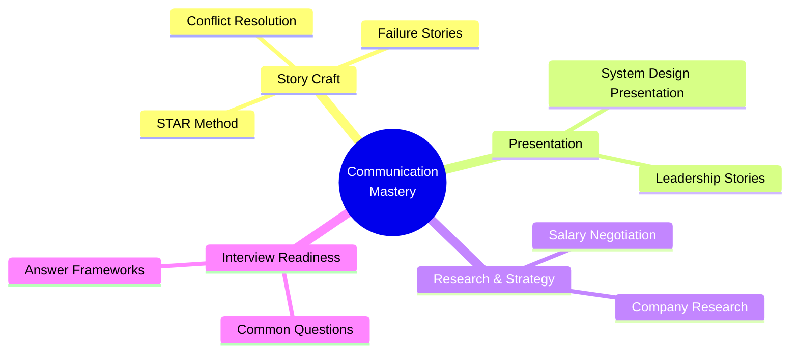
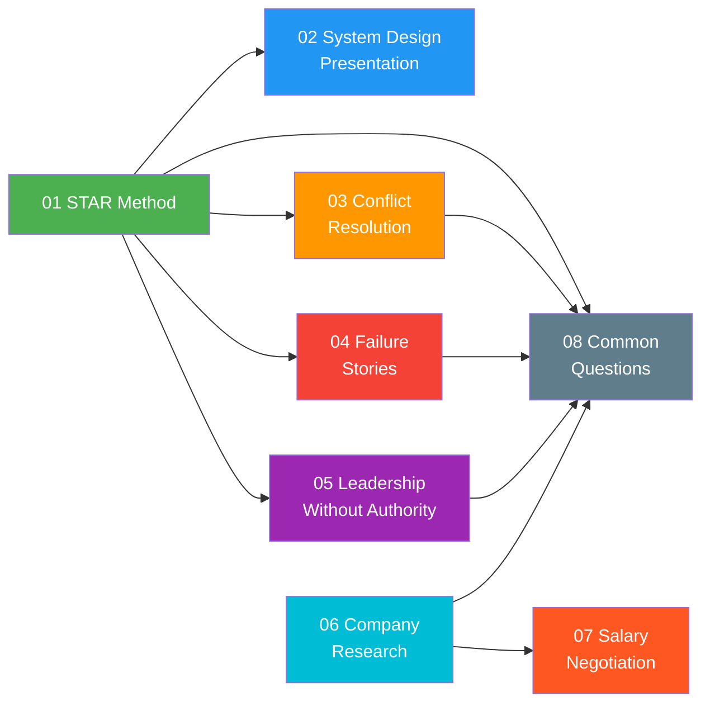
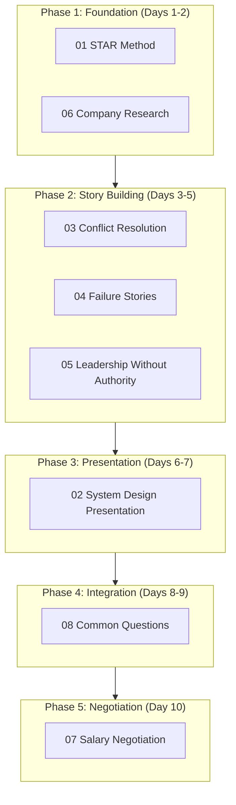

# Communication & Behavioral Interview Preparation

## Overview

This module covers the complete spectrum of behavioral interview preparation for senior and staff-level engineering roles. From structuring stories using the STAR method to negotiating compensation, each topic builds on the previous to create a comprehensive communication toolkit.

## Topic Map & Dependencies

## Study Order

| Phase | Days | Topics | Focus |
|-------|------|--------|-------|
| **Phase 1: Foundation** | 1-2 | STAR Method, Company Research | Learn story structure + research habits |
| **Phase 2: Story Building** | 3-5 | Conflict, Failure, Leadership stories | Build your personal story bank |
| **Phase 3: Presentation** | 6-7 | System Design Presentation | Practice presenting technical ideas |
| **Phase 4: Integration** | 8-9 | Common Questions | Apply stories to real questions |
| **Phase 5: Negotiation** | 10 | Salary Negotiation | Prepare for offer stage |

## Topic Reference Table

| # | Topic | Key Frameworks | Stories to Prepare | Time to Study |
|---|-------|---------------|-------------------|---------------|
| 01 | STAR Method | STAR, CAR, SOAR | 6 skeleton templates | 3-4 hours |
| 02 | System Design Presentation | 45-min breakdown, Communication matrix | 2-3 design walkthroughs | 4-5 hours |
| 03 | Conflict Resolution | Thomas-Kilmann, DESC | 4 story templates | 3-4 hours |
| 04 | Failure Stories | Failure Arc, Recovery Framework | 4 story templates | 3-4 hours |
| 05 | Leadership Without Authority | Influence Model, Credibility Loop | 3-4 story templates | 3-4 hours |
| 06 | Company Research | Research Checklist, Value Mapping | "Why this company?" script | 2-3 hours per company |
| 07 | Salary Negotiation | BATNA, CTC Decoder, Counter-offer scripts | Negotiation role-play | 3-4 hours |
| 08 | Common Questions | 25-30 questions with frameworks | Rehearse top 15 | 5-6 hours |

## Progress Tracker

| # | Topic | Read | Notes Made | Stories Written | Mock Practice | Confident? |
|---|-------|------|-----------|----------------|--------------|------------|
| 01 | STAR Method | [ ] | [ ] | [ ] | [ ] | [ ] |
| 02 | System Design Presentation | [ ] | [ ] | [ ] | [ ] | [ ] |
| 03 | Conflict Resolution | [ ] | [ ] | [ ] | [ ] | [ ] |
| 04 | Failure Stories | [ ] | [ ] | [ ] | [ ] | [ ] |
| 05 | Leadership Without Authority | [ ] | [ ] | [ ] | [ ] | [ ] |
| 06 | Company Research | [ ] | [ ] | [ ] | [ ] | [ ] |
| 07 | Salary Negotiation | [ ] | [ ] | [ ] | [ ] | [ ] |
| 08 | Common Questions | [ ] | [ ] | [ ] | [ ] | [ ] |

## How to Use This Module

1. **Read each concepts.md** in the study order above
2. **Fill in story templates** with your real experiences -- authenticity matters
3. **Practice out loud** -- behavioral answers must sound natural, not rehearsed
4. **Record yourself** answering 2-3 questions per session and review
5. **Mock interviews** with a friend or use the frameworks to self-evaluate
6. **Before each interview**, revisit Company Research and tailor your stories

## General Tips

- **2-minute rule**: Keep each STAR story under 2 minutes when spoken aloud
- **Quantify everything**: "Improved performance by 40%" beats "made things faster"
- **Be specific**: Name the technology, the team size, the timeline
- **Show growth**: Every story should demonstrate what you learned
- **Tailor stories**: Map your stories to the company's stated values
- **Prepare 8-10 stories**: Most questions can be answered by remixing a small set of well-prepared stories
