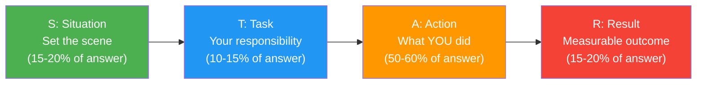
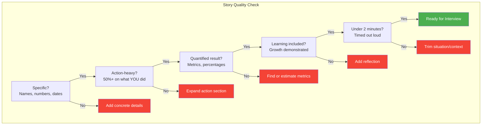
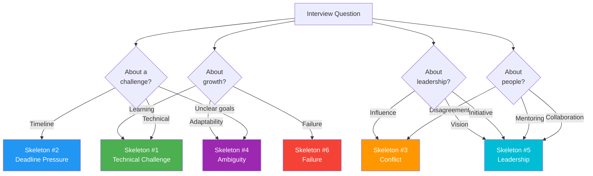

# STAR Method: Templates & Customizable Story Skeletons

## What is the STAR Method?

The STAR method is a structured approach to answering behavioral interview questions by describing a **Situation**, **Task**, **Action**, and **Result**. It forces clarity, keeps answers concise, and ensures you demonstrate impact.

## STAR vs Other Frameworks

| Framework | Components | Best For | Weakness |
|-----------|-----------|----------|----------|
| **STAR** | Situation, Task, Action, Result | General behavioral questions | Can feel rigid |
| **CAR** | Challenge, Action, Result | Concise answers, time pressure | Skips context |
| **SOAR** | Situation, Obstacle, Action, Result | Emphasizing difficulty overcome | May over-dramatize |
| **STAR+L** | STAR + Learning | Failure/growth questions | Adds length |
| **PAR** | Problem, Action, Result | Technical problem-solving | Lacks role clarity |

## Detailed STAR Template

### Situation (15-20% of your answer, ~20 seconds)

**Purpose**: Set the context so the interviewer understands the stakes.

**Include**:
- Company/team context (without naming confidential details)
- Timeline and scale (team size, user base, revenue impact)
- Why this situation mattered

**Template**:
> "At [Company], I was working on [team/project] that served [scale]. We were facing [specific challenge] which was [why it mattered -- business impact, user impact, team impact]."

**Avoid**:
- Too much background (keep it under 3 sentences)
- Irrelevant details about the company
- Starting with "So basically..."

### Task (10-15% of your answer, ~10 seconds)

**Purpose**: Clarify YOUR specific responsibility versus the team's.

**Template**:
> "As the [your role], I was responsible for [specific ownership]. The expectation was [what success looked like] within [timeline]."

**Key principle**: Use "I" not "we" -- interviewers want to know YOUR contribution.

### Action (50-60% of your answer, ~60-90 seconds)

**Purpose**: This is the core. Describe what you did, how you thought, and why you made specific choices.

**Structure your actions in 3-4 steps**:
1. **Assessment**: How did you analyze the problem?
2. **Decision**: What approach did you choose and why?
3. **Execution**: How did you implement it?
4. **Collaboration**: Who did you involve and how?

**Template**:
> "First, I [assessed/analyzed] the situation by [specific method]. I identified [key insight]. Based on this, I decided to [approach] because [reasoning]. I then [specific actions -- 2-3 concrete steps]. Throughout this, I collaborated with [who] by [how]."

**Power phrases**:
- "I identified the root cause as..."
- "I proposed an alternative approach..."
- "I facilitated a discussion to align on..."
- "I took ownership of..."
- "I measured the impact by..."

### Result (15-20% of your answer, ~20 seconds)

**Purpose**: Quantify your impact and share what you learned.

**Template**:
> "As a result, [quantified outcome -- percentage, time saved, revenue, users]. This led to [broader impact]. Looking back, I learned [key takeaway] which I've since applied to [subsequent situation]."

**Quantification examples**:
| Vague | Strong |
|-------|--------|
| "It worked well" | "Reduced latency by 40% from 200ms to 120ms" |
| "The team was happy" | "NPS score improved from 6.2 to 8.7" |
| "We shipped it faster" | "Delivered 2 weeks ahead of schedule" |
| "Fewer bugs" | "Production incidents dropped from 5/month to 1/month" |
| "Better performance" | "Handled 10x traffic increase without scaling costs" |

## The STAR Quality Checklist

---

## 6 Customizable Story Skeletons

### Story Skeleton #1: Technical Challenge

**Best for questions like**: "Tell me about a difficult technical problem you solved", "Describe a time you had to learn something quickly"

**Situation**:
> "On [team/project] at [Company], we were building [system/feature] that needed to handle [scale/constraint]. We hit a critical blocker: [specific technical problem -- e.g., performance bottleneck, data consistency issue, scaling limitation]. This was blocking [business impact -- e.g., a product launch, client onboarding, revenue target]."

**Task**:
> "As the [role -- e.g., senior engineer, tech lead], I owned [specific area]. I needed to [solve X] within [timeline] while ensuring [constraint -- e.g., no downtime, backward compatibility, budget limit]."

**Action** (fill in 3-4 of these):
> - "I started by [investigation method -- profiling, reading source code, setting up monitoring] and discovered [root cause/key insight]."
> - "I evaluated [N] approaches: [option A -- tradeoff], [option B -- tradeoff], [option C -- tradeoff]."
> - "I chose [approach] because [reasoning tied to constraints]."
> - "I implemented [specific technical steps -- designed the schema, wrote the migration, built the cache layer]."
> - "I validated the solution by [testing strategy -- load testing, canary deployment, A/B test]."
> - "I documented [what] and shared knowledge through [how -- RFC, tech talk, runbook]."

**Result**:
> "The solution [quantified improvement -- e.g., reduced query time from 3s to 200ms, handled 10x traffic]. Beyond the immediate fix, [broader impact -- became a pattern adopted by other teams, prevented similar issues]. I learned [technical or process lesson]."

**Your story notes** (fill in with your real experience):
- Company/Team: ___
- Technical problem: ___
- Your role: ___
- Key actions (3-4): ___
- Quantified result: ___
- Learning: ___

---

### Story Skeleton #2: Deadline Pressure

**Best for questions like**: "Tell me about a time you had to deliver under a tight deadline", "How do you handle pressure?"

**Situation**:
> "At [Company], our team was [project context]. With [time remaining -- e.g., 3 weeks left], we discovered [complication -- scope increase, key person leaving, dependency failure, requirements change] that put the [deliverable] at serious risk. The deadline was [why it was immovable -- contract, product launch, regulatory]."

**Task**:
> "I was responsible for [your specific deliverables]. The challenge was [what made it hard -- technical complexity, coordination across teams, unknown unknowns]. Missing the deadline would mean [business consequence]."

**Action** (fill in 3-4 of these):
> - "I immediately [first response -- assessed the gap, created a revised plan, called a meeting]."
> - "I prioritized ruthlessly by [method -- MoSCoW, impact/effort matrix] and identified [what could be cut/deferred] versus [what was essential]."
> - "I negotiated with [stakeholder] to [scope adjustment, resource addition, process change]."
> - "I personally took on [extra work] by [how -- pair programming, working focused sprints, automating manual steps]."
> - "I removed blockers for the team by [specific action -- unblocking CI, getting quick approvals, writing shared utilities]."
> - "I communicated progress daily to [stakeholders] through [method -- stand-up, status email, dashboard]."

**Result**:
> "We delivered [what] by [deadline]. Specifically, [quantified outcome]. The stakeholder response was [reaction]. From this experience, I [process improvement or personal growth]. I later [how you applied the learning -- implemented buffer time in estimates, created risk assessment templates]."

**Your story notes**:
- Company/Team: ___
- The deadline situation: ___
- What complicated it: ___
- Key actions (3-4): ___
- Outcome: ___
- Learning: ___

---

### Story Skeleton #3: Conflict

**Best for questions like**: "Tell me about a disagreement with a colleague", "How do you handle differing opinions?"

**Situation**:
> "On [project] at [Company], [colleague's role -- e.g., another senior engineer, product manager, engineering manager] and I had a significant disagreement about [specific topic -- technical approach, priority, architecture decision]. The stakes were [why it mattered -- affected system reliability, user experience, team velocity]. We were [context -- in a design review, planning sprint, responding to incident]."

**Task**:
> "As [your role], I needed to [your goal] while maintaining [relationship, team morale, project timeline]. Simply overriding the other perspective wasn't an option because [reason -- they had valid points, they owned that area, we needed buy-in]."

**Action** (fill in 3-4 of these):
> - "I first made sure I fully understood their perspective by [method -- asked clarifying questions, restated their position, requested data]."
> - "I acknowledged the merits of their approach, specifically [what was valid about their view]."
> - "I presented my concerns with data: [specific evidence -- benchmarks, case studies, production metrics]."
> - "I proposed [compromise or alternative] that incorporated [their concern] while addressing [your concern]."
> - "We agreed to [resolution method -- prototype both, time-boxed experiment, bring in a third opinion, decision matrix]."
> - "I followed up by [action to maintain relationship -- giving credit, checking in, documenting the decision]."

**Result**:
> "We ultimately [outcome -- adopted approach X, found a hybrid solution]. The result was [quantified impact]. More importantly, [relationship outcome -- strengthened working relationship, established better decision process]. I learned [lesson about collaboration, communication, technical humility]."

**Your story notes**:
- Company/Team: ___
- Who and what the disagreement was about: ___
- Why it mattered: ___
- How you resolved it: ___
- Outcome: ___
- Relationship result: ___

---

### Story Skeleton #4: Ambiguity

**Best for questions like**: "Tell me about a time you dealt with ambiguity", "How do you handle unclear requirements?"

**Situation**:
> "At [Company], I was assigned to [project/initiative] where [what was ambiguous -- requirements were vague, success metrics undefined, technology unproven, stakeholders had conflicting visions]. The team was [state -- blocked, confused, waiting for direction]. We had [constraint -- timeline, budget, team size] and [what was at stake]."

**Task**:
> "As [role], I needed to [objective -- create clarity, define the path forward, make progress despite uncertainty]. No one was going to hand me a clear spec -- I had to [create structure, define scope, build consensus]."

**Action** (fill in 3-4 of these):
> - "I started by [research method -- interviewing stakeholders, analyzing user data, studying similar systems, reading industry papers]."
> - "I identified the key uncertainties: [list 2-3 specific unknowns]."
> - "I created [structure -- a proposal document, a decision matrix, a prototype, a spike ticket] to make the ambiguity concrete and discussable."
> - "I organized [meeting/workshop] with [stakeholders] to align on [priorities, success criteria, constraints]."
> - "I proposed an incremental approach: [how you broke the big ambiguous problem into smaller, testable chunks]."
> - "I established [feedback mechanism -- weekly check-ins, metrics dashboard, user testing cadence] to validate assumptions early."

**Result**:
> "By [what you created -- the framework, the roadmap, the prototype], the team was able to [move forward, deliver X, validate the hypothesis]. We [quantified outcome]. The approach I established [lasting impact -- became the template for future ambiguous projects, was adopted by other teams]. I learned [lesson about dealing with uncertainty]."

**Your story notes**:
- Company/Team: ___
- What was ambiguous: ___
- How you created clarity: ___
- Key actions: ___
- Outcome: ___
- Learning: ___

---

### Story Skeleton #5: Leadership

**Best for questions like**: "Tell me about a time you led a team", "Describe a time you mentored someone", "How do you influence without authority?"

**Situation**:
> "At [Company], [context -- a new initiative needed a champion, the team was struggling with X, a cross-functional effort needed coordination]. There was no formal leader assigned, and [consequence if no one stepped up -- project would stall, quality would degrade, opportunity would be missed]. The scope involved [scale -- N teams, N engineers, N month timeline]."

**Task**:
> "I saw an opportunity to [what you wanted to achieve] and decided to step up as [informal role -- technical lead, initiative owner, mentor]. My goal was to [specific outcome] by [method -- building consensus, creating a plan, mentoring the team]."

**Action** (fill in 3-4 of these):
> - "I created [vision artifact -- RFC, proposal, roadmap, design doc] to articulate the direction and get buy-in from [stakeholders]."
> - "I built a coalition by [method -- 1:1 conversations with key people, presenting at team meetings, demonstrating a prototype]."
> - "I organized the work by [method -- breaking into workstreams, creating a project plan, setting milestones]."
> - "I mentored [who] by [method -- pair programming, regular 1:1s, code reviews, creating learning resources]."
> - "I handled resistance from [who] by [method -- understanding their concerns, finding common ground, adjusting the approach]."
> - "I kept momentum by [method -- celebrating wins, removing blockers, maintaining visibility with leadership]."

**Result**:
> "The initiative [outcome -- shipped successfully, was adopted org-wide, achieved target metrics]. Specifically, [quantified result]. The team [team impact -- grew skills, improved velocity, developed new capabilities]. [Personal recognition -- was promoted, was asked to lead more initiatives, received peer feedback]. I learned [leadership lesson]."

**Your story notes**:
- Company/Team: ___
- The leadership opportunity: ___
- How you stepped up: ___
- Key actions: ___
- Outcome: ___
- What you learned about leadership: ___

---

### Story Skeleton #6: Failure

**Best for questions like**: "Tell me about a time you failed", "Describe a mistake you made", "What's your biggest professional regret?"

**Situation**:
> "At [Company], I was working on [project/task] that was [context -- critical, high-visibility, complex]. The environment was [relevant context -- fast-paced, understaffed, new technology]. I was [your role and responsibility]."

**Task**:
> "I needed to [objective]. The expectation was [what success looked like]. There were [constraints or pressures that contributed to the failure -- tight deadline, unfamiliar domain, overconfidence]."

**Action (The Mistake)**:
> - "I [the specific mistake -- skipped testing, didn't consult stakeholders, made an assumption, over-engineered]."
> - "The root cause was [honest self-reflection -- I was overconfident, I prioritized speed over quality, I didn't ask for help, I didn't validate assumptions]."
> - "The impact was [what went wrong -- outage, missed deadline, rework, lost trust]."

**Action (The Recovery)**:
> - "When I realized the issue, I immediately [first response -- took ownership, communicated to stakeholders, started incident response]."
> - "I [recovery steps -- fixed the immediate problem, did root cause analysis, communicated transparently]."
> - "I [prevention steps -- created safeguards, updated processes, shared learnings with the team]."

**Result**:
> "While the initial failure [impact -- cost X hours, delayed by Y days], the recovery [positive outcome]. More importantly, I [systemic improvement -- implemented process X, created template Y, established practice Z] that prevented similar issues. I fundamentally changed [personal behavior or mindset] -- now I always [new habit]. This experience taught me [growth lesson]."

**Your story notes**:
- Company/Team: ___
- The failure: ___
- Root cause (honest): ___
- How you recovered: ___
- What you changed: ___
- The learning: ___

---

## Story Selection Matrix

Use this to pick the right story for different question types:

## Common Question-to-Skeleton Mapping

| Question | Primary Skeleton | Backup Skeleton |
|----------|-----------------|-----------------|
| "Tell me about a difficult bug" | #1 Technical Challenge | #6 Failure |
| "How do you handle tight deadlines?" | #2 Deadline Pressure | #5 Leadership |
| "Describe a disagreement with a coworker" | #3 Conflict | #5 Leadership |
| "How do you deal with ambiguity?" | #4 Ambiguity | #1 Technical Challenge |
| "Tell me about a time you led a project" | #5 Leadership | #2 Deadline Pressure |
| "What's your biggest failure?" | #6 Failure | #3 Conflict |
| "How do you prioritize?" | #2 Deadline Pressure | #4 Ambiguity |
| "Tell me about a time you influenced a decision" | #5 Leadership | #3 Conflict |
| "Describe a time you went above and beyond" | #1 Technical Challenge | #5 Leadership |
| "Tell me about a time you had to learn quickly" | #1 Technical Challenge | #4 Ambiguity |

---

## Interview Q&A

> **Q1: How long should a STAR answer be?**
> **A**: Aim for 1.5 to 2 minutes when spoken aloud. Under 1 minute feels thin; over 2.5 minutes loses the interviewer. The action section should take 50-60% of the time. Practice with a timer.

> **Q2: Should I always use the exact STAR structure?**
> **A**: No. STAR is a mental scaffold, not a script. Your answer should flow naturally. The interviewer should not be able to tell you are following a formula. The key is ensuring all four elements are present -- the order can flex. Sometimes starting with the result as a hook works well: "I reduced our deploy time by 80%. Here's how..."

> **Q3: What if I don't have a quantified result?**
> **A**: Estimate reasonably. "I estimate we saved about 5 hours per week of manual work" is better than "it was helpful." You can also use qualitative results: "The VP of Engineering adopted our approach as the standard for all teams." If truly no result, focus on what you learned and how you applied it.

> **Q4: Can I use the same story for multiple questions?**
> **A**: Yes, but angle it differently. A conflict story can be reframed as a leadership story or a communication story depending on which actions you emphasize. Prepare 8-10 strong stories and practice remixing them. Just avoid telling the exact same story twice in one interview loop.

> **Q5: What if the interviewer interrupts with follow-up questions?**
> **A**: This is good -- it means they are engaged. Answer the follow-up concisely, then offer to continue: "Would you like me to finish walking through the outcome?" Stay flexible. The STAR structure helps you resume from any point.

> **Q6: How do I handle "Tell me about a time when..." if I genuinely haven't experienced that exact scenario?**
> **A**: Use the closest analogous experience and bridge it: "I haven't faced that exact situation, but a closely related challenge was..." Then tell your story. Alternatively, describe how you would approach it hypothetically -- but always try the real story first. Fabricating stories is risky and experienced interviewers will probe inconsistencies.

---

## Practice Checklist

- [ ] Write out all 6 story skeletons with your real experiences
- [ ] Time each story -- aim for 90-120 seconds spoken
- [ ] Practice each story 3 times out loud (not in your head)
- [ ] Record yourself once and listen back for filler words
- [ ] Have a friend ask you unexpected questions and practice pivoting stories
- [ ] For each story, prepare 2-3 follow-up answers the interviewer might ask
