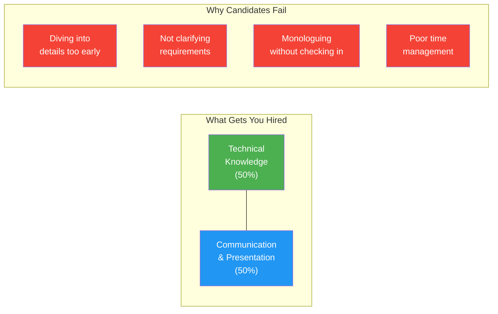
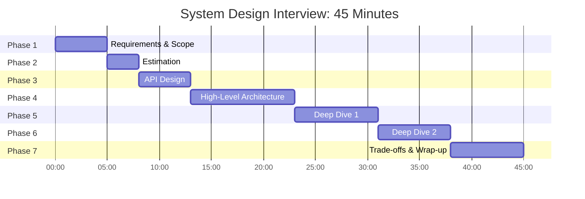
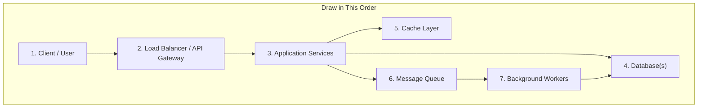
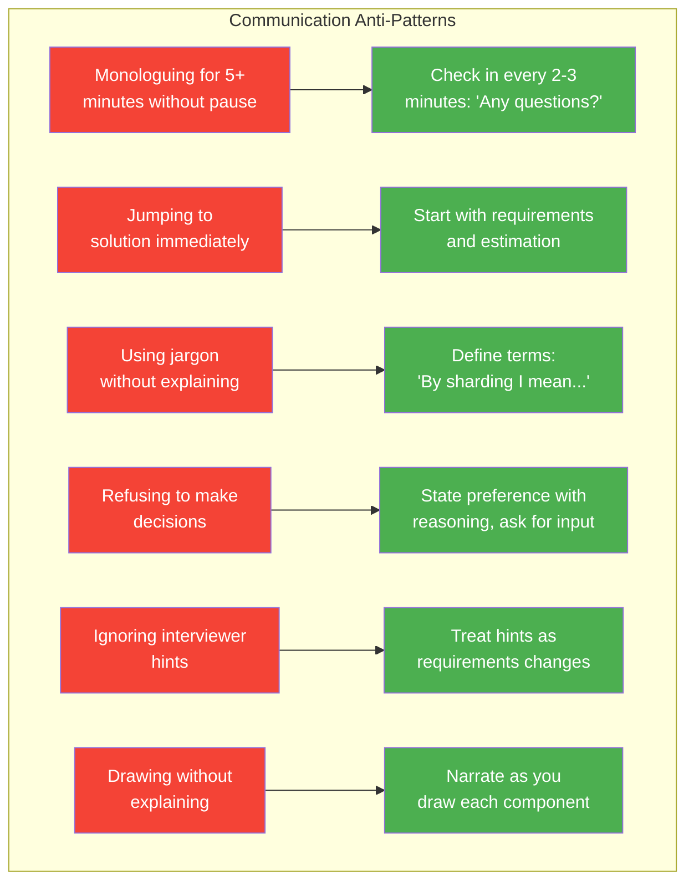

# System Design Interview Presentation: 45-Minute Minute-by-Minute Breakdown

## Why Presentation Matters in System Design

System design interviews test two things equally: your technical depth and your ability to communicate complex ideas clearly. Many candidates with strong technical skills fail because they cannot articulate their thinking, manage time, or engage the interviewer as a collaborator.



## The 45-Minute Breakdown



| Phase | Time | Duration | Goal | Signal You Send |
|-------|------|----------|------|-----------------|
| 1. Requirements & Scope | 0:00 - 5:00 | 5 min | Define what you are building | "I scope problems before jumping in" |
| 2. Estimation | 5:00 - 8:00 | 3 min | Quantify scale constraints | "I think about numbers and capacity" |
| 3. API Design | 8:00 - 13:00 | 5 min | Define the interface | "I think about contracts and users first" |
| 4. High-Level Architecture | 13:00 - 23:00 | 10 min | Draw the system | "I can design end-to-end systems" |
| 5. Deep Dive #1 | 23:00 - 31:00 | 8 min | Go deep on a key component | "I have depth, not just breadth" |
| 6. Deep Dive #2 | 31:00 - 38:00 | 7 min | Go deep on another component | "I can handle complexity" |
| 7. Trade-offs & Wrap-up | 38:00 - 45:00 | 7 min | Discuss alternatives and extensions | "I think critically and holistically" |

---

## Phase 1: Requirements & Scope (0:00 - 5:00)

### What to Do

1. **Restate the problem** in your own words to confirm understanding
2. **Ask functional requirements** (what the system does)
3. **Ask non-functional requirements** (how well it does it)
4. **Define scope** -- what you will and will not cover

### Functional Requirements Checklist

Ask about the core features. Aim for 3-5 key requirements.

| Category | Example Questions |
|----------|------------------|
| Core user actions | "What are the primary user actions?" |
| Data flow | "Is this read-heavy or write-heavy?" |
| Consistency | "Does the user need to see updates immediately?" |
| Users/actors | "Who are the different types of users?" |
| Edge cases | "Do we need to handle [specific edge case]?" |

### Non-Functional Requirements Checklist

| Requirement | What to Ask | Why It Matters |
|-------------|-------------|----------------|
| Scale | "How many users? DAU/MAU?" | Drives architecture choices |
| Latency | "What's acceptable response time?" | Affects caching, CDN, DB choice |
| Availability | "What's our uptime target? 99.9%? 99.99%?" | Drives redundancy design |
| Consistency | "Strong consistency or eventual?" | Affects DB and queue choices |
| Durability | "Can we ever lose data?" | Affects storage and backup |
| Geography | "Global or single region?" | Affects CDN, replication |

### Communication Script

> "Before I start designing, let me make sure I understand the problem correctly. We're building [restate problem]. Let me clarify a few requirements..."

> [After asking questions]: "Great. So to summarize, I'll focus on [2-3 core features] for a system that handles [scale], with [latency/consistency requirements]. I'll set aside [out of scope items] for now. Does that sound right?"

### Common Mistakes in Phase 1

| Mistake | Fix |
|---------|-----|
| Spending 10+ minutes on requirements | Timebox to 5 minutes, move on with assumptions |
| Not asking about scale | Always ask -- it changes everything |
| Assuming requirements | State assumptions explicitly: "I'll assume X, let me know if that's wrong" |
| Being too detailed too early | Stay at feature level, not implementation level |

---

## Phase 2: Estimation (5:00 - 8:00)

### What to Do

1. Estimate traffic (QPS for reads and writes)
2. Estimate storage (per item size x number of items x retention)
3. Estimate bandwidth (QPS x payload size)

### Estimation Template

```
Users: [N] DAU
Read QPS: [N users] x [actions/day] / 86400 = [X] QPS
Write QPS: [Y] QPS (typically 10-100x less than reads)
Peak QPS: [X] x 3-5 = [peak QPS]

Storage per item: [N] bytes
Items per day: [Y]
Storage/year: [N x Y x 365] = [Z] GB/TB

Bandwidth: [QPS] x [payload size] = [X] MB/s
```

### Communication Script

> "Let me do some quick back-of-envelope calculations to understand the scale we're dealing with..."

> [After estimation]: "So we're looking at roughly [X] QPS for reads, [Y] for writes, and about [Z] TB of storage per year. This tells me we'll need [implication -- sharding, caching, CDN]."

---

## Phase 3: API Design (8:00 - 13:00)

### What to Do

1. Define the core API endpoints (REST or RPC style)
2. Specify request/response shapes
3. Note authentication and rate limiting

### API Design Template

```
POST /api/v1/[resource]
  Request: { field1: type, field2: type }
  Response: { id: string, field1: type, created_at: timestamp }
  Auth: Bearer token
  Rate limit: 100 req/min

GET /api/v1/[resource]/{id}
  Response: { id: string, field1: type, ... }
  Cache: CDN, TTL 60s

GET /api/v1/[resource]?cursor={cursor}&limit={limit}
  Response: { items: [...], next_cursor: string }
```

### Communication Script

> "Let me define the API contract first -- this will clarify the data flow through the system..."

> "I'll use RESTful APIs for simplicity. For the core operations, we need [list endpoints]..."

### API Design Comparison

| Aspect | REST | GraphQL | gRPC |
|--------|------|---------|------|
| Best for | CRUD, public APIs | Complex queries, mobile | Internal microservices |
| When to suggest | Most interview scenarios | Data-fetching-heavy systems | Low latency internal calls |
| Interview signal | Safe, well-understood | Shows modern awareness | Shows systems depth |

---

## Phase 4: High-Level Architecture (13:00 - 23:00)

### What to Do

1. Draw the major components (clients, load balancers, services, databases, caches, queues)
2. Show data flow with arrows
3. Explain each component's purpose
4. Call out key decisions

### Architecture Drawing Order



### Component Decision Table

| Component | Options | When to Use | What to Say |
|-----------|---------|-------------|-------------|
| Load Balancer | L7 (ALB), L4 (NLB) | Always for web services | "I'll add a load balancer for horizontal scaling and health checks" |
| Database | SQL (PostgreSQL), NoSQL (DynamoDB, Cassandra) | SQL for relations; NoSQL for scale | "I'm choosing [X] because [data model reason]" |
| Cache | Redis, Memcached | Read-heavy workloads | "I'll add a cache layer to reduce DB load for hot data" |
| Message Queue | Kafka, SQS, RabbitMQ | Async processing, decoupling | "I'll decouple [X] using a queue for reliability and backpressure" |
| Object Storage | S3 | Media, files, backups | "Large blobs go to object storage, not the DB" |
| CDN | CloudFront, Akamai | Static content, global latency | "Static assets served from CDN for low latency" |
| Search | Elasticsearch, Solr | Full-text search, faceted search | "For search queries, I'll use a dedicated search index" |

### Communication Script

> "Let me draw the high-level architecture. I'll start from the client and work my way through the system..."

> [While drawing each component]: "I'm adding [component] here because [reason]. The data flows from [A] to [B] like this..."

> [After the diagram]: "Let me trace through a typical request to make sure this makes sense end-to-end..."

### Walk Through a Request

Always trace at least one read and one write path through your diagram:

> "When a user [action], the request hits the load balancer, routes to [service], which [checks cache / queries DB / publishes to queue]. The response includes [data] and returns in approximately [latency]."

---

## Phase 5: Deep Dive #1 (23:00 - 31:00)

### How to Choose What to Deep Dive

| Strategy | When |
|----------|------|
| Ask the interviewer | "I can go deep on [A], [B], or [C]. What interests you most?" |
| Pick the hardest part | If no preference, pick the most technically interesting component |
| Pick your strength | Choose what you know best to demonstrate depth |

### Deep Dive Template

1. **State what you are diving into**: "Let me go deeper on [component]"
2. **Explain the challenge**: "The tricky part here is [specific challenge]"
3. **Present options**: "We could approach this with [option A] or [option B]"
4. **Analyze trade-offs**: "Option A gives us [benefit] but costs [drawback]..."
5. **Make a decision**: "I'd go with [choice] because [reason tied to requirements]"
6. **Detail the implementation**: Schemas, algorithms, protocols

### Common Deep Dive Topics

| Topic | What to Cover |
|-------|---------------|
| Database schema | Tables, indexes, partitioning strategy, query patterns |
| Caching strategy | Cache-aside vs write-through, invalidation, TTL, hot key handling |
| Data partitioning | Sharding key choice, consistent hashing, rebalancing |
| Consistency model | Strong vs eventual, conflict resolution, CRDTs |
| Rate limiting | Token bucket, sliding window, distributed rate limiting |
| Notification system | Fan-out, push vs pull, WebSocket vs SSE vs polling |

---

## Phase 6: Deep Dive #2 (31:00 - 38:00)

Same template as Phase 5. Choose a different component. If the interviewer has been guiding you, follow their interest.

### Communication Tips for Deep Dives

- **Check in frequently**: "Does this level of detail make sense? Should I go deeper or move on?"
- **Think out loud**: "I'm considering [X] because [reason]... but actually [Y] might be better because..."
- **Use the whiteboard/editor**: Draw sub-diagrams, write pseudo-code, sketch data models
- **Acknowledge trade-offs**: Never present a solution as perfect

---

## Phase 7: Trade-offs & Wrap-up (38:00 - 45:00)

### What to Cover

1. **Summarize your design** in 2-3 sentences
2. **Acknowledge trade-offs** you made and alternatives you considered
3. **Discuss failure scenarios** and how the system handles them
4. **Mention what you would add** with more time (monitoring, security, etc.)
5. **Answer any remaining questions**

### Trade-off Discussion Framework

| Decision Made | Alternative | Why You Chose This | When You'd Choose the Alternative |
|--------------|-------------|--------------------|---------------------------------|
| SQL database | NoSQL | ACID transactions needed | If we needed horizontal write scaling |
| Synchronous writes | Async via queue | Simplicity, strong consistency | If write latency was less critical |
| Cache-aside pattern | Write-through | Simpler, handles cache misses | If we needed guaranteed cache freshness |

### Extensions to Mention

> "If I had more time, I'd add: monitoring and alerting with [Prometheus/Grafana], rate limiting at the API gateway, circuit breakers between services, and a more robust deployment strategy with canary releases."

### Communication Script

> "Let me step back and summarize the design. We built [system] that handles [scale] with [key architectural decisions]. The main trade-offs are [1-2 key trade-offs]. If we needed to evolve this system, the next steps would be [extensions]."

---

## Communication Anti-Patterns and Fixes



## Interviewer Engagement Techniques

| Technique | Example | When to Use |
|-----------|---------|-------------|
| **Checkpoint** | "Before I continue, does this approach make sense?" | After each phase |
| **Offer choices** | "I can deep dive into X or Y -- which interests you?" | Before deep dives |
| **Think out loud** | "I'm torn between A and B because..." | When making decisions |
| **Acknowledge gaps** | "I'm less familiar with X, but my understanding is..." | When unsure |
| **Redirect** | "That's a great point. Let me adjust the design..." | When interviewer gives feedback |
| **Summarize** | "So far we have X, Y, Z. Next I'll cover..." | Every 10 minutes |

## The Presentation Quality Matrix

| Dimension | Junior Signal | Senior Signal | Staff Signal |
|-----------|--------------|---------------|--------------|
| Scoping | Takes the problem as given | Asks clarifying questions | Identifies hidden requirements and edge cases |
| Trade-offs | Picks one solution | Discusses 2 options | Explains decision framework for choosing |
| Depth | Surface-level description | Detailed component design | Discusses failure modes and operational concerns |
| Communication | Monologues | Checks in with interviewer | Drives a collaborative design session |
| Time | Runs out or rushes | Covers all phases | Adapts depth based on remaining time |

---

## Interview Q&A

> **Q1: What if the interviewer gives me a completely unfamiliar system to design?**
> **A**: Don't panic. The framework works for any system. Start with requirements (what does this system do?), estimate scale, define APIs, draw components. You can say: "I haven't built this exact system, but let me reason through it." Interviewers care about your process, not whether you have memorized the answer.

> **Q2: Should I ask the interviewer what to deep dive on?**
> **A**: Yes. Offering a choice ("I can go deep on the data model, the caching strategy, or the notification system -- what would you like to explore?") shows confidence and respect for the interviewer's interests. If they say "your choice," pick your strongest area.

> **Q3: How do I handle it when the interviewer challenges my design?**
> **A**: Treat it as collaboration, not confrontation. Say: "That's a great point. You're right that [their concern] is a risk. One way to address that is [adjustment]. Alternatively, we could [another option]. What do you think?" Never get defensive.

> **Q4: What if I realize my design has a flaw mid-interview?**
> **A**: Acknowledge it openly. "Actually, I just realized this approach has a problem with [issue]. Let me revise -- I think a better approach would be [fix]." Self-correction is a strong positive signal. It shows you can evaluate your own work critically.

> **Q5: How do I manage time if the interviewer asks many questions early?**
> **A**: Adapt. If requirements discussion takes 10 minutes, compress estimation into 1-2 minutes and simplify the API phase. Always ensure you reach the high-level architecture. Say: "I want to make sure we have time for the full design, so let me move to the architecture."

> **Q6: Should I write actual code during a system design interview?**
> **A**: Generally no, unless asked. Pseudo-code for algorithms (like consistent hashing or rate limiting) is fine. Writing actual code eats time and shifts the evaluation. If asked, keep it brief and high-level.

---

## Pre-Interview System Design Checklist

- [ ] I can explain CAP theorem in 30 seconds
- [ ] I know when to use SQL vs NoSQL with specific examples
- [ ] I can calculate QPS and storage from DAU numbers
- [ ] I can draw a standard web architecture in 2 minutes
- [ ] I have practiced 3 different system designs end-to-end with a timer
- [ ] I can explain caching strategies (cache-aside, write-through, write-behind)
- [ ] I can discuss database sharding and partitioning strategies
- [ ] I can explain message queues and when to use them
- [ ] I have a list of 3-4 deep dive topics I'm confident in
- [ ] I have practiced checking in with mock interviewers
