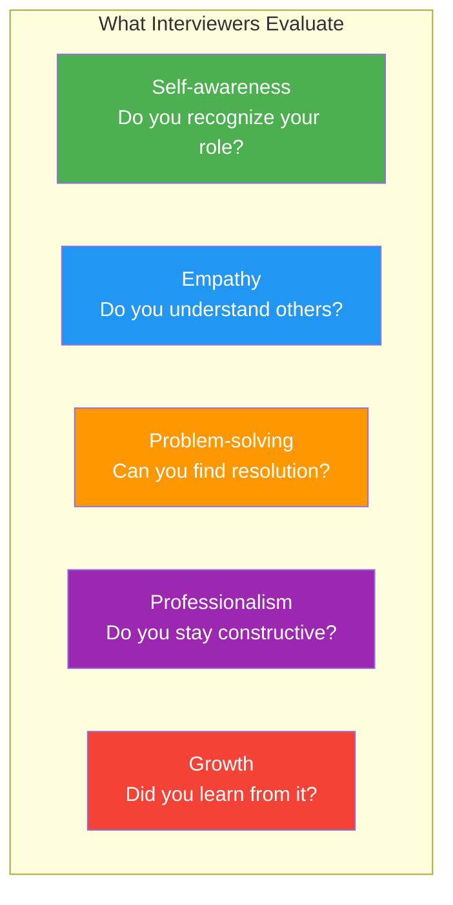
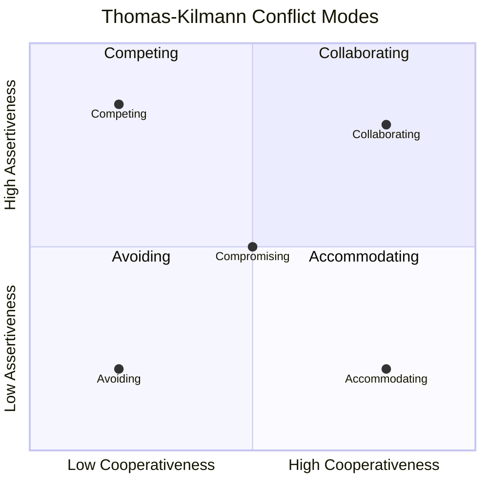
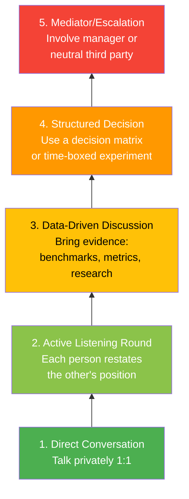
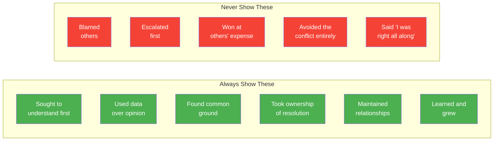

# Conflict Resolution: Frameworks & Story Templates

## Why Conflict Questions Matter

Conflict questions are among the most common and highest-signal behavioral questions. Interviewers ask them because how you handle disagreement reveals your communication skills, emotional intelligence, collaboration ability, and maturity. At senior/staff levels, conflict resolution is not just a soft skill -- it is a core job function.

---

## Framework 1: Thomas-Kilmann Conflict Model

The Thomas-Kilmann Instrument (TKI) identifies five conflict-handling modes based on two dimensions: **assertiveness** (concern for your own interests) and **cooperativeness** (concern for others' interests).

### The Five Modes Explained

| Mode | Assertiveness | Cooperativeness | When to Use | Example |
|------|:---:|:---:|-------------|---------|
| **Competing** | High | Low | Safety issues, clear right answer, urgent decisions | "We cannot ship without this security fix" |
| **Collaborating** | High | High | Complex issues, relationship matters, time available | "Let's find a solution that addresses both our concerns" |
| **Compromising** | Medium | Medium | Time pressure, equally valid positions | "Let's each give up one requirement to meet the deadline" |
| **Avoiding** | Low | Low | Trivial issues, emotions running high, not your battle | "This isn't the right time to discuss this. Let's revisit tomorrow" |
| **Accommodating** | Low | High | You're wrong, issue matters more to them, goodwill banking | "You have more context here -- let's go with your approach" |

### Choosing the Right Mode in Interviews

| Interview Context | Best Mode to Demonstrate | Why |
|-------------------|--------------------------|-----|
| Technical disagreement | **Collaborating** | Shows you seek the best solution |
| Priority conflict with PM | **Compromising** or **Collaborating** | Shows you balance business and tech |
| You were wrong | **Accommodating** | Shows humility and self-awareness |
| Toxic situation | **Avoiding** (temporarily) then **Collaborating** | Shows emotional intelligence |
| Safety/security issue | **Competing** | Shows you hold firm on principles |

---

## Framework 2: DESC Model

DESC is a direct communication framework for addressing conflict constructively.

| Step | What It Means | Example |
|------|---------------|---------|
| **D**escribe | State the specific behavior/situation objectively | "In the last three PRs, the test coverage was below 60%" |
| **E**xpress | Share the impact using "I" statements | "I'm concerned this will lead to regressions in production" |
| **S**pecify | State what you want to happen | "I'd like us to agree on a minimum coverage threshold of 80%" |
| **C**onsequences | Explain the positive outcome | "This would reduce our production incidents and build confidence in deploys" |

### DESC vs Other Communication Models

| Model | Steps | Best For | Limitation |
|-------|-------|----------|------------|
| **DESC** | Describe, Express, Specify, Consequences | Direct feedback, specific behaviors | Can feel formulaic |
| **SBI** | Situation, Behavior, Impact | Performance feedback | Doesn't include a request |
| **NVC** | Observation, Feeling, Need, Request | Emotionally charged situations | Can feel slow/therapeutic |
| **COIN** | Context, Observation, Impact, Next steps | Manager-to-report feedback | Assumes authority |

---

## Framework 3: The Conflict Resolution Ladder

**Key principle**: Always start at Level 1. Only escalate if lower levels fail. Interviewers want to see that you tried direct resolution before involving managers.

---

## Story Template #1: Technical Disagreement

**Best for questions like**: "Tell me about a time you disagreed with a colleague on a technical approach", "Describe a time when you had to convince someone of your technical idea"

### Situation
> "At [Company], our team was building [system/feature]. During the design phase, [colleague's role] and I had a fundamental disagreement about [specific technical decision -- e.g., database choice, architecture pattern, API design, testing strategy]. They advocated for [their approach] because [their reasoning]. I believed [your approach] was better because [your reasoning]. This decision would affect [impact -- system performance, team velocity, maintenance cost] for [timeframe]."

### Task
> "As [your role], I needed to ensure we made the best technical decision for the project while preserving a strong working relationship. We couldn't move forward until this was resolved, and the team was [state -- split, waiting, getting frustrated]."

### Action
> **Step 1 -- Understand their perspective**: "I set up a 1:1 with [colleague] specifically to understand their viewpoint deeply. I asked questions like 'What are you most concerned about?' and 'What does success look like for you?' I learned that their real concern was [underlying worry -- not what I initially thought]."
>
> **Step 2 -- Find common ground**: "We agreed that [shared goal -- system reliability, user experience, maintainability] was the priority. This reframed the discussion from 'my approach vs yours' to 'which approach best achieves our shared goal?'"
>
> **Step 3 -- Bring data**: "I proposed we evaluate both approaches objectively. I [specific action -- ran benchmarks, built a prototype, researched case studies, consulted documentation]. The data showed [findings]."
>
> **Step 4 -- Propose resolution**: "Based on the evidence, I suggested [resolution -- a hybrid approach, their approach with modifications, your approach with their safeguards, a time-boxed experiment]."

### Result
> "We adopted [final decision]. The outcome was [quantified result -- e.g., 30% better performance than either original proposal, shipped on time, reduced complexity]. [Colleague] and I developed a stronger working relationship -- they became someone I regularly bounced ideas off. I learned [lesson -- e.g., that my initial assumptions were too narrow, that understanding the 'why' behind someone's position is more important than debating the 'what']."

### Customization Notes
- **Your company/project**: ___
- **The technical decision**: ___
- **Their perspective (and why it was valid)**: ___
- **Your perspective**: ___
- **How you resolved it**: ___
- **The outcome**: ___
- **The relationship after**: ___

---

## Story Template #2: Priority Conflict

**Best for questions like**: "Tell me about a time you disagreed with a product manager", "How do you handle competing priorities?", "Describe a time when stakeholders wanted different things"

### Situation
> "At [Company], I was leading the engineering work on [project]. We were [timeline context -- mid-sprint, approaching a deadline, planning Q goals]. [Stakeholder -- PM, business lead, VP] wanted us to prioritize [their priority -- a new feature, a client request, a sales commitment] which would require [impact on current work -- delaying tech debt, deferring reliability improvements, stopping current feature]. I believed [your priority -- stability work, different feature, architectural improvement] was more critical because [reasoning -- production risk, long-term velocity, user impact data]."

### Task
> "I needed to advocate for what I believed was the right technical priority while respecting the business perspective and maintaining trust with [stakeholder]. The challenge was that both priorities had legitimate business justification."

### Action
> **Step 1 -- Understand the business context**: "I scheduled time with [stakeholder] to understand the 'why' behind their priority. I learned that [business context -- e.g., a key client was threatening to churn, there was a competitive pressure, there was a revenue target at risk]. This was a legitimate concern I hadn't fully appreciated."
>
> **Step 2 -- Quantify the trade-off**: "I created a clear comparison showing [your priority's impact] versus [their priority's impact] in terms of [shared metric -- revenue risk, user impact, engineering cost]. I specifically showed: if we defer [your priority], the risk is [specific consequence with probability]. If we defer [their priority], the cost is [specific consequence]."
>
> **Step 3 -- Propose alternatives**: "I presented three options: (A) do [their priority] first with [mitigation for your concern], (B) do [your priority] first with [mitigation for their concern], or (C) [creative alternative -- split the team, do a minimal version of both, hire a contractor]. I recommended option [X] because [reason]."
>
> **Step 4 -- Align on decision and criteria**: "We agreed on [option chosen] with [conditions -- a review point, a fallback plan, clear success metrics]."

### Result
> "We went with [decision] and the result was [outcome]. [Their concern] was addressed by [how]. [Your concern] was mitigated by [how]. This experience taught me [lesson -- e.g., that presenting trade-offs with data is more effective than arguing positions, that understanding business context changes what 'right' looks like]. After this, [stakeholder] and I established [ongoing practice -- e.g., regular priority sync, shared dashboard, decision log]."

### Customization Notes
- **Your company/project**: ___
- **The priority conflict**: ___
- **Business context you learned**: ___
- **How you resolved it**: ___
- **The outcome**: ___

---

## Story Template #3: Cross-Team Friction

**Best for questions like**: "Tell me about a time you worked with a difficult team", "How do you handle cross-team dependencies?", "Describe a time when teams were not aligned"

### Situation
> "At [Company], my team ([your team's function]) depended on [other team] for [dependency -- API, shared service, data pipeline, platform feature]. There was growing friction because [specific issue -- they kept deprioritizing our requests, their API was unreliable, they had different quality standards, they were in a different timezone with no overlap]. This was causing [impact -- delays, production issues, developer frustration, missed commitments]."

### Task
> "As [your role], I needed to resolve this cross-team friction without any authority over the other team. The situation had been escalated to managers once before, which created tension but didn't solve the underlying problem."

### Action
> **Step 1 -- Build a relationship**: "Instead of going through official channels again, I reached out directly to [counterpart on the other team] and suggested we grab coffee (or a casual video call). I wanted to understand their world -- their priorities, their constraints, what they were measured on."
>
> **Step 2 -- Discover the root cause**: "I learned that [root cause -- they were understaffed, they had conflicting priorities from their leadership, they didn't understand our use case, they had technical debt that made changes risky]. The friction wasn't about unwillingness -- it was about [real constraint]."
>
> **Step 3 -- Create a shared solution**: "I proposed [solution -- a shared interface contract, a regular sync meeting, embedding an engineer on their team temporarily, contributing PRs to their codebase, creating a shared dashboard of dependencies]. I also [what you offered them -- helped with their backlog, shared monitoring tools, advocated for their resourcing]."
>
> **Step 4 -- Formalize the working agreement**: "We documented [what -- SLAs, communication channels, escalation paths, shared goals] so the arrangement would survive personnel changes."

### Result
> "Over [timeframe], [quantified improvement -- dependency delivery time dropped from 3 weeks to 5 days, production incidents from their API dropped by 70%, developer satisfaction in surveys improved]. The two teams went from adversarial to collaborative. I learned [lesson -- e.g., that most cross-team friction comes from misaligned incentives, not bad intentions, and that investing in relationships pays compound returns]."

### Customization Notes
- **Your company/teams involved**: ___
- **The friction point**: ___
- **Root cause you discovered**: ___
- **Your solution**: ___
- **The outcome**: ___

---

## Story Template #4: Process Disagreement

**Best for questions like**: "Tell me about a time you wanted to change how your team worked", "Describe a time you disagreed with your manager", "How do you handle it when you disagree with a process?"

### Situation
> "At [Company], the team had a long-standing process for [process -- code review, deployment, sprint planning, on-call, testing]. Specifically, [describe the process]. I noticed this was causing [problem -- slow velocity, frustration, quality issues, burnout] because [why]. I had experience with [alternative approach] from [previous role or research] and believed a change could help."

### Task
> "I wanted to improve the process, but [challenge -- the team was attached to the current way, my manager had designed the current process, previous change attempts had failed, people were resistant to change]. I needed to build consensus rather than force a change."

### Action
> **Step 1 -- Gather evidence**: "Before proposing anything, I [method -- tracked metrics for 4 sprints, surveyed the team anonymously, collected cycle time data, documented pain points from retros]. The data showed [specific findings -- e.g., average PR review time was 3 days, 40% of sprint goals were missed, on-call engineers averaged 5 pages per night]."
>
> **Step 2 -- Propose, don't mandate**: "I shared my observations with the team in [forum -- retro, team meeting, Slack document] framed as 'I noticed [problem] and have an idea I'd like to get your input on' rather than 'we should change this.' I proposed [specific change] and explained [how it addressed the data I had collected]."
>
> **Step 3 -- Acknowledge concerns**: "Several team members raised concerns: [specific concerns -- 'We tried that before and it failed', 'That won't work because X', 'I prefer the current approach']. I addressed each: [how you handled concerns -- acknowledged valid points, adjusted the proposal, offered a trial period]."
>
> **Step 4 -- Run a time-boxed experiment**: "I suggested we try the new process for [duration -- 2 sprints, 1 month] and measure [specific metrics]. I offered to [own the overhead -- run the meetings, create the templates, track the data]. This lowered the risk of trying something new."

### Result
> "After the trial, the data showed [improvement -- PR review time dropped from 3 days to 1 day, sprint goal completion went from 60% to 85%, on-call pages decreased by 50%]. The team voted to adopt the change permanently. [People who initially resisted] became advocates. I learned [lesson -- e.g., that data and trial periods are more persuasive than arguments, that people need to feel heard before they'll accept change]."

### Customization Notes
- **Your company/team**: ___
- **The process and its problems**: ___
- **Your proposed change**: ___
- **Resistance you faced**: ___
- **How you ran the experiment**: ___
- **The outcome**: ___

---

## Conflict Resolution Principles for Interviews

### What to Always Demonstrate

### Phrases That Signal Maturity

| Instead of... | Say... |
|---------------|--------|
| "They were wrong" | "We had different perspectives on the best approach" |
| "I convinced them" | "We worked through the options together" |
| "I escalated to my manager" | "After trying to resolve it directly, I involved my manager for guidance" |
| "I let it go" | "I chose to prioritize the relationship and find another path forward" |
| "They should have listened to me" | "In hindsight, I should have presented my case differently" |

---

## Interview Q&A

> **Q1: What if in my conflict story, I was clearly right and the other person was wrong?**
> **A**: Even if you were technically correct, frame the story to show empathy and process. Explain why the other person held their view (they had valid reasons based on their context), how you helped them see your perspective (through data, not argument), and what you learned about communication. "I was right" is never the point of a conflict story -- the point is how you handled the disagreement constructively.

> **Q2: Should I pick a conflict where I compromised or one where I held firm?**
> **A**: It depends on the question. For general conflict questions, show collaboration (you found a solution together). For "conviction" questions ("tell me about a time you stood firm"), show principled persistence. The best stories show you were flexible on approach but firm on the underlying principle (quality, user safety, data integrity).

> **Q3: How do I handle "tell me about a conflict with your manager"?**
> **A**: This is a trust question. Show that you can disagree respectfully with authority. Key elements: (1) You disagreed on a substantive issue, not personality. (2) You brought data and alternatives. (3) You ultimately supported the final decision, even if it wasn't yours. (4) You maintained respect for your manager throughout. Never badmouth a former manager.

> **Q4: What if I genuinely avoid conflict? I don't have good conflict stories.**
> **A**: Everyone has conflict stories -- you may just categorize them differently. Think about: a technical decision where you and a colleague preferred different approaches, a time when priorities between teams clashed, a code review where you pushed back on an approach, or a time when a process frustrated you and you advocated for change. These are all conflict stories.

> **Q5: How detailed should I be about the other person's perspective?**
> **A**: Quite detailed. Spending 15-20 seconds genuinely articulating why the other person's view was reasonable is one of the strongest signals you can send. It shows empathy, active listening, and intellectual honesty. "They wanted to use a monolith because they were concerned about operational complexity of microservices, which was a fair point given our small team" is much stronger than "they wanted to use a monolith."

> **Q6: Should I ever admit I was wrong in a conflict story?**
> **A**: Absolutely. Stories where you initially disagreed, then realized the other person was right (or partially right), and changed your mind are extremely powerful. They demonstrate humility, intellectual honesty, and growth. "I was wrong, I learned, and here's how I changed" is one of the strongest possible signals in a behavioral interview.
