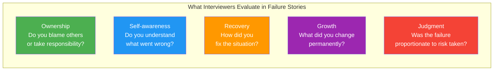
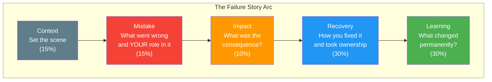
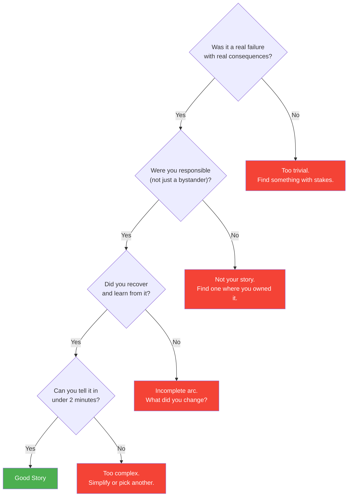
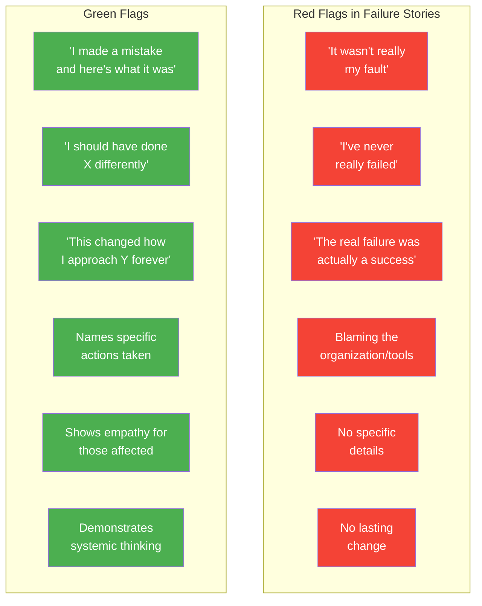

# Failure Stories: Structure & Templates

## Why Failure Questions Exist

Interviewers ask about failure to assess self-awareness, accountability, resilience, and growth mindset. At senior/staff levels, failure is expected -- what matters is how you respond to it, what you learn, and what you change. A candidate who claims to have never failed is either inexperienced or lacking self-awareness.

## The Failure Story Arc

Every good failure story follows a specific arc that transforms a negative experience into a demonstration of growth. The key is honesty without self-destruction -- show the failure clearly, but spend most of the time on recovery and learning.

### Time Allocation Comparison

| Section | Common Mistake (%) | Ideal Allocation (%) | Purpose |
|---------|:--:|:--:|---------|
| Context | 40% | 15% | Just enough to understand the stakes |
| Mistake | 30% | 15% | Be specific but don't dwell |
| Impact | 15% | 10% | Show you understand the severity |
| Recovery | 10% | 30% | This is where you shine |
| Learning | 5% | 30% | This is the point of the story |

## Choosing the Right Failure Story

### The Failure Spectrum

| Too Small | Just Right | Too Big |
|-----------|-----------|---------|
| "I typo'd a variable name" | "I pushed a config change that caused 2 hours of downtime" | "I committed fraud" |
| "I was late to a meeting" | "I underestimated a project by 3 months" | "I got fired for negligence" |
| "I forgot to update a doc" | "I made an architectural decision that we had to revert" | "I lost the company a major client through malice" |

### Story Selection Criteria

---

## Story Template #1: Production Incident

**Best for questions like**: "Tell me about a time you caused a production issue", "Describe your worst day at work", "Tell me about a time something went wrong in production"

### Context (15%)
> "At [Company], I was working on [system/service] that served [scale -- e.g., 10M daily active users, processed $X in transactions, powered the core product experience]. The system was [relevant context -- e.g., recently migrated, had known technical debt, was in a high-traffic period]. I was [your role and responsibility level]."

### Mistake (15%)
> "I [specific mistake -- e.g., deployed a database migration without testing against production data volume, pushed a config change that bypassed the feature flag, merged a PR that had a race condition I missed in review, didn't set up proper monitoring before a launch]."
>
> "The root cause was [honest self-reflection]: I [why you made the mistake -- was overconfident in the change being 'simple', skipped the staging environment to move faster, didn't consider edge cases with high concurrency, underestimated the blast radius]."

### Impact (10%)
> "This caused [specific impact -- e.g., 3 hours of downtime for the API, 15,000 failed transactions, degraded performance for 6 hours, incorrect data sent to 2,000 users]. The business impact was [quantified -- e.g., estimated revenue loss of X, customer support tickets spiked by 300%, SLA breach with a key client]."

### Recovery (30%)
> "As soon as I realized the issue, I [immediate response]:
> 1. **Containment**: I [action -- rolled back the deployment, toggled the feature flag, diverted traffic, communicated to the team on the incident channel]
> 2. **Communication**: I [notified -- paged the on-call, informed the engineering manager, posted a status update for affected users, joined the war room]
> 3. **Fix**: I [resolution -- identified the root cause within X minutes, deployed a hotfix, ran data correction scripts, validated the fix]
> 4. **Transparency**: After the immediate fix, I [wrote the post-mortem, presented to the team, communicated to affected stakeholders]"

### Learning (30%)
> "This failure changed how I work permanently:
> - **Process change**: I [systemic improvement -- created a deployment checklist for the team, implemented mandatory staging validation, set up automated canary deployments]
> - **Technical safeguard**: I [technical fix -- added circuit breakers, improved monitoring and alerting, wrote integration tests that simulate production load]
> - **Personal habit**: I now [behavioral change -- always ask 'what's the blast radius?' before any production change, never deploy on Fridays, always have a rollback plan before starting]
> - **Team impact**: This post-mortem led to [broader change -- team-wide adoption of the practice, engineering org policy change, new tooling investment]"

### Customization Notes
- **Your company/system**: ___
- **The mistake**: ___
- **Why you made it (honestly)**: ___
- **The impact**: ___
- **How you recovered**: ___
- **What changed permanently**: ___

---

## Story Template #2: Bad Technical Decision

**Best for questions like**: "Tell me about a technical decision you regret", "Describe a time you chose the wrong approach", "What's the biggest mistake you've made in software design?"

### Context (15%)
> "At [Company], we were designing [system/feature/architecture]. The team needed to decide on [technical decision -- database choice, architecture pattern, framework, build-vs-buy, monolith-vs-microservices]. I was [your role -- leading the design, the most senior engineer, the one who advocated strongly for an approach]. We had [constraints -- timeline, team experience, business requirements]."

### Mistake (15%)
> "I advocated strongly for [decision -- e.g., building a custom solution instead of using an existing tool, choosing microservices when a monolith would have sufficed, selecting a trendy technology the team had no experience with, over-engineering for scale we never reached]."
>
> "My reasoning at the time was [what you thought -- better performance, more flexibility, future-proofing, resume-driven development]. What I failed to consider was [blind spot -- team's ability to maintain it, operational complexity, the YAGNI principle, opportunity cost]."

### Impact (10%)
> "Over the next [timeframe], the consequences became clear: [specific problems -- development velocity dropped by X%, we spent Y months on infrastructure instead of features, new team members took Z weeks to onboard, the system was unreliable and hard to debug]. The team was [effect -- frustrated, burned out, losing confidence in technical leadership]."

### Recovery (30%)
> "When I recognized the problem, I took ownership:
> 1. **Acknowledged the mistake**: I [how -- brought it up in a team meeting, wrote a document analyzing what went wrong, had honest 1:1s with affected team members]. I specifically said [honest statement -- 'I pushed for this decision and it was wrong. Here's what I think we should do now.']
> 2. **Proposed a path forward**: I created [plan -- a migration strategy, a simplification roadmap, a proposal to switch approaches] that would [goal -- reduce complexity, improve velocity, address the root issues]
> 3. **Managed the transition**: I [actions -- led the migration effort personally, paired with team members to share context, communicated the change to stakeholders with timeline and rationale]
> 4. **Didn't repeat the pattern**: I established [safeguard -- a technical decision record process, design review with diverse perspectives, proof-of-concept requirements for new technology]"

### Learning (30%)
> "This experience fundamentally changed my approach to technical decision-making:
> - **Boring technology principle**: I now default to proven, well-understood technology unless there's a compelling reason not to
> - **Team capability**: I consider not just what's technically optimal, but what the team can maintain and evolve
> - **Reversibility**: I evaluate decisions by how hard they are to reverse -- irreversible decisions deserve more deliberation
> - **Second opinions**: For significant architectural decisions, I now [practice -- seek input from engineers outside the team, write ADRs for review, prototype before committing]
> - [Specific lesson from your situation]"

### Customization Notes
- **Your company/project**: ___
- **The decision and your reasoning**: ___
- **What you didn't consider**: ___
- **The consequences**: ___
- **How you corrected course**: ___
- **What changed in your decision-making**: ___

---

## Story Template #3: Missed Deadline

**Best for questions like**: "Tell me about a time you missed a deadline", "Describe a project that didn't go as planned", "How do you handle it when you can't deliver on time?"

### Context (15%)
> "At [Company], I was responsible for delivering [project/feature] by [deadline]. The deadline was [why it mattered -- client commitment, product launch, regulatory requirement, business quarter end]. The scope included [what was expected]. My team was [size and composition]."

### Mistake (15%)
> "I [the core mistake that led to the miss]:
> - [Root cause 1 -- e.g., I underestimated the complexity of the integration by 3x because I didn't spike it first]
> - [Root cause 2 -- e.g., I didn't raise the risk early enough when I saw signs of trouble]
> - [Root cause 3 -- e.g., I said yes to additional scope mid-project instead of pushing back]"
>
> "Looking back, the first sign of trouble was at [point in timeline], when [warning sign]. I should have [what you should have done differently] at that point, but instead I [what you actually did -- hoped to catch up, worked overtime, didn't communicate the risk]."

### Impact (10%)
> "We missed the deadline by [duration]. The impact was [specific consequences -- client had to delay their launch, the company missed a revenue target, the team's credibility with stakeholders was damaged, we had to do a difficult renegotiation]. [Stakeholder] reacted with [reaction]."

### Recovery (30%)
> "Once I accepted that we would miss the deadline:
> 1. **Early communication**: I [how you communicated -- set up a meeting with stakeholders, provided a revised timeline with confidence levels, presented what could be delivered by the original date vs. full scope]
> 2. **Damage control**: I [actions -- negotiated a phased delivery, identified the MVP that addressed the most critical needs, offered [concession] to maintain the relationship]
> 3. **Execution**: I [how you delivered -- reorganized the team's work, cut non-essential scope with stakeholder agreement, brought in additional help, personally took on the critical path work]
> 4. **Delivered**: We shipped [what] by [revised date], with [remaining work] following [later date]"

### Learning (30%)
> "This failure taught me critical lessons about project estimation and risk management:
> - **Estimation technique**: I now [specific practice -- break estimates into tasks under 2 days, add 50% buffer for integration work, use three-point estimation, spike unknowns before committing]
> - **Risk communication**: I now [practice -- flag risks as soon as I see them with probability and impact, use a traffic light system in status updates, have 'pre-mortem' sessions at project start]
> - **Scope management**: I now [practice -- document scope explicitly at the start, push back on additions with trade-off analysis, maintain a 'not doing' list]
> - **Stakeholder management**: I now [practice -- send weekly status updates, define milestones with clear criteria, establish escalation triggers]"

### Customization Notes
- **Your company/project**: ___
- **The deadline and its importance**: ___
- **Root cause of the miss**: ___
- **Warning signs you missed/ignored**: ___
- **How you recovered**: ___
- **What you changed about estimation/planning**: ___

---

## Story Template #4: Communication Failure

**Best for questions like**: "Tell me about a miscommunication that caused problems", "Describe a time when lack of communication led to issues", "What's a situation where you should have communicated better?"

### Context (15%)
> "At [Company], I was working on [project/initiative] that involved [multiple parties -- teams, stakeholders, external partners]. The project required [coordination need -- alignment on requirements, shared understanding of timeline, agreement on technical approach]. I was [your role and responsibility for communication]."

### Mistake (15%)
> "I failed to communicate [what -- a critical requirement change, a risk I had identified, a decision that affected another team, progress status, a dependency that shifted]. Specifically:
> - I assumed [wrong assumption -- that someone else would communicate it, that it was obvious, that the other team already knew, that it wasn't important enough to mention]
> - I [what you did or didn't do -- sent an email instead of having a conversation, didn't follow up to confirm understanding, communicated to the wrong audience, used jargon the other team didn't understand]"

### Impact (10%)
> "As a result, [consequence -- the other team built against the wrong spec and had to redo 2 weeks of work, stakeholders were blindsided at the review, a critical integration failed because teams had different assumptions, trust between teams was damaged]. The impact was [quantified -- X days of rework, Y missed opportunity, Z relationship damage]."

### Recovery (30%)
> "When the miscommunication surfaced:
> 1. **Took ownership**: I immediately [action -- acknowledged that I should have communicated this, didn't blame others for not asking, apologized to affected parties]
> 2. **Fixed the immediate problem**: I [action -- organized an alignment meeting, helped the other team with rework, created a shared document with the correct information]
> 3. **Rebuilt trust**: I [action -- set up regular sync meetings, over-communicated for the rest of the project, checked in personally with affected colleagues]
> 4. **Created systemic fixes**: I [action -- established a communication protocol, created shared channels, implemented decision logs, set up automated notifications]"

### Learning (30%)
> "This experience fundamentally changed how I think about communication:
> - **Default to over-communication**: I now follow the principle that 'if you're unsure whether to communicate something, communicate it.' The cost of redundant information is far lower than the cost of missing information
> - **Confirm understanding**: I now [practice -- ask people to restate what they heard, follow up verbal agreements with written summaries, use checklists for cross-team handoffs]
> - **Choose the right medium**: I learned that [lesson -- async messages are for FYI, synchronous conversations are for alignment, documents are for decisions]
> - **Audience awareness**: I now [practice -- tailor technical depth to the audience, provide context that seems obvious to me, include the 'why' not just the 'what']"

### Customization Notes
- **Your company/project**: ___
- **What you failed to communicate**: ___
- **Your wrong assumption**: ___
- **The impact**: ___
- **How you fixed it**: ___
- **What changed in your communication habits**: ___

---

## Failure Story Dos and Don'ts

### The Comparison Table

| Do | Don't |
|----|-------|
| Take clear personal responsibility | Blame the team, manager, or circumstances |
| Name the specific mistake | Be vague ("things didn't go as planned") |
| Show genuine self-reflection | Performatively self-criticize |
| Spend 60% on recovery + learning | Spend 60% on the failure itself |
| Pick a real failure with real stakes | Pick something trivial to avoid vulnerability |
| Show what changed permanently | Say "I learned to be more careful" (vague) |
| Demonstrate growth | Present yourself as a victim |
| Be honest about emotions | Be robotic about a clearly emotional situation |
| Show you prevented recurrence | Leave the impression it could happen again |

### Red Flags Interviewers Watch For

---

## Interview Q&A

> **Q1: How big should the failure be? I'm worried about scaring the interviewer.**
> **A**: Pick a meaningful failure with real consequences, but not one that suggests negligence or character flaws. A production incident you caused is fine. Losing the company millions due to recklessness is not. The sweet spot: a failure that a competent professional could realistically make, where the consequences were significant enough to matter, and where your response demonstrated maturity. If the interviewer wouldn't think "I could see myself making that mistake," the failure might be too extreme.

> **Q2: Can I use a team failure where I was partially responsible?**
> **A**: Yes, but own your part specifically. Don't say "the team failed to deliver." Say "My contribution to the failure was [specific thing I did or didn't do]." Bonus points if you also show how you helped the team recover, but never use a team failure to dilute your accountability.

> **Q3: What if the interviewer probes deeper into the failure? How much detail is too much?**
> **A**: Follow their lead. If they ask "what was the root cause?" -- give a clear technical answer. If they ask "how did you feel?" -- show emotional intelligence: "I was frustrated with myself, but I channeled that into fixing the problem." If they ask "what did your manager say?" -- be honest: "They were understandably disappointed, but they appreciated that I took ownership and led the recovery." Never lie, but you can choose what to emphasize.

> **Q4: Should I show emotion when telling a failure story?**
> **A**: Controlled authenticity is powerful. Saying "I was embarrassed when I realized the outage was my fault" is more relatable than a robotically detached account. But don't be dramatic. The emotion should be brief and serve the story -- it shows you care about your work and your impact on others. The bulk of your emotional energy should be in the "learning" section, showing passion for improvement.

> **Q5: What if I caused a failure but never got caught? Can I use that story?**
> **A**: Be careful. If you noticed a problem, fixed it, and learned from it -- that can work if framed as self-awareness. But if "never got caught" implies you hid a mistake, that's a red flag. The best failure stories involve transparency. If you found and fixed something quietly, the story is "I noticed [problem] that I had caused, immediately [fixed it], and then proactively [communicated/created safeguards] so it wouldn't happen again."

> **Q6: How many failure stories should I prepare?**
> **A**: Prepare 3-4 distinct failure stories covering different categories: a technical mistake, a judgment/decision error, a communication/leadership failure, and a project management failure. This gives you flexibility regardless of how the question is framed. Each should demonstrate a different aspect of growth. Having multiple stories also prevents the awkward situation of being asked "tell me about ANOTHER time you failed" and having nothing.

---

## Failure Story Preparation Checklist

- [ ] Written out 3-4 failure stories using the templates above
- [ ] Each story has specific, quantified details (not vague generalities)
- [ ] Each story spends 60%+ of time on recovery and learning
- [ ] Each story includes a permanent behavioral or systemic change
- [ ] Timed each story at under 2 minutes spoken
- [ ] Practiced each story out loud 3 times
- [ ] Prepared for follow-up questions: "What would you do differently?", "How did your manager react?", "Has it happened again?"
- [ ] Verified that no story makes you look negligent, dishonest, or blaming others
