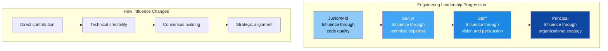
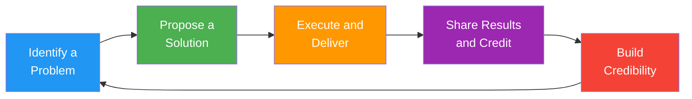
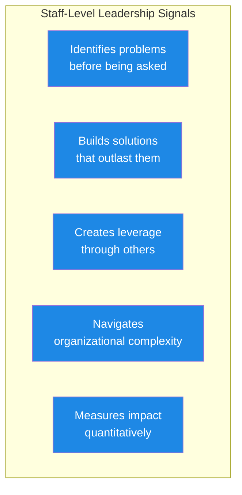

# Leadership Without Authority: Influence Techniques & Story Templates

## Why This Matters for Senior/Staff Engineers

At the senior and staff level, your impact extends far beyond the code you write. You are expected to drive technical initiatives, set standards, and build alignment across teams -- often without any direct reports or formal authority. The ability to influence without authority is arguably the defining skill that separates senior from staff-level engineers.

---

## The Influence Model for Engineers

### Five Sources of Influence

| Source | What It Means | How to Build It | Example |
|--------|---------------|-----------------|---------|
| **Expertise** | Deep knowledge that others respect | Ship quality work, share knowledge, become the go-to person | "Let me show you the data from when I solved a similar problem" |
| **Relationships** | Trust and rapport with key people | Invest in 1:1s, help others succeed, be reliable | "I've been working with the platform team and they've shared concerns about..." |
| **Vision** | A compelling picture of the future | Write proposals, articulate problems clearly, connect work to business value | "Here's where I think we need to be in 6 months and why..." |
| **Track record** | History of delivering results | Consistently ship, follow through, own outcomes | "When we tried this approach on Project X, here's what happened..." |
| **Coalition** | Support from multiple stakeholders | Build allies before big proposals, seek diverse input | "I've discussed this with teams A, B, and C, and here's the shared perspective..." |

### The Credibility Loop

**Key insight**: Credibility is a flywheel. Each successful cycle makes the next initiative easier to drive. Start with small, visible wins before tackling large, org-wide changes.

---

## Framework 1: The Influence Playbook

### Step-by-Step Process for Driving Change

| Step | Action | Duration | Deliverable |
|------|--------|----------|-------------|
| 1. **Identify** | Find a real problem that others feel but haven't articulated | 1-2 weeks of observation | Problem statement |
| 2. **Validate** | Talk to 5-10 people affected by the problem | 1-2 weeks | Stakeholder perspectives |
| 3. **Propose** | Write a clear proposal with problem, solution, trade-offs | 2-3 days | RFC/design doc |
| 4. **Socialize** | Share with key people 1:1 before any group discussion | 1 week | Pre-aligned supporters |
| 5. **Present** | Bring it to the group with broad support already built | 1 meeting | Decision/approval |
| 6. **Execute** | Lead the implementation, doing the hardest parts yourself | Varies | Working solution |
| 7. **Scale** | Document, share results, enable others to adopt | Ongoing | Org-wide impact |

### The Pre-Socialization Technique

One of the most important influence skills is never presenting an idea cold to a group. Instead:

```mermaid
graph TD
    subgraph Wrong["Anti-Pattern: Cold Proposal"]
        W1["Write proposal"] --> W2["Present to<br/>group of 15"]
        W2 --> W3["Objections and<br/>bike-shedding"]
        W3 --> W4["Proposal dies<br/>in committee"]
    end

    subgraph Right["Pattern: Pre-Socialization"]
        R1["Write draft<br/>proposal"] --> R2["Share 1:1 with<br/>key skeptic"]
        R2 --> R3["Incorporate<br/>feedback"] --> R4["Share 1:1 with<br/>key supporter"]
        R4 --> R5["Refine<br/>proposal"] --> R6["Present with<br/>allies in room"]
        R6 --> R7["Smooth<br/>consensus"]
    end

    style W4 fill:#f44336,color:#fff
    style R7 fill:#4CAF50,color:#fff
```

### Handling Resistance

| Resistance Type | What They Say | What They Mean | Your Response |
|-----------------|--------------|----------------|---------------|
| **Technical** | "That won't scale" | "I have technical concerns" | "What specific scenarios worry you? Let me show data..." |
| **Inertia** | "We've always done it this way" | "Change is risky and effortful" | "I understand. What if we tried it on one team for a month?" |
| **Ownership** | "That's my team's domain" | "You're stepping on my territory" | "I'd love your expertise. Could we co-own this?" |
| **Priority** | "We don't have time for this" | "I don't see the urgency" | "Here's the cost of not doing this: [data]" |
| **Skepticism** | "We tried this before" | "I've been burned" | "What went wrong last time? Let me address those specific issues" |

---

## Framework 2: The Decision-Making Influence Matrix

### How to Influence Different Stakeholders

| Stakeholder | What They Care About | How to Influence Them | What to Prepare |
|-------------|---------------------|----------------------|-----------------|
| **Engineering Manager** | Team velocity, retention, delivery | Show impact on team productivity and morale | Metrics, team feedback |
| **Product Manager** | User impact, revenue, timelines | Connect to business outcomes | User data, revenue estimates |
| **Other Senior Engineers** | Technical quality, maintainability | Demonstrate technical merit | Benchmarks, architecture analysis |
| **VP/Director** | Strategic alignment, org efficiency | Frame as organizational leverage | ROI analysis, competitive context |
| **Skip-level Manager** | Cross-team impact, talent development | Show org-wide benefit | Impact across multiple teams |

---

## Framework 3: Building Consensus

### The Consensus Spectrum

Not all decisions need full consensus. Match the decision style to the situation:

| Decision Style | When to Use | How It Works | Risk |
|---------------|-------------|--------------|------|
| **Unilateral** | Reversible, low-stakes, your domain | You decide and inform | Can miss important input |
| **Consultative** | Your domain but affects others | You consult, then decide | Others may feel unheard |
| **Consensus** | High-stakes, cross-team impact | Group agrees together | Slow, can water down ideas |
| **Delegated** | Others have more expertise | You empower someone else | Lose control of outcome |

### The Disagree-and-Commit Protocol

When consensus cannot be reached:

1. **Make sure all perspectives are heard** -- explicitly ask dissenters to share concerns
2. **Document the decision and the dissent** -- "We decided X. Person Y had concerns about Z."
3. **Define success criteria** -- "We'll evaluate this approach in 4 weeks using [metrics]"
4. **Commit fully** -- Once decided, everyone supports the direction, including dissenters
5. **Revisit at the checkpoint** -- Honor the agreement to re-evaluate

---

## Story Template #1: Driving a Technical Initiative

**Best for questions like**: "Tell me about a time you drove a technical improvement", "Describe a time you identified and solved a systemic problem", "How have you influenced engineering practices?"

### Situation
> "At [Company], I noticed that [systemic problem -- e.g., deployment took 4 hours, test suite was flaky and took 45 minutes, there was no observability into production, code reviews took 5+ days]. This was affecting [impact -- team velocity, developer satisfaction, production reliability, customer experience]. No one owned this problem -- it was everyone's pain but nobody's priority. I had [relevant expertise -- experience with CI/CD, familiarity with observability tools, knowledge from a conference talk]."

### Task
> "I didn't have formal authority to mandate a change -- I was [your role, e.g., a senior engineer on one of six teams]. I needed to build support for addressing [the problem] and then actually execute the improvement. The challenge was that [obstacle -- everyone was busy with product work, there was skepticism about past improvement efforts, the problem was normalized]."

### Action
> **Step 1 -- Quantify the problem**: "I spent [time] measuring the actual cost. I tracked [metrics -- deploy frequency, time spent on flaky tests, number of production incidents]. The data showed [specific finding -- we were losing X engineer-hours per week, Y incidents could have been prevented]."
>
> **Step 2 -- Write the proposal**: "I wrote a [document type -- RFC, proposal, design doc] that laid out the problem with data, proposed [N] solution options with trade-offs, and recommended [your preferred approach] with an implementation plan. I estimated [effort -- 3 weeks of work, 2 engineers] and [expected outcome -- reduce deploy time to 20 minutes]."
>
> **Step 3 -- Build the coalition**: "Before presenting broadly, I shared the proposal 1:1 with [key people -- the engineering manager, the most skeptical senior engineer, the most affected team lead]. I incorporated their feedback and addressed their concerns. By the time I brought it to the team, [2-3 people] were already supportive."
>
> **Step 4 -- Lead the execution**: "I [how you executed -- volunteered to do the initial implementation myself during a hack week, recruited 2 engineers who were passionate about the problem, worked on it incrementally alongside product work]. I [specific technical work -- set up the new pipeline, migrated the first service, created the dashboard]."
>
> **Step 5 -- Scale the impact**: "After proving the approach on [first team/service], I [how you scaled -- documented the process, ran a workshop, created a migration guide, helped other teams adopt it]. I made it easy for others to follow."

### Result
> "Within [timeframe], [quantified outcome -- deploy time went from 4 hours to 20 minutes, test reliability went from 70% to 99%, MTTR dropped by 60%]. [Number] of teams adopted the approach. [Recognition -- the VP mentioned it in the all-hands, it became the standard, I was asked to present at the engineering summit]. More importantly, I learned that [lesson about influence -- showing data is more persuasive than arguing, starting small and proving value builds momentum, doing the hard work yourself earns credibility]."

### Customization Notes
- **Your company/team**: ___
- **The systemic problem**: ___
- **How you measured the cost**: ___
- **Your proposal**: ___
- **Who you built alignment with**: ___
- **How you executed**: ___
- **The quantified outcome**: ___

---

## Story Template #2: Creating Standards and Best Practices

**Best for questions like**: "Tell me about a time you improved engineering quality", "How have you raised the bar for your team?", "Describe a time you created a process that others adopted"

### Situation
> "At [Company], I observed that [quality issue -- code review quality varied widely, there were no testing standards, each team had different deployment practices, documentation was inconsistent]. This was causing [consequences -- knowledge silos, inconsistent quality, onboarding difficulty, production issues]. There was no existing standard or the existing standard was [outdated, ignored, incomplete]."

### Task
> "I wanted to establish [specific standard -- code review guidelines, testing expectations, API design principles, documentation templates]. The challenge was that standardization efforts often feel like bureaucracy, especially to experienced engineers who value autonomy. I needed to create something genuinely useful that engineers would adopt voluntarily."

### Action
> **Step 1 -- Research**: "I studied [sources -- how other companies handle this, internal pain points, team retrospective themes, industry best practices from [sources]]. I also talked to [number] engineers about what they wished existed."
>
> **Step 2 -- Draft with input**: "I created an initial draft and shared it with [diverse group -- junior engineers for clarity, senior engineers for completeness, managers for organizational fit]. I explicitly asked for criticism, not validation."
>
> **Step 3 -- Pilot**: "I applied the standard to [my own team/my own code] first. I led by example for [duration], showing that I followed the standard myself and demonstrating the benefits."
>
> **Step 4 -- Iterate and formalize**: "Based on feedback from the pilot, I refined the standard. I made it [accessible -- added it to the wiki, created a linter/template, integrated it into tooling]. I presented the results at [forum -- engineering meeting, architecture review]."

### Result
> "The standard was adopted by [number] of teams within [timeframe]. Measurable impact: [metrics -- review turnaround time improved by X, production bugs in covered areas decreased by Y, onboarding time reduced by Z]. Engineers who initially resisted became contributors to the standard. I learned [lesson about creating lasting change through influence rather than mandate]."

### Customization Notes
- **Your company/team**: ___
- **The quality problem**: ___
- **The standard you created**: ___
- **How you gained adoption**: ___
- **The measurable outcome**: ___

---

## Story Template #3: Building Alignment Across Teams

**Best for questions like**: "Tell me about a time you worked across teams to solve a problem", "How do you handle cross-functional collaboration?", "Describe a time you aligned multiple stakeholders on a direction"

### Situation
> "At [Company], [number] teams needed to [shared objective -- migrate to a new platform, adopt a common API pattern, coordinate a complex feature that spanned services, align on a shared data model]. Each team had [different perspective -- different priorities, different technical preferences, different timelines]. There was no clear owner for the cross-cutting decision, and [previous attempt had failed / it had been languishing for months / each team was going in their own direction]."

### Task
> "I recognized that without someone stepping up to coordinate, [consequence -- the migration would never happen, we'd end up with incompatible systems, the feature would launch inconsistently]. As [your role], I had no authority over the other teams, but I had [what gave you standing -- relevant expertise, relationships with key people, a strong opinion about the right direction]."

### Action
> **Step 1 -- Map the landscape**: "I met with the lead engineer from each team to understand their constraints, priorities, and non-negotiables. I documented [what I found -- common ground, genuine conflicts, misunderstandings, dependencies]."
>
> **Step 2 -- Create a shared framework**: "Based on the 1:1s, I created [artifact -- a decision matrix, a comparison document, a strawman proposal] that transparently showed each team's needs alongside the trade-offs. This made the implicit conflicts explicit and discussable."
>
> **Step 3 -- Facilitate alignment**: "I organized [meeting format -- a working session, a series of focused discussions, an architecture review] with representatives from each team. Rather than advocating for my preferred solution, I facilitated the discussion using [method -- the framework I created, structured decision-making, weighted criteria]. I made sure quieter voices were heard."
>
> **Step 4 -- Drive to decision**: "When the group was close but stuck on [sticking point], I proposed [resolution -- a compromise, a phased approach, a time-boxed experiment]. I also volunteered to [take on the hardest part -- build the shared library, create the migration tool, write the integration tests]."

### Result
> "The [number] teams aligned on [decision] within [timeframe]. The result was [outcome -- successful migration, consistent feature launch, shared platform that reduced duplication by X%]. Key relationships were strengthened -- specifically [example]. The approach I used for alignment became [lasting impact -- the template for future cross-team decisions]. I learned [lesson about building alignment -- it is about understanding what each party truly needs, which is often different from what they initially say they want]."

### Customization Notes
- **Your company/teams**: ___
- **The cross-team challenge**: ___
- **How you mapped perspectives**: ___
- **How you facilitated alignment**: ___
- **The outcome**: ___

---

## Influence Techniques Quick Reference

### Techniques That Work

| Technique | How It Works | When to Use |
|-----------|-------------|-------------|
| **Start with a small win** | Prove your idea works on a small scale first | New at the company, or idea is controversial |
| **Use data, not opinions** | Measure the problem, show the numbers | When people disagree on whether a problem exists |
| **Do the work yourself first** | Build the prototype, write the RFC, run the experiment | When asking others to change behavior |
| **Give credit generously** | Publicly attribute contributions, name allies | Always -- especially when the idea succeeds |
| **Find the champion** | Identify the person with authority who shares your vision | When you need organizational support |
| **Create FOMO** | Show other teams or companies benefiting from the approach | When dealing with inertia |
| **Frame as their idea** | Incorporate others' input so they feel ownership | When buy-in matters more than credit |
| **Make it easy** | Provide tools, templates, automation to reduce friction | When adoption is the bottleneck |

### Techniques That Backfire

| Anti-Pattern | Why It Fails | What Happens |
|--------------|-------------|--------------|
| **Going over someone's head** | Undermines trust and relationships | You win the battle, lose the war |
| **Passive-aggressive Slack messages** | Creates defensiveness, not alignment | People resist out of principle |
| **"I told you so"** | Damages relationships, even if you're right | No one wants to work with you |
| **Mandating without authority** | People resent being told what to do | Compliance without commitment |
| **Perfectionism before presenting** | Delays feedback, creates sunk-cost bias | Over-invested before getting input |

---

## Leadership Signals in Interviews

### What Separates Senior from Staff Answers

| Dimension | Senior Answer | Staff Answer |
|-----------|--------------|--------------|
| **Scope** | "I improved my team's process" | "I identified a pattern across 5 teams and created a solution" |
| **Method** | "I proposed an idea and my manager approved it" | "I built consensus across stakeholders with different interests" |
| **Execution** | "I implemented the solution" | "I implemented the first version, then enabled others to adopt and extend it" |
| **Outcome** | "My team benefited" | "The engineering org changed how it approaches [X]" |
| **Sustainability** | "It worked while I was there" | "It's still in use / was adopted as the standard" |

---

## Interview Q&A

> **Q1: How do I demonstrate leadership in an interview if I've never had direct reports?**
> **A**: Leadership without authority IS leadership. Focus on: driving technical initiatives (RFCs, migrations, standards), mentoring others (code reviews, pair programming, helping someone grow), building alignment (cross-team coordination, facilitating decisions), and improving systems (processes, tools, culture). Frame each with "I saw a problem, I took ownership, I delivered results." The lack of a formal title makes these stories more impressive, not less.

> **Q2: What if I tried to influence something and it didn't work?**
> **A**: This can be a strong story if told correctly. Frame it as: "I identified [problem], I proposed [solution], I tried [approach]. It didn't succeed because [honest reason -- I didn't build enough support, the timing wasn't right, I underestimated political dynamics]. I learned [lesson about influence]. Later, I applied that lesson when [successful example]." Showing you learn from failed influence attempts demonstrates maturity.

> **Q3: How do I talk about influence without sounding political or manipulative?**
> **A**: Focus on the problem and the outcome, not the influence mechanics. Say "I wanted to solve [real problem] for the team, and I needed support from [people]" rather than "I needed to influence [people] to get my way." Use words like "built alignment," "shared the data," "facilitated a discussion," "proposed and iterated" -- these describe collaboration, not manipulation. The motivation should always be solving a real problem, not personal advancement.

> **Q4: Should I talk about mentoring as leadership?**
> **A**: Absolutely. Mentoring is one of the highest-leverage leadership activities. Strong mentoring stories show: identifying someone's growth area, creating learning opportunities (not just giving advice), and the mentee's measurable growth. "I noticed [person] was struggling with [skill]. I set up weekly pairing sessions focused on [topic]. Over 3 months, they went from [before state] to [after state -- leading designs, handling on-call independently, getting promoted]." Quantified mentoring outcomes are gold.

> **Q5: How is "leadership without authority" different for Indian tech companies vs international ones?**
> **A**: The principles are the same, but the emphasis differs. In Indian tech companies, hierarchy tends to be more respected, so influence often flows through relationships and demonstrated expertise rather than direct confrontation. Emphasize: building credibility through consistent delivery, leveraging relationships with senior engineers and managers, using data to make cases (particularly important in large Indian tech companies where decisions can be committee-driven), and showing initiative in driving improvements that leadership values. In international companies, especially US-based ones, direct communication and writing (RFCs) carry more weight.

> **Q6: What's the difference between "leadership" and "doing everything yourself"?**
> **A**: True leadership creates leverage -- you do the initial work (proving the concept, writing the RFC, building the prototype) and then enable others to scale it. If you're still the only person doing it 6 months later, that's heroism, not leadership. In interviews, emphasize the moment you transitioned from "I did this" to "I enabled the team/org to do this." Show how you created documentation, tools, templates, or processes that allowed others to replicate your approach.

---

## Practice Checklist

- [ ] Identified 3-4 stories of influence without authority from your career
- [ ] Each story includes: problem identification, coalition building, execution, measurable outcome
- [ ] Practiced articulating the difference between what you did vs. what the team did
- [ ] Prepared to explain your influence approach (data, relationships, vision)
- [ ] Can answer "what if the team had said no?" for each story
- [ ] Timed each story at under 2 minutes
