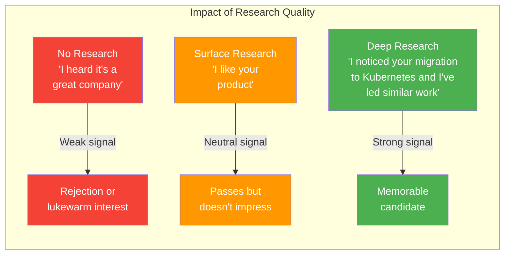
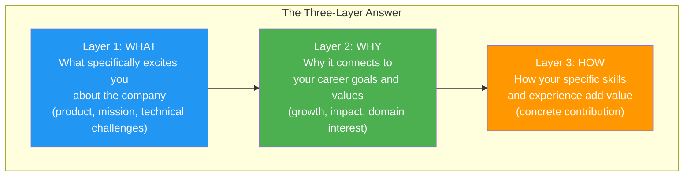
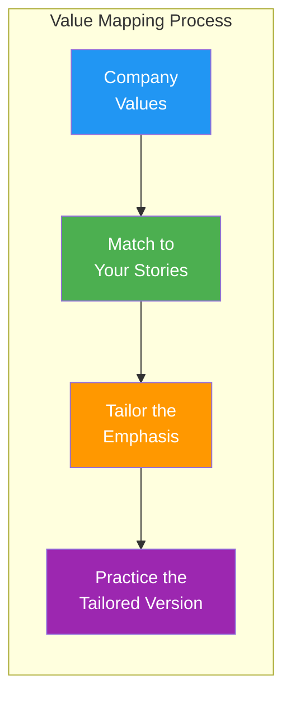

# Company Research: "Why This Company?" Framework & Research Checklist

## Why Company Research Matters

"Why do you want to work here?" is asked in nearly every interview loop. A generic answer ("I love your technology") signals low effort and low genuine interest. A specific, well-researched answer signals preparation, intentionality, and cultural fit. At senior/staff levels, interviewers expect you to have opinions about the company's technical challenges and strategy.

---

## The "Why This Company?" Framework

### The Three-Layer Answer

Your answer should connect three things: the company's reality, your career goals, and a specific contribution you can make.

### Template

> "I'm excited about [Company] for [specific reason tied to Layer 1 -- product, technical challenge, market position]. This aligns with [Layer 2 -- your career goal, domain interest, value]. Specifically, I think my experience in [Layer 3 -- your relevant skill/experience] would help with [specific company challenge you've identified]."

### Examples by Company Type

| Company Type | Layer 1 (What) | Layer 2 (Why) | Layer 3 (How) |
|-------------|----------------|---------------|---------------|
| **High-growth startup** | "Your rapid scale from 10K to 1M users presents fascinating infrastructure challenges" | "I thrive in environments where systems need to evolve quickly" | "I've led two zero-to-one platform migrations and could help with your scaling challenges" |
| **Large tech company** | "Your distributed systems serve billions of requests -- the technical bar is exceptional" | "I want to work on problems at a scale few companies reach" | "My experience with low-latency systems at [Company] directly applies to your [product]" |
| **Product company** | "Your product has fundamentally changed how [users] do [thing] -- the user obsession shows" | "I'm motivated by building products that millions of people rely on daily" | "I've shipped user-facing features at scale and my expertise in [area] aligns with your [initiative]" |
| **Indian tech (service)** | "Your engineering center is solving [specific problems] for [global clients] at impressive scale" | "I want to work on globally impactful systems while being part of a strong local engineering culture" | "My background in [tech stack] and experience with [domain] fits the work your [team] does" |

---

## The Research Checklist

### Phase 1: Product & Business (2-3 hours)

| Research Area | Where to Find It | What to Note | How to Use in Interview |
|---------------|------------------|--------------|------------------------|
| **Core product** | Company website, app stores, product demos | What problem it solves, who uses it, how it makes money | "I've been using [product] and noticed [specific observation]" |
| **Business model** | Crunchbase, annual reports, press releases | Revenue model, funding stage, profitability | "Your move to [business strategy] is interesting because..." |
| **Recent news** | Google News, TechCrunch, company blog | Launches, funding, partnerships, pivots | "I read about your recent [news] and was excited because..." |
| **Competitors** | Industry analysis, G2, Gartner | Market position, differentiation | "What differentiates you from [competitor] is [specific thing]" |
| **Growth trajectory** | LinkedIn, Glassdoor, company updates | Hiring velocity, team growth, new offices | "Your engineering team has doubled in the last year -- I'm excited about the growth challenges" |

### Phase 2: Engineering & Technology (2-3 hours)

| Research Area | Where to Find It | What to Note | How to Use in Interview |
|---------------|------------------|--------------|------------------------|
| **Tech stack** | StackShare, engineering blog, job descriptions | Languages, frameworks, infrastructure | "I noticed you're using [tech] -- I have deep experience with [related tech]" |
| **Engineering blog** | Company blog, Medium publication | Technical challenges, architecture decisions, team culture | "Your blog post about [topic] resonated with my experience at [company]" |
| **Open source** | GitHub organization | Project quality, contribution culture, tech choices | "I looked at your [OSS project] and was impressed by [specific thing]" |
| **Conference talks** | YouTube, SlideShare, conference archives | Technical depth, thought leadership | "I watched [person]'s talk on [topic] -- the approach to [challenge] was insightful" |
| **Architecture** | Engineering blog, talks, job descriptions | Scale, patterns, challenges | "Running [system] at [scale] presents challenges I find genuinely exciting" |

### Phase 3: Culture & People (1-2 hours)

| Research Area | Where to Find It | What to Note | How to Use in Interview |
|---------------|------------------|--------------|------------------------|
| **Company values** | About page, careers page, culture docs | Stated values and how they manifest | Map your stories to their stated values |
| **Engineering culture** | Glassdoor, Blind, engineering blog | How decisions are made, IC vs management track | Tailor your leadership stories accordingly |
| **Key people** | LinkedIn, Twitter, conference talks | Your interviewer's background, engineering leaders | "I saw your work on [project] and was curious about [question]" |
| **Diversity & inclusion** | DEI reports, ERG mentions, leadership composition | Commitment level, specific programs | Understand the environment you're entering |
| **Work style** | Glassdoor, Blind, job descriptions | Remote/hybrid, meeting culture, review process | Align your preferences with their style |

### Phase 4: Role-Specific Research (1 hour)

| Research Area | Where to Find It | What to Note | How to Use in Interview |
|---------------|------------------|--------------|------------------------|
| **Job description** | Job posting (save a copy) | Required vs nice-to-have skills, team context | Map your experience to each requirement |
| **Team context** | LinkedIn, recruiter conversation | Team size, what they're building, recent hires | "I understand the [team] is working on [challenge]" |
| **Hiring manager** | LinkedIn | Their background, what they've built, their focus areas | Understand their priorities |
| **Similar roles** | LinkedIn (search "[Company] [role]") | Who else has this role, their backgrounds | Understand the profile they hire |

---

## Tailoring Stories to Company Values

### The Value Mapping Exercise

### Common Company Values and Story Mapping

| Company Value | What They Want to Hear | Story Type to Prepare | Key Phrases to Use |
|---------------|----------------------|----------------------|-------------------|
| **Customer obsession** | You prioritize user impact in decisions | Story where you advocated for the user over easy technical choices | "The user experience was the deciding factor" |
| **Ownership** | You take end-to-end responsibility | Story where you went beyond your job description | "I took ownership of the problem even though it wasn't my direct responsibility" |
| **Bias for action** | You ship fast and iterate | Story about delivering under uncertainty | "I chose to ship an MVP and iterate rather than wait for perfect information" |
| **Innovation** | You try new approaches | Story about introducing a new technology or process | "I experimented with [new approach] which led to [improvement]" |
| **Collaboration** | You work well across teams | Cross-team coordination story | "I brought together [teams] to align on [goal]" |
| **Technical excellence** | You don't cut corners | Story about investing in quality when there was pressure to ship | "I advocated for [quality measure] because the long-term cost of skipping it was too high" |
| **Data-driven** | You make decisions with evidence | Story with quantified outcomes and data-based decisions | "The data showed [finding], which led me to [decision]" |
| **Frugality** | You do more with less | Story about efficient solutions | "Instead of [expensive option], I found a way to [achieve goal] with [simpler approach]" |

### Value Mapping Template

Fill this in for each company you interview with:

| Company Value | Your Matching Story | Key Detail to Emphasize | Adapted Result Statement |
|---------------|--------------------|-----------------------|--------------------------|
| Value 1: ___ | Story: ___ | Emphasis: ___ | Result: ___ |
| Value 2: ___ | Story: ___ | Emphasis: ___ | Result: ___ |
| Value 3: ___ | Story: ___ | Emphasis: ___ | Result: ___ |
| Value 4: ___ | Story: ___ | Emphasis: ___ | Result: ___ |

---

## Research for Indian Tech Companies

### India-Specific Research Areas

| Area | What to Research | Sources |
|------|-----------------|---------|
| **Engineering center role** | Is it a product team or support function? Own products or maintain? | LinkedIn, team descriptions, engineering blog |
| **Tech stack maturity** | Using modern practices? CI/CD? Cloud-native? | Job descriptions, Glassdoor reviews, GitHub |
| **Growth trajectory** | Headcount growth, new offices, new products | LinkedIn growth metrics, news articles |
| **Offer structure** | Base vs variable, RSU vesting, joining bonus norms | Glassdoor, Blind, Levels.fyi |
| **Work culture** | Work-life balance, meeting culture, IC respect | Glassdoor, Blind, talking to current employees |
| **Interview process** | Number of rounds, what's tested, who you'll meet | Glassdoor interview reviews, recruiter conversations |

### Major Indian Tech Company Research Quick-Start

| Company Type | Key Research Focus | Common Interview Topics |
|-------------|-------------------|------------------------|
| **Product companies (Flipkart, Swiggy, PhonePe)** | Scale challenges, user metrics, market competition | System design at Indian scale, product sense |
| **Startups (Zerodha, CRED, Razorpay)** | Growth rate, tech differentiation, funding | Ownership stories, moving fast, building from scratch |
| **Service companies (Thoughtworks, Hasura)** | Engineering practices, client work, OSS contributions | Quality focus, consulting skills, technical breadth |
| **MNC engineering centers (Google, Microsoft, Amazon India)** | India-specific products, team mandates, ladder parity | Standard BigTech interviews, but know the India context |

---

## Preparing Smart Questions to Ask

### Questions That Show Research

| Category | Question | What It Signals |
|----------|----------|-----------------|
| **Technical** | "I read your blog post about migrating from [X] to [Y]. What were the biggest unexpected challenges?" | You've done deep research |
| **Team** | "How does the [specific team] balance feature work with technical debt reduction?" | You understand real engineering trade-offs |
| **Growth** | "As the team scales from [current] to [target], how are you thinking about maintaining code quality?" | You think about organizational challenges |
| **Culture** | "Your values mention [value]. Can you give me an example of a tough decision where that value was tested?" | You care about values being real, not just stated |
| **Product** | "How does the team prioritize between [known initiative] and [other area you've identified]?" | You understand their product landscape |

### Questions to Avoid

| Question | Why It's Bad | Better Alternative |
|----------|-------------|-------------------|
| "What does the company do?" | Zero research signal | "I know you [do X]. How is the [specific area] evolving?" |
| "What's the tech stack?" | Easily found online | "I saw you use [tech]. How has that decision held up at your current scale?" |
| "Do you have good work-life balance?" | Puts interviewer on the spot | "How does the team handle on-call? What's the typical sprint cadence?" |
| "When will I get promoted?" | Self-focused, premature | "What does growth look like for someone in this role over 2-3 years?" |

---

## Interview Q&A

> **Q1: How do I answer "Why this company?" without sounding rehearsed?**
> **A**: Be genuinely specific. Generic enthusiasm ("I love your mission!") sounds rehearsed. Specific observations sound authentic: "I've been following your engineering blog for the past 6 months, and your approach to [specific topic] aligned with my experience at [your company] where I [specific connection]. I'm particularly excited about [specific challenge/opportunity] because [personal reason]." The specificity is what makes it sound natural, not rehearsed.

> **Q2: What if I'm interviewing at a company I don't know much about?**
> **A**: Spend 3-4 hours researching before the interview -- no shortcuts. Focus on: (1) Use the product if possible, (2) Read 3-5 engineering blog posts, (3) Look up your interviewers on LinkedIn, (4) Understand the business model, (5) Find one technical challenge they've written or talked about. If the company is truly unfamiliar, focus on the role and team rather than the company brand: "The problems this team is solving -- [specific challenge from job description] -- are exactly what I find most engaging."

> **Q3: How much time should I spend on research per company?**
> **A**: Invest proportionally to your interest. For your top-choice company, spend 6-8 hours (product research, engineering blog deep-dive, LinkedIn stalking, preparing tailored stories). For companies you are less sure about, 3-4 hours is sufficient. The minimum viable research (company product, recent news, engineering blog, interviewer backgrounds) takes about 2 hours and should be done for every interview.

> **Q4: Should I mention competitors in my answer?**
> **A**: Carefully. Saying "I chose you over [competitor] because [specific technical/product reason]" can be effective -- it shows market awareness. But never badmouth competitors. Frame it positively: "While [competitor] is strong in [area], your approach to [specific thing] resonates more with my experience and interests." If a current/former employer is a competitor, keep it professional and focus on what excites you about the new opportunity, not what frustrated you about the old one.

> **Q5: What if I'm switching domains? How do I answer "Why this industry?"**
> **A**: Connect your transferable skills to the new domain's challenges. "While my background is in [current domain], the core challenges are similar: [shared technical challenges -- scale, reliability, data processing]. What excites me about [new domain] is [specific aspect -- the direct user impact, the real-time requirements, the data complexity]. I've been learning about [specific domain knowledge you've acquired]." Show genuine curiosity and concrete steps you've taken to learn the new domain.

> **Q6: How do I research a stealth-mode startup with little public information?**
> **A**: Use what you can find: (1) The job description itself reveals technical challenges and priorities, (2) Founders' backgrounds on LinkedIn reveal the type of company they're building, (3) The investors often signal the market and stage, (4) Ask the recruiter direct questions: "What can you share about the technical challenges the team is solving?" In the interview, be honest: "I know you're in stealth, so I focused on [what you could find]. I'd love to learn more about [specific question]." Showing you tried to research despite limited information is itself a positive signal.

---

## Company Research Template

Use this for each company you interview with:

### Company: ___

| Category | Notes |
|----------|-------|
| **What they do** | |
| **Business model** | |
| **Scale** (users, revenue, employees) | |
| **Recent news** (last 6 months) | |
| **Tech stack** | |
| **Engineering blog takeaways** (3 posts) | |
| **Company values** | |
| **Team I'm interviewing for** | |
| **Interviewer backgrounds** | |
| **My "Why this company?" answer** | |
| **3 smart questions to ask** | |
| **Stories tailored to their values** | |

---

## Research Preparation Checklist

- [ ] Product/app used or demo watched
- [ ] Business model understood (how they make money)
- [ ] 3-5 engineering blog posts read with notes
- [ ] Tech stack identified from job descriptions + StackShare
- [ ] Company values documented and mapped to your stories
- [ ] Recent news (last 6 months) reviewed
- [ ] Interviewer LinkedIn profiles checked
- [ ] "Why this company?" answer written and practiced
- [ ] 3-5 smart questions prepared
- [ ] Stories tailored to company values
