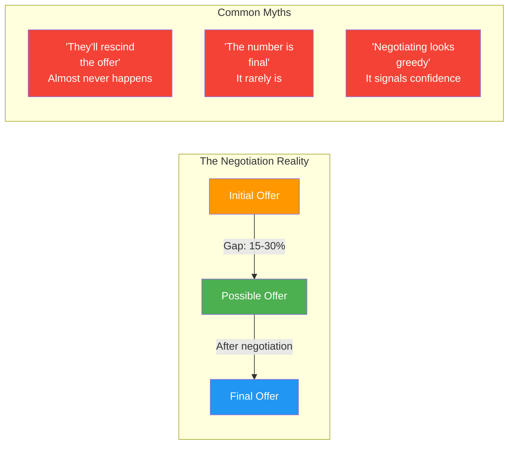
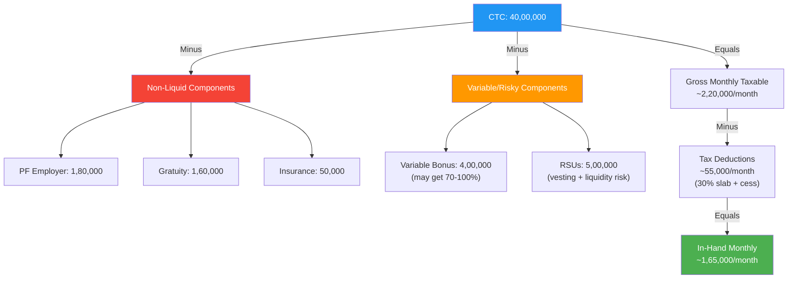
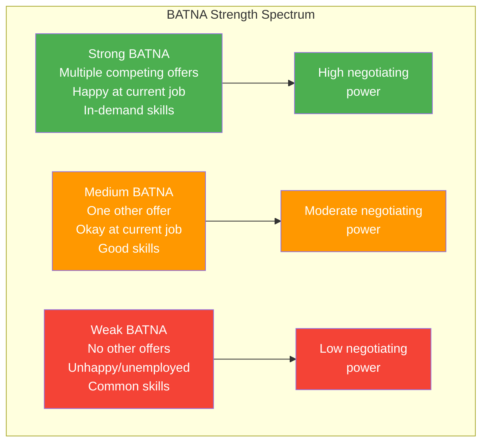
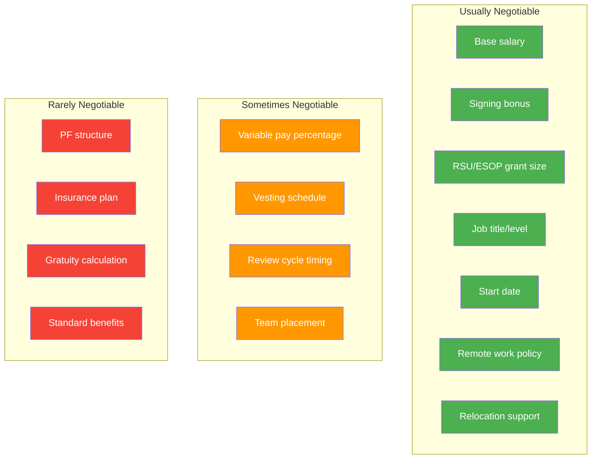

# Salary Negotiation: Indian Market, CTC vs In-Hand, BATNA & Counter-Offers

## Why Negotiation Matters

Most engineers leave significant money on the table by not negotiating. In the Indian tech market, the gap between the initial offer and the possible offer can be 15-30% at senior levels. Negotiation is expected by employers -- not negotiating often signals that you undervalue yourself.

---

## Understanding Indian CTC Structure

### CTC Breakdown (Typical Senior Engineer, Indian Product Company)

| Component | Typical % of CTC | Monthly/Annual | Tax Treatment | Liquid? |
|-----------|:-:|----------------|---------------|---------|
| **Basic Salary** | 40-50% | Monthly | Fully taxable | Yes |
| **HRA** | 20-25% | Monthly | Partially exempt (rent-dependent) | Yes |
| **Special Allowance** | 10-20% | Monthly | Fully taxable | Yes |
| **PF (Employer contribution)** | 5-12% | Monthly to PF | Tax-free (up to limit) | No (locked) |
| **Gratuity** | 4-5% | Accrual | Tax-free (after 5 years) | No (5-year lock) |
| **Medical Insurance** | 1-2% | Annual | Not income | No (benefit) |
| **Variable/Bonus** | 10-20% | Quarterly/Annual | Fully taxable | Partially (performance-dependent) |
| **Stock/RSUs** | 0-30% | Vesting schedule | Taxable on vesting | Partially (vesting + liquidity) |

### CTC vs In-Hand Calculation

### Quick In-Hand Estimation Formula

| CTC Range (LPA) | Approximate Monthly In-Hand | Ratio (In-Hand / CTC) |
|:---:|:---:|:---:|
| 15-25 LPA | 80K - 1.3L | ~65-70% |
| 25-40 LPA | 1.3L - 1.9L | ~58-65% |
| 40-60 LPA | 1.9L - 2.7L | ~55-60% |
| 60-80 LPA | 2.7L - 3.4L | ~52-57% |
| 80-100+ LPA | 3.4L - 4.2L+ | ~50-55% |

**Key insight**: As CTC increases, the in-hand percentage decreases due to higher tax slabs and larger non-liquid components (PF, gratuity, RSUs).

---

## Understanding Stock Options & RSUs

### ESOPs vs RSUs Comparison

| Aspect | ESOPs (Stock Options) | RSUs (Restricted Stock Units) |
|--------|----------------------|-------------------------------|
| **What you get** | Right to buy shares at a fixed price | Actual shares given to you |
| **Cost to you** | Exercise price (you pay to buy) | Nothing (granted for free) |
| **Risk** | If stock price < exercise price, worthless | Always has some value (unless company fails) |
| **Common at** | Startups, pre-IPO companies | Listed companies, post-IPO |
| **Tax event** | At exercise (difference between market and exercise price) | At vesting (full market value is taxed) |
| **Liquidity** | Only if company is listed or acquired | Liquid if company is listed |
| **Vesting** | Typically 4 years, 1-year cliff | Typically 4 years, quarterly/annual vesting |

### Evaluating Stock Offers

| Factor | Questions to Ask | Red Flag | Green Flag |
|--------|-----------------|----------|------------|
| **Valuation** | "What's the current 409A / fair market value?" | Refuses to share | Transparent about valuation |
| **Total shares** | "What percentage of the company do my options represent?" | Won't disclose total share count | Shares the cap table context |
| **Vesting** | "What's the vesting schedule? Is there a cliff?" | 5-year vesting, no acceleration | 4-year vest, 1-year cliff, standard |
| **Liquidity** | "When can I actually sell? Is there a secondary market?" | No liquidity event in sight | IPO planned, or secondary market available |
| **Dilution** | "How many funding rounds are planned?" | Many rounds planned (heavy dilution) | Late-stage or profitable |
| **Tax** | "What are the tax implications at exercise/vesting?" | No clear answer | Provides tax guidance |

---

## The BATNA Strategy

### What is BATNA?

**BATNA** = **B**est **A**lternative **T**o **N**egotiated **A**greement. It is your best option if this negotiation fails. Your BATNA is the single most important factor in your negotiating power.

### Building Your BATNA

| Strategy | How | Impact |
|----------|-----|--------|
| **Multiple applications** | Apply to 5-10 companies simultaneously | Creates competing offers |
| **Stagger timelines** | Slow down fast processes, speed up slow ones | Aligns offer deadlines |
| **Know your current value** | Research your current company's market rate | Even staying is a negotiable option |
| **Improve your fallback** | Consider freelancing, contracting, or consulting | Reduces desperation |
| **Never reveal desperation** | Don't mention unhappiness at current job | Preserves negotiating position |

### BATNA Scripts

| Situation | What to Say | What NOT to Say |
|-----------|-------------|-----------------|
| **You have competing offers** | "I have another offer at [level/range] that I'm considering. I prefer your company because [reason], but I need the compensation to be competitive." | "Company X is offering 50 LPA. Can you match it?" (too transactional) |
| **You don't have competing offers** | "Based on my research and market data, I believe [range] is appropriate for this role and my experience level." | "I don't have any other offers." (never volunteer weakness) |
| **You're happy at current job** | "I'm not actively looking to leave -- I'd need a compelling reason to make a move. The role is exciting, and I'd love to make it work if the compensation aligns." | "I'll stay at my current job if you don't pay me more." (sounds like a threat) |

---

## The Negotiation Timeline

### Indian Tech Market Typical Process

| Stage | Timing | What Happens | Your Action |
|-------|--------|--------------|-------------|
| **1. Verbal offer** | After final round | Recruiter calls with "good news" | Thank them. Ask for written offer. Do NOT accept verbally. |
| **2. Written offer** | 1-3 days after verbal | Email/letter with CTC breakdown | Review every line item. Calculate actual in-hand. |
| **3. Evaluation** | 2-5 days (ask for this time) | You analyze the offer | Compare to market, calculate BATNA, prepare counter. |
| **4. Counter-offer** | After evaluation | You present your counter | Use scripts below. Be specific about what you want. |
| **5. Company response** | 1-3 days | They accept, counter, or hold firm | Evaluate. You can counter once more if needed. |
| **6. Final negotiation** | If needed | Last round of adjustments | Focus on total package, not just base. |
| **7. Acceptance** | Within deadline | You formally accept | Get the final offer in writing before accepting. |

### Critical Rule: Never Accept on the Spot

> When you receive an offer (verbal or written), ALWAYS say: "Thank you so much -- I'm really excited about this opportunity. I'd like to take [2-3 days / the weekend] to review the details carefully. When do you need a decision by?"

---

## Counter-Offer Scripts

### Script 1: Base Salary Negotiation

> "Thank you for the offer. I'm genuinely excited about the role and the team. After reviewing the compensation, I'd like to discuss the base salary. Based on my research on [Levels.fyi, Glassdoor, conversations with peers], the market range for this role at this level is [range]. Given my [specific experience -- X years, expertise in Y, track record of Z], I believe [target number] would be more aligned. Is there flexibility here?"

### Script 2: Stock/RSU Negotiation

> "I appreciate the equity component. I'd like to understand the RSU structure better -- specifically the vesting schedule and refresh grants. Given that the first year involves a cliff, the effective first-year compensation is lower. Could we either increase the RSU grant or add a signing bonus to bridge the first year?"

### Script 3: Signing Bonus Negotiation

> "One thing I'd like to discuss is a signing bonus. I'm leaving [current benefit -- unvested RSUs, annual bonus that pays out in X months, retention bonus]. A signing bonus of [amount] would help offset what I'm forfeiting to make this move. Is that something you can accommodate?"

### Script 4: Variable Pay Negotiation

> "I noticed the variable component is [X% of CTC]. I have two questions: (1) What percentage of the variable has historically been paid out? (2) Is there flexibility to shift some of the variable to the fixed component? I prefer a higher guaranteed base for financial planning."

### Script 5: Full Package Counter

> "I've reviewed the offer carefully and I'm very excited about joining. To make this work, I'd like to propose the following adjustments:
> 1. Base salary: [target] (currently offered: [current])
> 2. Signing bonus: [amount] to offset my unvested RSUs at [current company]
> 3. [Any other specific ask]
>
> This would bring the total package to [target total], which I believe reflects my experience and the market. I'm happy to discuss further -- this is my top choice and I want to make it work."

---

## Comparing Multiple Offers

### The Offer Comparison Matrix

| Factor | Weight | Company A | Company B | Company C |
|--------|:------:|-----------|-----------|-----------|
| **Fixed monthly in-hand** | 25% | ___/10 | ___/10 | ___/10 |
| **Total annual comp (realistic)** | 20% | ___/10 | ___/10 | ___/10 |
| **Stock/equity upside** | 10% | ___/10 | ___/10 | ___/10 |
| **Role & growth opportunity** | 20% | ___/10 | ___/10 | ___/10 |
| **Engineering culture & team** | 10% | ___/10 | ___/10 | ___/10 |
| **Work-life balance** | 10% | ___/10 | ___/10 | ___/10 |
| **Location / remote policy** | 5% | ___/10 | ___/10 | ___/10 |
| **Weighted Total** | 100% | ___ | ___ | ___ |

### What "Total Comp" Actually Means

| Component | How to Value It | Risk Level |
|-----------|----------------|:---:|
| Base salary | 100% face value | Low |
| HRA, allowances | 100% face value | Low |
| PF (employer) | Discount 20% (locked capital) | Low |
| Gratuity | Discount 30% (5-year lock) | Medium |
| Variable bonus | Value at 70-80% (performance dependent) | Medium |
| RSUs (listed company) | Value at 80-90% (vesting risk, tax on vest) | Medium |
| ESOPs (startup) | Value at 30-50% (liquidity risk, dilution) | High |
| Signing bonus | 100% face value (one-time) | Low |

---

## Negotiation Principles

### The Do's and Don'ts

| Do | Don't |
|----|-------|
| Negotiate on total package, not just base | Fixate on CTC number alone |
| Use market data (Levels.fyi, Glassdoor) | Make up numbers or lie about other offers |
| Be specific about what you want | Say "I want more money" vaguely |
| Express genuine enthusiasm for the role | Make it purely transactional |
| Ask for time to evaluate | Accept or reject on the spot |
| Consider non-monetary benefits (remote, role) | Ignore non-salary factors |
| Be willing to walk away (have a BATNA) | Bluff about walking away |
| Get the final offer in writing | Accept verbal commitments |
| Be professional and respectful throughout | Issue ultimatums or be aggressive |
| Know your minimum acceptable number | Enter negotiation without a bottom line |

### Negotiable vs Non-Negotiable Components

---

## Handling Counter-Offers from Current Employer

### Should You Accept a Counter-Offer?

| Factor | Accept Counter | Don't Accept Counter |
|--------|:---:|:---:|
| Your reason for leaving was purely financial | Consider | - |
| You love the team and work, just underpaid | Consider | - |
| You're leaving for growth/role reasons | - | Decline |
| Trust with manager is damaged by resignation | - | Decline |
| Counter only matches, doesn't exceed new offer | - | Decline |
| You've already mentally checked out | - | Decline |

### Statistics to Consider

- 50-80% of people who accept counter-offers leave within 12 months
- Counter-offers often come from a retention budget, not a genuine reassessment of your value
- Your employer now knows you're a flight risk -- this can affect future opportunities
- The underlying reasons for wanting to leave (growth, culture, role) rarely change with more money

### Counter-Offer Response Script

If declining:
> "I truly appreciate the counter-offer, and it shows how much the team values my contribution. After careful thought, my decision to move is based on [growth opportunity / role change / career direction], not just compensation. I want to ensure a smooth transition over the next [notice period]."

If considering:
> "I appreciate this. I'd like to take [2-3 days] to think it through carefully. Can we schedule time on [day] to discuss?"

---

## Indian Market Specifics

### Notice Period Negotiation

| Company Type | Typical Notice Period | Can You Negotiate? | Strategy |
|-------------|----------------------|:---:|---------|
| Startups | 1-2 months | Yes | "Can we discuss a 30-day notice or buyout?" |
| Mid-size product companies | 2-3 months | Sometimes | Offer to create thorough handover documentation |
| Large Indian companies | 3 months | Rarely | Plan ahead; start interviewing 4+ months before desired move |
| MNCs in India | 1-2 months | Yes | Often more flexible; can negotiate with both sides |

### Salary Benchmarking Resources for India

| Resource | Best For | Accuracy | Free? |
|----------|---------|:---:|:---:|
| Levels.fyi | MNC comparison, accurate for top companies | High | Yes |
| Glassdoor India | Broad range, good for mid-tier | Medium | Yes |
| Blind | Anonymous real data, often inflated | Medium-High | Yes |
| Instahyre/Cutshort | Market demand signals | Medium | Yes |
| AmbitionBox | Indian company specific | Medium | Yes |
| Peers/network | Most reliable for specific companies | High | Yes |

---

## Interview Q&A

> **Q1: When should I reveal my salary expectations?**
> **A**: As late as possible. When the recruiter asks in the initial call, deflect: "I'd prefer to learn more about the role and scope before discussing numbers. Can you share the budgeted range for this position?" If pressed, give a range based on market research, not your current salary: "Based on my research for this level and scope, I'm looking at [range]. But I'm flexible for the right opportunity." Never anchor low. In India, it's common for recruiters to ask for your current CTC -- you can share it but always add context: "My current CTC is [X], but my expectation for this role is [higher range] based on the scope and market rates."

> **Q2: Should I lie about having other offers?**
> **A**: Never lie. If you don't have other offers, don't claim you do -- experienced recruiters will call your bluff and ask for details. Instead, focus on market data: "Based on market research and conversations with peers at similar companies, I understand the range for this role is [range]." If you do have other offers, it's completely appropriate to mention them: "I'm considering an offer from [company/level] and I'd like to make a well-informed decision."

> **Q3: How do I negotiate when the offer seems fair?**
> **A**: Even fair offers have room for improvement on some dimension. You can negotiate: signing bonus (especially if leaving unvested compensation), RSU refresh timing, review cycle timing ("Can we schedule my first compensation review at 6 months instead of 12?"), or non-monetary items (remote flexibility, conference budget, learning budget). Even a small ask shows you value yourself: "The base looks good. Could we discuss a signing bonus to offset the variable pay I'll forfeit at my current company?"

> **Q4: What if the company says the offer is final and non-negotiable?**
> **A**: Respect it, but verify. Ask: "I understand. Just to confirm -- is there flexibility on any component? For instance, signing bonus, RSUs, or start date?" Sometimes "non-negotiable" means "non-negotiable on base salary" but other components have room. If truly final, decide based on the total picture (role, growth, team, compensation). Don't negotiate aggressively once they've clearly said it's final -- that can sour the relationship before you even start.

> **Q5: How do I handle the "What's your current CTC?" question in India?**
> **A**: This is extremely common in India and harder to avoid than in markets with salary history bans. Options: (1) Share it honestly but reframe: "My current CTC is [X], but my expectation is [higher] based on the market rate for this role and my experience." (2) Share in-hand instead of CTC: "My current monthly in-hand is [X], and I'm looking for [target]." (3) Redirect: "I'd prefer to discuss what's fair for this role rather than anchor on my current compensation. What's the range budgeted for this position?" (4) In rare cases with very progressive companies, you can politely decline: "I'd rather not share my current CTC -- can we discuss based on the role's value?"

> **Q6: How do I evaluate startup ESOPs in India?**
> **A**: Apply a significant discount. Key questions: (1) What's the strike price and current valuation? (2) What percentage of the company do your options represent? (3) What's the vesting schedule and cliff? (4) Is there any liquidity mechanism (secondary sales)? (5) What's the path to IPO/acquisition? (6) How many more funding rounds might dilute your shares? Rule of thumb: for a pre-IPO Indian startup, value ESOPs at 20-40% of their paper value when comparing offers. For listed company RSUs, value at 80-90% (accounting for vesting risk and tax on vesting).

---

## Negotiation Preparation Checklist

- [ ] Calculated current in-hand salary (not just CTC)
- [ ] Researched market rate for target role/level (Levels.fyi, Glassdoor, peers)
- [ ] Identified BATNA (what's your alternative if this negotiation fails?)
- [ ] Determined minimum acceptable offer (your walk-away number)
- [ ] Determined target offer (your ideal outcome)
- [ ] Listed what you're leaving behind (unvested RSUs, bonus, benefits)
- [ ] Prepared specific counter-offer with reasoning
- [ ] Practiced negotiation scripts out loud
- [ ] Prepared responses for pushback ("the offer is final", "this is our top of band")
- [ ] Decided on non-salary items to negotiate if salary is capped
