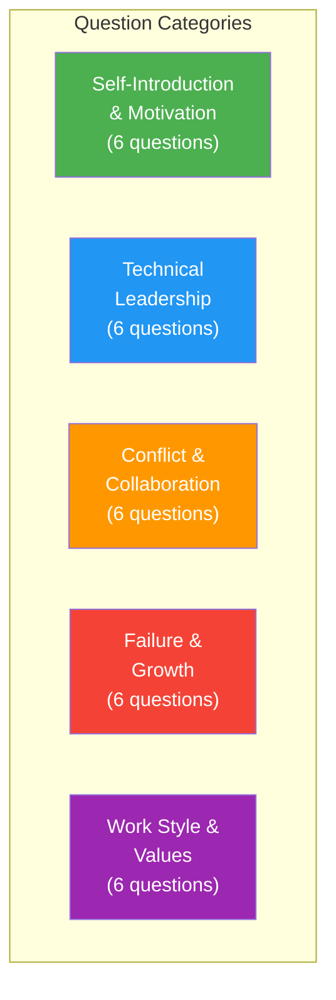
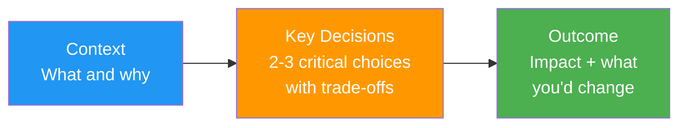
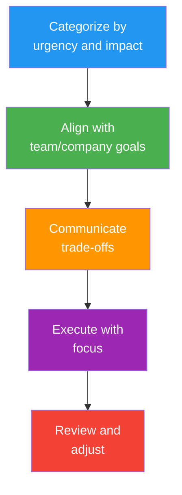
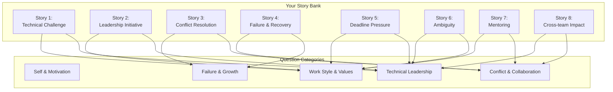

# Common Behavioral Interview Questions: 30 Top Questions with Frameworks

## Overview

This guide covers the 30 most frequently asked behavioral interview questions for senior and staff-level engineering roles. Each question includes the intent behind it, a response framework, and guidance on what to emphasize. Questions are grouped by category for easier study.

## How to Use This Guide

1. For each question, read the **Intent** (why they ask it), the **Framework** (how to structure your answer), and the **Example Structure** (a fill-in-the-blank template)
2. Write out YOUR answer using the framework
3. Practice saying it out loud -- aim for 90-120 seconds per answer
4. Prepare 2-3 follow-up responses for each question

---

## Category 1: Self-Introduction & Motivation

### Q1: "Tell me about yourself"

**Intent**: Can you communicate your career narrative clearly? Do you have a coherent story?

**Framework: Present-Past-Future (2 minutes max)**

| Section | Duration | Content |
|---------|----------|---------|
| **Present** | 30 sec | Current role, key responsibilities, notable achievements |
| **Past** | 45 sec | Career journey (2-3 highlights that build a narrative) |
| **Future** | 30 sec | Why you're here, what excites you about this role |

**Example Structure**:
> "Currently, I'm a [role] at [Company], where I [key responsibility]. Recently, I [notable achievement with quantified impact].
>
> I got here through [brief career arc -- 2-3 sentences covering the key transitions]. At [Previous Company], I [relevant highlight]. This led me to [Current Company], where I [growth/impact].
>
> Now I'm looking for [what you want next], which is why [Company you're interviewing at] excites me -- [specific reason tied to role/company]."

**Avoid**: Starting from childhood, listing every job, being longer than 2 minutes, saying "where do you want me to start?"

---

### Q2: "Why are you leaving your current company?"

**Intent**: Are you running from something (red flag) or toward something (green flag)?

**Framework: Push-Pull-Positive**

| Element | What to Say | What NOT to Say |
|---------|-------------|-----------------|
| **Acknowledge current role** | "I've learned a lot and grown at [Company]" | "I hate my manager / the culture is toxic" |
| **Positive pull** | "I'm excited about [specific opportunity at new company]" | "I just need a change" |
| **Growth framing** | "I'm looking for [challenge, scale, domain] that this role offers" | "There's no growth at my current company" |

**Example Structure**:
> "I've had a great experience at [Company] -- I [specific achievement]. However, I'm at a point where I want to [growth goal -- work at larger scale, move closer to product, lead architectural decisions], and this role at [Company] offers exactly that. Specifically, [tie to role/company]."

---

### Q3: "Why do you want to work here?"

**Intent**: Have you done your research? Is this a deliberate choice?

**Framework**: See the Company Research module (06) for the full three-layer framework.

**Quick Structure**:
> "[Specific thing about the company -- product, technical challenge, mission]. This connects to my experience in [your relevant background]. I believe I can contribute to [specific challenge] given my work on [related experience]."

---

### Q4: "Where do you see yourself in 5 years?"

**Intent**: Do you have career direction? Will you stay and grow?

**Framework: Growth + Alignment**

| Good Answer Pattern | Bad Answer Pattern |
|--------------------|--------------------|
| "I want to deepen my impact as a technical leader" | "I want to be VP of Engineering" (too ambitious/political) |
| "I see myself as a [Staff/Principal] engineer driving [type of work]" | "I don't really know" (no direction) |
| "I want to become an expert in [domain relevant to this role]" | "I want to start my own company" (flight risk) |

**Example Structure**:
> "In 5 years, I see myself as a [target level] engineer who [type of impact -- shapes technical strategy, mentors the next generation, drives platform-level decisions]. Specifically, I want to deepen my expertise in [area relevant to this role] and expand my impact to [scope -- org-level, company-level]. This role is a direct path to that because [connection]."

---

### Q5: "What's your biggest strength?"

**Intent**: Self-awareness + can you back it up with evidence?

**Framework: Claim + Evidence + Application**

**Example Structure**:
> "My biggest strength is [specific skill -- not 'hard-working' but something concrete like 'breaking down ambiguous problems into executable plans']. For example, at [Company], [brief STAR example demonstrating the strength with quantified result]. I'd apply this here by [how it's relevant to the role]."

**Strong Strengths for Senior/Staff Engineers**:

| Strength | Why It's Strong | Evidence to Prepare |
|----------|----------------|-------------------|
| Simplifying complex systems | Shows architectural maturity | Story about reducing complexity |
| Building consensus across teams | Shows leadership | Cross-team alignment story |
| Balancing technical debt with delivery | Shows judgment | Prioritization story |
| Mentoring and growing engineers | Shows multiplier effect | Mentee growth story |
| Debugging production systems under pressure | Shows resilience | Incident response story |

---

### Q6: "What's your biggest weakness?"

**Intent**: Self-awareness + active improvement

**Framework: Real Weakness + Awareness + Active Mitigation**

| Approach | Example | Why It Works |
|----------|---------|-------------|
| **Genuine weakness with mitigation** | "I tend to over-engineer solutions. I've learned to counter this by setting 'good enough' criteria upfront and time-boxing design phases." | Shows self-awareness AND action |
| **Growth area tied to your level** | "As I move toward staff-level impact, I'm working on my ability to influence across organizations. I've started [specific action]." | Shows ambition AND honesty |

**Never say**: "I work too hard" / "I'm a perfectionist" / "I care too much" -- these non-answers signal low self-awareness.

**Example Structure**:
> "One area I'm actively working on is [genuine weakness]. For example, [brief example of how it manifested]. I've been addressing this by [specific actions -- e.g., using a framework, getting feedback, practicing deliberately]. Recently, [evidence of improvement]."

---

## Category 2: Technical Leadership

### Q7: "Tell me about the most complex system you've designed"

**Intent**: Technical depth, communication ability, decision-making

**Framework: Context-Decisions-Outcome**

**Example Structure**:
> "At [Company], I designed [system] to handle [scale/requirement]. The key design decisions were: (1) [Decision + trade-off], (2) [Decision + trade-off]. The result was [quantified outcome]. If I were to redesign it today, I would [what you'd change and why]."

---

### Q8: "How do you make technical decisions?"

**Intent**: Decision-making process, collaboration, judgment

**Framework: Process Description**

> "My approach depends on the reversibility and impact of the decision. For high-impact, hard-to-reverse decisions, I [write an RFC, gather data, prototype options, consult broadly]. For low-impact, easily reversible decisions, I [decide quickly, bias for action, iterate].
>
> For example, [brief story of a significant technical decision showing this process]."

---

### Q9: "How do you handle technical debt?"

**Intent**: Pragmatism, prioritization, communication with stakeholders

**Framework: Acknowledge-Classify-Prioritize**

| Debt Type | Your Approach | Example |
|-----------|---------------|---------|
| **Dangerous** (security, data integrity) | Fix immediately, no negotiation | "I always escalate security debt" |
| **Painful** (slows team daily) | Quantify cost, propose sprint allocation | "I measured we lost 5 hours/week to this" |
| **Cosmetic** (ugly but functional) | Track but deprioritize | "I log it but don't disrupt product work" |

**Example Structure**:
> "I treat technical debt as an investment decision, not a moral one. I classify debt by impact on team velocity and risk. For the [project] at [Company], I [specific example of how you managed tech debt with quantified trade-offs]."

---

### Q10: "Describe a time you improved team productivity"

**Intent**: Multiplier effect, going beyond individual contribution

**Example Structure**:
> "At [Company], I noticed [productivity problem -- slow CI, manual processes, knowledge silos]. I [action -- built tooling, created templates, streamlined process]. The result was [quantified improvement -- reduced build time from X to Y, saved Z hours per sprint]. The approach was adopted by [scope]."

---

### Q11: "How do you approach code reviews?"

**Intent**: Quality standards, mentoring, communication

**Framework: What You Look For + How You Communicate**

| Dimension | What You Check | How You Communicate |
|-----------|---------------|-------------------|
| Correctness | Logic, edge cases, error handling | "What happens when [edge case]?" |
| Design | Abstractions, coupling, naming | "Could we simplify this by..." |
| Readability | Future maintainer can understand | "A comment here would help because..." |
| Testing | Coverage, meaningful assertions | "Could we add a test for [scenario]?" |
| Performance | Only for hot paths | "Since this is called [frequency], have we considered..." |

**Example Structure**:
> "I prioritize [dimensions] in code reviews. I frame feedback as questions rather than directives to encourage discussion. For junior engineers, I use reviews as teaching moments. At [Company], my approach to reviews [specific impact -- reduced bug escape rate, improved onboarding time]."

---

### Q12: "How do you stay current with technology?"

**Intent**: Growth mindset, learning habits

**Example Structure**:
> "I have a three-layer approach: (1) **Daily**: I follow [specific sources -- newsletters, RSS, Twitter accounts] for broad awareness. (2) **Weekly**: I deep-dive into one topic through [method -- reading papers, building prototypes, contributing to open source]. (3) **Quarterly**: I evaluate new technologies against real problems in my work. For example, I recently explored [technology] which led to [concrete application]."

---

## Category 3: Conflict & Collaboration

### Q13: "Tell me about a disagreement with a colleague"

**Intent**: Conflict resolution, empathy, professionalism

**Framework**: Use the Conflict Resolution story templates (module 03).

**Quick structure**: Understood their perspective, found common ground, used data, reached resolution, maintained relationship.

---

### Q14: "How do you handle feedback you disagree with?"

**Intent**: Coachability, emotional maturity

**Example Structure**:
> "When I receive feedback I initially disagree with, I've learned to pause before reacting. I ask clarifying questions to understand the specific observation: 'Can you give me an example of when this happened?' Then I reflect on it honestly. At [Company], [brief example of feedback you received, initially resisted, then recognized value in]. I changed [specific behavior] and the result was [improvement]."

---

### Q15: "Describe working with a difficult person"

**Intent**: Interpersonal skills, professionalism, empathy

**Framework: Understand-Adapt-Outcome**

> "At [Company], I worked with [role] who was difficult because [specific behavior -- not personality: 'they communicated abruptly' not 'they were rude']. I took the time to understand [their context -- pressured, different communication style, different priorities]. I adapted by [specific change in your approach]. The result was [improved working relationship + specific outcome]."

**Key rule**: Never describe someone as a bad person. Describe specific behaviors and show empathy for their context.

---

### Q16: "How do you communicate technical concepts to non-technical stakeholders?"

**Intent**: Communication range, empathy, influence

**Example Structure**:
> "I use three techniques: (1) **Analogies**: I connect technical concepts to familiar ideas. For example, I explained database sharding to our PM by comparing it to [analogy]. (2) **Impact framing**: Instead of 'we need to refactor the service,' I say 'this change will reduce customer-facing errors by 40%.' (3) **Visual aids**: I draw simple diagrams even in casual conversations. At [Company], this approach helped me [specific outcome -- gain approval for a project, align on priorities]."

---

### Q17: "Tell me about a time you had to say no"

**Intent**: Boundaries, prioritization, communication

**Example Structure**:
> "At [Company], [stakeholder] asked me to [request -- add a feature, take on a project, change priorities]. I said no because [reason -- it would compromise quality, it wasn't aligned with team goals, the timeline was unrealistic]. I communicated it as: [how you framed the no -- offered alternatives, showed data on trade-offs, proposed a different timeline]. The outcome was [result -- stakeholder understood, we found a better solution]."

---

### Q18: "How do you build relationships with new team members?"

**Intent**: Team player, cultural fit, onboarding awareness

**Example Structure**:
> "When joining or welcoming someone new, I [specific actions -- schedule 1:1 coffee chats, pair program on a small task, share the unwritten context that documentation misses]. At [Company], when [new person] joined, I [specific action] which helped them [outcome -- ramp up in X time, make their first contribution by Y, feel included in the team]. I believe the first 30 days shape someone's entire tenure."

---

## Category 4: Failure & Growth

### Q19: "Tell me about your biggest failure"

**Intent**: Self-awareness, accountability, resilience

**Framework**: Use the Failure Stories templates (module 04).

**Quick rule**: 30% on what went wrong, 70% on recovery and learning.

---

### Q20: "Tell me about a time you received critical feedback"

**Intent**: Coachability, growth mindset

**Example Structure**:
> "At [Company], my manager gave me feedback that [specific feedback -- I was too detail-oriented in reviews and slowing the team, I wasn't visible enough to leadership, I wasn't delegating enough]. My initial reaction was [honest -- defensive, surprised, resistant]. But when I reflected, I realized [what was true about the feedback]. I changed by [specific actions over time]. The result was [measurable improvement]."

---

### Q21: "Describe a time you were outside your comfort zone"

**Intent**: Growth mindset, adaptability, courage

**Example Structure**:
> "At [Company], I was asked to [uncomfortable task -- present to 200 people, lead a team of 8 for the first time, own a domain I had no experience in]. I was uncomfortable because [honest reason]. I prepared by [specific actions]. The experience taught me [lesson]. Now I [how it changed you]."

---

### Q22: "What would your current manager say about you?"

**Intent**: Self-awareness, ability to see yourself through others' eyes

**Framework: Strength + Growth Area (be consistent with what you'd say in a reference check)**

> "I think [Manager] would say my strengths are [2 strengths with brief evidence]. They'd also say I'm working on [growth area -- the same one you mentioned as your weakness]. In my last review, the specific feedback was [quote or paraphrase from actual feedback]."

---

### Q23: "Tell me about a time you had to learn something quickly"

**Intent**: Learning ability, adaptability, resourcefulness

**Example Structure**:
> "At [Company], I needed to learn [skill/technology/domain] in [short timeframe] because [context -- new project, team member left, urgent need]. I [learning strategy -- read documentation, built a prototype, found a mentor, took an intensive course]. Within [timeframe], I was able to [outcome -- deliver the feature, become the team's go-to, teach others]. The key was [learning insight]."

---

### Q24: "What's the most important thing you've learned in your career?"

**Intent**: Depth of experience, wisdom, self-reflection

**Example Structure**:
> "The most important lesson I've learned is [specific lesson -- not generic]. Early in my career, I believed [old belief]. Through [experience], I learned that [new understanding]. For example, [brief story that illustrates the lesson]. This principle guides how I [current behavior]."

**Strong answers for senior/staff engineers**:

| Lesson | Why It's Strong |
|--------|----------------|
| "The best code is the code you don't write" | Shows maturity about simplicity |
| "Technical decisions are always also people decisions" | Shows organizational awareness |
| "Shipping is a feature" | Shows pragmatism |
| "Listening is the most underrated engineering skill" | Shows communication maturity |
| "The system you're responsible for includes the humans operating it" | Shows systems thinking |

---

## Category 5: Work Style & Values

### Q25: "How do you prioritize your work?"

**Intent**: Time management, judgment, stakeholder awareness

**Framework: Process + Example**

> "I use [method -- impact/effort matrix, Eisenhower matrix, team goals alignment] to prioritize. I protect focus time for deep work and batch meetings. When priorities conflict, I [how you resolve -- discuss with manager, evaluate against quarterly goals, use data]. For example, at [Company], [brief story of a prioritization decision with outcome]."

---

### Q26: "How do you handle ambiguity?"

**Intent**: Comfort with uncertainty, problem structuring

**Framework**: Use the Ambiguity story skeleton from the STAR Method module (01).

> "I thrive in ambiguity because I have a process for creating structure: (1) Identify what I DO know vs. what I DON'T know, (2) Talk to people who might have pieces of the answer, (3) Create a minimal plan and start executing to generate information, (4) Iterate as I learn more. At [Company], [brief example]."

---

### Q27: "Describe your ideal work environment"

**Intent**: Culture fit assessment

**Framework: Be honest but align with what you know about the company**

| Good to Mention | Risky to Mention |
|----------------|-----------------|
| "I value autonomy with accountability" | "I like to work completely independently" |
| "I prefer small, focused teams" | "I don't like meetings" |
| "I value feedback and continuous improvement" | "I want a stress-free environment" |
| "I appreciate clear goals with flexibility on approach" | "I need detailed specifications for everything" |

> "My ideal environment has [2-3 specific things]. For example, at [Company], I was most productive when [specific condition]. I noticed from [your research] that [Company] values [specific thing] which aligns with my preferred working style."

---

### Q28: "How do you mentor junior engineers?"

**Intent**: Multiplier effect, teaching ability, patience

**Example Structure**:
> "My mentoring approach is [philosophy -- grow their decision-making, not their dependency on me]. Specifically, I (1) [method -- pair program weekly on challenging tasks], (2) [method -- review their code with teaching comments, not just 'fix this'], (3) [method -- give them stretch assignments with safety net]. At [Company], I mentored [person] who went from [before state] to [after state] over [timeframe]. The key was [specific insight about mentoring]."

---

### Q29: "What do you do when you disagree with a decision made by leadership?"

**Intent**: Can you disagree and commit? Do you have judgment about when to push?

**Framework: Assess-Advocate-Commit**

> "First, I make sure I fully understand the decision and the context behind it -- leaders often have information I don't. If I still disagree, I [how you escalate -- write up my concerns with data, request a 1:1, present alternatives]. If the decision stands after I've made my case, I commit fully and execute. At [Company], [brief example showing this exact pattern]. The outcome was [result]."

---

### Q30: "Do you have any questions for me?"

**Intent**: Your engagement, research, critical thinking

**Framework: Always have 3-5 prepared questions. Prioritize based on the interviewer's role.**

| Interviewer Role | Best Questions to Ask |
|------------------|----------------------|
| **Peer engineer** | "What's the biggest technical challenge the team is facing right now?" |
| **Hiring manager** | "What would success look like for this role in the first 6 months?" |
| **Senior leader** | "How does this team's work connect to the company's broader technical strategy?" |
| **Cross-functional** | "How does the engineering team collaborate with [your function]?" |

**Strong questions** (show depth):
- "I noticed [specific thing from research]. Can you tell me more about [related topic]?"
- "What's the team's approach to [specific engineering practice]?"
- "What's the most impactful project the team shipped recently, and what made it successful?"
- "What does the on-call rotation look like, and how does the team approach incident management?"
- "How are technical decisions made when there's disagreement?"

---

## Question-to-Story Mapping Matrix

Use this to ensure your 8-10 prepared stories cover all question categories:

| Story | Questions It Answers |
|-------|---------------------|
| **Technical Challenge** | Q7, Q8, Q9, Q11, Q12, Q23 |
| **Leadership Initiative** | Q7, Q10, Q25, Q29 |
| **Conflict Resolution** | Q13, Q14, Q15, Q17, Q18 |
| **Failure & Recovery** | Q19, Q20, Q21, Q24 |
| **Deadline Pressure** | Q5, Q10, Q25, Q26 |
| **Ambiguity** | Q21, Q23, Q26 |
| **Mentoring** | Q10, Q11, Q18, Q28 |
| **Cross-team Impact** | Q13, Q16, Q17, Q18 |

---

## Interview Q&A

> **Q1: How many stories should I prepare for behavioral interviews?**
> **A**: Prepare 8-10 well-practiced stories. This covers virtually all behavioral questions through remixing. Each story should be versatile enough to answer 3-5 different questions by changing which aspect you emphasize. Map your stories to question categories using the matrix above and ensure every category has at least 2 stories.

> **Q2: Should my answers be the same for every company?**
> **A**: The stories should be the same (your real experiences), but the emphasis should change based on the company's values. For a company that values "move fast," emphasize speed and iteration in your stories. For one that values "technical excellence," emphasize quality and depth. See the Company Research module (06) for value mapping.

> **Q3: How do I handle rapid-fire behavioral questions where the interviewer asks many questions in quick succession?**
> **A**: Keep each answer to 60-90 seconds instead of the usual 2 minutes. Hit the key STAR elements but compress the situation. If the interviewer is asking many questions, they want breadth, not depth. You can always offer: "I can go deeper on any of these if you'd like."

> **Q4: What if I blank on a question and can't think of a relevant story?**
> **A**: Buy time honestly: "That's a great question. Let me think for a moment about the best example." Then mentally scan your story bank for the closest match. If nothing fits, say: "I don't have an exact match for that scenario, but the closest experience I have is..." and bridge to a related story. Silence for 10-15 seconds while you think is perfectly acceptable.

> **Q5: How do I handle "tell me more" or "can you give another example?"**
> **A**: This usually means your first answer was too brief or they want to verify the pattern. Either expand on the first story with more detail, or tell a second story from a different context. Having 2 stories per category prevents being caught off guard. If you genuinely don't have another example, say: "I don't have another direct example, but a related situation where I demonstrated [skill] was [different story]."

> **Q6: Should I bring notes to a behavioral interview?**
> **A**: For virtual interviews, having bullet-point notes (not full scripts) for your key stories is fine -- just don't read from them. For in-person interviews, you can bring a portfolio or one-page summary of your key projects and metrics. Never read from a script. The goal is to sound natural and conversational. Notes are a safety net, not a crutch.

---

## 30-Day Behavioral Interview Preparation Plan

| Week | Focus | Daily Practice (30 min) |
|------|-------|------------------------|
| **Week 1** | Write your 8-10 stories using STAR templates | Write 2 stories per day, refine previous ones |
| **Week 2** | Practice stories out loud, time yourself | Record 2-3 answers daily, listen back |
| **Week 3** | Map stories to question categories, practice remixing | Answer 5 random questions from this guide daily |
| **Week 4** | Mock interviews, company-specific tailoring | Do 2-3 mock interviews, tailor for target companies |

---

## Practice Checklist

- [ ] Written out 8-10 STAR stories covering all 5 categories
- [ ] Each story timed at 90-120 seconds spoken
- [ ] Mapped stories to specific questions using the matrix
- [ ] Practiced "Tell me about yourself" until it flows naturally
- [ ] Prepared "Why this company?" for each target company
- [ ] Have a genuine weakness answer with active mitigation
- [ ] Prepared 3-5 questions to ask each type of interviewer
- [ ] Done at least 2 mock behavioral interviews
- [ ] Recorded myself answering questions and reviewed for filler words
- [ ] Can pivot any story to answer multiple question types
