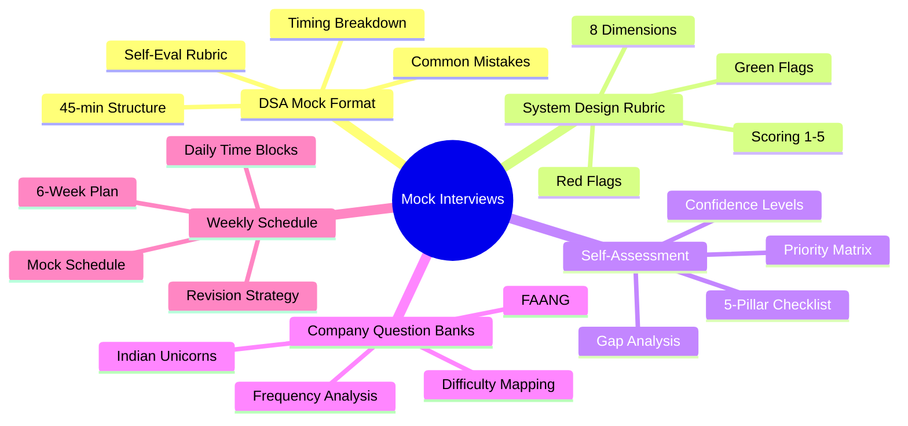
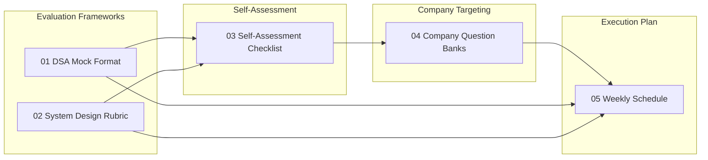
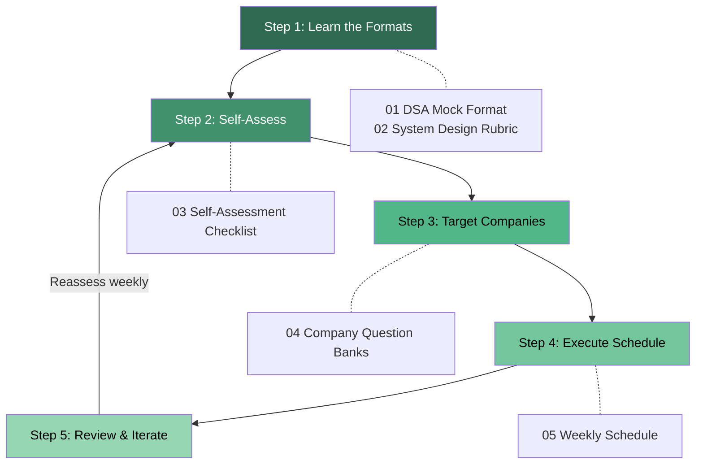

# Mock Interviews — Preparation & Practice Hub

## Overview

The Mock Interviews module is your operational command center for interview preparation. It brings together evaluation frameworks, self-assessment tools, company-specific question banks, and a structured weekly schedule to transform raw knowledge into interview-ready performance.

## Topic Map

## Topic Table

| # | Topic | File | Key Concepts | Purpose | Priority |
|---|-------|------|-------------|---------|----------|
| 01 | DSA Mock Format | `01-dsa-mock-format/guide.md` | 45-min structure, timing, rubric, self-eval | Know exactly how DSA interviews are scored | High |
| 02 | System Design Rubric | `02-system-design-rubric/guide.md` | 8 dimensions, green/red flags, scoring | Understand what interviewers look for in design rounds | High |
| 03 | Self-Assessment | `03-self-assessment/checklist.md` | 5-pillar checklist, confidence levels, gaps | Identify weak spots across all preparation areas | High |
| 04a | FAANG Question Bank | `04-company-question-banks/faang.md` | Google, Amazon, Meta, Apple, Netflix, Microsoft | Company-specific patterns and question types | Medium |
| 04b | Indian Unicorns Bank | `04-company-question-banks/indian-unicorns.md` | Flipkart, Razorpay, Swiggy, Zerodha, PhonePe, CRED, Meesho, Groww | Indian startup interview patterns and culture | Medium |
| 05 | Weekly Schedule | `05-weekly-schedule/template.md` | 6-week plan, daily blocks, mock cadence | Structured execution plan for prep | High |

## Recommended Study Order

### Phase 1 — Know the Game (Day 1)
1. **01-DSA Mock Format** — Understand exactly how coding interviews are structured and scored
2. **02-System Design Rubric** — Learn the 8 dimensions interviewers evaluate

### Phase 2 — Know Yourself (Day 2)
3. **03-Self-Assessment Checklist** — Audit your current readiness across all 5 pillars

### Phase 3 — Know the Enemy (Day 3)
4. **04-Company Question Banks** — Study company-specific patterns for your target companies

### Phase 4 — Execute (Weeks 1-6)
5. **05-Weekly Schedule** — Follow the 6-week intensive plan, adjusting based on your self-assessment

## Progress Tracker

| # | Topic | Read | Understood | Applied in Mock | Iterated | Confident |
|---|-------|:----:|:----------:|:---------------:|:--------:|:---------:|
| 01 | DSA Mock Format | [ ] | [ ] | [ ] | [ ] | [ ] |
| 02 | System Design Rubric | [ ] | [ ] | [ ] | [ ] | [ ] |
| 03 | Self-Assessment Checklist | [ ] | [ ] | [ ] | [ ] | [ ] |
| 04a | FAANG Question Bank | [ ] | [ ] | [ ] | [ ] | [ ] |
| 04b | Indian Unicorns Bank | [ ] | [ ] | [ ] | [ ] | [ ] |
| 05 | Weekly Schedule | [ ] | [ ] | [ ] | [ ] | [ ] |

## How to Use This Module

1. **Start with frameworks** — Read the DSA and system design rubrics so you know what "good" looks like
2. **Audit yourself honestly** — Complete the self-assessment checklist with brutal honesty
3. **Pick target companies** — Identify 3-5 target companies and study their question banks
4. **Follow the schedule** — Use the 6-week template, adjusting time allocation based on your weak areas
5. **Track and iterate** — After each mock, score yourself using the rubrics and update your self-assessment
