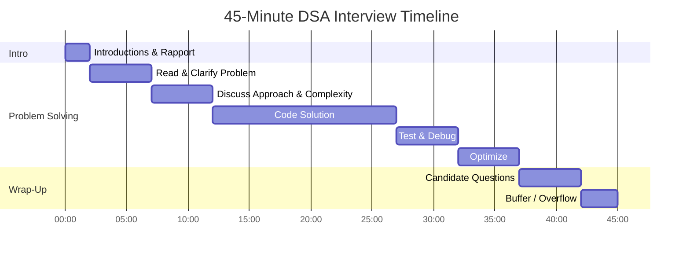
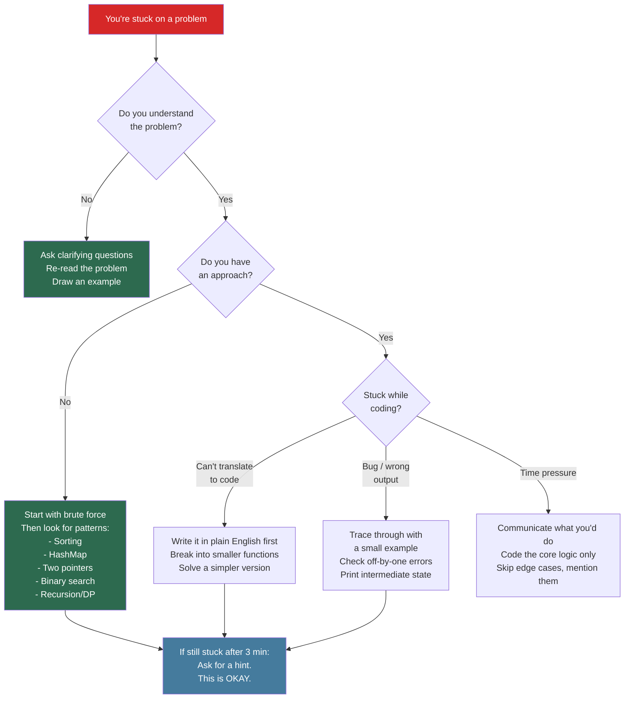

# DSA Mock Interview Format — 45-Minute Structure

## Overview

The standard DSA coding interview is a 45-minute window where you must demonstrate problem-solving ability, coding skill, and communication clarity. This guide breaks down the exact timing, what interviewers evaluate at each phase, and how to self-score your performance.

## Interview Timeline



## Phase-by-Phase Breakdown

### Phase 1: Introduction (0:00 - 2:00) — 2 Minutes

**What happens:**
- Interviewer introduces themselves (name, role, team)
- Brief overview of interview format
- You give a 30-second intro

**What to do:**
- Keep your intro concise: name, current role, 1 interesting project
- Show enthusiasm but don't ramble
- Confirm the format: "So we'll work through a coding problem together?"

**What NOT to do:**
- Spend more than 30 seconds on your intro
- Ask about the team/role (save for Q&A)
- Show nervousness about the format

---

### Phase 2: Problem Solving (2:00 - 37:00) — 35 Minutes

This is the core of the interview, broken into 5 sub-phases:

#### 2A: Read & Clarify (2:00 - 7:00) — 5 Minutes

| Action | Example |
|--------|---------|
| Read the problem aloud or paraphrase | "So we need to find the longest substring without repeating characters..." |
| Clarify input types | "Are inputs always valid strings? Can they be empty?" |
| Clarify constraints | "What's the expected string length? Up to 10^5?" |
| Clarify edge cases | "Should I handle empty string? Single character?" |
| Confirm expected output | "And we return the length, not the substring itself?" |

**Critical questions to always ask:**
- Input size/range constraints
- Can inputs be null/empty?
- Are there duplicates?
- Is the input sorted?
- What should I return for edge cases?

#### 2B: Discuss Approach (7:00 - 12:00) — 5 Minutes

| Action | Example |
|--------|---------|
| State brute force first | "Brute force would be O(n^3) checking all substrings..." |
| Identify optimization | "We can use a sliding window to reduce to O(n)..." |
| State time & space complexity | "This gives us O(n) time and O(min(n, charset)) space" |
| Get interviewer buy-in | "Does this approach sound good to proceed with?" |

**Approach discussion template:**
1. "The brute force approach would be [X] with O(?) complexity"
2. "I can optimize using [technique] because [insight]"
3. "This gives us O(?) time and O(?) space"
4. "Let me walk through a quick example before coding"

#### 2C: Code Solution (12:00 - 27:00) — 15 Minutes

| Do | Don't |
|----|-------|
| Write clean, readable code | Write pseudocode first then real code (wastes time) |
| Use meaningful variable names | Use single-letter variables except `i`, `j`, `n` |
| Talk through your logic as you code | Code in silence for more than 30 seconds |
| Use helper functions for clarity | Write one giant function |
| Handle edge cases inline | Ignore edge cases "for now" |

**Pacing check:**
- By minute 15 (halfway through coding): you should have the core logic skeleton
- By minute 20: core logic should be complete
- By minute 25: edge cases should be handled
- If stuck at minute 20: simplify your approach or ask for a hint

#### 2D: Test & Debug (27:00 - 32:00) — 5 Minutes

| Test Type | Example |
|-----------|---------|
| Normal case | `"abcabcbb"` → `3` |
| Edge case — empty | `""` → `0` |
| Edge case — single | `"a"` → `1` |
| Edge case — all same | `"aaaa"` → `1` |
| Large/boundary case | Mention but don't trace fully |

**Testing protocol:**
1. Trace through a small normal example step by step
2. Trace one edge case
3. Mention other edge cases you'd test
4. Fix any bugs you find (don't panic — finding your own bugs is a positive signal)

#### 2E: Optimize (32:00 - 37:00) — 5 Minutes

| Action | Example |
|--------|---------|
| Restate current complexity | "Currently O(n) time, O(k) space" |
| Discuss if optimization is possible | "We could reduce space by using bit manipulation..." |
| Discuss trade-offs | "But that would hurt readability for minimal gain" |
| Mention follow-ups | "If we needed to handle a stream, we could..." |

---

### Phase 3: Candidate Questions (37:00 - 42:00) — 5 Minutes

**Strong questions to ask:**
- "What's the most impactful project your team shipped recently?"
- "How does the team handle technical debt?"
- "What does the on-call rotation look like?"
- "How are engineering decisions made — top-down or bottom-up?"

**Questions to avoid:**
- Anything easily found on the company website
- Salary/benefits (save for recruiter)
- "Did I pass?" or "How did I do?"

---

### Phase 4: Buffer (42:00 - 45:00) — 3 Minutes

This is overflow time. If you finished early, use it for deeper optimization discussion or additional questions.

## Decision Tree: When You Get Stuck



## Self-Evaluation Rubric

Score yourself 1-5 on each dimension after every mock interview.

### Scoring Scale

| Score | Label | Description |
|-------|-------|-------------|
| 1 | Poor | Missed entirely or fundamentally wrong |
| 2 | Below Average | Attempted but significant gaps |
| 3 | Average | Acceptable but room for improvement |
| 4 | Good | Solid performance, minor issues only |
| 5 | Excellent | Interviewer would be impressed |

### Evaluation Dimensions

| Dimension | Weight | 1 (Poor) | 3 (Average) | 5 (Excellent) |
|-----------|--------|-----------|--------------|----------------|
| **Problem Understanding** | 15% | Jumped to coding without clarifying | Asked some questions but missed key constraints | Systematically clarified inputs, outputs, constraints, edge cases |
| **Approach & Algorithm** | 25% | No clear approach; random attempts | Found a working approach but not optimal | Discussed brute force, optimized logically, stated complexity |
| **Coding Quality** | 25% | Code doesn't compile/run; messy | Code works but has style issues or is hard to follow | Clean, readable, well-structured, handles edge cases |
| **Testing & Debugging** | 15% | No testing; didn't trace through code | Tested one case; missed edge cases | Systematic testing: normal, edge, boundary cases |
| **Communication** | 20% | Coded in silence; couldn't explain thinking | Explained some decisions; went quiet when stuck | Continuous narration; explained trade-offs; asked for feedback |

### Score Sheet Template

```
Date: ___________
Problem: ___________
Platform: ___________
Time Taken: ___ / 45 min

| Dimension              | Score (1-5) | Notes                    |
|------------------------|-------------|--------------------------|
| Problem Understanding  |             |                          |
| Approach & Algorithm   |             |                          |
| Coding Quality         |             |                          |
| Testing & Debugging    |             |                          |
| Communication          |             |                          |

Weighted Total: ___ / 5.0
(PU*0.15 + AA*0.25 + CQ*0.25 + TD*0.15 + CM*0.20)

Hire Signal: [ ] Strong No  [ ] Lean No  [ ] Lean Yes  [ ] Strong Yes

Top 1 thing I did well:
Top 1 thing to improve:
```

### Interpreting Your Score

| Weighted Score | Verdict | Action |
|---------------|---------|--------|
| 4.5 - 5.0 | Strong Yes | You're ready. Maintain with weekly mocks |
| 3.5 - 4.4 | Lean Yes | Close. Focus on your weakest dimension |
| 2.5 - 3.4 | Lean No | Need more practice. Identify pattern gaps |
| 1.0 - 2.4 | Strong No | Fundamentals need work. Go back to basics |

## Common Mistakes & Fixes

### Timing Mistakes

| Mistake | Impact | Fix |
|---------|--------|-----|
| Spending 10+ min clarifying | Less time to code | Cap at 5 min; ask targeted questions |
| Jumping straight to code | Wrong approach, rewrite needed | Always discuss approach first; get buy-in |
| Not testing at all | Bugs go unnoticed | Reserve last 5 min for testing; set a mental alarm |
| Spending too long on one bug | Time runs out | If a bug takes > 3 min, note it and move on |
| Not leaving time for questions | Missed opportunity to show interest | Watch the clock; start wrapping at 37 min |

### Technical Mistakes

| Mistake | Impact | Fix |
|---------|--------|-----|
| Not considering edge cases | Interviewer finds bugs easily | Build a mental checklist: empty, single, max, negative |
| Using wrong data structure | Suboptimal complexity | Practice pattern recognition: when to use HashMap vs Set vs Heap |
| Off-by-one errors | Bugs in loops/boundaries | Always check: does the loop include or exclude the boundary? |
| Not stating complexity | Interviewer has to ask | Always volunteer time and space complexity |
| Overcomplicating the solution | Hard to implement and debug | Start simple; optimize only if needed |

### Communication Mistakes

| Mistake | Impact | Fix |
|---------|--------|-----|
| Coding in silence | Interviewer can't evaluate your thinking | Narrate like a podcast: "I'm iterating here because..." |
| Not admitting when stuck | Wastes time; looks stubborn | Say "I'm considering a few approaches..." then think aloud |
| Arguing with hints | Red flag for collaboration | Accept hints graciously: "That's a great point, let me..." |
| Using jargon without explaining | Interviewer might not follow | Define terms: "I'll use a monotonic stack — that's a stack where..." |

## Practice Checklist

### Before Each Mock

- [ ] Choose a problem at your target difficulty (Medium for most companies)
- [ ] Set a 45-minute timer
- [ ] Open a blank editor (no autocomplete for practice)
- [ ] Have your rubric sheet ready
- [ ] Mentally rehearse the timeline: 2-5-5-15-5-5-5-3

### During Each Mock

- [ ] Introduce yourself in 30 seconds
- [ ] Clarify before approaching
- [ ] State brute force before optimizing
- [ ] Get approach buy-in before coding
- [ ] Narrate while coding
- [ ] Test with at least 2 cases
- [ ] State final complexity
- [ ] Ask 2 thoughtful questions

### After Each Mock

- [ ] Score yourself on all 5 dimensions
- [ ] Calculate weighted total
- [ ] Write down top 1 strength and 1 weakness
- [ ] Log the problem and patterns used
- [ ] Review missed edge cases
- [ ] Plan what to practice based on lowest score

## Comparison: What Separates Each Level

| Aspect | Junior (1-2) | Mid (3) | Senior (4-5) |
|--------|-------------|---------|---------------|
| Clarification | Doesn't ask questions | Asks about input types | Asks about constraints, scale, edge cases, follow-ups |
| Approach | Jumps to code or gives no approach | States one approach | Discusses trade-offs between approaches |
| Coding | Messy, doesn't compile | Works but unclean | Clean, modular, production-quality style |
| Testing | None | Tests happy path | Tests normal + edge + boundary systematically |
| Communication | Silent or rambling | Explains when asked | Continuous, structured narration |
| When stuck | Freezes or panics | Tries random things | Systematically explores: brute force, patterns, hints |
| Complexity | Doesn't mention | States when asked | Volunteers and justifies |
