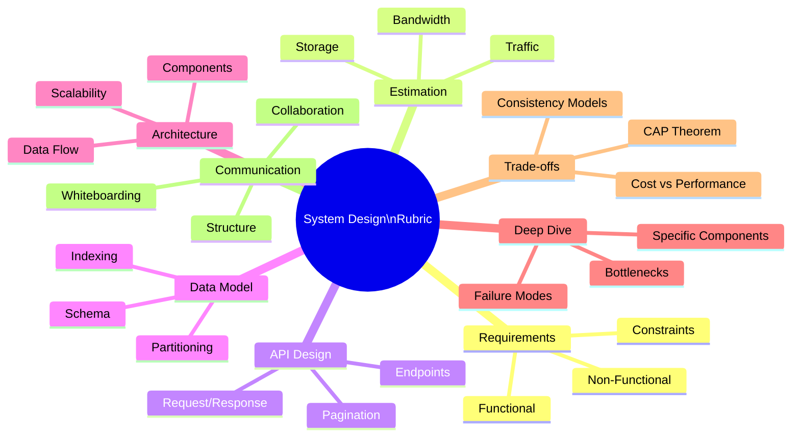
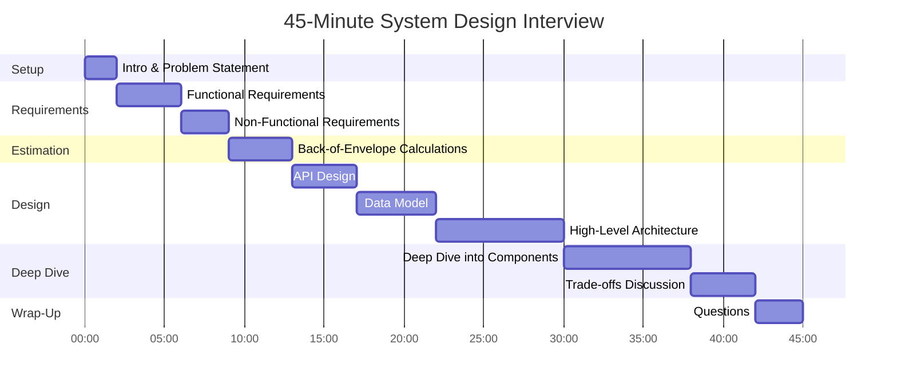
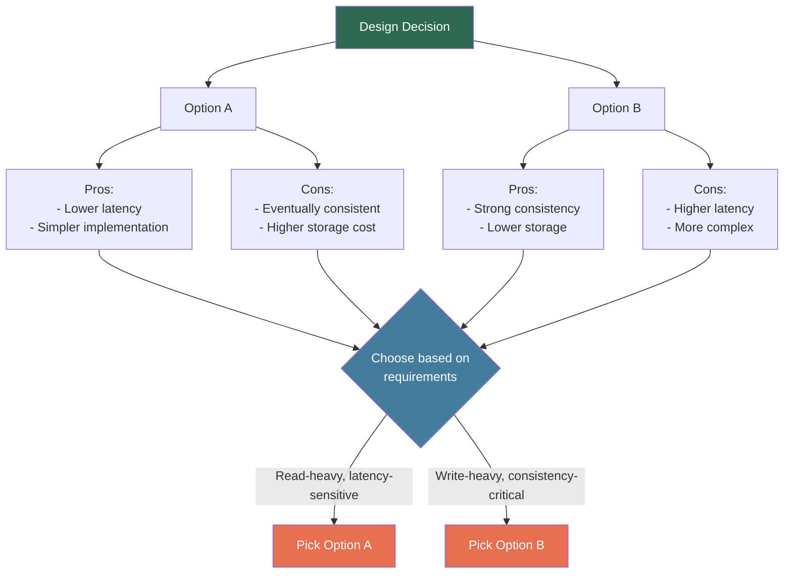

# System Design Interview Rubric — 8-Dimension Scoring Framework

## Overview

System design interviews are evaluated across 8 distinct dimensions. Unlike DSA interviews where correctness is binary, design interviews are subjective — interviewers use mental rubrics to score candidates. This guide makes those rubrics explicit so you can self-evaluate and target your weaknesses.

## The 8 Dimensions at a Glance



## Interview Timeline



## Dimension 1: Requirements Gathering

**What interviewers evaluate:** Can you scope a vague problem into concrete, buildable requirements?

### Scoring Rubric

| Score | Description |
|-------|-------------|
| 1 | Jumped straight to architecture without asking any questions |
| 2 | Asked a few questions but missed critical functional or non-functional requirements |
| 3 | Identified core functional requirements and some non-functional ones |
| 4 | Systematically gathered functional and non-functional requirements; prioritized them |
| 5 | Comprehensive requirements with clear scope boundaries; proactively identified what's out of scope |

### Green Flags vs Red Flags

| Green Flags | Red Flags |
|-------------|-----------|
| "Let me start by understanding what we're building" | Immediately draws boxes on the whiteboard |
| Separates functional from non-functional requirements | Treats all requirements as equally important |
| "For this 45-min discussion, I'll focus on X, Y, Z" | Tries to design everything at once |
| Asks about user types and access patterns | Assumes a single user type |
| Clarifies scale: "How many users? Read-heavy or write-heavy?" | Designs without knowing the scale |
| Writes requirements down for reference | Keeps everything in head; forgets later |
| "Let me confirm — are we optimizing for latency or throughput?" | Never asks about non-functional requirements |

### Requirements Template

```
Functional Requirements:
1. Users should be able to [core action 1]
2. Users should be able to [core action 2]
3. System should support [key feature]

Non-Functional Requirements:
- Availability: 99.9% uptime (3-nines)
- Latency: p99 < 200ms for reads
- Scale: X DAU, Y QPS
- Consistency: [eventual / strong — depends on use case]

Out of Scope:
- [Feature X] — can discuss if time permits
- [Feature Y] — separate system
```

---

## Dimension 2: Estimation (Back-of-Envelope)

**What interviewers evaluate:** Can you reason about scale and make informed capacity decisions?

### Scoring Rubric

| Score | Description |
|-------|-------------|
| 1 | No estimation at all; designed without considering scale |
| 2 | Guessed numbers without showing calculations |
| 3 | Calculated QPS or storage but not both; some math errors |
| 4 | Solid estimates for traffic, storage, and bandwidth with clear assumptions |
| 5 | Precise calculations with stated assumptions; used estimates to drive design decisions |

### Green Flags vs Red Flags

| Green Flags | Red Flags |
|-------------|-----------|
| "Let me state my assumptions first" | Pulls numbers from thin air |
| Shows work: "100M users * 10 req/day = 1B req/day" | Says "a lot of traffic" without quantifying |
| Converts to useful units: "~12K QPS" | Stops at daily numbers without per-second breakdown |
| Uses estimates to justify decisions: "At 12K QPS, we need caching" | Calculates numbers but never references them again |
| Rounds sensibly for speed | Spends 10 minutes on exact arithmetic |

### Quick Reference: Estimation Cheat Sheet

| Metric | Formula | Example |
|--------|---------|---------|
| QPS (avg) | DAU * actions/user / 86,400 | 100M * 10 / 86400 = ~12K QPS |
| QPS (peak) | Avg QPS * 2-5x | ~24K - 60K QPS |
| Storage/day | Daily objects * avg size | 10M photos * 2MB = 20TB/day |
| Storage/year | Storage/day * 365 | 20TB * 365 = 7.3PB/year |
| Bandwidth | QPS * avg response size | 12K * 500KB = 6GB/s |
| Memory (cache) | Working set * avg size | Top 20% of 100M * 1KB = 20GB |

### Useful Powers of 2

| Power | Value | Approx |
|-------|-------|--------|
| 2^10 | 1,024 | ~1 Thousand |
| 2^20 | 1,048,576 | ~1 Million |
| 2^30 | 1,073,741,824 | ~1 Billion |
| 2^40 | ~1.1 Trillion | ~1 Trillion |

---

## Dimension 3: API Design

**What interviewers evaluate:** Can you define clean, RESTful (or appropriate) interfaces?

### Scoring Rubric

| Score | Description |
|-------|-------------|
| 1 | No API discussion; jumped straight to internal components |
| 2 | Mentioned a couple endpoints but no detail on request/response |
| 3 | Defined key endpoints with HTTP methods and basic parameters |
| 4 | Clean REST API with pagination, error handling, authentication mentioned |
| 5 | Well-designed API with versioning, rate limiting, idempotency; justified REST vs gRPC choice |

### Green Flags vs Red Flags

| Green Flags | Red Flags |
|-------------|-----------|
| Defines endpoints before internal architecture | Designs internals without knowing the interface |
| Uses proper HTTP methods (GET for reads, POST for creates) | Uses POST for everything |
| Includes pagination for list endpoints | Returns unbounded lists |
| Mentions authentication/authorization | No security consideration |
| Discusses idempotency for writes | Ignores duplicate request handling |
| Considers API versioning | Assumes API never changes |

---

## Dimension 4: Data Model

**What interviewers evaluate:** Can you design schemas that support the required access patterns?

### Scoring Rubric

| Score | Description |
|-------|-------------|
| 1 | No data model discussion |
| 2 | Mentioned tables/collections but no schema detail |
| 3 | Defined key entities with basic fields and relationships |
| 4 | Complete schema with indexes, partitioning strategy, and access pattern alignment |
| 5 | Schema designed for scale with denormalization trade-offs, sharding key selection, and migration strategy |

### Green Flags vs Red Flags

| Green Flags | Red Flags |
|-------------|-----------|
| Chooses DB type based on access patterns | "I'll use MongoDB because it's NoSQL" (no reasoning) |
| Identifies primary keys and indexes | No discussion of how queries will be served |
| Considers partitioning/sharding for scale | Assumes single database instance at scale |
| Discusses denormalization trade-offs | Either fully normalized or fully denormalized without reasoning |
| Mentions data retention and archival | Assumes infinite storage |

### Database Selection Guide

| Use Case | Best Fit | Reasoning |
|----------|----------|-----------|
| Transactions, relationships | PostgreSQL, MySQL | ACID, joins, foreign keys |
| High write throughput, flexible schema | MongoDB, Cassandra | Horizontal scaling, schema flexibility |
| Caching, sessions, leaderboards | Redis | In-memory, sub-ms latency |
| Search, full-text queries | Elasticsearch | Inverted index, relevance scoring |
| Time-series data | InfluxDB, TimescaleDB | Time-based partitioning, aggregation |
| Graph relationships | Neo4j, Amazon Neptune | Traversal queries, relationship-heavy |
| File/blob storage | S3, GCS | Cheap, durable, scalable |

---

## Dimension 5: Architecture

**What interviewers evaluate:** Can you design a scalable, reliable system from components?

### Scoring Rubric

| Score | Description |
|-------|-------------|
| 1 | No clear architecture; just a single box |
| 2 | Drew some components but unclear data flow; missing critical pieces |
| 3 | Reasonable architecture with load balancer, app servers, database; basic data flow |
| 4 | Well-structured architecture with caching, message queues, CDN where appropriate; clear data flow |
| 5 | Production-grade architecture with redundancy, failover, monitoring; justified every component |

### Green Flags vs Red Flags

| Green Flags | Red Flags |
|-------------|-----------|
| Starts with high-level, then drills down | Gets lost in one component's details too early |
| Shows clear data flow with arrows | Boxes on whiteboard with no connections |
| Adds components to solve specific problems | Adds Kafka/Redis/etc "because big companies use them" |
| Considers read vs write paths separately | Single path for everything |
| Discusses horizontal scaling for stateless services | Only vertical scaling |
| Mentions service discovery, health checks | No operational considerations |

### Architecture Component Reference

| Component | When to Add | Why |
|-----------|-------------|-----|
| Load Balancer | Multiple app servers | Distribute traffic, health checking |
| CDN | Static content, global users | Reduce latency, offload origin |
| Cache (Redis) | Read-heavy, repeated queries | Reduce DB load, sub-ms latency |
| Message Queue (Kafka/SQS) | Async processing, decoupling | Handle spikes, retry logic |
| Object Store (S3) | Files, images, videos | Cheap durable storage |
| Search Index (ES) | Full-text search, filtering | Fast queries on unstructured text |
| Rate Limiter | Public APIs, abuse prevention | Protect services from overload |

---

## Dimension 6: Deep Dive

**What interviewers evaluate:** Can you go deep on a specific component and handle complexity?

### Scoring Rubric

| Score | Description |
|-------|-------------|
| 1 | Stayed at surface level throughout; no depth on any component |
| 2 | Attempted depth but showed misunderstanding of core concepts |
| 3 | Went deep on one component with reasonable understanding |
| 4 | Strong deep dive on 1-2 components; handled follow-up questions well |
| 5 | Expert-level depth; anticipated edge cases; discussed failure modes and mitigations |

### Green Flags vs Red Flags

| Green Flags | Red Flags |
|-------------|-----------|
| "Let me dive deeper into the notification service" | Stays at whiteboard level for 45 min |
| Discusses failure modes: "What if this queue goes down?" | Assumes all components are always available |
| Knows internals: "Kafka uses partitions for parallelism" | Uses buzzwords without understanding |
| Handles follow-ups: "If we need exactly-once..." | Freezes on follow-up questions |
| Proposes monitoring/alerting for critical paths | No observability discussion |

### Common Deep Dive Topics

| System | Likely Deep Dive Areas |
|--------|----------------------|
| URL Shortener | Hash collision handling, analytics pipeline, cache eviction |
| Chat System | WebSocket management, message ordering, read receipts |
| News Feed | Fan-out strategy, ranking algorithm, cache invalidation |
| Ride Matching | Geospatial indexing, matching algorithm, surge pricing |
| Video Streaming | Encoding pipeline, adaptive bitrate, CDN strategy |

---

## Dimension 7: Trade-offs

**What interviewers evaluate:** Can you reason about engineering trade-offs and justify decisions?

### Scoring Rubric

| Score | Description |
|-------|-------------|
| 1 | Made decisions without acknowledging any trade-offs |
| 2 | Mentioned trade-offs exist but couldn't articulate them |
| 3 | Discussed 1-2 trade-offs with reasonable reasoning |
| 4 | Proactively identified trade-offs for major decisions; good reasoning |
| 5 | Structured trade-off analysis for every major decision; referenced CAP, PACELC, or similar frameworks |

### Green Flags vs Red Flags

| Green Flags | Red Flags |
|-------------|-----------|
| "The trade-off here is latency vs consistency" | "This is the best approach" (no alternatives considered) |
| "We could use X or Y — here's why I'd pick X for this case" | Only considers one option per decision |
| References CAP theorem when choosing consistency model | "We'll have strong consistency AND high availability" |
| "If requirements change to Z, I'd reconsider this choice" | Presents design as the only possible solution |
| Discusses cost implications | Ignores operational cost entirely |

### Key Trade-off Framework



### Common Trade-offs Quick Reference

| Decision | Option A | Option B | Choose A When | Choose B When |
|----------|----------|----------|---------------|---------------|
| Consistency | Eventual | Strong | Social media, analytics | Payments, inventory |
| Communication | Sync (HTTP) | Async (Queue) | Simple flows, low latency | Decoupling, reliability |
| Storage | SQL | NoSQL | Complex queries, transactions | Scale, flexible schema |
| Caching | Write-through | Write-back | Read-heavy, consistency matters | Write-heavy, can tolerate staleness |
| Fan-out | Push (fan-out on write) | Pull (fan-out on read) | Most users have few followers | Celebrity/power-user scenario |
| ID Generation | Auto-increment | UUID/Snowflake | Single DB, simplicity | Distributed, no coordination |
| Data | Normalize | Denormalize | Write-heavy, storage-sensitive | Read-heavy, latency-sensitive |

---

## Dimension 8: Communication

**What interviewers evaluate:** Is this person someone I'd want to work with? Can they explain complex ideas clearly?

### Scoring Rubric

| Score | Description |
|-------|-------------|
| 1 | Couldn't explain their thinking; poor whiteboarding; ignored interviewer |
| 2 | Explained some decisions but disorganized; didn't check in with interviewer |
| 3 | Reasonably clear explanations; responded to interviewer's questions |
| 4 | Well-structured presentation; good whiteboarding; collaborative dynamic |
| 5 | Exceptional clarity; drove the conversation; made interviewer feel like a collaborator |

### Green Flags vs Red Flags

| Green Flags | Red Flags |
|-------------|-----------|
| "Let me structure my approach: first requirements, then estimation..." | Jumps randomly between topics |
| "Does this direction make sense before I go deeper?" | Monologues for 10 minutes without checking in |
| Labels diagrams clearly with arrows showing data flow | Messy whiteboard with unlabeled boxes |
| "I'm thinking about two options here..." (invites discussion) | "This is how it should be done" (shuts down dialogue) |
| Responds well to pushback: "That's a fair concern, let me reconsider" | Gets defensive when challenged |
| Summarizes periodically: "So far we have..." | Never recaps; interviewer loses track |

---

## Complete Score Sheet

```
Date: ___________
Problem: ___________
Duration: ___ / 45 min

| #  | Dimension              | Score (1-5) | Notes                    |
|----|------------------------|-------------|--------------------------|
| 1  | Requirements Gathering |             |                          |
| 2  | Estimation             |             |                          |
| 3  | API Design             |             |                          |
| 4  | Data Model             |             |                          |
| 5  | Architecture           |             |                          |
| 6  | Deep Dive              |             |                          |
| 7  | Trade-offs             |             |                          |
| 8  | Communication          |             |                          |

Total: ___ / 40
Average: ___ / 5.0

Hire Signal: [ ] Strong No  [ ] Lean No  [ ] Lean Yes  [ ] Strong Yes

Strongest dimension:
Weakest dimension:
Key improvement for next mock:
```

### Interpreting Your Score

| Average Score | Verdict | Action |
|--------------|---------|--------|
| 4.5 - 5.0 | Strong Yes | Interview-ready. Do weekly maintenance mocks |
| 3.5 - 4.4 | Lean Yes | Almost there. Focus on your 2 weakest dimensions |
| 2.5 - 3.4 | Lean No | Need targeted practice. Study specific components |
| 1.0 - 2.4 | Strong No | Go back to fundamentals. Study design patterns and common systems |

## Comparison: DSA vs System Design Interviews

| Aspect | DSA Interview | System Design Interview |
|--------|--------------|------------------------|
| Correct answer? | Usually one optimal solution | Many valid designs |
| Evaluation | Mostly objective (works or doesn't) | Mostly subjective (quality of reasoning) |
| Time pressure | Very tight (15 min to code) | Moderate (can adjust depth) |
| Communication weight | 20% of evaluation | 30%+ of evaluation |
| How to practice | LeetCode, mock with timer | Design real systems, read engineering blogs |
| Experience needed | Can be purely academic | Needs real-world intuition |
| Recovery from mistakes | Hard (code either works or doesn't) | Easy (pivot and discuss trade-offs) |
| Follow-up questions | "Can you optimize?" | "What if scale increases 100x?" |
