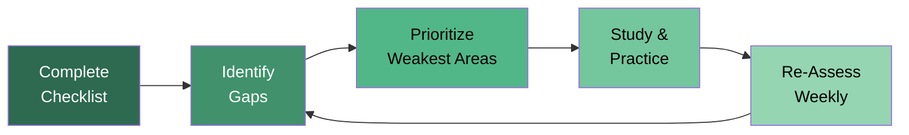
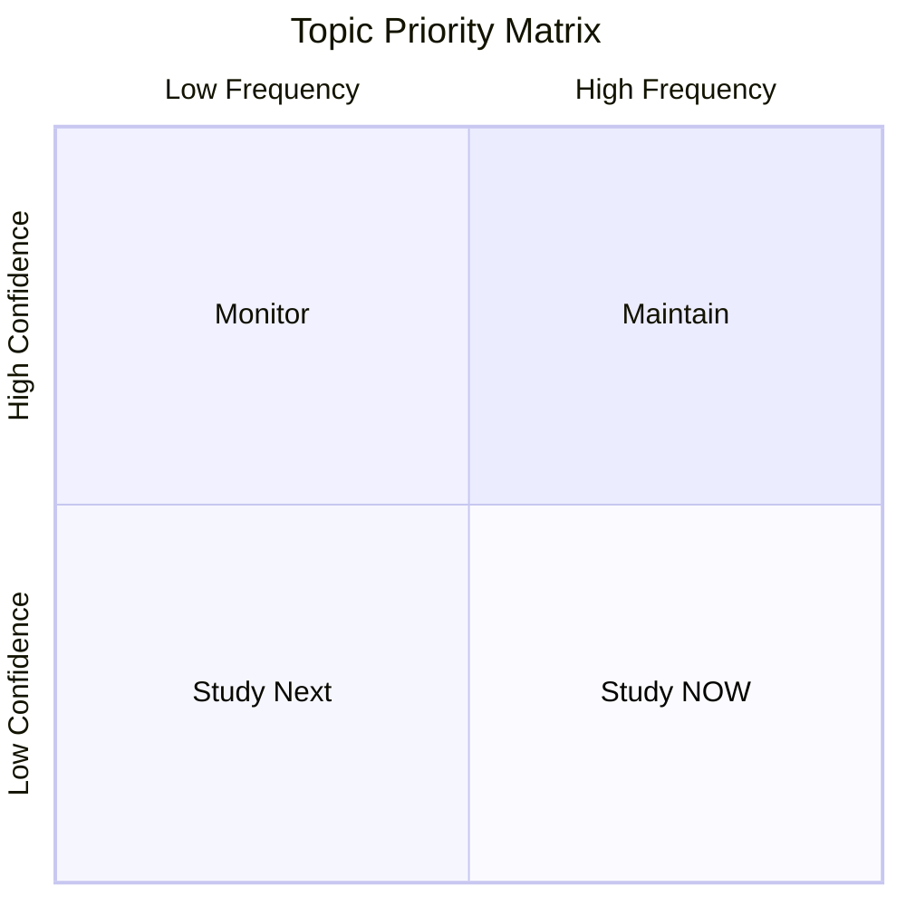
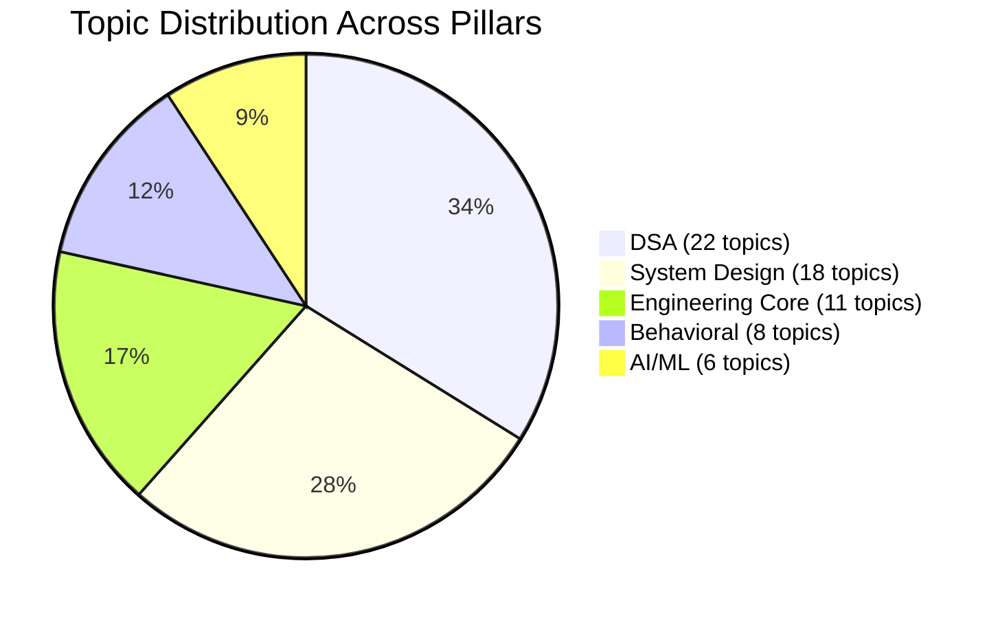

# Self-Assessment Checklist — All 5 Pillars

## Overview

This checklist covers every major topic across all 5 pillars of interview preparation. Rate yourself honestly on each topic to identify gaps and prioritize your study plan. Update this weekly as you progress.

## Confidence Level Definitions

| Level | Symbol | Description | What It Means |
|-------|--------|-------------|---------------|
| Not Started | :black_circle: | Haven't studied this topic at all | Zero exposure; needs full learning |
| Learning | :red_circle: | Currently reading/watching material | Understand concepts but can't solve problems |
| Practicing | :yellow_circle: | Actively solving problems | Can solve easy/medium with hints; need more reps |
| Confident | :large_blue_circle: | Can solve independently | Can handle medium problems; some hard ones |
| Interview-Ready | :green_circle: | Can teach this topic | Can solve under time pressure; explain trade-offs |

## Assessment Flow



## Priority Matrix



Use this mental model:
- **Study NOW** (High Frequency + Low Confidence): These topics appear often and you're weak on them
- **Study Next** (Low Frequency + Low Confidence): Not urgent but fill these gaps before interviews
- **Maintain** (High Frequency + High Confidence): Keep sharp with periodic review
- **Monitor** (Low Frequency + High Confidence): Low priority; occasional review is enough

---

## Pillar 1: Data Structures & Algorithms (DSA)

### Foundational Data Structures

- [ ] **Arrays & Strings** — Sliding window, two pointers, prefix sums
  - Confidence: Not Started / Learning / Practicing / Confident / Interview-Ready
  - Problems solved: ___ / 30
  - Last practiced: ___

- [ ] **Hash Maps & Hash Sets** — Frequency counting, grouping, two-sum patterns
  - Confidence: Not Started / Learning / Practicing / Confident / Interview-Ready
  - Problems solved: ___ / 20
  - Last practiced: ___

- [ ] **Linked Lists** — Reversal, cycle detection, merge, slow-fast pointers
  - Confidence: Not Started / Learning / Practicing / Confident / Interview-Ready
  - Problems solved: ___ / 15
  - Last practiced: ___

- [ ] **Stacks & Queues** — Monotonic stack, min stack, BFS queue, deque
  - Confidence: Not Started / Learning / Practicing / Confident / Interview-Ready
  - Problems solved: ___ / 15
  - Last practiced: ___

- [ ] **Trees (Binary, BST, N-ary)** — Traversals, LCA, serialization, path problems
  - Confidence: Not Started / Learning / Practicing / Confident / Interview-Ready
  - Problems solved: ___ / 25
  - Last practiced: ___

- [ ] **Heaps / Priority Queues** — Top-K, merge K sorted, median stream
  - Confidence: Not Started / Learning / Practicing / Confident / Interview-Ready
  - Problems solved: ___ / 15
  - Last practiced: ___

- [ ] **Tries** — Autocomplete, word search, prefix matching
  - Confidence: Not Started / Learning / Practicing / Confident / Interview-Ready
  - Problems solved: ___ / 8
  - Last practiced: ___

- [ ] **Graphs** — BFS, DFS, topological sort, connected components, cycle detection
  - Confidence: Not Started / Learning / Practicing / Confident / Interview-Ready
  - Problems solved: ___ / 20
  - Last practiced: ___

- [ ] **Union-Find (Disjoint Set)** — Connected components, redundant edges, accounts merge
  - Confidence: Not Started / Learning / Practicing / Confident / Interview-Ready
  - Problems solved: ___ / 8
  - Last practiced: ___

### Core Algorithms

- [ ] **Binary Search** — Search space reduction, rotated arrays, first/last occurrence
  - Confidence: Not Started / Learning / Practicing / Confident / Interview-Ready
  - Problems solved: ___ / 15
  - Last practiced: ___

- [ ] **Sorting** — Merge sort, quick sort, counting sort, custom comparators
  - Confidence: Not Started / Learning / Practicing / Confident / Interview-Ready
  - Problems solved: ___ / 10
  - Last practiced: ___

- [ ] **Two Pointers** — Opposite ends, same direction, fast-slow
  - Confidence: Not Started / Learning / Practicing / Confident / Interview-Ready
  - Problems solved: ___ / 15
  - Last practiced: ___

- [ ] **Sliding Window** — Fixed size, variable size, with hash map
  - Confidence: Not Started / Learning / Practicing / Confident / Interview-Ready
  - Problems solved: ___ / 12
  - Last practiced: ___

- [ ] **Dynamic Programming** — 1D, 2D, knapsack, LCS, LIS, interval DP
  - Confidence: Not Started / Learning / Practicing / Confident / Interview-Ready
  - Problems solved: ___ / 30
  - Last practiced: ___

- [ ] **Greedy** — Intervals, activity selection, Huffman
  - Confidence: Not Started / Learning / Practicing / Confident / Interview-Ready
  - Problems solved: ___ / 12
  - Last practiced: ___

- [ ] **Backtracking** — Permutations, combinations, Sudoku, N-Queens
  - Confidence: Not Started / Learning / Practicing / Confident / Interview-Ready
  - Problems solved: ___ / 12
  - Last practiced: ___

- [ ] **Recursion & Divide-and-Conquer** — Merge sort, tree recursion, master theorem
  - Confidence: Not Started / Learning / Practicing / Confident / Interview-Ready
  - Problems solved: ___ / 10
  - Last practiced: ___

- [ ] **Bit Manipulation** — XOR tricks, bit counting, power of 2
  - Confidence: Not Started / Learning / Practicing / Confident / Interview-Ready
  - Problems solved: ___ / 8
  - Last practiced: ___

### Advanced Topics

- [ ] **Shortest Path (Dijkstra, Bellman-Ford)** — Weighted graphs, negative edges
  - Confidence: Not Started / Learning / Practicing / Confident / Interview-Ready
  - Problems solved: ___ / 8
  - Last practiced: ___

- [ ] **Minimum Spanning Tree (Kruskal, Prim)** — Network design, clustering
  - Confidence: Not Started / Learning / Practicing / Confident / Interview-Ready
  - Problems solved: ___ / 5
  - Last practiced: ___

- [ ] **Segment Trees / BIT** — Range queries, range updates
  - Confidence: Not Started / Learning / Practicing / Confident / Interview-Ready
  - Problems solved: ___ / 5
  - Last practiced: ___

- [ ] **String Algorithms** — KMP, Rabin-Karp, Z-algorithm
  - Confidence: Not Started / Learning / Practicing / Confident / Interview-Ready
  - Problems solved: ___ / 5
  - Last practiced: ___

### DSA Pillar Summary

| Category | Topics Covered | Interview-Ready Count | Gap Count |
|----------|---------------|----------------------|-----------|
| Data Structures | 9 | ___ / 9 | ___ |
| Core Algorithms | 9 | ___ / 9 | ___ |
| Advanced Topics | 4 | ___ / 4 | ___ |
| **Total** | **22** | **___ / 22** | **___** |

---

## Pillar 2: System Design

### Fundamentals

- [ ] **Scalability Basics** — Vertical vs horizontal, stateless services, load balancing
  - Confidence: Not Started / Learning / Practicing / Confident / Interview-Ready

- [ ] **CAP Theorem & Consistency Models** — Strong, eventual, causal consistency
  - Confidence: Not Started / Learning / Practicing / Confident / Interview-Ready

- [ ] **Database Design** — SQL vs NoSQL, indexing, partitioning, replication
  - Confidence: Not Started / Learning / Practicing / Confident / Interview-Ready

- [ ] **Caching** — Strategies (LRU, LFU), cache-aside, write-through, invalidation
  - Confidence: Not Started / Learning / Practicing / Confident / Interview-Ready

- [ ] **Message Queues** — Kafka, RabbitMQ, SQS; pub/sub, exactly-once semantics
  - Confidence: Not Started / Learning / Practicing / Confident / Interview-Ready

- [ ] **API Design** — REST, gRPC, GraphQL; pagination, versioning, rate limiting
  - Confidence: Not Started / Learning / Practicing / Confident / Interview-Ready

- [ ] **CDN & Edge Computing** — Content distribution, cache headers, DNS routing
  - Confidence: Not Started / Learning / Practicing / Confident / Interview-Ready

- [ ] **Microservices** — Service decomposition, API gateway, service mesh, saga pattern
  - Confidence: Not Started / Learning / Practicing / Confident / Interview-Ready

### High-Level Design Problems

- [ ] **URL Shortener** — Hashing, encoding, analytics, redirect optimization
  - Confidence: Not Started / Learning / Practicing / Confident / Interview-Ready

- [ ] **Chat/Messaging System** — WebSockets, message ordering, presence, storage
  - Confidence: Not Started / Learning / Practicing / Confident / Interview-Ready

- [ ] **News Feed / Timeline** — Fan-out, ranking, caching, personalization
  - Confidence: Not Started / Learning / Practicing / Confident / Interview-Ready

- [ ] **Notification System** — Push, email, SMS; priority, throttling, templating
  - Confidence: Not Started / Learning / Practicing / Confident / Interview-Ready

- [ ] **Rate Limiter** — Token bucket, sliding window, distributed rate limiting
  - Confidence: Not Started / Learning / Practicing / Confident / Interview-Ready

- [ ] **Search Autocomplete** — Trie, ranking, personalization, real-time updates
  - Confidence: Not Started / Learning / Practicing / Confident / Interview-Ready

- [ ] **Video Streaming (YouTube/Netflix)** — Encoding, adaptive bitrate, CDN, recommendations
  - Confidence: Not Started / Learning / Practicing / Confident / Interview-Ready

- [ ] **E-Commerce Platform** — Catalog, cart, checkout, inventory, payments
  - Confidence: Not Started / Learning / Practicing / Confident / Interview-Ready

- [ ] **Ride-Sharing (Uber/Ola)** — Matching, geospatial, ETA, surge pricing
  - Confidence: Not Started / Learning / Practicing / Confident / Interview-Ready

- [ ] **Distributed File Storage** — Chunking, replication, consistency, metadata
  - Confidence: Not Started / Learning / Practicing / Confident / Interview-Ready

### System Design Pillar Summary

| Category | Topics Covered | Interview-Ready Count | Gap Count |
|----------|---------------|----------------------|-----------|
| Fundamentals | 8 | ___ / 8 | ___ |
| HLD Problems | 10 | ___ / 10 | ___ |
| **Total** | **18** | **___ / 18** | **___** |

---

## Pillar 3: Engineering Core

### Language & Runtime

- [ ] **Primary Language Deep Dive** — Memory model, concurrency, advanced features
  - Language: ___________
  - Confidence: Not Started / Learning / Practicing / Confident / Interview-Ready

- [ ] **Concurrency & Multithreading** — Threads, locks, deadlocks, thread pools, async/await
  - Confidence: Not Started / Learning / Practicing / Confident / Interview-Ready

- [ ] **Memory Management** — Heap vs stack, garbage collection, memory leaks
  - Confidence: Not Started / Learning / Practicing / Confident / Interview-Ready

### Design Patterns & Principles

- [ ] **SOLID Principles** — Single responsibility, open-closed, Liskov, interface segregation, dependency inversion
  - Confidence: Not Started / Learning / Practicing / Confident / Interview-Ready

- [ ] **Design Patterns** — Singleton, factory, observer, strategy, decorator, adapter
  - Confidence: Not Started / Learning / Practicing / Confident / Interview-Ready

- [ ] **Object-Oriented Design** — Inheritance, composition, polymorphism, encapsulation
  - Confidence: Not Started / Learning / Practicing / Confident / Interview-Ready

### Infrastructure & DevOps

- [ ] **Databases (Operational)** — Query optimization, connection pooling, migrations, backups
  - Confidence: Not Started / Learning / Practicing / Confident / Interview-Ready

- [ ] **CI/CD Pipelines** — Build, test, deploy automation; blue-green, canary deployments
  - Confidence: Not Started / Learning / Practicing / Confident / Interview-Ready

- [ ] **Containerization (Docker/K8s)** — Images, containers, orchestration, networking
  - Confidence: Not Started / Learning / Practicing / Confident / Interview-Ready

- [ ] **Monitoring & Observability** — Metrics, logs, traces; Prometheus, Grafana, ELK
  - Confidence: Not Started / Learning / Practicing / Confident / Interview-Ready

- [ ] **Security Fundamentals** — Auth (OAuth, JWT), HTTPS, OWASP top 10, input validation
  - Confidence: Not Started / Learning / Practicing / Confident / Interview-Ready

### Engineering Core Pillar Summary

| Category | Topics Covered | Interview-Ready Count | Gap Count |
|----------|---------------|----------------------|-----------|
| Language & Runtime | 3 | ___ / 3 | ___ |
| Design Patterns | 3 | ___ / 3 | ___ |
| Infrastructure | 5 | ___ / 5 | ___ |
| **Total** | **11** | **___ / 11** | **___** |

---

## Pillar 4: Behavioral

### Core Behavioral Topics

- [ ] **Ownership Thinking** — Scope progression, taking initiative, accountability
  - STAR Stories Prepared: ___ / 3
  - Confidence: Not Started / Learning / Practicing / Confident / Interview-Ready

- [ ] **Prioritization Frameworks** — ICE, RICE, Eisenhower matrix, effort-impact
  - STAR Stories Prepared: ___ / 2
  - Confidence: Not Started / Learning / Practicing / Confident / Interview-Ready

- [ ] **Technical Decision-Making** — ADRs, RFCs, one-way/two-way doors
  - STAR Stories Prepared: ___ / 3
  - Confidence: Not Started / Learning / Practicing / Confident / Interview-Ready

- [ ] **Buy vs Build** — TCO analysis, vendor lock-in, core vs commodity
  - STAR Stories Prepared: ___ / 2
  - Confidence: Not Started / Learning / Practicing / Confident / Interview-Ready

- [ ] **Cross-Team Collaboration** — API contracts, dependency management, stakeholder alignment
  - STAR Stories Prepared: ___ / 3
  - Confidence: Not Started / Learning / Practicing / Confident / Interview-Ready

- [ ] **Mentorship & Culture** — Code review, onboarding, knowledge sharing
  - STAR Stories Prepared: ___ / 2
  - Confidence: Not Started / Learning / Practicing / Confident / Interview-Ready

- [ ] **Managing Tech Debt** — Debt quadrant, quantifying impact, refactoring strategies
  - STAR Stories Prepared: ___ / 2
  - Confidence: Not Started / Learning / Practicing / Confident / Interview-Ready

- [ ] **Saying No with Data** — Negotiation, managing up, setting expectations
  - STAR Stories Prepared: ___ / 2
  - Confidence: Not Started / Learning / Practicing / Confident / Interview-Ready

### Behavioral Pillar Summary

| Category | Topics Covered | Interview-Ready Count | Gap Count |
|----------|---------------|----------------------|-----------|
| Core Behavioral | 8 | ___ / 8 | ___ |
| Total STAR Stories | — | ___ / 19 | — |

---

## Pillar 5: AI/ML (If Applicable)

### Fundamentals

- [ ] **ML Basics** — Supervised, unsupervised, reinforcement; bias-variance; overfitting
  - Confidence: Not Started / Learning / Practicing / Confident / Interview-Ready

- [ ] **Deep Learning** — Neural networks, backpropagation, CNNs, RNNs, transformers
  - Confidence: Not Started / Learning / Practicing / Confident / Interview-Ready

- [ ] **NLP** — Tokenization, embeddings, attention, LLMs, prompt engineering
  - Confidence: Not Started / Learning / Practicing / Confident / Interview-Ready

- [ ] **MLOps** — Training pipelines, model serving, A/B testing, monitoring, drift detection
  - Confidence: Not Started / Learning / Practicing / Confident / Interview-Ready

- [ ] **Recommendation Systems** — Collaborative filtering, content-based, hybrid, cold start
  - Confidence: Not Started / Learning / Practicing / Confident / Interview-Ready

- [ ] **Search & Ranking** — Information retrieval, BM25, learning-to-rank, relevance
  - Confidence: Not Started / Learning / Practicing / Confident / Interview-Ready

### AI/ML Pillar Summary

| Category | Topics Covered | Interview-Ready Count | Gap Count |
|----------|---------------|----------------------|-----------|
| ML Fundamentals | 6 | ___ / 6 | ___ |

---

## Grand Summary



### Overall Readiness Dashboard

| Pillar | Total Topics | Not Started | Learning | Practicing | Confident | Interview-Ready |
|--------|-------------|-------------|----------|------------|-----------|-----------------|
| DSA | 22 | ___ | ___ | ___ | ___ | ___ |
| System Design | 18 | ___ | ___ | ___ | ___ | ___ |
| Engineering Core | 11 | ___ | ___ | ___ | ___ | ___ |
| Behavioral | 8 | ___ | ___ | ___ | ___ | ___ |
| AI/ML | 6 | ___ | ___ | ___ | ___ | ___ |
| **Total** | **65** | **___** | **___** | **___** | **___** | **___** |

### Readiness Score

Calculate your readiness percentage:

```
Not Started = 0 points
Learning = 1 point
Practicing = 2 points
Confident = 3 points
Interview-Ready = 4 points

Your Score = (Sum of all points) / (65 * 4) * 100 = ___%
```

| Readiness % | Verdict | Action |
|------------|---------|--------|
| 80-100% | Ready to interview | Schedule interviews; maintain with weekly review |
| 60-79% | Almost ready | Focus on "Practicing" topics to push to "Confident" |
| 40-59% | Needs work | Follow the 6-week schedule strictly |
| 0-39% | Early stage | Start with fundamentals; follow the study order |

### Top 5 Gaps to Address This Week

| Priority | Topic | Current Level | Target Level | Action Plan |
|----------|-------|---------------|--------------|-------------|
| 1 | ___________ | ___________ | ___________ | ___________ |
| 2 | ___________ | ___________ | ___________ | ___________ |
| 3 | ___________ | ___________ | ___________ | ___________ |
| 4 | ___________ | ___________ | ___________ | ___________ |
| 5 | ___________ | ___________ | ___________ | ___________ |
