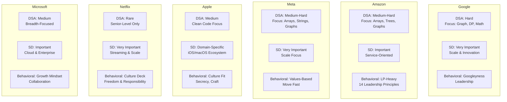

# FAANG Company Question Bank

## Overview

This question bank covers the most frequently asked questions at Google, Amazon, Meta (Facebook), Apple, Netflix, and Microsoft. Questions are categorized by type (DSA, System Design, Behavioral) with difficulty levels and frequency indicators.

## Company Comparison

## Frequency Legend

| Symbol | Meaning |
|--------|---------|
| :fire::fire::fire: | Very Frequently Asked (>50% of interviews) |
| :fire::fire: | Frequently Asked (25-50% of interviews) |
| :fire: | Occasionally Asked (<25% of interviews) |

---

## Google

### Interview Process

| Round | Duration | Focus |
|-------|----------|-------|
| Phone Screen | 45 min | 1 DSA problem (Medium-Hard) |
| Onsite Round 1 | 45 min | DSA (Hard) |
| Onsite Round 2 | 45 min | DSA (Hard) |
| Onsite Round 3 | 45 min | System Design (Senior+) |
| Onsite Round 4 | 45 min | Behavioral (Googleyness & Leadership) |

### DSA Questions — Google

| Problem | Pattern | Difficulty | Frequency |
|---------|---------|-----------|-----------|
| Longest Substring Without Repeating Characters | Sliding Window | Medium | :fire::fire::fire: |
| Median of Two Sorted Arrays | Binary Search | Hard | :fire::fire: |
| Word Ladder / Word Ladder II | BFS/Graph | Hard | :fire::fire::fire: |
| Merge K Sorted Lists | Heap | Hard | :fire::fire: |
| Trapping Rain Water | Two Pointers / Stack | Hard | :fire::fire::fire: |
| Course Schedule I & II | Topological Sort | Medium | :fire::fire::fire: |
| Design Search Autocomplete | Trie + Heap | Hard | :fire::fire: |
| Decode Ways | Dynamic Programming | Medium | :fire::fire: |
| Serialize and Deserialize Binary Tree | Tree / DFS | Hard | :fire::fire: |
| Minimum Window Substring | Sliding Window | Hard | :fire::fire::fire: |
| Number of Islands | BFS/DFS | Medium | :fire::fire::fire: |
| LRU Cache | HashMap + DLL | Medium | :fire::fire::fire: |
| Maximum Profit in Job Scheduling | DP + Binary Search | Hard | :fire::fire: |
| Alien Dictionary | Topological Sort | Hard | :fire::fire: |
| Split Array Largest Sum | Binary Search / DP | Hard | :fire: |

### System Design Questions — Google

| Problem | Key Concepts | Frequency |
|---------|-------------|-----------|
| Design Google Search | Crawling, indexing, ranking, PageRank | :fire::fire::fire: |
| Design YouTube | Video upload, encoding, CDN, recommendations | :fire::fire::fire: |
| Design Google Maps | Geospatial indexing, graph algorithms, ETA | :fire::fire: |
| Design Google Drive | File storage, sync, sharing, versioning | :fire::fire: |
| Design Gmail | Email routing, storage, search, spam filtering | :fire::fire: |
| Design Google Docs | Real-time collaboration, OT/CRDT, conflict resolution | :fire::fire: |
| Design Ad Click Aggregator | Stream processing, real-time analytics | :fire: |

### Behavioral — Google (Googleyness & Leadership)

| Question | What They Evaluate |
|----------|--------------------|
| "Tell me about a time you went above and beyond" | Ownership, initiative |
| "How do you deal with ambiguity?" | Comfort with uncertainty, problem structuring |
| "Tell me about a time you had a disagreement with a coworker" | Conflict resolution, empathy |
| "How do you prioritize competing projects?" | Prioritization, impact thinking |
| "Tell me about a time you failed" | Self-awareness, growth mindset |
| "What's the most creative solution you've come up with?" | Innovation, Googleyness |

---

## Amazon

### Interview Process

| Round | Duration | Focus |
|-------|----------|-------|
| Online Assessment | 90 min | 2 DSA problems + work simulation |
| Phone Screen | 60 min | 1 DSA + Leadership Principle deep-dive |
| Loop Round 1 | 60 min | DSA + LP stories |
| Loop Round 2 | 60 min | DSA + LP stories |
| Loop Round 3 | 60 min | System Design + LP stories |
| Loop Round 4 (Bar Raiser) | 60 min | LP deep-dive + DSA or Design |

### Amazon's 16 Leadership Principles (Most Tested)

| Principle | Frequency | Example Question |
|-----------|-----------|------------------|
| Customer Obsession | :fire::fire::fire: | "Tell me about a time you went above and beyond for a customer" |
| Ownership | :fire::fire::fire: | "Tell me about a time you took on something outside your scope" |
| Invent and Simplify | :fire::fire: | "Tell me about a time you simplified a complex process" |
| Are Right, A Lot | :fire::fire: | "Tell me about a time your judgment was wrong" |
| Hire and Develop the Best | :fire::fire: | "Tell me about a time you mentored someone" |
| Insist on the Highest Standards | :fire::fire::fire: | "Tell me about a time you refused to compromise on quality" |
| Bias for Action | :fire::fire::fire: | "Tell me about a time you made a decision with incomplete data" |
| Deliver Results | :fire::fire::fire: | "Tell me about a difficult goal you achieved" |
| Earn Trust | :fire::fire: | "Tell me about a time you had to deliver bad news" |
| Dive Deep | :fire::fire: | "Tell me about a time you used data to make a decision" |

### DSA Questions — Amazon

| Problem | Pattern | Difficulty | Frequency |
|---------|---------|-----------|-----------|
| Two Sum | Hash Map | Easy | :fire::fire::fire: |
| Number of Islands | BFS/DFS | Medium | :fire::fire::fire: |
| Merge Intervals | Sorting | Medium | :fire::fire::fire: |
| K Closest Points to Origin | Heap | Medium | :fire::fire: |
| Word Search II | Trie + Backtracking | Hard | :fire::fire: |
| LRU Cache | HashMap + DLL | Medium | :fire::fire::fire: |
| Max Area of Island | DFS | Medium | :fire::fire: |
| Meeting Rooms II | Heap + Sorting | Medium | :fire::fire::fire: |
| Partition Labels | Greedy | Medium | :fire::fire: |
| Min Cost to Connect Sticks | Heap | Medium | :fire::fire: |
| Rotting Oranges | BFS | Medium | :fire::fire: |
| Reorder Data in Log Files | Custom Sort | Easy | :fire::fire: |
| Subtree of Another Tree | Tree / DFS | Easy | :fire::fire: |

### System Design Questions — Amazon

| Problem | Key Concepts | Frequency |
|---------|-------------|-----------|
| Design Amazon.com (E-Commerce) | Catalog, cart, checkout, inventory | :fire::fire::fire: |
| Design Amazon Prime Video | Streaming, CDN, recommendations | :fire::fire: |
| Design a Parking Lot System | OOP, state machines | :fire::fire: |
| Design Amazon SQS (Message Queue) | Queuing, exactly-once, DLQ | :fire::fire: |
| Design a Delivery System | Route optimization, real-time tracking | :fire::fire: |
| Design Amazon Alexa | Voice processing, NLU, skill routing | :fire: |

---

## Meta (Facebook)

### Interview Process

| Round | Duration | Focus |
|-------|----------|-------|
| Phone Screen | 45 min | 1-2 DSA problems (Medium) |
| Onsite Round 1 | 45 min | DSA (Medium-Hard) |
| Onsite Round 2 | 45 min | DSA (Medium-Hard) |
| Onsite Round 3 | 45 min | System Design (E4+) |
| Onsite Round 4 | 45 min | Behavioral |

### DSA Questions — Meta

| Problem | Pattern | Difficulty | Frequency |
|---------|---------|-----------|-----------|
| Valid Palindrome II | Two Pointers | Easy | :fire::fire::fire: |
| Random Pick with Weight | Binary Search + Prefix Sum | Medium | :fire::fire::fire: |
| Subarray Sum Equals K | Prefix Sum + Hash Map | Medium | :fire::fire::fire: |
| Binary Tree Vertical Order Traversal | BFS + Hash Map | Medium | :fire::fire::fire: |
| Lowest Common Ancestor III | Tree / DFS | Medium | :fire::fire::fire: |
| Buildings With an Ocean View | Monotonic Stack | Medium | :fire::fire: |
| Nested List Weight Sum | DFS / Recursion | Medium | :fire::fire: |
| Dot Product of Two Sparse Vectors | Two Pointers | Medium | :fire::fire::fire: |
| Moving Average from Data Stream | Queue | Easy | :fire::fire: |
| Making A Large Island | DFS + Union-Find | Hard | :fire::fire: |
| Range Sum of BST | BST / DFS | Easy | :fire::fire: |
| Diameter of Binary Tree | DFS | Easy | :fire::fire::fire: |
| Minimum Remove to Make Valid Parentheses | Stack | Medium | :fire::fire::fire: |
| Add Strings | Math | Easy | :fire::fire: |
| Accounts Merge | Union-Find / DFS | Medium | :fire::fire: |

### System Design Questions — Meta

| Problem | Key Concepts | Frequency |
|---------|-------------|-----------|
| Design Facebook News Feed | Fan-out, ranking, caching | :fire::fire::fire: |
| Design Facebook Messenger | Real-time messaging, WebSockets, E2E encryption | :fire::fire::fire: |
| Design Instagram | Photo upload, feed, stories, CDN | :fire::fire: |
| Design Facebook Live | Live streaming, transcoding, CDN | :fire::fire: |
| Design Facebook Search | Social graph search, relevance ranking | :fire::fire: |
| Design a Web Crawler | Distributed crawling, dedup, politeness | :fire: |

### Behavioral — Meta

| Question | What They Evaluate |
|----------|--------------------|
| "Why Meta?" | Genuine interest in the mission |
| "Tell me about your most impactful project" | Scope, ownership, results |
| "How do you handle tight deadlines?" | Bias for action, prioritization |
| "Tell me about a time you received critical feedback" | Growth mindset, self-awareness |
| "How do you decide between competing approaches?" | Technical judgment, trade-off thinking |

---

## Apple

### Interview Process

| Round | Duration | Focus |
|-------|----------|-------|
| Phone Screen | 60 min | DSA + domain knowledge |
| Onsite Round 1 | 60 min | DSA (focus on clean code) |
| Onsite Round 2 | 60 min | System Design / Domain-specific |
| Onsite Round 3 | 60 min | Technical deep-dive (team-specific) |
| Onsite Round 4 | 45 min | Behavioral / Culture fit |

### DSA Questions — Apple

| Problem | Pattern | Difficulty | Frequency |
|---------|---------|-----------|-----------|
| Two Sum | Hash Map | Easy | :fire::fire::fire: |
| Reverse Linked List | Linked List | Easy | :fire::fire: |
| Valid Parentheses | Stack | Easy | :fire::fire::fire: |
| Merge Two Sorted Lists | Linked List | Easy | :fire::fire: |
| 3Sum | Two Pointers | Medium | :fire::fire: |
| Binary Tree Level Order Traversal | BFS | Medium | :fire::fire: |
| Word Break | Dynamic Programming | Medium | :fire::fire: |
| Design Tic-Tac-Toe | OOP / Matrix | Medium | :fire::fire: |
| Product of Array Except Self | Arrays | Medium | :fire::fire: |
| Letter Combinations of a Phone Number | Backtracking | Medium | :fire: |

### System Design Questions — Apple

| Problem | Key Concepts | Frequency |
|---------|-------------|-----------|
| Design iMessage | E2E encryption, sync, push notifications | :fire::fire::fire: |
| Design Apple Music | Streaming, licensing, offline, recommendations | :fire::fire: |
| Design iCloud Sync | Conflict resolution, delta sync, storage | :fire::fire: |
| Design the App Store | Catalog, review, distribution, ranking | :fire::fire: |
| Design Siri | Voice processing, NLU, on-device ML | :fire: |

### Behavioral — Apple

| Question | What They Evaluate |
|----------|--------------------|
| "Tell me about a product you're proud of" | Craft, attention to detail |
| "How do you balance perfection with shipping?" | Pragmatism vs quality |
| "Describe a time you simplified a complex problem" | Design thinking |
| "How do you handle confidential projects?" | Discretion (Apple culture) |
| "What Apple product would you improve and how?" | Product sense, user empathy |

---

## Netflix

### Interview Process

| Round | Duration | Focus |
|-------|----------|-------|
| Phone Screen | 45-60 min | Culture fit + technical discussion |
| Onsite Round 1 | 60 min | System Design (primary focus) |
| Onsite Round 2 | 60 min | Technical deep-dive (domain-specific) |
| Onsite Round 3 | 60 min | Culture / Manager conversation |
| Onsite Round 4 | 60 min | Cross-functional collaboration |

> Note: Netflix rarely asks LeetCode-style DSA problems. They focus on system design and culture fit.

### System Design Questions — Netflix

| Problem | Key Concepts | Frequency |
|---------|-------------|-----------|
| Design Netflix Streaming | Adaptive bitrate, CDN, encoding pipeline | :fire::fire::fire: |
| Design Netflix Recommendation Engine | Collaborative filtering, A/B testing | :fire::fire::fire: |
| Design a Content Delivery Network | Edge caching, origin failover, DNS routing | :fire::fire: |
| Design Netflix's Microservices Architecture | Service mesh, circuit breaker, chaos engineering | :fire::fire: |
| Design a Real-Time Analytics Pipeline | Stream processing, dashboarding | :fire: |

### Behavioral — Netflix (Culture Deck)

| Question | Principle Tested |
|----------|-----------------|
| "How do you operate with freedom and responsibility?" | Self-direction |
| "Tell me about a time you gave honest feedback that was hard" | Candor |
| "How do you make decisions when there's no clear answer?" | Judgment |
| "What does high performance mean to you?" | Context over control |
| "Tell me about a time you took a bold risk" | Courage |

---

## Microsoft

### Interview Process

| Round | Duration | Focus |
|-------|----------|-------|
| Phone Screen | 45-60 min | 1-2 DSA problems |
| Onsite Round 1 | 45 min | DSA |
| Onsite Round 2 | 45 min | DSA / OOP Design |
| Onsite Round 3 | 45 min | System Design |
| Onsite Round 4 (As Appropriate) | 45 min | Behavioral + hiring manager |

### DSA Questions — Microsoft

| Problem | Pattern | Difficulty | Frequency |
|---------|---------|-----------|-----------|
| Two Sum | Hash Map | Easy | :fire::fire::fire: |
| Add Two Numbers | Linked List | Medium | :fire::fire: |
| Longest Palindromic Substring | DP / Expand Around Center | Medium | :fire::fire: |
| String to Integer (atoi) | String Parsing | Medium | :fire::fire: |
| Merge Intervals | Sorting | Medium | :fire::fire::fire: |
| Spiral Matrix | Matrix Traversal | Medium | :fire::fire: |
| Group Anagrams | Hash Map | Medium | :fire::fire: |
| Serialize and Deserialize BST | Tree / DFS | Medium | :fire::fire: |
| Design Linked List | Linked List | Medium | :fire: |
| Rotate Image | Matrix | Medium | :fire::fire: |
| Reverse Words in a String | String / Two Pointers | Medium | :fire::fire: |
| Min Stack | Stack Design | Medium | :fire::fire: |

### System Design Questions — Microsoft

| Problem | Key Concepts | Frequency |
|---------|-------------|-----------|
| Design Microsoft Teams | Real-time messaging, video, presence | :fire::fire::fire: |
| Design OneDrive | File sync, versioning, sharing, conflict resolution | :fire::fire: |
| Design Azure Blob Storage | Distributed storage, replication, tiering | :fire::fire: |
| Design Outlook Calendar | Event scheduling, reminders, timezone handling | :fire::fire: |
| Design a Search Engine (Bing) | Crawling, indexing, ranking | :fire: |
| Design Xbox Live Matchmaking | Real-time matching, skill-based, low latency | :fire: |

### Behavioral — Microsoft (Growth Mindset)

| Question | What They Evaluate |
|----------|--------------------|
| "Tell me about a time you learned from a mistake" | Growth mindset |
| "How do you ensure diverse perspectives in decisions?" | Inclusivity |
| "Tell me about a time you helped a colleague succeed" | Collaboration |
| "How do you handle disagreements with your manager?" | Respectful challenge |
| "What drives you to do your best work?" | Intrinsic motivation |

---

## Cross-Company DSA Pattern Frequency

| Pattern | Google | Amazon | Meta | Apple | Microsoft | Study Priority |
|---------|--------|--------|------|-------|-----------|---------------|
| Arrays & Hash Maps | High | High | Very High | High | High | Must-do |
| Trees & Graphs | Very High | High | Very High | Medium | Medium | Must-do |
| Dynamic Programming | Very High | Medium | Medium | Medium | Medium | Must-do |
| Sliding Window | High | Medium | High | Low | Medium | Must-do |
| Two Pointers | High | Medium | High | Medium | Medium | Must-do |
| BFS/DFS | Very High | Very High | Very High | Medium | Medium | Must-do |
| Heap / Priority Queue | High | High | Medium | Low | Medium | Should-do |
| Trie | High | Medium | Low | Low | Low | Nice-to-have |
| Union-Find | Medium | Low | Medium | Low | Low | Nice-to-have |
| Bit Manipulation | Medium | Low | Low | Low | Low | Nice-to-have |

## Cross-Company System Design Frequency

| Topic | Google | Amazon | Meta | Apple | Netflix | Microsoft |
|-------|--------|--------|------|-------|---------|-----------|
| Messaging / Chat | Medium | Medium | High | High | Low | High |
| News Feed / Social | Medium | Low | Very High | Low | Medium | Low |
| Video Streaming | High | Medium | High | Medium | Very High | Medium |
| E-Commerce | Low | Very High | Low | Medium | Low | Low |
| File Storage | High | Medium | Low | High | Low | High |
| Search | Very High | Medium | High | Low | Medium | Medium |
| Real-Time Systems | High | High | High | Medium | High | High |
