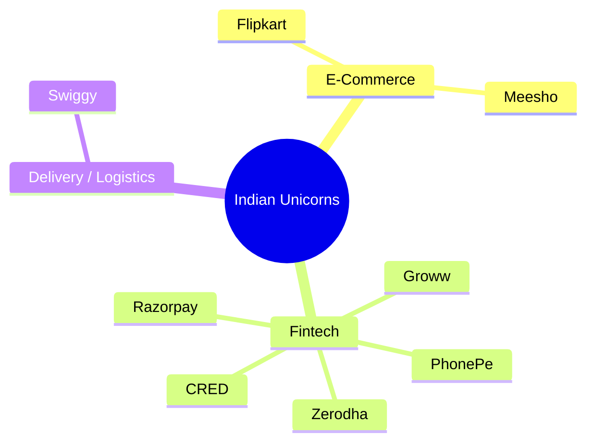
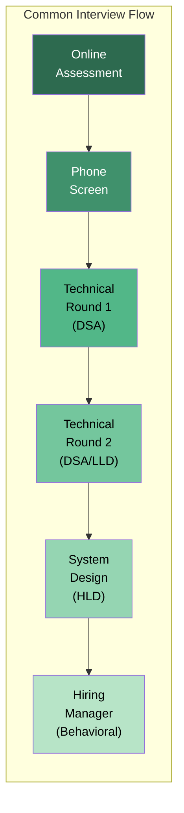
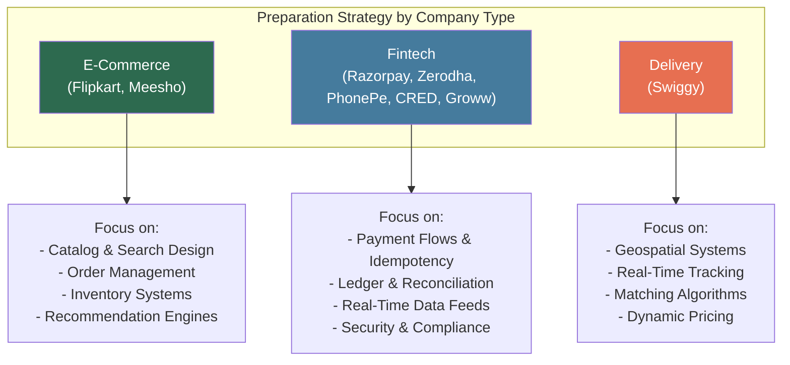

# Indian Unicorns — Company Question Bank

## Overview

This question bank covers interview patterns for top Indian tech companies. Indian startup interviews tend to emphasize practical problem-solving, system design for India-specific scale challenges (payments, logistics, regional languages), and cultural alignment with fast-moving engineering teams.

## Company Landscape

## Interview Process Comparison

| Company | OA | DSA Rounds | LLD Round | HLD Round | Behavioral | Total Rounds |
|---------|:---:|:---------:|:---------:|:---------:|:----------:|:------------:|
| Flipkart | Yes | 2 | 1 | 1 | 1 | 5-6 |
| Razorpay | Sometimes | 2 | 1 | 1 | 1 | 4-5 |
| Swiggy | Yes | 2 | 1 | 1 | 1 | 5-6 |
| Zerodha | No | 1-2 | 1 | 1 | 1 | 4-5 |
| PhonePe | Yes | 2 | 1 | 1 | 1 | 5-6 |
| CRED | No | 1-2 | 1 | 1 | 1 | 4-5 |
| Meesho | Yes | 2 | 1 | 1 | 1 | 5 |
| Groww | Sometimes | 1-2 | 1 | 1 | 1 | 4-5 |

> Note: LLD = Low-Level Design (OOP/class design), HLD = High-Level Design (distributed systems)

---

## Flipkart

### Company Context
- India's largest e-commerce marketplace (Walmart-owned)
- Scale: 400M+ registered users, millions of orders/day during sales
- Tech stack: Java, Golang, React, Kafka, MySQL, Redis, Elasticsearch
- Known for: Big Billion Days scale, supply chain tech

### DSA Focus Areas

| Pattern | Frequency | Difficulty | Example Problems |
|---------|-----------|-----------|------------------|
| Arrays & Sorting | Very High | Medium | Merge intervals, sort colors, next permutation |
| Trees & BST | Very High | Medium-Hard | Vertical order traversal, serialize/deserialize, LCA |
| Graphs (BFS/DFS) | High | Medium-Hard | Number of islands, shortest path, word ladder |
| Dynamic Programming | High | Medium-Hard | Longest increasing subsequence, coin change, edit distance |
| Stacks & Queues | Medium | Medium | Next greater element, min stack, sliding window max |
| Greedy | Medium | Medium | Job scheduling, activity selection |
| Heaps | Medium | Medium | Top K frequent, merge K sorted |

### System Design Questions

| Problem | Context | Frequency |
|---------|---------|-----------|
| Design Flipkart's Search | Product search, filters, ranking, typeahead | Very High |
| Design Flipkart's Cart & Checkout | Inventory locking, pricing, coupon engine | Very High |
| Design Order Management System | Order lifecycle, returns, refunds, tracking | High |
| Design Flipkart's Recommendation Engine | Collaborative filtering, personalization | High |
| Design Flash Sale System | Inventory management, queue, fairness | High |
| Design Flipkart's Notification System | Push, SMS, email; priority, throttling | Medium |
| Design Flipkart Delivery System | Route optimization, slot management, tracking | Medium |

### Low-Level Design (OOP) Questions

| Problem | Key Concepts |
|---------|-------------|
| Design a Shopping Cart | State management, pricing rules, coupons |
| Design an Inventory Management System | Stock tracking, reservations, warehouses |
| Design a Review & Rating System | Aggregation, spam detection, sorting |
| Design a Coupon/Voucher System | Rules engine, stacking, expiry |

### Behavioral / Culture Fit

| Question | What They Look For |
|----------|--------------------|
| "How do you handle high-pressure situations like sale events?" | Calm under pressure, planning |
| "Tell me about building something at scale" | Scale thinking, engineering maturity |
| "How do you collaborate with product teams?" | Cross-functional communication |
| "Tell me about a production incident you handled" | Incident management, ownership |

---

## Razorpay

### Company Context
- India's leading payment gateway and financial infrastructure
- Scale: Processes billions of transactions, 8M+ businesses
- Tech stack: Golang, Ruby on Rails, React, PostgreSQL, Kafka, K8s
- Known for: Payment reliability (99.99% uptime), developer-first APIs

### DSA Focus Areas

| Pattern | Frequency | Difficulty | Example Problems |
|---------|-----------|-----------|------------------|
| Arrays & Strings | Very High | Medium | Two sum, valid parentheses, longest substring |
| Hash Maps | Very High | Medium | Group anagrams, subarray sum equals K |
| Trees | High | Medium | BST validation, path sum, tree diameter |
| Linked Lists | High | Medium | Reverse, detect cycle, merge sorted |
| Dynamic Programming | Medium | Medium-Hard | Coin change, longest palindromic subsequence |
| Graphs | Medium | Medium | Connected components, course schedule |
| Concurrency Problems | Medium | Hard | Producer-consumer, rate limiter implementation |

### System Design Questions

| Problem | Context | Frequency |
|---------|---------|-----------|
| Design a Payment Gateway | Transaction processing, idempotency, reconciliation | Very High |
| Design a Subscription Billing System | Recurring payments, retry logic, invoicing | Very High |
| Design UPI Payment Flow | P2P, P2M, settlement, dispute handling | High |
| Design a Webhook Delivery System | At-least-once delivery, retry, dead letter queue | High |
| Design a Ledger System | Double-entry, audit trail, consistency | High |
| Design a Fraud Detection System | Real-time scoring, rules engine, ML pipeline | Medium |
| Design a KYC Verification System | Document processing, async verification | Medium |

### Low-Level Design Questions

| Problem | Key Concepts |
|---------|-------------|
| Design a Rate Limiter | Token bucket, sliding window, distributed |
| Design a Retry Mechanism | Exponential backoff, circuit breaker, DLQ |
| Design a State Machine for Payments | State transitions, idempotency, audit |
| Design an API Key Management System | Generation, rotation, scoping, rate limits |

### Behavioral / Culture Fit

| Question | What They Look For |
|----------|--------------------|
| "How do you ensure reliability in critical systems?" | Reliability mindset, testing rigor |
| "Tell me about debugging a production payment issue" | Incident response, systematic debugging |
| "How do you approach backward compatibility in APIs?" | Developer empathy, API design thinking |
| "Describe your approach to handling sensitive financial data" | Security awareness, compliance |

---

## Swiggy

### Company Context
- India's leading food & grocery delivery platform
- Scale: 350+ cities, millions of daily orders, 200K+ restaurant partners
- Tech stack: Java, Kotlin, Go, React Native, PostgreSQL, Redis, Kafka
- Known for: Real-time logistics, hyperlocal operations

### DSA Focus Areas

| Pattern | Frequency | Difficulty | Example Problems |
|---------|-----------|-----------|------------------|
| Arrays & Sorting | Very High | Medium | Merge intervals, product of array except self |
| Graphs | Very High | Medium-Hard | Shortest path, Dijkstra, network delay time |
| Trees | High | Medium | Level order traversal, BST operations |
| Dynamic Programming | High | Medium-Hard | Knapsack, minimum path sum, word break |
| Greedy | High | Medium | Interval scheduling, task assignment |
| Heap / Priority Queue | Medium | Medium | Top K nearest, merge K sorted |
| Sliding Window | Medium | Medium | Maximum sum subarray, minimum window substring |

### System Design Questions

| Problem | Context | Frequency |
|---------|---------|-----------|
| Design Swiggy's Order Management | Order lifecycle, restaurant assignment, rider assignment | Very High |
| Design a Real-Time Delivery Tracking System | GPS tracking, ETA computation, live map | Very High |
| Design Rider-Order Matching | Geospatial matching, load balancing, surge | High |
| Design a Restaurant Search & Discovery | Search, filters, ranking, personalization | High |
| Design Swiggy's Pricing & Surge Engine | Dynamic pricing, demand prediction | High |
| Design a Food Recommendation Engine | Personalization, trending, contextual | Medium |
| Design Swiggy Instamart (Quick Commerce) | Inventory, dark stores, 10-min delivery | Medium |

### Low-Level Design Questions

| Problem | Key Concepts |
|---------|-------------|
| Design a Delivery Slot Management System | Time slots, capacity, booking |
| Design an ETA Prediction Module | Geospatial, traffic, historical data |
| Design a Restaurant Menu Management System | CRUD, categories, availability, pricing |
| Design a Promo Code Engine | Rules, stacking, budget caps, user eligibility |

### Behavioral / Culture Fit

| Question | What They Look For |
|----------|--------------------|
| "How do you build systems for unreliable conditions (network, GPS)?" | Resilience thinking |
| "Tell me about optimizing something at scale" | Performance mindset |
| "How do you handle conflicting priorities from multiple stakeholders?" | Communication, prioritization |
| "Describe your experience with real-time systems" | Domain relevance |

---

## Zerodha

### Company Context
- India's largest stock broker by active clients (10M+ users)
- Scale: Handles 15%+ of India's daily equity trading volume
- Tech stack: Go, Python, Java, PostgreSQL, Redis, Kafka, custom-built infra
- Known for: Minimalist engineering, small team, profitability focus, open-source contributions (Kite Connect)

### DSA Focus Areas

| Pattern | Frequency | Difficulty | Example Problems |
|---------|-----------|-----------|------------------|
| Arrays & Math | High | Medium | Stock buy/sell, maximum subarray, prefix sums |
| Hash Maps | High | Medium | Two sum, frequency counting, anagram grouping |
| Trees & BST | Medium | Medium | BST validation, inorder successor, range sum |
| Sliding Window | Medium | Medium | Maximum average subarray, minimum window |
| Dynamic Programming | Medium | Medium | Best time to buy/sell stock (all variants) |
| Bit Manipulation | Low-Medium | Medium | Single number, counting bits |
| Concurrency | Medium | Hard | Thread-safe data structures, producer-consumer |

### System Design Questions

| Problem | Context | Frequency |
|---------|---------|-----------|
| Design a Stock Trading Platform | Order matching, real-time price updates | Very High |
| Design a Real-Time Market Data Feed | WebSocket, pub/sub, low latency | Very High |
| Design an Order Management System (OMS) | Order lifecycle, partial fills, cancellations | High |
| Design a Portfolio Tracker | Holdings, P&L calculation, real-time NAV | High |
| Design a Mutual Fund Investment Platform | SIP, redemption, NAV calculation | Medium |
| Design a Charting Engine | Time-series data, OHLC, indicators | Medium |

### Behavioral / Culture Fit

| Question | What They Look For |
|----------|--------------------|
| "Why do you want to work at Zerodha?" | Genuine interest in fintech/markets |
| "How do you approach building simple solutions?" | Minimalism, pragmatism (Zerodha is known for lean engineering) |
| "Tell me about a time you chose simplicity over complexity" | Engineering judgment |
| "How do you handle systems with zero downtime tolerance?" | Reliability, operational excellence |

---

## PhonePe

### Company Context
- India's largest UPI payment platform
- Scale: 500M+ registered users, 5B+ monthly transactions
- Tech stack: Java, Go, React, PostgreSQL, Cassandra, Kafka, Kubernetes
- Known for: UPI dominance, expanding into insurance, mutual funds, lending

### DSA Focus Areas

| Pattern | Frequency | Difficulty | Example Problems |
|---------|-----------|-----------|------------------|
| Arrays & Strings | Very High | Medium | Subarray sum, string manipulation, matrix problems |
| Hash Maps | Very High | Medium | Frequency maps, two sum variants, LRU cache |
| Trees | High | Medium-Hard | Binary tree paths, BST operations, segment trees |
| Graphs | High | Medium-Hard | Shortest path, connected components, topological sort |
| Dynamic Programming | High | Hard | Coin change, matrix chain, LCS |
| Linked Lists | Medium | Medium | Reverse, merge, cycle detection |
| Stacks | Medium | Medium | Valid parentheses, next greater element |

### System Design Questions

| Problem | Context | Frequency |
|---------|---------|-----------|
| Design UPI Payment System | P2P, P2M, mandate, collect | Very High |
| Design a Digital Wallet | Balance, top-up, transactions, limits | Very High |
| Design a Transaction History Service | Read-heavy, search, filters, pagination | High |
| Design a Bill Payment System | Biller integration, scheduling, reminders | High |
| Design a Cashback/Rewards Engine | Rules, budget, capping, settlement | Medium |
| Design Fraud Detection for Payments | Real-time scoring, velocity checks | Medium |

### Behavioral / Culture Fit

| Question | What They Look For |
|----------|--------------------|
| "How do you build trust in financial systems?" | Security-first thinking |
| "Tell me about handling a production incident" | Ownership, incident management |
| "How do you work with regulatory requirements?" | Compliance awareness |
| "Describe scaling a system 10x" | Growth engineering experience |

---

## CRED

### Company Context
- Fintech platform for credit card payments and financial services
- Scale: 10M+ users, premium user base
- Tech stack: Kotlin, Go, React, PostgreSQL, Redis, Kafka, Kubernetes
- Known for: Engineering excellence, design culture, high code quality bar

### DSA Focus Areas

| Pattern | Frequency | Difficulty | Example Problems |
|---------|-----------|-----------|------------------|
| Arrays & Strings | High | Medium | Interval problems, string parsing, matrix ops |
| Trees & Graphs | High | Medium-Hard | Path finding, tree dp, graph coloring |
| Dynamic Programming | High | Medium-Hard | Coin change, knapsack, partition problems |
| Design Patterns (OOP) | Very High | Medium | Strategy, observer, factory, builder |
| Concurrency | Medium | Hard | Locking, deadlock prevention, async patterns |
| System Design Concepts | Medium | Medium | Cache design, queue design, state machines |

### System Design Questions

| Problem | Context | Frequency |
|---------|---------|-----------|
| Design a Credit Score Tracking System | Score computation, history, alerts | High |
| Design a Rewards/Cashback Platform | Points, redemption, partner integration | Very High |
| Design a Credit Card Bill Payment Flow | Bill fetch, payment, reconciliation | Very High |
| Design a Gamification Engine | Challenges, leaderboards, achievements | High |
| Design a Personal Finance Dashboard | Aggregation, insights, budgeting | Medium |

### Behavioral / Culture Fit

| Question | What They Look For |
|----------|--------------------|
| "How do you approach code quality?" | Craftsmanship, testing culture |
| "Tell me about designing a delightful user experience" | Product thinking, design sense |
| "How do you learn new technologies?" | Growth mindset, curiosity |
| "Describe your approach to writing maintainable code" | Engineering standards |

---

## Meesho

### Company Context
- India's largest social commerce platform
- Scale: 150M+ monthly transacting users, focused on Tier 2-4 cities
- Tech stack: Java, Go, React Native, PostgreSQL, Redis, Kafka
- Known for: Zero-commission model, social selling, vernacular support

### DSA Focus Areas

| Pattern | Frequency | Difficulty | Example Problems |
|---------|-----------|-----------|------------------|
| Arrays & Sorting | Very High | Medium | Merge intervals, kth largest, sort variants |
| Hash Maps & Sets | High | Medium | Frequency count, duplicates, group by |
| Trees | High | Medium | Level order, path sum, BST operations |
| Graphs | Medium-High | Medium-Hard | BFS, DFS, connected components |
| Dynamic Programming | Medium | Medium | Subsequences, string DP, grid problems |
| Linked Lists | Medium | Medium | Reversal, merge, intersection |

### System Design Questions

| Problem | Context | Frequency |
|---------|---------|-----------|
| Design a Social Commerce Platform | Product sharing, reselling, commissions | Very High |
| Design a Product Catalog for Millions of Suppliers | Multi-tenant, search, categorization | High |
| Design an Order & Logistics System | COD, prepaid, returns, tracking | High |
| Design a Chat System for Buyers & Sellers | Real-time messaging, media sharing | Medium |
| Design a Personalization Engine for Tier 2-4 Users | Regional preferences, language, affordability | Medium |

### Behavioral / Culture Fit

| Question | What They Look For |
|----------|--------------------|
| "How do you build for diverse user segments?" | Empathy for Bharat users |
| "Tell me about simplifying something complex for end users" | UX thinking |
| "How do you handle rapid growth and changing requirements?" | Adaptability, speed |
| "Describe building a zero-to-one product" | Startup mentality |

---

## Groww

### Company Context
- Investment platform for stocks, mutual funds, IPOs
- Scale: 8M+ active investors, handling market-hours traffic spikes
- Tech stack: Java, Go, React, PostgreSQL, Redis, Kafka, AWS
- Known for: Simplifying investments, strong mobile experience

### DSA Focus Areas

| Pattern | Frequency | Difficulty | Example Problems |
|---------|-----------|-----------|------------------|
| Arrays & Math | High | Medium | Stock problems, prefix sums, intervals |
| Hash Maps | High | Medium | Two sum, frequency maps, caching |
| Trees & BST | Medium-High | Medium | Validation, traversals, path sums |
| Graphs | Medium | Medium | BFS, DFS, shortest path |
| Dynamic Programming | Medium | Medium | Stock buy/sell variants, knapsack |
| Stacks & Queues | Medium | Medium | Expression evaluation, next greater |

### System Design Questions

| Problem | Context | Frequency |
|---------|---------|-----------|
| Design a Mutual Fund Investment Platform | SIP, lump sum, NAV, portfolio tracking | Very High |
| Design a Stock Trading Engine | Order matching, real-time quotes, order book | Very High |
| Design an IPO Application System | High-throughput during window, lottery allocation | High |
| Design a Portfolio Analytics Dashboard | P&L, XIRR, asset allocation, benchmarking | High |
| Design a KYC Onboarding Flow | Document verification, video KYC, compliance | Medium |

### Behavioral / Culture Fit

| Question | What They Look For |
|----------|--------------------|
| "How do you handle high-traffic spikes during market hours?" | Performance engineering |
| "Tell me about making something simple for first-time investors" | User empathy, simplification |
| "How do you prioritize between new features and reliability?" | Engineering judgment |
| "Describe working on a compliance-critical system" | Regulatory awareness |

---

## Cross-Company Comparison

### DSA Pattern Frequency Across Companies

| Pattern | Flipkart | Razorpay | Swiggy | Zerodha | PhonePe | CRED | Meesho | Groww |
|---------|----------|----------|--------|---------|---------|------|--------|-------|
| Arrays/Strings | Very High | Very High | Very High | High | Very High | High | Very High | High |
| Hash Maps | High | Very High | High | High | Very High | High | High | High |
| Trees | Very High | High | High | Medium | High | High | High | Medium-High |
| Graphs | High | Medium | Very High | Low | High | High | Medium-High | Medium |
| DP | High | Medium | High | Medium | High | High | Medium | Medium |
| Linked Lists | Medium | High | Medium | Low | Medium | Low | Medium | Low |
| OOP/LLD | High | High | High | Medium | High | Very High | Medium | Medium |

### System Design Theme Frequency

| Theme | Flipkart | Razorpay | Swiggy | Zerodha | PhonePe | CRED | Meesho | Groww |
|-------|----------|----------|--------|---------|---------|------|--------|-------|
| E-Commerce | Very High | Low | Low | Low | Low | Low | Very High | Low |
| Payments | Medium | Very High | Medium | Low | Very High | Very High | Medium | Medium |
| Real-Time Systems | Medium | Medium | Very High | Very High | Medium | Low | Low | High |
| Search & Discovery | Very High | Low | High | Low | Medium | Medium | High | Medium |
| Logistics/Delivery | High | Low | Very High | Low | Low | Low | High | Low |
| Trading/Markets | Low | Low | Low | Very High | Low | Low | Low | Very High |
| Recommendations | High | Low | High | Low | Low | High | High | Medium |

### Culture & Values Comparison

| Aspect | Flipkart | Razorpay | Swiggy | Zerodha | PhonePe | CRED | Meesho | Groww |
|--------|----------|----------|--------|---------|---------|------|--------|-------|
| Engineering Culture | Scale-focused | Reliability-first | Speed + Scale | Minimalist | Scale + Security | Craft-focused | Move fast | Simplify |
| Team Size | Large | Medium | Large | Small | Large | Medium | Medium | Medium |
| Coding Bar | High | High | High | Very High | High | Very High | Medium-High | Medium-High |
| LLD Importance | High | High | High | Medium | High | Very High | Medium | Medium |
| Work-Life Balance | Moderate | Good | Moderate | Very Good | Moderate | Good | Moderate | Good |
| Growth Opportunity | High | Very High | High | Moderate | Very High | High | High | Very High |

