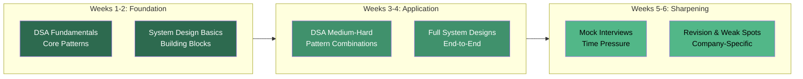
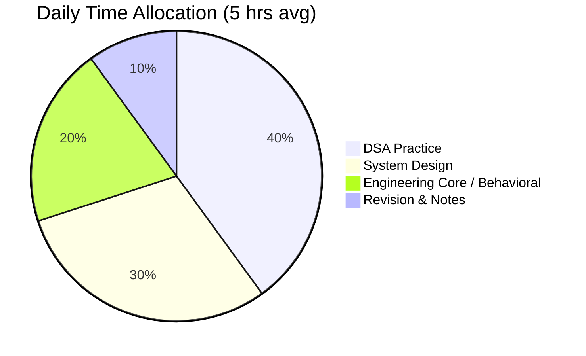
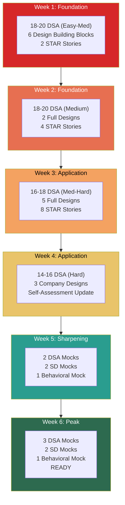

# 6-Week Intensive Interview Prep Schedule

## Overview

This is a structured 6-week plan covering all 5 pillars (DSA, System Design, Engineering Core, Behavioral, AI/ML). It assumes 4-6 hours of daily preparation and includes mock interviews, revision blocks, and progressive difficulty scaling.

## Schedule Philosophy

## Daily Time Block Structure

### Standard Day Template (5 Hours)

| Time Block | Duration | Activity | Notes |
|------------|----------|----------|-------|
| Block 1 (Morning) | 2.0 hrs | DSA Problems | Fresh mind for problem-solving |
| Block 2 (Afternoon) | 1.5 hrs | System Design Study | Read, design, diagram |
| Block 3 (Evening) | 1.0 hr | Eng Core / Behavioral / AI-ML | Rotate daily |
| Block 4 (Night) | 0.5 hr | Revision & Spaced Review | Review notes from 2-3 days ago |

### Mock Interview Day Template (5 Hours)

| Time Block | Duration | Activity | Notes |
|------------|----------|----------|-------|
| Block 1 | 1.0 hr | Warm-up (1-2 easy problems) | Get into problem-solving mode |
| Block 2 | 1.0 hr | Mock Interview | Timed, full format |
| Block 3 | 0.5 hr | Self-Evaluation | Score using rubric |
| Block 4 | 1.5 hrs | Address Weaknesses | Study what the mock exposed |
| Block 5 | 1.0 hr | Light review | System design or behavioral |

---

## Week 1: Foundation — DSA Core + Design Basics

**Goal:** Build DSA muscle memory on fundamental patterns. Start system design vocabulary.

### Daily Plan

| Day | DSA (2 hrs) | System Design (1.5 hrs) | Eng Core / Behavioral (1 hr) | Revision (30 min) |
|-----|-------------|------------------------|------------------------------|-------------------|
| **Mon** | Arrays: Two pointers, prefix sum (3 problems) | Scalability basics: vertical vs horizontal, load balancing | Language deep-dive: memory model, concurrency basics | Set up notes system |
| **Tue** | Hash Maps: frequency counting, two-sum patterns (3 problems) | Database fundamentals: SQL vs NoSQL, indexing, partitioning | SOLID principles overview | Review Monday's problems |
| **Wed** | Sliding Window: fixed & variable (3 problems) | Caching: strategies (LRU, write-through, cache-aside) | Design patterns: Singleton, Factory, Observer | Review Tuesday's problems |
| **Thu** | Linked Lists: reversal, cycle, merge (3 problems) | Message queues: Kafka basics, pub/sub, async processing | Behavioral: Ownership Thinking (prepare 2 STAR stories) | Review Wednesday's problems |
| **Fri** | Stacks & Queues: monotonic stack, BFS queue (3 problems) | CDN & API design: REST, pagination, rate limiting | Behavioral: Prioritization Frameworks | Review Thursday's problems |
| **Sat** | Binary Search: search space, rotated arrays (3 problems) | Full review: connect all building blocks in a diagram | Engineering Core: CI/CD, Docker basics | Weekly revision: redo 3 hardest problems |
| **Sun** | Mini-mock: 2 problems in 45 min (timed) | Practice: Design URL Shortener (30 min timed) | Rest / light reading | Review self-eval scores |

### Week 1 Targets

- [ ] 18-20 DSA problems solved (Easy-Medium)
- [ ] 6 system design building blocks understood
- [ ] 2 STAR stories drafted
- [ ] 1 mini-mock completed and self-evaluated
- [ ] Notes organized for all topics covered

---

## Week 2: Foundation — Trees, Graphs + First Full Design

**Goal:** Master tree/graph patterns. Complete first end-to-end system design.

### Daily Plan

| Day | DSA (2 hrs) | System Design (1.5 hrs) | Eng Core / Behavioral (1 hr) | Revision (30 min) |
|-----|-------------|------------------------|------------------------------|-------------------|
| **Mon** | Binary Trees: traversals, path problems (3 problems) | CAP theorem, consistency models (strong, eventual) | Concurrency: threads, locks, deadlocks | Review Week 1 weak spots |
| **Tue** | BST: validation, LCA, inorder successor (3 problems) | Database deep-dive: replication, sharding strategies | Design patterns: Strategy, Decorator, Adapter | Review Monday's problems |
| **Wed** | Heaps: top-K, merge K sorted, median stream (3 problems) | Microservices: decomposition, API gateway, saga pattern | Behavioral: Technical Decision-Making (2 STAR stories) | Review Tuesday's problems |
| **Thu** | Graphs: BFS, DFS, connected components (3 problems) | Full design: Chat/Messaging System (45 min) | Behavioral: Cross-Team Collaboration | Review Wednesday's problems |
| **Fri** | Graphs: topological sort, cycle detection (3 problems) | Full design: News Feed (45 min) | Monitoring & observability: metrics, logs, traces | Review Thursday's problems |
| **Sat** | Sorting: merge sort, quick sort, custom comparators (3 problems) | Review & refine both system designs | Security: OAuth, JWT, HTTPS basics | Weekly revision: redo 3 hardest problems |
| **Sun** | Mock: 2 medium problems in 45 min | Mock: System design (URL shortener or chat, 35 min) | Rest / review behavioral stories | Score both mocks |

### Week 2 Targets

- [ ] 18-20 DSA problems solved (Medium)
- [ ] 2 full system designs completed
- [ ] 4 STAR stories total (cumulative)
- [ ] 1 full DSA mock + 1 system design mock
- [ ] CAP theorem and consistency models understood

---

## Week 3: Application — DP, Advanced Patterns + Complex Designs

**Goal:** Tackle dynamic programming and pattern combinations. Design more complex systems.

### Daily Plan

| Day | DSA (2 hrs) | System Design (1.5 hrs) | Eng Core / Behavioral (1 hr) | Revision (30 min) |
|-----|-------------|------------------------|------------------------------|-------------------|
| **Mon** | DP: 1D problems — climbing stairs, house robber, coin change (3 problems) | Design: E-Commerce Platform (Flipkart/Amazon) — 45 min | Behavioral: Buy vs Build (2 STAR stories) | Review Week 2 weak areas |
| **Tue** | DP: 2D problems — grid paths, LCS, edit distance (3 problems) | Design: Payment System (Razorpay/Stripe) — 45 min | Containers: Docker, Kubernetes overview | Review Monday's problems |
| **Wed** | Greedy: intervals, activity selection (3 problems) | Design: Ride Matching (Uber/Ola) — 45 min | Behavioral: Managing Tech Debt (2 STAR stories) | Review Tuesday's problems |
| **Thu** | Backtracking: permutations, combinations, subsets (3 problems) | Design: Notification System — 45 min | Database operational: query optimization, connection pooling | Review Wednesday's problems |
| **Fri** | Trie: autocomplete, word search (2-3 problems) | Design: Video Streaming (YouTube/Netflix) — 45 min | Behavioral: Saying No with Data | Review Thursday's problems |
| **Sat** | Union-Find: connected components, accounts merge (2-3 problems) | Review all 5 designs; identify common patterns | Behavioral: review all 8 STAR stories | Weekly revision: redo 5 hardest problems |
| **Sun** | Mock: 2 medium-hard problems in 45 min | Mock: System design (pick from this week's topics, 40 min) | Rest / light reading on target companies | Score both mocks; compare to Week 2 |

### Week 3 Targets

- [ ] 16-18 DSA problems solved (Medium-Hard)
- [ ] 5 new system designs completed (7 cumulative)
- [ ] 8 STAR stories total (all behavioral topics covered)
- [ ] DP pattern recognition improving
- [ ] Mock scores: DSA >= 3.0/5, System Design >= 3.0/5

---

## Week 4: Application — Hard Problems + Company-Specific Prep

**Goal:** Push into hard DSA territory. Start targeting specific companies.

### Daily Plan

| Day | DSA (2 hrs) | System Design (1.5 hrs) | Eng Core / Behavioral (1 hr) | Revision (30 min) |
|-----|-------------|------------------------|------------------------------|-------------------|
| **Mon** | DP: advanced — knapsack variants, interval DP (2-3 problems) | Company-specific design: Target Company #1 top question | AI/ML basics (if applicable): supervised, unsupervised, overfitting | Review Week 3 weak areas |
| **Tue** | Graph: Dijkstra, weighted shortest path (2-3 problems) | Company-specific design: Target Company #2 top question | AI/ML: NLP basics, embeddings, transformers | Review Monday's problems |
| **Wed** | Hard problems: combination of patterns (2 problems) | Company-specific design: Target Company #3 top question | AI/ML: recommendation systems, MLOps | Review Tuesday's problems |
| **Thu** | Company question bank: practice top 5 for Target #1 | Deep-dive: pick your weakest design component | Behavioral: practice STAR stories out loud (record yourself) | Review Wednesday's problems |
| **Fri** | Company question bank: practice top 5 for Target #2 | Deep-dive: trade-offs and failure modes practice | Behavioral: practice handling pushback questions | Review Thursday's problems |
| **Sat** | Company question bank: practice top 5 for Target #3 | Full review: create cheat sheet of all designs | Full self-assessment checklist update | Weekly revision: redo 5 hardest problems |
| **Sun** | Mock: full 45-min with partner or platform | Mock: system design with partner or platform | Score mocks; update self-assessment | Plan Week 5 based on gaps |

### Week 4 Targets

- [ ] 14-16 DSA problems solved (Medium-Hard-Hard)
- [ ] 3 company-specific system designs
- [ ] Company question banks reviewed for top 3 targets
- [ ] Self-assessment checklist fully updated
- [ ] Mock scores: DSA >= 3.5/5, System Design >= 3.5/5

---

## Week 5: Sharpening — Mock-Heavy + Weak Spot Elimination

**Goal:** Maximum mock interviews. Ruthlessly attack weaknesses.

### Daily Plan

| Day | DSA (2 hrs) | System Design (1.5 hrs) | Eng Core / Behavioral (1 hr) | Revision (30 min) |
|-----|-------------|------------------------|------------------------------|-------------------|
| **Mon** | Weak spot: practice your 3 weakest DSA patterns (3 problems) | Weak spot: redesign your worst system design from scratch | Behavioral mock: record yourself answering 3 LP questions | Review self-assessment gaps |
| **Tue** | **FULL DSA MOCK** (45 min) + post-mortem (45 min) | Study feedback from yesterday's design revision | Behavioral: refine weak STAR stories | Review mock feedback |
| **Wed** | Weak spot: practice 3 more problems on weakest pattern | **FULL SYSTEM DESIGN MOCK** (45 min) + post-mortem (45 min) | Engineering core rapid review: top 10 interview topics | Review mock feedback |
| **Thu** | Mixed practice: 1 easy + 1 medium + 1 hard (random) | Weak spot: practice estimation and API design specifically | **FULL BEHAVIORAL MOCK**: 5 questions in 30 min | Review all mocks this week |
| **Fri** | **FULL DSA MOCK** (45 min) + post-mortem (45 min) | Revise all system design cheat sheets | Review company-specific behavioral questions | Spaced review of Week 1-2 topics |
| **Sat** | Contest or timed set: 4 problems in 90 min | **FULL SYSTEM DESIGN MOCK** (45 min) | Review company-specific culture questions | Weekly revision |
| **Sun** | Light review: redo 3 favorite problems | Light review: diagram 2 favorite designs | Rest and mental preparation | Plan Week 6 |

### Week 5 Targets

- [ ] 2 full DSA mocks (score >= 3.5 average)
- [ ] 2 full system design mocks (score >= 3.5 average)
- [ ] 1 full behavioral mock
- [ ] All weak spots identified and practiced
- [ ] Confidence level: "Practicing" or above on all topics

---

## Week 6: Peak Performance — Final Mocks + Confidence Building

**Goal:** Peak performance. Simulate real interview conditions. Build confidence.

### Daily Plan

| Day | DSA (2 hrs) | System Design (1.5 hrs) | Eng Core / Behavioral (1 hr) | Revision (30 min) |
|-----|-------------|------------------------|------------------------------|-------------------|
| **Mon** | **FULL DSA MOCK** with partner (real conditions) | Revise top 5 system design patterns | Behavioral: practice top 10 questions rapid-fire | Light revision |
| **Tue** | Post-mortem + targeted practice on mock gaps | **FULL SYSTEM DESIGN MOCK** with partner | Review engineering core rapid-fire questions | Light revision |
| **Wed** | **FULL DSA MOCK** with partner (different problem set) | Post-mortem + targeted design improvement | **FULL BEHAVIORAL MOCK** with partner | Light revision |
| **Thu** | Company-specific: final 5 problems for Target #1 | Company-specific: final design for Target #1 | Company-specific: culture prep for Target #1 | Mental preparation |
| **Fri** | Company-specific: final 5 problems for Target #2 | Company-specific: final design for Target #2 | Company-specific: culture prep for Target #2 | Mental preparation |
| **Sat** | Light practice: 2-3 comfortable problems (confidence boost) | Light review: flip through design cheat sheets | Review all STAR stories one final time | Final self-assessment |
| **Sun** | **REST DAY** — no studying | **REST DAY** — light walk-through of one design | **REST DAY** — visualize success | Prepare logistics for interview |

### Week 6 Targets

- [ ] 2-3 full DSA mocks (score >= 4.0 average)
- [ ] 1-2 full system design mocks (score >= 4.0 average)
- [ ] 1 behavioral mock (score >= 4.0 average)
- [ ] Company-specific prep complete for top 2 targets
- [ ] Final self-assessment: majority topics at "Confident" or "Interview-Ready"
- [ ] Mental state: confident, not exhausted

---

## 6-Week Progress Tracker

### Weekly Scorecard

| Week | DSA Problems | Designs Done | Mocks Done | DSA Avg Score | SD Avg Score | On Track? |
|------|-------------|-------------|-----------|---------------|--------------|-----------|
| 1 | ___ / 20 | ___ / 6 blocks | ___ / 1 | ___ / 5 | N/A | [ ] |
| 2 | ___ / 20 | ___ / 2 | ___ / 2 | ___ / 5 | ___ / 5 | [ ] |
| 3 | ___ / 18 | ___ / 5 | ___ / 2 | ___ / 5 | ___ / 5 | [ ] |
| 4 | ___ / 16 | ___ / 3 | ___ / 2 | ___ / 5 | ___ / 5 | [ ] |
| 5 | Mocks | Mocks | ___ / 5 | ___ / 5 | ___ / 5 | [ ] |
| 6 | Mocks | Mocks | ___ / 6 | ___ / 5 | ___ / 5 | [ ] |

### Cumulative Targets

| Metric | Target | Actual |
|--------|--------|--------|
| Total DSA problems | 80-90 | ___ |
| Total system designs | 15-18 | ___ |
| Total mock interviews | 18-20 | ___ |
| STAR stories prepared | 8-12 | ___ |
| Final DSA mock average | >= 4.0 | ___ |
| Final SD mock average | >= 4.0 | ___ |

---

## Adjustment Guidelines

### If You're Ahead of Schedule

- Add more hard DSA problems
- Practice less common system designs (search engine, distributed file system)
- Do mock interviews with strangers (Pramp, Interviewing.io)
- Focus on communication polish

### If You're Behind Schedule

- Cut AI/ML content (unless applying for ML roles)
- Reduce engineering core to essentials only
- Focus DSA on top 10 patterns (arrays, hash maps, trees, graphs, DP, BFS/DFS, sliding window, two pointers, binary search, heap)
- Reduce system designs to top 5 most-asked
- Do at minimum 1 mock per week

### If You Have Less Than 6 Weeks

| Available Time | Strategy |
|---------------|----------|
| 4 weeks | Compress Weeks 1-2 into 1 week; skip Week 4 company-specific; move straight to mocks |
| 2 weeks | Focus only: top 10 DSA patterns (3-4 problems each) + 3 system designs + behavioral stories |
| 1 week | Emergency mode: 5 problems/day on most common patterns + 1 design/day + review STAR stories |

### If You Have More Than 6 Weeks

| Additional Time | How to Use It |
|----------------|---------------|
| +2 weeks | Add hard DSA problems; practice 2-3 additional system designs; more mocks |
| +4 weeks | Go deeper on advanced topics (segment trees, graph algorithms); practice company-specific rounds |
| +6 weeks | Start with a foundation week of reading before Week 1; add competitive programming for speed |

---

## Resources for Mock Interviews

### Free Platforms

| Platform | Type | Best For |
|----------|------|----------|
| LeetCode (free tier) | DSA practice | Problem variety, contests |
| Pramp | Peer mock interviews | Free DSA + SD mocks with strangers |
| System Design Primer (GitHub) | System design reading | Comprehensive reference |
| Blind 75 / NeetCode 150 | Curated DSA lists | Focused problem sets |
| Excalidraw | Whiteboarding | System design diagramming practice |

### Paid Platforms

| Platform | Type | Best For |
|----------|------|----------|
| LeetCode Premium | DSA | Company-tagged problems, frequency data |
| Interviewing.io | Mock interviews | Real interviewers from top companies |
| Exponent | System design | Structured SD courses and mocks |
| AlgoExpert / NeetCode Pro | DSA | Video explanations, curated paths |
| Grokking System Design (Educative) | System design | Pattern-based learning |

### Finding Mock Partners

| Method | How |
|--------|-----|
| Discord communities | Join interview prep servers; schedule weekly mocks |
| Reddit r/cscareerquestions | Find partners in weekly threads |
| Twitter/X | Post that you're looking for mock partners |
| College alumni groups | Reach out to peers also interviewing |
| Colleagues | Practice with friends in the industry |
