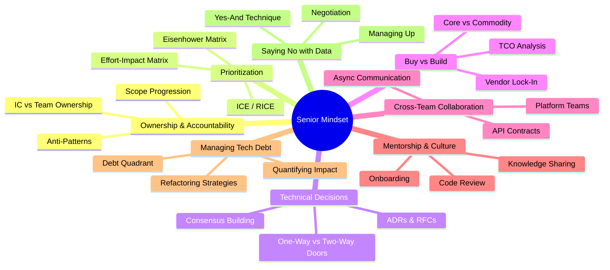
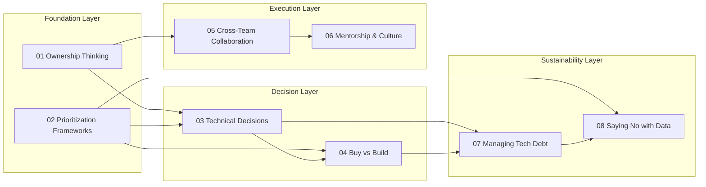
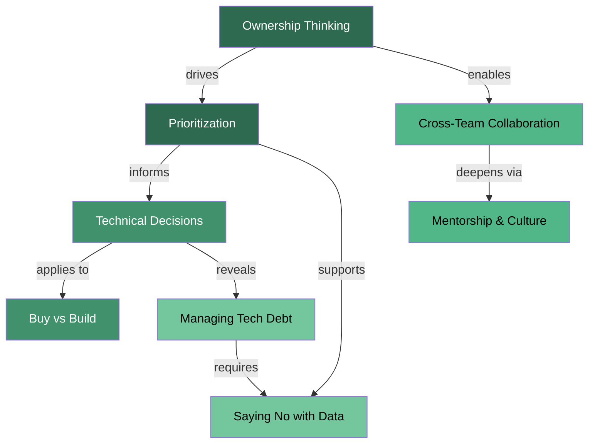

# Senior Mindset — Behavioral Interview Preparation

## Overview

The Senior Mindset module covers the behavioral and strategic thinking patterns that distinguish senior and staff engineers from mid-level ICs. These topics appear repeatedly in behavioral rounds at top companies and are evaluated through the STAR method, leadership principles, and scenario-based questions.



## Topic Map



## Topic Table

| # | Topic | Key Concepts | Typical Interview Questions | Priority |
|---|-------|-------------|---------------------------|----------|
| 01 | Ownership Thinking | Scope progression, anti-patterns, IC vs team ownership | "Tell me about a time you took ownership beyond your role" | High |
| 02 | Prioritization Frameworks | ICE, RICE, Eisenhower, effort-impact | "How do you decide what to work on?" | High |
| 03 | Technical Decisions | ADRs, RFCs, one-way/two-way doors | "Walk me through a major technical decision" | High |
| 04 | Buy vs Build | TCO, vendor lock-in, core vs commodity | "When would you build vs buy?" | Medium |
| 05 | Cross-Team Collaboration | API contracts, async comms, dependencies | "How do you work across teams?" | High |
| 06 | Mentorship & Culture | Code review, onboarding, pair programming | "How do you grow engineers on your team?" | Medium |
| 07 | Managing Tech Debt | Debt quadrant, quantifying, refactoring | "How do you handle tech debt?" | High |
| 08 | Saying No with Data | Yes-and technique, negotiation, managing up | "How do you push back on unrealistic timelines?" | High |

## Recommended Study Order

### Week 1 — Foundation
1. **01-Ownership Thinking** — Sets the baseline mindset for everything else
2. **02-Prioritization Frameworks** — Core skill that feeds into all decision-making

### Week 2 — Decisions
3. **03-Technical Decisions** — How to make and document architectural choices
4. **04-Buy vs Build** — Applying decision frameworks to a common dilemma

### Week 3 — Execution
5. **05-Cross-Team Collaboration** — Working across boundaries at scale
6. **06-Mentorship & Culture** — Multiplying impact through others

### Week 4 — Sustainability
7. **07-Managing Tech Debt** — Long-term system health and strategic refactoring
8. **08-Saying No with Data** — Protecting capacity and negotiating scope

## How These Topics Connect



## Progress Tracker

| # | Topic | Read | Notes Made | Stories Prepared | Mock Practice | Confident |
|---|-------|:----:|:----------:|:----------------:|:-------------:|:---------:|
| 01 | Ownership Thinking | [ ] | [ ] | [ ] | [ ] | [ ] |
| 02 | Prioritization Frameworks | [ ] | [ ] | [ ] | [ ] | [ ] |
| 03 | Technical Decisions | [ ] | [ ] | [ ] | [ ] | [ ] |
| 04 | Buy vs Build | [ ] | [ ] | [ ] | [ ] | [ ] |
| 05 | Cross-Team Collaboration | [ ] | [ ] | [ ] | [ ] | [ ] |
| 06 | Mentorship & Culture | [ ] | [ ] | [ ] | [ ] | [ ] |
| 07 | Managing Tech Debt | [ ] | [ ] | [ ] | [ ] | [ ] |
| 08 | Saying No with Data | [ ] | [ ] | [ ] | [ ] | [ ] |

## Story Bank Template

For each topic, prepare 2-3 STAR stories. Use this template:

```
### Story Title: [Short descriptive name]
- **Situation**: [Context — company, team, project, timeline]
- **Task**: [Your specific responsibility and what was expected]
- **Action**: [What YOU did — be specific, use "I" not "we"]
- **Result**: [Quantified outcome — metrics, impact, learning]
- **Applicable Topics**: [Which of the 8 topics this story covers]
```

A single strong story can often apply to 2-3 topics. Aim for 6-8 total stories that collectively cover all 8 topics.
