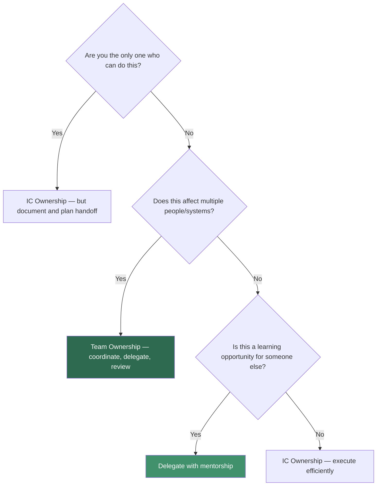
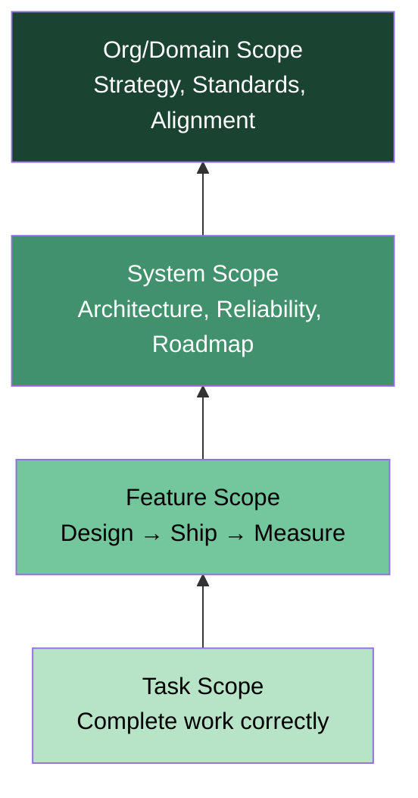

# Ownership Thinking

## What "Ownership" Means at the Senior Level

Ownership at the senior/staff level goes far beyond completing assigned tasks. It means treating the problem space as your own — anticipating issues, closing gaps nobody asked you to close, and being the person others rely on for a domain. Senior engineers own outcomes, not just outputs.

### The Ownership Spectrum

```mermaid
flowchart LR
    subgraph Junior["Junior / Mid-Level"]
        A1[Completes assigned tasks]
        A2[Asks for next steps]
        A3[Flags blockers]
    end

    subgraph Senior["Senior"]
        B1[Identifies problems proactively]
        B2[Proposes solutions with trade-offs]
        B3[Drives to resolution]
        B4[Follows up on outcomes]
    end

    subgraph Staff["Staff+"]
        C1[Shapes team/org direction]
        C2[Creates systems for others to own]
        C3[Owns cross-cutting concerns]
        C4[Anticipates future problems]
    end

    Junior --> Senior --> Staff
```



## IC Ownership vs Team Ownership

| Dimension | IC Ownership | Team Ownership |
|-----------|-------------|----------------|
| **Scope** | Your code, your feature, your service | Team's systems, team's delivery, team's growth |
| **Accountability** | "I shipped it and it works" | "The team delivers reliably and sustainably" |
| **Failure Mode** | "My PR had a bug" | "Our process didn't catch this class of bugs" |
| **Success Signal** | Personal output quality | Team velocity, reduced incidents, knowledge spread |
| **Decision Style** | "I chose the best approach" | "I facilitated the team reaching a good decision" |
| **Time Horizon** | This sprint / this quarter | This year / multi-year |

### When to Shift from IC to Team Ownership



## Scope Progression

Understanding where you operate on the scope ladder is critical for framing interview stories.

### The Scope Ladder

| Level | Scope | What You Own | Example |
|-------|-------|-------------|---------|
| **Task** | Single ticket / bug fix | Completing the work correctly | "Fixed the pagination bug in search results" |
| **Feature** | End-to-end feature delivery | Design, implementation, testing, rollout | "Designed and shipped the notification preferences system" |
| **System** | Entire service or subsystem | Architecture, reliability, evolution | "Owned the payment processing pipeline — uptime, scaling, roadmap" |
| **Org / Domain** | Cross-team technical domain | Standards, strategy, alignment | "Drove the migration from monolith to microservices across 4 teams" |



### How to Demonstrate Scope Progression in Interviews

1. **Pick a story where your scope expanded** — "I started by fixing a flaky test, discovered it was a symptom of a deeper architectural issue, and ended up leading the redesign."
2. **Show the trigger for expansion** — What made you go beyond the initial scope? (Customer impact? Repeated incidents? Data showing a pattern?)
3. **Quantify the broader impact** — Moving from task to system scope should show larger blast radius of impact.

## Ownership Signals — What Interviewers Look For

### Strong Ownership Signals

- **Proactive problem identification**: You found it before someone told you about it
- **End-to-end thinking**: You considered rollout, monitoring, rollback, documentation
- **Post-launch follow-through**: You tracked metrics after shipping, not just before
- **Knowledge sharing**: You documented decisions and trained others
- **Accountability in failure**: You owned mistakes without deflecting

### Ownership Signal Checklist

Use this to evaluate your interview stories:

- [ ] Did you identify the problem yourself, or were you assigned it?
- [ ] Did you define the solution scope, or was it handed to you?
- [ ] Did you consider edge cases, failure modes, and rollback?
- [ ] Did you follow up after launch to measure success?
- [ ] Did you share learnings with the team?
- [ ] Did you improve the process/system to prevent recurrence?
- [ ] Did you involve the right stakeholders proactively?

## Anti-Patterns

### Hero Culture

| Aspect | What It Looks Like | Why It's Harmful | The Fix |
|--------|-------------------|-----------------|---------|
| **Knowledge Silos** | "Only Alex can deploy that service" | Bus factor of 1, bottleneck | Document, pair, rotate ownership |
| **Always-On Firefighting** | "I stayed up all night fixing prod" | Unsustainable, masks systemic issues | Post-mortems, invest in reliability |
| **Bypassing Process** | "I just pushed directly, it was urgent" | Erodes trust, skips safety nets | Make the process fast, not optional |
| **Taking All Credit** | "I built the entire system" | Demoralizes team, not credible at scale | "I led..." or "I architected... and the team..." |

### Siloing

| Aspect | What It Looks Like | Why It's Harmful | The Fix |
|--------|-------------------|-----------------|---------|
| **Hoarding Information** | "I'll handle that, don't worry about it" | Creates dependency, slows team | Default to transparency, share context |
| **Refusing Help** | "It's faster if I do it myself" | Prevents team growth, burnout risk | Invest in teaching (slower now, faster later) |
| **No Documentation** | "It's all in my head" | Knowledge loss when you leave/move | Write ADRs, runbooks, design docs |
| **Territorial Behavior** | "That's MY service, don't touch it" | Blocks collaboration, creates friction | Collective code ownership, shared on-call |

### Anti-Pattern Self-Check

Ask yourself before telling an interview story:
- Am I the hero who saved the day solo? (Red flag)
- Did anyone else contribute? Am I acknowledging them? (Green flag)
- Did I create lasting improvement or just a one-time fix? (System thinking)
- Would the team be better off if I left tomorrow? (Sustainability)

## STAR Story Template for Ownership

```
SITUATION: [Set the scene — what was the state of things?]
  - What team/company/product?
  - What was broken, missing, or at risk?
  - Why did it matter? (business impact, user impact, team impact)

TASK: [What was your responsibility?]
  - Were you assigned this, or did you identify it yourself? (self-identified = stronger signal)
  - What was the expected scope vs what you actually took on?

ACTION: [What did YOU do?]
  - How did you investigate / scope the problem?
  - What options did you consider? What trade-offs did you weigh?
  - How did you get buy-in from stakeholders?
  - How did you execute? (Technical details appropriate for the audience)
  - How did you handle obstacles, pushback, or failure along the way?

RESULT: [What was the outcome?]
  - Quantify: latency reduced by X%, incidents dropped from Y to Z
  - Systemic improvement: "This class of bug is now impossible because..."
  - Team impact: "The team adopted this pattern across 3 other services"
  - Learning: "I learned that..." (shows growth mindset)
```

## Interview Q&A

> **Q: Tell me about a time you took ownership of something outside your direct responsibility.**
>
> **Framework**: Use a story where you noticed a gap (monitoring blind spot, undocumented system, poor onboarding experience) and proactively stepped in. Emphasize: (1) how you identified the gap, (2) how you got alignment without stepping on toes, (3) the lasting impact of your work, (4) how you ensured continuity after your involvement.

> **Q: How do you handle a situation where something is everyone's problem but nobody's responsibility?**
>
> **Framework**: Describe the "tragedy of the commons" scenario. Show that you (1) identified the gap explicitly, (2) proposed a clear owner (possibly yourself initially), (3) created a sustainable ownership model (rotation, RACI, on-call), (4) measured improvement. Key phrase: "I made the implicit explicit."

> **Q: Describe a time when you had to balance ownership of your own work with supporting the broader team.**
>
> **Framework**: This tests IC vs team ownership tension. Show you can (1) prioritize team needs when they have higher impact, (2) communicate trade-offs to your manager, (3) still deliver on your commitments through creative solutions (delegation, scope negotiation, parallel work), (4) recognize that team outcomes > individual output at senior level.

> **Q: Tell me about a time a project you owned failed. What did you do?**
>
> **Framework**: The trap is to avoid blame or minimize the failure. Instead: (1) Own the failure clearly — "I made the wrong call because..." (2) Explain what you learned — specifically and technically, (3) Show what you changed as a result — process, architecture, communication, (4) Demonstrate that the failure made you and the team stronger. Key phrase: "The failure was mine, and here's what I built to prevent it from happening again."

> **Q: How do you decide when to expand your scope vs stay focused?**
>
> **Framework**: Show structured thinking: (1) Evaluate impact — will expanding scope create more value than staying focused? (2) Evaluate timing — is this urgent or can it wait? (3) Evaluate alternatives — is there someone better positioned to handle this? (4) Communicate — make scope changes visible to your manager and stakeholders. Key: expanding scope without communication looks like going rogue, not ownership.

> **Q: How do you ensure continuity of ownership when you move to a new project?**
>
> **Framework**: This tests sustainable ownership. Show: (1) Documentation — runbooks, ADRs, design docs, (2) Knowledge transfer — pair sessions, recorded walkthroughs, (3) Gradual handoff — shadow period, escalation path, (4) Follow-up — checking in after handoff to ensure success. Anti-pattern: "I just moved on and the next person figured it out."

## Key Takeaways

1. **Ownership is about outcomes, not hours worked** — Staying up all night is not ownership; preventing the incident is.
2. **Scope should expand deliberately** — Self-identified scope expansion shows initiative; uncontrolled expansion shows poor prioritization.
3. **Sustainable ownership > heroic ownership** — Build systems, documentation, and team capabilities, not personal dependency.
4. **Own failures loudly, share successes broadly** — This builds trust and demonstrates maturity.
5. **Make the implicit explicit** — Name the unowned problem, propose a solution, and follow through.
