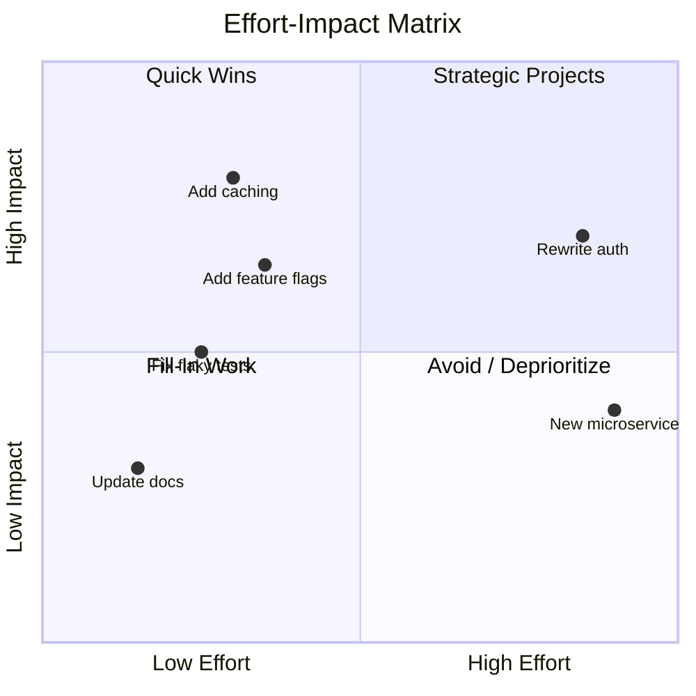
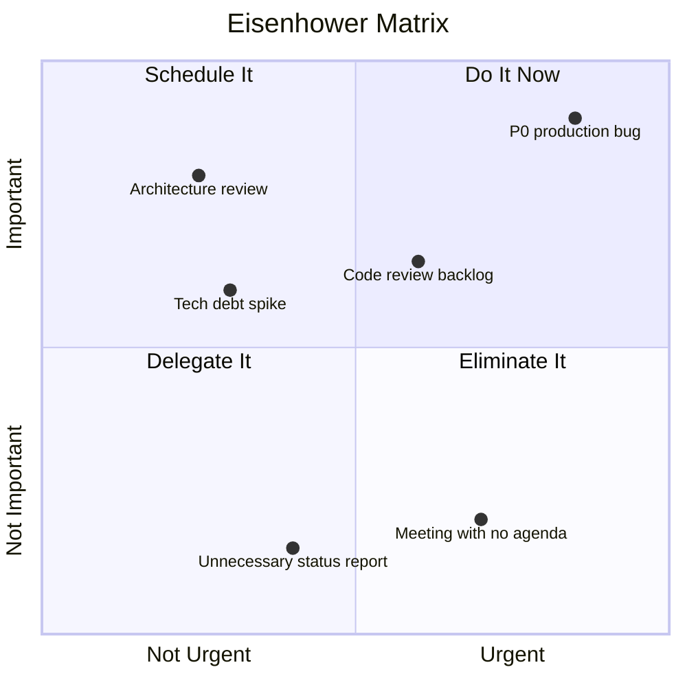
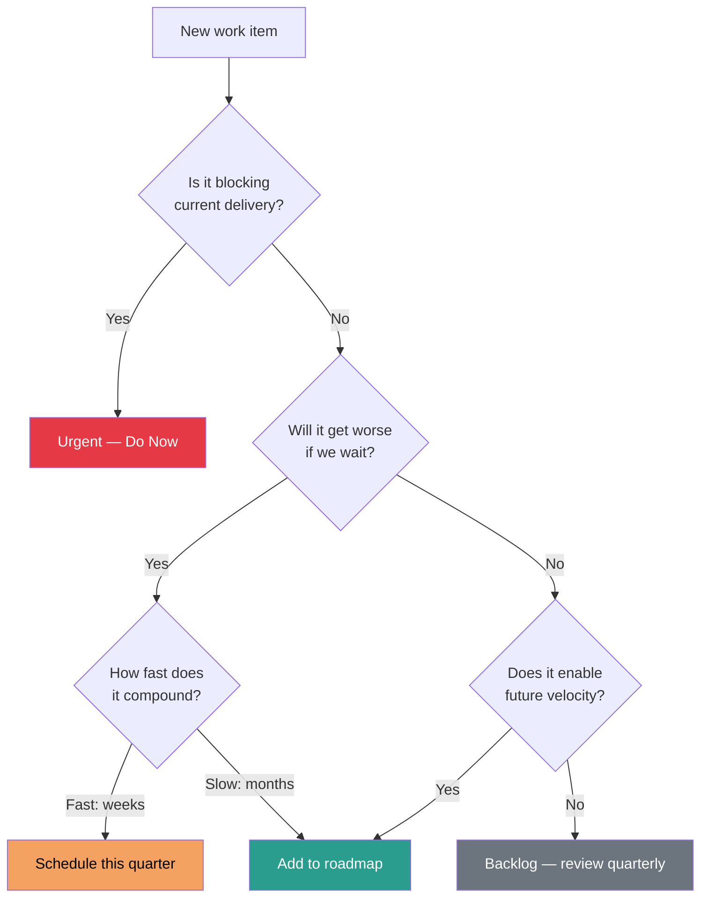

# Prioritization Frameworks

## Why Prioritization Matters at Senior Level

At the senior/staff level, you have more potential work than capacity. The ability to choose what NOT to do is more important than the ability to do more. Interviewers test this because poor prioritization at senior levels doesn't just waste your time — it wastes the team's and the org's time.

## Core Frameworks

### 1. ICE Scoring

**ICE = Impact x Confidence x Ease**

Each factor is scored 1-10, and the product gives you a relative priority score.

| Factor | What It Measures | How to Score |
|--------|-----------------|-------------|
| **Impact** | How much will this move the needle? | 1 = negligible, 10 = game-changing |
| **Confidence** | How sure are we of the impact estimate? | 1 = pure guess, 10 = data-backed |
| **Ease** | How easy is this to implement? | 1 = massive effort, 10 = trivial |

**Example Application**:

| Initiative | Impact | Confidence | Ease | ICE Score |
|-----------|--------|-----------|------|-----------|
| Add caching layer to API | 8 | 9 | 7 | 504 |
| Rewrite auth service | 7 | 5 | 2 | 70 |
| Fix flaky CI tests | 5 | 8 | 6 | 240 |
| Add feature flags | 6 | 7 | 8 | 336 |

**When to use ICE**: Quick triage, backlog grooming, when you need a fast directional signal. Best for comparing items of similar type (all features, all tech debt items).

### 2. RICE Scoring

**RICE = (Reach x Impact x Confidence) / Effort**

| Factor | What It Measures | How to Score |
|--------|-----------------|-------------|
| **Reach** | How many users/customers affected per quarter? | Actual number (e.g., 10,000 users/quarter) |
| **Impact** | How much does it affect each person? | 0.25 = minimal, 0.5 = low, 1 = medium, 2 = high, 3 = massive |
| **Confidence** | How confident in your estimates? | 50% = low, 80% = medium, 100% = high |
| **Effort** | Person-months of work | Actual estimate (e.g., 2 person-months) |

**Example Application**:

| Initiative | Reach | Impact | Confidence | Effort | RICE Score |
|-----------|-------|--------|-----------|--------|------------|
| Search autocomplete | 50,000 | 2 | 80% | 3 | 26,667 |
| Admin dashboard revamp | 200 | 3 | 100% | 6 | 100 |
| Mobile push notifications | 30,000 | 1 | 60% | 2 | 9,000 |

**When to use RICE**: Product-facing decisions where user reach matters. Better than ICE when comparing items with very different audience sizes.

### 3. Effort-Impact Matrix (2x2)



| Quadrant | Strategy | Action |
|----------|----------|--------|
| **Quick Wins** (High Impact, Low Effort) | Do first | Ship immediately, build momentum |
| **Strategic Projects** (High Impact, High Effort) | Plan and execute | Break into phases, get stakeholder buy-in |
| **Fill-In Work** (Low Impact, Low Effort) | Do when idle | Good for onboarding, learning, or downtime |
| **Avoid** (Low Impact, High Effort) | Say no or defer | Document why, revisit quarterly |

### 4. Eisenhower Matrix



| Quadrant | Action | Engineering Examples |
|----------|--------|---------------------|
| **Urgent + Important** | Do it now | Production outage, security vulnerability, data loss |
| **Important + Not Urgent** | Schedule it | Architecture improvement, tech debt, documentation, mentoring |
| **Urgent + Not Important** | Delegate it | Routine alerts, meeting prep, status updates |
| **Not Urgent + Not Important** | Eliminate it | Unnecessary meetings, gold-plating, bikeshedding |

**Senior-level insight**: Most high-leverage senior work lives in Quadrant 2 (Important + Not Urgent). The trap is spending all your time in Quadrant 1 (firefighting). If you are always in Q1, you have a systemic problem, not a prioritization problem.

## Framework Comparison

| Framework | Best For | Strengths | Weaknesses |
|-----------|---------|-----------|------------|
| **ICE** | Quick backlog triage | Fast, simple, intuitive | Subjective, no user reach factor |
| **RICE** | Product decisions | Accounts for reach, data-driven | Requires reliable estimates, slower |
| **Effort-Impact** | Visual communication | Easy to explain to stakeholders | Oversimplifies, binary categorization |
| **Eisenhower** | Personal time management | Forces urgency vs importance distinction | Not great for comparing projects |

## Applying Frameworks in Engineering Context

### Prioritizing Tech Debt vs Features



### Saying "Not Now" vs Saying "No"

| Response | When to Use | How to Frame It |
|----------|-------------|----------------|
| **"Yes, now"** | High impact, low effort, aligns with goals | "This is a quick win that directly supports our OKRs" |
| **"Yes, but later"** | High impact, but not the highest priority right now | "I agree this is important. Here's where it fits in our roadmap" |
| **"Not now"** | Medium impact, competing priorities are higher | "Given our current capacity and priorities, I'd recommend Q3. Here's what we'd defer to do it sooner." |
| **"No, and here's why"** | Low impact relative to cost, or wrong direction | "The data shows X, which means this would have limited impact. Instead, I'd suggest Y." |
| **"Yes, and here's the cost"** | Stakeholder insists, you need to show trade-offs | "We can do this. Here's what we'd need to stop doing / push back." |

### Trade-Off Analysis Template

When presenting a prioritization decision:

```
## Decision: [What are we deciding?]

### Options Considered
| Option | Impact | Effort | Risk | Reversibility |
|--------|--------|--------|------|---------------|
| A      |        |        |      |               |
| B      |        |        |      |               |
| C (do nothing) |  |      |      |               |

### Recommendation
- **Chosen option**: [X]
- **Rationale**: [Why this option wins on the dimensions that matter most]
- **What we're giving up**: [Be explicit about trade-offs]
- **Revisit criteria**: [When/why we'd reconsider this decision]
```

## Stakeholder Alignment

### The Alignment Pyramid

Before prioritization is accepted, you need alignment at three levels:

1. **Data alignment** — Do we agree on the facts? (metrics, customer feedback, incident data)
2. **Goal alignment** — Do we agree on what we're optimizing for? (speed, reliability, revenue, UX)
3. **Priority alignment** — Given shared data and goals, do we agree on the ordering?

Most prioritization disagreements happen because people are misaligned on goals, not on data. Diagnose the level of misalignment before debating the priority.

### Stakeholder Communication Checklist

- [ ] Have I shared the raw data, not just my interpretation?
- [ ] Have I confirmed we share the same goals this quarter?
- [ ] Have I made the trade-offs explicit, not hidden?
- [ ] Have I offered alternatives, not just my preferred option?
- [ ] Have I given stakeholders a way to provide input before the decision?
- [ ] Have I documented the decision and rationale for future reference?

## Interview Q&A

> **Q: How do you decide what to work on when everything is "high priority"?**
>
> **Framework**: (1) Acknowledge that "everything is high priority" usually means priorities aren't clear — step 1 is getting alignment on goals. (2) Apply a framework (ICE or Effort-Impact) to create a visible rank ordering. (3) Force-rank by asking: "If we could only ship ONE thing this quarter, what would it be?" (4) Make trade-offs explicit: "Doing A means not doing B. Are we okay with that?" (5) Get explicit sign-off on the ordering from leadership.

> **Q: Tell me about a time you had to say no to a stakeholder.**
>
> **Framework**: Use a story where you (1) listened and understood their need, (2) validated the importance of their request, (3) presented data showing why something else should come first, (4) offered alternatives (partial solution, later timeline, different approach), (5) reached a mutually acceptable outcome. Key: you never just say "no" — you say "not now, and here's why, and here's what I suggest instead."

> **Q: How do you balance short-term delivery with long-term technical investment?**
>
> **Framework**: (1) Use the "tax" metaphor — tech debt is like tax; some is unavoidable, but too much is crippling. (2) Advocate for a consistent allocation (e.g., 20% of sprint capacity for tech health). (3) Tie tech investments to business outcomes: "Reducing deploy time from 45min to 5min means we can ship features 3x faster." (4) Show the compounding cost of deferral: "Every month we wait, this migration gets X% harder."

> **Q: Walk me through how you'd prioritize a backlog of 20 items.**
>
> **Framework**: (1) Group by theme — don't evaluate 20 items individually. (2) Apply ICE/RICE to the top 8-10 that survive initial triage. (3) Identify dependencies — some items unlock others, so sequence matters. (4) Time-box the prioritization itself — spending 3 days prioritizing a 2-week sprint is wasteful. (5) Share the result visually (effort-impact matrix) for stakeholder buy-in. (6) Revisit weekly — priorities shift as new data arrives.

> **Q: How do you handle competing priorities from different teams?**
>
> **Framework**: (1) Understand each team's goals and constraints. (2) Find the shared objective — usually there is one. (3) Use data to compare impact across requests. (4) Escalate to a shared leader if needed — but come with a recommendation, not just the problem. (5) Propose creative solutions: "Can we do a thin version for Team A now and the full version for Team B next quarter?"

> **Q: Describe a situation where you changed your priorities mid-project. Why?**
>
> **Framework**: (1) Describe the original priority and why it made sense at the time. (2) Explain what changed — new data, market shift, incident, customer feedback. (3) Show your decision process — you didn't panic-pivot; you evaluated the new information against your framework. (4) Communicate the change clearly to stakeholders. (5) Show the outcome — the pivot was justified by results.

## Key Takeaways

1. **Frameworks are tools, not rules** — Use them to structure thinking and communicate rationale, not to mechanically compute answers.
2. **The hardest skill is saying "not now"** — Senior engineers protect team capacity by being explicit about trade-offs.
3. **Prioritization is a communication exercise** — The ranking matters less than the shared understanding of why.
4. **Revisit regularly** — Static priorities in a dynamic environment are a failure mode.
5. **Optimize for learning** — When uncertain, choose the option that teaches you the most with the least irreversible cost.
