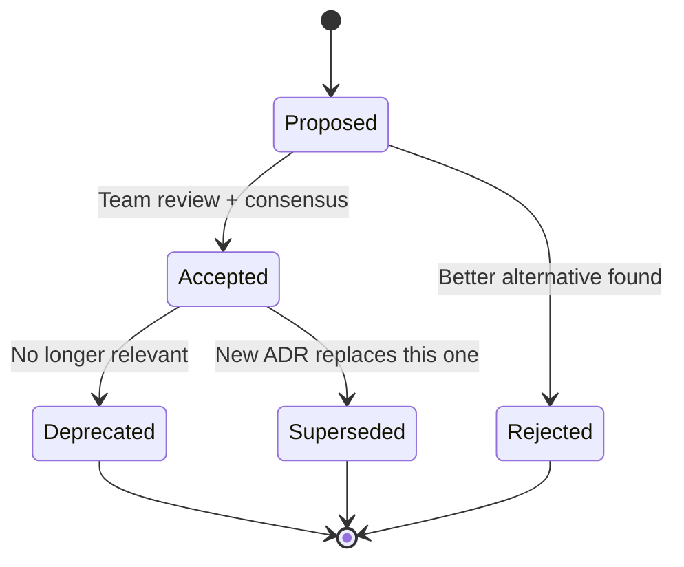
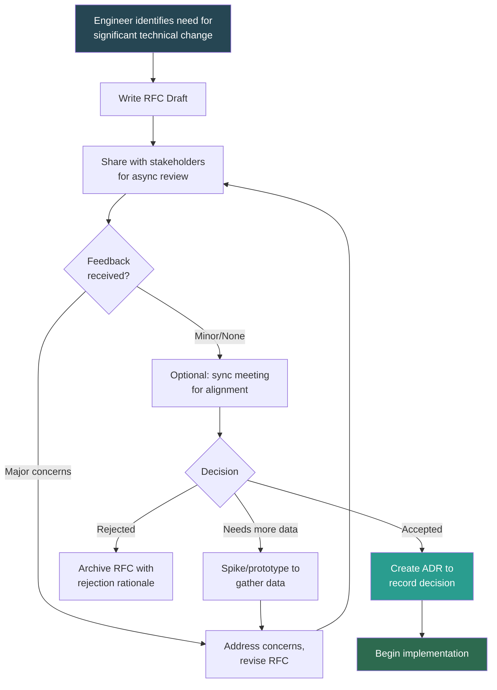
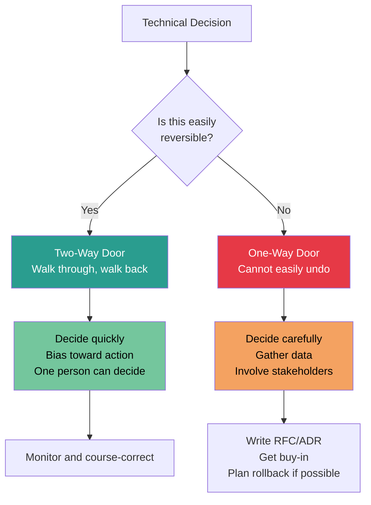
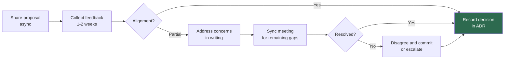

# Technical Decisions

## Why Technical Decision-Making Is a Core Senior Skill

At the senior level, the code you write matters less than the decisions you make about what to build, how to build it, and what trade-offs to accept. Interviewers evaluate your ability to navigate ambiguity, make defensible choices under uncertainty, and bring others along with you.

## Architecture Decision Records (ADRs)

### What Is an ADR?

An ADR is a lightweight document that captures a single architectural decision, the context that led to it, and the consequences. ADRs create an institutional memory of "why we did it this way."

### ADR Template

```
# ADR-NNN: [Short descriptive title]

## Status
[Proposed | Accepted | Deprecated | Superseded by ADR-XXX]

## Context
[What is the issue? What forces are at play? What constraints exist?]

## Decision
[What is the change that we're proposing or have agreed to?]

## Consequences
### Positive
- [Benefit 1]
- [Benefit 2]

### Negative
- [Trade-off 1]
- [Trade-off 2]

### Neutral
- [Side effect that is neither positive nor negative]

## Alternatives Considered
| Alternative | Pros | Cons | Why Not Chosen |
|------------|------|------|----------------|
| Option A   |      |      |                |
| Option B   |      |      |                |

## References
- [Links to RFCs, design docs, discussions]
```

### ADR Best Practices

| Practice | Why It Matters |
|----------|---------------|
| Keep ADRs immutable | They are a historical record; if the decision changes, write a new ADR |
| One decision per ADR | Mixing decisions makes them hard to reference and supersede |
| Include rejected alternatives | Shows you did due diligence; prevents re-litigating settled decisions |
| Store ADRs with the code | They're discoverable where engineers work (e.g., `/docs/adr/`) |
| Number sequentially | Makes them easy to reference: "As decided in ADR-042..." |
| Write them when the decision is made | Not after; context fades fast |

### ADR Lifecycle



## RFC Process

### What Is an RFC?

A Request for Comments is a collaborative document that proposes a significant technical change and solicits feedback before implementation. Unlike ADRs (which record a decision), RFCs are the process of making the decision.

### RFC vs ADR

| Aspect | RFC | ADR |
|--------|-----|-----|
| **Purpose** | Propose and discuss a change | Record a decision that was made |
| **Timing** | Before the decision | At the time of or after the decision |
| **Audience** | Broad — anyone affected can comment | Narrow — the team that owns the system |
| **Length** | Detailed — 2-10 pages | Brief — 1-2 pages |
| **Lifecycle** | Draft -> Review -> Accepted/Rejected | Proposed -> Accepted -> (Deprecated/Superseded) |
| **Interaction** | Collaborative, iterative | Declarative, immutable |

### RFC Process Flow



### RFC Template (Abbreviated)

```
# RFC: [Title]
**Author**: [Name]  |  **Date**: [Date]  |  **Status**: [Draft/Review/Accepted/Rejected]

## Summary
[1-2 sentence overview of the proposal]

## Motivation
[Why are we doing this? What problem does it solve? What data supports this?]

## Detailed Design
[Technical details — architecture, APIs, data models, algorithms]

## Trade-offs and Alternatives
[What are we giving up? What else did we consider?]

## Migration / Rollout Plan
[How do we get from here to there safely?]

## Open Questions
[What don't we know yet? What needs more investigation?]
```

## One-Way vs Two-Way Door Decisions (Bezos Framework)

This is one of the most powerful mental models for technical decision-making and appears frequently in Amazon and other FAANG interviews.

### The Framework



### Classification Guide

| One-Way Door (Irreversible) | Two-Way Door (Reversible) |
|---------------------------|--------------------------|
| Choosing a primary database (Postgres vs Mongo) | Adding a new API endpoint |
| Committing to a cloud provider (AWS vs GCP) | Choosing a logging library |
| Defining a public API contract with external consumers | Internal service communication format |
| Deleting customer data | Adding a feature flag |
| Choosing a programming language for a core service | Adding a new microservice |
| Major schema migration with data loss | Adding a new column to a table |
| Signing a multi-year vendor contract | Trying a SaaS tool on a monthly plan |

### Common Mistake: Treating Two-Way Doors as One-Way

Many organizations slow themselves down by treating reversible decisions as if they were permanent. Signs of this anti-pattern:

- 3-week review process for adding a utility function
- Committee approval needed for every library choice
- Analysis paralysis on decisions with low blast radius

**Senior engineer signal**: Recognizing which category a decision falls into and adjusting the process accordingly.

## Documenting Trade-Offs

### The Trade-Off Matrix

For any significant decision, fill out this matrix:

| Dimension | Option A | Option B | Option C |
|-----------|----------|----------|----------|
| **Performance** | | | |
| **Scalability** | | | |
| **Maintainability** | | | |
| **Time to implement** | | | |
| **Operational complexity** | | | |
| **Team familiarity** | | | |
| **Vendor lock-in risk** | | | |
| **Cost (Year 1)** | | | |
| **Cost (Year 3)** | | | |

### Trade-Off Documentation Principles

1. **Make the "losing" options visible** — Showing what you rejected and why is as important as explaining what you chose.
2. **State your assumptions** — "We assume traffic will grow 3x in 12 months. If it grows 10x, we'd choose differently."
3. **Define revisit triggers** — "We should reconsider this decision if [condition X] becomes true."
4. **Separate facts from opinions** — "Benchmarks show Option A is 2x faster (fact). We believe Option B's API is cleaner (opinion)."

## Building Consensus

### Consensus Is Not Unanimity

| Consensus Level | Definition | When to Use |
|----------------|-----------|-------------|
| **Unanimous agreement** | Everyone agrees it's the best choice | Rare; not required for most decisions |
| **Consensus** | Everyone can live with and support the decision | Default for most architectural decisions |
| **Disagree and commit** | Some disagree but commit to the decision | Time-sensitive decisions; used after reasonable discussion |
| **Escalation** | A leader makes the call | Last resort; use when consensus fails and delay is costly |

### Consensus-Building Process



### Tips for Building Consensus at Senior Level

- **Write it down first** — Async proposals let people think before reacting. Don't ambush with a design in a meeting.
- **Acknowledge trade-offs** — "I know Option B has a cleaner API, but I'm recommending Option A because of the latency requirement."
- **Give people a way to disagree safely** — "I'd love pushback on this — what am I missing?"
- **Set a decision deadline** — "I'll finalize this by Friday. Please share any concerns by Thursday EOD."
- **Name the disagreement** — "It sounds like the core disagreement is about whether we optimize for read latency or write throughput. Let's focus there."

## Decision-Making Anti-Patterns

| Anti-Pattern | Description | Fix |
|-------------|-------------|-----|
| **HiPPO** (Highest Paid Person's Opinion) | Decisions made by seniority, not data | Require evidence-based proposals |
| **Analysis Paralysis** | Over-analyzing reversible decisions | Classify as one-way/two-way door first |
| **Bike-shedding** | Spending disproportionate time on trivial details | Time-box discussions, use "default" choices for low-stakes |
| **Ghost decisions** | Decisions made but never documented | Require ADR for any significant choice |
| **Re-litigation** | Reopening settled decisions without new data | Point to ADR; require new data to reopen |
| **Lone wolf** | Making significant decisions without input | Require RFC for decisions affecting >1 team |

## Interview Q&A

> **Q: Walk me through a major technical decision you made and how you arrived at it.**
>
> **Framework**: (1) Context: What was the problem and why did it matter? (2) Options: What 2-3 options did you consider? (3) Evaluation: What dimensions did you compare them on? (4) Decision: What did you choose and why? (5) Outcome: What happened? Would you make the same choice again? Key: show that you considered alternatives thoughtfully, not that you're brilliant enough to always pick the right answer.

> **Q: How do you make decisions when you don't have all the information?**
>
> **Framework**: (1) Classify the decision — is it a one-way or two-way door? (2) For two-way doors: bias toward action, choose the option that's easiest to reverse, and course-correct based on data. (3) For one-way doors: identify the minimum information needed to de-risk the decision, run a time-boxed spike if needed, and set a deadline to decide even with imperfect information. (4) Key phrase: "I'd rather make a good decision now than a perfect decision too late."

> **Q: Tell me about a time you disagreed with a technical decision. What did you do?**
>
> **Framework**: (1) Describe the decision and why you disagreed. (2) Show that you expressed your concerns with data, not just opinion. (3) If overruled: demonstrate "disagree and commit" — you supported the decision fully once it was made. (4) If your concern proved valid later: show you raised it constructively, not with "I told you so." (5) Key signal: you can advocate strongly AND commit to the group's decision.

> **Q: How do you handle a situation where two senior engineers disagree on the architecture?**
>
> **Framework**: (1) Facilitate, don't arbitrate — help each side articulate their concerns clearly. (2) Identify the root cause of disagreement — is it data, priorities, or values? (3) Propose an experiment or spike to test assumptions. (4) If the disagreement is about trade-offs with no clear winner, frame it explicitly: "We're trading X for Y — let's make that trade-off visible and decide based on our current priorities." (5) Set a deadline and use disagree-and-commit if needed.

> **Q: How do you document technical decisions for your team?**
>
> **Framework**: (1) ADRs for decisions — stored with the code, written at the time of the decision. (2) RFCs for proposals — shared async before implementation. (3) Design docs for complex systems — living documents updated as the system evolves. (4) Key practice: I make documentation part of the definition of done, not an afterthought. (5) Show an example of when good documentation prevented a costly re-litigation or helped a new team member ramp up.

> **Q: Describe a decision you made that turned out to be wrong. How did you handle it?**
>
> **Framework**: (1) Own it — "I made the wrong call." (2) Explain what you knew at the time and why the decision seemed right. (3) Describe when and how you realized it was wrong. (4) Show what you did: course-corrected, communicated the change, updated the ADR. (5) Explain what you learned and how it changed your decision-making process. Key: interviewers want to see intellectual honesty and adaptability, not perfection.

## Key Takeaways

1. **Document decisions at the time they're made** — Context fades fast; write it down while you remember why.
2. **Classify before you process** — One-way doors need careful deliberation; two-way doors need speed.
3. **Show your work** — The rejected alternatives and the trade-offs are as important as the chosen option.
4. **Consensus means support, not agreement** — Everyone must be able to commit, but not everyone must prefer the choice.
5. **Decisions are provisional** — Include revisit triggers in your ADRs; the best decision today may not be the best decision next year.
