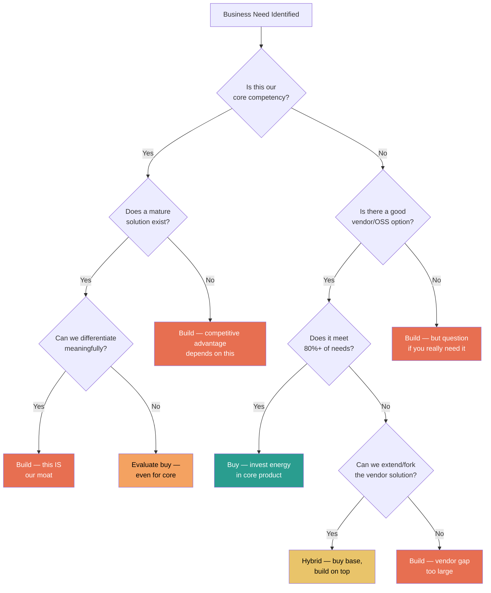
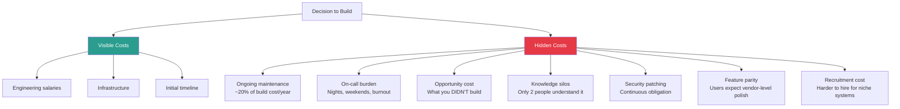
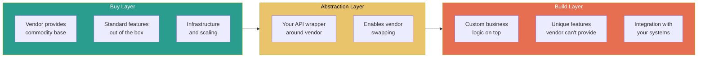

# Buy vs Build

## Why Buy vs Build Is a Senior-Level Decision

Buy vs build is one of the most consequential decisions an engineering team makes. It affects velocity, cost, team focus, and long-term flexibility. At the senior level, you're expected to evaluate these decisions with nuance — understanding hidden costs on both sides and framing the decision in terms of business strategy, not just engineering preference.

## The Buy vs Build Decision Framework



## Core vs Commodity

The single most important axis in buy vs build decisions:

| Aspect | Core (Build) | Commodity (Buy) |
|--------|-------------|-----------------|
| **Definition** | What makes your product uniquely valuable | Necessary but not differentiating |
| **Examples** | Recommendation algorithm (Netflix), Search ranking (Google), Pricing engine (Uber) | Authentication, email sending, payment processing, monitoring |
| **Strategic value** | High — competitive advantage | Low — table stakes |
| **Customization need** | Deep — unique business logic | Shallow — standard patterns |
| **Risk of vendor** | High — locked out of your own moat | Low — commodity is interchangeable |
| **Engineer focus** | This is what your engineers should spend time on | This is a distraction from core work |

## Total Cost of Ownership (TCO) Analysis

### Build TCO Components

| Cost Category | Year 1 | Year 2+ (Annual) | Often Overlooked? |
|--------------|--------|-------------------|:-----------------:|
| Design and architecture | High | Low | No |
| Implementation (engineering hours) | Very High | Medium | No |
| Testing and QA | High | Medium | Sometimes |
| Security review and hardening | Medium | Low | Yes |
| Documentation | Medium | Low | Yes |
| Deployment and infrastructure | Medium | Medium | Sometimes |
| On-call and incident response | Low (initially) | Medium-High | Yes |
| Maintenance and bug fixes | Low (initially) | High | Yes |
| Feature evolution | Low | High | Yes |
| Opportunity cost (what else could the team build?) | Very High | Very High | Yes |

### Buy TCO Components

| Cost Category | Year 1 | Year 2+ (Annual) | Often Overlooked? |
|--------------|--------|-------------------|:-----------------:|
| License / subscription fees | Medium | Medium-High (price increases) | No |
| Integration development | High | Low | Sometimes |
| Data migration | High | N/A | Sometimes |
| Training and onboarding | Medium | Low | Sometimes |
| Customization / workarounds | Medium | Medium | Yes |
| Vendor management overhead | Low | Low-Medium | Yes |
| Compliance and security review | Medium | Low | Yes |
| Switching cost (if vendor fails) | N/A | Increases over time | Yes |
| Feature gap workarounds | Low-Medium | Medium | Yes |
| Downtime / SLA gaps | Unknown | Unknown | Yes |

### TCO Comparison Template

```
## TCO Analysis: [Component/System Name]

### 3-Year Cost Comparison

| Cost Element         | Build (3yr) | Buy (3yr)  | Notes                    |
|---------------------|-------------|------------|--------------------------|
| Engineering (FTE)    | $XXX,XXX    | $XX,XXX    | Build: 2 FTE Y1, 0.5 Y2+ |
| Infrastructure       | $XX,XXX     | Included   |                          |
| Licensing            | $0          | $XXX,XXX   |                          |
| Integration          | Included    | $XX,XXX    |                          |
| Maintenance          | $XX,XXX     | Included   |                          |
| Opportunity cost     | $XXX,XXX    | $0         | What else could we build? |
| **Total**            | **$XXX,XXX**| **$XXX,XXX**|                         |

### Non-Financial Factors
- Customizability: Build [high] vs Buy [low-medium]
- Time to market: Build [6 months] vs Buy [2 weeks]
- Vendor risk: Build [none] vs Buy [moderate]
- Team growth: Build [yes] vs Buy [limited]
```

## Hidden Costs

### Hidden Costs of Building



### Hidden Costs of Buying

| Hidden Cost | Description | Mitigation |
|-------------|-------------|------------|
| **Vendor lock-in** | Deep integration makes switching expensive over time | Use abstraction layers, avoid vendor-specific APIs where possible |
| **Price escalation** | Vendor raises prices after you're dependent | Negotiate multi-year contracts, maintain switching capability |
| **Feature roadmap misalignment** | Vendor builds what their biggest customers want, not what you need | Evaluate vendor's roadmap transparency, maintain influence |
| **Integration complexity** | "Out of the box" rarely means "out of the box for YOUR systems" | Prototype the integration before committing |
| **Data ownership** | Your data lives in someone else's system | Negotiate data export rights, test export before committing |
| **Security/compliance exposure** | Vendor's security posture becomes your security posture | SOC 2 audit, penetration test results, BAA agreements |
| **Partial fit workarounds** | The 20% the vendor doesn't cover requires ugly hacks | Map your requirements against vendor capabilities in detail |
| **Organizational dependency** | "The vendor handles that" becomes "nobody on the team understands that" | Maintain internal expertise on the problem domain |

## When to Build

Strong build signals:

- [ ] This is core to your competitive advantage
- [ ] Your requirements are unique and unlikely to be met by any vendor
- [ ] You need deep customization that vendors don't support
- [ ] The build is small and well-scoped (< 2 engineer-weeks)
- [ ] You have the team expertise to build AND maintain it
- [ ] The domain knowledge gained from building has strategic value
- [ ] The available vendors have poor reliability, security, or roadmap

## When to Buy

Strong buy signals:

- [ ] This is a commodity (auth, email, payments, monitoring)
- [ ] Time to market is critical and vendor gets you there faster
- [ ] The vendor is the industry standard with a strong track record
- [ ] Your team's capacity should be spent on higher-leverage work
- [ ] The vendor's scale advantages (security team, SRE, feature velocity) exceed what you can match
- [ ] Compliance requirements are complex and the vendor handles them
- [ ] You'd need to hire specialists to build this in-house

## Real-World Examples

### Example 1: Authentication — Almost Always Buy

| Factor | Build | Buy (Auth0/Okta/Cognito) |
|--------|-------|--------------------------|
| Time to implement | 3-6 months | 1-2 weeks |
| MFA, SSO, Social login | Build each one | Included |
| Security expertise needed | Deep (cryptography, token management) | Minimal (configuration) |
| Compliance (SOC2, HIPAA) | Your responsibility | Vendor-certified |
| Ongoing maintenance | Continuous (CVE patching, standards updates) | Vendor handles |
| Cost (Year 1, 50K users) | ~$300K (2 engineers x 6 months) | ~$25K |
| **Verdict** | Almost never the right choice | Buy unless you ARE an auth company |

### Example 2: Recommendation Engine — Often Build (for tech companies)

| Factor | Build | Buy |
|--------|-------|-----|
| Differentiation | High — your algorithm IS your product | Low — same as competitors |
| Customization | Infinite — trained on your data, your UX | Limited — generic models |
| Data sensitivity | Data stays in-house | Data goes to vendor |
| Iteration speed | Fast — your team, your priorities | Slow — vendor roadmap |
| Cost | High initially, but amortized over time | Recurring, scales with usage |
| **Verdict** | Build if recommendations are core to your product | Buy for non-critical "you might also like" |

### Example 3: Internal Admin Dashboard — Depends on Scale

| Factor | Build (React app) | Buy (Retool/Appsmith) |
|--------|-------------------|----------------------|
| Time to v1 | 4-6 weeks | 2-3 days |
| Customization | Unlimited | Moderate (with JS plugins) |
| Maintenance | Ongoing | Minimal |
| Non-engineer usage | Needs dev for changes | Business users can modify |
| Scale (>50 users, complex workflows) | Better at scale | Can get unwieldy |
| **Verdict** | Build only at scale or with unique requirements | Buy for internal tools under 50 users |

## The Hybrid Approach

Often the best answer is neither pure build nor pure buy:



**Examples of hybrid approach**:
- Buy Stripe for payments, build custom billing logic on top
- Buy Elasticsearch for search, build custom ranking and relevance
- Buy Datadog for monitoring, build custom dashboards and alert rules
- Buy Twilio for SMS, build custom notification orchestration

## Interview Q&A

> **Q: How do you decide whether to build or buy a solution?**
>
> **Framework**: (1) Start with "Is this core or commodity?" — if commodity, default to buy. (2) Evaluate TCO over 3 years, not just Year 1. (3) Consider hidden costs on both sides (maintenance burden of build, vendor lock-in of buy). (4) Factor in opportunity cost: "If we spend 3 months building this, what are we NOT building?" (5) Consider the hybrid approach: buy the base, build the differentiation layer.

> **Q: Tell me about a time you recommended buying a solution instead of building it.**
>
> **Framework**: (1) Describe the business need and initial impulse (often to build). (2) Show your analysis: TCO comparison, team capacity, time-to-market pressure. (3) Describe how you sold the recommendation — data, not opinion. (4) Show the outcome: time saved, team redirected to higher-leverage work. (5) Mention how you mitigated buy-side risks (abstraction layer, vendor eval process).

> **Q: When would you advocate for building something in-house?**
>
> **Framework**: (1) When it's core to competitive advantage — "our recommendation algorithm IS the product." (2) When vendor solutions meet <60% of requirements and customization is blocked. (3) When data sensitivity prevents sending data to a third party. (4) When the team has deep domain expertise and the build scope is well-defined. (5) Always pair the recommendation with a maintenance plan.

> **Q: How do you evaluate vendor lock-in risk?**
>
> **Framework**: (1) Assess switching cost — how hard is migration if the vendor fails or raises prices? (2) Check for data portability — can you export everything you need? (3) Look at API specificity — are you using vendor-specific features that don't exist elsewhere? (4) Mitigation: use abstraction layers, avoid vendor-specific SDKs in core logic, negotiate exit clauses. (5) Accept some lock-in for commodity — fighting all lock-in is impractical.

> **Q: Describe a buy vs build decision that went wrong. What did you learn?**
>
> **Framework**: (1) Describe the decision and the reasoning at the time. (2) Explain what went wrong — vendor reliability? Build scope creep? Hidden costs? (3) Show what you did: course-corrected, migrated, or accepted the trade-off. (4) Extract the learning: "I now always prototype the integration before committing" or "I now always include maintenance cost in the build estimate." (5) Show how you apply this learning to future decisions.

> **Q: How do you handle the "not invented here" syndrome on your team?**
>
> **Framework**: (1) Acknowledge that wanting to build is natural for engineers — it's not a character flaw. (2) Redirect the energy: "Let's build the parts that differentiate us and buy the parts that don't." (3) Use data: "Here's what it would cost us to build and maintain auth vs using Auth0." (4) Frame in terms of impact: "Your talent is better spent on the recommendation engine, not on reinventing OAuth." (5) Allow controlled exploration: "Let's spike for 2 days to see if building is viable."

## Decision Checklist

Before making a buy vs build decision, confirm:

- [ ] We have clearly defined requirements (not just "we need X")
- [ ] We have evaluated at least 2 vendor options (if buying)
- [ ] We have estimated 3-year TCO for both options
- [ ] We have identified hidden costs on both sides
- [ ] We have assessed vendor lock-in risk and mitigation
- [ ] We have considered the hybrid approach
- [ ] We have factored in opportunity cost of building
- [ ] We have validated that our team can maintain a build long-term
- [ ] We have documented the decision in an ADR
- [ ] We have set a review point to revisit the decision in 6-12 months

## Key Takeaways

1. **Default to buy for commodity, build for core** — Most engineers over-estimate what is "core."
2. **TCO over 3 years, not sticker price** — Build looks cheap in Year 1 and expensive in Year 3; buy is the opposite.
3. **Opportunity cost is the biggest hidden cost** — The question isn't just "can we build it?" but "should our team spend time on this?"
4. **The hybrid approach is often the best answer** — Buy the base, build the differentiation.
5. **Vendor lock-in is manageable, not avoidable** — Use abstraction layers, don't fight all lock-in.
