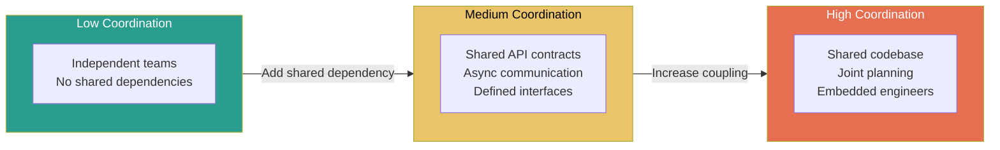
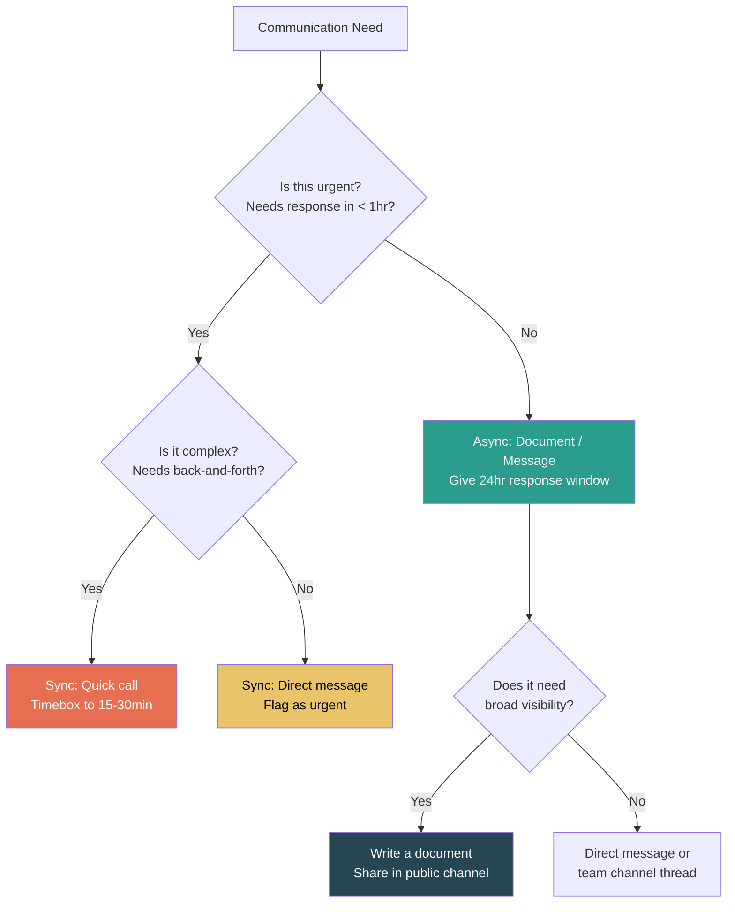
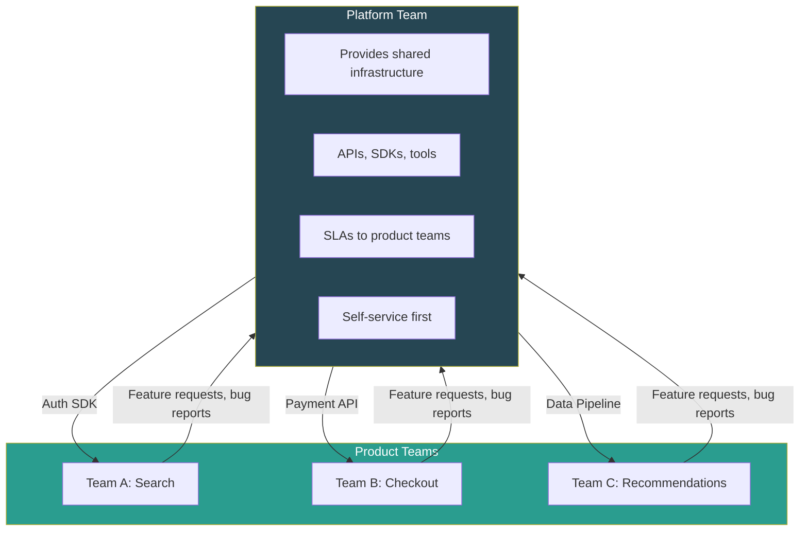
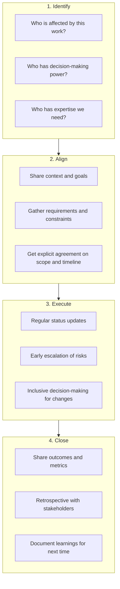

# Cross-Team Collaboration

## Why Cross-Team Collaboration Defines Senior Impact

At the senior level, your impact extends beyond your immediate team. The ability to work effectively across team boundaries — aligning on contracts, managing dependencies, and navigating organizational complexity — is what separates senior from staff-level engineers. Interviewers specifically probe for these skills because most high-impact work at scale requires coordination.

## Working Across Team Boundaries

### The Collaboration Spectrum

### Collaboration Anti-Patterns

| Anti-Pattern | Symptom | Fix |
|-------------|---------|-----|
| **Silo mentality** | "That's not our problem" | Shared OKRs, cross-team demos, rotating liaisons |
| **Over-the-wall handoffs** | Spec thrown over, no follow-up | Continuous collaboration, shared Slack channels, joint design reviews |
| **Meeting overload** | Every interaction requires a meeting | Default to async, use meetings for alignment only |
| **Invisible dependencies** | "We didn't know Team X was changing that API" | Dependency tracking, change notifications, API versioning |
| **Escalation culture** | Every disagreement goes to leadership | Empower ICs to resolve directly, escalate only after good-faith attempts |
| **Unclear ownership** | "I thought the other team was handling that" | RACI matrix, explicit ownership documents |

## Defining API Contracts

### Why API Contracts Matter for Cross-Team Work

When two teams share an integration boundary, the API contract is the agreement that lets them work independently. A well-defined contract enables parallel development; a poorly defined one creates constant blocking and rework.

### API Contract Checklist

- [ ] **Endpoint specification** — URL, method, request/response schema (OpenAPI/Protobuf)
- [ ] **Versioning strategy** — How do we evolve the API without breaking consumers?
- [ ] **Error handling** — Standard error codes, error message format, retry guidance
- [ ] **Authentication/Authorization** — How do services identify and authorize each other?
- [ ] **Rate limits and quotas** — What are the expected call volumes?
- [ ] **SLA** — Latency targets, uptime commitments, degradation behavior
- [ ] **Data ownership** — Who is the source of truth for each piece of data?
- [ ] **Change notification process** — How does the provider notify consumers of changes?
- [ ] **Testing approach** — Contract tests, integration test environments, mocks

### Contract-First vs Code-First Development

| Approach | Contract-First | Code-First |
|----------|---------------|------------|
| **Process** | Define the API spec first, then implement | Build the service, then document the API |
| **Pros** | Consumer and provider can work in parallel; clear expectations | Faster initial development; spec matches reality |
| **Cons** | Upfront investment; spec may not match implementation exactly | Consumers blocked until service is built; API may not suit consumers |
| **Best for** | Cross-team APIs, public APIs, high-coordination projects | Internal single-team services, prototypes |
| **Tooling** | OpenAPI, Protobuf, GraphQL schema, Pact | Swagger auto-gen, API docs from code |

### API Versioning Strategies

| Strategy | Description | Pros | Cons |
|----------|-------------|------|------|
| **URL versioning** (`/v1/users`) | Version in the URL path | Simple, explicit, easy to route | URL proliferation, hard to sunset |
| **Header versioning** (`Accept: application/vnd.api+json;v=2`) | Version in request header | Clean URLs, flexible | Less discoverable, harder to test |
| **Query param** (`?version=2`) | Version as parameter | Simple | Messy, optional parameter risks |
| **Additive changes only** | Never break, only add fields | No versioning needed | Accumulates cruft, constraining |

## Async Communication Patterns

### Why Async-First Matters at Scale

Synchronous communication (meetings, direct messages expecting immediate responses) doesn't scale. As you collaborate across 3-4 teams, the meeting overhead alone can consume 60%+ of your week. Async-first communication is a force multiplier.

### Sync vs Async Decision Matrix

### Async Communication Best Practices

| Practice | Description | Example |
|----------|-------------|---------|
| **Write proposals, not questions** | Come with a recommendation, not just a problem | "I propose we use Protobuf for the new API. Here's why... Do you see any issues?" |
| **Use structured updates** | Predictable format reduces cognitive load | Weekly status: Done / In Progress / Blocked / Next |
| **Set response expectations** | "Please review by Thursday" is better than "thoughts?" | "I'll proceed with Option A on Friday unless I hear concerns" |
| **Thread everything** | Keep conversations discoverable and contained | Thread in Slack, not top-level channel messages |
| **Summarize meetings** | Async record for people who couldn't attend | "Decisions: X. Action items: Y. Open questions: Z" |
| **Default to public channels** | Reduces information silos, enables search | Use DMs only for sensitive or personal topics |

## Platform vs Product Teams

### Organizational Models

### Platform Team vs Product Team Collaboration

| Dimension | Platform Team Perspective | Product Team Perspective |
|-----------|-------------------------|------------------------|
| **Success metric** | Adoption, developer satisfaction, reliability | Feature velocity, user metrics |
| **Customer** | Internal engineers | End users |
| **Priority conflicts** | "We need to support all teams fairly" | "Our feature is urgent, prioritize our request" |
| **Communication style** | Documentation, office hours, migration guides | Direct requests, feature asks, bug reports |
| **Common friction** | Product teams bypass platform, creating tech debt | Platform team is slow, blocking feature delivery |

### Making Platform-Product Collaboration Work

- **Self-service by default** — Platform teams should enable product teams to solve their own problems 90% of the time.
- **Office hours, not meetings** — Scheduled availability reduces interruptions while ensuring access.
- **Migration support** — Platform teams own the migration path, not just the new API.
- **Embedded engineers** — For high-coordination projects, temporarily embed a platform engineer with the product team.
- **Shared on-call** — When a platform issue causes a product outage, the platform team should be in the incident.

## Managing Dependencies

### Dependency Classification

| Type | Description | Risk Level | Mitigation |
|------|-------------|:----------:|------------|
| **Hard blocking** | Cannot proceed without the other team's output | High | Feature flags, mocking, early alignment |
| **Soft blocking** | Can proceed with workarounds but not ideal | Medium | Define interfaces early, parallel development |
| **Informational** | Need to know what the other team is doing, but not blocked | Low | Regular syncs, shared dashboards, public channels |
| **Time-based** | Need something by a specific date | High | Buffer time, escalation triggers, plan B |

### Dependency Management Checklist

- [ ] All cross-team dependencies are identified and documented
- [ ] Each dependency has a clear owner on both sides
- [ ] There is an agreed-upon timeline with buffer
- [ ] Interface contracts (APIs, schemas, data formats) are defined
- [ ] There is a communication channel for dependency updates
- [ ] Escalation path is defined for blockers
- [ ] Fallback plan exists if the dependency slips

## Stakeholder Management

### The RACI Matrix

For any cross-team initiative, clarify roles:

| Role | Definition | Examples |
|------|-----------|---------|
| **Responsible** | Does the work | The engineer implementing the feature |
| **Accountable** | Owns the outcome, final decision-maker | Tech lead, engineering manager |
| **Consulted** | Provides input before the work is done | Architects, security team, UX designers |
| **Informed** | Notified after the work is done | Leadership, adjacent teams, support teams |

### Stakeholder Communication Framework

### Navigating Stakeholder Conflicts

| Conflict Type | Example | Resolution Approach |
|---------------|---------|-------------------|
| **Priority conflict** | Team A wants Feature X, Team B wants Feature Y, both need your work | Quantify impact of each, propose sequencing, escalate with data if needed |
| **Technical disagreement** | Teams disagree on API design | Facilitate joint design review, use data (benchmarks, prototypes), escalate to architect |
| **Timeline conflict** | Stakeholder wants it sooner than feasible | Show trade-offs: scope, quality, timeline — pick two. Offer phased delivery |
| **Scope conflict** | Different stakeholders want different scope | Align on shared goals first, then negotiate scope against those goals |

## Interview Q&A

> **Q: Tell me about a time you worked across teams to deliver a project.**
>
> **Framework**: (1) Set the scene: how many teams, what was the goal, what made it cross-team? (2) Describe your role: were you the coordinator, the tech lead, or an IC contributor? (3) Key challenges: dependency management, conflicting priorities, communication gaps. (4) What you did: defined contracts, set up communication channels, facilitated alignment. (5) Outcome: quantify the result and highlight what made cross-team collaboration successful.

> **Q: How do you handle conflicting priorities between your team and another team?**
>
> **Framework**: (1) Start by understanding their priorities — "I scheduled a 1:1 with their tech lead to understand their constraints." (2) Find the shared goal — "We both wanted to improve user experience; we just disagreed on sequencing." (3) Use data — "I showed that doing X first would unblock both teams, while doing Y first would only help one." (4) Escalate with a recommendation, not just the problem. (5) Use disagree-and-commit if needed.

> **Q: How do you define API contracts between services owned by different teams?**
>
> **Framework**: (1) Contract-first approach: define the schema before implementation. (2) Collaborative design: both consumer and provider review the spec. (3) Versioning strategy agreed upfront. (4) Contract testing: automated tests that verify both sides conform. (5) Change management: clear process for evolving the contract.

> **Q: Describe a situation where a cross-team dependency became a blocker. How did you handle it?**
>
> **Framework**: (1) Describe the dependency and why it was blocking. (2) Show that you tried to resolve it directly first. (3) If direct resolution failed, escalate with data: "Here's the impact of the delay — $X in lost revenue / Y days of slip." (4) Propose alternatives: mocking, workarounds, re-scoping. (5) Prevent recurrence: "I set up a dependency tracking process for future projects."

> **Q: How do you communicate effectively with non-technical stakeholders?**
>
> **Framework**: (1) Translate technical concepts into business impact: "This will reduce page load time from 3s to 1s, which our data shows increases conversion by 15%." (2) Use analogies and visuals, not jargon. (3) Focus on outcomes, not implementation details. (4) Anticipate their questions: timeline, cost, risk. (5) Provide options, not mandates: "We have three options, each with different trade-offs."

> **Q: How do you build trust with teams you haven't worked with before?**
>
> **Framework**: (1) Start by understanding their world: "I spent the first week reading their docs and attending their standups." (2) Deliver small wins early to build credibility. (3) Be transparent about your constraints and timelines. (4) Follow through on commitments — reliability builds trust. (5) Share credit generously — "Their team's API made this possible."

## Key Takeaways

1. **Default to async, escalate to sync** — Meetings should resolve alignment gaps, not transmit information.
2. **Define contracts before implementation** — The interface agreement is what enables parallel work.
3. **Own the dependency, don't just report it** — Identifying a blocker is not enough; propose a solution or workaround.
4. **Build trust through reliability** — Follow through on commitments, especially small ones.
5. **Navigate org structure, don't fight it** — Understand incentives, use shared goals, escalate with data.
6. **Make communication structured and public** — Thread in public channels, summarize meetings, write proposals.
