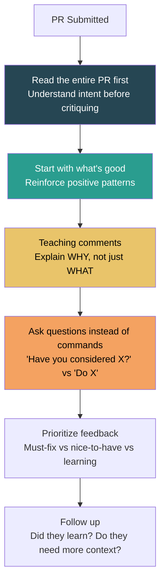
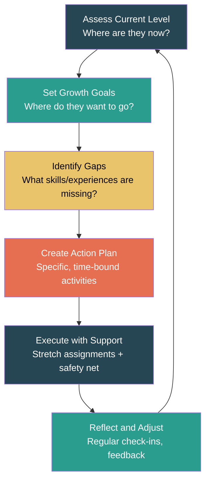

# Mentorship & Culture

## Why Mentorship Is a Senior-Level Responsibility

At the senior level, your impact is measured not just by what you build, but by how much you multiply the people around you. Growing engineers, creating a learning culture, and building effective onboarding systems are force multipliers that interviewers specifically look for. A senior engineer who ships great code but doesn't uplift their team is operating below their expected level.

## The Mentorship Spectrum

```mermaid
flowchart LR
    subgraph Informal["Informal Mentorship"]
        I1[Ad hoc advice]
        I2[Hallway conversations]
        I3[Slack questions]
    end

    subgraph Structured["Structured Mentorship"]
        S1[Regular 1:1s]
        S2[Goal setting]
        S3[Career planning]
        S4[Progress tracking]
    end

    subgraph Systemic["Systemic Culture"]
        C1[Code review as teaching]
        C2[Onboarding programs]
        C3[Knowledge sharing sessions]
        C4[Pair programming norms]
        C5[Documentation culture]
    end

    Informal -->|Formalize| Structured
    Structured -->|Scale| Systemic

    style Informal fill:#b7e4c7,color:#000
    style Structured fill:#40916c,color:#fff
    style Systemic fill:#1b4332,color:#fff
```

## Mentorship Models

| Model | Description | Best For | Time Investment |
|-------|-------------|----------|:--------------:|
| **1:1 Mentorship** | Dedicated mentor-mentee relationship, regular meetings | Career development, deep skill growth | 1-2 hrs/week |
| **Code Review Mentorship** | Teaching through PR feedback | Technical skills, team standards | Embedded in workflow |
| **Pair Programming** | Real-time collaborative problem solving | Complex problems, knowledge transfer, onboarding | 2-4 hrs/session |
| **Group Learning** | Tech talks, reading groups, study circles | Broad skill development, team bonding | 1 hr/week |
| **Shadowing** | Mentee observes mentor in meetings, incidents, design | Leadership skills, organizational awareness | Varies |
| **Reverse Mentorship** | Junior teaches senior (new tech, fresh perspective) | Innovation, staying current, building trust | 30 min/week |

## Code Review as Mentorship

### The Teaching Code Review

Most code reviews are transactional: "LGTM" or "Fix this bug." A teaching code review is transformational — it helps the author grow.

### Code Review Mentorship Framework

### Code Review Comment Levels

| Level | Prefix | Purpose | Example |
|-------|--------|---------|---------|
| **Blocking** | `[must-fix]` | Correctness, security, or design issue | "This SQL query is vulnerable to injection. Here's the safe pattern..." |
| **Suggestion** | `[suggestion]` | Better approach, not strictly wrong | "Consider using a map here instead of nested loops — it's O(n) vs O(n^2)" |
| **Teaching** | `[learning]` | Educational context, no change required | "FYI, this pattern is called the Strategy pattern. It's useful when..." |
| **Nit** | `[nit]` | Style/formatting, lowest priority | "Minor: convention is camelCase for this codebase" |
| **Question** | `[question]` | Genuine question to understand reasoning | "What's the expected behavior if this list is empty?" |

### Code Review Anti-Patterns

| Anti-Pattern | Impact | Better Approach |
|-------------|--------|----------------|
| **"LGTM" with no comments** | Missed learning opportunity, may miss bugs | Always add at least one substantive comment |
| **Bikeshedding** | Demoralizes author, wastes time | Focus on architecture and correctness, not naming |
| **Drive-by nitpicking** | Makes the author feel attacked | Balance positive and constructive comments |
| **Rewriting the PR** | Author doesn't learn, feels undermined | Guide toward the solution, don't hand it to them |
| **Delayed reviews** | Blocks the author, breaks flow | Review within 4 hours or set clear expectations |
| **Reviewing only your way** | Shuts down diverse approaches | Ask "why did you choose this?" before suggesting changes |

## Effective Onboarding Programs

### The 30-60-90 Day Onboarding Framework

| Phase | Timeline | Goals | Activities | Success Metrics |
|-------|----------|-------|-----------|----------------|
| **Absorb** | Days 1-30 | Learn the codebase, tools, team norms | Read docs, shadow, small PRs, meet stakeholders | Can navigate the codebase, understands team rituals |
| **Contribute** | Days 31-60 | Deliver independently on well-scoped tasks | Feature work, bug fixes, on-call shadowing | Ships features with normal review cycle |
| **Own** | Days 61-90 | Take ownership of a system or domain | Lead a small project, mentor newer members | Independently drives work, contributes to design decisions |

### Onboarding Checklist for Senior Engineers Creating Programs

- [ ] **Pre-day-1 setup**: Laptop, accounts, repos, Slack channels, calendar invites
- [ ] **Buddy assignment**: A peer (not manager) for day-to-day questions
- [ ] **First-week PR**: A real (small) contribution to ship in week 1
- [ ] **Architecture walkthrough**: Recorded session on system design
- [ ] **Stakeholder intros**: Scheduled 1:1s with key collaborators
- [ ] **Runbook walkthrough**: How to deploy, rollback, and respond to incidents
- [ ] **First on-call shadow**: Pair on the on-call rotation before going solo
- [ ] **30-day check-in**: Structured feedback session
- [ ] **60-day check-in**: Adjust scope and expectations based on progress
- [ ] **90-day retrospective**: What worked? What should change for the next hire?

### Onboarding Anti-Patterns

| Anti-Pattern | What It Looks Like | Fix |
|-------------|-------------------|-----|
| **Sink or swim** | "Here's the repo, good luck" | Structured plan with milestones |
| **Meeting marathon** | 20 meetings in week 1, no coding | Spread intros over 3 weeks, code on day 2 |
| **Outdated docs** | "Don't follow the README, it's wrong" | Fix docs as part of onboarding (new hire's fresh eyes are valuable) |
| **No buddy** | "Ask anyone if you have questions" | Assign a specific buddy, protect their time |
| **Delayed access** | "Your AWS credentials will take 2 weeks" | Automate provisioning, have a checklist |

## Growing Junior Engineers

### The Growth Conversation Framework

### Stretch Assignment Guidelines

| Principle | Description | Example |
|-----------|-------------|---------|
| **Challenging but achievable** | Just beyond current comfort zone | Junior debugging a production issue with senior backup |
| **Safe to fail** | Consequences of mistakes are manageable | Working on internal tooling before customer-facing code |
| **Clear success criteria** | Mentee knows what "done" looks like | "Implement the caching layer; here are the perf targets" |
| **Support available** | Mentor is accessible, not hovering | "I'll check in daily, but you drive the work" |
| **Feedback loop** | Debrief after completion | "What was harder than expected? What would you do differently?" |

### Delegation vs Abdication

| Delegation (Good) | Abdication (Bad) |
|-------------------|-----------------|
| "Here's the context, constraints, and expected outcome" | "Just handle it" |
| "Check in with me at these milestones" | "Let me know when it's done" |
| "Here are the decisions I need to be consulted on" | "You decide everything" |
| "If you get stuck, here's how to unblock yourself; if that fails, come to me" | "Figure it out" |
| "I'm accountable for the outcome; you're responsible for the execution" | "It's your problem now" |

## Pair Programming Practices

### When to Pair Program

| Great for Pairing | Not Great for Pairing |
|-------------------|----------------------|
| Complex, ambiguous problems | Routine CRUD operations |
| Knowledge transfer (new codebase, new technology) | Well-understood tasks the assignee can do alone |
| Onboarding new team members | Work requiring deep solo focus (algorithmic optimization) |
| Debugging tricky production issues | Simple bug fixes |
| Design and architecture exploration | Documentation writing |

### Pair Programming Styles

| Style | Description | When to Use |
|-------|-------------|------------|
| **Driver-Navigator** | One types, one directs strategy | Default — good balance of engagement |
| **Ping-Pong** | Alternate writing tests and implementation | TDD-focused work, keeps both engaged |
| **Mob Programming** | Entire team works on one problem together | Architecture decisions, critical bugs, learning sessions |
| **Expert-Novice** | Senior drives initially, gradually hands off | Onboarding, teaching a new technology |

## Knowledge Sharing

### Knowledge Sharing Formats

| Format | Frequency | Audience | Effort | Value |
|--------|-----------|----------|:------:|:-----:|
| **Tech talks** | Monthly | Team/org | Medium | High |
| **Lunch & learn** | Bi-weekly | Team | Low | Medium |
| **Architecture decision docs** | Per decision | Team/org | Medium | Very High |
| **Runbooks and playbooks** | Per system | On-call engineers | Medium | Very High |
| **Internal blog posts** | Ad hoc | Org | Medium | High |
| **Recorded walkthroughs** | Per system/feature | Team | Low | High |
| **README and inline docs** | Continuous | All engineers | Low | High |

### Creating a Learning Culture — Senior Engineer Actions

- **Model vulnerability**: "I don't know how this works. Let me figure it out publicly."
- **Celebrate questions**: "Great question — I bet others are wondering the same thing."
- **Share failures**: "Here's a postmortem of a mistake I made and what I learned."
- **Make time for learning**: Advocate for 10-20% time for exploration, reading, and experimentation.
- **Write things down**: When you explain something verbally, follow up with a written version.

## Interview Q&A

> **Q: How do you mentor junior engineers?**
>
> **Framework**: (1) Start by understanding their goals — "I have a 1:1 where we discuss where they want to be in 6-12 months." (2) Create stretch assignments calibrated to their level. (3) Use code reviews as teaching moments — explain the "why," not just the "what." (4) Give specific, actionable feedback — "Your error handling improved; next, focus on logging context." (5) Track progress and celebrate growth. Key: specific examples beat abstract answers.

> **Q: How do you handle a code review where the approach is fundamentally wrong?**
>
> **Framework**: (1) Don't comment "rewrite this." Instead, schedule a quick sync. (2) Understand their reasoning first — "Walk me through your approach." (3) Share the alternative with reasoning — "Here's another approach. The reason I'd consider it is..." (4) If the author's approach is valid but different from yours, accept it — there are many right answers. (5) For fundamental design issues, pair on the solution rather than dictating it.

> **Q: Tell me about a time you helped someone on your team grow significantly.**
>
> **Framework**: (1) Describe the person's starting point — be specific about skills, not vague. (2) Explain your approach — what did you do that was tailored to this person? (3) Describe the stretch assignment or growth opportunity you created. (4) Show the outcome — promotion, increased scope, independence, confidence. (5) What you learned about mentorship from this experience.

> **Q: How do you create an effective onboarding experience?**
>
> **Framework**: (1) 30-60-90 day plan with clear milestones. (2) Ship a real PR in week 1 to build confidence and momentum. (3) Assign a buddy for low-friction questions. (4) Record architecture walkthroughs so they're rewatchable. (5) Use the new hire's fresh eyes: "Update anything in the docs that's wrong or confusing." (6) Check-ins at 30 and 60 days to adjust.

> **Q: How do you balance mentoring others with your own delivery responsibilities?**
>
> **Framework**: (1) Recognize that mentorship IS delivery at the senior level — growing the team's capability is part of your job. (2) Embed mentorship in existing workflows: code reviews, pair programming, design discussions. (3) Time-box dedicated mentorship: 1:1s are 30 min/week, not open-ended. (4) Delegate more to create space — invest in teaching now to save time later. (5) Make mentorship visible in your work log so leadership knows.

> **Q: How do you share knowledge effectively across a team?**
>
> **Framework**: (1) Write it down — verbal knowledge transfer evaporates. (2) Multiple formats: docs for reference, talks for engagement, pair sessions for deep transfer. (3) Create a culture where sharing is normal, not heroic: "Every PR should include a learning comment." (4) Reduce the friction of sharing: templates for tech talks, easy-to-edit wikis, recorded demos. (5) Incentivize: recognize people who teach, not just people who build.

## Mentorship Impact Metrics

How to quantify your mentorship impact for interviews:

| Metric | How to Measure | Example |
|--------|---------------|---------|
| **Mentee promotions** | Number of people you mentored who got promoted | "3 of 5 engineers I mentored were promoted within 18 months" |
| **Ramp-up time** | Time for new hires to make their first meaningful contribution | "Reduced average onboarding time from 6 weeks to 3 weeks" |
| **Code review turnaround** | Speed and quality of reviews | "Introduced review guidelines that reduced PR cycle time by 40%" |
| **Bus factor improvement** | How many people can handle critical systems | "Grew the team's on-call capability from 2 to 6 engineers" |
| **Knowledge sharing frequency** | Regular tech talks, docs written, sessions held | "Established bi-weekly tech talks with 85% attendance" |

## Key Takeaways

1. **Mentorship is a senior-level responsibility, not a nice-to-have** — Your impact multiplies through others.
2. **Code review is the most scalable mentorship tool** — Every PR is a teaching opportunity.
3. **Onboarding is a system, not an event** — Invest upfront, measure outcomes, iterate.
4. **Stretch assignments with a safety net accelerate growth** — Challenge without abandonment.
5. **Create culture, not dependency** — The goal is a team that learns continuously, not a team that depends on you.
6. **Document everything** — Written knowledge outlives verbal knowledge.
