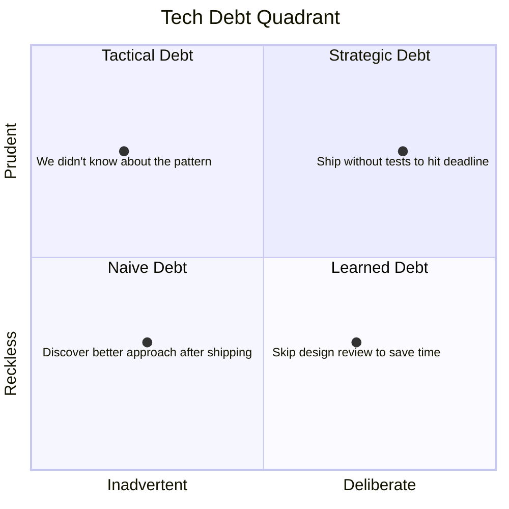
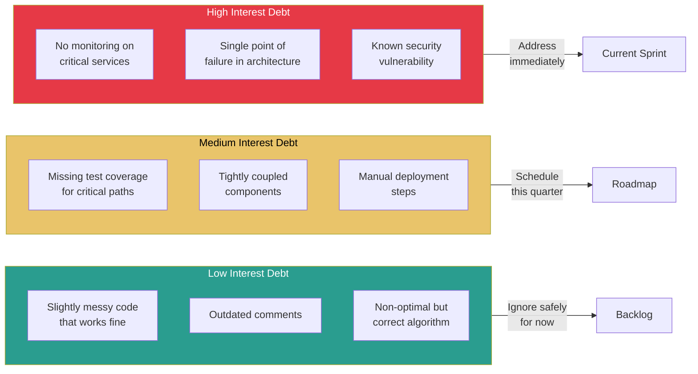
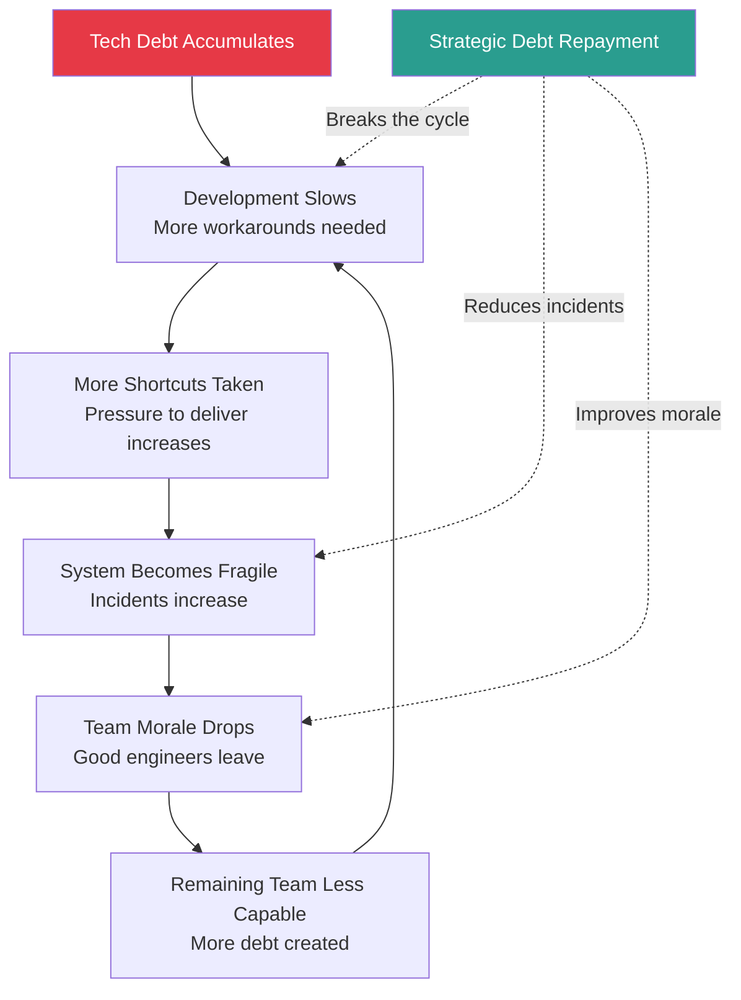

# Managing Tech Debt

## What Is Tech Debt?

Tech debt is the implied cost of future rework caused by choosing an expedient solution now instead of a better approach that would take longer. Like financial debt, tech debt is not inherently bad — it's a tool. The problem is unmanaged, invisible, or compounding debt.

## Types of Tech Debt — The Quadrant Model

Martin Fowler's tech debt quadrant classifies debt along two axes: deliberate vs inadvertent, and reckless vs prudent.

### Quadrant Breakdown

| Type | Deliberate? | Reckless? | Example | Response |
|------|:-----------:|:---------:|---------|----------|
| **Strategic Debt** (Deliberate + Prudent) | Yes | No | "We'll ship with a simple cache and replace it with Redis when we hit 10K users" | Track it, schedule repayment, document the trigger |
| **Tactical Debt** (Deliberate + Reckless) | Yes | Yes | "We don't have time for tests, just ship it" | Dangerous — high interest rate, creates fragility |
| **Naive Debt** (Inadvertent + Reckless) | No | Yes | "What's a design pattern?" — debt from lack of skill | Address through mentorship, code review, training |
| **Learned Debt** (Inadvertent + Prudent) | No | No | "Now that we've built it, we see a better approach" | Natural — plan incremental improvement |

## Common Categories of Tech Debt

| Category | Examples | Symptoms | Severity |
|----------|---------|----------|:--------:|
| **Code-level** | Duplicated logic, god classes, poor naming, missing abstractions | Hard to understand, slow to modify | Medium |
| **Architecture** | Monolith that should be decomposed, wrong database choice, missing service boundaries | Can't scale, can't deploy independently | High |
| **Test** | Missing tests, flaky tests, slow test suite, no integration tests | Fear of changes, frequent regressions | High |
| **Infrastructure** | Manual deployments, no IaC, outdated dependencies, EOL software | Security risk, operational burden | High |
| **Documentation** | Outdated READMEs, missing runbooks, no architecture diagrams | Slow onboarding, repeated questions | Medium |
| **Process** | No CI/CD, manual code reviews, no incident process | Slow delivery, inconsistent quality | Medium |
| **Data** | Schema inconsistencies, orphaned tables, no data dictionary, migration debt | Data integrity issues, reporting errors | High |
| **Dependency** | Outdated libraries, pinned versions, deprecated APIs | Security vulnerabilities, incompatibility | Medium-High |

## Quantifying Tech Debt

### Why Quantify?

Engineers say "we have too much tech debt." Leadership hears "we want to gold-plate." Quantification bridges this gap by translating tech debt into business impact.

### Quantification Methods

| Method | What It Measures | How to Calculate | Credibility |
|--------|-----------------|-----------------|:-----------:|
| **Developer velocity impact** | Time lost to debt-related friction | Track hours spent on workarounds, debugging debt-caused issues | High |
| **Incident correlation** | Outages caused by known debt | Map incidents to known debt items in the register | Very High |
| **Change failure rate** | Deployments that cause issues in debt-heavy areas | (Failed deploys in area X) / (Total deploys in area X) | High |
| **Time-to-onboard** | How long new engineers take to become productive | Compare onboarding time across well-maintained vs debt-heavy areas | Medium |
| **Code churn** | Files that change frequently and are hard to change | Analyze git history for high-churn, high-complexity files | Medium |
| **Dependency risk score** | Exposure to outdated/vulnerable dependencies | Count outdated deps, known CVEs, EOL software | High |

### The Tech Debt Interest Rate

Think of tech debt like financial debt with an interest rate:

## Tech Debt Register

A tech debt register is a living document that tracks known debt, its impact, and repayment plan.

### Register Template

| ID | Title | Category | Quadrant | Interest Rate | Business Impact | Estimated Effort | Owner | Status | Created | Target Resolution |
|----|-------|----------|----------|:-------------:|----------------|:----------------:|-------|--------|---------|-------------------|
| TD-001 | Auth service has no integration tests | Test | Strategic | High | 2 incidents/quarter traced to auth changes | 2 weeks | @alice | Planned Q2 | 2025-01 | 2025-06 |
| TD-002 | Monolithic deploy pipeline | Infrastructure | Learned | Medium | 45-min deploys block all teams | 6 weeks | @bob | In Progress | 2024-09 | 2025-03 |
| TD-003 | Duplicated user validation logic | Code | Naive | Low | Occasional inconsistencies | 3 days | Unassigned | Backlog | 2025-02 | TBD |

### Register Maintenance

- **Review frequency**: Monthly or per sprint
- **Additions**: Any engineer can add; requires category and impact assessment
- **Prioritization**: Quarterly ranking based on interest rate and business impact
- **Closure**: Mark resolved with PR link and outcome notes
- **Metrics**: Track total items, items resolved per quarter, average age

## Making the Business Case for Tech Debt Repayment

### Framing for Different Audiences

| Audience | What They Care About | How to Frame Tech Debt |
|----------|---------------------|----------------------|
| **Engineering Manager** | Team velocity, retention, quality | "We're spending 30% of sprint capacity on workarounds. Fixing X would reclaim 20% capacity." |
| **Product Manager** | Feature delivery speed, reliability | "This tech debt caused 3 outages last quarter. Each outage cost us 4 hours of engineering time and $X in lost transactions." |
| **VP/Director** | Quarterly goals, team headcount, risk | "At current tech debt growth rate, we'll need 2 additional engineers just to maintain current velocity. Investing 6 weeks now saves $200K/year." |
| **CTO/VP Eng** | Strategic capability, competitive position | "This architectural debt blocks our ability to enter the European market (GDPR compliance requires data isolation we can't do today)." |

### The Compounding Cost Argument

## Balancing Features vs Tech Debt

### Allocation Strategies

| Strategy | Description | Pros | Cons |
|----------|-------------|------|------|
| **Fixed percentage** (e.g., 20% of sprint) | Reserve a consistent portion of capacity | Predictable, sustainable | May not be enough for large debt items |
| **Dedicated sprint** (e.g., 1 in 5 sprints) | Entire sprint focused on debt | Can tackle large items, satisfying for engineers | Feature delivery pauses, stakeholder pushback |
| **Boy Scout rule** ("leave it better than you found it") | Improve debt incrementally alongside feature work | No dedicated time needed, continuous improvement | Only works for small, localized debt |
| **Debt-feature coupling** | Pair debt repayment with related feature work | Easy to justify, natural sequencing | Only addresses debt near current feature work |
| **Quarterly debt budget** | Allocate a fixed budget per quarter for debt | Strategic selection, leadership visibility | Requires quarterly planning overhead |

### Recommended Approach: Tiered Allocation

1. **Always-on (Boy Scout)**: Every PR should improve the area it touches. No dedicated planning needed.
2. **Sprint allocation (15-20%)**: Reserve capacity each sprint for medium-priority debt. Engineers choose from the register.
3. **Quarterly strategic investment**: 1-2 large debt items per quarter, planned and staffed like feature projects.

## Refactoring Strategies

### Safe Refactoring Approaches

| Strategy | Description | Risk | When to Use |
|----------|-------------|:----:|-------------|
| **Strangler Fig** | Build new system alongside old, gradually migrate traffic | Low | Replacing large monolithic components |
| **Branch by Abstraction** | Introduce abstraction layer, swap implementation behind it | Low | Replacing a dependency or internal library |
| **Feature Flag Rollout** | Refactored code behind feature flag, gradual rollout | Low | Any refactoring where behavior might change |
| **Parallel Run** | Run old and new code simultaneously, compare outputs | Very Low | Critical path refactoring (payments, auth) |
| **Incremental Migration** | Migrate one entity/endpoint/table at a time | Low-Medium | Database migrations, API versioning |
| **Big Bang Rewrite** | Replace everything at once | Very High | Almost never — avoid this |

### Refactoring Decision Checklist

- [ ] Is the refactoring scoped clearly? (Not "clean up the codebase")
- [ ] Do we have adequate test coverage BEFORE refactoring?
- [ ] Can we do this incrementally, or does it require a single large change?
- [ ] Is there a rollback strategy?
- [ ] Have we communicated the plan to affected teams?
- [ ] Do we have metrics to validate the refactoring succeeded?
- [ ] Is this the right time? (Not during a critical release period)

## Interview Q&A

> **Q: How do you handle tech debt on your team?**
>
> **Framework**: (1) Classify debt — not all debt is equal; use the quadrant model. (2) Quantify impact — "This debt causes X incidents/quarter and costs Y hours/sprint in workarounds." (3) Maintain a tech debt register — visible, prioritized, reviewed regularly. (4) Allocate capacity — "We reserve 20% of sprint capacity for debt repayment." (5) Track progress — "We resolved 12 items last quarter, reducing incident rate by 40%."

> **Q: How do you convince leadership to invest in tech debt reduction?**
>
> **Framework**: (1) Translate to business language: velocity, incidents, cost, risk — not "the code is messy." (2) Show the compounding cost: "If we don't fix this now, it will cost 3x more in 6 months." (3) Tie to business goals: "This debt blocks our ability to ship Feature Y on time." (4) Propose a specific plan with estimated ROI, not a vague request. (5) Start small: deliver a quick win, measure the improvement, use it to justify larger investment.

> **Q: Tell me about a time you successfully reduced tech debt.**
>
> **Framework**: (1) Describe the debt: what it was, how it accumulated, what impact it had. (2) How you quantified it: incidents, velocity impact, engineer hours wasted. (3) Your approach: strangler fig, incremental migration, sprint allocation. (4) How you got buy-in from leadership and the team. (5) The outcome: quantified improvement in velocity, reliability, or developer experience.

> **Q: When is it okay to take on tech debt deliberately?**
>
> **Framework**: (1) When the business context justifies it: time-sensitive opportunity, MVP validation, competitive pressure. (2) When the debt is strategic and prudent: "We know this won't scale past 10K users, but we won't hit 10K for 6 months." (3) When you document it: decision record, trigger for repayment, estimated cost. (4) When you plan repayment: "We'll address this in Q3 after launch." (5) Key: deliberate, documented, and planned debt is a tool; accidental, invisible debt is a trap.

> **Q: How do you prioritize which tech debt to address first?**
>
> **Framework**: (1) Interest rate: address high-interest debt first — it compounds fastest. (2) Business alignment: debt that blocks current business goals gets priority. (3) Blast radius: debt affecting many engineers or many services. (4) Effort-impact ratio: quick wins first to build momentum and credibility. (5) Risk: security and compliance debt is non-negotiable. Use the tech debt register to make this visible and data-driven.

> **Q: How do you prevent tech debt from accumulating in the first place?**
>
> **Framework**: (1) Code review standards — catch debt before it merges. (2) Definition of done includes tests, docs, and monitoring. (3) Architecture reviews for significant changes. (4) Boy Scout rule — every PR leaves the codebase better. (5) Retrospectives that identify process causes of debt. (6) Accept that some debt is inevitable — the goal is managed debt, not zero debt.

## Key Takeaways

1. **Tech debt is a tool, not a failure** — Strategic debt with a repayment plan is good engineering.
2. **Quantify or it doesn't exist** — Leadership can't prioritize what they can't see or measure.
3. **Maintain a register** — Track debt like you track features: with ownership, priority, and deadlines.
4. **Use safe refactoring patterns** — Strangler fig and feature flags beat big-bang rewrites every time.
5. **Balance continuously** — 20% allocation is better than alternating between "no debt work" and "debt sprints."
6. **Prevention > cure** — Code review standards, definition of done, and architecture reviews prevent the most costly debt.
