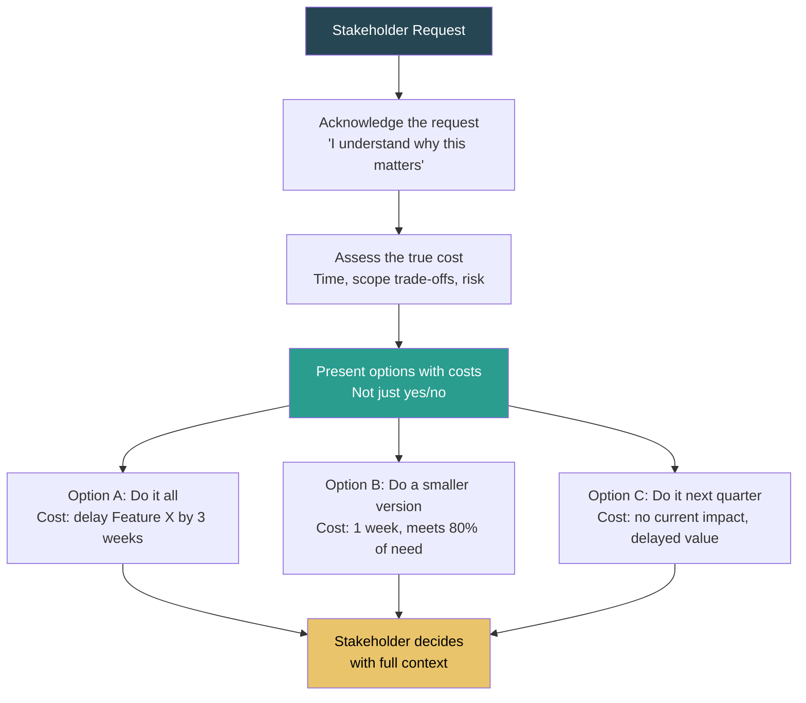
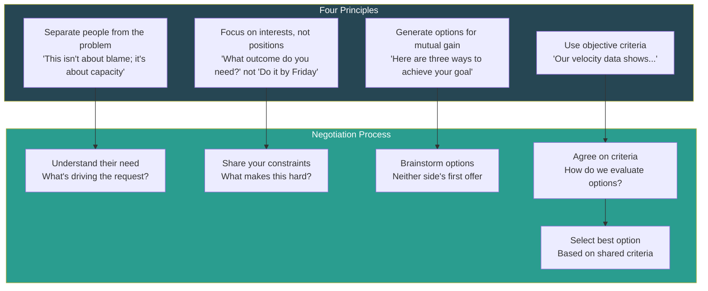
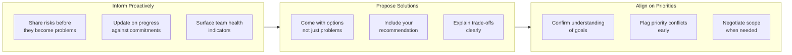

# Saying No with Data

## Why "Saying No" Is a Senior-Level Skill

Junior engineers say yes to everything. Mid-level engineers say no when they're overloaded. Senior engineers say "yes, and here's the cost" — they protect team capacity, manage expectations, and negotiate scope using data. This is one of the most tested behavioral skills because it directly reveals your ability to manage up, handle ambiguity, and make trade-offs visible.

## The "Yes, And Here's The Cost" Technique

The core principle: never say a naked "no." Instead, show what saying "yes" would cost, and let the stakeholder make an informed decision.

### The Pattern



### Example Conversations

| Scenario | Bad Response | Good Response |
|----------|-------------|--------------|
| "Can we add this feature by Friday?" | "No, that's impossible." | "We can ship a basic version by Friday that covers the top use case. The full feature would take 2 more weeks. Which would you prefer?" |
| "Can your team take on Project X?" | "We're too busy." | "We can take on Project X. Here's what we'd need to deprioritize: [list]. Alternatively, we could start in 3 weeks when Feature Y ships. Which trade-off works best?" |
| "We need to support 10x traffic by next month." | "That's not feasible." | "We can handle 3x with current architecture in 2 weeks. Getting to 10x requires a redesign estimated at 8 weeks. I recommend we do the 3x fix now and plan 10x for Q2. Here's the risk profile of each approach." |
| "Can we skip testing to ship faster?" | "No, we need tests." | "We can skip full regression and ship 2 days earlier. Here's the risk: based on our last 5 releases, skipping regression resulted in 2 P1 bugs. The cost of fixing those was 3 days. Net: we'd likely lose 1 day by skipping." |

## Quantifying Impact of Scope

### The Scope Impact Framework

Every request has a cost across multiple dimensions. Quantify at least three:

| Dimension | How to Quantify | Example |
|-----------|----------------|---------|
| **Time** | Engineering days/weeks to implement | "This feature requires 15 engineering days" |
| **Opportunity cost** | What we won't build if we do this | "Building X means Feature Y slips from Q1 to Q2" |
| **Risk** | Probability and impact of failure modes | "Rushing this has a 30% chance of causing a regression based on our history" |
| **Quality** | Impact on code health, test coverage, documentation | "Shipping without tests adds ~5 days of debt that compounds monthly" |
| **Team load** | Impact on engineer wellbeing and sustainability | "The team has been at 110% for 3 sprints. Adding scope increases burnout risk" |
| **Dependencies** | Other teams or systems affected | "This requires changes from the Platform team, which has a 3-week lead time" |

### Scope Quantification Template

```
## Scope Impact Assessment: [Request Name]

### Request
[What is being asked?]

### Cost Analysis
| Dimension         | Impact                                  | Confidence |
|-------------------|-----------------------------------------|:----------:|
| Engineering effort | X days/weeks                            | High       |
| Timeline impact   | Delays [Feature Y] by Z weeks           | Medium     |
| Opportunity cost  | Cannot do [Feature Z] this quarter      | High       |
| Risk              | [Specific risk] with [probability]      | Medium     |
| Team load         | Currently at X% capacity, this adds Y%  | High       |

### Options
| Option | Scope | Timeline | Trade-off |
|--------|-------|----------|-----------|
| A      |       |          |           |
| B      |       |          |           |
| C      |       |          |           |

### Recommendation
[Your recommended option and why]
```

## Negotiation Frameworks

### The Interest-Based Negotiation (Principled Negotiation)

Based on "Getting to Yes" by Fisher and Ury, adapted for engineering context:



### Negotiation Tactics for Engineers

| Tactic | Description | Example |
|--------|-------------|---------|
| **Anchor with data** | Lead with facts, not feelings | "Our average feature takes 3 weeks from design to ship. This is a 3-week feature." |
| **Expand the pie** | Look for solutions beyond the binary | "What if we ship the API this sprint and the UI next sprint?" |
| **BATNA** (Best Alternative To Negotiated Agreement) | Know your fallback position | "If we can't get 2 more weeks, the minimum viable version is X." |
| **Contingent agreement** | "If X, then Y" | "If traffic stays under 5K QPS, the simple solution is fine. If it exceeds 5K, we'll need the robust solution." |
| **Defer to process** | Use existing frameworks | "Let's run this through our prioritization framework and see where it ranks." |
| **Ask questions** | Understand before proposing | "What would happen if we shipped this 2 weeks later? What's the business impact?" |

### Negotiation Anti-Patterns

| Anti-Pattern | Why It Fails | Better Approach |
|-------------|-------------|----------------|
| **Saying yes to avoid conflict** | Creates unrealistic expectations, leads to burnout | Present trade-offs respectfully but honestly |
| **Sandbagging estimates** | Erodes trust when discovered | Give honest estimates with confidence ranges |
| **Threatening** ("We'll all burn out") | Damages relationship, invites dismissal | Quantify: "We've had 3 unplanned leaves in 2 months; team health is at risk" |
| **Passive resistance** | Agreeing then not delivering | Push back openly at decision time, not silently at execution time |
| **The martyr** ("Fine, we'll just work weekends") | Enables bad behavior, unsustainable | "We can do this by working weekends. That's not sustainable. Here's a sustainable alternative." |

## Managing Up

### What "Managing Up" Means

Managing up is not manipulation. It's proactively giving your manager the information and context they need to make good decisions, rather than waiting for them to ask.

### Managing Up Framework



### Managing Up Checklist

- [ ] My manager knows our top 3 risks before they become surprises
- [ ] I present problems with proposed solutions, not just the problem
- [ ] I flag scope/timeline issues as soon as I see them, not at the deadline
- [ ] I understand my manager's priorities and constraints (not just my own)
- [ ] I communicate in my manager's preferred format (async doc, Slack, 1:1)
- [ ] I'm clear about what I need from my manager (decision, air cover, resources)
- [ ] I escalate with data and a recommendation, not just frustration

### The Escalation Framework

| Level | When to Use | How to Do It |
|-------|-------------|-------------|
| **Direct resolution** | First attempt for any conflict | "Can we sync on this? I think there's a misalignment." |
| **Facilitate resolution** | Direct conversation didn't work | Bring both parties together, mediate with data |
| **Escalate to manager** | Direct and facilitated resolution failed | "I've tried to resolve this directly. Here's the situation, options, and my recommendation. I need your help." |
| **Escalate to skip-level** | Manager is the problem, or the issue spans managers | Rare; have the conversation with your manager first unless there's a trust issue |

## Stakeholder Expectation Setting

### The Expectation Setting Cadence

| Timing | Action | Example |
|--------|--------|---------|
| **At project start** | Set initial expectations with ranges | "This will take 4-6 weeks. I'll refine after the design spike." |
| **After design** | Refine estimate with detail | "Based on the design, this is 5 weeks. Here's the breakdown." |
| **Weekly** | Progress update against commitment | "We're on track. Completed X, starting Y. One risk: Z." |
| **When risk materializes** | Immediate update with options | "The dependency from Team B is delayed. Here are our options." |
| **At delivery** | Confirm scope, share outcomes | "Shipped on time. Here's what we included and what's deferred to v2." |

### How to Reset Expectations When Plans Change

1. **Acknowledge the original commitment** — "We agreed to deliver by March 15."
2. **Explain what changed** — "We discovered that the database migration is more complex than estimated."
3. **Quantify the impact** — "This adds 2 weeks to the timeline."
4. **Present options** — "We can: (A) ship with reduced scope on March 15, (B) ship full scope by March 29, or (C) add an engineer to hit March 22."
5. **Recommend** — "I recommend Option B because..."
6. **Get explicit agreement** — Don't assume silence is consent.

## Interview Q&A

> **Q: Tell me about a time you pushed back on a request from leadership.**
>
> **Framework**: (1) Describe the request and why it was problematic (unrealistic timeline, wrong priority, missing context). (2) Show that you understood their motivation — "I knew the sales team needed this for a key deal." (3) Present how you pushed back: data, options, trade-offs. (4) Show the outcome: either they adjusted the ask, or you found a creative compromise. (5) Key: you pushed back respectfully, with data, and still delivered value.

> **Q: How do you handle a situation where the team is asked to do more than they have capacity for?**
>
> **Framework**: (1) Quantify current capacity: "We have X engineering weeks this quarter. Current commitments consume Y weeks." (2) Show the gap: "The new request requires Z weeks. Here's what we'd need to cut." (3) Present options: reduced scope, delayed timeline, additional resources. (4) Get the stakeholder to choose the trade-off, not you. (5) Follow through: once the decision is made, execute and track against the adjusted plan.

> **Q: Describe a time you had to negotiate scope with a product manager.**
>
> **Framework**: (1) Understand their goal — what outcome are they trying to achieve? (2) Find the smallest viable scope that achieves 80% of the outcome. (3) Present the "full scope" vs "MVP scope" with timeline comparison. (4) Offer a phased approach: "Let's ship the MVP in 2 weeks and iterate based on user feedback." (5) Show the result: the MVP was often sufficient, or the feedback changed the full-scope direction entirely.

> **Q: How do you communicate bad news to stakeholders?**
>
> **Framework**: (1) Don't bury the lead: "We're going to miss the deadline by 2 weeks." (2) Explain why: be specific and honest. (3) Take ownership: "I should have flagged this risk earlier." (4) Present the plan: "Here's what we're doing about it and here are the options." (5) Provide a new commitment you're confident in. (6) Prevent recurrence: "I've added a weekly risk review to catch this earlier next time."

> **Q: How do you say no to your manager?**
>
> **Framework**: (1) Clarify: make sure you understand the request fully before pushing back. (2) Validate: "I understand why this is important to you." (3) Share your perspective: "Here's what I'm seeing that makes me concerned about this approach." (4) Use data: "Our team's velocity data shows we can't absorb this without cutting X." (5) Propose alternatives: "Here's what I'd suggest instead." (6) Accept the decision: if they still want to proceed after you've made your case, commit.

> **Q: Tell me about a time you had to manage expectations when a project was going off-track.**
>
> **Framework**: (1) Describe the project and the original commitment. (2) When and how you realized it was going off-track. (3) What you did immediately: communicated to stakeholders, assessed the gap, generated options. (4) The outcome: timeline adjusted, scope reduced, or resources added. (5) What you changed to prevent similar situations: better estimation, risk tracking, earlier check-ins.

## Actionable Checklist: Before You Push Back

Use this checklist before any scope/timeline negotiation:

- [ ] I understand the stakeholder's underlying need, not just their stated request
- [ ] I have data to support my position (velocity, capacity, risk, precedent)
- [ ] I have at least 2 alternative options to present (not just "no")
- [ ] I have quantified the cost of saying yes (time, trade-offs, risk)
- [ ] I have quantified the cost of the alternative (delay, reduced scope)
- [ ] I am presenting options, not ultimatums
- [ ] I have a recommendation with a clear rationale
- [ ] I am prepared to commit to whichever option is chosen
- [ ] I have considered the stakeholder's constraints and pressures
- [ ] I am communicating early enough that the stakeholder has room to adjust

## Key Takeaways

1. **Never say a naked "no"** — Always pair it with data, alternatives, and a recommendation.
2. **Quantify everything** — "We can't do this" is weak; "This costs 3 weeks and delays Feature Y" is strong.
3. **Understand their "why"** — The stakeholder's underlying need may have a different (cheaper) solution than their stated request.
4. **Present options, not ultimatums** — Give 2-3 choices with clear trade-offs and let the decision-maker choose.
5. **Manage up proactively** — Surface risks early, come with solutions, and make your manager's job easier.
6. **Push back is a sign of seniority, not insubordination** — Organizations value engineers who protect quality and capacity.
