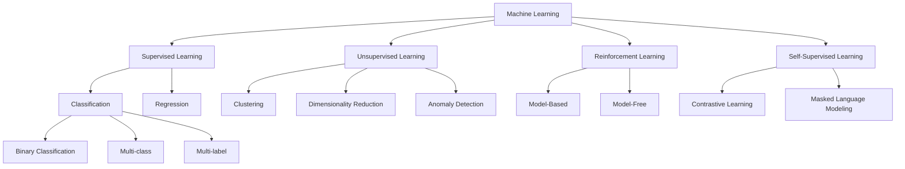
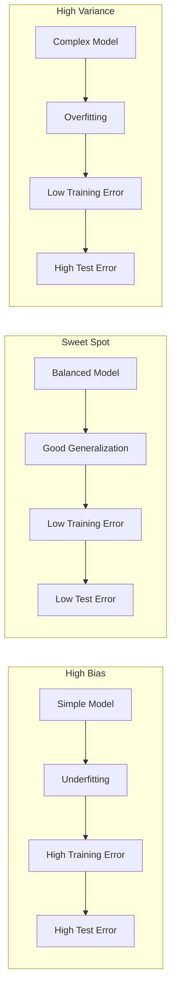
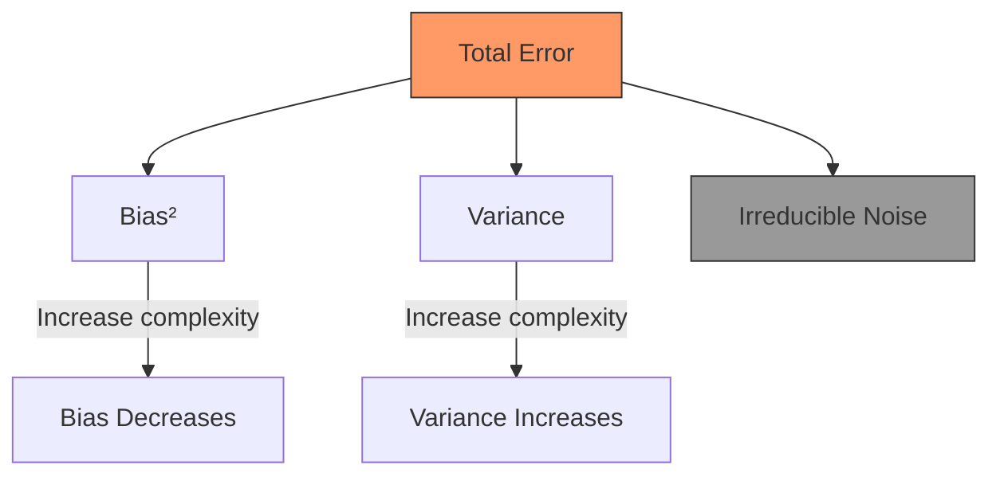
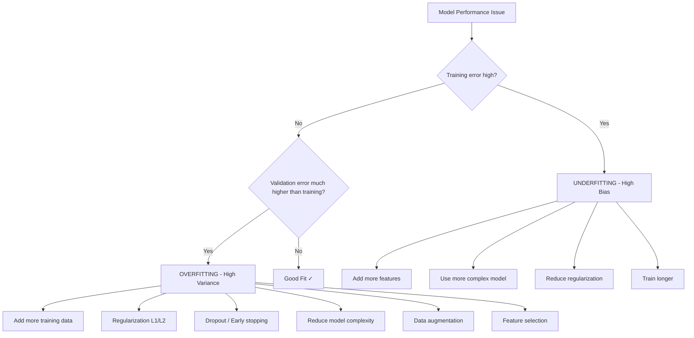
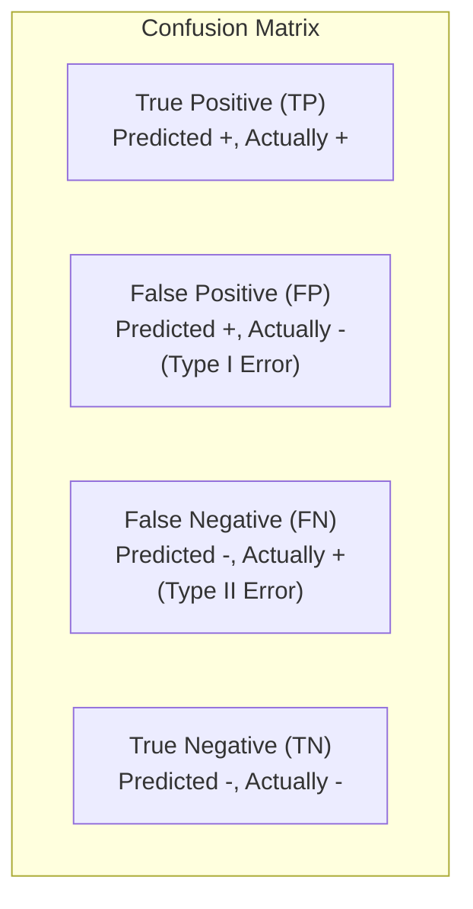
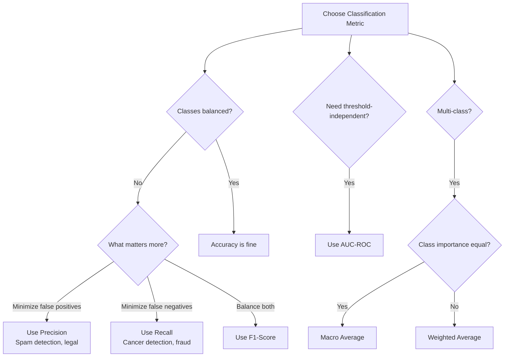
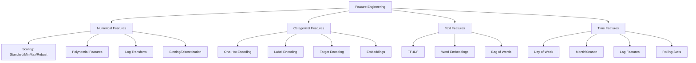
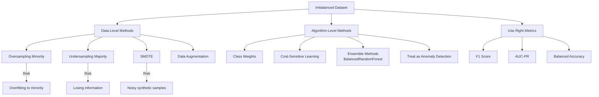
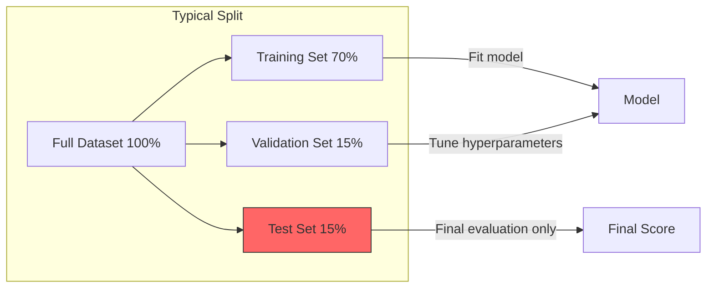

# 01 - Machine Learning Fundamentals

## Table of Contents

- [01 - Machine Learning Fundamentals](#01---machine-learning-fundamentals)
  - [Table of Contents](#table-of-contents)
  - [Types of Machine Learning](#types-of-machine-learning)
  - [Bias-Variance Tradeoff](#bias-variance-tradeoff)
  - [Overfitting \& Underfitting](#overfitting--underfitting)
  - [Cross-Validation](#cross-validation)
  - [Evaluation Metrics](#evaluation-metrics)
    - [Classification Metrics](#classification-metrics)
    - [Regression Metrics](#regression-metrics)
  - [Feature Engineering \& Selection](#feature-engineering--selection)
    - [Feature Selection Methods](#feature-selection-methods)
  - [Data Preprocessing](#data-preprocessing)
    - [Handling Missing Values](#handling-missing-values)
    - [Handling Outliers](#handling-outliers)
  - [Regularization](#regularization)
  - [Handling Imbalanced Data](#handling-imbalanced-data)
  - [Train / Validation / Test Split](#train--validation--test-split)
  - [Quick Recall Summary](#quick-recall-summary)

---

## Types of Machine Learning



> **Q: What are the main types of machine learning?**
>
> **A:** There are four main paradigms:
>
> - **Supervised Learning**: Learn from labeled data (input→output pairs). Used for classification and regression. Examples: spam detection, house price prediction.
> - **Unsupervised Learning**: Find patterns in unlabeled data. Used for clustering, dimensionality reduction, anomaly detection. Examples: customer segmentation, PCA.
> - **Reinforcement Learning**: Agent learns by interacting with environment, receiving rewards/penalties. Examples: game playing, robotics, recommendation systems.
> - **Self-Supervised Learning**: Creates labels from data itself (pretext tasks). Key enabler of modern LLMs. Examples: BERT's masked language modeling, contrastive learning.

> **Q: What's the difference between classification and regression?**
>
> **A:** Classification predicts discrete categories (spam/not spam, cat/dog/bird), while regression predicts continuous values (house price, temperature). The key difference is the output space — discrete vs continuous. Some algorithms can do both (e.g., Decision Trees, Neural Networks).

> **Q: What is semi-supervised learning?**
>
> **A:** Uses a small amount of labeled data with a large amount of unlabeled data. Useful when labeling is expensive. Techniques include self-training, co-training, and graph-based methods. Example: medical imaging where expert labels are expensive.

---

## Bias-Variance Tradeoff





> **Q: Explain the bias-variance tradeoff.**
>
> **A:** The total prediction error decomposes into three parts:
>
> **Error = Bias² + Variance + Irreducible Noise**
>
> - **Bias**: Error from wrong assumptions in the model. High bias → model is too simple → underfits (misses patterns).
> - **Variance**: Error from sensitivity to training data fluctuations. High variance → model is too complex → overfits (learns noise).
> - **Irreducible noise**: Inherent data noise that no model can eliminate.
>
> The tradeoff: as model complexity increases, bias decreases but variance increases. The goal is to find the sweet spot that minimizes total error.
>
> **How to diagnose:**
>
> - High bias: both train and validation error are high
> - High variance: train error is low but validation error is high (big gap)
>
> **How to fix:**
>
> - High bias: more features, more complex model, less regularization
> - High variance: more data, fewer features, more regularization, ensemble methods

---

## Overfitting & Underfitting



> **Q: How do you detect and fix overfitting?**
>
> **A:**
> **Detection:** Training loss keeps decreasing but validation loss starts increasing. Large gap between train and validation performance.
>
> **Fixes:**
>
> 1. **More data** — the most effective solution
> 2. **Regularization** — L1 (Lasso), L2 (Ridge), Elastic Net
> 3. **Dropout** — randomly zero out neurons during training
> 4. **Early stopping** — stop training when validation loss starts increasing
> 5. **Data augmentation** — create synthetic variations of training data
> 6. **Reduce model complexity** — fewer parameters, simpler architecture
> 7. **Cross-validation** — better estimate of generalization performance
> 8. **Ensemble methods** — combine multiple models to reduce variance

---

## Cross-Validation

```mermaid
graph TD
    subgraph "K-Fold Cross Validation (K=5)"
        subgraph "Fold 1"
            F1[TEST | Train | Train | Train | Train]
        end
        subgraph "Fold 2"
            F2[Train | TEST | Train | Train | Train]
        end
        subgraph "Fold 3"
            F3[Train | Train | TEST | Train | Train]
        end
        subgraph "Fold 4"
            F4[Train | Train | Train | TEST | Train]
        end
        subgraph "Fold 5"
            F5[Train | Train | Train | Train | TEST]
        end
    end

    F1 --> AVG[Average Scores → Final Metric]
    F2 --> AVG
    F3 --> AVG
    F4 --> AVG
    F5 --> AVG
```

| Method                    | Description                                | When to Use                |
| ------------------------- | ------------------------------------------ | -------------------------- |
| **K-Fold**                | Split into K folds, rotate test set        | General purpose, K=5 or 10 |
| **Stratified K-Fold**     | K-Fold but preserves class distribution    | Imbalanced classification  |
| **Leave-One-Out (LOOCV)** | K = N (each sample is test once)           | Very small datasets        |
| **Time Series Split**     | Expanding window, never use future data    | Time series data           |
| **Group K-Fold**          | Keeps groups together (e.g., same patient) | Grouped/hierarchical data  |
| **Repeated K-Fold**       | Run K-Fold multiple times                  | More stable estimates      |

> **Q: Why use cross-validation instead of a single train/test split?**
>
> **A:** A single split gives a single, potentially unreliable estimate of model performance. Cross-validation:
>
> - Uses all data for both training and validation
> - Provides mean ± std of performance → more reliable estimate
> - Reduces the impact of a "lucky" or "unlucky" split
> - Helps detect overfitting more reliably
> - Especially important for small datasets where a single split may not be representative

> **Q: When would you NOT use K-Fold cross-validation?**
>
> **A:**
>
> - **Time series data**: Can't use random splits (data leakage from future). Use time series split instead.
> - **Very large datasets**: Computationally expensive; a single large holdout set is fine.
> - **Grouped data**: If samples are not independent (e.g., multiple images per patient), need group-aware splits.

---

## Evaluation Metrics

### Classification Metrics





| Metric        | Formula               | When to Use             | Example                      |
| ------------- | --------------------- | ----------------------- | ---------------------------- |
| **Accuracy**  | (TP+TN)/(TP+TN+FP+FN) | Balanced classes        | General classification       |
| **Precision** | TP/(TP+FP)            | Cost of FP is high      | Spam filter, legal discovery |
| **Recall**    | TP/(TP+FN)            | Cost of FN is high      | Cancer detection, fraud      |
| **F1 Score**  | 2·P·R/(P+R)           | Balance P and R         | Most imbalanced problems     |
| **F-beta**    | (1+β²)·P·R/(β²·P+R)   | Weighted P/R balance    | β>1 favors recall            |
| **AUC-ROC**   | Area under ROC curve  | Threshold-independent   | Model comparison             |
| **AUC-PR**    | Area under PR curve   | Severe class imbalance  | Rare event detection         |
| **Log Loss**  | -Σ y·log(p)           | Probability calibration | When probabilities matter    |

### Regression Metrics

| Metric   | Formula            | Properties                             |
| -------- | ------------------ | -------------------------------------- |
| **MSE**  | Σ(y-ŷ)²/n          | Penalizes large errors, differentiable |
| **RMSE** | √MSE               | Same unit as target                    |
| **MAE**  | Σ\|y-ŷ\|/n         | Robust to outliers                     |
| **R²**   | 1 - SS_res/SS_tot  | Proportion of variance explained (0-1) |
| **MAPE** | Σ\|y-ŷ\|/y · 100/n | Percentage, interpretable              |

> **Q: When would you use precision over recall?**
>
> **A:** Use **precision** when false positives are costly:
>
> - Spam filter: marking a legit email as spam is bad (user misses important email)
> - Legal document review: flagging irrelevant docs wastes lawyer time
> - Recommendation: showing irrelevant items annoys users
>
> Use **recall** when false negatives are costly:
>
> - Cancer screening: missing a cancer patient could be fatal
> - Fraud detection: missing fraud means financial loss
> - Security: missing a threat could be catastrophic
>
> Use **F1** when you need to balance both, especially with imbalanced classes where accuracy is misleading.

> **Q: Why is accuracy misleading for imbalanced datasets?**
>
> **A:** If 99% of emails are not spam, a model that always predicts "not spam" gets 99% accuracy but catches zero spam. Accuracy doesn't reflect performance on the minority class. Use F1-score, AUC-PR, or balanced accuracy instead.

> **Q: Explain AUC-ROC.**
>
> **A:** ROC curve plots True Positive Rate (Recall) vs False Positive Rate at various classification thresholds. AUC (Area Under Curve) summarizes this:
>
> - AUC = 1.0: perfect classifier
> - AUC = 0.5: random classifier (diagonal line)
> - AUC < 0.5: worse than random
>
> AUC is threshold-independent, making it great for comparing models. However, for severely imbalanced data, AUC-PR (Precision-Recall curve) is more informative.

---

## Feature Engineering & Selection



### Feature Selection Methods

| Method                         | Type           | How It Works                       | Pros                  | Cons                           |
| ------------------------------ | -------------- | ---------------------------------- | --------------------- | ------------------------------ |
| **Correlation**                | Filter         | Remove highly correlated features  | Fast, simple          | Only linear relationships      |
| **Mutual Information**         | Filter         | Measures feature-target dependency | Captures non-linear   | Can be slow                    |
| **Chi-Square**                 | Filter         | Test independence (categorical)    | Simple, interpretable | Only categorical               |
| **L1 (Lasso)**                 | Embedded       | Drives coefficients to zero        | Automatic selection   | Linear model only              |
| **Tree Importance**            | Embedded       | Feature importance from trees      | Handles non-linear    | Biased toward high-cardinality |
| **RFE**                        | Wrapper        | Recursively remove least important | Good performance      | Computationally expensive      |
| **Forward/Backward Selection** | Wrapper        | Add/remove features greedily       | Finds good subsets    | Very slow for many features    |
| **SHAP Values**                | Model-Agnostic | Shapley values for each feature    | Theoretically sound   | Computationally expensive      |

> **Q: What's the difference between filter, wrapper, and embedded methods for feature selection?**
>
> **A:**
>
> - **Filter methods**: Rank features by statistical measures (correlation, mutual information) independent of any model. Fast but may miss feature interactions.
> - **Wrapper methods**: Use a model to evaluate feature subsets (forward selection, backward elimination, RFE). Better results but computationally expensive.
> - **Embedded methods**: Feature selection happens during model training (L1 regularization, tree-based importance). Good balance of speed and performance.

---

## Data Preprocessing

```mermaid
flowchart LR
    RAW[Raw Data] --> EDA[EDA & Understanding]
    EDA --> MISS[Handle Missing Values]
    MISS --> OUT[Handle Outliers]
    OUT --> ENC[Encode Categoricals]
    ENC --> SCALE[Scale Numericals]
    SCALE --> FS[Feature Selection]
    FS --> SPLIT[Train/Val/Test Split]
    SPLIT --> READY[Ready for Modeling]
```



### Handling Missing Values

| Strategy                   | When to Use                    | Method                                    |
| -------------------------- | ------------------------------ | ----------------------------------------- |
| **Drop rows**              | Small % missing, large dataset | `df.dropna()`                             |
| **Drop columns**           | >50% missing in column         | `df.drop(columns=...)`                    |
| **Mean/Median imputation** | Numerical, MCAR                | `SimpleImputer(strategy='mean')`          |
| **Mode imputation**        | Categorical                    | `SimpleImputer(strategy='most_frequent')` |
| **KNN imputation**         | Data has structure             | `KNNImputer(n_neighbors=5)`               |
| **Model-based**            | Complex patterns               | `IterativeImputer`                        |
| **Indicator column**       | Missingness is informative     | Add binary "is_missing" feature           |

> **Q: What types of missing data are there?**
>
> **A:**
>
> - **MCAR (Missing Completely At Random)**: Missingness unrelated to any variable. Safe to drop or impute with mean.
> - **MAR (Missing At Random)**: Missingness depends on observed variables. Use model-based imputation.
> - **MNAR (Missing Not At Random)**: Missingness depends on the missing value itself (e.g., high-income people don't report income). Hardest to handle — may need domain knowledge or indicator features.

### Handling Outliers

| Method             | Description                                |
| ------------------ | ------------------------------------------ |
| **Z-Score**        | Remove if \|z\| > 3                        |
| **IQR**            | Remove if < Q1 - 1.5×IQR or > Q3 + 1.5×IQR |
| **Winsorization**  | Cap at percentiles (e.g., 1st and 99th)    |
| **Log Transform**  | Reduce impact of extreme values            |
| **Robust Scaling** | Use median/IQR instead of mean/std         |

---

## Regularization

```mermaid
graph TD
    REG[Regularization] --> L1[L1 - Lasso<br/>λΣ|w|]
    REG --> L2[L2 - Ridge<br/>λΣw²]
    REG --> EN[Elastic Net<br/>αL1 + (1-α)L2]

    L1 --> SPARSE[Sparse weights<br/>Feature selection<br/>Some weights = 0]
    L2 --> SMALL[Small weights<br/>No zeros<br/>Handles multicollinearity]
    EN --> BOTH[Best of both<br/>Groups of correlated features]
```

> **Q: What's the difference between L1 and L2 regularization?**
>
> **A:**
>
> | Property            | L1 (Lasso)                              | L2 (Ridge)                    |
> | ------------------- | --------------------------------------- | ----------------------------- |
> | Penalty             | λΣ\|w\|                                 | λΣw²                          |
> | Effect on weights   | Drives some to exactly 0                | Shrinks all toward 0          |
> | Feature selection   | Yes (sparse solution)                   | No (keeps all features)       |
> | Multicollinearity   | Picks one feature from correlated group | Keeps all, distributes weight |
> | Solution uniqueness | May not be unique                       | Always unique                 |
> | Geometry            | Diamond constraint (corners on axes)    | Circle constraint (smooth)    |
>
> **Why L1 produces zeros:** The diamond-shaped constraint region has corners on the axes. The loss function contour is more likely to hit a corner (where some weight = 0) than a smooth surface.
>
> **Elastic Net** = αL1 + (1-α)L2: combines both. Use when you have correlated features and want some sparsity.

---

## Handling Imbalanced Data



> **Q: How do you handle imbalanced datasets?**
>
> **A:** Multi-pronged approach:
>
> 1. **Metrics first**: Stop using accuracy. Use F1, AUC-PR, balanced accuracy.
> 2. **Data resampling**:
>    - Oversampling: SMOTE (creates synthetic minority samples by interpolation)
>    - Undersampling: Random or Tomek links (remove borderline majority samples)
>    - Combination: SMOTE + Tomek links
> 3. **Algorithm-level**:
>    - Class weights: `class_weight='balanced'` in sklearn
>    - Cost-sensitive learning: penalize minority misclassification more
> 4. **Ensemble approaches**: BalancedRandomForest, EasyEnsemble
> 5. **Threshold tuning**: Adjust classification threshold based on PR curve
>
> **SMOTE** (Synthetic Minority Over-sampling Technique): For each minority sample, find k nearest minority neighbors, create synthetic samples along the line connecting them. Better than simple duplication because it creates diverse synthetic examples.

---

## Train / Validation / Test Split



> **Q: Why do we need three splits (train/val/test) instead of just two?**
>
> **A:**
>
> - **Training set**: Used to fit model parameters (weights)
> - **Validation set**: Used to tune hyperparameters and select the best model. You peek at this repeatedly → your choices become optimized for it.
> - **Test set**: Used ONCE at the very end for unbiased performance estimate. Never used for any decisions.
>
> Without a separate test set, your reported performance would be optimistic because you already optimized for the validation set. The test set gives the true generalization estimate.
>
> **Common mistake**: Using test set during development → data leakage → overly optimistic estimates.

> **Q: What is data leakage and how do you prevent it?**
>
> **A:** Data leakage occurs when information from outside the training set leaks into the model:
>
> **Types:**
>
> 1. **Target leakage**: Feature that contains information about the target (e.g., using future data to predict past)
> 2. **Train-test contamination**: Preprocessing (scaling, imputation) fit on full data instead of training set only
>
> **Prevention:**
>
> - Always split before any preprocessing
> - Fit preprocessors on training data only, transform all sets
> - Use sklearn Pipelines to prevent leakage
> - Be suspicious of "too good to be true" results
> - Check feature importance — if one feature dominates, investigate

---

## Quick Recall Summary

| Concept          | Key Point                                                            |
| ---------------- | -------------------------------------------------------------------- |
| Bias-Variance    | Error = Bias² + Variance + Noise. Balance complexity.                |
| Overfitting      | Train ↓ Val ↑ = overfitting. Fix: regularization, more data, dropout |
| Underfitting     | Both high = underfitting. Fix: more features, complex model          |
| Cross-Validation | K-Fold for reliable estimates. Stratified for imbalanced.            |
| Precision        | "Of predicted positives, how many correct?" Use when FP costly.      |
| Recall           | "Of actual positives, how many found?" Use when FN costly.           |
| F1               | Harmonic mean of P & R. Use for imbalanced classes.                  |
| AUC-ROC          | Threshold-independent. 1.0 = perfect, 0.5 = random.                  |
| L1 vs L2         | L1 = sparse/feature selection. L2 = small weights/multicollinearity. |
| Data Leakage     | Split first, then preprocess. Fit on train only.                     |
| Imbalanced Data  | SMOTE + class weights + F1/AUC-PR metrics                            |
