# 02 - Classical Machine Learning Algorithms

## Table of Contents
- [Algorithm Selection Flowchart](#algorithm-selection-flowchart)
- [Linear Regression](#linear-regression)
- [Logistic Regression](#logistic-regression)
- [Decision Trees](#decision-trees)
- [Random Forest](#random-forest)
- [Gradient Boosting (XGBoost, LightGBM)](#gradient-boosting)
- [Support Vector Machines (SVM)](#support-vector-machines)
- [K-Nearest Neighbors (KNN)](#k-nearest-neighbors)
- [Naive Bayes](#naive-bayes)
- [Clustering: K-Means, DBSCAN, Hierarchical](#clustering)
- [Dimensionality Reduction: PCA, t-SNE, UMAP](#dimensionality-reduction)
- [Ensemble Methods Overview](#ensemble-methods-overview)

---

## Algorithm Selection Flowchart

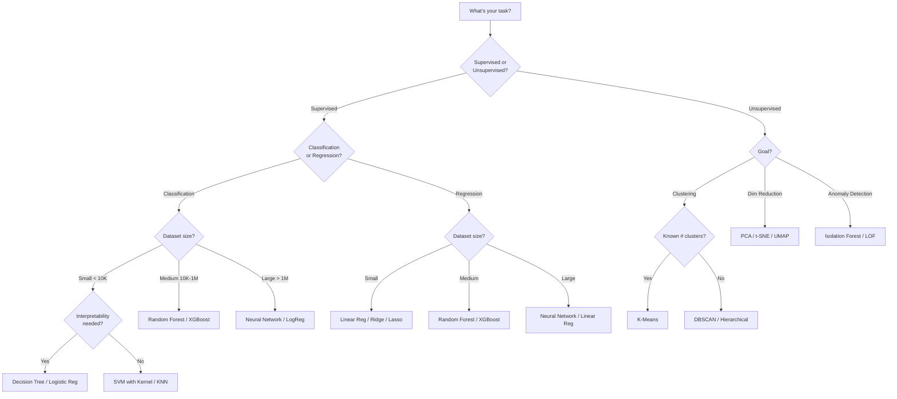

---

## Linear Regression

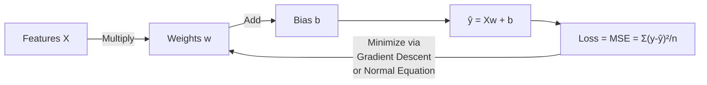

**Model:** ŷ = w₁x₁ + w₂x₂ + ... + wₙxₙ + b

**Training Methods:**
- **Normal Equation:** w = (X^TX)⁻¹X^Ty — closed-form, O(n³), good for small data
- **Gradient Descent:** Iterative optimization, scales better

**Key Assumptions:**
1. Linear relationship between X and y
2. Independence of errors
3. Homoscedasticity (constant variance of errors)
4. No multicollinearity among features
5. Normal distribution of errors

| Variant | Regularization | Use Case |
|---------|---------------|----------|
| **OLS** | None | Baseline |
| **Ridge** | L2: λΣw² | Multicollinear features |
| **Lasso** | L1: λΣ\|w\| | Feature selection |
| **Elastic Net** | αL1 + (1-α)L2 | Best of both |

> **Q: What are the assumptions of Linear Regression and what happens when they're violated?**
>
> **A:**
> 1. **Linearity**: If violated → polynomial features or non-linear model
> 2. **Independence**: If violated (autocorrelation) → time series models
> 3. **Homoscedasticity**: If violated → weighted least squares or transform target
> 4. **No multicollinearity**: If violated → Ridge regression or drop correlated features (check VIF > 5)
> 5. **Normal errors**: If violated → still works for estimation, but inference (p-values) unreliable
>
> Check assumptions with: residual plots, Q-Q plots, VIF scores, Durbin-Watson test.

> **Q: When would you use Ridge vs Lasso vs Elastic Net?**
>
> **A:**
> - **Ridge**: When you believe all features are relevant and correlated. Shrinks all coefficients but never zeros them out.
> - **Lasso**: When you want automatic feature selection (sparse model). Drives irrelevant feature weights to exactly 0.
> - **Elastic Net**: When features are correlated AND you want sparsity. Lasso struggles with correlated features (picks one randomly); Elastic Net handles groups better.

---

## Logistic Regression

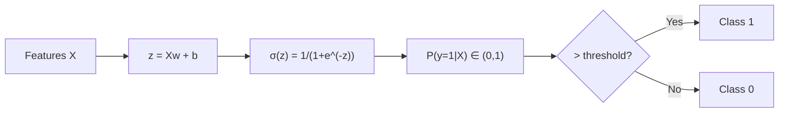

**Key Points:**
- Despite the name, it's a **classification** algorithm
- Uses sigmoid function to output probabilities
- Decision boundary is linear (or non-linear with polynomial features)
- Loss function: **Binary Cross-Entropy** = -Σ[y·log(p) + (1-y)·log(1-p)]
- Optimized via gradient descent (no closed-form solution)
- Can be extended to multiclass via **One-vs-Rest** or **Softmax (Multinomial)**

> **Q: Why use cross-entropy loss instead of MSE for classification?**
>
> **A:** MSE with sigmoid creates a non-convex loss surface with many local minima. Cross-entropy loss is convex for logistic regression, guaranteeing a global optimum. Also, cross-entropy penalizes confident wrong predictions much more heavily — if model predicts 0.99 but true label is 0, cross-entropy loss is very high (-log(0.01) ≈ 4.6), while MSE would only be 0.98.

> **Q: How does Logistic Regression handle multiclass?**
>
> **A:** Two approaches:
> - **One-vs-Rest (OvR)**: Train K binary classifiers, each separating one class from all others. Predict class with highest confidence.
> - **Softmax/Multinomial**: Single model with K output nodes, softmax activation. Directly models P(y=k|X) for all K classes. More principled but assumes single label.

---

## Decision Trees

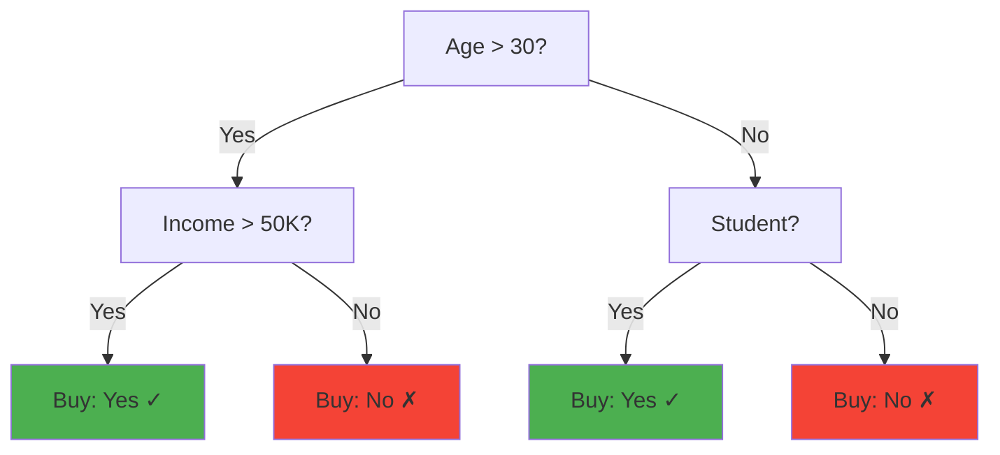

**Splitting Criteria:**

| Criterion | Used For | Formula | Framework |
|-----------|----------|---------|-----------|
| **Gini Impurity** | Classification | 1 - Σpᵢ² | CART (sklearn default) |
| **Entropy/Info Gain** | Classification | -Σpᵢ·log₂(pᵢ) | ID3, C4.5 |
| **MSE** | Regression | Σ(y-ȳ)²/n | CART regression |

> **Q: How does a Decision Tree decide which feature to split on?**
>
> **A:** At each node, the tree evaluates all possible features and split points. It chooses the split that maximizes **information gain** (reduction in impurity):
>
> Information Gain = Impurity(parent) - Weighted Average Impurity(children)
>
> For **Gini**: Gini(node) = 1 - Σpᵢ² where pᵢ is the proportion of class i.
> Pure node: Gini = 0. Most impure (binary): Gini = 0.5.
>
> For **Entropy**: H(node) = -Σpᵢ·log₂(pᵢ). Pure node: H = 0. Most impure: H = 1.
>
> In practice, Gini and Entropy give very similar results. Gini is slightly faster to compute (no log).

> **Q: What are the pros and cons of Decision Trees?**
>
> **A:**
> **Pros:** Interpretable (white-box), handles non-linear relationships, no scaling needed, handles mixed feature types, automatic feature selection, fast inference.
>
> **Cons:** Prone to overfitting (high variance), unstable (small data change → different tree), biased toward high-cardinality features, can't extrapolate.
>
> **Fix overfitting:** Pruning (max_depth, min_samples_leaf), ensemble methods.

---

## Random Forest

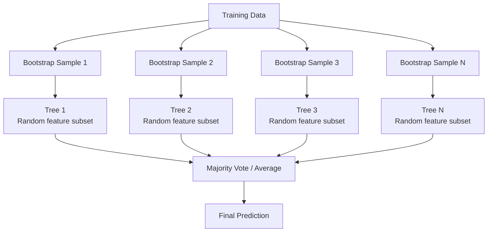

**Key Concepts:**
- **Bagging** (Bootstrap Aggregating): Each tree trained on random sample with replacement
- **Feature Randomness**: Each split considers random subset of features (sqrt(n) for classification, n/3 for regression)
- **Two sources of randomness**: Data sampling + Feature sampling → decorrelated trees

| Hyperparameter | Effect |
|---------------|--------|
| **n_estimators** | More trees = better (diminishing returns after ~100-500) |
| **max_depth** | Limits tree depth. None = grow fully |
| **max_features** | Features per split. 'sqrt' for classification |
| **min_samples_leaf** | Minimum samples in leaf. Regularization. |
| **n_jobs** | Parallelism (-1 for all cores) |

> **Q: Why does Random Forest work better than a single Decision Tree?**
>
> **A:** Random Forest reduces variance without increasing bias significantly:
> 1. **Bagging**: Averaging multiple high-variance models reduces variance (σ²/n if independent)
> 2. **Feature randomness**: Decorrelates the trees, making the averaging more effective
> 3. **Out-of-Bag (OOB) estimate**: ~37% of data not in each bootstrap sample → free validation
>
> Single tree: low bias, high variance. Random Forest: low bias, lower variance. This is why RF rarely overfits as you add more trees.

---

## Gradient Boosting

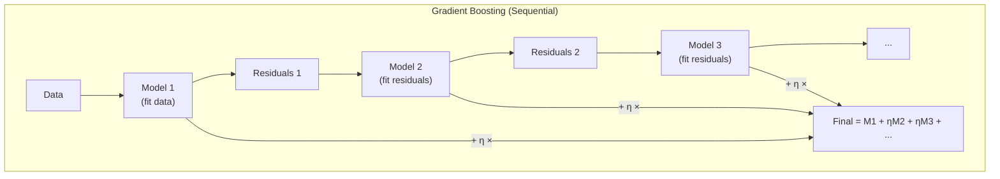

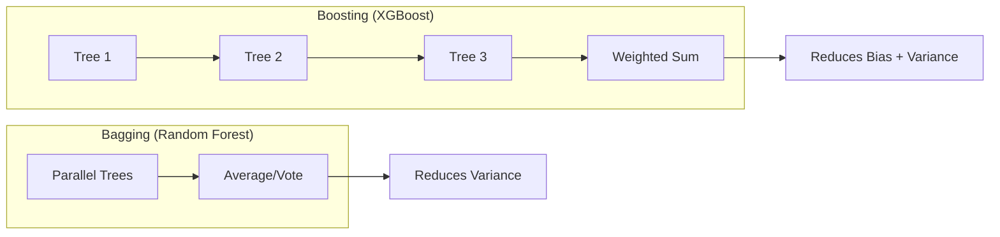

### XGBoost vs LightGBM vs CatBoost

| Feature | XGBoost | LightGBM | CatBoost |
|---------|---------|----------|----------|
| **Tree Growth** | Level-wise | Leaf-wise (faster) | Symmetric |
| **Speed** | Medium | Fastest | Slower training |
| **Categorical Features** | Manual encoding needed | Native support | Best native support |
| **Missing Values** | Native handling | Native handling | Native handling |
| **GPU Support** | Yes | Yes | Yes |
| **Best For** | General purpose | Large datasets, speed | Categorical-heavy data |
| **Overfitting Risk** | Medium | Higher (leaf-wise) | Lower (ordered boosting) |

> **Q: When would you use Random Forest vs XGBoost?**
>
> **A:**
> **Random Forest when:**
> - Quick baseline needed (fewer hyperparameters to tune)
> - Overfitting is a concern (RF is more robust)
> - Parallel training needed (RF trains trees in parallel)
> - Interpretability via feature importance is sufficient
>
> **XGBoost/Gradient Boosting when:**
> - Maximum predictive performance needed
> - You have time for hyperparameter tuning
> - Structured/tabular data competitions
> - Built-in handling of missing values is useful
>
> **Rule of thumb:** Start with RF for baseline, try XGBoost/LightGBM for better performance. For tabular data, gradient boosting usually wins.

> **Q: Explain how gradient boosting works step by step.**
>
> **A:**
> 1. Start with a simple prediction (e.g., mean of target)
> 2. Compute residuals (errors) = actual - predicted
> 3. Fit a weak learner (shallow tree) to predict the residuals
> 4. Add this tree's predictions (scaled by learning rate η) to the ensemble
> 5. Compute new residuals
> 6. Repeat steps 3-5 for N iterations
>
> **Final prediction** = initial + η·tree₁ + η·tree₂ + ... + η·treeₙ
>
> Key: each tree corrects the mistakes of the previous ensemble. Learning rate η (0.01-0.3) controls how much each tree contributes → smaller η needs more trees but generalizes better.

---

## Support Vector Machines

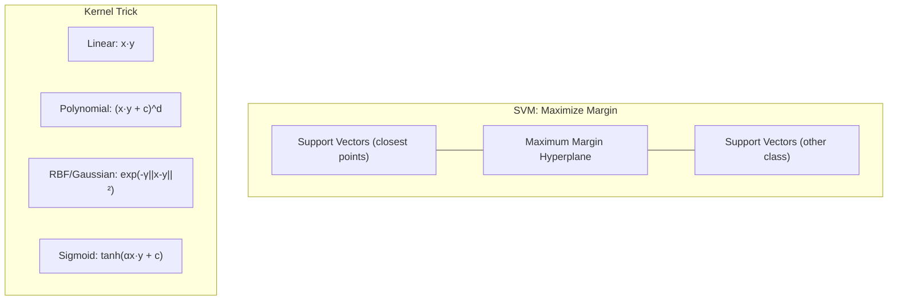

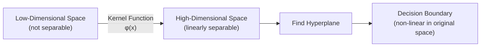

**Key Concepts:**
- **Margin**: Distance between hyperplane and nearest points (support vectors)
- **Hard margin**: No misclassifications allowed (works only if linearly separable)
- **Soft margin**: Allow some misclassifications. C parameter controls tradeoff (high C = narrow margin, low error; low C = wide margin, some errors)
- **Kernel trick**: Map data to higher dimensions implicitly (never compute the actual transformation)

> **Q: Explain how SVM works with kernels.**
>
> **A:** SVM finds the hyperplane that maximizes the margin between classes. When data isn't linearly separable:
>
> 1. **Kernel trick**: Instead of explicitly mapping to high dimensions, compute inner products in high-dimensional space using a kernel function K(x,y) = φ(x)·φ(y)
> 2. **RBF kernel** (most popular): K(x,y) = exp(-γ||x-y||²). Acts like measuring similarity — close points → high value, far points → low value. γ controls the "reach" of each point.
> 3. The optimization only depends on inner products, so kernels make it computationally feasible.
>
> **Hyperparameters:** C (regularization), γ (kernel width for RBF). High C + high γ → overfit. Low C + low γ → underfit.

> **Q: What are support vectors?**
>
> **A:** Support vectors are the training points closest to the decision boundary (on the margin). They "support" the hyperplane — if you remove non-support-vector points, the boundary doesn't change. The SVM solution depends ONLY on support vectors, which makes it memory-efficient. Typically only a small fraction of training points are support vectors.

---

## K-Nearest Neighbors

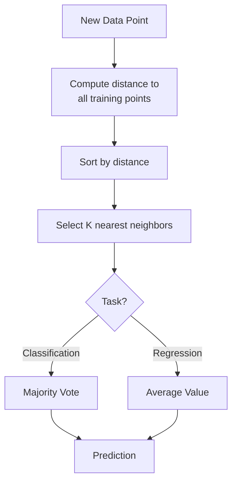

| Aspect | Details |
|--------|---------|
| **Type** | Instance-based / Lazy learning (no training phase) |
| **K value** | Small K → complex boundary (overfit). Large K → smooth boundary (underfit). Use odd K for binary. |
| **Distance** | Euclidean (default), Manhattan, Minkowski, Cosine |
| **Scaling** | MUST scale features (distance-based) |
| **Complexity** | O(n·d) per prediction — slow for large datasets |
| **Curse of dimensionality** | Performance degrades in high dimensions |

> **Q: What is the curse of dimensionality and how does it affect KNN?**
>
> **A:** As dimensions increase:
> 1. Distances between points become similar (all points are "far" from each other)
> 2. The concept of "nearest" becomes meaningless
> 3. Need exponentially more data to maintain point density
>
> For KNN, this means neighbors are not meaningful in high-D. **Fix**: Dimensionality reduction (PCA) before KNN, or use a different algorithm.

---

## Naive Bayes

**Bayes Theorem:** P(Class|Features) = P(Features|Class) · P(Class) / P(Features)

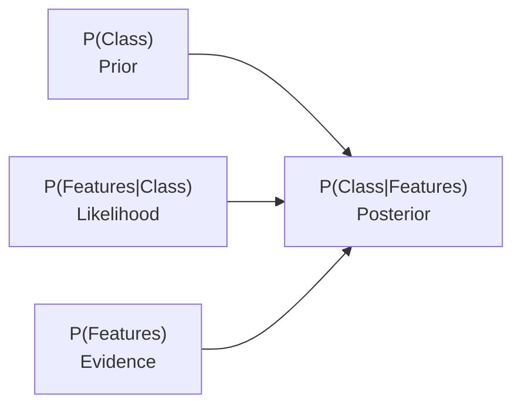

**"Naive" Assumption:** All features are conditionally independent given the class.

| Variant | Feature Type | Example |
|---------|-------------|---------|
| **Gaussian NB** | Continuous (normal distribution) | General continuous data |
| **Multinomial NB** | Counts/frequencies | Text classification (word counts) |
| **Bernoulli NB** | Binary features | Text (word presence/absence) |

> **Q: Why does Naive Bayes work well despite the "naive" independence assumption?**
>
> **A:** Even though features are rarely truly independent:
> 1. Classification only needs the correct **ranking** of P(class|features), not exact probabilities
> 2. Errors from the independence assumption often cancel out across features
> 3. Works especially well when: features are approximately independent, small dataset, high-dimensional data (text)
> 4. Very fast training and prediction, good baseline
>
> **Limitation:** Can't model feature interactions. Probability estimates are poorly calibrated (too extreme).

---

## Clustering

### K-Means

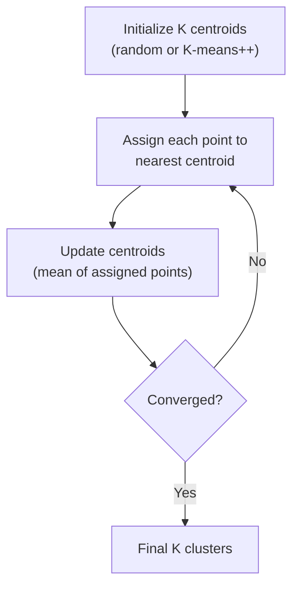

### Clustering Comparison

| Algorithm | Shape | # Clusters | Scalability | Outliers |
|-----------|-------|-----------|-------------|----------|
| **K-Means** | Spherical | Must specify K | O(nKt) — fast | Sensitive |
| **DBSCAN** | Arbitrary | Auto-detected | O(n log n) | Robust (marks as noise) |
| **Hierarchical** | Arbitrary | Cut dendrogram | O(n²) — slow | Depends on linkage |
| **GMM** | Elliptical | Must specify K | Medium | Somewhat robust |

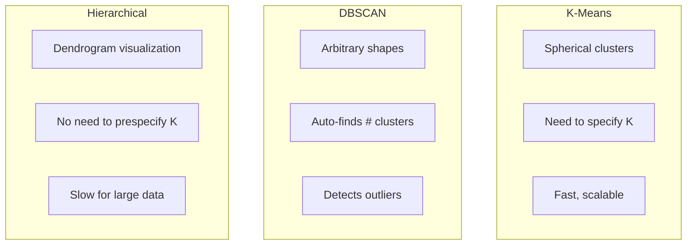

> **Q: How do you choose K in K-Means?**
>
> **A:** Several methods:
> 1. **Elbow method**: Plot inertia (within-cluster sum of squares) vs K. Look for the "elbow" where improvement slows.
> 2. **Silhouette score**: Measures how similar a point is to its own cluster vs nearest cluster. Range [-1, 1], higher is better.
> 3. **Gap statistic**: Compares within-cluster dispersion to a null reference distribution.
> 4. **Domain knowledge**: Sometimes K is known (e.g., customer segments).
>
> **K-Means++ initialization** is crucial — picks initial centroids to be spread apart, leading to better and more consistent results than random initialization.

---

## Dimensionality Reduction

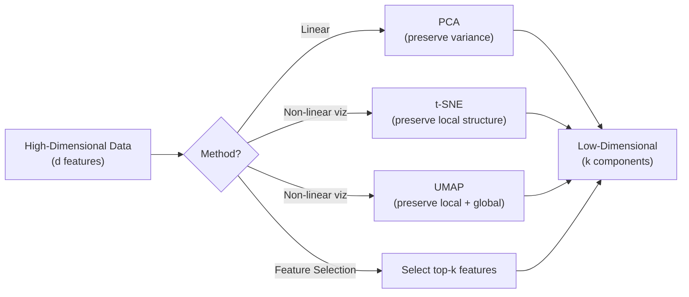

### PCA (Principal Component Analysis)

| Step | Description |
|------|-------------|
| 1 | Standardize the data (zero mean, unit variance) |
| 2 | Compute covariance matrix |
| 3 | Compute eigenvectors and eigenvalues |
| 4 | Sort eigenvectors by decreasing eigenvalue |
| 5 | Select top-k eigenvectors (principal components) |
| 6 | Project data onto these components |

> **Q: How does PCA work and what are eigenvalues?**
>
> **A:** PCA finds orthogonal directions (principal components) that maximize variance in the data.
>
> - **Eigenvectors** of the covariance matrix = directions of maximum variance (the principal components)
> - **Eigenvalues** = amount of variance explained by each component
> - First PC captures most variance, second PC captures most remaining variance (perpendicular to first), etc.
>
> **Choosing # components:** Keep enough to explain 95% of variance (cumulative explained variance ratio).
>
> **Limitations:** Linear only, loses interpretability, sensitive to scaling (MUST standardize first).

| Method | PCA | t-SNE | UMAP |
|--------|-----|-------|------|
| **Type** | Linear | Non-linear | Non-linear |
| **Preserves** | Global variance | Local structure | Local + some global |
| **Speed** | Fast O(d²n) | Slow O(n²) | Fast O(n log n) |
| **Deterministic** | Yes | No (random init) | No |
| **Use for** | Preprocessing, noise reduction | 2D/3D visualization | Visualization + preprocessing |
| **New data** | Can transform | Must rerun | Can transform |

---

## Ensemble Methods Overview

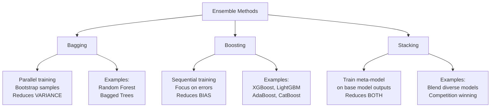

| Method | Training | Focus | Reduces | Risk |
|--------|----------|-------|---------|------|
| **Bagging** | Parallel | Different data subsets | Variance | Low overfitting |
| **Boosting** | Sequential | Previous errors | Bias (+ Variance) | Can overfit |
| **Stacking** | Two-level | Model diversity | Both | Complex, needs careful CV |

> **Q: What's the difference between bagging and boosting?**
>
> **A:**
> - **Bagging**: Train multiple models independently on random subsets (with replacement). Combine by averaging/voting. Reduces variance. Models are parallel and independent. Example: Random Forest.
> - **Boosting**: Train models sequentially, each focusing on errors of the previous. Combine by weighted sum. Reduces bias. Models are dependent. Example: XGBoost.
>
> **Key insight**: Bagging works best with high-variance models (deep trees). Boosting works best with high-bias models (shallow trees/stumps). Both can achieve similar final performance, but boosting typically edges out in accuracy.

---

## Quick Recall Summary

| Algorithm | Type | Key Strength | Key Weakness | When to Use |
|-----------|------|-------------|--------------|-------------|
| Linear Regression | Regression | Interpretable, fast | Linear only | Baseline, interpretability |
| Logistic Regression | Classification | Probabilistic, interpretable | Linear boundary | Baseline, probability needed |
| Decision Tree | Both | Interpretable, no scaling | Overfitting | Interpretability, small data |
| Random Forest | Both | Robust, parallel | Memory, not interpretable | General purpose baseline |
| XGBoost | Both | Best accuracy (tabular) | Tuning needed | Competitions, tabular data |
| SVM | Classification | Works in high-D | Slow, kernel selection | Small-medium data, high-D |
| KNN | Both | Simple, no training | Slow prediction, curse of dim | Small data, few features |
| Naive Bayes | Classification | Fast, works with small data | Independence assumption | Text, baseline |
| K-Means | Clustering | Fast, simple | Spherical, need K | Known # clusters |
| DBSCAN | Clustering | Arbitrary shapes, outliers | Density varies | Unknown # clusters |
| PCA | Dim Reduction | Fast, variance preserved | Linear only | Preprocessing, viz |
